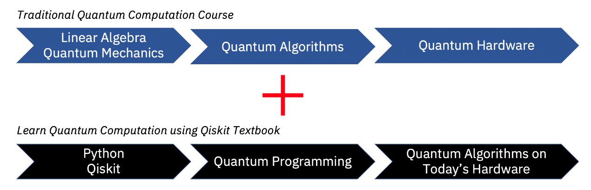

# <center><font size=20>使用 Qiskit 学习量子计算 - 翻译版</font></center>


<center></center> 


<p align="right"><font size=5>https://qiskit.org/</font></p>

  


<center><font size=5>中文版译者：徐柳青

电话：18616020096（Wechat）

电子邮件：<45045590@qq.com>

Github：https://github.com/xushengun/

日期：20201016</font></center>


# 前言


来自Qiskit社区团队的问候!本教程是Qiskit的大学量子算法/计算课程的补充：

1.  量子算法背后的数学

2.  当今非容错量子设备的细节

3.  用Qiskit编写代码并在IBM的云量子系统上实现量子算法

关于本教程
----------

这是一个免费的数字版教程，在使用Qiskit
SDK的同时通过本教程教授量子计算的概念。

以内联方式运行代码
------------------

本教程构建于可以轻松阅读的jupyter
notebook框架上，同时也可以让读者能够直接在本教程中编辑和运行代码。本教程的某些章也可以在IBM
Quantum Experience中以jupyter notebook的格式打开而无需安装！

> print(\"This code works!\")
>
> This code works!
>
> from qiskit import QuantumCircuit
>
> qc = QuantumCircuit(2) \# Create circuit with 2 qubits
>
> qc.h(0) \# Do H-gate on q0
>
> qc.cx(0,1) \# Do CNOT on q1 controlled by q0
>
> qc.measure_all()
>
> qc.draw()


学习真正的量子系统
------------------

最好的学习方法是实践。Qiskit允许用户在舒适的家中使用最先进的量子设备进行实验。本教程不仅教授理论量子计算，而且还教授实现理论的实验量子物理。


使用本教程的方法
----------------

### 课程整合

本教程可以作为一个独立的课程，但其最初目的是为配合传统的大学课程而设计。本教程向学生展示了如何使用Qiskit来进行量子算法和硬件的实验，并以此来加强他们的理解。



### 路线图

Qiskit教程中涵盖了广泛的材料，并非所有的材料可以在一个单一课程中揭示。读者可以使用下面的指南来调整需要学习的部分。但是，下面的指南仅是使用本教程的一种建议方法。


信誉
----

### 联系方式

如果您对本教程有任何疑问或建议，或者想将其纳入您的课程表，请联系Frank
Harkins（Francis.Harkins\@ibm.com）。本着开放源代码的精神，在此GitHub存储库中欢迎任何章节的贡献。

### 贡献者

本教程是多人工作的结果。如果在工作中使用本教程，请引用[bib文件](https://github.com/Qiskit/qiskit-textbook/blob/master/content/qiskit-textbook.bib)或直接引用：

*Abraham Asfaw, Luciano Bello, Yael Ben-Haim, Sergey Bravyi, Lauren
Capelluto, Almudena Carrera Vazquez, Jack Ceroni, Richard Chen, Albert
Frisch, Jay Gambetta, Shelly Garion, Leron Gil, Salvador De La Puente
Gonzalez, Francis Harkins, Takashi Imamichi, David McKay, Antonio
Mezzacapo, Zlatko Minev, Ramis Movassagh, Giacomo Nannicni, Paul Nation,
Anna Phan, Marco Pistoia, Arthur Rattew, Joachim Schaefer, Javad
Shabani, John Smolin, Kristan Temme, Madeleine Tod, Stephen Wood, James
Wootton.*

## 下载

### Docker

```
docker pull apachecn0/lqcuq-zh
docker run -tid -p <port>:80 apachecn0/lqcuq-zh
# 访问 http://localhost:{port} 查看文档
```

### PYPI

```
pip install lqcuq-zh
lqcuq-zh <port>
# 访问 http://localhost:{port} 查看文档
```

### NPM

```
npm install -g lqcuq-zh
lqcuq-zh <port>
# 访问 http://localhost:{port} 查看文档
```
