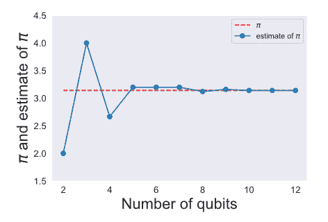

游戏与演示
==========

游戏和演示是一种可以增强您在量子计算过程中所学概念的有趣方式。我们已在本教程的适当位置给出了相应的内容为了您可以轻松地进行查找，此处将其再次列出。

Hello Qiskit Game：量子比特与量子游戏入门的简单拼图。

使用 QPE 估计$\pi$的值：使用量子相位估计算法来估计$\pi$的值。

Hello Qiskit Game
-----------------

**注：本节内容比较简单且需要操作，建议读者自行阅读原版线上教程。**

使用量子相位估计算法来估计$\mathbf{\pi}$的值
--------------------------------------------

### 1 量子相位估计算法概述

量子相位估计（QPE）是一种量子算法，其构成了许多更复杂量子算法的基础。QPE 的核心是解决一个相当简单的问题：给定算符$U$以及在$U|\psi\rangle = \exp(2\pi i\theta)|\psi\rangle$时$U$的本征值量子态$|\psi\rangle$，能够获得$\theta$的一个估计？

答案当然是肯定。QPE 算法给出了$2^{n}\theta$，其中$n$是用于估计相位$\theta$的量子比特数量。

### 2 估计$\mathbf{\pi}$

在本次演示中，我们选中：

$$U = u_{1}(\theta),|\psi\rangle = |1\rangle$$

其中：

$$u_{1}(\theta) = \begin{bmatrix}
1 & 0 \\
0 & \exp\left( \text{iθ} \right) \\
\end{bmatrix}$$

是 Qiskit 中可用的量子门之一，并且：

$$u_{1}(\theta)|1\rangle = \exp(i\theta)|1\rangle$$

通过将量子门的相位设定为$\theta = 1$，我们可以使用以下两个关系式来求解$\pi$：

1.  从 QPE 算法的输出中测量对$2^{n}\theta$的估计。然后$\theta = \text{measured}/2^{n}$

2.  从上述$u_{1}(\theta)$的定义中得知$2\pi\theta = 1 \Rightarrow \pi = 1/2\theta$

组合此两个关系：$\pi = 1/(2 \times (\text{(measured)}/2^{n}))$。

若要详细了解 QPE 算法，请本教程中的相关章节。

### 3 编写代码

导入运行代码时必要的库。

函数 qft_dagger 计算逆量子傅立叶变换。有关此算法的详细信息，请阅读本教程的相关章节。

下一个函数 qpe_pre 用于为估计准备初始态。此处需要注意，通过在除最后一个量子比特之外的所有量子比特上应用一个 Hadamard 门，并将最后一个量子比特的状态设置为$|1\rangle$，来创建初始态。

接下来，编写一个快捷函数 run_job 来运行量子回路并返回结果。

然后，加载您的 IBM 帐户以便使用云模拟器或真实量子设备。

最后，将所有内容汇总到一个名为 get_pi_estimate 的函数中，该函数使用 n_qubits 来获取$\pi$的估计值。

现在，使用不同数量的量子比特运行 get_pi_estimate 函数并打印估计值。

将所有结果绘制为一个折线图。

交互性索引
----------

除了提供读者可以尝试运行的代码之外，本教程还提供了许多小部件来帮助解释特定概念。本节包含这些内容的部分作为索引。读者可以通过运行每个 cell 与小部件进行交互。

**略！！！**
