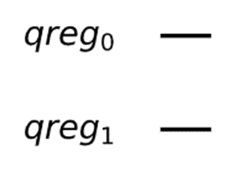
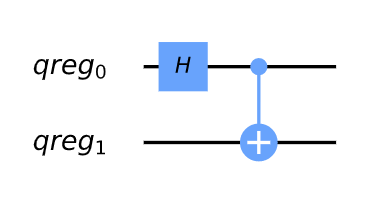
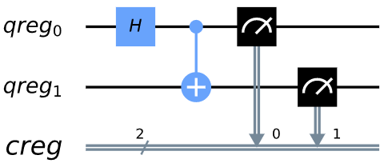
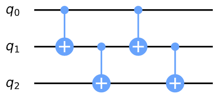
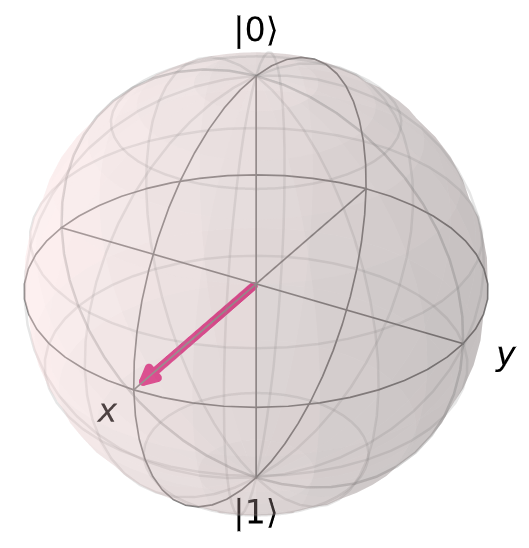
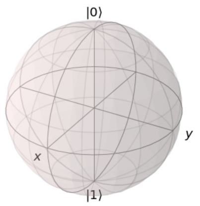

# 1.  预备知识

## 1.  设置环境

以下是在您的个人计算机上设置并使用Qiskit
Textbook环境的全面指南。本指南将帮助您重现在Qiskit
Textbook网站上看到的结果。Qiskit Textbook用[Jupyter
Notebook](https://jupyter.org/install)编写，Notebook及其[网站](https://qiskit.org/textbook/preface.html)是唯一完全支持本Textbook的媒介。

### 安装qiskit_textbook软件包

qiskit_textbook软件包中给出了一些本教程特定的工具和控件，但在Qiskit软件中未提供。安装qiskit_textbook的最快方式是使用[Pip](http://pypi.org/project/pip/)和[Git](http://git-scm.com/)运行下面的命令：

> pip install
> git+https://github.com/qiskit-community/qiskit-textbook.git\#subdirectory=qiskit-textbook-src

您也可以从Github上下载qiskit-textbook-src（https://github.com/qiskit-community/qiskit-textbook）后，在解压后的目录中运行以下命令：

pip install ./qiskit-textbook-src

### 按照Qiskit Textbook的要求复现输出的步骤（可选步骤）

#### 1. 将默认作图工具设置为MatPlotLib

QuantumCircuit.draw()与qiskit.visualization.circuit_drawer()的默认后端为文本后端。当然，依据您计算机中的环境您可能想要将其更改为更加适合的后端。这一步骤可以通过修改用户配置文件来完成，位于用户主目录的.qiskit目录中：settings.conf（Linux
或 MacOS）或.ini（Windows）。

Qiskit
Textbook的默认量子回路绘制工具是MatPlotLib。为了能够再现本教程中给出的可视化部分，可在.qiskit目录创建settings.conf文件并在其中添加：

> \[default\]
>
> circuit_drawer = mpl

#### 2. 将默认图片类型设置为svg

您还可以在ipython_kernel_config.py文件中添加以下代码将默认的图片格式从PNG更改成具有更佳缩放的SVG格式：（ipython_kernel_config.py通常在用户主目录的.ipython/profile_default/文件夹中）

c.InlineBackend.figure_format = \'svg\'

#### 3. 同步TextBook中使用的Qiskit版本

您将在本教程大多数章节的最后找到以下代码片段，其输出包含了在该章节中所使用的Qiskit版本信息。如果您运行这一章节中的代码时发现不一致的语法和/或输出，请尽量使用相同的版本。

您可以在Python终端和Jupyter
Notebook中运行下面的代码来查看在您电脑上所安装Qiskit的版本：

> import qiskit
>
> qiskit.\_\_qiskit_version\_\_

Python和Jupyter Notebooks
-------------------------

Python是一种不需要编译的编程语言。读者可以逐行运行其代码（这就是在Notebook中使用Python的方式)。因此，如果您对编程相当陌生，那么Python是一个很好的起点。我们将使用当前Python
3版本。

用Python编码的一种方法是使用Jupyter
Notebook。该工具可能是结合编程、文本和图像的最佳方法。在Notebook中所有内容都放置在单元（cell）中，其中最常见的文本单元和代码单元。如果您用装有Jupyter
Notebook的电脑查看本节，则现在正在阅读的文本位于文本单元中。您可以在下面找到一个代码单元。

若要运行代码单元中的内容，可以单击进入该单元，然后按Shift +
Enter。或者，如果单元左侧有一个小箭头，那么可以直接单击运行。

> 1+1
>
> 输出：
>
> 2

如果您是在Jupyter
Notebook中查看本节，就可以在阅读过程中逐个运行其中的代码单元。

> a = 1
>
> b = 0.5
>
> a + b
>
> 输出：
>
> 1.5

上面的代码中创建了两个变量，分别为a和b并为其赋值，然后变量a与b相加。这样的简单算法在Python中相当直截了当。

Python中的变量有多种形式，下面是一些例子：

> an_integer = 42 \# Just an integer
>
> a_float = 0.1 \# A non-integer number, up to a fixed precision
>
> a_boolean = True \# A value that can be True or False
>
> a_string = \'\'\'just enclose text between two \'s, or two \"s, or do
> what we did for this string\'\'\' \# Text
>
> none_of_the_above = None \# The absence of any actual value or
> variable type

除了数字之外，我们可以使用的另一种数据结构是列表（list）。

a_list = \[0,1,2,3\]

在Python中，一个列表的索引是从0开始（与Fortran之类的语言不同）。下面的代码是如何访问a_list列表中第一个元素。

> a_list\[0\]
>
> 输出：
>
> 0

与列表类似的数据结构是元组（tuple）。

> a_tuple = ( 42, 0.5, True, \[0,1\], None, \'Banana\' )
>
> a_tuple\[0\]
>
> 输出：
>
> 42

列表和元组之间的主要区别是列表可以更改其中的元素，但是元组不行。

> a_list\[5\] = \'apple\'
>
> print(a_list)
>
> 输出：
>
> \[42, 0.5, True, \[0, 1\], None, \'apple\'\]
>
> a_tuple\[5\] = \'apple\'
>
> 输出：
>
> \-\-\-\-\-\-\-\-\-\-\-\-\-\-\-\-\-\-\-\-\-\-\-\-\-\-\-\-\-\-\-\-\-\-\-\-\-\-\-\-\-\-\-\-\-\-\-\-\-\-\-\-\-\-\-\-\-\-\-\-\-\-\-\-\-\-\-\-\-\-\-\-\-\--
>
> TypeError Traceback (most recent call last)
>
> \<ipython-input-9-42d08f1e5606\> in \<module\>
>
> \-\-\--\> 1 a_tuple\[5\] = \'apple\'
>
> TypeError: \'tuple\' object does not support item assignment

我们还可以在列表的末尾添加一个元素，但是元组做不到。

> a_list.append( 3.14 )
>
> print(a_list)
>
> 输出：
>
> \[42, 0.5, True, \[0, 1\], None, \'apple\', 3.14\]

Python另一个有用的数据结构是字典（dictionary）。字典可以存储一组值（value），其中每个值都由一个惟一的键（key）标记。

字典中的值可以是任何数据类型，键可以是任意足够简单的东西（整数、浮点数、布尔值、字串）。*键不能是一个列表，但可以是一个元组*。

> a_dict = { 1:\'This is the value, for the key 1\', \'This is the key
> for a value 1\':1, False:\':)\', (0,1):256 }

访问字典值的方式是使用对应的键：

> a_dict\[\'This is the key for a value 1\'\]
>
> 输出：
>
> 1

只要为新的键提供值，就可以在字典中添加新的键/值对。

a_dict\[\'new key\'\] = \'new_value\'

遍历一个数字范围的语法是：

> for j in range(5):
>
> print(j)
>
> 输出:
>
> 0
>
> 1
>
> 2
>
> 3
>
> 4

**注意，range(n)是从0开始(默认)并以n-1结束。**

您还可以遍历任何"可迭代（iterable）"对象，比如列表：

> for j in range(5):
>
> print(j)
>
> 输出:
>
> 0
>
> 1
>
> 2
>
> 3
>
> 4

或字典：

> for key in a_dict:
>
> value = a_dict\[key\]
>
> print(\'key =\',key)
>
> print(\'value =\',value)
>
> print()
>
> 输出:
>
> key = 1
>
> value = This is the value, for the key 1
>
> \...
>
> key = new key
>
> value = new_value

Python中的条件语句使用if、elif和else完成，使用以下语法：

> if \'strawberry\' in a_list:
>
> print(\'We have a strawberry!\')
>
> elif a_list\[5\]==\'apple\':
>
> print(\'We have an apple!\')
>
> else:
>
> print(\'Not much fruit here!\')
>
> 输出:
>
> We have an apple!

导入Python软件包用一行代码就可以完成：

import numpy

Numpy包是Python中很重要的数学计算包：

numpy.sin( numpy.pi/2 )

在上面的代码中必须在每个numpy中命令前加上**numpy.**，以便让Python知道如何查找在numpy中定义的命令。为了减少代码的长度，通常可以使用：

> import numpy as np
>
> np.sin( np.pi/2 )
>
> 输出:
>
> 1.0

现在只须使用numpy的缩写。虽然大多数人使用np，但您可以使用您喜欢的缩写。

您也可以直接把numpy中的所有东西直接导入Python的名称空间：

from numpy import \*

然后就可以直接使用numpy中的命令。但这样操作可能会导致程序包之间的名称混乱，因此不建议使用。

> sin( pi/2 )
>
> 输出:
>
> 1.0

如果您计算三角函数，线性代数等，那么使用numpy就可以了。在Python中绘图则需要使用matplotlib。如果在Python的计算中涉及图论（graph
theory），可以使用networkx。当然在Python中进行量子计算，就需要使用qiskit了。不管您想要什么，都可能会有一个适合您需求的软件包。

在任何编程语言中都需要知道的是如何构造函数。

下面的代码定义了一个名称为do_some_math的函数，有两个参数分别为Input1和Input2，该函数的输出为the_answer。

> def do_some_maths ( Input1, Input2 ):
>
> the_answer = Input1 + Input2
>
> return the_answer

Python中函数的调用方式如下：

> x = do_some_maths(1,72)
>
> print(x)
>
> 输出:
>
> 73

如果给一个函数一个对象，并且这个函数调用这一对象的一个方法来改变其的状态，那么这一对象状态的改变不会随着函数运行的结束而消失。如果这就是想要的效果，那么函数不需要返回任何东西。例如使用列表的append方法：

> def add_sausages ( input_list ):
>
> if \'sausages\' not in input_list:
>
> input_list.append(\'sausages\')
>
> print(\'List before the function\')
>
> print(a_list)
>
> add_sausages(a_list) \# function called without an output
>
> print(\'\\nList after the function\')
>
> print(a_list)
>
> 输出：
>
> List before the function
>
> \[42, 0.5, True, \[0, 1\], None, \'apple\', 3.14\]
>
> List after the function
>
> \[42, 0.5, True, \[0, 1\], None, \'apple\', 3.14, \'sausages\'\]

在Python可以使用random包生成随机数：

> import random
>
> for j in range(5):
>
> print(\'\* Results from sample\',j+1)
>
> print(\'\\n Random number from 0 to 1:\', random.random() )
>
> print(\"\\n Random choice from our list:\", random.choice( a_list ) )
>
> print(\'\\n\')
>
> 输出：
>
> \* Results from sample 1
>
> Random number from 0 to 1: 0.8871532828770763
>
> Random choice from our list: True
>
> ...

以上是Python中最基本的语法。现在您所仅需的是一个搜索引擎，以及在Stack
Exchange上听取哪一建议的直觉，然后就可以用Python做任何事情了。您的代码可能不是最"python化"的，但只有Pythonistas真正关心这一问题。

0.2 Qiskit
----------

### 基础Qiskit语法

#### 安装

Qiskit是Python中用于量子计算的软件包。

如果您尚未安装，则需要安装完成后才能在Python中导入Qiskit。

安装Qiskit通常需要两个步骤。第一个是安装Anaconda，其中几乎包含了所有您将会用到的相关软件包。在完成安装Anaconda后，可以在终端中通过运行以下命令来安装Qiskit：

pip install qiskit \#国内用户建议将pip的源更换为阿里或清华

相关详细的安装说明，请参阅[Qiskit的安装文档](https://qiskit.org/documentation/install.html)。

注：本节的剩余部分是为已经了解量子计算基本概念的人准备的。读者可以直接跳到后面的章节中使用这些概念。所有其他的读者都应该从阅读[Python和Jupyter
notebooks](\l)开始，然后直接进入第一章的开头。

#### 量子回路

> from qiskit import \*
>
> \#在Jupyter Notebooks中：
>
> %config InlineBackend.figure_format = \'svg\' \#
> 可是使所生成的图片看上去更加清晰

Qiskit的核心是**量子回路**（**quantum
circuit，也可将其称之为"量子线路"**）。以下是在Python中创建一个量子回路的实例------qc：

qc = QuantumCircuit()

这一回路目前是完全不包含任何东西，没有量子比特，也就不会有输出。

#### 量子寄存器

为了使刚才生成的量子回路并非毫无用处，需要定义一个量子比特寄存器，使用QuantumRegister对象完成。例如，定义一个由两个量子比特组成的寄存器，称之为qr。

qr = QuantumRegister(2,\'qreg\')

给qr起一个类似\'qreg\'的名字是可选参数。

现在可以使用add_register方法将qr添加到回路中，并通过检查回路对象的qregs变量来查看是否其已被添加。在Jupter
Notebook中，最后的代码单元及其输出如下：

> qc.add_register( qr )
>
> qc.qregs
>
> 输出：
>
> \[QuantumRegister(2, \'qreg\')\]

至此回路qc中有了一些量子比特，可以使用回路的另一个属性draw()来查看其具体形态。

> qc.draw(output=\'mpl\')
>
> 输出：

我们可以看到量子比特已经准备好开始其旅程了，但目前都只是处于态\|0⟩（对于此处不熟悉的小伙伴可以阅读狄拉克符号及其意义）。

#### 使用Gate（门）

为了发生些什么事情，需要在回路实例qc中添加量子门。例如，尝试h()：

> qc.h()
>
> 输出：
>
> \-\-\-\-\-\-\-\-\-\-\-\-\-\-\-\-\-\-\-\-\-\-\-\-\-\-\-\-\-\-\-\-\-\-\-\-\-\-\-\-\-\-\-\-\-\-\-\-\-\-\-\-\-\-\-\-\-\-\-\-\-\-\-\-\-\-\-\-\-\-\-\-\-\--
>
> TypeError Traceback (most recent call last)
>
> \<ipython-input-7-68b196ebf214\> in \<module\>
>
> \-\-\--\> 1 qc.h()
>
> /usr/local/anaconda3/lib/python3.7/site-packages/qiskit/util.py in
> wrapper(\*args, \*\*kwargs)
>
> 106 if kwargs:
>
> 107 \_rename_kwargs(func.\_\_name\_\_, kwargs, kwarg_map)
>
> \--\> 108 return func(\*args, \*\*kwargs)
>
> 109 return wrapper
>
> 110 return decorator
>
> TypeError: h() missing 1 required positional argument: \'qubit\'

这里得到一个错误，因为在此操作中没有指定应该作用于哪一个量子比特。寄存器qr中有两个量子比特分别称为qr\[0\]和qr\[1\]。

> qc.h(qr\[0\])
>
> 输出：
>
> \<qiskit.circuit.instructionset.InstructionSet at 0x7fe099f71110\>

请忽略上面的输出。当一个单元的最后一行没有"="时，Jupyter
Notebook会打印出该单元的内容。在这个例子中打印出有一个由Qiskit定义的Hadamard门。可以使用"
; "抑制这种输出。

我们还可以在量子回路中添加一个受控非门（Controlled-NOT）控件**cx**，此操作需要两个参数：控制量子比特（control
qubit）和目标量子比特（target qubit）。

qc.cx(qr\[0\], qr\[1\]);

现在，回路qc中包含了新的内容。

> qc.draw(output=\'mpl\')
>
> 输出：

#### 态向量（statevector）模拟器

到现在为止量子回路qc中已经包含了足够的器件来构成回路，让我们看看回路qc的输出是什么？*其过程具体为使用"态向量模拟器"来查看两个量子比特的态向量发生了什么变化*。

准备模拟器的代码如下：

vector_sim = Aer.get_backend(\'statevector_simulator\')

在Qiskit中使用后端（backend）引用量子程序实际运行的东西（模拟器或真正的量子设备）。若要为后端设置作业（job），需要设置相应的后端对象。

我们想要的模拟器定义在Qiskit中称为Aer的部分。通过在Aer的get_backend()方法中给出想要的模拟器名称，就可以得到相应的后端对象。本例中后端的名称为\'statevector_simulator\'。

可以使用下面的代码获取Aer中所有可能的模拟器列表：

> Aer.backends()
>
> 输出：
>
> \[\<QasmSimulator(\'qasm_simulator\') from AerProvider()\>,
>
> \<StatevectorSimulator(\'statevector_simulator\') from
> AerProvider()\>,
>
> \<UnitarySimulator(\'unitary_simulator\') from AerProvider()\>,
>
> \<PulseSimulator(\'pulse_simulator\') from AerProvider()\>\]

所显示的模拟器都来自"本地"，表明其都可在预装Qiskit的机器上运行。您可以在自己的机器上使用这些模拟器，而无需签署IBMQ用户协议。

我们通过Qiskit的execute命令运行这些模拟器，该命令需要的参数是：

要运行的回路和运行该回路的"后端"（在本例中是模拟器）。

job = execute(qc, vector_sim)

上面的代码创建了一个处理作业（job）的对象，在这里称为作业（job）。我们只需从中提取结果，具体为提取态向量。

> ket = job.result().get_statevector()
>
> for amplitude in ket:
>
> print(amplitude)
>
> 输出：**（每个电脑的结果不同）**
>
> (0.7071067811865476+0j)
>
> 0j
>
> 0j
>
> (0.7071067811865476+0j)

结果是一个贝尔态（Bell
state）的向量$(|00\rangle + |11\rangle)/\sqrt{2}$，正是我们想要回路qc输出的结果。

显然，我们已经获得了一个完整定义的态向量，但还可以采用Qiskit的另一个特性：用任意纯态初始化回路。

> new_qc = QuantumCircuit(qr)
>
> new_qc.initialize(ket,qr)

#### 经典寄存器（ClassicalRegister）和qasm模拟器

在上面的仿真中，我们得到了一个态向量（statevector），但并非是从真正的量子计算机中获取，为此需要对其测量。为了处理测量过程，需要定义结果的走向。这一步骤通过ClassicalRegister完成的。现在定义一个包含两个比特（bit）的经典寄存器，用以测量的之前所生成的两个量子比特（qubit）。

> cr = ClassicalRegister(2,\'creg\')
>
> qc.add_register(cr)

现在可以使用量子回路的测量方法了，该方法需要两个参数：正在测量的量子比特，以及写入结果的位。

> qc.measure(qr\[0\],cr\[0\])
>
> qc.measure(qr\[1\],cr\[1\])
>
> qc.draw(output=\'mpl\')
>
> 输出：
>
> 

我们可以测量两个量子比特，并把结果写入到经典寄存器的不同位中。

现在可以在本地模拟器上运行qc了，其效果是模拟真实的量子设备。为此，我们需要向执行函数shots添加另一个输入，该输入决定了运行回路进行统计的次数。如果不提供任何shots值，则默认为1024。

> emulator = Aer.get_backend(\'qasm_simulator\')
>
> job = execute( qc, emulator, shots=8192 )

上面代码的结果本质上是一个Python字典形式的直方图，可以打印出该结果。

> hist = job.result().get_counts()
>
> print(hist)
>
> 输出：（结果每台电脑不一样）
>
> {\'00\': 4029, \'11\': 4163}

可以让Qiskit把上面的输出画成柱状图。

> from qiskit.visualization import plot_histogram
>
> plot_histogram(hist)
>
> 输出：

对于兼容的后端，还可以请求并获得结果的有序列表。

> job = execute(qc, emulator, shots=10, memory=True)
>
> samples = job.result().get_memory()
>
> print(samples)
>
> 输出：
>
> \[\'11\', \'11\', \'00\', \'00\', \'00\', \'00\', \'11\', \'11\',
> \'11\', \'00\'\]

注意位（bit）被标记为自右到左，cr\[0\]是最右边的，其余以此类推。举个例子，这是一个8量子比特回路，其中**Pauli
X**（泡利-X 门）只在编号7的量子比特上，那么其输出存储在编号7的位上。

> qubit = QuantumRegister(8)
>
> bit = ClassicalRegister(8)
>
> circuit = QuantumCircuit(qubit,bit)
>
> circuit.x(qubit\[7\])
>
> circuit.measure(qubit,bit)
> \#此为一次性完成所有qc.measure(qr8\[j\],cr8\[j\])的方法
>
> execute(circuit, emulator, shots=8192).result().get_counts()
>
> 输出：
>
> {\'10000000\': 8192}

可以看到出现在输出最左侧的是1。

这种编号方式反映了位（bit）表示整数时的作用。

$$b_{n - 1}b_{n - 2}\cdots b_{1}b_{0} = \sum_{j}^{}{b_{j}2^{j} }$$

所以我们在结果中得到的字串是二进制的$2^{7}$，因为输出结果中的第7位（从0开始）是1。

#### 简化符号

可以将多个量子寄存器和经典寄存器添加到一个回路中。然而，如果只需要其中的一个，可以使用简化符号。

例如，考虑以下内容。

qc = QuantumCircuit(3)

上面代码中QuantumCircuit()的唯一参数被解释为需要的量子比特数量。这一回路只有一个由三个量子比特组成的量子寄存器，没有经典寄存器。

在添加门回路时，我们可以简单地通过其的索引引用这三个量子比特：0、1或2。例如下面的代码中定义了一个量子比特1处的哈达玛门。

> qc.h(1)
>
> qc.draw(output=\'mpl\')
>
> 输出：

为了定义同时具有量子寄存器和经典寄存器的回路，可以向QuantumCircuit提供两个参数。第一个将被解释为量子比特的数量，第二个是位的数量。例如，以下是一个两个量子比特的回路，只取一个位的输出。

为了观察其的运行，以下是一个简单的回路。注意！在进行测量时，我们也通过索引引用经典寄存器中的位。

#### 创建自定义门

qc = QuantumCircuit(2,1)

> qc.h(0)
>
> qc.cx(0,1)
>
> qc.measure(1,0)
>
> qc.draw(output=\'mpl\')
>
> 输出：

正如我们所看到的，具有把不同的回路组合成更大的回路的可能性。还可以使用更复杂的版本来定制门。例如，下面有一个回路中实现了量子比特0和2之间的cx（受控非门），使用量子比特1来协调这个过程。

> sub_circuit = QuantumCircuit(3, name=\'toggle_cx\')
>
> sub_circuit.cx(0,1)
>
> sub_circuit.cx(1,2)
>
> sub_circuit.cx(0,1)
>
> sub_circuit.cx(1,2)
>
> sub_circuit.draw(output=\'mpl\')
>
> 输出：

现在把sub_circuit变成门回路：

toggle_cx = sub_circuit.to_instruction()

然后用我们选择其他回路中的任意一组量子比特插入toggle_cx：

> qr = QuantumRegister(4)
>
> new_qc = QuantumCircuit(qr)
>
> new_qc.append(toggle_cx, \[qr\[1\],qr\[2\],qr\[3\]\])
>
> new_qc.draw(output=\'mpl\')
>
> 输出：

#### 访问真正的量子硬件（未注册，只显示代码不显示输出）

您还可以使用IBMQ包设置后端对象。这些应用要求创建一个IBMQ帐户。假设访问凭证已经加载到您的计算机上：

> IBMQ.load_account()
>
> 输出：
>
> \<AccountProvider for IBMQ(hub=\'ibm-q\', group=\'open\',
> project=\'main\')\>

让我们看看有哪些可用的后端：

> provider = IBMQ.get_provider(hub=\'ibm-q\')
>
> provider.backends()
>
> 输出：
>
> \[\<IBMQSimulator(\'ibmq_qasm_simulator\') from IBMQ(hub=\'ibm-q\',
> group=\'open\', project=\'main\')\>,
>
> \<IBMQBackend(\'ibmqx2\') from IBMQ(hub=\'ibm-q\', group=\'open\',
> project=\'main\')\>,
>
> \<IBMQBackend(\'ibmq_16_melbourne\') from IBMQ(hub=\'ibm-q\',
> group=\'open\', project=\'main\')\>,
>
> \<IBMQBackend(\'ibmq_vigo\') from IBMQ(hub=\'ibm-q\', group=\'open\',
> project=\'main\')\>,
>
> \<IBMQBackend(\'ibmq_ourense\') from IBMQ(hub=\'ibm-q\',
> group=\'open\', project=\'main\')\>,
>
> \<IBMQBackend(\'ibmq_london\') from IBMQ(hub=\'ibm-q\',
> group=\'open\', project=\'main\')\>,
>
> \<IBMQBackend(\'ibmq_burlington\') from IBMQ(hub=\'ibm-q\',
> group=\'open\', project=\'main\')\>,
>
> \<IBMQBackend(\'ibmq_essex\') from IBMQ(hub=\'ibm-q\', group=\'open\',
> project=\'main\')\>,
>
> \<IBMQBackend(\'ibmq_armonk\') from IBMQ(hub=\'ibm-q\',
> group=\'open\', project=\'main\')\>\]

在输出中有一个模拟器，但其余都是原型量子设备。还可以通过status()方法查看其使用方法。

> for backend in provider.backends():
>
> print(backend.status())
>
> 输出：
>
> BackendStatus(backend_name=\'ibmq_qasm_simulator\',
> backend_version=\'0.1.547\', operational=True, pending_jobs=4,
> status_msg=\'active\')
>
> BackendStatus(backend_name=\'ibmqx2\', backend_version=\'2.0.5\',
> operational=True, pending_jobs=10, status_msg=\'active\')
>
> BackendStatus(backend_name=\'ibmq_16_melbourne\',
> backend_version=\'2.0.6\', operational=True, pending_jobs=15,
> status_msg=\'active\')
>
> BackendStatus(backend_name=\'ibmq_vigo\', backend_version=\'1.0.2\',
> operational=True, pending_jobs=5, status_msg=\'active\')
>
> BackendStatus(backend_name=\'ibmq_ourense\',
> backend_version=\'1.0.1\', operational=True, pending_jobs=5,
> status_msg=\'active\')
>
> BackendStatus(backend_name=\'ibmq_london\', backend_version=\'1.1.0\',
> operational=True, pending_jobs=6, status_msg=\'active\')
>
> BackendStatus(backend_name=\'ibmq_burlington\',
> backend_version=\'1.1.4\', operational=True, pending_jobs=3,
> status_msg=\'active\')
>
> BackendStatus(backend_name=\'ibmq_essex\', backend_version=\'1.0.1\',
> operational=True, pending_jobs=1, status_msg=\'active\')
>
> BackendStatus(backend_name=\'ibmq_armonk\', backend_version=\'1.1.0\',
> operational=True, pending_jobs=33, status_msg=\'active\')

现在获取最大公共设备的后端对象。

real_device = provider.get_backend(\'ibmq_16_melbourne\')

我们可以使用real_device在设备上以与模拟器完全相同的方式运行作业（job），也可以提取其属性。

> properties = real_device.properties()
>
> coupling_map = real_device.configuration().coupling_map

由此我们可以构建一个噪声模型来模拟设备上的噪声（将在稍后的教程中进一步讨论噪声模型）。

> from qiskit.providers.aer.noise import NoiseModel
>
> noise_model = NoiseModel.from_backend(properties)

然后在模拟器上运行作业，再现真实设备的所有这些特性。以下是回路在无噪声的情况下应该输出\'10\'的例子。

> qc = QuantumCircuit(2,2)
>
> qc.x(1)
>
> qc.measure(0,0)
>
> qc.measure(1,1)
>
> job = execute(qc, emulator, shots=1024, noise_model=noise_model,
>
> coupling_map=coupling_map,
>
> basis_gates=noise_model.basis_gates)
>
> job.result().get_counts()
>
> 输出：
>
> {\'10\': 966, \'11\': 6, \'00\': 52}

至此本节中已经涵盖了Qiskit中的最基本内容，接下来将要学习更多量子比特和量子回路的知识。

> import qiskit
>
> qiskit.\_\_qiskit_version\_\_
>
> 输出：
>
> {\'qiskit-terra\': \'0.12.0\',
>
> \'qiskit-aer\': \'0.4.1\',
>
> \'qiskit-ignis\': \'0.2.0\',
>
> \'qiskit-ibmq-provider\': \'0.6.0\',
>
> \'qiskit-aqua\': \'0.6.5\',
>
> \'qiskit\': \'0.17.0\'}

0.3 线性代数
------------

> from matplotlib import pyplot as plt
>
> import numpy as np
>
> from qiskit import \*
>
> from qiskit.visualization import plot_bloch_vector

### 简介

线性代数是量子计算的语言。因此理解线性代数所建立的基本数学概念至关重要，如此才能理解量子计算中出现的许多惊人而有趣的结构。本节的目标是在您的大脑中建立基础的线性代数知识，在此基础上读者可以构建自身研究量子计算的研究。

### 向量和向量空间

我们将首先讨论量子计算中最重要的数学量之一：向量，并以此开始对线性代数的介绍。

在形式上,一个向量\|v⟩被定义为一组称为向量空间的元素。更直观、更几何的定义是：向量"是一个同时具有方向和大小的数学量"。例如，考虑一个具有x和y分量的向量$\left( \frac{3}{5} \right)$。这个向量可以被想象成一个箭头，指向x轴正3个单位，指向y轴正5个单位：

> plt.figure()
>
> ax = plt.gca()
>
> ax.quiver(\[3\], \[5\], angles=\'xy\', scale_units=\'xy\', scale=1)
>
> ax.set_xlim(\[-1, 10\])
>
> ax.set_ylim(\[-1, 10\])
>
> plt.draw()
>
> plt.show()
>
> 输出：

注意，向量的"尾巴"不一定要定位在坐标的原点；只需要指出正确的方向。

在量子计算中，我们经常处理态向量，这些向量指向空间中与特定量子态相对应的特定点。可以用布洛赫球（Bloch
Sphere）来表示。例如，一个表示量子系统状态的向量可以像一个箭头一样被包裹在布洛赫球中，这就是所谓的"态空间（state
space）"，所有可能的点都可以被态向量"指向"：

> plot_bloch_vector(\[1, 0, 0\])
>
> 输出：

> **注解**
>
> **布洛赫球(Bloch
> Sphere)是一个可以将qubit的状态(纯态或混合态)直观化的巧妙工具。**

向量\|0⟩和\|1⟩之间的特定状态对应于一个均衡的叠加态（箭头是介于球体的顶部\|0⟩和底部\|1⟩之间）。向量可以在球面上任意旋转，球面上的每个点都代表不同的量子态。

我们先回顾一下向量更加正式的定义，即向量是向量空间的一个元素。现在必须定义一个向量空间。向量空间**V**是数域**F**（**field
F**）之上的一组对象（包括：向量和点），满足两个条件。第一，两个向量\|a⟩和\|b⟩的向量加法（**vector
addition**）的结果仍然在**V**之内。第二，对于\|a⟩ ∈ V与某一n ∈
F的标量乘法（**scalar multiplication**）的结果仍然在**V**之内。

现在，我们将通过一个基本示例来阐明刚才的定义。让我们证明集R^2^是数域R上的向量空间，我们断言：

$$\left( \frac{x_{1} }{y_{1} } \right) + \left( \frac{x_{2} }{y_{2} } \right) = \left( \frac{x_{1} + x_{2} }{y_{1} + y_{2} } \right)$$

上述公式包含于R^2^。情况显然如此，两个实数的和仍然是实数，使得新形成向量的两个分量都是实数，由此包含于R^2^中的向量被定义。我们还可以断言：

$$n\left| v \right\rangle = \left( \frac{\text{nx} }{\text{ny} } \right) \in \text{V\ \ \ }\forall n \in R$$

这也成立，因为实数和实数的乘积是实数，使得整个新的向量是实数，从而证明了这个表述。

#### 矩阵与矩阵运算

现在我们将注意力转向另一个基础概念：矩阵。矩阵是把一个向量转换为另一个向量的数学对象。

\|𝑣⟩ → \|𝑣′⟩ = 𝑀\|𝑣⟩

矩阵通常写为数组形式的数字，如下所示：

$$M = \left\lbrack \begin{matrix}
1 \\
1 \\
1 + i \\
\end{matrix}\begin{matrix}
 - 2 \\
5i \\
7 \\
\end{matrix}\begin{matrix}
3 \\
0 \\
 - 4 \\
\end{matrix} \right\rbrack$$

我们可以执行矩阵乘法将一个矩阵乘以一个向量。通常，两个矩阵之间的矩阵乘法涉及将第一个矩阵中每一行的元素乘以第二个矩阵中每一列的每一个元素然后将乘积相加，该乘积成为新矩阵中对应行列中的一个元素，以此类推。以下是矩阵乘法（叉积）的一个示例：

$$\left( \begin{matrix}
2 \\
5 \\
\end{matrix}\begin{matrix}
\ 0 \\
\  - 1 \\
\end{matrix} \right)\left( \begin{matrix}
 - 3\  \\
2 \\
\end{matrix}\begin{matrix}
1 \\
\ 1 \\
\end{matrix} \right) = \left( \begin{matrix}
\left( 2 \right)\left( - 3 \right) + \left( 0 \right)\left( 2 \right) \\
\left( 5 \right)\left( - 3 \right) + \left( - 1 \right)\left( 2 \right) \\
\end{matrix}\ \begin{matrix}
\left( 2 \right)\left( 1 \right) + \left( 0 \right)\left( 1 \right) \\
\left( 5 \right)\left( 1 \right) + \left( - 1 \right)\left( 1 \right) \\
\end{matrix} \right) = \left( \begin{matrix}
 - 6\  \\
 - 17 \\
\end{matrix}\begin{matrix}
2 \\
\ 4 \\
\end{matrix} \right)$$

为了进行量子计算，通过对量子态向量应用一个矩阵来对其操作。一个向量就是一个只有一列的矩阵。因此要将一个矩阵应用于一个向量，需要遵循上面描述的相同矩阵乘法过程。我们可以通过应用一系列的量子门（**quantum
gates**）在量子电脑上操纵量子比特。每个量子门都被表示为可应用于态向量的矩阵，从而改变态向量的状态。例如，经常可见的量子门是Pauli-X门，用矩阵的方式如下：

$$\sigma_{x} = \left( \begin{matrix}
0 \\
1 \\
\end{matrix}\ \begin{matrix}
1 \\
0 \\
\end{matrix} \right)$$

这一量子门的行为与经典的非逻辑门相似。其将计算量的基态\|0⟩和\|1⟩分别映射为\|1⟩和\|0⟩（将状态反转了）。我们将这两个基态表述为两个列向量：

$$\left| 0 \right\rangle = \begin{pmatrix}
1 \\
0 \\
\end{pmatrix}\text{\ \ }\left| 1 \right\rangle = \begin{pmatrix}
0 \\
1 \\
\end{pmatrix}$$

然后将Pauli-X门的矩阵分别应用于这两个基态：

$$\sigma_{x}\left| 0 \right\rangle = \left( \begin{matrix}
0 \\
1 \\
\end{matrix}\ \begin{matrix}
1 \\
0 \\
\end{matrix} \right)\begin{pmatrix}
1 \\
0 \\
\end{pmatrix} = \begin{pmatrix}
\left( 0 \right)\left( 1 \right) + \left( 1 \right)\left( 0 \right) \\
\left( 1 \right)\left( 1 \right) + \left( 0 \right)\left( 0 \right) \\
\end{pmatrix} = \begin{pmatrix}
0 \\
1 \\
\end{pmatrix} = \left| 1 \right\rangle$$

$$\sigma_{x}\left| 1 \right\rangle = \left( \begin{matrix}
0 \\
1 \\
\end{matrix}\ \begin{matrix}
1 \\
0 \\
\end{matrix} \right)\begin{pmatrix}
0 \\
1 \\
\end{pmatrix} = \begin{pmatrix}
\left( 0 \right)\left( 0 \right) + \left( 1 \right)\left( 1 \right) \\
\left( 1 \right)\left( 0 \right) + \left( 0 \right)\left( 1 \right) \\
\end{pmatrix} = \begin{pmatrix}
1 \\
0 \\
\end{pmatrix} = \left| 0 \right\rangle$$

态向量矩阵计算的结果与我们的预期一致。

在量子计算中，我们经常遇到两个非常重要的矩阵：厄米矩阵（**Hermitian**）和幺正矩阵（**Unitary**）。前者在量子力学的研究中更为重要，但在量子计算的研究中仍有必要加以讨论。后者在量子力学和量子计算中都具有无与伦比的重要性。如果您只从线性代数这一节中学会一个概念，那么就应该是一个幺正矩阵的概念。

厄米矩阵就是一个等于它的共轭转置（**conjugate
transpose**）的矩阵(用†符号表示)。这表明翻转厄米矩阵的虚部符号，然后沿着主对角线（从左上角到右下角）反射矩阵中的元素，就得到了一个相等的矩阵。例如，量子计算中常用的Pauli-Y矩阵是厄米矩阵：

$$\sigma_{y} = \left( \begin{matrix}
0 \\
i \\
\end{matrix}\ \begin{matrix}
 - i \\
0 \\
\end{matrix} \right) \Rightarrow \sigma_{y}^{\dagger} = \left( \begin{matrix}
0 \\
 - \left( - i \right) \\
\end{matrix}\ \begin{matrix}
 - \left( i \right) \\
0 \\
\end{matrix} \right) = \left( \begin{matrix}
0 \\
i \\
\end{matrix}\ \begin{matrix}
 - i \\
0 \\
\end{matrix} \right) = \sigma_{y}$$

注意我们交换了𝑖和−𝑖的位置（反映在主对角线，0保持不变）,然后翻转的符号。

幺正矩阵与上述非常相似。具体的说，幺正矩阵是一个矩阵使得逆矩阵等于原矩阵的共轭转置。

矩阵A的逆标注为$A^{- 1}$：

$$A^{- 1}A = AA^{- 1}\mathbb{= I}$$

其中$\mathbb{I}$是单位矩阵（**identity
matrix**），该矩阵的主对角线元素为1，其他元素皆为0。之所以将这一矩阵称为单位矩阵，因为任何矩阵与之相乘都等于其本身。

当一个矩阵的大小超过$2 \times 2$时，矩阵逆的计算就变得非常复杂，通常由计算机来完成。对于$2 \times 2$的矩阵，其逆定义为：

$$A = {\left( \begin{matrix}
a \\
c \\
\end{matrix}\ \begin{matrix}
b \\
d \\
\end{matrix} \right) \Rightarrow A}^{- 1} = \frac{1}{\text{detA} }\left( \begin{matrix}
d \\
 - c \\
\end{matrix}\ \begin{matrix}
 - b \\
a \\
\end{matrix} \right)$$

其中det A是矩阵A的行列式（**determinant**），在$2 \times 2$矩阵中，det
A=ad-bc。

在量子计算中，矩阵逆的计算很少是重要的。因为我们遇到的大多数矩阵都是幺正的，可以假设矩阵的逆就是通过求共轭转置得到的。

让我们看一个基本的例子。Pauli-Y矩阵，即是厄米矩阵，也是幺正矩阵（等于它的共轭转置，也等于它的逆；因此，Pauli-Y矩阵是它自己的逆！）。我们可以证明这个矩阵实际上是幺正的：

$$\sigma_{y} = \left( \begin{matrix}
0 \\
i \\
\end{matrix}\ \begin{matrix}
 - i \\
0 \\
\end{matrix} \right) \Rightarrow \sigma_{y}^{\dagger} = \left( \begin{matrix}
0 \\
i \\
\end{matrix}\ \begin{matrix}
 - i \\
0 \\
\end{matrix} \right) \Rightarrow \sigma_{y}^{\dagger}\sigma_{y} = \left( \begin{matrix}
\left( 0 \right)\left( 0 \right) + \left( - i \right)\left( i \right) \\
\left( i \right)\left( 0 \right) + \left( 0 \right)\left( i \right) \\
\end{matrix}\ \begin{matrix}
\left( 0 \right)\left( - i \right) + \left( - i \right)\left( 0 \right) \\
\left( i \right)\left( - i \right) + \left( 0 \right)\left( 0 \right) \\
\end{matrix} \right) = \left( \begin{matrix}
1 \\
0 \\
\end{matrix}\ \begin{matrix}
0 \\
1 \\
\end{matrix} \right)\mathbb{= I}$$

幺正矩阵重要的原因将在希尔伯特空间一节中变得更加明显，在这本教程的量子力学章节中更是如此。其基本思想是，量子态的演化通过应用幺正矩阵"保持"量子态。

#### 生成集，线性相关和基

我们现在开始讨论向量空间的构造。考虑某个向量空间V。我们说一些向量的集合S张成一个子空间V~S~⊂V（子集在向量空间操作时封闭）的向量空间，我们是否可以将子空间中的任何向量写成包含于生成集中向量的线性组合（**linear
combination**）。

在数域**F**上的一些向量空间中的一些适量集合\|𝑣~1~⟩, \...,
\|𝑣~𝑛~⟩被定义为这些向量（另一称之为\|𝑣⟩的向量）的任意和。

$$\left| v \right\rangle = f_{1}\left| v_{1} \right\rangle + f_{2}\left| v_{2} \right\rangle + \cdots + f_{n}\left| v_{n} \right\rangle = \sum_{i}^{}{f_{i}\left| v_{i} \right\rangle}$$

其中$f_{i}$是数域**F**中的元素。如果有一向量集张成一个空间，那么该向量空间中的**任意其他向量**都可表示为向量集中的向量的线性组合。

这一向量集\|𝑣~1~⟩, \..., \|𝑣~𝑛~⟩被称为线性相关（**linearly
dependent**），如果该集中每个向量都存在相应的系数$b_{i} \in F$，使得：

$$b_{1}\left| v_{1} \right\rangle + b_{2}\left| v_{2} \right\rangle + \cdots + b_{n}\left| v_{n} \right\rangle = \sum_{i}^{}{b_{i}\left| v_{i} \right\rangle} = 0$$

其中至少有一个系数$b_{i}$非零。该等式等更直观的表述\"一个向量集可以表示为彼此的线性组合\"。例如，集{\|𝑣~1~⟩,
\..., \|𝑣~𝑛~⟩}以及相应系数{\|b~1~⟩, \...,
\|b~𝑛~⟩}的线性组合等于0。因此其中至少有一个向量的系数不为零，我们在这一线性组合中选取一项b~a~\|𝑣~a~⟩：

$$\sum_{i}^{}{b_{i}\left| v_{i} \right\rangle} = b_{a}\left| v_{a} \right\rangle + \sum_{i,i \neq a}^{}{b_{i}\left| v_{i} \right\rangle} = 0 \Rightarrow \left| v_{a} \right\rangle = - \sum_{i,i \neq a}^{}{\frac{b_{i} }{b_{a} }\left| v_{i} \right\rangle} = \sum_{i,i \neq a}^{}{c_{i}\left| v_{i} \right\rangle}$$

此时系数$b_{a}$是唯一的非零系数，向量$\left| v_{a} \right\rangle$必然是零向量（**null
vevtor**），则该向量集线性相关。如果不是这样，向量$\left| v_{a} \right\rangle$可写为非零向量的线性组合，如下所示。为证明该逆命题，我们假设在子空间\|𝑣~1~⟩,
\...,
\|𝑣~𝑛~⟩中存在一些向量$\left| v_{a} \right\rangle$可被写为该子空间中其他向量的线性组合，这就是说：

$$\left| v_{a} \right\rangle = \sum_{s}^{}{b_{s}\left| v_{s} \right\rangle}$$

其中s是子空间中所有子集的索引，其遵循：

$$\left| v_{a} \right\rangle - \sum_{s}^{}{b_{s}\left| v_{s} \right\rangle} = \left| v_{a} \right\rangle - \left( \left| v_{s_{1} } \right\rangle + \cdots + \left| v_{s_{r} } \right\rangle \right) = 0$$

对于所有不包含在由𝑠索引子集中的该子空间向量，我们设置其系数由𝑞索引且等于0。因此,

$$\left| v_{a} \right\rangle - \left( \left| v_{s_{1} } \right\rangle + \cdots + \left| v_{s_{r} } \right\rangle \right) + \left( 0 \right)\left( \left| v_{q_{1} } \right\rangle + \cdots + \left| v_{q_{t} } \right\rangle \right) = 0$$

上式即是子空间\|𝑣~1~⟩, \...,
\|𝑣~𝑛~⟩中所有元素的线性组合。其组合的结果等于0，从而完成了线性相关两个定义相互包含的证明。

现在让我们思考一个基础示例。假设在$\mathbb{R}^{2}$中的两组向量，由$\left| a \right\rangle = \left( \frac{1}{0} \right)$和$\left| b \right\rangle = \left( \frac{2}{0} \right)$组成。如果选择该向量空间在数域R上，那么就可以使得这些向量线性组合等于0。

$$2\left| a \right\rangle - \left| b \right\rangle = 0$$

当一组向量中的一个向量不能表示为所有其他向量的线性组合时，我们称这组向量线性无关（**linearly
independent**）。

基（**basis**）的概念可以简单的定义为线性无关张成集（**linearly
independent spanning
set**）。从这个意义上来说，向量空间的基是张成整个空间的最小可能向量集。我们将张成向量空间的一组基的大小称为维度（**dimension**）。

基和张成集非常重要，因为可以让我们"缩小"向量空间，并且仅用少量的向量就能够表达。我们可以得出向量空间基的一些结论，并可以将其推广至整个向量空间，因为我们知道空间中的每个向量都是基向量的线性组合。

在量子计算中，我们遇到的基通常为\|0⟩和\|1⟩。我们可以将任一量子态写为基向量的线性组合。

$$\frac{\left| 0 \right\rangle + \left| 1 \right\rangle}{\sqrt{2} }$$

例如，上面的线性组合通过等概率测量处于任一基向量状态中的量子态，呈现在基态\|0⟩和\|1⟩之间的叠加态。（直观的说，因为"权重"或"每一基向量的数目"在线性组合中相等，所以两者都乘以1/$\sqrt{2}$）

#### 希尔伯特空间，正交性，和内积

希尔伯特空间是量子力学和量子计算中最重要的数学结构之一。希尔伯特空间可以被认为是所有量子态向量"居住"的态空间。希尔伯特空间与任何随机向量空间的主要区别在于，希尔伯特空间有内积（**inner
product**）。内积是在两个向量之间执行运算并返回一个标量。

在量子力学和量子计算的背景下，两个态向量之间的内积返回一个标量，*表示第一个向量与第二个之间的距离*。由此，可以计算出不同量子态的测量概率（将在量子力学的子主题中进行更多的讨论）。

对于在希尔伯特空间中的两个向量\|𝑎⟩和\|𝑏⟩，我们将其内即表示为⟨𝑎\|𝑏⟩，其中⟨𝑎\|是向量\|𝑎⟩的共轭转置，记为$\left| a \right\rangle^{\dagger}$。因此，希尔伯特空间中两个向量的内积类似于：

$$\left\langle a \middle| b \right\rangle = \ \left( a_{1}^{*}\ a_{2}^{*}\text{...}a_{n}^{*} \right)\left( \frac{b_{1} }{\begin{matrix}
b_{2} \\
. \\
. \\
. \\
b_{n} \\
\end{matrix} } \right) = \ a_{1}^{*}b_{1} + a_{2}^{*}b_{2} + \ldots + a_{n}^{*}b_{n}$$

其中∗表示向量的复共轭（**complex conjugate**）。

希尔伯特空间表示为一个量子系统的最重要条件是向量与其自身的内积等于一：⟨𝜓\|𝜓⟩
=
1。这就是所谓的归一化条件，即向量长度的平方必须等于1（通过内积的定义，向量的每一分量都被平方并加在一起）。这一理论的物理意义在于，向量在特定方向上的长度代表了量子系统在特定状态下测量所得的"概率振幅（probability
amplitude）"。显然，量子系统在其所处状态下被测量的概率必须是1（毕竟，在任何特定状态下发现量子系统的概率之和必等于1）。考虑布洛赫球：

> plot_bloch_vector(\[0, 0, 0\])
>
> 输出：

该球的表面连同量子比特态向量之间的内积是一个有效的希尔伯特空间。此外，由于布洛赫球的半径为1，所以归一化条件也成立，因此每个向量的长度的平方也必须等于1。

关于希尔伯特空间和内积的最后一点说明是其与幺正矩阵的关系。幺正矩阵在量子计算中很重要，因其保有内积，表明无论您如何在一个幺正矩阵序列下变换一个向量，归一化条件仍然成立。这点可以通过下面的简短过程来证明：

$$\left\langle \psi \middle| \psi \right\rangle = 1 \Rightarrow \left| \psi \right\rangle \rightarrow U\left| \psi \right\rangle = \left| \psi^{'} \right\rangle \Rightarrow \left\langle \psi^{'} \middle| \psi^{'} \right\rangle = {(U|\psi\rangle)}^{\dagger}U\left| \psi \right\rangle = \left\langle \psi\left| U^{\dagger}U \right|\psi \right\rangle = \left\langle \psi \middle| \psi \right\rangle = 1$$

上式表面幺正变换将量子态发送到其他有效的量子态。对于一个由布洛赫球表示的单量子比特希耳伯特空间，幺正变换对应于态向量在球上不同点的旋转，而不以任何方式改变态向量的长度。

#### 本征向量和本征值

考虑下面等式的关系：

$$A\left| v \right\rangle = \lambda\left| v \right\rangle$$

其中A是一个矩阵，$\lambda$是一个数字。如果给出一个矩阵A，要找出满足上述关系的向量$\left| \upsilon \right\rangle$和数字$\lambda$，我们称这些向量是本征向量（**eigenvector**），所对应的乘数为本征值（**eigenvalue**）。本征向量和本征值在量子力学中具有非常重要的物理意义，因此在量子计算中也同样重要。给出矩阵𝐴，我们可以利用一个有趣的技巧找到相应本征向量和本征值的集合。把上面的等式重新整理一下：

$$A\left| v \right\rangle - \lambda\left| v \right\rangle = 0 \Rightarrow \left( A - \lambda\mathbb{I} \right)\left| v \right\rangle = 0$$

如果方程两边同时乘以逆矩阵$\left( A - \lambda\mathbb{I} \right)^{- 1}$，将会得到$\left| v \right\rangle = 0$。这是一个无关的解（我们不允许本征向量是零向量，否则任意本征值/矩阵组合都会满足本征向量-本征值关系)。因此，为了找到允许的本征向量和本征值，我们假设矩阵$\left( A - \lambda\mathbb{I} \right)$不可逆（**non-invertible**）。回忆一下前面的例子，矩阵的逆是：

$$M^{- 1} = \frac{1}{\det\left( M \right)}F\left( M \right)$$

其中$F\left( M \right)$是某个基于于$M$的新矩阵（这些细节在这里并不重要）。这一等式中我们感兴趣的部分是行列式的逆。如果矩阵$M$的行列式等于0，则该矩阵的逆无定义，因此逆也就无定义，使得矩阵$M$不可逆。因此，我们要求：

$$\det\left( A - \text{λI} \right) = \mathbf{0}$$

然后我们就可以确定$\lambda$，接着将每个$\lambda$值代入原方程获得本征值。例如，找到Pauli-Z矩阵的本征向量和本征值$\sigma_{\mathcal{z} }$。

$$\det\left( \sigma_{\mathcal{z} } - \lambda\mathbb{I} \right) = det\left( \frac{1 - \lambda}{0}\frac{0}{- 1 - \lambda} \right) = \left( - 1 - \lambda \right)\left( 1 - \lambda \right) = 1 - \lambda^{2} = 0 \Rightarrow \lambda = \pm 1$$

这一等式依据$\lambda$所解出的行列式称之为特征多项式（**characteristic
polynomial**）。然后将每个值代入原来的等式，以$\lambda = 1$开始：

$$\left( \frac{1}{0}\frac{0}{- 1} \right)\left| v \right\rangle = \left| v \right\rangle \Rightarrow \left( \frac{1}{0}\frac{0}{- 1} \right)\left( \frac{a}{b} \right) = \left( \frac{a}{b} \right) \Rightarrow \left( \frac{a}{- b} \right) = \left( \frac{a}{b} \right)$$

因此a可以是任一数字，b为0；向量$\left( \frac{1}{0} \right)$构成了所有满足关系向量的一组基，因此该本征向量是对应于本征值1。用同样的方式带代入$\lambda = - 1$：

$$\left( \frac{1}{0}\frac{0}{- 1} \right)\left| v \right\rangle = - \left| v \right\rangle \Rightarrow \left( \frac{1}{0}\frac{0}{- 1} \right)\left( \frac{a}{b} \right) = \left( \frac{- a}{- b} \right) \Rightarrow \left( \frac{a}{- b} \right) = \left( \frac{- a}{- b} \right)$$

此时b可以是任一数字，a为0；因此基向量是$\left( \frac{0}{1} \right)$（对应于于-1的本征向量）。可以看到Pauli-Z矩阵的本征向量是量子计算中的基态\|0⟩和\|1⟩，此并非巧合。例如，当我们测量Z基上的量子比特时，所谓的测量是指重叠量子比特的状态到Z矩阵的本征向量\|0⟩或\|1⟩。

#### 矩阵指数

矩阵指数（**Matrix
Exponential**）的概念是一个非常具体但又非常重要的概念。我们经常看到以下形式的幺正变换：

$$U = \mathcal{e}^{\text{iγH} }$$

其中H是厄米矩阵（**Hermitian
matrix**），γ是实数。上面的等式相当简单地证明了这一形式的所有矩阵都是幺正。对等式中的矩阵U进行共轭转置：

$$U^{\mathbf{\dagger} }\mathbf{=}\left( \mathcal{e}^{\text{iγH} } \right)^{\mathbf{\dagger} }\mathbf{=}\mathcal{e}^{\mathbf{-}\text{iγ}H^{\mathbf{\dagger} } }$$

但是由于矩阵H是厄米矩阵，所以$H^{\mathbf{\dagger} } = H$：

$$\mathcal{e}^{\mathbf{-}\text{iγ}H^{\mathbf{\dagger} } } = \mathcal{e}^{\mathbf{-}\text{iγ}H} \Rightarrow U^{\mathbf{\dagger} }U = \mathcal{e}^{\mathbf{-}\text{iγ}H}\mathcal{e}^{\text{iγ}H} = \mathbb{I}$$

您可能想知道为什么指数中的矩阵仍然可以被认为是一个矩阵。当我们把指数函数展开成泰勒级数时，答案就变得更清楚了。回想一下微积分中泰勒级数本质上是编写无穷次多项式（infinite-degree
polynomial）函数，其主要思想是依据我们尝试将其转换为多项式的函数依次选择多项式函数及其中心点$x_{0}$，诸如第零、第一、第二、第三等，其导数是相同的原始函数和多项式。因此，我们将泰勒级数写成：

$$g\left( x \right) = \sum_{n = 0}^{\infty}f^{\left( n \right)}\left( x_{0} \right)\frac{\left( x - x_{0} \right)^{n} }{n!}$$

其中g(x)是一个多项式，f(x)是原函数，$f^{\left( n \right)}$是函数f的n阶导数，$x_{0}$是函数的中心点。因为我们不是在求近似解，所以$x_{0}$无关紧要，为了简单起见选择$x_{0}$=0，泰勒级数就变成了麦克劳林级数（**Maclaurin
series**）：

$$g\left( x \right) = \sum_{n = 0}^{\infty}f^{\left( n \right)}\left( 0 \right)\frac{\left( x \right)^{n} }{n!}$$

如果选择$f\left( x \right) = \mathcal{e}^{x}$，就能使用麦克劳林级数创建等价的多项式。由于$\mathcal{e}^{x}$的导数就是其本身并且$\mathcal{e}^{0} = 1$，我们得到：

$$g\left( x \right) = \sum_{n = 0}^{\infty}\frac{\left( x \right)^{n} }{n!} = \mathcal{e}^{x}$$

因此对于某些矩阵$\text{iγH}$，我们得到：

$$\mathcal{e}^{\text{iγH} } = \sum_{n = 0}^{\infty}\frac{\left( \text{iγH} \right)^{n} }{n!}$$

所以矩阵指数就是矩阵，是一个无穷次幂矩阵的和，看起来非常复杂......但这里的关键是矩阵指数确实是一个矩阵。

我们现在可以证明一个非常重要的事实：如果我们有一些矩阵B使得$B^{2}\mathbb{= I}$（involutory
matrix，**对合矩阵**）。

$$\mathcal{e}^{\text{iγ}B} = \text{co}s\left( \gamma \right)\mathbb{I +}\text{isin}\left( \gamma \right)B$$

我们从麦考林级数开始：

$$\mathcal{e}^{\text{iγ}B} = \sum_{n = 0}^{\infty}\frac{\left( \text{iγB} \right)^{n} }{n!}$$

依据总和的每一项中𝑛是否是奇数还是偶数，可以将上式拆分为虚部和实部：

$$\sum_{n = 0}^{\infty}\frac{\left( \text{iγB} \right)^{n} }{n!} = \sum_{n = 0}^{\infty}\frac{\left( - 1 \right)^{n}\left( \gamma \right)^{2n}\left( B \right)^{2n} }{\left( 2n \right)!} + i\sum_{n = 0}^{\infty}\frac{\left( - 1 \right)^{n}\left( \gamma \right)^{2n + 1}\left( B \right)^{2n + 1} }{\left( 2n + 1 \right)!}$$

现在找出sinx和cosx的麦考林级数。从f(x)=sinx开始：

$$\text{sinx} = \sum_{n = 0}^{\infty}f^{n}\left( 0 \right)\frac{\left( x \right)^{n} }{n!}$$

在某种意义上sinx的导数是周期性的（每个箭头代表前一函数的导数）：

$$sinx\  \rightarrow \ cosx\  \rightarrow \  - sinx\  \rightarrow \  - cosx\  \rightarrow \ sinx$$

由于sin(0)=0和cos(0)=1，所有为偶数的n都变成了0，所以我们得到：

$$\sum_{n = 0}^{\infty}f^{n}\left( 0 \right)\frac{\left( x \right)^{n} }{n!} = \sum_{n = 0}^{\infty}\frac{\left( - 1 \right)^{n}x^{2n + 1} }{\left( 2n + 1 \right)!}$$

上式看起来很像原方程的奇数项。事实上如果让$x = \ \text{γB}$，两者就完全相同了。我们遵循一个几乎完全相同的过程来证明偶数项与f(x)=cosx的麦克劳林级数相同。

$$\text{cosx} = \sum_{n = 0}^{\infty}f^{n}\left( 0 \right)\frac{x^{n} }{n!}$$

$$\Rightarrow \ cosx\  \rightarrow \  - sinx\  \rightarrow \  - cosx\  \rightarrow \ sinx\  \rightarrow \ cosx$$

$$\Rightarrow \ \sum_{n = 0}^{\infty}f^{n}\left( 0 \right)\frac{x^{n} }{n!} = \sum_{n = 0}^{\infty}\frac{\left( - 1 \right)^{n}x^{2n} }{\left( 2n \right)!}$$

现在回到原方程，会想一下$B^{2}\mathbb{= I}$。对于任一n，我们有：

$$B^{2n} = {(B^{2})}^{n} = \mathbb{I}^{n}\mathbb{= I}$$

$$B^{2n + 1} = {B{(B}^{2})}^{n} = B\mathbb{I}^{n} = B\mathbb{I =}B$$

代入这个新信息，得到:

$$\sum_{n = 0}^{\infty}\frac{\left( - 1 \right)^{n}\left( \gamma \right)^{2n}\left( B \right)^{2n} }{\left( 2n \right)!} + i\sum_{n = 0}^{\infty}\frac{\left( - 1 \right)^{n}\left( \gamma \right)^{2n + 1}\left( B \right)^{2n + 1} }{\left( 2n + 1 \right)!}\mathbb{= I}\sum_{n = 0}^{\infty}\frac{\left( - 1 \right)^{n}\gamma^{2n} }{\left( 2n \right)!} + iB\sum_{n = 0}^{\infty}{\frac{\left( - 1 \right)^{n}\gamma^{2n + 1} }{\left( 2n + 1 \right)!} = \text{co}s\left( \gamma \right)\mathbb{I +}\text{isin}\left( \gamma \right)B}$$

这一事实在量子计算中非常有用。考虑Pauli矩阵：

$$\sigma_{x} = \left( \frac{0}{1}\ \frac{1}{0} \right)$$

$$\sigma_{y} = \left( \frac{0}{- i}\ \frac{i}{0} \right)$$

$$\sigma_{z} = \left( \frac{1}{0}\ \frac{0}{- 1} \right)$$

这些矩阵是用来操作量子比特的基本"量子门**quantum
gate**"之一。这些操作并非只有幺正Unitary，还有厄米Hermitian和对合Involutory。表明形似$e^{\text{iγσk} }k \in x,y,z$的矩阵不仅是一个有效的幺正矩阵，还可以作用于量子态向量（一个量子比特），而且可以用我们刚刚证明的正弦余弦（sine-cosine）关系来表示。这一点非常强大，在整个量子计算理论中都可以看到，因为此种类型的门一直都在使用。

关于矩阵指数最后一个重要的事实：如果我们有一些矩阵𝑀,与本征向量\|𝑣⟩和相应的本征值𝑣,然后：

$$e^{M}\left| v \right\rangle = e^{v}\left| v \right\rangle$$

上式更容易证明：

$$e^{M}\left| v \right\rangle = \sum_{n = 0}^{\infty}\frac{B^{n}\left| v \right\rangle}{n!} = \sum_{n = 0}^{\infty}\frac{v^{n}\left| v \right\rangle}{n!} = e^{v}\left| v \right\rangle$$

这一事实也非常有用。当创建一个模拟哈密顿算子（Hamiltonian）的量子回路（特别是变分回路**variational
circuit**）时，我们时常使用$\mathcal{e}^{\text{iγ}\sigma_{z} }$形式的量子门。由于$\left| 0 \right\rangle$和$\left| 1 \right\rangle$是$\sigma_{z}$的本征值，我们可以很容易从数学上确认$\mathcal{e}^{\text{iγ}\sigma_{z} }$加上相位$\mathcal{e}^{\text{iγ} }$后变为\|0⟩，加上相位$\mathcal{e}^{- i\gamma}$后变为\|1⟩。因为知道该量子门数学结果的计算基础，我们可以依据$\text{CNOT}$和相位/旋转门很容易构建这一量子门。

这一事实不仅能应用于$\sigma_{z}$门的指数。例如，我们可以确认本征向量$\sigma_{x}$上形如$\mathcal{e}^{\text{iγ}\sigma_{x} }$门的结果$(|0\rangle + |1\rangle)/\sqrt{2}$和$(|0\rangle - |1\rangle)/\sqrt{2}$。同样的操作还可用于$\sigma_{z}$矩阵。

#### 参考文献

\[1\] Cayley, Arthur. "A Memoir on the Theory of Matrices."
Philosophical Transactions of the Royal Society of London, vol. 148,
1858, pp. 17--37. JSTOR.

\[2\] A New Branch of Mathematics: The Ausdehnungslehre of 1844 and
Other Works: Hermann Grassmann, Lloyd C. Kannenberg: 9780812692761