# 1. 量子态与量子比特


1.1 简介
--------

如果量子力学听起来很有挑战性，那么您并不孤军奋战。我们所有的直觉都是建立在日常经验的基础上，因此比起原子及电子的行为更容易理解球和香蕉的行为。虽然量子对象一开始看起来是随机和混乱，但它们只是遵循一套不同的规则。一旦我们知道了这些规则，就可以利用它们来创造新的强大技术。量子计算将是这方面最具革命性的例子。


为了让您开始量子计算之旅，先测试一下已有的知识。下列哪一项是对bit（比特、位）的正确描述?

-   木匠用的刀。

-   最小的信息单位0或1。

-   放进马嘴里的东西。

事实上上面讲的都对！但如果您选择了第二个，表明您已经在沿着正确的方向思考了。信息可以存储和处理为一系列的0和1是一个巨大的概念障碍，但今天大多数人甚至不加思考就知道了这一点。以此为出发点，我们可以开始想象符合量子力学规则的比特。这些量子比特（***qubit***），可以让我们以新的、不同的方式处理信息。

我们将开始深入研究量子比特的世界，为此需要某种方法来跟踪使用量子门时会发生什么。最有效的方法是使用向量和矩阵的数学语言。

对于已经熟悉向量和矩阵的读者来说，本章将会产生预期结果。那些不熟悉的人可能也不会有什么问题，可以偶尔参考一下前一章中量子计算的线性代数介绍可能会很有用。

因为我们将使用Qiskit，基于Python的量子计算框架，了解Python的基础知识也会很有用。那些需要入门的人可以查阅Python和Jupyter
Notebook的介绍。

1.2 计算的基元
--------------

现今，任何人都可以在自己舒适的家中为量子计算机编程。

但是创造了什么呢？量子程序到底是什么？事实上，什么是量子计算机？

这些问题可以通过与标准数字计算机进行比较来回答。但非常不幸的是大多数人也不知道数字计算机的工作原理。在本节中我们将了解这些设备背后的基本原理。为了帮助我们以后过渡到量子计算，我们将使用与量子计算相同的工具。

如果想使用本页中的其他代码，需要运行下面的Python代码：

> from qiskit import QuantumCircuit, execute, Aer
>
> from qiskit.visualization import plot_histogram

### 1. 把信息分解成比特

我们需要知道的第一件事是比特（bit）的概念。比特被设计成世界上最简单的字母表。只有两个字符：0和1，我们可以用来表示任何信息。

数字就是一个例子。您可能已经习惯了通过一个由10个数字组成的字串来表示数字0、1、2、3、4、5、6、7、8和9。在这串数字中，每个数字表示该数字包含十的一定次方的次数。例如，当我们写9213时：

$$9000 + 200 + 10 + 3$$

或者，用一种强调十的幂的方式来表达：

$$9\mathbf{\times}10^{3} + 2\mathbf{\times}10^{2} + 10\mathbf{\times}10^{1} + 3\mathbf{\times}10^{0}$$

虽然我们通常使用基于数字10的系统，但我们也可以很容易地使用基于任何其他数字的系统。例如，二进制数字系统是基于数字2，表明使用两个字符0和1将数字表示为2的幂的倍数。例如，把9213变成了10001111111101，因为：

$$9213\mathbf{=}\left( 1\mathbf{\times}2^{13} \right)\mathbf{+}\left( 0\mathbf{\times}2^{12} \right)\mathbf{+}\left( 0\mathbf{\times}2^{11} \right)\mathbf{+}\left( 0\mathbf{\times}2^{10} \right)\mathbf{+}\left( 1\mathbf{\times}2^{9} \right)\mathbf{+}\left( 1\mathbf{\times}2^{8} \right)\mathbf{+}\left( 1\mathbf{\times}2^{7} \right)\mathbf{+}\left( 1\mathbf{\times}2^{6} \right)\mathbf{+}\left( 1\mathbf{\times}2^{5} \right)\mathbf{+}\left( 1\mathbf{\times}2^{4} \right)\mathbf{+}\left( 1\mathbf{\times}2^{3} \right)\mathbf{+}\left( 1\mathbf{\times}2^{2} \right)\mathbf{+}\left( 0\mathbf{\times}2^{1} \right)\mathbf{+}\left( 1\mathbf{\times}2^{0} \right)$$

在上式中我们将数字表示为2、4、8、16、32等的倍数，而非10、100、1000...。

这一系列比特，即所谓的二进制序列，可以用来表示的不仅仅是数字。例如，有一种使用比特表示任何文本的方法。对于要使用的任何字母、数字或标点符号，可以使用表1找到最多8位的对应字串。虽然这些都是很随意的，但这是一个被广泛接受的标准。事实上，正是应用该表中的定义通过互联网把这篇文章发送给您。

表1：ASCII、十进制、十六进制、八进制和二进制值之间的转换

| ASCII                     | Decimal | Hexadecimal | Octal | Binary   |
| ------------------------- | ------- | ----------- | ----- | -------- |
| null                      | 0       | 0           | 0     | 0        |
| start of header           | 1       | 1           | 1     | 1        |
| start of text             | 2       | 2           | 2     | 10       |
| end of text               | 3       | 3           | 3     | 11       |
| end of transmission       | 4       | 4           | 4     | 100      |
| enquire                   | 5       | 5           | 5     | 101      |
| acknowledge               | 6       | 6           | 6     | 110      |
| bell                      | 7       | 7           | 7     | 111      |
| backspace                 | 8       | 8           | 10    | 1000     |
| horizontal tab            | 9       | 9           | 11    | 1001     |
| linefeed                  | 10      | A           | 12    | 1010     |
| vertical tab              | 11      | B           | 13    | 1011     |
| form feed                 | 12      | C           | 14    | 1100     |
| carriage return           | 13      | D           | 15    | 1101     |
| shift out                 | 14      | E           | 16    | 1110     |
| shift in                  | 15      | F           | 17    | 1111     |
| data link escape          | 16      | 10          | 20    | 10000    |
| device control 1/Xon      | 17      | 11          | 21    | 10001    |
| device control 2          | 18      | 12          | 22    | 10010    |
| device control 3/Xoff     | 19      | 13          | 23    | 10011    |
| device control 4          | 20      | 14          | 24    | 10100    |
| negative acknowledge      | 21      | 15          | 25    | 10101    |
| synchronous idle          | 22      | 16          | 26    | 10110    |
| end of transmission block | 23      | 17          | 27    | 10111    |
| cancel                    | 24      | 18          | 30    | 11000    |
| end of medium             | 25      | 19          | 31    | 11001    |
| end of file/ substitute   | 26      | 1A          | 32    | 11010    |
| escape                    | 27      | 1B          | 33    | 11011    |
| file separator            | 28      | 1C          | 34    | 11100    |
| group separator           | 29      | 1D          | 35    | 11101    |
| record separator          | 30      | 1E          | 36    | 11110    |
| unit separator            | 31      | 1F          | 37    | 11111    |
| space                     | 32      | 20          | 40    | 100000   |
| !                         | 33      | 21          | 41    | 100001   |
| "                         | 34      | 22          | 42    | 100010   |
| #                         | 35      | 23          | 43    | 100011   |
| $                         | 36      | 24          | 44    | 100100   |
| %                         | 37      | 25          | 45    | 100101   |
| &                         | 38      | 26          | 46    | 100110   |
| '                         | 39      | 27          | 47    | 100111   |
| (                         | 40      | 28          | 50    | 101000   |
| )                         | 41      | 29          | 51    | 101001   |
| *                         | 42      | 2A          | 52    | 101010   |
| +                         | 43      | 2B          | 53    | 101011   |
| ,                         | 44      | 2C          | 54    | 101100   |
| -                         | 45      | 2D          | 55    | 101101   |
| .                         | 46      | 2E          | 56    | 101110   |
| /                         | 47      | 2F          | 57    | 101111   |
| 0                         | 48      | 30          | 60    | 110000   |
| 1                         | 49      | 31          | 61    | 110001   |
| 2                         | 50      | 32          | 62    | 110010   |
| 3                         | 51      | 33          | 63    | 110011   |
| 4                         | 52      | 34          | 64    | 110100   |
| 5                         | 53      | 35          | 65    | 110101   |
| 6                         | 54      | 36          | 66    | 110110   |
| 7                         | 55      | 37          | 67    | 110111   |
| 8                         | 56      | 38          | 70    | 111000   |
| 9                         | 57      | 39          | 71    | 111001   |
| :                         | 58      | 3A          | 72    | 111010   |
| ;                         | 59      | 3B          | 73    | 111011   |
| <                         | 60      | 3C          | 74    | 111100   |
| =                         | 61      | 3D          | 75    | 111101   |
| >                         | 62      | 3E          | 76    | 111110   |
| ?                         | 63      | 3F          | 77    | 111111   |
| @                         | 64      | 40          | 100   | 1000000  |
| A                         | 65      | 41          | 101   | 1000001  |
| B                         | 66      | 42          | 102   | 1000010  |
| C                         | 67      | 43          | 103   | 1000011  |
| D                         | 68      | 44          | 104   | 1000100  |
| E                         | 69      | 45          | 105   | 1000101  |
| F                         | 70      | 46          | 106   | 1000110  |
| G                         | 71      | 47          | 107   | 1000111  |
| H                         | 72      | 48          | 110   | 1001000  |
| I                         | 73      | 49          | 111   | 1001001  |
| J                         | 74      | 4A          | 112   | 1001010  |
| K                         | 75      | 4B          | 113   | 1001011  |
| L                         | 76      | 4C          | 114   | 1001100  |
| M                         | 77      | 4D          | 115   | 1001101  |
| N                         | 78      | 4E          | 116   | 1001110  |
| O                         | 79      | 4F          | 117   | 1001111  |
| P                         | 80      | 50          | 120   | 1010000  |
| Q                         | 81      | 51          | 121   | 1010001  |
| R                         | 82      | 52          | 122   | 1010010  |
| S                         | 83      | 53          | 123   | 1010011  |
| T                         | 84      | 54          | 124   | 1010100  |
| U                         | 85      | 55          | 125   | 1010101  |
| V                         | 86      | 56          | 126   | 1010110  |
| W                         | 87      | 57          | 127   | 1010111  |
| X                         | 88      | 58          | 130   | 1011000  |
| Y                         | 89      | 59          | 131   | 1011001  |
| Z                         | 90      | 5A          | 132   | 1011010  |
| [                         | 91      | 5B          | 133   | 1011011  |
| \                         | 92      | 5C          | 134   | 1011100  |
| ]                         | 93      | 5D          | 135   | 1011101  |
| ^                         | 94      | 5E          | 136   | 1011110  |
| _                         | 95      | 5F          | 137   | 1011111  |
| `                         | 96      | 60          | 140   | 1100000  |
| a                         | 97      | 61          | 141   | 1100001  |
| b                         | 98      | 62          | 142   | 1100010  |
| c                         | 99      | 63          | 143   | 1100011  |
| d                         | 100     | 64          | 144   | 1100100  |
| e                         | 101     | 65          | 145   | 1100101  |
| f                         | 102     | 66          | 146   | 1100110  |
| g                         | 103     | 67          | 147   | 1100111  |
| h                         | 104     | 68          | 150   | 1101000  |
| i                         | 105     | 69          | 151   | 1101001  |
| j                         | 106     | 6A          | 152   | 1101010  |
| k                         | 107     | 6B          | 153   | 1101011  |
| l                         | 108     | 6C          | 154   | 1101100  |
| m                         | 109     | 6D          | 155   | 1101101  |
| n                         | 110     | 6E          | 156   | 1101110  |
| o                         | 111     | 6F          | 157   | 1101111  |
| p                         | 112     | 70          | 160   | 1110000  |
| q                         | 113     | 71          | 161   | 1110001  |
| r                         | 114     | 72          | 162   | 1110010  |
| s                         | 115     | 73          | 163   | 1110011  |
| t                         | 116     | 74          | 164   | 1110100  |
| u                         | 117     | 75          | 165   | 1110101  |
| v                         | 118     | 76          | 166   | 1110110  |
| w                         | 119     | 77          | 167   | 1110111  |
| x                         | 120     | 78          | 170   | 1111000  |
| y                         | 121     | 79          | 171   | 1111001  |
| z                         | 122     | 7A          | 172   | 1111010  |
| {                         | 123     | 7B          | 173   | 1111011  |
| \|                        | 124     | 7C          | 174   | 1111100  |
| }                         | 125     | 7D          | 175   | 1111101  |
| ~                         | 126     | 7E          | 176   | 1111110  |
| DEL                       | 127     | 7F          | 177   | 1111111  |
|                           | 128     | 80          | 200   | 10000000 |
|                           | 129     | 81          | 201   | 10000001 |
|                           | 130     | 82          | 202   | 10000010 |
|                           | 131     | 83          | 203   | 10000011 |
|                           | 132     | 84          | 204   | 10000100 |
|                           | 133     | 85          | 205   | 10000101 |
|                           | 134     | 86          | 206   | 10000110 |
|                           | 135     | 87          | 207   | 10000111 |
|                           | 136     | 88          | 210   | 10001000 |
|                           | 137     | 89          | 211   | 10001001 |
|                           | 138     | 8A          | 212   | 10001010 |
|                           | 139     | 8B          | 213   | 10001011 |
|                           | 140     | 8C          | 214   | 10001100 |
|                           | 141     | 8D          | 215   | 10001101 |
|                           | 142     | 8E          | 216   | 10001110 |
|                           | 143     | 8F          | 217   | 10001111 |
|                           | 144     | 90          | 220   | 10010000 |
|                           | 145     | 91          | 221   | 10010001 |
|                           | 146     | 92          | 222   | 10010010 |
|                           | 147     | 93          | 223   | 10010011 |
|                           | 148     | 94          | 224   | 10010100 |
|                           | 149     | 95          | 225   | 10010101 |
|                           | 150     | 96          | 226   | 10010110 |
|                           | 151     | 97          | 227   | 10010111 |
|                           | 152     | 98          | 230   | 10011000 |
|                           | 153     | 99          | 231   | 10011001 |
|                           | 154     | 9A          | 232   | 10011010 |
|                           | 155     | 9B          | 233   | 10011011 |
|                           | 156     | 9C          | 234   | 10011100 |
|                           | 157     | 9D          | 235   | 10011101 |
|                           | 158     | 9E          | 236   | 10011110 |
|                           | 159     | 9F          | 237   | 10011111 |
|                           | 160     | A0          | 240   | 10100000 |
|                           | 161     | A1          | 241   | 10100001 |
|                           | 162     | A2          | 242   | 10100010 |
|                           | 163     | A3          | 243   | 10100011 |
|                           | 164     | A4          | 244   | 10100100 |
|                           | 165     | A5          | 245   | 10100101 |
|                           | 166     | A6          | 246   | 10100110 |
|                           | 167     | A7          | 247   | 10100111 |
|                           | 168     | A8          | 250   | 10101000 |
|                           | 169     | A9          | 251   | 10101001 |
|                           | 170     | AA          | 252   | 10101010 |
|                           | 171     | AB          | 253   | 10101011 |
|                           | 172     | AC          | 254   | 10101100 |
|                           | 173     | AD          | 255   | 10101101 |
|                           | 174     | AE          | 256   | 10101110 |
|                           | 175     | AF          | 257   | 10101111 |
|                           | 176     | B0          | 260   | 10110000 |
|                           | 177     | B1          | 261   | 10110001 |
|                           | 178     | B2          | 262   | 10110010 |
|                           | 179     | B3          | 263   | 10110011 |
|                           | 180     | B4          | 264   | 10110100 |
|                           | 181     | B5          | 265   | 10110101 |
|                           | 182     | B6          | 266   | 10110110 |
|                           | 183     | B7          | 267   | 10110111 |
|                           | 184     | B8          | 270   | 10111000 |
|                           | 185     | B9          | 271   | 10111001 |
|                           | 186     | BA          | 272   | 10111010 |
|                           | 187     | BB          | 273   | 10111011 |
|                           | 188     | BC          | 274   | 10111100 |
|                           | 189     | BD          | 275   | 10111101 |
|                           | 190     | BE          | 276   | 10111110 |
|                           | 191     | BF          | 277   | 10111111 |
|                           | 192     | C0          | 300   | 11000000 |
|                           | 193     | C1          | 301   | 11000001 |
|                           | 194     | C2          | 302   | 11000010 |
|                           | 195     | C3          | 303   | 11000011 |
|                           | 196     | C4          | 304   | 11000100 |
|                           | 197     | C5          | 305   | 11000101 |
|                           | 198     | C6          | 306   | 11000110 |
|                           | 199     | C7          | 307   | 11000111 |
|                           | 200     | C8          | 310   | 11001000 |
|                           | 201     | C9          | 311   | 11001001 |
|                           | 202     | CA          | 312   | 11001010 |
|                           | 203     | CB          | 313   | 11001011 |
|                           | 204     | CC          | 314   | 11001100 |
|                           | 205     | CD          | 315   | 11001101 |
|                           | 206     | CE          | 316   | 11001110 |
|                           | 207     | CF          | 317   | 11001111 |
|                           | 208     | D0          | 320   | 11010000 |
|                           | 209     | D1          | 321   | 11010001 |
|                           | 210     | D2          | 322   | 11010010 |
|                           | 211     | D3          | 323   | 11010011 |
|                           | 212     | D4          | 324   | 11010100 |
|                           | 213     | D5          | 325   | 11010101 |
|                           | 214     | D6          | 326   | 11010110 |
|                           | 215     | D7          | 327   | 11010111 |
|                           | 216     | D8          | 330   | 11011000 |
|                           | 217     | D9          | 331   | 11011001 |
|                           | 218     | DA          | 332   | 11011010 |
|                           | 219     | DB          | 333   | 11011011 |
|                           | 220     | DC          | 334   | 11011100 |
|                           | 221     | DD          | 335   | 11011101 |
|                           | 222     | DE          | 336   | 11011110 |
|                           | 223     | DF          | 337   | 11011111 |
|                           | 224     | E0          | 340   | 11100000 |
|                           | 225     | E1          | 341   | 11100001 |
|                           | 226     | E2          | 342   | 11100010 |
|                           | 227     | E3          | 343   | 11100011 |
|                           | 228     | E4          | 344   | 11100100 |
|                           | 229     | E5          | 345   | 11100101 |
|                           | 230     | E6          | 346   | 11100110 |
|                           | 231     | E7          | 347   | 11100111 |
|                           | 232     | E8          | 350   | 11101000 |
|                           | 233     | E9          | 351   | 11101001 |
|                           | 234     | EA          | 352   | 11101010 |
|                           | 235     | EB          | 353   | 11101011 |
|                           | 236     | EC          | 354   | 11101100 |
|                           | 237     | ED          | 355   | 11101101 |
|                           | 238     | EE          | 356   | 11101110 |
|                           | 239     | EF          | 357   | 11101111 |
|                           | 240     | F0          | 360   | 11110000 |
|                           | 241     | F1          | 361   | 11110001 |
|                           | 242     | F2          | 362   | 11110010 |
|                           | 243     | F3          | 363   | 11110011 |
|                           | 244     | F4          | 364   | 11110100 |
|                           | 245     | F5          | 365   | 11110101 |
|                           | 246     | F6          | 366   | 11110110 |
|                           | 247     | F7          | 367   | 11110111 |
|                           | 248     | F8          | 370   | 11111000 |
|                           | 249     | F9          | 371   | 11111001 |
|                           | 250     | FA          | 372   | 11111010 |
|                           | 251     | FB          | 373   | 11111011 |
|                           | 252     | FC          | 374   | 11111100 |
|                           | 253     | FD          | 375   | 11111101 |
|                           | 254     | FE          | 376   | 11111110 |
|                           | 255     | FF          | 377   | 11111111 |

以上就是所有信息在计算机中表示的方式。无论是数字、字母、图像还是声音，都以二进制字串的形式存在。

和标准数字计算机一样，量子计算机也是基于相同的基本原理。其主要的区别是量子计算机使用量子比特，量子比特是量子力学的延伸。在这本教程的其余部分，我们将探索什么是量子比特，能做什么以及如何做到。然而，在本节中我们不讨论量子。所以我们仅像比特一样使用量子比特。

#### 快速练习

2.  随意的想出一个数字，并试着用二进制写下来。

3.  如果你有n个比特，可以表示多少种不同的状态？

### 用图解释计算

无论我们使用量子比特还是经典比特，都需要对其进行操作，以便将输入转换成需要的输出。对于非常简单的小比特程序来说，用回路图来表示这个过程就非常直观了。左边是输入，右边是输出，中间是用神秘符号表示的操作。这些操作被称为"gate（门）"，该名称的出处是出于历史的原因。

下面是一个标准的基于经典比特的计算机回路例子。您不需要了解其的功能，该回路只是让您知道这些回路的大概样子。


对于量子计算机，我们使用相同的基本思想，但对于表示输入、输出和用于操作的符号有不同的约定。下面的就是一个量子回路，表示了与上图相同的过程。

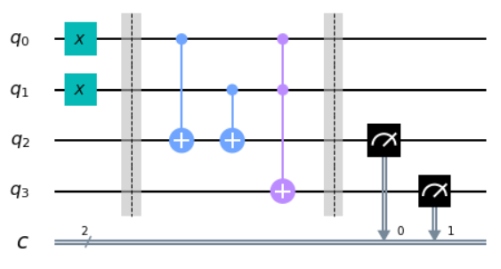

在本节的其余部分，我们将解释如何构建量子回路。在最后您会知道如何创建上面的回路，及其作用和意义。

### 第一个量子回路

在回路中，通常需要做三件事：首先对输入进行编码，然后进行一些实际的计算，最后提取输出。对于您的第一个量子回路，我们将聚焦在这些工作的最后一个。我们首先创建一个有8个量子比特和8个输出的回路。

> n = 8
>
> n_q = n
>
> n_b = n
>
> qc_output = QuantumCircuit(n_q,n_b)

在上述代码中创建的量子回路称之为qc_output，是由Qiskit使用QuantumCircuit创建的。数字n_q定义了回路中量子比特数量。n_b定义为从最后的回路中提取的输出比特数量。

在量子回路中，输出的提取是通过一种叫做**测量（measure**）的操作来完成的。每个测量都告诉一个特定量子比特给出一个特定的输出比特。下面的代码向8个量子比特中的每一个都添加一个测量操作。量子比特和比特都是由0到7的数字标记的（因为程序员喜欢这样做）。qc.measure(j,j)命令向回路qc添加一个测量，告诉量子比特j向比特j给出一个输出。

> for j in range(n):
>
> qc_output.measure(j,j)

现在我们的回路中有一些东西，我们来看一下。

qc_output.draw()

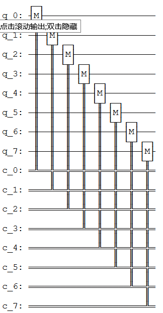

量子比特总是初始化为输出0。因为我们未对上面回路中的量子比特做任何处理，这就是我们测量量子比特时得到的结果。可以通过多次运行回路并将结果绘制成柱状图来了解这一点。我们会发现每个量子比特的结果总为00000000。

> counts =
> execute(qc_output,Aer.get_backend(\'qasm_simulator\')).result().get_counts()
>
> plot_histogram(counts)


运行多次并将结果显示为柱状图的原因是，量子计算机的结果可能存在一些随机性。在这种情况下，由于没有做任何量子计算，只确定得到了00000000的结果。

请注意，这一结果来自于一个量子模拟器，其本质仍是一个标准的计算机，理想的量子计算机会做什么？模拟器只可能运行少量的量子比特（大约30个)，但仍是设计第一个量子回路时非常有用的工具。若要在实际设备上运行，只需将Aer.get_backend(\'qasm_simulator\')替换为您想要使用设备的后端对象。

4.  ### 示例：创建一个加法回路

    1.  #### 编码输入

现在让我们看看如何将不同的二进制字串编码为输入。为此，我们需要一个被称为"非门NOT
gate"的东西。这是您在电脑上能做的最基本操作。非门可将比特值0翻转为1，1翻转为0。在量子计算中一个叫做x的运算来完成"非门"的工作。

在本小节中我们将创建了一个名称为qc_encode的用于编码输入的新回路。现在只指定量子比特的数目。

> qc_encode = QuantumCircuit(n)
>
> qc_encode.x(7)
>
> qc_encode.draw()
>
> 输出：

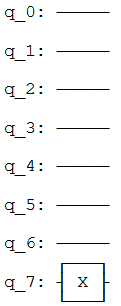

提取结果可以使用之前的回路：qc_output。使用qc_encode +
qc_output将创建一个新的回路，其中包含提取在回路末端输出所需的所有内容。

> qc = qc_encode + qc_output
>
> qc.draw(output=\'mpl\',justify=\'none\')
>
> 输出：

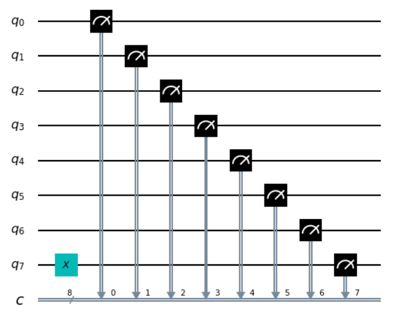

现在可以运行上述的组合回路并查看结果。

可以看到现在计算机输出的是字串10000000。

> counts =
> execute(qc,Aer.get_backend(\'qasm_simulator\')).result().get_counts()
>
> plot_histogram(counts)
>
> 输出：

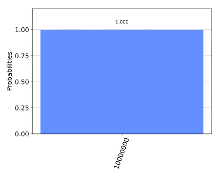

我们所翻转的那个比特，来自于量子比特7，位于字串的最左边。这是因为Qiskit将字串中的比特从右到左编号。有些人喜欢用另一种方式给比特编号，但是当我们用比特来表示数字时，Qiskit的系统肯定有其优势。具体来说，量子比特7告诉我们在数字中有多少个$2^{7}$。通过翻转这个比特，我们现在已经能够在一个简单的8位计算机中写入了数字128。

现在您可以试着再写一个数字，比如您的年龄。只要用搜索引擎找出相对应的二进制数字，然后如果你小于64岁，在左边加几个0。

> qc_encode = QuantumCircuit(n)
>
> qc_encode.x(1)
>
> qc_encode.x(5)
>
> qc_encode.draw()
>
> 输出：

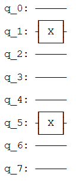

至此我们了解了如何在计算机中对信息进行编码。下一步是对其进行处理：将编码的输入转换为需要的输出。

#### 4.2 回想如何做加法

为了将输入转化为输出，我们需要解决一个问题。现在让我们做一些基本的数学运算。在小学时您会学到如何把大的数学问题分解成可处理的块。例如，您如何解决下面的问题？

$$\frac{\begin{matrix}
\ \ \ \ \ \ 9213 \\
 + \ \ \ 1854 \\
\end{matrix} }{= \ \ \ \ \ ????}$$

一种方法是从右到左一位数一位数地相加。从3+4开始：

$$\frac{\begin{matrix}
\ \ \ \ \ \ 9213 \\
 + \ \ \ 1854 \\
\end{matrix} }{= \ \ \ \ \ ???7}$$

然后是：

$$\frac{\begin{matrix}
\ \ \ \ \ \ 9213 \\
 + \ \ \ 1854 \\
\end{matrix} }{= \ \ \ \ \ ??67}$$

接着2+8=10。因为所得是一个两位数的答案，需要把答案中的1移到下一列。

$$\frac{\begin{matrix}
\ \ \ \ \ \ 9213 \\
 + \ \ \ 1854 \\
\end{matrix} }{\begin{matrix}
 = \ \ \ \ \ ?167 \\
\ \ \ \ \ \ \ \ \ 1\ \ \ \ \ \ \ \ \  \\
\end{matrix} }$$

最后计算9+1+1=11，就能获取最终结果：

$$\frac{\begin{matrix}
\ \ \ \ \ \ 9213 \\
 + \ \ \ 1854 \\
\end{matrix} }{\begin{matrix}
 = \ 11167 \\
\ \ \ \ \ \ \ \ \ 1\ \ \ \ \ \ \ \ \  \\
\end{matrix} }$$

这也许只是简单的加法，但其演示了所有算法背后的原理。无论这个算法是用来解决数学问题，还是用来处理文本或图像，我们总是把大任务分解成小而简单的步骤。

若要在计算机上运行，算法需要被编译到最小且最简单的步骤。为了看看算法的样子，我们用二进制再做一遍上面的加法问题。

$$\frac{\begin{matrix}
\ \ \ \ \ \ 10001111111101 \\
 + \ \ \ 00011100111110 \\
\end{matrix} }{= \ \ \ ?????????????}$$

注意第二个数的左边有一串额外的0，是为了让两个字符串的长度相同。

我们的第一个任务是对右边的列执行1+0。二进制与任何数字系统中一样，其结果是1。对于第二列的0+1我们得到了相同的结果。

$$\frac{\begin{matrix}
\ \ \ \ \ \ 10001111111101 \\
 + \ \ \ 00011100111110 \\
\end{matrix} }{= \ \ \ ???????????11}$$

然后是1+1。您肯定知道1+1=2。在二进制中，数字2被写成10，因此需要两位，表明我们要进位1，如同在十进制中要进位10一样。

$$\frac{\begin{matrix}
\ \ \ \ \ \ 10001111111101 \\
 + \ \ \ 00011100111110 \\
\end{matrix} }{\begin{matrix}
 = \ \ \ ??????????011 \\
\ \ \ \ \ \ \ \ \ \ \ \ \ \ \ \ \ \ \ \ \ \ \ \ \ \ \ \ 1 \\
\end{matrix} }$$

下一列现在要求计算1+1+1，需要把三个数字加在一起，所以对于计算机来说，事情变得越来越复杂。但是我们仍然可以把将其编译成更简单的操作，并且只需要把两个比特加在一起就可以了，可以从前两个1开始。

$$\frac{\begin{matrix}
\ \ \ \ \ \ \ \ 1 \\
 + \ \ \ \ \ 1 \\
\end{matrix} }{= \ \ 10}$$

现在需要把这个10与最后一个1相加，此时可以我们用通常的方法来做。

$$\frac{\begin{matrix}
\ \ \ \ \ \ \ \ 11 \\
 + \ \ \ \ \ 10 \\
\end{matrix} }{= \ \ \ \ 11}$$

最终的结果是11（也就是十进制的3）。

现在回到问题的其余部分。有了答案11，我们就有了另一个进位。

$$\frac{\begin{matrix}
\ \ \ \ \ \ 10001111111101 \\
 + \ \ \ 00011100111110 \\
\end{matrix} }{\begin{matrix}
 = \ \ \ \ ?????????1011 \\
\ \ \ \ \ \ \ \ \ \ \ \ \ \ \ \ \ \ \ \ \ \ 11 \\
\end{matrix} }$$

现在我们还有另一个1+1+1要操作。但我们已经知道怎么做了，所以没什么大不了的。

事实上，到目前为止剩下的事情我们都已经知道如何去做了。这是因为，如果您把所有的东西都分解成加2个比特，那么就只需要计算4中可能情况。以下是四中基本的和，其中把所有的答案用来2个比特表示，以保持一致。

0+0 = 00 (十进制 0+0=0)

0+1 = 01 (十进制 0+1=1)

1+0 = 01 (十进制 1+0=1)

1+1 = 10 (十进制 1+1=2)

这叫做半加器（**half
adder**）。如果我们的计算机可以实现，并且如果该计算机可以把这些操作链接在一起，那么这一计算机就可以累加任一值。

#### 4.3 使用Qiskit进行加法操作

现在用Qiskit制作我们自己的半加器。这一量子半加器中将包括对输入进行编码、执行算法和提取结果的回路。每当我们想要使用一个新的输入时，第一编码输入部分就需要改变，但其余部分将会始终保持不变。


我们想要加入的两个比特被编码成量子比特0和1。上图的例子中将这两个量子比特中都编码为1，因此其寻求的是1+1的解。结果是一个由两个比特组成的字串，将从量子比特2和3中读出。剩下的就是填写实际程序，位于中间的空白区域。

图中的虚线仅是为了区分回路的不同部分（尽管也可以有更有趣的用途）。虚线是使用barrier命令生成。

计算的基本操作被称为逻辑门（logic
gate）。上文中我们已经使用了非门，但仅有非门并不足以使实现半加器，只能用非门来手动写出答案。但是既然我们想让计算机为我们做实际的计算，我们就需要一些更为强大的逻辑门。

为了了解我们需要什么，再看看半加器需要做什么。

0+0 = 00

0+1 = 01

1+0 = 01

1+1 = 10

上面的四个答案中最右边的比特完全取决于我们添加的两个比特是相同的还是不同的。对于0+0和1+1的答案最右边的比特是0。对于0+1和1+0，当不同的比特值相加时，最右边的比特是1。

为了使这部分解正确，需要一些东西来判断两位是否不同。在传统数字计算的研究中被称为异或门（**XOR
gate**）。

|**Input 1**   |**Input 2**   |**XOR Output**|
|:--|:--|:--|
|0             |0             |0|
|0             |1             |1|
|1             |0             |1|
|1             |1             |0|

在量子计算机中，异或门的工作由受控非门（controlled-NOT gate）完成的。

> qc_cnot = QuantumCircuit(2)
>
> qc_cnot.cx(0,1)
>
> qc_cnot.draw()
>
> 输出：


因为该名字很长，所以通常就叫做CNOT，Qiskit中的名字是cx，甚至更短。回路图如下所示：

上面的CNOT作用于一个量子比特对。其中一个作为控制量子比特（有小黑点的）。另一个为目标量子比特（有x的）。

理论上有多种方法可以解释CNOT的效果。一种说法是它会查看两个输入比特，检查其是相同还是不同，然后把答案写在目标量子比特上。如果它们相同，则目标为0，如果不同，则目标为1。


另一种解释CNOT的方法是，如果控制端为1，则其对目标执行NOT，而不执行其他操作。这一解释和前一解释同样有效（事实上，正是由于这一解释才给予这一逻辑门CNOT的名称）。

您可以通过每种可能的输入来测试CNOT。例如，以下是一个用输入01测试CNOT的回路。

> qc = QuantumCircuit(2,2)
>
> qc.x(0)
>
> qc.cx(0,1)
>
> qc.measure(0,0)
>
> qc.measure(1,1)
>
> qc.draw()
>
> 输出：


如果云心这一回路，您会发现输出是11，这是由于下述原因之一：

-   CNOT计算输入值是否不同，若发现不同则输出1。通过写入量子比特1的状态（记住，它在比特字串的左边），将01变成11来实现这一点。

-   CNOT看到量子比特0处于状态1，所以对量子比特1应用NOT。这样就把量子比特1的0变成了1，从而把01变成了11。

下面是CNOT门的所有可能输入与对应输出的表格：

| Input  (q1 q0) | Output (q1 q0) |
| :------------: | :------------: |
|       0        |       0        |
|       1        |       11       |
|       10       |       10       |
|       11       |       1        |

对于半加器，我们并不想要覆写一个输入。相反，我们想把结果写在另一对量子比特上，为此可以使用两个CNOT。

> qc_ha = QuantumCircuit(4,2)
>
> \# encode inputs in qubits 0 and 1
>
> qc_ha.x(0) \# For a=0, remove this line. For a=1, leave it.
>
> qc_ha.x(1) \# For b=0, remove this line. For b=1, leave it.
>
> qc_ha.barrier()
>
> \# use cnots to write the XOR of the inputs on qubit 2
>
> qc_ha.cx(0,2)
>
> qc_ha.cx(1,2)
>
> qc_ha.barrier()
>
> \# extract outputs
>
> qc_ha.measure(2,0) \# extract XOR value
>
> qc_ha.measure(3,1)
>
> qc_ha.draw()
>
> 输出：


我们现在实现了一个完全半加器的一半功能。只剩下用于输出的比特要处理：存在于量子比特4上的比特。

若再看一下四种可能的和，您会注意到只有一种情况是1代替0：1+1=10。只有当我们加的两个比特都是1时才会发生。

为了计算这部分的输出，我们可以让计算机看看是否两个输入都是1。当且仅当都是1时------我们需要在量子比特4上做一个非门，把值翻转到所需的值1（仅在本例中），从而得到想要的输出。

为此我们需要一个新的逻辑门：与CNOT类似，但控制端在两个量子比特而非一个。只有当两个控制端都处于状态1时，才会对目标量子比特执行NOT。这一新的逻辑门叫做***Toffoli门***。对于熟悉布尔逻辑门的人来说，其基本上就是一个与门（**AND
gate**）。

在Qiskit中，Toffoli用ccx命令表示。

> qc_ha = QuantumCircuit(4,2)
>
> \# encode inputs in qubits 0 and 1
>
> qc_ha.x(0) \# For a=0, remove the this line. For a=1, leave it.
>
> qc_ha.x(1) \# For b=0, remove the this line. For b=1, leave it.
>
> qc_ha.barrier()
>
> \# use cnots to write the XOR of the inputs on qubit 2
>
> qc_ha.cx(0,2)
>
> qc_ha.cx(1,2)
>
> \# use ccx to write the AND of the inputs on qubit 3
>
> qc_ha.ccx(0,1,3)
>
> qc_ha.barrier()
>
> \# extract outputs
>
> qc_ha.measure(2,0) \# extract XOR value
>
> qc_ha.measure(3,1) \# extract AND value
>
> qc_ha.draw()
>
> 输出：


在这个示例中计算了1+1，由于两个输入比特都是1，看看能得到什么。

> counts =
> execute(qc_ha,Aer.get_backend(\'qasm_simulator\')).result().get_counts()
>
> plot_histogram(counts)
>
> 输出：


结果是10，是十进制数字2的二进制表示。我们已经建立了一个能够解决著名的数学问题1+1的计算器。

现在您可以用其他三种可能的输入进行尝试，并证明上述的算法也给出了正确结果。

半加器包含了所有需要的加法。使用NOT、CNOT和Toffoli门，我们可以创建累加任意大小的任意数字的程序。

这三个门也足以在计算机领域做任何事情。事实上，我们甚至可以不使用CNOT，而非门实际上只需要创建值为1的比特。Toffoli门实质上是数学的基元，是其他所有问题解决技术都可以编译成的最简单元素。

正如下面的代码的输出所示，在量子计算中我们会拆分基元。

> import qiskit
>
> qiskit.\_\_qiskit_version\_\_
>
> 输出：
>
> {\'qiskit-terra\': \'0.14.1\',
>
> \'qiskit-aer\': \'0.5.1\',
>
> \'qiskit-ignis\': \'0.3.0\',
>
> \'qiskit-ibmq-provider\': \'0.7.1\',
>
> \'qiskit-aqua\': \'0.7.1\',
>
> \'qiskit\': \'0.19.2\'}

1.3 呈现量子比特的状态
----------------------

现在您对比特和所熟悉的数字计算机的工作原理有了一些了解。在现代软件中使用的所有复杂变量、对象和数据结构基本上都是一大堆比特。从事量子计算的人称之为经典变量。使用经典变量的计算机，就像您用来阅读这篇文章的计算机，称之为经典计算机。

在量子计算机中，我们的基本变量是量子比特：比特的量子变体。量子比特所有的限制与经典比特完全相同：只能存储单个二进制比特的信息，并且只能输出0或1。然而，量子比特也可以被操纵，但只能用量子力学来描述。这一点给我们提供了新的选择，让我们可以找到设计算法的新方法。

若要完全理解这些新的量子门，我们首先需要理解如何写出量子态。为此，我们将使用向量、矩阵和复数的数学方法。虽然我们将在进行过程中介绍这些概念，但是最好您对其有所熟悉。如果需要更深入的解释或复习，可以在本教程"0.预备知识"的线性代数中找到相应的指南。

### 本节的内容

1.  经典比特与量子比特

    1.  态向量

    2.  量子比特的表示法

    3.  使用Qiskit探索量子比特

2.  测量规则

> 2.1 一条非常重要的规则
>
> 2.2 这一规则的寓意

3.  Bloch球

    1.  描述受限量子比特的状态

    2.  直观地呈现一个量子比特的状态

```{=html}
<!-- -->
```
1.  ### 经典比特与量子比特

    1.  #### 态向量

在量子物理中我们使用态向量（**statevector**）描述一个系统的状态。假设我们想描述一辆车沿着轨道的位置，在这一经典的系统中可以用一个数字x描述：

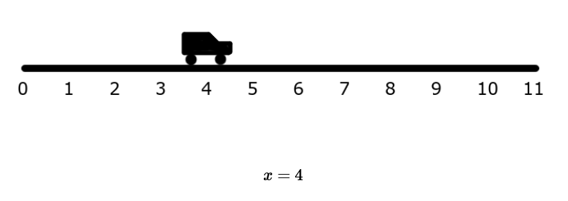

或者，我们可以使用一个名为statevector向量中的数字集合来描述。statevector中的每个元素都含有在某一位置找到汽车的概率：

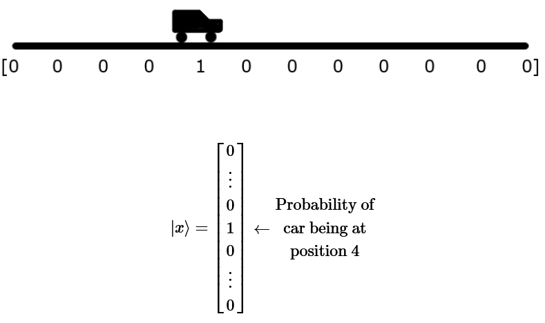

这中表示方法并不局限于位置，还可以用态向量记录所有可能的速度以及所有可能的颜色。在经典系统中（如上面的汽车例子），这是一件愚蠢的事情，因为当我们只需要一个数字时，该系统需要包含巨量的向量。但是正如我们将在本章中看到的，态向量碰巧是持续跟踪量子系统（包括量子计算机）一种非常好的方法。

#### 量子比特表示法

经典比特总是有一个完全良好定义的状态：在计算过程中的每一个点都是0或1。我们不能在这一样的一个比特上增加状态的细节。所以要写入经典比特(c)状态a，我们仅能用这两个二进制值。例如：

c = 0

量子比特的这种限制被解除了。无论我们从一个量子比特得到0还是1，只需要在进行测量以提取输出时定义清楚即可。此时，其必须提交所使用的这两个选项中的一个。在其他任何时候，其状态都比一个简单的二进制值所能捕捉到的要复杂。

为了了解如何描述这些，我们可以首先关注两个最简单的情况。正如我们在上一节中所看到的，有可能准备一个量子比特，使其在测量时的结果明确为0。

我们需要为这一状态命名，就叫做0吧。类似地，存在一个一定会输出1的量子比特状态，叫做1。这两种状态完全互斥。要么量子比特明确输出0，要么明确输出1，没有重叠。用数学表示它的一种方法是使用两个正交的向量。

$$\left| 0 \right\rangle = \begin{bmatrix}
1 \\
0 \\
\end{bmatrix}\text{\ \ }\left| 1 \right\rangle = \begin{bmatrix}
0 \\
1 \\
\end{bmatrix}$$

这是一个很复杂的概念。首先让我们了解奇怪的符号\|和⟩。这两个符号的作用本质上就是提醒我们，所讨论的是表示量子比特状态的向量，标记为0和1。这些符号有助于我们将其与诸如比特值0和1或数字0和1之类的东西区分开来。两个符号是由狄拉克引入的"狄拉克符号（bra-ket
notation）"的一部分。

如果您不熟悉向量，可以把它们想象成一串用一些特定的规则处理的数字。如果您在高中物理课上熟悉向量，就会知道这些规则使向量非常适合描述有大小和方向的量。例如，一个物体的速度可以用向量完美地描述。然而，我们用向量表示量子态的方式与此稍有不同。所以不要太执着于之前的直觉，是时候做一些新的事情了!

通过向量我们可以描述更复杂的状态，而不仅仅是\|0⟩和\|1⟩，比如向量：

$$\left| q_{0} \right\rangle = \begin{bmatrix}
\frac{1}{\sqrt{2} } \\
\frac{i}{\sqrt{2} } \\
\end{bmatrix}$$

为了理解这一状态所代表的含义，我们需要使用数学规则来处理这个向量。具体来说，我们需要理解如何将向量相加以及如何与标量相乘（**scalar**）。

**提示：按标量进行矩阵加法和乘法**

两个向量相加，把它们的元素相加：

$$\left| a \right\rangle = \begin{bmatrix}
a_{0} \\
a_{1} \\
 \vdots \\
a_{n} \\
\end{bmatrix}\ ,\ \left| b \right\rangle = \begin{bmatrix}
b_{0} \\
b_{1} \\
 \vdots \\
b_{n} \\
\end{bmatrix}$$

$$\left| a \right\rangle + \left| b \right\rangle = \begin{bmatrix}
a_{0} + b_{0} \\
a_{1} + b_{1} \\
 \vdots \\
a_{n} + b_{n} \\
\end{bmatrix}$$

将一个向量乘以一个标量，就是将向量中的每个元素乘以标量：

$$x\left| a \right\rangle = \begin{bmatrix}
x \times a_{0} \\
x \times a_{1} \\
 \vdots \\
x \times a_{n} \\
\end{bmatrix}$$

这两个规则用于重写向量$\left| q_{0} \right\rangle$(如上所示):

$${\left| q_{0} \right\rangle = \frac{1}{\sqrt{2} }\left| 0 \right\rangle + \frac{i}{\sqrt{2} }\left| 1 \right\rangle
}{= \frac{1}{\sqrt{2} }\begin{bmatrix}
1 \\
0 \\
\end{bmatrix} + \frac{i}{\sqrt{2} }\begin{bmatrix}
0 \\
1 \\
\end{bmatrix}
}{= \begin{bmatrix}
\frac{1}{\sqrt{2} } \\
0 \\
\end{bmatrix} + \begin{bmatrix}
0 \\
\frac{i}{\sqrt{2} } \\
\end{bmatrix}
}{= \begin{bmatrix}
\frac{1}{\sqrt{2} } \\
\frac{i}{\sqrt{2} } \\
\end{bmatrix} }$$

**提示：标准正交基(Orthonormal Base)**

正如在之前申明的一样，两个向量\|0⟩和\|1⟩正交，表明这两个向量都是正交和正规化（normalised）。正交表示两个向量成直角:

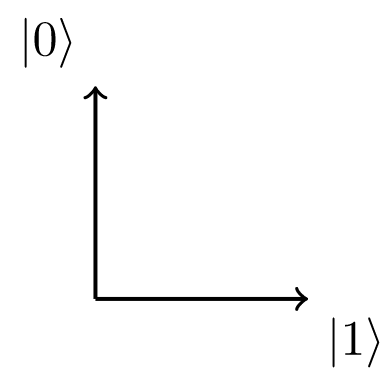

正规化表示向量的大小（箭头的长度）等于1。若两个向量\|0⟩和\|1⟩是线性无关,表明我们不能描述用\|1⟩描述\|0⟩，反之亦然。然而,使用向量\|0⟩和\|1⟩以及加法和标量乘法的规则,我们可以描述所有可能的2D空间中向量:

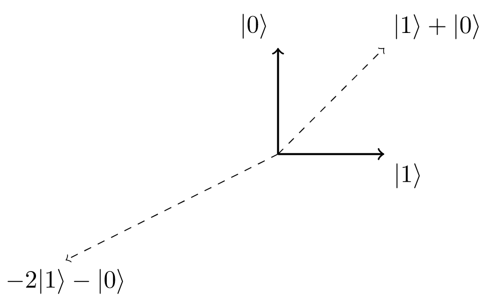

由于向量\|0⟩与\|1⟩线性无关,并且可以通过使用向量加法和标量乘法来描述在2D空间中的任一向量,我们说向量\|0⟩和\|1⟩是2D空间的基。在这种情况下，因为这两个向量都是正交和正规，所以称之为标准正交基（orthonormal
basis）。

由于状态\|0⟩和\|1⟩形成了一组标准正交基，我们可以用这两个状态的组合代表任一2D向量。这就可以让我们把量子比特的状态写成另一种形式：

$$\left| q_{0} \right\rangle = \frac{1}{\sqrt{2} }\left| 0 \right\rangle + \frac{i}{\sqrt{2} }\left| 1 \right\rangle$$

向量$\left| q_{0} \right\rangle$被称为量子比特的态向量（**statevector**），告诉我们量子比特所能知道的一切。至此，我们只能得出一些有关这一特定态向量例子的简单结论：并不完全为\|0⟩，也不完全为\|1⟩。相反，上面的态向量是由$\left| 0 \right\rangle$与$\left| 1 \right\rangle$的线性组合来描述的。在量子力学中，我们通常用"叠加（**superposition**）"这个词来描述类似的线性组合。

显然我们的态向量$\left| q_{0} \right\rangle$的示例可以表示为一个\|0⟩和\|1⟩的叠加，没有比其更能明确且良好定义的量子比特状态了。为了说明这一点，我们开始探索如何操纵一个量子比特。

#### 使用Qiskit探索量子比特

首先，我们需要在Python中导入需要的所有工具：

> from qiskit import QuantumCircuit, execute, Aer
>
> from qiskit.visualization import plot_histogram, plot_bloch_vector
>
> from math import sqrt, pi

在Qiskit中使用QuantumCircuit对象来存储量子回路，本质上是回路中的量子以及所作用量子比特的列表。

qc = QuantumCircuit(1) \# Create a quantum circuit with one qubit

在量子回路中，量子比特总是以状态\|0⟩开始。可以使用initialize()方法将其转换为任一状态。我们以列表的形式给与方法initialize()想要的向量，并告诉它初始化哪一量子比特为这一状态：

> qc = QuantumCircuit(1) \# Create a quantum circuit with one qubit
>
> initial_state = \[0,1\] \# Define initial_state as
> $\left| 1 \right\rangle$
>
> qc.initialize(initial_state, 0) \# Apply initialisation operation to
> the 0th qubit
>
> qc.draw() \# Let\'s view our circuit
>
> 输出：

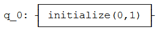

然后，使用Qiskit的模拟器之一来查看量子比特的结果状态。首先，我们将使用statevector模拟器，将在稍后解释不同的模拟器及其用途。

backend = Aer.get_backend(\'statevector_simulator\') \# Tell Qiskit how
to simulate our circuit

为了从回路中得到结果，通过将回路和后端（backend）作为参数输入execute中来运行该回路。然后使用.result()来获得以下结果：

> qc = QuantumCircuit(1) \# Create a quantum circuit with one qubit
>
> initial_state = \[0,1\] \# Define initial_state as
> $\left| 1 \right\rangle$
>
> qc.initialize(initial_state, 0) \# Apply initialisation operation to
> the 0th qubit
>
> result = execute(qc,backend).result() \# Do the simulation, returning
> the result

根据result，我们可以使用.get_statevector()获得最终的statevector：

> qc = QuantumCircuit(1) \# Create a quantum circuit with one qubit
>
> initial_state = \[0,1\] \# Define initial_state as \|1\>
>
> qc.initialize(initial_state, 0) \# Apply initialisation operation to
> the 0th qubit
>
> result = execute(qc,backend).result() \# Do the simulation, returning
> the result
>
> out_state = result.get_statevector()
>
> print(out_state) \# Display the output state vector
>
> 输出：
>
> \[0.+0.j 1.+0.j\]

**注意**：Python使用j表示复数的i。从输出中可以看到一个有两个复元素的向量：0.+0.j
= 0，和1 +0.j = 1。

现在让我们像在真正的量子计算机中一样测量量子比特，来看看结果：

> qc.measure_all()
>
> qc.draw()
>
> 输出：

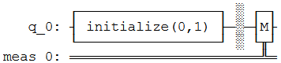

这次，我们不再使用statevector，而是使用.get_counts()来获取0和1结果的计数：

> result = execute(qc,backend).result()
>
> counts = result.get_counts()
>
> plot_histogram(counts)
>
> 输出：


可以看到,毫无疑问的有100%的机会测量值为\|1⟩。这一次，把量子比特放到叠加位置，看看会发生什么，在此我们将使用在本节中之前的状态$\left| q_{0} \right\rangle$：

$$\left| q_{0} \right\rangle = \frac{1}{\sqrt{2} }\left| 0 \right\rangle + \frac{i}{\sqrt{2} }\left| 1 \right\rangle$$

我们需要将这些幅值添加到python列表中。为了表述复数幅值，我们使用复数并给出实部和虚部作为参数：

initial_state = \[1/sqrt(2), 1j/sqrt(2)\] \# Define state \|q\>

然后我们重复初始化量子比特的步骤：

> qc = QuantumCircuit(1) \# Must redefine qc
>
> qc.initialize(initial_state, 0) \# Initialise the 0th qubit in the
> state \`initial_state\`
>
> state = execute(qc,backend).result().get_statevector() \# Execute the
> circuit
>
> print(state) \# Print the result
>
> 输出：
>
> \[0.70710678+0.j 0.+0.70710678j\]
>
> results = execute(qc,backend).result().get_counts()
>
> plot_histogram(results)
>
> 输出：

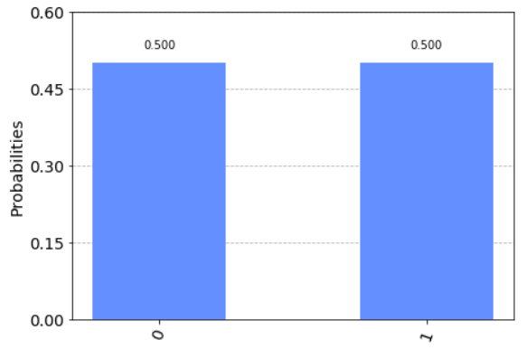

可以看到我们测量\|0⟩或\|1⟩所得概率相等。为了向您解释这一点，需要谈一谈测量。

2.  ### 测量规则

    1.  #### 一条非常重要的规则

有一条简单的测量规则。找出在我们所创建的态$\left| x \right\rangle$中测量出态$\left| \psi \right\rangle$的概率：

$$p(|\psi\rangle) = \left| \left\langle \psi \middle| x \right\rangle \right|^{2}$$

其中符号⟨和\|表示$\left\langle \psi \right|$是一个行向量。在量子力学中，我们称列向量为右矢（ket），称行向量为左矢（bra），合在一起构成了狄拉克符号。任何右矢$\left| a \right\rangle$都有对应的左矢$\left\langle a \right|$，可以使用共轭转置（conjugate
transpose）对其进行转换。

**提示：内积（Inner Product）**

向量相乘有不同的方法，在这里我们用内积。内积是点积（*dot
product*）的一般化，对于点积您可能已经很熟悉了。在本指南中，我们使用了一个左矢(行向量)和一个右矢(列向量)之间的内积，其遵循以下规则:

$$\langle a| = \left\lbrack a_{0}^{*},a_{1}^{*},\cdots,a_{n}^{*} \right\rbrack\ ,\left| b \right\rangle = \begin{bmatrix}
b_{0} \\
b_{1} \\
 \vdots \\
b_{n} \\
\end{bmatrix}$$

$$\left\langle a \middle| b \right\rangle = a_{0}^{*}b_{0} + a_{1}^{*}b_{1} + \cdots + a_{n}^{*}b_{n}$$

可以看到两个向量的内积总是给出一个标量。记住其中一个有用的概念：**两个正交向量的内积为0**。例如,如果有两个正交向量$|0\rangle$和$|1\rangle$：

$$\left\langle 0 \middle| 1 \right\rangle = \left\lbrack 0,1 \right\rbrack\begin{bmatrix}
1 \\
0 \\
\end{bmatrix} = 0$$

另外，也应记住向量$|0\rangle$和$|1\rangle$也都是正规化的（大小等于1）：

$$\left\langle 0 \middle| 0 \right\rangle = \left\lbrack 1,0 \right\rbrack\begin{bmatrix}
1 \\
0 \\
\end{bmatrix} = 1$$

$$\left\langle 1 \middle| 1 \right\rangle = \left\lbrack 0,1 \right\rbrack\begin{bmatrix}
0 \\
1 \\
\end{bmatrix} = 1$$

在上面的等式中，$\left| x \right\rangle$可以是量子比特的任一状态。为了找出测量$\left| x \right\rangle$的概率，我们取$\left| x \right\rangle$和所测状态（本示例中为$\left| \psi \right\rangle$）的内积，然后对起结果取平方。听上去有点复杂，但很快就会成为您的第二天性。

如果我们回头看一下之前的态$\left| q_{0} \right\rangle$，能够看到测量$\left| 0 \right\rangle$的概率是0.5。

$${\left| q_{0} \right\rangle = \frac{1}{\sqrt{2} }\left| 0 \right\rangle + \frac{i}{\sqrt{2} }\left| 1 \right\rangle
}{\langle q_{0}| = \frac{1}{\sqrt{2} }\langle 0| - \frac{i}{\sqrt{2} }\langle 1|
}{\left\langle q_{0} \middle| 0 \right\rangle = \frac{1}{\sqrt{2} }\left\langle 0 \middle| 0 \right\rangle - \frac{i}{\sqrt{2} }\left\langle 1 \middle| 0 \right\rangle
}{\left\langle q_{0} \middle| 0 \right\rangle = \frac{1}{\sqrt{2} } \bullet 1 - \frac{i}{\sqrt{2} } \bullet 0
}{\left\langle q_{0} \middle| 0 \right\rangle = \frac{1}{\sqrt{2} } \Rightarrow {|\left\langle q_{0} \middle| 0 \right\rangle|}^{2} = \frac{1}{2} }$$

您可以把验证测量$\left| 1 \right\rangle$的概率当作练习。

这一规则支配着我们如何从量子态得到信息，因此对我们在量子计算中所做的一切都非常重要。该规则也直接暗示了一些重要的事实。

#### 这一条规则的寓意

##### \#1 标准化、正态化（Normalisation）

这条规则告诉我们幅值与概率有关。如果想让概率加起来等于1，需要确保态向量恰当地归一化。具体来说，我们需要态向量的大小为1。

$$\left\langle \psi \middle| \psi \right\rangle = 1$$

因此，如果：

$$\left| \psi \right\rangle = \alpha\left| 0 \right\rangle + \beta\left| 1 \right\rangle$$

然后：

$$\sqrt{\left| \alpha \right|^{2} + \left| \beta \right|^{2} } = 1$$

这就解释了在本章中见到过的因子$\sqrt{2}$。事实上，如果我们试图给initialize()一个正规化的向量，就会给出一个错误：

> vector = \[1,1\]
>
> qc.initialize(vector, 0)
>
> 输出：
>
> \-\-\-\-\-\-\-\-\-\-\-\-\-\-\-\-\-\-\-\-\-\-\-\-\-\-\-\-\-\-\-\-\-\-\-\-\-\-\-\-\-\-\-\-\-\-\-\-\-\-\-\-\-\-\-\-\-\-\-\-\-\-\-\-\-\-\-\-\-\-\-\-\-\--
>
> QiskitError Traceback (most recent call last)
>
> \<ipython-input-28-ddc73828b990\> in \<module\>
>
> 1 vector = \[1,1\]
>
> \-\-\--\> 2 qc.initialize(vector, 0)
>
> \~/anaconda3/lib/python3.7/site-packages/qiskit/extensions/quantum_initializer/initializer.py
> in initialize(self, params, qubits)
>
> 252 if not isinstance(qubits, list):
>
> 253 qubits = \[qubits\]
>
> \--\> 254 return self.append(Initialize(params), qubits)
>
> 255
>
> 256
>
> \~/anaconda3/lib/python3.7/site-packages/qiskit/extensions/quantum_initializer/initializer.py
> in \_\_init\_\_(self, params)
>
> 56 if not math.isclose(sum(np.absolute(params) \*\* 2), 1.0,
>
> 57 abs_tol=\_EPS):
>
> \-\--\> 58 raise QiskitError(\"Sum of amplitudes-squared does not
> equal one.\")
>
> 59
>
> 60 num_qubits = int(num_qubits)
>
> QiskitError: \'Sum of amplitudes-squared does not equal one.\'

###### 快速练习

1.  构建一个态向量，其能在测量$\left| 0 \right\rangle$时给出1/3的概率。

2.  构建一个不同的态向量，但能够给出相同的测量概率。

3.  验证测量$\left| 1 \right\rangle$的两个这两个态的概率是2/3。

您可以在下面的小工具中查看答案（你可以在向量中使用"pi"和"sqrt"）：

> \# Run the code in this cell to interact with the widget
>
> from qiskit_textbook.widgets import state_vector_exercise
>
> state_vector_exercise(target=1/3)
>
> \#qiskit_textbook这个模块一直都没有找到

##### \#2 替代测量

测量规则给出了$\left| x \right\rangle$中测得$\left| \psi \right\rangle$的概率$p(|x\rangle)$，还告诉我们$\left| x \right\rangle$要么是$\left| 0 \right\rangle$，要么是$\left| 1 \right\rangle$。

到目前为止，我们所考虑的测量实际上只是测量一个量子比特无数可能方法中的一种。对于任何正交的状态对，我们可以定义一个度量，使量子比特在这两个状态之间进行选择。

下一节将进一步探讨这种可能性。现在,请仅记住$\left| x \right\rangle$并不局限于只是$\left| 0 \right\rangle$或$\left| 1 \right\rangle$。

##### \#3 全局相位（Global Phase）

我们知道测量态\|1⟩将给出确定输出1。但是我们也可以写出类似以下的状态：

$$\begin{bmatrix}
0 \\
i \\
\end{bmatrix} = i\left| 1 \right\rangle$$

为了了解其行为，对其应用测量规则。

$$\left| \left\langle x \middle| \left( i \middle| 1 \right\rangle \right) \right|^{2} = \left| i\left\langle x \middle| 1 \right\rangle \right|^{2} = \left| \left\langle x \middle| 1 \right\rangle \right|^{2}$$

此处我们发现：一旦取复数的大小时$i$就消失了。这一效果完全独立于态$\left| x \right\rangle$的测量。所以其与我们想要测量的无关，所测得态$i\left| x \right\rangle$的概率与测量态$\left| 1 \right\rangle$完全一致。由于测量是我们从一个量子比特中提取信息的唯一方法，表明这两种状态在物理相关的所有方面都是等价的。

更普遍的情况是，我们将在状态为$\left| \gamma \right| = 1$中的任一总体因子$\gamma$指称为"全局相位"。仅因全局相位而不同的状态在物理上是无法区分的。

$$\left| \left\langle x \middle| \left( \gamma \middle| a \right\rangle \right) \right|^{2} = \left| \gamma\left\langle x \middle| a \right\rangle \right|^{2} = \left| \left\langle x \middle| a \right\rangle \right|^{2}$$

注意！上述所讲的不同于叠加之间的相位差，叠加即所谓的"相对相位（**relative
phase**）"。一旦我们考虑不同类型的度量时就会变为相关。

##### \#4 观察者效应（The Observer Effect）

我们已经知道幅值包含了我们在特定状态下找到量子比特概率的信息，但是一旦我们测量了量子比特，就确切地知道了量子比特的状态。例如，如果在一个状态下测量量子比特：

$$\left| q \right\rangle = \alpha\left| 0 \right\rangle + \beta\left| 1 \right\rangle$$

发现该量子比特处于态$\left| 0 \right\rangle$，如果我们再次测量，则可以100%确定该量子比特处于态$\left| 0 \right\rangle$。表明测量操作改变（*change*）了量子比特的状态。

$$\left| q \right\rangle = \begin{bmatrix}
\alpha \\
\beta \\
\end{bmatrix}\overset{\text{Measure}\left| 0 \right\rangle}{\rightarrow}\left| q \right\rangle = \left| 0 \right\rangle = \begin{bmatrix}
1 \\
0 \\
\end{bmatrix}$$

我们有时把这称为塌缩量子比特的状态。这是一种强有力的影响，因此必须明智地加以利用。例如,我们在每次计算时不断地测量每个量子比特来跟踪它们的值，这些量子比特都只是在被定义明确的状态\|0⟩或\|1⟩之一。因此，量子比特与经典比特没有什么不同，我们的计算可以很容易被经典计算所取代。为了获得真正的量子计算，我们必须允许量子比特探索更复杂的状态。因此，只有在需要提取输出时才测量，其意义是我们经常把所有的测量放在量子回路的末端。

可以使用Qiskit的statevector模拟器来演示这一点。首先初始化一个叠加态量子比特：

> qc = QuantumCircuit(1) \# Redefine qc
>
> initial_state = \[0.+1.j/sqrt(2),1/sqrt(2)+0.j\]
>
> qc.initialize(initial_state, 0)
>
> qc.draw()
>
> 输出：

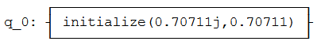

上面的代码初始化一个量子比特处于态：

$$\left| q \right\rangle = \frac{i}{\sqrt{2} }\left| 0 \right\rangle + \frac{1}{\sqrt{2} }\left| 1 \right\rangle$$

可以用模拟器来验证量子比特是否处于上述的状态：

> state = execute(qc, backend).result().get_statevector()
>
> print(\"Qubit State = \" + str(state))
>
> 输出：
>
> Qubit State = \[0.+0.70710678j 0.70710678+0.j\]

从输出中可以看到量子比特初始化的状态\[0.+0.70710678j
0.70710678+0.j\]，正是所期望的状态。

现在对该量子比特进行测量：

> qc.measure_all()
>
> qc.draw()
>
> 输出：


当我们模拟整个回路时，可以看到其中一个幅值总为0：

> state = execute(qc, backend).result().get_statevector()
>
> print(\"State of Measured Qubit = \" + str(state))
>
> 输出：
>
> State of Measured Qubit = \[0.+1.j 0.+0.j\]

您可以重新运行这个单元几次，以便重新初始化量子比特并再次测量。您可能会注意到所有的测量结果都是等可能的，但量子比特的状态从来就不是叠加了\|0⟩和\|1⟩。比较有趣的是，全局相位状态\|0⟩幸存了下来，但因为这是全局相位，我们永远无法在一个真正的量子计算机中对其测量。

####### 关于量子模拟器的说明

依据上述过程可以看到记录一个量子比特的状态需要跟踪两个复数，但是当使用真正的量子计算机时，我们只会收到每个量子比特处于是或否(0或1)答案。10-qubit的量子计算机输出如下所示：

0110111110

只有10位，没有叠加及复杂的幅值。当使用真正的量子计算机时，我们无法在计算过程中看到量子比特的状态，因为对其测量或破坏状态！这种行为对于学习来说并不理想，因此Qiskit提供了不同的量子模拟器：qasm_simulator的行为就像您在与真正的量子计算机进行交互一样，并且不允许您使用.get_statevector()。或者使用statevector_simulator（态向量模拟器）在测量之前查看量子态，正如使用的方式。

### 布洛赫球（Bloch Sphere）

#### 3.1 描述受限的量子比特状态

我们在本章的先前部分看到量子比特\|q⟩的一般状态：

$$\left| q \right\rangle = \alpha\left| 0 \right\rangle + \beta\left| 1 \right\rangle$$

$$\alpha,\beta\mathbb{\in C}$$

（第二行告诉我们$\alpha$和$\beta$是复数。）第2节的前两个含意告诉我们，我们无法区分其中的状态，表明可以更具体地描述量子比特。

首先，因为我们不能衡量全局相位，只能测量态\|0⟩和\|1⟩之间的相位差异。加入α和β就变得更加复杂了，我们可以将其限制在实数范围内，然后加上一项，以便找出之间的相对相位：

$$\left| q \right\rangle = \alpha\left| 0 \right\rangle + e^{\text{iϕ} }\beta\left| 1 \right\rangle\left( 欧拉公式：e^{\text{ix} } = cosx + isinx \right)$$

$$\alpha,\beta,\phi \in \mathbb{R}$$

最后，由于量子比特的状态必须正规化，即：

$$\sqrt{\alpha^{2} + \beta^{2} } = 1$$

可以用三角恒等式：

$$\sqrt{\sin^{2}x + \cos^{2}x} = 1$$

用一个变量$\theta$分别描述实数$\alpha$和$\beta$：

$\alpha = \cos\frac{\theta}{2}\ ,\ \beta = \sin\frac{\theta}{2}$

#### 3.2 直观地呈现一个量子比特的状态

我们会想要绘制出通常的量子比特状态：

$$\left| q \right\rangle = \cos\frac{\theta}{2}\left| 0 \right\rangle + e^{\text{iϕ} }\sin\frac{\theta}{2}\left| 1 \right\rangle$$

如果我们将$\theta$和$\phi$演绎为球体的坐标（r=1，因量子比特状态的大小是1），就可以在球体的表面绘制出任一量子比特，该球体称之为布洛赫球（Bloch
Sphere）。

下面我们绘制了一个量子比特\|+⟩的状态，其中θ=π/2、ϕ=0。

（Qiskit有一个用于绘制洛赫球的函数plot_bloch_vector()，但是在编写本文时，它只使用笛卡尔坐标。所以我们添加了一个自动转换的函数。）

> from qiskit_textbook.widgets import plot_bloch_vector_spherical
>
> coords = \[pi/2,0,1\] \# \[Theta, Phi, Radius\]
>
> plot_bloch_vector_spherical(coords) \# Bloch Vector with spherical
> coordinates
>
> 输出：


**警告！**

当第一次学习量子比特的状态时，很容易把量子比特的态向量与其Bloch向量混淆。请记住，在本教程1.1中讨论的态向量是向量，其中保存了量子比特可处于两种状态的幅值。Bloch向量是一种可视化工具，可以将复杂二维态向量映射到真实的三维空间。

从这一点来看，通过变量$\phi$和$\theta$可以描述任何量子比特的状态：

$$\left| q \right\rangle = \cos\frac{\theta}{2}\left| 0 \right\rangle + e^{\text{iϕ} }\sin\frac{\theta}{2}\left| 1 \right\rangle\ ,\ \ \theta,\phi\mathbb{\in R}$$

#### 快速练习

使用plot_bloch_vector()或plot_bloch_sphere_spherical()以下状态的量子比特：

1.  $\left| 0 \right\rangle$

2.  $\left| 1 \right\rangle$

3.  $\frac{1}{2}\left( \left| 0 \right\rangle + \left| 1 \right\rangle \right)$

4.  $\frac{1}{2}\left( \left| 0 \right\rangle - i\left| 1 \right\rangle \right)$

5.  $\frac{1}{2}\begin{bmatrix}
    i \\
    1 \\
    \end{bmatrix}$

我们还可以使用下面的小部件从球坐标转换为笛卡尔坐标，可将转换后的坐标用于plot_bloch_vector()：

> from qiskit_textbook.widgets import bloch_calc
>
> bloch_calc()
>
> import qiskit
>
> qiskit.\_\_qiskit_version\_\_
>
> 输出：
>
> {\'qiskit-terra\': \'0.14.1\',
>
> \'qiskit-aer\': \'0.5.1\',
>
> \'qiskit-ignis\': \'0.3.0\',
>
> \'qiskit-ibmq-provider\': \'0.7.1\',
>
> \'qiskit-aqua\': \'0.7.1\',
>
> \'qiskit\': \'0.19.2\'}

1.4 单量子比特门
----------------

在之前的章节中我们找寻了一个量子比特的可能状态。我们看到量子比特可以用二维向量表示，并且量子比特的状态被限制为：

$$\left| q \right\rangle = \cos\frac{\theta}{2}\left| 0 \right\rangle + e^{\text{iϕ} }\sin\frac{\theta}{2}\left| 1 \right\rangle$$

其中$\theta$和$\phi$是实数。本部分的内容将覆盖门（gate）：改变量子比特状态的操作。由于门的数量及其之间的相似性，本章有成为一个列表的风险。为了解决这一问题，我们在本章中适当的地方加入了一些题外话来介绍重要的思想。

### 内容

1.  泡利门（Pauli Gate）

    1.  泡利X门（Pauli X-Gate）

    2.  泡利Y和Z门（Pauli Y-Gate 、Pauli Z-Gate）

2.  题外话：X、Y和Z-基

3.  阿达马门（Hadamard Gate）

4.  题外话：以不同的基测量

5.  $R_{\phi}$门（R~ϕ~-gate）

6.  I、S和T-门（I、S、T-gates）

> 6.1 I-Gate
>
> 6.2 S-Gate
>
> 6.3 T-Gate

7.  通用U~3~门（U~3~-gate）

在基元的计算中会遇到了一些门，并用它们来进行经典的计算。量子回路的一个重要特征是在初始化量子比特和测量量子比特之间，操作（gate）总是可逆的！这些可逆的门可以表示为矩阵，也可以表示为绕布洛赫球的旋转。

> from qiskit import \*
>
> from math import pi
>
> from qiskit.visualization import plot_bloch_multivector

### 泡利门（Pauli Gate）

您应该熟悉线性代数部分的泡利矩阵。如果本部分中的数学知识对于您来说从未遇到，那么应该使用本教程的线性代数部分来加快阅读速度。我们将在本部分中了解到泡利矩阵可以用于表示一些非常常用的量子门。

#### 泡利 X-门（Pauli X-Gate）

Pauli X-门可用Pauli-X矩阵表示：

$$X = \left\lbrack \begin{matrix}
0 \\
1 \\
\end{matrix}\ \begin{matrix}
1 \\
0 \\
\end{matrix} \right\rbrack = |0\rangle\langle 1| + |1\rangle\langle 0|$$

要查看一个门对一个量子比特的影响，只需将这个量子比特的态向量乘以改门。可以看到：X-gate将量子比特状态的幅值\|0⟩转换为\|1⟩：

$$X\left| 0 \right\rangle = \left\lbrack \begin{matrix}
0 \\
1 \\
\end{matrix}\ \begin{matrix}
1 \\
0 \\
\end{matrix} \right\rbrack\begin{bmatrix}
1 \\
0 \\
\end{bmatrix} = \begin{bmatrix}
0 \\
1 \\
\end{bmatrix} = \left| 1 \right\rangle$$

**提示：向量乘以矩阵**

矩阵乘法是上一章中内积的一般化。在用一个向量乘以一个矩阵的特殊情况下（如上所示），总是会得到一个向量：

$$M\left| \upsilon \right\rangle = \left\lbrack \begin{matrix}
a \\
c \\
\end{matrix}\ \begin{matrix}
b \\
d \\
\end{matrix} \right\rbrack\begin{bmatrix}
\upsilon_{0} \\
\upsilon_{1} \\
\end{bmatrix} = \begin{bmatrix}
a \bullet \upsilon_{0} + b \bullet \upsilon_{1} \\
c \bullet \upsilon_{0} + d \bullet \upsilon_{1} \\
\end{bmatrix}$$

在量子计算中，我们可以把矩阵写成基向量的形式：

$$X = |0\rangle\langle 1| + |1\rangle\langle 0|$$

由于可以看到不同的乘法所产生的结果，有时比使用方框矩阵更清晰：

$$X|1\rangle = (|0\rangle\langle 1| + |1\rangle\langle 0|)|1\rangle = |0\rangle\langle 1|1\rangle + |1\rangle\langle 0|1\rangle = |0\rangle \times 1 + |1\rangle \times 0 = |0\rangle$$

事实上，当右矢（ket）和左矢（bra）相乘时:

$$|a\rangle\langle b|$$

称之为外积（**outer product**），其遵循以下规则：

$$|a\rangle\langle b| = \begin{bmatrix}
a_{0}b_{0}\text{\ a}_{0}b_{1}\ \cdots\ a_{0}b_{n} \\
a_{1}b_{0}\  \ddots \ \ \ \ \ \ \ \ \ \ \ \ \ \ \ \  \vdots \ \ \ \  \\
 \vdots \ \ \ \ \ \ \ \ \ \ \ \ \  \ddots \ \ \ \ \ \ \ \ \ \  \vdots \  \\
a_{n}b_{0}\ \cdots\ \ \ \ \cdots\ \ a_{n}b_{n} \\
\end{bmatrix}$$

可以看到该运算过程确实导出了上述的泡利X-矩阵：

$$|0\rangle\langle 1| + |1\rangle\langle 0| = \left\lbrack \begin{matrix}
0 \\
0 \\
\end{matrix}\ \begin{matrix}
1 \\
0 \\
\end{matrix} \right\rbrack + \left\lbrack \begin{matrix}
0 \\
1 \\
\end{matrix}\ \begin{matrix}
0 \\
0 \\
\end{matrix} \right\rbrack = \left\lbrack \begin{matrix}
0 \\
1 \\
\end{matrix}\ \begin{matrix}
1 \\
0 \\
\end{matrix} \right\rbrack = X$$

在Qiskit中我们可以创建一个小的回路来实现：

> \# Let\'s do an X-gate on a \|0\> qubit
>
> qc = QuantumCircuit(1)
>
> qc.x(0)
>
> qc.draw(\'mpl\')
>
> 输出：

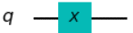

让我们看看上面回路的输出。**注意**：在这里我们使用plot_bloch_multiector()函数，它接受一个量子比特的态向量，而非Bloch向量。

> \# Let\'s see the result
>
> backend = Aer.get_backend(\'statevector_simulator\')
>
> out = execute(qc,backend).result().get_statevector()
>
> plot_bloch_multivector(out)
>
> 输出：

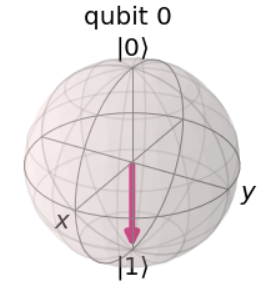

可以从上面输出的图像看出该量子比特的预期为态\|1⟩。我们可以认为这是在布洛赫球体中绕x轴旋转π弧度。X-gate也经常被称为"非门（NOT-gate）"，用于指称经典计算中的类似情况。

#### 1.2 泡利 Y-门与Z-门

与泡利 X-门相类似，在量子回路中泡利Y和Z矩阵也扮演了Y-门与Z-门的角色：

$$Y = \left\lbrack \begin{matrix}
0 \\
i \\
\end{matrix}\ \begin{matrix}
 - i \\
0 \\
\end{matrix} \right\rbrack\ \ \ \ Z = \left\lbrack \begin{matrix}
1 \\
0 \\
\end{matrix}\ \begin{matrix}
0 \\
 - 1 \\
\end{matrix} \right\rbrack$$

$$Y = - i\left| 0 \right\rangle\left\langle 1\left| + i \right|1 \right\rangle\left\langle 0 \right|$$

$$Z = |0\rangle\langle 0| - |1\rangle\langle 1|$$

不出意料的是Y-和Z-门分别在布洛赫球中依据y和z轴旋转π弧度。

下面的代码是一个在布洛赫球中显示一个量子比特状态的小部件，按下其中一个按钮将在量子位上执行量子门的操作：

> \# Run the code in this cell to see the widget
>
> from qiskit_textbook.widgets import gate_demo
>
> gate_demo(gates=\'pauli\')
>
> 输出：


在Qiskit中，我们可以使用以下代码将Y-和Z-门应用在量子回路中：

> qc.y(0) \# Do Y-gate on qubit 0
>
> qc.z(0) \# Do Z-gate on qubit 0
>
> qc.draw(\'mpl\')
>
> 输出：

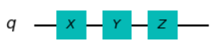

**提示：矩阵的本征向量**

我们已经看到用一个向量乘以一个矩阵会得到一个向量：

$$M\left| \upsilon \right\rangle = \left| \upsilon^{'} \right\rangle \longleftarrow \mathbf{新的向量}$$

如果选择正确的向量和矩阵，可以找到一种情况，在这种情况下，矩阵乘法和标量乘法是相等的：

$$M|v\rangle\  = \ \lambda|v\rangle$$

（上式中$M$是一个矩阵，$\lambda$是一标量）。对于矩阵$M$，任一符合上式的向量被成为矩阵$M$的本征向量。例如，Z-矩阵的本征向量是$|0\rangle$和$|1\rangle$：

$${Z\left| 0 \right\rangle = \left| 0 \right\rangle
}{Z\left| 1 \right\rangle = - |1\rangle}$$

因此我们用向量来描述量子比特的状态，在这种情况下我们通常称这些向量为本征态（*eigenstate*）。本征向量在量子计算中非常重要，所您需要对其有坚实的掌握。

### 题外话：X、Y和Z-基

您可能已经注意到，当Z-门处于这两种状态中的任何一种时，似乎对我们的量子比特没有影响。这是因为态\|0⟩和\|1⟩是Z-门的两个本征态。事实上，计算基（*computational
basis*，\|0⟩和\|1⟩形式的基矢）通常被称为Z-基（Z-basis），但不是可使用的唯一基，一个流行的基是X-基（X-basis），由泡利X-门的本征态组成。我们称向量\|+⟩和\|−⟩：

$$\left| + \right\rangle = \frac{1}{\sqrt{2} }(\left| 0 \right\rangle + |1\rangle) = \frac{1}{\sqrt{2} }\begin{bmatrix}
1 \\
1 \\
\end{bmatrix}$$

$$\left| - \right\rangle = \frac{1}{\sqrt{2} }(\left| 0 \right\rangle - |1\rangle) = \frac{1}{\sqrt{2} }\begin{bmatrix}
1 \\
 - 1 \\
\end{bmatrix}$$

另一个不常用的基由泡利Y-门的本征态组成：

$$\left| \circlearrowleft \right\rangle,\left| \circlearrowright \right\rangle$$

我们将其作为一个练习来计算。事实上有无数的基；为了组成其中的任意一个，只需要两个正交的向量。

#### 快速练习

1.  验证$\left| + \right\rangle$和$\left| - \right\rangle$是泡利X-门的本征态。

2.  上述向量的本征值是什么？

3.  为何在布洛赫球看不到这些本征值的出现？

4.  找出泡利Y-门的本征态及其在布洛赫球上的坐标。

除态\|0⟩和\|1⟩之外，只使用Pauli门不能初始化任意状态的量子比特，因此不能实现叠加态。表明我们看不出任何与经典比特不同的行为。为了创造更多有趣的状态，我们需要更多的门！

### 阿达马门（Hadamard Gate）

阿达马门（H-gate）是一个基本量子门，其可以让我们远离布洛赫球的两极并创建出介于\|0⟩和\|1⟩之间的叠加态。该量子门的矩阵形如：

$$H = \frac{1}{\sqrt{2} }\left\lbrack \begin{matrix}
1 \\
1 \\
\end{matrix}\ \begin{matrix}
1 \\
 - 1 \\
\end{matrix} \right\rbrack$$

执行该矩阵转换的结果如下：

$$H\left| 0 \right\rangle = \left| + \right\rangle$$

$$H\left| 1 \right\rangle = \left| - \right\rangle$$

上述转换可以被认为是围绕Bloch向量\[1,0,1\]（x和z轴之间的线）的旋转，或者是转换X-和Z-基之间量子比特的状态。

您可以使用下面的小工具来试验：

> \# Run the code in this cell to see the widget
>
> from qiskit_textbook.widgets import gate_demo
>
> gate_demo(gates=\'pauli+h\')
>
> 输出：


#### 快速练习

1.  写出H-gate与向量\|0⟩、\|1⟩、\|+⟩和\|−⟩的外积。

2.  证明对任意量子比特的状态应用门序列HZH与应用泡利X-门是等价的。

3.  找出X-、Z-和H-门的组合，使其等价于Y-门（忽略全局相位）。

4.  ### 题外话：使用不同的基来测量

我们已经看到Z轴本质上并不特殊，还有无穷多的其他基。与测量类似，我们不必总是在计算基上测量（Z-基），可以在任何基上测量量子比特。

尝试使用X-基测量，我们可以计算中测量\|+⟩或\|−⟩的概率：

$$p(| + \rangle) = \left| \left\langle + \middle| q \right\rangle \right|^{2},p(| - \rangle) = \left| \left\langle - \middle| q \right\rangle \right|^{2}$$

在测量之后，可以保证在这两种状态之一有一个量子比特。由于Qiskit只允许在Z-基上进行测量，我们必须使用H-gate来创建我们自己的基：

> from qiskit.extensions import Initialize \# Import the Inititialize
> function
>
> \# Create the X-measurement function:
>
> def x_measurement(qc,qubit,cbit):
>
> \"\"\"Measure \'qubit\' in the X-basis, and store the result in
> \'cbit\'\"\"\"
>
> qc.h(qubit)
>
> qc.measure(qubit, cbit)
>
> qc.h(qubit)
>
> return qc
>
> \# Initialise our qubit and measure it
>
> qc = QuantumCircuit(1,1)
>
> initial_state = \[0,1\]
>
> initializer = Initialize(initial_state)
>
> initializer.label = \"init\"
>
> qc.append(initializer, \[0\])
>
> x_measurement(qc, 0, 0)
>
> qc.draw()
>
> 输出：

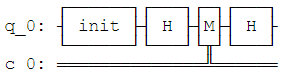

在之前的快速练习中，您可以通过将Z门夹在两个H-门之间来创建一个X门：

$$X = HZH$$

从Z-基开始，H门将量子比特转换到X-基，Z门在X-基上进行一个非门（NOT）操作，最后的H门将量子比特返回到Z-基。


我们可以通过矩阵相乘验证HZH的行为就是X门：

$$\text{HZH} = \frac{1}{\sqrt{2} }\left\lbrack \begin{matrix}
1 \\
1 \\
\end{matrix}\ \begin{matrix}
1 \\
 - 1 \\
\end{matrix} \right\rbrack\left\lbrack \begin{matrix}
1 \\
0 \\
\end{matrix}\ \begin{matrix}
0 \\
 - 1 \\
\end{matrix} \right\rbrack\frac{1}{\sqrt{2} }\left\lbrack \begin{matrix}
1 \\
1 \\
\end{matrix}\ \begin{matrix}
1 \\
 - 1 \\
\end{matrix} \right\rbrack = \left\lbrack \begin{matrix}
0 \\
1 \\
\end{matrix}\ \begin{matrix}
1 \\
0 \\
\end{matrix} \right\rbrack = X$$

按照相同的逻辑，这里通过将Z-测量（Z-measurement）夹在两个H门之间创建一个X-测量（X-measurement）。

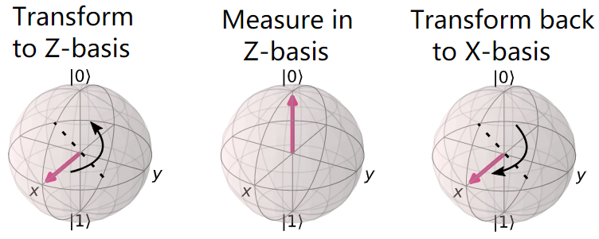

现在看看上面逻辑的在Qiskit中的输出：

> backend = Aer.get_backend(\'statevector_simulator\') \# Tell Qiskit
> how to simulate our circuit
>
> out_state = execute(qc,backend).result().get_statevector() \# Do the
> simulation, returning the state vector
>
> plot_bloch_multivector(out_state) \# Display the output state vector
>
> 输出：


我们在态\|1⟩中初始化量子比特，可以看到测量会坍塌量子比特的状态为\|+⟩或\|−⟩。如果你再次运行的上面的两端代码，则会看到不同的结果，但量子比特的最终状态总是\|+⟩或\|−⟩。

#### 快速练习

1.  如果我们在态\|+⟩中初始化量子比特，测得其在态\|−⟩中的概率是多少?

2.  使用Qiskit显示测量量子比特\|0⟩在态\|+⟩和\|−⟩中的概率（提示：您可能会用到.get_counts()和plot_histogram()）。

3.  尝试创建一个用Y-基测量的函数。

用不同的基测量可以让我们看到海森堡著名的测不准原理是如何起作用的。确定以Z-基测量某个状态，就消除了以X-基测量某个特定状态的所有确定性，反之亦然。一个常见的误解是不确定性是由于设备的限制，但在这里可以看到，不确定性实际上是量子比特本质的一部分。

例如，如果我们把量子比特放入态\|0⟩中，以Z-基测量肯定会得到\|0⟩，但以X-基测量则会得到完全随机的结果！类似地，如果把量子比特放入态\|−⟩，以X-基测量肯定会得到\|−⟩，但现在以Z-基的任意测量将会完全随机的结果。

**更一般地：无论我们的量子系统处于什么状态，总有一种测量会有一个确定的结果。**

H门的引入是的我们能够探索一些有趣的现象，但在量子操作方面仍然非常有限。现在介绍一种新型的量子门：

### 5. ${R}_{\phi}$门（${R}_{\phi}$-gate）

由于${R}_{\phi}$是参数化的（parametrised），因此其需要一个数字（ $\phi$ ）来告诉它做什么。${R}_{\phi}$-gate执行绕Z轴旋转$\phi$角度，因此也被称为Rz-gate，其矩阵形式如下：

$$R_{\phi} = \left\lbrack \begin{matrix}
1 \\
0 \\
\end{matrix}\ \begin{matrix}
0 \\
e^{i\phi} \\
\end{matrix} \right\rbrack$$

其中$\phi$是一个实数。

您也可以使用qiskit_textbook中的小部件尝试R~ϕ~-gate，可以通过里面的滑块制定$\phi$：

> \# Run the code in this cell to see the widget
>
> from qiskit_textbook.widgets import gate_demo
>
> gate_demo(gates=\'pauli+h+rz\')
>
> 输出：

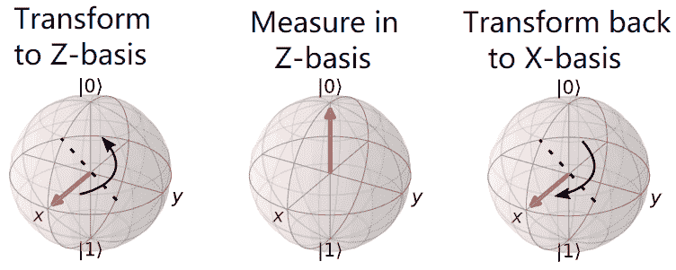

在Qiskit中，我可以通过rz(phi, qubit)来指定一个R~ϕ~-gate：

您可以看到当𝜙=𝜋时，Z门是R~ϕ~-gate的一种特殊情况。实际上有三个更常见的参考量子门会在本章中提及，它们都是R~ϕ~-gate的特殊情况：

> qc = QuantumCircuit(1)
>
> qc.rz(pi/4, 0)
>
> qc.draw(\'mpl\')
>
> 输出：

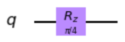

### 6. I、S和T-门（I、S、T-gates）

#### 6.1 I-gate

第一个是"I-gate"(又名"Id-gate"或"Identity
gate")。这是一个不进行任何操作的量子门，其矩阵形式为单位矩阵：

$$I = \left\lbrack \begin{matrix}
1 \\
0 \\
\end{matrix}\ \begin{matrix}
0 \\
1 \\
\end{matrix} \right\rbrack$$

将该单位量子门应用于量子回路中不会改变量子比特的状态，所以将其认作一个量子门值得探寻。有两个原因导致如此：第一I-gate被经常用于计算中，比如证明泡利X门是其自身的逆。

$$I = XX$$

第二考虑实际硬件来指定"do-nothing"或"none"操作通常很有用。

##### 快速练习

1.  I-gate的本征态是什么？

#### 6.2 S-gate

接下来将要提及的量子门是S-gate（有时被称为$\sqrt{Z}$-gate），是𝜙=𝜋/2时的R~ϕ~-gate。该量子门绕布洛赫球旋转四分之一圈。值得注意的是与本章到目前为止介绍的所有门不同，S门不是其自身的逆！在此我们先给出结果，您会经常看到S^†^-gate，也称为"S-dagger"、"Sdg"或${\sqrt{Z} }^{\dagger}$-gate。S^†^-gate是当𝜙=−𝜋/2时的R~ϕ~-gate。

$$S = \left\lbrack \begin{matrix}
1 \\
0 \\
\end{matrix}\ \begin{matrix}
0 \\
e^{\frac{\text{iπ} }{2} } \\
\end{matrix} \right\rbrack\ \ ,S^{\dagger} = \left\lbrack \begin{matrix}
1 \\
0 \\
\end{matrix}\ \begin{matrix}
0 \\
e^{- \frac{\text{iπ} }{2} } \\
\end{matrix} \right\rbrack$$

$\sqrt{Z}$-gate的名字是由于两次成功应用S-gate的效果与Z-gate一致：

$$\text{SS}\left| q \right\rangle = Z\left| q \right\rangle$$

这一符号在量子计算中很常见。

在Qiskit中添加一个S-gate的代码如下：

> qc = QuantumCircuit(1)
>
> qc.s(0) \# Apply S-gate to qubit 0
>
> qc.sdg(0) \# Apply Sdg-gate to qubit 0
>
> qc.draw(\'mpl\')
>
> 输出：

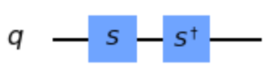

#### 6.3 T-gate

T-gate是量子计算中最长使用的一个量子门，其为在𝜙=𝜋/4时的R~ϕ~-gate。

$$T = \left\lbrack \begin{matrix}
1 \\
0 \\
\end{matrix}\ \begin{matrix}
0 \\
e^{\frac{\text{iπ} }{4} } \\
\end{matrix} \right\rbrack\ \ ,T^{\dagger} = \left\lbrack \begin{matrix}
1 \\
0 \\
\end{matrix}\ \begin{matrix}
0 \\
e^{- \frac{\text{iπ} }{4} } \\
\end{matrix} \right\rbrack$$

> qc = QuantumCircuit(1)
>
> qc.t(0) \# Apply T-gate to qubit 0
>
> qc.tdg(0) \# Apply Tdg-gate to qubit 0
>
> qc.draw(\'mpl\')
>
> 输出：


与S-gate一样，T-gate有时被称为$\sqrt[4]{Z}$-gate。在Qiskit中，您可以使用qiskit_textbook中的小部件把玩本章中介绍的所有量子门：

> \# Run the code in this cell to see the widget
>
> from qiskit_textbook.widgets import gate_demo
>
> gate_demo()
>
> 输出：

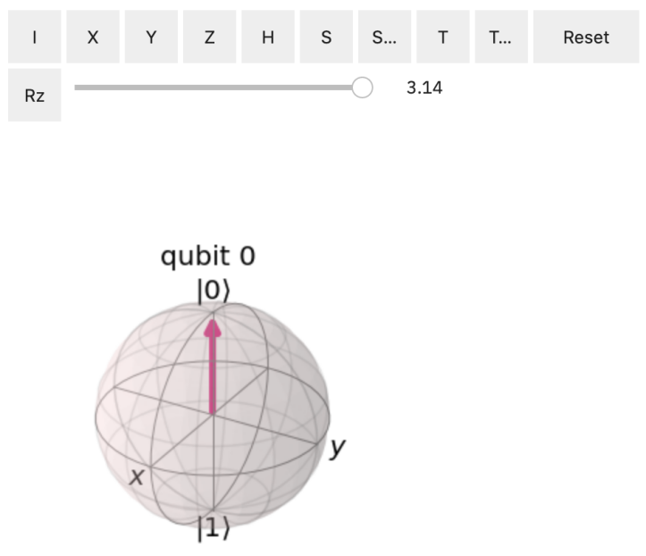

### 7. 通用U-gate

正如我们先前所讲，I、Z、S和T-gate都是R~ϕ~-gate的特俗情况。同样的道理，U~3~-gate是所有单量子比特量子门中最常用的一种，也是一个参数化的量子门：

$$U_{3}\left( \theta,\phi,\lambda \right) = \left\lbrack \begin{matrix}
\cos\left( \frac{\theta}{2} \right) \\
e^{\text{iϕ} }\text{si}n\left( \frac{\theta}{2} \right) \\
\end{matrix}\text{\ \ }\begin{matrix}
{- e}^{\text{iϕ} }\sin\left( \frac{\theta}{2} \right) \\
e^{i\lambda + i\phi}\text{co}s\left( \frac{\theta}{2} \right) \\
\end{matrix} \right\rbrack$$

本章中介绍的每一个量子门都可以被指定为一个$U_{3}\left( \theta,\phi,\lambda \right)$，但这一情况在一个回路的图解中不常见，其可能的原因是相对于比较难以阅读。

Qiskit提供了U~1~-和U~2~-gate，用于分别指代𝜃 = 𝜋/2和𝜃 = 𝜙
=0时U~3~-gate的特殊情况。您将会看到U~1~-gate等同于R~ϕ~-gate。

$$U_{3}\left( \pi/2,\phi,\lambda \right) = U_{2} = \frac{1}{\sqrt{2} }\left\lbrack \begin{matrix}
1 \\
e^{\text{iϕ} } \\
\end{matrix}\text{\ \ }\begin{matrix}
{- e}^{\text{iλ} } \\
e^{i\lambda + i\phi} \\
\end{matrix} \right\rbrack$$

$$U_{3}\left( 0,0,\lambda \right) = U_{1} = \left\lbrack \begin{matrix}
1 \\
0 \\
\end{matrix}\text{\ \ }\begin{matrix}
0 \\
e^{\text{iλ} } \\
\end{matrix} \right\rbrack$$

在真正的IBM量子硬件上运行之前，所有单量子比特操作都被编译为𝑈~1~、𝑈~2~和𝑈~3~，因此有时被称为物理门（*physical
gate*）。

由此可以明显看出，可能存在无穷多的门，其中也包括Rx和Ry-gate，尽管这里没有提到。还必须注意的是Z-基没有什么特别之处，只是它被选为标准计算基。这就是为什么我们给予S-和T-gate名字，却没有给其X和Y等价物取名字的原因。（比如：$\sqrt{X}$和$\sqrt[4]{Y}$）