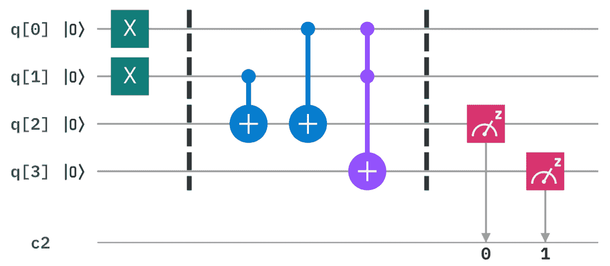
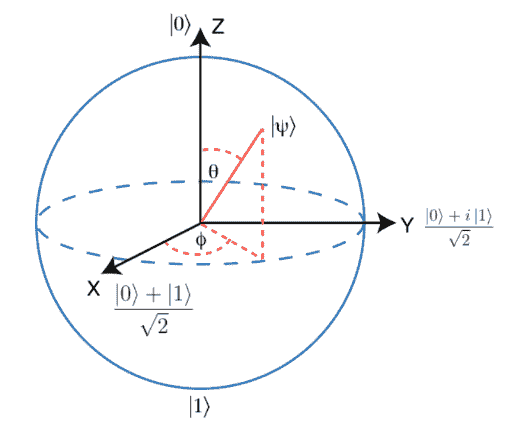

1. 量子态与量子比特
===================

1.1 简介
--------

如果量子力学听起来很有挑战性，那么您并不孤军奋战。我们所有的直觉都是建立在日常经验的基础上，因此比起原子及电子的行为更容易理解球和香蕉的行为。虽然量子对象一开始看起来是随机和混乱，但它们只是遵循一套不同的规则。一旦我们知道了这些规则，就可以利用它们来创造新的强大技术。量子计算将是这方面最具革命性的例子。

为了让您开始量子计算之旅，先测试一下已有的知识。下列哪一项是对 bit（比特、位）的正确描述?

-   木匠用的刀。

-   最小的信息单位 0 或 1。

-   放进马嘴里的东西。

事实上上面讲的都对！但如果您选择了第二个，表明您已经在沿着正确的方向思考了。在不久之前，把信息存储和处理为一系列的 0 和 1 对于一个当时的人来说是一个巨大的概念障碍，但今天大多数人甚至不加思考就知道了这一点。以此为出发点，我们可以开始想象符合量子力学规则的比特。这些量子比特（***qubit***），可以让我们以新的、不同的方式处理信息。

我们将开始深入研究量子比特的世界，为此需要某种方法来跟踪使用量子门时会发生什么。最有效的方法是使用向量和矩阵的数学语言。

对于已经熟悉向量和矩阵的读者来说，本章将会产生预期结果。那些不熟悉的人可能也不会有什么问题，可以偶尔参考一下前一章中量子计算的线性代数介绍可能会很有用。

因为我们将使用 Qiskit，基于 Python 的量子计算框架，了解 Python 的基础知识也会很有用。那些需要入门的人可以查阅 Python 和 Jupyter
Notebook 的介绍。

1.2 计算的基元
--------------

现今，任何人都可以在自己舒适的家中为量子计算机编程。

但是创造了什么呢？量子程序到底是什么？事实上，什么是量子计算机？

这些问题可以通过与标准数字计算机进行比较来回答。但非常不幸的是大多数人也不知道数字计算机的工作原理。在本节中我们将了解这些设备背后的基本原理。为了帮助我们以后过渡到量子计算，我们将使用与量子计算相同的工具。

如果想使用本页中的其他代码，需要运行下面的 Python 代码：

### 1. 把信息分解成比特

我们需要知道的第一件事是比特（bit）的概念。比特被设计成世界上最简单的字母表。只有两个字符：0 和 1，我们可以用来表示任何信息。

数字就是一个例子。您可能已经习惯了通过一个由 10 个数字组成的字串来表示数字 0、1、2、3、4、5、6、7、8 和 9。在这串数字中，每个数字表示该数字包含十的一定次方的次数。例如，当我们写 9213 时：

$$9000 + 200 + 10 + 3$$

或者，用一种强调十的幂的方式来表达：

$$9\mathbf{\times}10^{3} + 2\mathbf{\times}10^{2} + 10\mathbf{\times}10^{1} + 3\mathbf{\times}10^{0}$$

虽然我们通常使用基于数字 10 的系统，但我们也可以很容易地使用基于任何其他数字的系统。例如，二进制数字系统是基于数字 2，表明使用两个字符 0 和 1 将数字表示为 2 的幂的倍数。例如，把 9213 变成了 10001111111101，因为：

$$9213\mathbf{=}\left( 1\mathbf{\times}2^{13} \right)\mathbf{+}\left( 0\mathbf{\times}2^{12} \right)\mathbf{+}\left( 0\mathbf{\times}2^{11} \right)\mathbf{+}\left( 0\mathbf{\times}2^{10} \right)\mathbf{+}\left( 1\mathbf{\times}2^{9} \right)\mathbf{+}\left( 1\mathbf{\times}2^{8} \right)\mathbf{+}\left( 1\mathbf{\times}2^{7} \right)\mathbf{+}\left( 1\mathbf{\times}2^{6} \right)\mathbf{+}\left( 1\mathbf{\times}2^{5} \right)\mathbf{+}\left( 1\mathbf{\times}2^{4} \right)\mathbf{+}\left( 1\mathbf{\times}2^{3} \right)\mathbf{+}\left( 1\mathbf{\times}2^{2} \right)\mathbf{+}\left( 0\mathbf{\times}2^{1} \right)\mathbf{+}\left( 1\mathbf{\times}2^{0} \right)$$

在上式中我们将数字表示为 2、4、8、16、32 等的倍数，而非 10、100、1000...。

这一系列比特，即所谓的二进制序列，可以用来表示的不仅仅是数字。例如，有一种使用比特表示任何文本的方法。对于要使用的任何字母、数字或标点符号，可以使用表 1 找到最多 8 位的对应字串。虽然这些都是很随意的，但这是一个被广泛接受的标准。事实上，正是应用该表中的定义通过互联网把这篇文章发送给您。

表 1：ASCII、十进制、十六进制、八进制和二进制值之间的转换

  **ASCII**                   **Decimal**   **Hexadecimal**   **Octal**   **Binary**
  --------------------------- ------------- ----------------- ----------- ------------
  null                        0             0                 0           0
  start of header             1             1                 1           1
  start of text               2             2                 2           10
  end of text                 3             3                 3           11
  end of transmission         4             4                 4           100
  enquire                     5             5                 5           101
  acknowledge                 6             6                 6           110
  bell                        7             7                 7           111
  backspace                   8             8                 10          1000
  horizontal tab              9             9                 11          1001
  linefeed                    10            A                 12          1010
  vertical tab                11            B                 13          1011
  form feed                   12            C                 14          1100
  carriage return             13            D                 15          1101
  shift out                   14            E                 16          1110
  shift in                    15            F                 17          1111
  data link escape            16            10                20          10000
  device control 1/Xon        17            11                21          10001
  device control 2            18            12                22          10010
  device control 3/Xoff       19            13                23          10011
  device control 4            20            14                24          10100
  negative acknowledge        21            15                25          10101
  synchronous idle            22            16                26          10110
  end of transmission block   23            17                27          10111
  cancel                      24            18                30          11000
  end of medium               25            19                31          11001
  end of file/ substitute     26            1A                32          11010
  escape                      27            1B                33          11011
  file separator              28            1C                34          11100
  group separator             29            1D                35          11101
  record separator            30            1E                36          11110
  unit separator              31            1F                37          11111
  space                       32            20                40          100000
  !                           33            21                41          100001
  \"                          34            22                42          100010
  \#                          35            23                43          100011
  \$                          36            24                44          100100
  \%                          37            25                45          100101
  &                           38            26                46          100110
  \'                          39            27                47          100111
  (                           40            28                50          101000
  )                           41            29                51          101001
  \*                          42            2A                52          101010
  \+                          43            2B                53          101011
  ,                           44            2C                54          101100
  \-                          45            2D                55          101101
  .                           46            2E                56          101110
  /                           47            2F                57          101111
  0                           48            30                60          110000
  1                           49            31                61          110001
  2                           50            32                62          110010
  3                           51            33                63          110011
  4                           52            34                64          110100
  5                           53            35                65          110101
  6                           54            36                66          110110
  7                           55            37                67          110111
  8                           56            38                70          111000
  9                           57            39                71          111001
  :                           58            3A                72          111010
  ;                           59            3B                73          111011
  \<                          60            3C                74          111100
  =                           61            3D                75          111101
  \>                          62            3E                76          111110
  ?                           63            3F                77          111111
  @                           64            40                100         1000000
  A                           65            41                101         1000001
  B                           66            42                102         1000010
  C                           67            43                103         1000011
  D                           68            44                104         1000100
  E                           69            45                105         1000101
  F                           70            46                106         1000110
  G                           71            47                107         1000111
  H                           72            48                110         1001000
  I                           73            49                111         1001001
  J                           74            4A                112         1001010
  K                           75            4B                113         1001011
  L                           76            4C                114         1001100
  M                           77            4D                115         1001101
  N                           78            4E                116         1001110
  O                           79            4F                117         1001111
  P                           80            50                120         1010000
  Q                           81            51                121         1010001
  R                           82            52                122         1010010
  S                           83            53                123         1010011
  T                           84            54                124         1010100
  U                           85            55                125         1010101
  V                           86            56                126         1010110
  W                           87            57                127         1010111
  X                           88            58                130         1011000
  Y                           89            59                131         1011001
  Z                           90            5A                132         1011010
  \[                          91            5B                133         1011011
  \\                          92            5C                134         1011100
  \]                          93            5D                135         1011101
  \^                          94            5E                136         1011110
  \_                          95            5F                137         1011111
  \`                          96            60                140         1100000
  a                           97            61                141         1100001
  b                           98            62                142         1100010
  c                           99            63                143         1100011
  d                           100           64                144         1100100
  e                           101           65                145         1100101
  f                           102           66                146         1100110
  g                           103           67                147         1100111
  h                           104           68                150         1101000
  i                           105           69                151         1101001
  j                           106           6A                152         1101010
  k                           107           6B                153         1101011
  l                           108           6C                154         1101100
  m                           109           6D                155         1101101
  n                           110           6E                156         1101110
  o                           111           6F                157         1101111
  p                           112           70                160         1110000
  q                           113           71                161         1110001
  r                           114           72                162         1110010
  s                           115           73                163         1110011
  t                           116           74                164         1110100
  u                           117           75                165         1110101
  v                           118           76                166         1110110
  w                           119           77                167         1110111
  x                           120           78                170         1111000
  y                           121           79                171         1111001
  z                           122           7A                172         1111010
  {                           123           7B                173         1111011
  \|                          124           7C                174         1111100
  }                           125           7D                175         1111101
  \~                          126           7E                176         1111110
  DEL                         127           7F                177         1111111
                              128           80                200         10000000
                              129           81                201         10000001
                              130           82                202         10000010
                              131           83                203         10000011
                              132           84                204         10000100
                              133           85                205         10000101
                              134           86                206         10000110
                              135           87                207         10000111
                              136           88                210         10001000
                              137           89                211         10001001
                              138           8A                212         10001010
                              139           8B                213         10001011
                              140           8C                214         10001100
                              141           8D                215         10001101
                              142           8E                216         10001110
                              143           8F                217         10001111
                              144           90                220         10010000
                              145           91                221         10010001
                              146           92                222         10010010
                              147           93                223         10010011
                              148           
