# 2. 多量子比特和纠缠（Entanglement）

2.1 介绍
--------

若仅仅有量子比特不足以形成量子回路，我们还需要对其进行操纵。所有可能的方法都可以被编译成一组基本的操作，称为量子门。

通常，可以直接在硬件中实现的量子门只作用于一个或两个量子比特。在我们的回路中，可能想要使用作用于大量量子比特的复杂量子们。幸运的是，这不是一个问题。有了硬件提供的1和2个量子门，就有可能建造任何其他的量子门。

在本章中，我们将首先介绍最基本的门，以及用来描述和分析的数学。然后将展示如何证明这些门可以用来创建任何可能的量子算法。

然后，本章以观察量子门的小规模应用作为结束。例如，我们看到如何从单量子比特操作和双量子比特操作构建类似于Toffoli的三量子比特门。

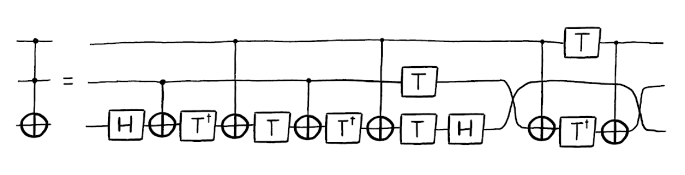

2.2 多量子比特和纠缠态（Entangled State）
-----------------------------------------

单量子比特是很有趣，但单个并不能提供计算优势。现在我们来看看如何表示多量子比特，以及这些量子比特如何相互作用。我们已经看到了如何用二维向量表示一个量子比特的状态，现在将看到如何表示多量子比特的状态。

### 内容

1\. 呈现多量子比特的状态

1.1 练习

2\. 用多量子比特态向量呈现单量子比特

2.1 练习

3\. 多量子比特门

3.1 受控非门

3.2 纠缠态

3.3 练习

### 1. 呈现多量子比特的状态

我们看到单个比特有两种可能的状态，而一个量子比特有两个复数幅值。同样，两个比特有四种可能的状态：

00 01 10 11

要描述两个量子比特的状态需要四个复数幅值。我们将这些幅值存储在一个四维的矢量中：

$$\left| a \right\rangle = a_{00}\left| 00 \right\rangle + a_{01}\left| 01 \right\rangle + a_{10}\left| 10 \right\rangle + a_{11}\left| 11 \right\rangle = \begin{bmatrix}
a_{00} \\
a_{01} \\
a_{10} \\
a_{11} \\
\end{bmatrix}$$

测量规则仍然上一章中所诉的相同：

$$p(|00\rangle) = \left| \left\langle 00 \middle| a \right\rangle \right|^{2} = \left| a00 \right|^{2}$$

同样的含义也适用，例如标准化条件：

$$\left| a_{00} \right|^{2} + \left| a_{01} \right|^{2} + \left| a_{10} \right|^{2} + \left| a_{11} \right|^{2} = 1$$

如果有两个分开的量子比特，我们可以用张量积（**tensor
product**）来描述它们的总体状态：

$$\left| a \right\rangle = \begin{bmatrix}
a_{0} \\
a_{1} \\
\end{bmatrix},\ \left| b \right\rangle = \begin{bmatrix}
b_{0} \\
b_{1} \\
\end{bmatrix}$$

$$\left| \text{ab} \right\rangle = \left| a \right\rangle \otimes \left| b \right\rangle = \begin{bmatrix}
a_{0} \times \begin{bmatrix}
b_{0} \\
b_{1} \\
\end{bmatrix} \\
a_{1} \times \begin{bmatrix}
b_{0} \\
b_{1} \\
\end{bmatrix} \\
\end{bmatrix} = \begin{bmatrix}
a_{0}b_{0} \\
a_{0}b_{1} \\
a_{1}b_{0} \\
a_{1}b_{1} \\
\end{bmatrix}$$

遵循同样的规则，我们可以用张量积来描述任意数量的量子比特的总体状态。下面是一个包含三个量子比特的例子：

$$\left| \text{abc} \right\rangle = \begin{bmatrix}
a_{0}b_{0}c_{0} \\
a_{0}b_{0}c_{1} \\
\ a_{0}b_{1}c_{0} \\
a_{0}b_{1}c_{1} \\
\ a_{1}b_{0}c_{0} \\
a_{1}b_{0}c_{1} \\
a_{1}b_{1}c_{0} \\
a_{1}b_{1}c_{1} \\
\end{bmatrix}$$

如果我们有n个量子比特，就需要追踪$2^{n}$个复数幅值。正如我们所看到的，这些向量依据量子比特的数量指数级别的增长。这就为什么含有大数量的量子比特的量子计算机很难模拟的原因。一台较新的笔记本电脑可以模拟约20个量子比特，但如果有100个量子比特即使是超级计算机也很难模拟。

现在让我们看一个量子回路的示例：

from qiskit import \*

from math import pi

import numpy as np

from qiskit.visualization import plot_bloch_multivector, plot_histogram

> qc = QuantumCircuit(3)
>
> \# Apply H-gate to each qubit:
>
> for qubit in range(3):
>
> qc.h(qubit)
>
> \# See the circuit:
>
> qc.draw()
>
> 输出：

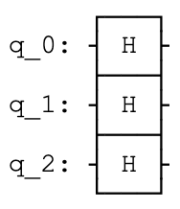

每一个量子比特都处于\|+⟩，所以我们应该看到向量：

$$\left| + + + \right\rangle = \frac{1}{\sqrt{8} }\begin{bmatrix}
1 \\
1 \\
1 \\
1 \\
1 \\
1 \\
1 \\
1 \\
\end{bmatrix}$$

> \# Let\'s see the result
>
> backend = Aer.get_backend(\'statevector_simulator\')
>
> final_state = execute(qc,backend).result().get_statevector()
>
> \# In Jupyter Notebooks we can display this nicely using Latex.
>
> \# If not using Jupyter Notebooks you may need to remove the
>
> \# vector2latex function and use print(final_state) instead.
>
> from qiskit_textbook.tools import array_to_latex
>
> array_to_latex(final_state, pretext=\"\\\\text{Statevector} = \")
>
> 输出：

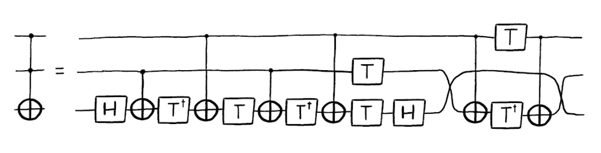

以上代码的输出正是我们所期望的结果。

1.1 快速练习

1\. 写出以下量子比特的张量积：

> a\) $|0\rangle|1\rangle$
>
> b\) $|0\rangle| + \rangle$
>
> c\) $| + \rangle|1\rangle$
>
> d\) $| - \rangle| + \rangle$

2\.
将态向量$\left| \psi \right\rangle = \frac{1}{\sqrt{2} }\left| 00 \right\rangle + \frac{i}{\sqrt{2} }\left| 01 \right\rangle$写成两个单独的量子比特。

### 2. 用多量子比特态向量呈现单量子比特

我们已经看到用矩阵表示的X-gate：

$$X = \left\lbrack \begin{matrix}
0 \\
1 \\
\end{matrix}\ \begin{matrix}
1 \\
0 \\
\end{matrix} \right\rbrack$$

当其作用于态$\left| 0 \right\rangle$时：

$$X\left| 0 \right\rangle = \left\lbrack \begin{matrix}
0 \\
1 \\
\end{matrix}\ \begin{matrix}
1 \\
0 \\
\end{matrix} \right\rbrack\begin{bmatrix}
1 \\
0 \\
\end{bmatrix} = \begin{bmatrix}
0 \\
1 \\
\end{bmatrix}$$

但X-gate在多量子比特向量中如何作用于一个量子比特尚不清楚。幸运的是，规则相当简单；和我们用张量积计算多量子比特态向量一样，使用张量积计算矩阵的过程正是作用于这些态向量的过程。例如，在下面的回路中：

> qc = QuantumCircuit(2)
>
> qc.h(0)
>
> qc.x(1)
>
> qc.draw()
>
> 输出：

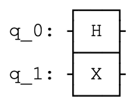

我们可以用张量积模拟这一操作（H&X）：

$$X\left| q_{1} \right\rangle \otimes H\left| q_{0} \right\rangle = \left( X \otimes H \right)\left| q_{1}q_{0} \right\rangle$$

这一操作的过程为：

$$X \otimes H = \left\lbrack \begin{matrix}
0 \\
1 \\
\end{matrix}\ \begin{matrix}
1 \\
0 \\
\end{matrix} \right\rbrack \otimes \frac{1}{\sqrt{2} }\left\lbrack \begin{matrix}
1 \\
1 \\
\end{matrix}\ \begin{matrix}
1 \\
 - 1 \\
\end{matrix} \right\rbrack = \frac{1}{\sqrt{2} }\left\lbrack \begin{matrix}
0 \times \left\lbrack \begin{matrix}
1 \\
1 \\
\end{matrix}\ \begin{matrix}
1 \\
 - 1 \\
\end{matrix} \right\rbrack \\
1 \times \left\lbrack \begin{matrix}
1 \\
1 \\
\end{matrix}\ \begin{matrix}
1 \\
 - 1 \\
\end{matrix} \right\rbrack \\
\end{matrix}\ \begin{matrix}
1 \times \left\lbrack \begin{matrix}
1 \\
1 \\
\end{matrix}\ \begin{matrix}
1 \\
 - 1 \\
\end{matrix} \right\rbrack \\
0 \times \left\lbrack \begin{matrix}
1 \\
1 \\
\end{matrix}\ \begin{matrix}
1 \\
 - 1 \\
\end{matrix} \right\rbrack \\
\end{matrix} \right\rbrack = \frac{1}{\sqrt{2} }\left\lbrack \begin{matrix}
0 \\
0 \\
1 \\
1 \\
\end{matrix}\ \begin{matrix}
0 \\
0 \\
1 \\
 - 1 \\
\end{matrix}\ \begin{matrix}
1 \\
1 \\
0 \\
0 \\
\end{matrix}\ \begin{matrix}
1 \\
 - 1 \\
0 \\
0 \\
\end{matrix} \right\rbrack$$

我们可以将上式应用四维态向量$\left| q_{1}q_{0} \right\rangle$。使其变得非常容易，您将会经常看到下面的清晰符号：

$$X \otimes H = \left\lbrack \begin{matrix}
0 \\
H \\
\end{matrix}\ \begin{matrix}
H \\
0 \\
\end{matrix} \right\rbrack$$

与其手算之一过程，我们可以使用Qiskit中的unitary_simulator来计算。幺正模拟器将回路中所有的量子门相乘，得出一个运行整个量子回路的幺正矩阵：

> backend = Aer.get_backend(\'unitary_simulator\')
>
> unitary = execute(qc,backend).result().get_unitary()
>
> \# In Jupyter Notebooks we can display this nicely using Latex.
>
> \# If not using Jupyter Notebooks you may need to remove the
>
> \# unitary2latex function and use print(unitary) instead.
>
> from qiskit_textbook.tools import array_to_latex
>
> array_to_latex(unitary, pretext=\"\\\\text{Circuit = }\\n\")
>
> 输出：

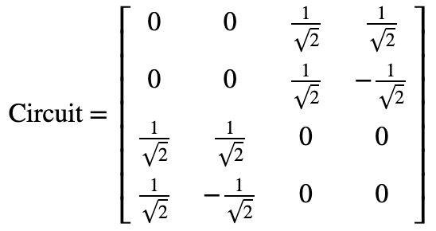

如果我们仅想要每次只在一个量子比特上应用一个量子门（如下所示），使用单位矩阵进行张量积：

$$X \otimes I$$

可以看到，在Qiskit中进行张量积的结果：

$$X \otimes I = \left\lbrack \begin{matrix}
0 \\
I \\
\end{matrix}\ \begin{matrix}
I \\
0 \\
\end{matrix} \right\rbrack = \left\lbrack \begin{matrix}
0 \\
0 \\
1 \\
0 \\
\end{matrix}\ \begin{matrix}
0 \\
0 \\
0 \\
1 \\
\end{matrix}\ \begin{matrix}
1 \\
0 \\
0 \\
0 \\
\end{matrix}\ \begin{matrix}
0 \\
1 \\
0 \\
0 \\
\end{matrix} \right\rbrack$$

#### 2.1 快速练习

1\. 计算由一系列量子门创建的单一量子比特$U = XZH$的幺正变换unitary
(𝑈)。使用Qiskit中的幺正模拟器来验证您的答案。

2\.
尝试改变上述产量子回路中的量子门。计算其张量积，并用幺正模拟器检查答案。

**注：**不同书籍、软件和网站中量子比特的顺序也不同，表明同一量子回路的张量积可能看上去极为不同。当查阅其他资料时，请将这一点铭记在心。

> qc = QuantumCircuit(2)
>
> qc.x(1)
>
> qc.draw()
>
> 输出：

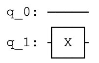

> \# Simulate the unitary
>
> backend = Aer.get_backend(\'unitary_simulator\')
>
> unitary = execute(qc,backend).result().get_unitary()
>
> \# Display the results:
>
> array_to_latex(unitary, pretext=\"\\\\text{Circuit = } \")
>
> 输出：

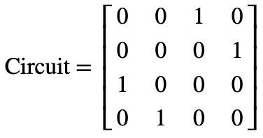

### 3. 多量子比特门

至此我们知道了如何表示多量子比特的状态，为学习量子比特之间如何交互做好了准备。其中一个非常重要的双量子比特门（two-qubit
gate）是受控非门（CNOT-gate）。

#### 3.1 受控非门（CNOT-gate）

您在先前的"计算的基元"中已经遇到过该量子门。如果第一个量子比特（控制）是$|1\rangle$，受控非门是一个在第二个量子比特（目标）上执行X-gate的条件门（conditional
gate）。该量子门绘制在回路中的样子如下，其中q0作为控制，q1作为目标：

> qc = QuantumCircuit(2)
>
> \# Apply CNOT
>
> qc.cx(0,1)
>
> \# See the circuit:
>
> qc.draw()
>
> 输出：

当量子比特不处于$|0\rangle$和$|1\rangle$（类似经典比特的行为）之间的叠加态时，受控非门非常简单且能够被直观的理解。我们可以使用经典真值表来描述：

  **输入(t,c)**   **输出(t,c)**
--------------- ---------------
  00              00
  01              11
  10              10
  11              01

将其转换为四位态向量，其为以下两个矩阵中的一个：

$$ {CNOT = \left\lbrack \begin{matrix}
1 \\
0 \\
0 \\
0 \\
\end{matrix}\ \begin{matrix}
0 \\
0 \\
0 \\
1 \\
\end{matrix}\ \begin{matrix}
0 \\
0 \\
1 \\
0 \\
\end{matrix}\ \begin{matrix}
0 \\
1 \\
0 \\
0 \\
\end{matrix} \right\rbrack,\ 
}{\ \ \ \ \ \ \ \ \ \ \ \ \ \ \ \ \ CNOT = \left\lbrack \begin{matrix}
1 \\
0 \\
0 \\
0 \\
\end{matrix}\ \begin{matrix}
0 \\
1 \\
0 \\
0 \\
\end{matrix}\ \begin{matrix}
0 \\
0 \\
0 \\
1 \\
\end{matrix}\ \begin{matrix}
0 \\
0 \\
1 \\
0 \\
\end{matrix} \right\rbrack}$$

依据哪一量子比特是控制端或目标端。不同书籍、模拟器和论文对量子比特的排序也不一样。在我们的例子中，左侧的矩阵对应于上述所有量子回路中的受控非门。该矩阵交换态向量中\|01⟩和\|11⟩之间的幅值。

$$\left| a \right\rangle = \begin{bmatrix}
a_{00} \\
a_{01} \\
a_{10} \\
a_{11} \\
\end{bmatrix},\ \ CNOT\left| a \right\rangle = \begin{bmatrix}
a_{00} \\
a_{11} \\
a_{10} \\
a_{01} \\
\end{bmatrix}$$

我们已经看到了受控非门如何作用于经典状态的方式，现在看看该量子门如何作用于处于叠加态的量子比特。我们将其作用于态\|+⟩：

> qc = QuantumCircuit(2)
>
> \# Apply H-gate to the first:
>
> qc.h(0)
>
> qc.draw()
>
> 输出：
>
> 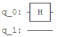
>
> \# Let\'s see the result:
>
> backend = Aer.get_backend(\'statevector_simulator\')
>
> final_state = execute(qc,backend).result().get_statevector()
>
> \# Print the statevector neatly:
>
> array_to_latex(final_state, pretext=\"\\\\text{Statevector = }\")
>
> 输出：

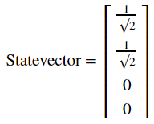

正如所期望的那样，这一操作产生了$\left| 0 \right\rangle \otimes \left| + \right\rangle = \left| 0 + \right\rangle$：

$$\left| 0 + \right\rangle = \frac{1}{\sqrt{2} }\left( \left| 00 \right\rangle + \left| 01 \right\rangle \right)$$

接着看看应用受控非门之后的情况：

> qc = QuantumCircuit(2)
>
> \# Apply H-gate to the first:
>
> qc.h(0)
>
> \# Apply a CNOT:
>
> qc.cx(0,1)
>
> qc.draw()
>
> 输出：

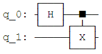

> \# Let\'s see the result:
>
> backend = Aer.get_backend(\'statevector_simulator\')
>
> final_state = execute(qc,backend).result().get_statevector()
>
> \# Print the statevector neatly:
>
> array_to_latex(final_state, pretext=\"\\\\text{Statevector = }\")
>
> 输出：

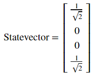

可以看到我们获得了态：

$$\text{CNOT}\left| 0 + \right\rangle = \frac{1}{\sqrt{2} }\left( \left| 00 \right\rangle + \left| 11 \right\rangle \right)$$

这一量子态非常有趣，因为其是纠缠的（***entangled***）。这一发现将我们引向下一节的内容。

#### 3.2 纠缠态（Entangled State）

在前一节中我们创建了态：

$$\frac{1}{\sqrt{2} }\left( \left| 00 \right\rangle + \left| 11 \right\rangle \right)$$

这一量子态被称为贝尔基态（*Bell*
state）。可以看出该量子态有50%的概率测量出态$\left| 00 \right\rangle$，以及50%的机率测量态$\left| 11 \right\rangle$。非常有趣的是：该量子态测量出态$\left| 01 \right\rangle$和$\left| 10 \right\rangle$的机率为0。我们呢可以在Qiskit中使用如下代码来验证：

> results = execute(qc,backend).result().get_counts()
>
> plot_histogram(results)
>
> 输出：

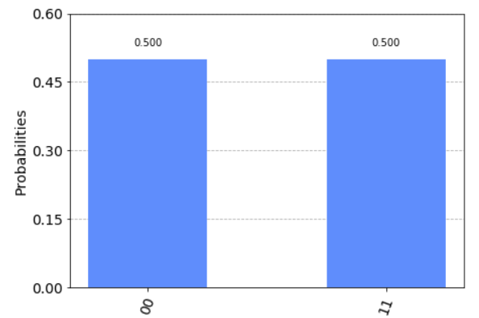

这一复合状态无法写为两个单独量子比特的状态，其蕴含的意义让人着迷。虽然我们的量子比特处于叠加态，测量其中一个会告诉我们另一个的状态并使其叠加态坍缩。例如，如果我们测量坐上面的量子巴比特并获知其状态为$\left| 1 \right\rangle$，所有量子比特的整体状态变化如下：

$$\frac{1}{\sqrt{2} }\left( \left| 00 \right\rangle + \left| 11 \right\rangle \right)\overset{\text{measure} }{\rightarrow}\left| 11 \right\rangle$$

即使将这些量子比特放置在互相相隔光年以外的位置，测量其中一个量子比特就会使叠加态坍缩，并在其他量子比特上即刻产生影响。这就是鬼魅般的超距作用（[spooky
action at a
distance](https://en.wikipedia.org/wiki/Quantum_nonlocality)），该作用使得20世纪的大部分物理学家感到沮丧。

#### 3.3 快速练习

1\.
创建一个可以产生贝尔基态$\frac{1}{\sqrt{2} }\left( \left| 01 \right\rangle + \left| 10 \right\rangle \right)$的量子回路。使用Qiskit中的态向量模拟器验证结果。

2\.
在上面练习中创建的量子回路将态$\left| 00 \right\rangle$转换为$\frac{1}{\sqrt{2} }\left( \left| 01 \right\rangle + \left| 10 \right\rangle \right)$，使用Qiskit中的模拟器计算这一回路的幺正矩阵。验证这一幺正矩阵执行了准确的变换。

### 4. 参考文献

\[1\] Asher Peres, Daniel R. Terno, Quantum Information and Relativity
Theory, 2004, https://arxiv.org/abs/quant-ph/0212023

2.3 相位反冲（Phase Kickback）
------------------------------

### 内容

1\. 探索受控非门

2\. 相位反冲

2.1 解释受控非门回路恒等式

2.2 使用T-gate反冲

### 1. 探索受控非门

在之前的章节中，我们看到受控非门的一些非常基础结果。在本节中我们将会探索更有趣的结果。

我们在上一节中看到可以通过设置受控量子比特为态$| + \rangle$使得两个量子比特纠缠：

$$\text{CNOT}\left| 0 + \right\rangle = \frac{1}{\sqrt{2} }\left( \left| 00 \right\rangle + \left| 11 \right\rangle \right)$$

但是如果放入处于叠加态的第二个两个比特会发生什么情况？

> from qiskit import QuantumCircuit, Aer, execute
>
> from math import pi
>
> import numpy as np
>
> from qiskit.visualization import plot_bloch_multivector,
> plot_histogram
>
> \# In Jupyter Notebooks we can display this nicely using Latex.
>
> \# If not using Jupyter Notebooks you may need to remove the
>
> \# array_to_latex function and use print() instead.
>
> from qiskit_textbook.tools import array_to_latex
>
> qc = QuantumCircuit(2)
>
> qc.h(0)
>
> qc.h(1)
>
> qc.cx(0,1)
>
> qc.draw()
>
> 输出：

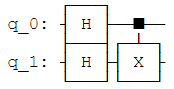

在上面的量子回路中，我们将受控非门作用于态：

$$| + + \rangle = \frac{1}{\sqrt{2} }(|00\rangle + |01\rangle + |10\rangle + |11\rangle)$$

由于受控非门CNOT交换态$\left| 01 \right\rangle$和$\left| 11 \right\rangle$的幅值，所以我们不会看到变化：

> qc = QuantumCircuit(2)
>
> qc.h(0)
>
> qc.h(1)
>
> qc.cx(0,1)
>
> display(qc.draw())
>
> \# Let\'s see the result
>
> statevector_backend = Aer.get_backend(\'statevector_simulator\')
>
> final_state =
> execute(qc,statevector_backend).result().get_statevector()
>
> array_to_latex(final_state, pretext=\"\\\\text{Statevector} = \",
> precision=1)
>
> plot_bloch_multivector(final_state)
>
> 输出：

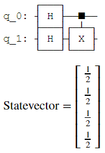

现在设置目标量子比特为态$| - \rangle$，所以其成为一个负相位：

> qc = QuantumCircuit(2)
>
> qc.h(0)
>
> qc.x(1)
>
> qc.h(1)
>
> qc.draw()
>
> 输出：

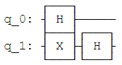

将会生成如下状态：

$$| \mp \rangle = \frac{1}{\sqrt{2} }(|00\rangle + |01\rangle - |10\rangle - |11\rangle)$$

> qc = QuantumCircuit(2)
>
> qc.h(0)
>
> qc.x(1)
>
> qc.h(1)
>
> display(qc.draw())
>
> \# See the result
>
> final_state =
> execute(qc,statevector_backend).result().get_statevector()
>
> array_to_latex(final_state, pretext=\"\\\\text{Statevector} = \",
> precision=1)
>
> plot_bloch_multivector(final_state)
>
> 输出：

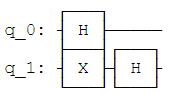

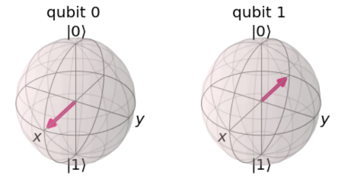

如果受控非门作用于这一状态，将会交换态$\left| 01 \right\rangle$和$\left| 11 \right\rangle$的幅值，结果会是如下的状态：

$$CNOT| \mp \rangle = \frac{1}{\sqrt{2} }(|00\rangle - |01\rangle - |10\rangle + |11\rangle)$$

$$\text{CNOT}\left| \mp \right\rangle = \left| - - \right\rangle$$

这一点非常有趣，因为其在不改变目标量子比特状态的情况下影响了控制量子比特的状态。

> qc.cx(0,1)
>
> display(qc.draw())
>
> final_state =
> execute(qc,statevector_backend).result().get_statevector()
>
> array_to_latex(final_state, pretext=\"\\\\text{Statevector} = \",
> precision=1)
>
> plot_bloch_multivector(final_state)
>
> 输出：

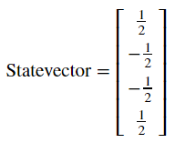

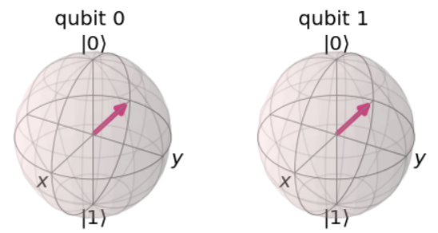

如果您还记得H-gate（阿达马门）将$\left| + \right\rangle \rightarrow \left| 0 \right\rangle$以及$\left| - \right\rangle \rightarrow \left| 1 \right\rangle$，我们可以在多个H-gate中装入一个受控非门，等同于一个相反方向受控非门的行为：

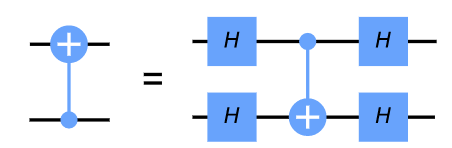

我们可以使用Qiskit中的幺正模拟器来验证这一想法：

> qc = QuantumCircuit(2)
>
> qc.h(0)
>
> qc.h(1)
>
> qc.cx(0,1)
>
> qc.h(0)
>
> qc.h(1)
>
> display(qc.draw())
>
> \# \`display\` is an IPython tool, remove if it cases an error
>
> unitary_backend = Aer.get_backend(\'unitary_simulator\')
>
> unitary = execute(qc,unitary_backend).result().get_unitary()
>
> array_to_latex(unitary, pretext=\"\\\\text{Circuit = }\\n\")
>
> 输出：

> qc = QuantumCircuit(2)
>
> qc.cx(1,0)
>
> display(qc.draw())
>
> unitary_backend = Aer.get_backend(\'unitary_simulator\')
>
> unitary = execute(qc,unitary_backend).result().get_unitary()
>
> array_to_latex(unitary, pretext=\"\\\\text{Circuit = }\\n\")
>
> 输出：

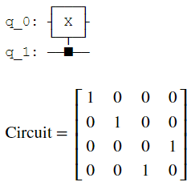

这一等式就是相位反冲（*phase
kickback*）的示例，并将我们引向下一节的内容。

### 2. 相位反冲

2.1 解释受控非门回路恒等式

在上一节中，我们看到如下恒等式：

这一反冲（相位反冲）的示例非常重要，其可用在几乎所有的量子算法中。反冲即由一个量子门加到量子比特上的本征值，经由一个受控操作"回弹（kicked
back）"至一个不同的量子比特。例如，我们看到过在一个$\left| - \right\rangle$态的量子比特执行X-gate会给出该量子比特的相位-1：

$$X\left| - \right\rangle = - \left| - \right\rangle$$

当我们的控制端量子比特处于态$\left| 0 \right\rangle$或$\left| 1 \right\rangle$时，该相位会影响整个状态，然而全局相位没有受到明显的影响：

$${\text{CNOT}\left| - 0 \right\rangle = \left| - \right\rangle \otimes \left| 0 \right\rangle
}{\ \ \ \ \ \ \ \ \ \ \ \ \ \ \ \ \ \ \ \ \ \  = \left| - 0 \right\rangle
}{\text{CNOT}\left| - 1 \right\rangle = X\left| - \right\rangle \otimes \left| 1 \right\rangle
}{\ \ \ \ \ \ \ \ \ \ \ \ \ \ \ \ \ \ \ \ \ \  = - \left| - \right\rangle \otimes \left| 1 \right\rangle
}{= - \left| - 1 \right\rangle}$$

这一有趣的影响当控制端量子比特处于叠加态时才会发生，仅当目标端量子比特处于态$\left| 1 \right\rangle$时这一相位因子才会应用于目标端量子比特，就是在控制端量子比特上添加一个相对相位：

$$CNOT| \mp \rangle = \frac{1}{\sqrt{2} }(CNOT| - 0\rangle + CNOT| - 1\rangle)$$

$$CNOT| \mp \rangle = \frac{1}{\sqrt{2} }(| - 0\rangle + X| - 1\rangle)$$

$$CNOT| \mp \rangle = \frac{1}{\sqrt{2} }(| - 0\rangle - | - 1\rangle)$$

上述也可写成两个单独的量子比特的状态：

$$CNOT| \mp \rangle = | - \rangle \otimes \frac{1}{\sqrt{2} }(|0\rangle - |1\rangle)$$

$$\text{CNOT}\left| \mp \right\rangle = \left| - - \right\rangle$$

装入多个H-gate的受控非门将量子比特从计算基转换为基\|+⟩和\|−⟩，正如我们所看到的一样。这一恒等式在硬件中非常有用，因为某些量子硬件仅允许受控非门作用于两个特定量子比特中的一个方向上。我们可以利用这一恒等式克服这一问题，让受控非门能够在两个方向上发生作用。

2.2 使用T-gate实现反冲

现在我们看一看两一个受控的操作，受控T门：

> qc = QuantumCircuit(2)
>
> qc.cu1(pi/4, 0, 1)
>
> qc.draw()
>
> 输出：

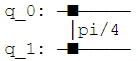

T-gate的矩阵形式如下：

$$T = \left\lbrack \begin{matrix}
1 \\
0 \\
\end{matrix}\ \begin{matrix}
0 \\
e^{\frac{\text{iπ} }{4} } \\
\end{matrix} \right\rbrack$$

受控T门的矩阵形式如下：

$$\text{Controlled} - T = \left\lbrack \begin{matrix}
\begin{matrix}
1 \\
0 \\
\end{matrix} \\
\begin{matrix}
0 \\
0 \\
\end{matrix} \\
\end{matrix}\ \begin{matrix}
\begin{matrix}
0 \\
1 \\
\end{matrix} \\
\begin{matrix}
0 \\
0 \\
\end{matrix} \\
\end{matrix}\ \begin{matrix}
\begin{matrix}
0 \\
0 \\
\end{matrix} \\
\begin{matrix}
1 \\
0 \\
\end{matrix} \\
\end{matrix}\ \begin{matrix}
\begin{matrix}
0 \\
0 \\
\end{matrix} \\
\begin{matrix}
0 \\
e^{\frac{\text{iπ} }{4} } \\
\end{matrix} \\
\end{matrix} \right\rbrack$$

我们可以使用Qiskit中的幺正模拟器来验证：

> qc = QuantumCircuit(2)
>
> qc.cu1(pi/4, 0, 1)
>
> display(qc.draw())
>
> \# See Results:
>
> unitary_backend = Aer.get_backend(\'unitary_simulator\')
>
> unitary = execute(qc,unitary_backend).result().get_unitary()
>
> array_to_latex(unitary, pretext=\"\\\\text{Controlled-T} = \\n\")
>
> 输出：

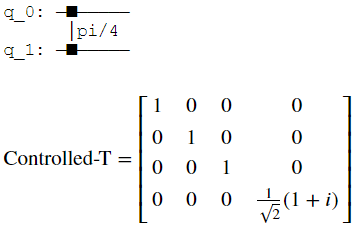

更一般地，我们可以用以下规则找到任一受控U操作的矩阵：

$$U = \left\lbrack \begin{matrix}
u_{00} \\
u_{10} \\
\end{matrix}\ \begin{matrix}
u_{01} \\
u_{11} \\
\end{matrix} \right\rbrack$$

$$\text{Controlled} - U = \left\lbrack \begin{matrix}
I \\
0 \\
\end{matrix}\ \begin{matrix}
0 \\
U \\
\end{matrix} \right\rbrack = \left\lbrack \begin{matrix}
\begin{matrix}
1 \\
0 \\
\end{matrix} \\
\begin{matrix}
0 \\
0 \\
\end{matrix} \\
\end{matrix}\ \begin{matrix}
\begin{matrix}
0 \\
1 \\
\end{matrix} \\
\begin{matrix}
0 \\
0 \\
\end{matrix} \\
\end{matrix}\ \begin{matrix}
\begin{matrix}
0 \\
0 \\
\end{matrix} \\
\begin{matrix}
u_{00} \\
u_{10} \\
\end{matrix} \\
\end{matrix}\ \begin{matrix}
\begin{matrix}
0 \\
0 \\
\end{matrix} \\
\begin{matrix}
u_{01} \\
u_{11} \\
\end{matrix} \\
\end{matrix} \right\rbrack$$

或者使用Qiskit的量子比特排列：

$$\text{Controlled} - U = \left\lbrack \begin{matrix}
\begin{matrix}
1 \\
0 \\
\end{matrix} \\
\begin{matrix}
0 \\
0 \\
\end{matrix} \\
\end{matrix}\ \begin{matrix}
\begin{matrix}
0 \\
u_{00} \\
\end{matrix} \\
\begin{matrix}
0 \\
u_{10} \\
\end{matrix} \\
\end{matrix}\ \begin{matrix}
\begin{matrix}
0 \\
0 \\
\end{matrix} \\
\begin{matrix}
1 \\
0 \\
\end{matrix} \\
\end{matrix}\ \begin{matrix}
\begin{matrix}
0 \\
u_{01} \\
\end{matrix} \\
\begin{matrix}
0 \\
u_{11} \\
\end{matrix} \\
\end{matrix} \right\rbrack$$

如果应用T-gate于一个处于态\|1⟩的量子比特，就会在该量子比特上添加了$e^{\frac{\text{iπ} }{4} }$的相位：

$$T\left| 1 \right\rangle = e^{\frac{\text{iπ} }{4} }\left| 1 \right\rangle$$

此为全局相位（*global
phase*）且不受控。但如果我们使用处于态\|+⟩的另一个量子比特来控制这一操作，全局相位就会变为相对相位：

$${|1 + \rangle = |1\rangle \otimes \frac{1}{\sqrt{2} }(|0\rangle + |1\rangle) = \frac{1}{\sqrt{2} }(|10\rangle + |11\rangle)
}{Controlled - T|1 + \rangle = \frac{1}{\sqrt{2} }(|10\rangle + e^{\frac{\text{iπ} }{4} }|11\rangle)
}{Controlled - T|1 + \rangle = |1\rangle \otimes \frac{1}{\sqrt{2} }(|0\rangle + e^{\frac{\text{iπ} }{4} }|1\rangle)}$$

使得控制端量子比特绕着布洛赫球的z轴旋转，同时保持目标端量子比特不变：

> qc = QuantumCircuit(2)
>
> qc.h(0)
>
> qc.x(1)
>
> display(qc.draw())
>
> \# See Results:
>
> final_state =
> execute(qc,statevector_backend).result().get_statevector()
>
> plot_bloch_multivector(final_state)
>
> 输出：

> qc = QuantumCircuit(2)
>
> qc.h(0)
>
> qc.x(1)
>
> \# Add Controlled-T
>
> qc.cu1(pi/4, 0, 1)
>
> display(qc.draw())
>
> \# See Results:
>
> final_state =
> execute(qc,statevector_backend).result().get_statevector()
>
> plot_bloch_multivector(final_state)
>
> 输出：

可以看到最右边的量子比特正如我们所希望地绕布洛赫球的z轴旋转了π/4。在探索了这种行为之后，为何Qiskit以这种对称方式（两个控制端而不是一个控制端和一个目标端）绘制受控Z旋转量子门的原因就变得很清楚了。在所有情况下，量子比特没有明确的控制端或目标端。

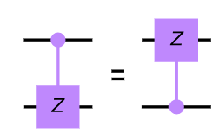

#### 快速练习

1\.
如果目标端量子比特（q1）处于态\|0⟩时，控制端量子比特\|1⟩（q0）的最终状态将是如何？（是不是于下面图中的的回路一样）？使用Qiskit检查答案。

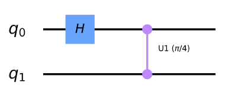

2\.
如果目标端量子比特（q1）处于态\|1⟩且在回路中使用受控Sdg门代替受控T门时，控制端量子比特\|1⟩（q0）的最终状态将是如何？（如下所示的量子回路）

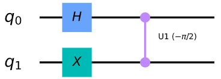

3\.
如果在应用受控T门之前将控制端量子比特（q0）的状态\|1⟩替换为\|+⟩，其会发生什么？（如下所示的量子回路）

2.4 证明普适性
--------------

### 内容

1\. 前言

2\. 定义普适性

3\. 证明普适性

4\. 通用量子门集

5\. 参考文献

### 1. 前言

对一台计算机来说做所有可能做的事情意味着什么？这就是在我们对计算机有一个很好的概念之前，艾伦·图灵（Alan
Turing）解决的问题。

若要向经典计算机问这个问题，特别是标准数字计算机，我们需要去掉所有的屏幕、扬声器和花哨的输入设备。所剩下的只是一台将输入比特串转换成输出比特串的机器。如果一个设备可以进行任何这样的转换，取任意一组输入并将其转换为任意选择的一组输出，我们称之为普适（*universal*）。

这些设备的普适性要求看上去非常合理。我们在"计算的基元"中执行加法所需的量子门也足以实现任何可能的计算。事实上，只要有足够数量的与非门就足够了。

虽然目前的计算机在理论上可以做任何事情，但有些任务在实践中过于耗费资源。在如何进行加法运算的研究中，我们看到所需的资源与问题的大小成线性关系。例如，如果将数字中的位数翻倍，需要进行加法的规模数量也翻倍。

对于许多其他问题，所需的资源随着输入的大小呈指数级增长，因式分解就是其中一个明显的例子。在最近的一项研究中\[1\]，一个320位数字会让CPU花费几年的时间来进行因式分解。对于那些并不很大的数字，在这个世界上也没有足够的计算资源来处理------尽管相同的数字可以在一个更合理的时间内仅用智能手机进行相加或相乘。

量子计算机将通过一种完全不同的方式实现普适性来缓解这些问题。正如我们所看到的，量子计算的变量并不等同于标准计算机的变量。我们所使用的量子门，例如在最后一节中使用的量子门，超出了标准计算机的逻辑门的范围。正因如此，我们可以找到其他方法来实现不可能实现的结果。

### 2. 定义普适性

那么我们如何定义量子计算机的普适性呢？可以用类似于上面讨论的定义方式来实现。正如数字计算机将一组输入比特串转换成一组输出比特串，幺正操作将一组正交输入状态转换成正交输出状态。

作为一种特殊情况，这些状态可以用量子形式描述比特串。如果我们能实现任一幺正，就能因此实现普遍性。

另一种特殊情况是输入和输出状态可以描述真实的物理系统。然后，幺正函数对应于时间演化。当用合适的厄米矩阵表示成指数形式时，该矩阵将对应于Hamiltonian。因此，实现任一幺正函数都对应于模拟任一时间演化，并实现任一Hamiltonian的影响。这也是一个重要的问题，对经典计算机来说是不切实际的，但却是量子计算机的原生应用。

量子计算机的普适性是如此简单：在任意数量的量子比特上实现任何所期望幺正的能力。

### 3. 证明普适性

对于经典计算机，我们需要将一个大的工作分割成可管理的块。我们需要找到一组基础的量子门来实现这一目标。正如将会看到的，上一节所提及的单量子比特和双量子比特门足以完成这项任务。

假设我们想要实现幺正变换：

$$U = e^{i\left( aX + bZ \right)}$$

但我们仅有量子门$R_{x}\left( \theta \right) = e^{i\frac{\theta}{2}X}$和$R_{z}\left( \theta \right) = e^{i\frac{\theta}{2}Z}$。处理这一问题的最佳方式为使用欧拉角（Euler
angle）。但先让我们考虑另一种不同的方法。

在$U$指数中的厄米矩阵仅是$R_{x}\left( \theta \right)$和$R_{z}\left( \theta \right)$旋转的和。这就给出了解决上述问题的天生方法：我们可以在应用$R_{x}\left( 2a \right) = e^{\text{iaX} }$之后紧跟$R_{z}\left( 2b \right) = e^{\text{ibZ} }$。但不幸的是，由于幂中的矩阵无法对易，这一方法就无法实现。

$$e^{\text{iaX} }e^{\text{ibZ} } \neq e^{i\left( aX + bZ \right)}$$

然而，我们可以使用修正的版本：

$$U = \lim_{n \rightarrow \infty}\left( e^{iaX/n}e^{ibZ/n} \right)^{n}$$

在这里我们把$U$分成n个片段。对于其中的每个片段，就会有一个很好的近似：

$$e^{iaX/n}e^{ibZ/n} = e^{i\left( aX + bZ \right)\text{/n} }$$

这一近似误差大小为$1/n^{2}$。当我们将n个片段组合起来后，所得到的目标幺正矩阵的误差大小为$1/n$。故只需简单的增加片段的数量，就能无限接近$U$。创建序列的其他方法也可能获得目标幺正更精确的版本。

这一方法的强大之处在于它可以应用于复杂的情况，而非仅是单个量子比特。例如，考虑幺正函数：

$$U = e^{i\left( aX \otimes X \otimes X + bZ \otimes Z \otimes Z \right)}$$

我们知道如何从但量子比特$R_{x}\left( \theta \right)$以及两个受控非门创建幺正$e^{i\frac{\theta}{2}X \otimes X \otimes X}$。

> theta = \'θ\'
>
> qc = QuantumCircuit(3)
>
> qc.cx(0,2)
>
> qc.cx(0,1)
>
> qc.rx(theta,0)
>
> qc.cx(0,1)
>
> qc.cx(0,1)
>
> qc.draw()
>
> 输出：

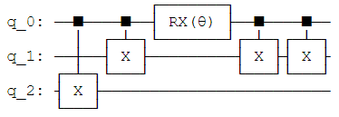

通过一些阿达马门，可以对$e^{i\frac{\theta}{2}Z \otimes Z \otimes Z}$进行同样的操作：

> qc.h(0)
>
> qc.h(1)
>
> qc.h(2)
>
> qc.cx(0,2)
>
> qc.cx(0,1)
>
> qc.rx(theta,0)
>
> qc.cx(0,1)
>
> qc.cx(0,1)
>
> qc.h(2)
>
> qc.h(1)
>
> qc.h(0)
>
> qc.draw()
>
> 输出：

这使我们有能力复制的片段，三量子比特U：

$$e^{i\frac{\theta}{2}X \otimes X \otimes X/n}e^{i\frac{\theta}{2}Z \otimes Z \otimes Z/n} = e^{i\left( aX \otimes X \otimes X + bZ \otimes Z \otimes Z \right)\text{/n} }$$

正如之前所说，接着我们将所有片段组合起来就能获得$U$的任意精确近似。

当我们增加量子比特的数量以及需要模拟项的数量时，这一方法仍然有效。必须小心确保近似仍然精确，但这可以通过请求合理资源的方式来实现。若要增加额外的项来模拟或者增加期望的精度，该方法的复杂度只要求增加多项式。

这一形式的方法可以复制任一$U\  = \ e^{\text{iH} }$，因此$H$可以表示为泡利量子门的张量积。由于我们在之前已经展示了所有矩阵都可以用这一方法表示，这足以说明我们可以复制所有的幺正变换。虽然其他方法在实践中可能更好，但本章的主旨是确实有一种方法可以仅使用Qiskit中的基本操作来重现所有的多量子比特。量子普适性可以被实现了！

### 4. 通用量子门集

在上面的内容中国呢我们看到通过$R_{x}$、$H$和CNOT（受控非门）实现普遍性，单还有许多不通的通用量子门。例如，IBMQX2处理器给出的一些基础量子门：

> from qiskit import IBMQ
>
> IBMQ.load_account()
>
> ibmqx2 = IBMQ.get_provider(\'ibm-q\').get_backend(\'ibmqx2\')
>
> ibmqx2.configuration().basis_gates
>
> 输出：
>
> \[\'u1\', \'u2\', \'u3\', \'cx\', \'id\'\]

从上面的输出可以看到IBMQX2处理器给出了$U_{1}$、$U_{2}$、$U_{3}$、$\text{CX}$和$\text{Id}$，足以复制任何幺正变换。其他类型的量子计算机有不同的原声量子门，比如双量子比特的Ising-gate\[2\]，这些量子门将不在此处讨论。您现在需要知道的是：使用一组通用量子门创建的任何算法都可以在任何通用量子计算机上运行。

### 5. 参考文献

\[1\] "[Factorization of a 1061-bit number by the Special Number Field
Sieve](https://eprint.iacr.org/2012/444.pdf)"by Greg Childers.

\[2\] "[Demonstration of a small programmable quantum computer with
atomic
qubits](http://iontrap.umd.edu/wp-content/uploads/2012/12/nature18648.pdf)"
by S.Debnath1, N.M.Linke1, C.Figgatt1, K.A.Landsman1, K.Wright1 &
C.Monroe

2.5 更多回路恒等式
------------------

> from qiskit import QuantumCircuit
>
> from qiskit.circuit import Gate
>
> from math import pi
>
> qc = QuantumCircuit(2)
>
> c = 0
>
> t = 1

当我们在量子计算机上编程时，我们的目标始终是从基础构建模块（the basic
building
blocks）构建有用的量子回路。但有时我们可能不能获取想要的全部基础构建模块。在本节中，我们将看到如何在基础的量子门之间进行转换，以及如何使用这些基础量子门构建稍微复杂的量子门。

我们在本章中所讨论的技术由Barenco及其合作者在1995年的论文中第一次被提出\[1\]。

### 内容

1\. 从一个CNOT创建一个受控Z门

2\. 交换量子比特

3\. 受控旋转

4\. Toffoli门

5\. H和T的任意旋转

6\. 参考文献

### 1. 从一个CNOT创建一个受控Z门

受控Z门（cz）是另一个经常使用的双量子比特门。如同无论控制端的量子比特是否处于态$\left| 1 \right\rangle$，作用于$X$（泡利-X）目标端量子比特的CNOT一样，受控Z门同样应用一个$Z$变换。在Qiskit中可以直接调用：

> \# a controlled-Z
>
> qc.cz(c,t)
>
> qc.draw()
>
> 输出：

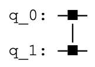

代码中的c和t是控制端和目标端量子比特。然而在IBM的Q设备上，唯一一类可以直接应用的双量子比特门是CNOT，所以我们需要找到将其转换为其他类型的方法。

这一过程相当简单。我们知道将态$\left| 0 \right\rangle$和$\left| 1 \right\rangle$转换为态$\left| + \right\rangle$和$\left| - \right\rangle$的阿达马门（Hadamard），还知道Z-gate在态$\left| + \right\rangle$和$\left| - \right\rangle$上所导致的影响与$X$在态$\left| 0 \right\rangle$和$\left| 1 \right\rangle$上所导致的相同。依据这些原因以及简单的矩阵相乘，我们发现：

$$HXH = Z,HZH = X$$

同样的技巧可以将CNOT转换为受控Z门时使用。所要做的仅是在目标量子比特的CNOT前后放置阿达马门。这一操作将应用于量子比特的任一$X$转换为一个$Z$。

> qc = QuantumCircuit(2)
>
> \# also a controlled-Z
>
> qc.h(t)
>
> qc.cx(c,t)
>
> qc.h(t)
>
> qc.draw()
>
> 输出：

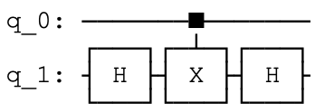

用更加通俗的方式来讲，我们可以将单个CNOT转换为任一布洛赫球中旋转角度$\pi$的受控版本，仅通过在其前后放置正确的旋转角度。例如，一个受控Y门：

> qc = QuantumCircuit(2)
>
> \# a controlled-Y
>
> qc.sdg(t)
>
> qc.cx(c,t)
>
> qc.s(t)
>
> qc.draw()
>
> 输出：

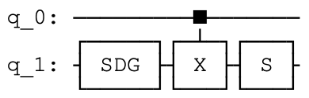

以及一个受控H门：

> qc = QuantumCircuit(2)
>
> \# a controlled-H
>
> qc.ry(pi/4,t)
>
> qc.cx(c,t)
>
> qc.ry(-pi/4,t)
>
> qc.draw()
>
> 输出：

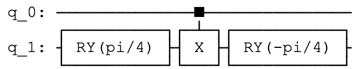

### 2. 交换量子比特

有时我们需要移动一个量子计算机中的信息。对于某些量子比特的实现，可以通过物理移动来实现。另一种方式是简单地在两个量子比特之间移动其状态。这就是由交换门（SWAP
gate）完成。

> a = 0
>
> b = 1
>
> qc = QuantumCircuit(2)
>
> \# swaps states of qubits a and b
>
> qc.swap(a,b)
>
> qc.draw()
>
> 输出：

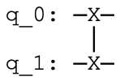

上面的代码中直接调用了这一量子门，现在让我们看看如何使用标准量子门集来实现SWAP
gate。

首先，我们来看看处于态\|1⟩的量子比特a和处于态\|0⟩的量子比特b，为此将应用以下的量子门：

> qc = QuantumCircuit(2)
>
> \# swap a 1 from a to b
>
> qc.cx(a,b) \# copies 1 from a to b
>
> qc.cx(b,a) \# uses the 1 on b to rotate the state of a to 0
>
> qc.draw()
>
> 输出：

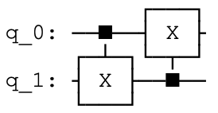

这就产生让量子比特a处于态\|0⟩以及量子比特b处于态\|1⟩的效果。至少在这一情况下，完成了交换（SWAP）操作。

现在让我们上面的状态交换至最初状态。您可能早就猜到，我们可以通过反转上述的过程来实现：

> \# swap a q from b to a
>
> qc.cx(b,a) \# copies 1 from b to a
>
> qc.cx(a,b) \# uses the 1 on a to rotate the state of b to 0
>
> qc.draw()
>
> 输出：

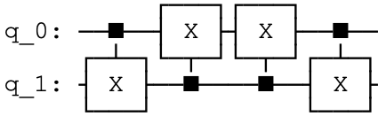

在这两个过程中可以看到，第一个步骤的量子门不会改变另一个的初始状态。例如，最后的cx(b,a)要求当我们从a至b交换\|1⟩时，不会对\|1⟩是否在b上产生影响。

通过这些观察，我们可以在其中添加一个无效的量子门来结合这两个过程。例如：

> qc = QuantumCircuit(2)
>
> qc.cx(b,a)
>
> qc.cx(a,b)
>
> qc.cx(b,a)
>
> qc.draw()
>
> 输出：

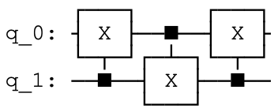

我们可以将这一过程当作开头包含无用qc.cx(b,a)的从a至b交换\|1⟩的过程。也可以将这一过程当作结尾包含无用qc.cx(b,a)的从b至a交换\|1⟩的过程。无论哪种方式，其结果是同时进行两种交换的过程。

上述过程对\|00⟩态也有正确的影响。由于\|00⟩态的对称性，交换量子比特的状态不会造成影响。因此在控制端量子比特为\|0⟩时，受控非门不会产生影响，这一过程正确地完成什么都不做的操作。

\|11⟩态也是对称的，所以会从交换过程中获得一些微不足道的影响。在这一情况下，上述过程中第一个受控非门将会导致第二个无效，第三个会撤销第一个的操作。因此，对于整体的影响确实是微不足道。

如此，我们找到了将SWAP
gate分解为单量子比特旋转和受控非门的标准量子门集的方法。

> qc = QuantumCircuit(2)
>
> qc.cx(b,a)
>
> qc.cx(a,b)
>
> qc.cx(b,a)
>
> qc.draw()
>
> 输出：

这一方法对态\|00⟩、\|01⟩、\|10⟩和\|11⟩起作用，如果这一方法对计算基的所有状态起作用，那么其必然对所有量子的装态普遍起作用。因此这一量子回路能够交换所有可能的双量子比特状态。

如果我们改变CNOT的顺序，会产生相同结果的影响：

> qc = QuantumCircuit(2)
>
> \# swaps states of qubits a and b
>
> qc.cx(a,b)
>
> qc.cx(b,a)
>
> qc.cx(a,b)
>
> qc.draw()
>
> 输出：

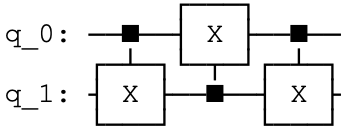

上面的代码是获得SWAP gate的同等有效方法。

这里的推导过程基于Z基态，但也可以通过思考交换处于态\|+⟩和\|−⟩的量子比特需要什么来实现。实现SWAP
gate的方法与上述的方法完全相同。

#### 快速练习

-   找出能够交换处于态\|+⟩和\|−⟩的量子比特的不同回路，并给出出等同于上文所示回路的图片。

### 3. 受控旋转

我们已经知道如何从单个受控非门构建受控的$\pi$旋转。此时我们将要看看如何构建任何受控旋转。

首先，让我们思考一下绕y轴的任意旋转，特别是思考以下量子门序列：

> qc = QuantumCircuit(2)
>
> theta = pi \# theta can be anything (pi chosen arbitrarily)
>
> qc.ry(theta/2,t)
>
> qc.cx(c,t)
>
> qc.ry(-theta/2,t)
>
> qc.cx(c,t)
>
> qc.draw()
>
> 输出：

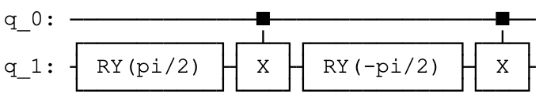

如果控制端量子比特处于态\|0⟩，我们将获得紧随$R_{y}\left( \theta/2 \right)$后的逆$R_{y}\left( - \theta/2 \right)$。最终影响还是无关紧要。如果控制端量子比特处于态\|1⟩，在X-gate前后的ry(-theta/2)会生效。这会产生改变y旋转方向的影响，并且生成第二个$R_{y}\left( \theta/2 \right)$。因此在这一情况下的净影响为使得$R_{y}\left( \theta/2 \right)$进行了受控的旋转。

因为x和y轴正交，所以这一方法有效，因而导致x门翻转了旋转方向。故相类似的过程创建了一个受控的$R_{z}\left( \theta \right)$。受控的$R_{x}\left( \theta \right)$也可以通过受控非门使用类似的方法创建。

我们还可以创建任一但量子比特$U$旋转的受控版本。此时我们进需要找出符合下述条件的旋转A、B、C和相位$\alpha$：

$$ABC = I,\ \ \ e^{\text{iα} }AZBZC = U$$

无论控制端是否处于态\|0⟩，使用受控Z门引发这些关系的第一个发生，然后当控制端处于态\|1⟩时引发第二个关系发生。$R_{z}\left( 2\alpha \right)$旋转也在控制端上获取正确的相位，每当处于叠加状态时这一点就变得很重要。

> A = Gate(\'A\', 1, \[\])
>
> B = Gate(\'B\', 1, \[\])
>
> C = Gate(\'C\', 1, \[\])
>
> alpha = 1 \# arbitrarily define alpha to allow drawing of circuit
>
> qc = QuantumCircuit(2)
>
> qc.append(C, \[t\])
>
> qc.cz(c,t)
>
> qc.append(B, \[t\])
>
> qc.cz(c,t)
>
> qc.append(A, \[t\])
>
> qc.u1(alpha,c)
>
> qc.draw()
>
> 输出：

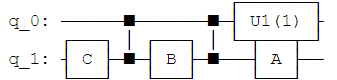

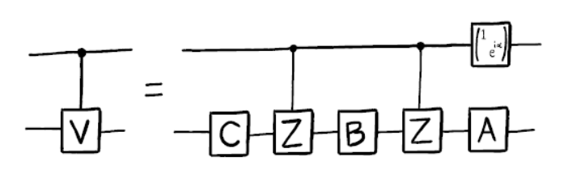

此处的A、B和C分别是$A$、$B$和$C$量子门的实现。

### 4. Toffoli门（又被称作 "控-控-非"门，\"controlled-controlled-not （CCNOT）\" gate）

Toffoli门是一个三量子比特门，其包含两个控制端以及一个目标端。其仅在两个控制端皆处于态\|1⟩时，才会在目标端上执行$X$（泡利-X）。

> qc = QuantumCircuit(3)
>
> a = 0
>
> b = 1
>
> t = 2
>
> \# Toffoli with control qubits a and b and target t
>
> qc.ccx(a,b,t)
>
> qc.draw()
>
> 输出：

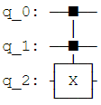

首先通过观察如何从单和双量子比特门来构建Toffoli门对于展示如何构建更通用的量子门非常有帮助：任何单量子比特经U旋转的任意控-控-U门（controlled-controlled-U）。若要创建控-控-U门，要定义受控版本的$V = \sqrt{U}$和$V^{\dagger}$。在下面的代码中，我们使用cu1(theta,c,t)和cu1(-theta,c,t)分别替换未定义的子程序cv和cvdg，其中控制端为$a$和$b$,目标端为$t$。

> qc = QuantumCircuit(3)
>
> qc.cu1(theta,b,t)
>
> qc.cx(a,b)
>
> qc.cu1(-theta,b,t)
>
> qc.cx(a,b)
>
> qc.cu1(theta,a,t)
>
> qc.draw()
>
> 输出：

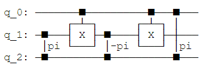

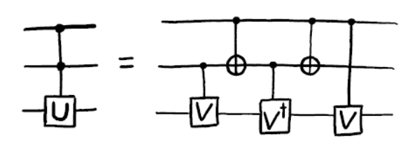

通过跟踪两个控制端量子比特的值，您能够说服自己：如果仅当两个控制端都为1时，U-gate才被应用于目标端量子比特。依据我们早就描述的想法，您现在能够通过受控V门（controlled-V
gate）实现某些回路中的双控U门（doubly-controlled-U
gate）。事实证明实现Toffoli门所需受控非门的最小数量为6 \[2\]。

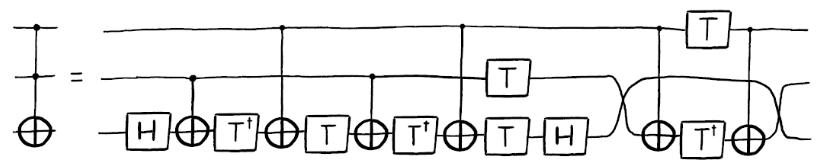

Toffoli门并非是在量子计算中实现与门（AND
gate）的唯一方式。我们还可以定义其他的量子门来实现相同的效果，但需要引入相对相位。在这一情况下，能够通过一些受控非门来实现与门。

例如，假设我们同时使用可以由单个受控非门实现的受控阿达马门和受控Z门构建以下回路：

> qc = QuantumCircuit(3)
>
> qc.ch(a,t)
>
> qc.cz(b,t)
>
> qc.ch(a,t)
>
> qc.draw()
>
> 输出：

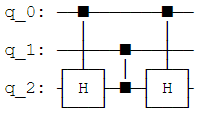

对于两个处于态\|00⟩的控制端，该回路不会在目标端做出任何改变。但对于态\|11⟩，目标端经历在一个Z-gate前后放置的$H$（$\text{HZH}$）。该过程的净影响是在目标端的$X$。若受控端处于\|01⟩和\|10⟩，目标端仅经历两个$H$（互相抵消）或一个$Z$（仅引入一个相对相位）。由于目标端的值仅当控制端处于\|11⟩态才会被改变，因此该回路幅重复了与门的效果，但其只用相当于三个CNOT门就实现了功能。

### 5. 自$\mathbf{H}$和$\mathbf{T}$的任意旋转

现有设备中的量子比特会受到噪声的影响，因此基本上组成量子门的是错误（mistake）。类似温度等简单情况会干扰磁场或激活相邻的量子比特，使得会发生所不期望的事情。

对于量子计算机中的大型应用程序，非常有必要以不受噪声影响的方式编码量子比特。因而使得依据错误或捎带错误的量子比特实现量子门极其困难。

这一不幸的情况在单量子比特旋转$R_{x}\left( \theta \right)$、$R_{y}\left( \theta \right)$和$R_{z}\left( \theta \right)$都存在。因此是不可能以完全的精度实现角度$\theta$的旋转，因而可以确信实现$\theta + 0.0000001$绝非偶然。我们所能达到的精度总有一个极限，而且当考虑到大型电路的累积不完全时，这一极限总是大于可容忍的范围。因此，我们将无法在容错（fault-tolerant）量子计算机中直接实现这些旋转，而是需要以一种更为慎重的方式来构建。

容错方案通常使用两个量子门（H和T）的多个应用来执行这些旋转。

在Qiskit中T-gate使用.t()表示：

> qc = QuantumCircuit(1)
>
> qc.t(0) \# T gate on qubit 0
>
> qc.draw()
>
> 输出：

这是一个绕Z轴进行$\theta = \pi/4$的旋转，其数学上的表示为$R_{z}\left( \pi/4 \right) = e^{i\pi/8\ Z}$。

在下文中我们假设$H$门和$T$门以有效的完美方式运行。这一点可以通过适当的纠错和容错方法来实现。

通过Hadamard以及在最后一章中讨论的方法，我们可以使用T-gate创建一个绕x轴的类似旋转。

qc = QuantumCircuit(1)

> qc.h(0)
>
> qc.t(0)
>
> qc.h(0)
>
> qc.draw()
>
> 输出：

现在将上面两个回路放在一起来创建$R_{x}\left( \pi/4 \right)R_{z}\left( \pi/4 \right)$门。

> qc = QuantumCircuit(1)
>
> qc.h(0)
>
> qc.t(0)
>
> qc.h(0)
>
> qc.t(0)
>
> qc.draw()
>
> 输出：

由于这是一个单量子比特门，我们可以想象其在布洛赫球中旋转的情形。这表明$R_{x}\left( \pi/4 \right)R_{z}\left( \pi/4 \right)$门是绕某一坐标轴按照某一角度的旋转。我们在此处不需要想象太多的坐标轴，仅用x、y和z轴就能够说明问题。更加重要的是角度问题。

这一旋转中角度的关键特性为其为无理数。您可以用一大堆数学来证明，但也可以通过应用该量子门后观察其不合理的动作来验证。重复该量子门n次会导致绕同一轴按照不同的角度旋转。由于无理性，不同的重复所产生的角度永远不会相同。

我们可以利用这一点。每一个角度都在$0$和$2\pi$之间，我们可以将这一间隔分割成宽度为$2\pi/n$的$n$个切片。对于每次重复，结果角度都会落在这些切片的一个中。如果我们查看第一次$n + 1$重复的角度，会发现至少有一个切片包含这些角度中的两个。此处我们使用$n_{1}$表示第一次需要重复的次数，$n_{2}$表示第二次需要重复的次数。

因此，我们可以证明关于$n_{2} - n_{1}$次重复中角度的一些问题。这和$n_{2}$次重复然后反向$n_{1}$次重复一样。由于这些重复中的角度不相等（由于无理性），但也不会大于$2\pi/n$（因为角度对应于同一切片），因此$n_{2} - n_{1}$次重复的角度满足：

$$\theta_{n_{2} - n_{1} } \neq 0,\  - \frac{2\pi}{n} \leq \theta_{n_{2} - n_{1} } \leq \frac{2\pi}{n}$$

所以我们有能力做小角度的旋转。我们可以使用这一原理旋转想要的任何角度，只需增加重复这一量子门的次数。

通过使用大量小角度旋转，我们还能够实现任何想要的旋转。虽然并非总是精确，但可保证$2\pi/n$的精度，并且可做到尽可能的小。至此我们可以控制旋转中的不精确性了。

到目前为止，我们只能绕一个轴做任意的旋转。对于第二个轴，我们简单地以相反的顺序进行$R_{x}\left( \pi/4 \right)$和$R_{z}\left( \pi/4 \right)$的旋转。

> qc = QuantumCircuit(1)
>
> qc.h(0)
>
> qc.t(0)
>
> qc.h(0)
>
> qc.t(0)
>
> qc.draw()
>
> 输出：

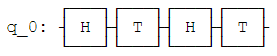

这一旋转所对用的轴与先前思考的量子门相同。我们现在有了绕两个轴的任意旋转，因此万可以实现绕布洛赫球的任意旋转。我们又可以做任何事情了，尽管需要很多T-gate。

正因为这样的应用，T-gate才在量子计算中如此突出。事实上，容错量子计算机算法的复杂性经常被引到需要多少T-gate上。这促使人们追求用尽可能少的T-gate来实现目标。可以看出上面的讨论只是为了证明T-gate可以用这一种方式来使用，其并不是我们所知道的最有效方法。

### 6. 参考文献

\[1\] [Barenco, et al.
1995](https://journals.aps.org/pra/abstract/10.1103/PhysRevA.52.3457?cm_mc_uid=43781767191014577577895&cm_mc_sid_50200000=1460741020)

\[2\] [Shende and Markov,
2009](http://dl.acm.org/citation.cfm?id=2011799)