# 3. 量子协议和量子算法

关于本节
--------

至此我们已经讲述了量子计算的基础，现在准备介绍一些量子协议（Quantum
Protocol）和算法（Quantum
Algorithm）。通过这些算法，我们会看到上一章中的概念，并将引入新的思想和技术。您将首先学习的算法是概念验证算法（**proof-of-concept
algorithm**），这些算法开发目的是展示量子计算机的优势。这些算法是学习量子编程很好的起点；因其展示了一些技术并在后来被应用到"有用的"算法中，从而引发了人们对量子计算的兴奋。这些算法可以让我们以其最简单的形式理解其中的核心思想。概念验证算法在测试硬件时也可以作为基准。

即将到来
--------

以下主题目前正在开发中，将被添加到本教程中：

-   NISQ硬件中的量子算法概览

3.1 定义量子回路
----------------

### 内容

1\. 引言

2\. 什么是量子回路？

3\. 示例：量子隐形传态（Quantum Teleportation）

4\. 示例：变分量子本征值求解器（Variational Quantum Eigensolver）

5\. 为何有经典部分？

### 1. 引言

到目前为止，我们已经看到过不同额单量子比特和多量子比特的量子门，还看到如何组合这两量子门和其他组件来构建量子回路。

在真实的量子计算机上实现量子算法之前，具体的强调一下量子回路的定义非常重要，如同我们将会创建量子回路来实现这些算法一样。

### 2. 什么是量子回路？

量子回路是由量子数据（如量子比特）上的相关量子操作和并行实时经典计算组成的计算程序，为量子门、测量和重置的有序序列，所有这些都可以有条件地使用来自实时经典计算的数据。

如果量子数据的任何幺正变换都可以有效地任意近似成量子门的序列，那么一组量子门就称为普适（universal）。任何量子程序都表示为一组量子电路和非并行经典计算。

### 3. 示例：量子隐形传态

看一看下面的量子回路，您将了解将要实现的量子隐形传态算法（the quantum
teleportation algorithm）。现在，看一下这一量子电路的组成就足够了。

该量子回路使用三个量子比特和两个经典比特。在这个量子回路中有四个主要元件。

#### 初始化和重置

首先，我们需要定义良好的量子态来开始量子计算，可以使用初始化和重置操作来实现。

重置操作可由结合单量子比特门和并发实时经典计算来实现，然后通过测量来监控是否成功地创建了所需的状态。然后通过应用单量子比特门初始化$q_{0}$至理想态$\left| \psi \right\rangle$。

#### 量子门

第二，我们应用一个量子门序列来操纵三个量子比特，以满足量子隐形传态算法的要求。在这一情况下，仅需使用单量子比特阿达马门（$H$）以及双量子比特受控X门（$\oplus$）。

#### 测量

第三，对三个量子比特中的两个进行测量。经典计算机将每个量子比特的测量结果解释为经典结果（0和1），并将其存储于两个经典比特中。

#### 经典条件量子门

第四，在第三个量子比特上应用单量子比特$Z$和$X$量子门。这些量子门是否运行由存储在两个经典比特的测量结果决定。此时，我们在同一量子回路中同时实时地使用了经典计算的结果。

### 4. 示例：变分量子本征值求解器

以下是一个量子程序的示例。您将在接下来的章节中学习，该程序实现了一个变分量子特征值求解器。在这个程序中，经典计算机与量子计算机非并发地协同工作。

#### 量子块（Quantum Block）

在上面的示例1中，量子态$\left| \Psi\left( \theta \right) \right\rangle$是由单和多量子比特量子门形成的重置组合。在这里，状态的参数被量$\theta$参数化。一旦其准备好，量子态就可以用量子门操纵并测量。量子块内的所有操作都由量子回路组成。

#### 经典块（Classical Block）

一旦量子态被测量，一个经典计算器对测量结果进行解释，并使用针对特定应用选择的代价（cost）函数来计算其代价。在此代价的基础上，经典计算器确定参数$\theta$的另一个值。

#### 联合运行（Combined operation）

一旦经典计算器确定了重置序列的下一个参数$\theta$，量子回路中的单和多量子比特量子门就会准备$\left| \Psi\left( \theta \right) \right\rangle$，这一过程会一直运行直到被测量子态的代价稳定，或者直到另一个预先确定的结果得到满足。

### 5. 为何有经典部分？

虽然通用量子计算机可以做任何经典计算机能做的事情，但我们经常在量子电路中添加经典部分，因为量子态很脆弱。

当我们测量量子比特时就探索了其的状态，破坏了其中的许多信息。由于所有测量都会破坏信息，所以理论上我们总是可以最后测量并且不会失去计算上的优势。但现实中，早先测量提供了许多实际的优势。

例如，在隐形传态回路中，通过测量量子比特就可以通过经典信道而非量子信道发送信息。其优点是经典信道非常稳定，而且我们并没有可行的方法将量子信息发送给其他人，因为这种信道很难创建。

在变分量子本征值求解器的例子中，把计算分解成更小的量子计算实际上失去了一些计算优势，但通过减少量子比特的叠加时间弥补了这一点。这意味着干扰导致结果不准确的机会减少。

最后，若要在日常中使用量子计算的结果，需要在计算结束时测量和解释这些状态。

3.2 量子隐形传态
----------------

### 内容

1\. 概述

2\. 量子隐形传态协议

3\. 模拟隐形传态协议

3.1
我们如何在真正的量子计算机上测试该协议？（原文错误，原文中是结果Result）

3.2 使用态向量模拟器

3.3 使用QASM模拟器

4\. 理解隐形传态

5\. 在真正的量子计算机上隐形传态

5.1 IBM硬件与递延测量

5.2 执行

6\. 参考文献

### 1. 概述

Alice想要传送量子信息给Bob。具体来说，假设她想发送量子比特状态$\left| \psi \right\rangle = \alpha\left| 0 \right\rangle + \beta\left| 1 \right\rangle$，就需要向Bob传递关于$\alpha$和$\beta$的信息。

在量子力学中存在一个定理：您不能简单地复制一个未知的量子状态，这就是所谓的非克隆定理（no-cloning
theorem）。因此我们可以看到Alice不能简单地生成$\left| \psi \right\rangle$的副本并发生给Bob，所以我们只能复制经典态（不能复制叠加态）。

然而，利用两个经典比特和一对纠缠量子比特，Alice可以转移状态$\left| \psi \right\rangle$给Bob。我们将在Bob收到$\left| \psi \right\rangle$后Alice就没有该$\left| \psi \right\rangle$的情况称之为隐形传态（**teleportation**）。

### 2. 量子隐形传态协议

为了转移一个量子比特，Alice和Bob必须让第三方（Eve）向他们发送一个纠缠的量子比特对。然后Alice他们对发送给她的量子比特进行一些操作，并通过一个经典的通信信道将结果发送给Bob，然后Bob在他的量子比特上进行一些操作来接收Alice的量子比特。

我们将在下面量子回路中描述该步骤。在这里，没有量子比特实际上被"发送"，您只需要想象该情况！

首先设置会话：

> \# Do the necessary imports
>
> import numpy as np
>
> from qiskit import QuantumCircuit, QuantumRegister, ClassicalRegister,
> execute, BasicAer, IBMQ
>
> from qiskit.visualization import plot_histogram,
> plot_bloch_multivector
>
> from qiskit.extensions import Initialize
>
> from qiskit_textbook.tools import random_state, array_to_latex

然后创建量子回路：

> qr = QuantumRegister(3) \# Protocol uses 3 qubits
>
> crz = ClassicalRegister(1) \# and 2 classical bits
>
> crx = ClassicalRegister(1) \# in 2 different registers
>
> teleportation_circuit = QuantumCircuit(qr, crz, crx)

#### 步骤1

第三方Eve创建一纠缠的量子比特对，并将其分别给Alice和Bob。

Eve创建的纠缠对是一个称之为贝尔对（Bell
pair）的特定量子比特对。用量子回路的语言描述，创建两个两个量子比特的贝尔对是使用阿达马门先将其中一个转移至X-基（$\left| + \right\rangle$和$\left| - \right\rangle$），然后依据在X-基上的量子比特在另一个上应用一个受控非门。

> def create_bell_pair(qc, a, b):
>
> \"\"\"Creates a bell pair in qc using qubits a & b\"\"\"
>
> qc.h(a) \# Put qubit a into state \|+\>
>
> qc.cx(a,b) \# CNOT with a as control and b as target
>
> \#\# SETUP
>
> \# Protocol uses 3 qubits and 2 classical bits in 2 different
> registers
>
> qr = QuantumRegister(3)
>
> crz, crx = ClassicalRegister(1), ClassicalRegister(1)
>
> teleportation_circuit = QuantumCircuit(qr, crz, crx)
>
> \#\# STEP 1
>
> \# In our case, Eve entangles qubits q1 and q2
>
> \# Let\'s apply this to our circuit:
>
> create_bell_pair(teleportation_circuit, 1, 2)
>
> \# And view the circuit so far:
>
> teleportation_circuit.draw()
>
> 输出：

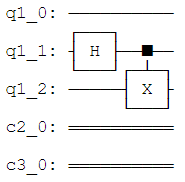

在将该贝尔对分开后，我们可以说Alice拥有$q_{1}$而Bob拥有$q_{2}$。

#### 步骤2

Alice在$q_{1}$上应用一个由$\left| \psi \right\rangle$控制的受控非门，$\left| \psi \right\rangle$是将要传送给Bob的量子比特。然后Alice在$\left| \psi \right\rangle$应用一个阿达马门。在我们所创建的量子回路中，Alice想要传送的量子比特$\left| \psi \right\rangle$是$q_{0}$：

> def alice_gates(qc, psi, a):
>
> qc.cx(psi, a)
>
> qc.h(psi)
>
> \#\# SETUP
>
> \# Protocol uses 3 qubits and 2 classical bits in 2 different
> registers
>
> qr = QuantumRegister(3)
>
> crz, crx = ClassicalRegister(1), ClassicalRegister(1)
>
> teleportation_circuit = QuantumCircuit(qr, crz, crx)
>
> \#\# STEP 1
>
> create_bell_pair(teleportation_circuit, 1, 2)
>
> \#\# STEP 2
>
> teleportation_circuit.barrier() \# Use barrier to separate steps
>
> alice_gates(teleportation_circuit, 0, 1)
>
> teleportation_circuit.draw()
>
> 输出：

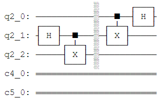

#### 步骤3

接着，Alice在其所有的量子比特$q_{1}$和$\left| \psi \right\rangle$上应用一个测量，并将结果储存在两个经典比特中。然后将这两个经典比特传送给Bob。

> def measure_and_send(qc, a, b):
>
> \"\"\"Measures qubits a & b and \'sends\' the results to Bob\"\"\"
>
> qc.barrier()
>
> qc.measure(a,0)
>
> qc.measure(b,1)
>
> \#\# SETUP
>
> \# Protocol uses 3 qubits and 2 classical bits in 2 different
> registers
>
> qr = QuantumRegister(3)
>
> crz, crx = ClassicalRegister(1), ClassicalRegister(1)
>
> teleportation_circuit = QuantumCircuit(qr, crz, crx)
>
> \#\# STEP 1
>
> create_bell_pair(teleportation_circuit, 1, 2)
>
> \#\# STEP 2
>
> teleportation_circuit.barrier() \# Use barrier to separate steps
>
> alice_gates(teleportation_circuit, 0, 1)
>
> \#\# STEP 3
>
> measure_and_send(teleportation_circuit, 0 ,1)
>
> teleportation_circuit.draw()
>
> 输出：

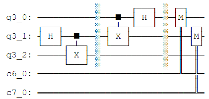

#### 步骤4

已有量子比特$q_{2}$的Bob会在接收经典比特后，依据所接收经典比特所代表的状态应用以下量子门：

00$\rightarrow$什么也不做

01$\rightarrow$应用$X$-gate

10$\rightarrow$应用$Z$-gate

11$\rightarrow$应用$\text{ZX}$-gate

> \# This function takes a QuantumCircuit (qc), integer (qubit)
>
> \# and ClassicalRegisters (crz & crx) to decide which gates to apply
>
> def bob_gates(qc, qubit, crz, crx):
>
> \# Here we use c_if to control our gates with a classical
>
> \# bit instead of a qubit
>
> qc.x(qubit).c_if(crx, 1) \# Apply gates if the registers
>
> qc.z(qubit).c_if(crz, 1) \# are in the state \'1\'
>
> \#\# SETUP
>
> \# Protocol uses 3 qubits and 2 classical bits in 2 different
> registers
>
> qr = QuantumRegister(3)
>
> crz, crx = ClassicalRegister(1), ClassicalRegister(1)
>
> teleportation_circuit = QuantumCircuit(qr, crz, crx)
>
> \#\# STEP 1
>
> create_bell_pair(teleportation_circuit, 1, 2)
>
> \#\# STEP 2
>
> teleportation_circuit.barrier() \# Use barrier to separate steps
>
> alice_gates(teleportation_circuit, 0, 1)
>
> \#\# STEP 3
>
> measure_and_send(teleportation_circuit, 0 ,1)
>
> \#\# STEP 4
>
> teleportation_circuit.barrier() \# Use barrier to separate steps
>
> bob_gates(teleportation_circuit, 2, crz, crx)
>
> teleportation_circuit.draw()
>
> 输出：

（注：此处是纯经典的信息转移。）

在这个协议的最后，Alice的量子比特已经传送给Bob了。

### 3. 模拟隐形传态协议

#### 3.1 我们如何在真正的量子计算机上测试该协议？

在本notebook中，我们将初始化Alice的量子比特为随机态$\left| \psi \right\rangle$（psi，普西）。这一状态将通过在$\left| q_{0} \right\rangle$上初始一个量子门来创建。我们在本章中使用random_state函数为我们选择psi，但是您可以将psi设置为任意想要的量子比特。

> \# Create random 1-qubit state
>
> psi = random_state(1)
>
> \# Display it nicely
>
> array_to_latex(psi, pretext=\"\|\\\\psi\\\\rangle =\")
>
> \# Show it on a Bloch sphere
>
> plot_bloch_multivector(psi)
>
> 输出：

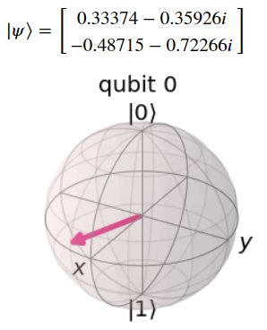

现在让我们从态$\left| 0 \right\rangle$创建初始的量子门：

> init_gate = Initialize(psi)
>
> init_gate.label = \"init\"

如果量子隐形传态工作，那么在量子回路末端的$\left| q_{2} \right\rangle$就会处于这一状态（psi）。我们将会使用态向量模拟器来检查。

#### 3.2 使用态向量模拟器

我们可以使用态向量模拟器来验证量子比特是否被传送。

> \#\# SETUP
>
> qr = QuantumRegister(3) \# Protocol uses 3 qubits
>
> crz = ClassicalRegister(1) \# and 2 classical registers
>
> crx = ClassicalRegister(1)
>
> qc = QuantumCircuit(qr, crz, crx)
>
> \#\# STEP 0
>
> \# First, let\'s initialise Alice\'s q0
>
> qc.append(init_gate, \[0\])
>
> qc.barrier()
>
> \#\# STEP 1
>
> \# Now begins the teleportation protocol
>
> create_bell_pair(qc, 1, 2)
>
> qc.barrier()
>
> \#\# STEP 2
>
> \# Send q1 to Alice and q2 to Bob
>
> alice_gates(qc, 0, 1)
>
> \#\# STEP 3
>
> \# Alice then sends her classical bits to Bob
>
> measure_and_send(qc, 0, 1)
>
> \#\# STEP 4
>
> \# Bob decodes qubits
>
> bob_gates(qc, 2, crz, crx)
>
> \# Display the circuit
>
> qc.draw()
>
> 输出：

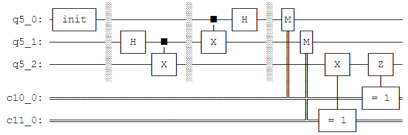

我们可以从下面看到，通过使用态向量模拟器$\left| q_{2} \right\rangle$的状态与所创建的$\left| \psi \right\rangle$完全一样，同时$\left| q_{0} \right\rangle$和$\left| q_{1} \right\rangle$的状态坍缩为$\left| 0 \right\rangle$和$\left| 1 \right\rangle$。态$\left| \psi \right\rangle$被从量子比特0传态至量子比特2。

> backend = BasicAer.get_backend(\'statevector_simulator\')
>
> out_vector = execute(qc, backend).result().get_statevector()
>
> plot_bloch_multivector(out_vector)
>
> 输出：

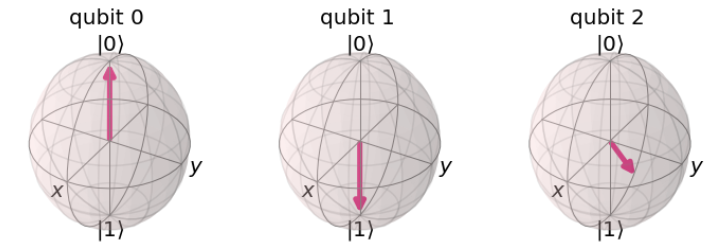

您可以通过多次上面的代码来确认。您可能已经注意到：量子比特0和1改变了其状态，但是量子比特2始终处于态$\left| \psi \right\rangle$。

#### 3.3 使用QASM模拟器

量子隐形传态被设计为在两方之间发送量子比特。我们没有硬件来演示，但我们可以证明量子门在单一量子芯片上执行正确的转换。在这里我们使用QASM模拟器来模拟如何测试该协议。

在一台真正的量子计算机上我们无法对态向量进行采样，所以如果想检查隐形传态回路是否正常，需要做一些稍微不同的事情。是否还记得我们使用初始化（Initialize）将态$\left| 0 \right\rangle$的量子比特转换为$\left| \psi \right\rangle$。

$$\left| 0 \right\rangle\overset{\text{Initiali}se}{\rightarrow}\left| \psi \right\rangle$$

由于所有量子比特都是可反转的（reversible），我们可以找到初始化的逆：

inverse_init_gate = init_gate.gates_to_uncompute()

该操作有性质为：

$$\left| \psi \right\rangle\overset{\text{Inverse\ Initiali}se}{\rightarrow}\left| 0 \right\rangle$$

为了验证量子比特$\left| q_{0} \right\rangle$被传态至$\left| q_{2} \right\rangle$，如果在$\left| q_{2} \right\rangle$上执行逆初始化操作，我们期望确定无疑地测量为$\left| 0 \right\rangle$。实现这一过程的回路如下代码：

> \#\# SETUP
>
> qr = QuantumRegister(3) \# Protocol uses 3 qubits
>
> crz = ClassicalRegister(1) \# and 2 classical registers
>
> crx = ClassicalRegister(1)
>
> qc = QuantumCircuit(qr, crz, crx)
>
> \#\# STEP 0
>
> \# First, let\'s initialise Alice\'s q0
>
> qc.append(init_gate, \[0\])
>
> qc.barrier()
>
> \#\# STEP 1
>
> \# Now begins the teleportation protocol
>
> create_bell_pair(qc, 1, 2)
>
> qc.barrier()
>
> \#\# STEP 2
>
> \# Send q1 to Alice and q2 to Bob
>
> alice_gates(qc, 0, 1)
>
> \#\# STEP 3
>
> \# Alice then sends her classical bits to Bob
>
> measure_and_send(qc, 0, 1)
>
> \#\# STEP 4
>
> \# Bob decodes qubits
>
> bob_gates(qc, 2, crz, crx)
>
> \#\# STEP 5
>
> \# reverse the initialisation process
>
> qc.append(inverse_init_gate, \[2\])
>
> \# Display the circuit
>
> qc.draw()
>
> 输出：

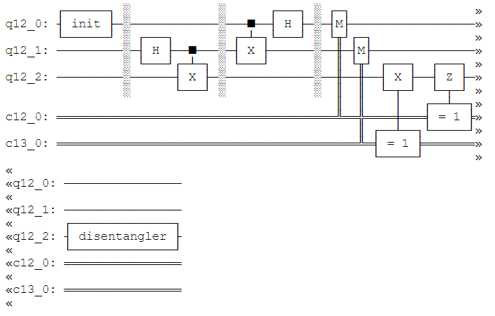

最后，我们测量第三个量子比特，并将结果存储在第三个经典比特中：

> \# Need to add a new ClassicalRegister
>
> \# to see the result
>
> cr_result = ClassicalRegister(1)
>
> qc.add_register(cr_result)
>
> qc.measure(2,2)
>
> qc.draw()
>
> 输出：

接着进行实验：

> backend = BasicAer.get_backend(\'qasm_simulator\')
>
> counts = execute(qc, backend, shots=1024).result().get_counts()
>
> plot_histogram(counts)
>
> 输出：

可以看到测量$q_{2}$的结果100%处于态$\left| 0 \right\rangle$。这正是所期望的结果，表明传态协议工作正常。

### 4. 理解量子隐形传态

在您实现可运行的量子隐形传态的实例之前，因当理解该协议背后的数学原理。

#### 步骤1

量子隐形传态开始于Alice传送一个随机量子比特（$|q\rangle = a|0\rangle + b|1\rangle$）给Bob。Alice并不清楚该量子比特处于哪种状态。因此，Alice和Bob向第三方Eva求助。Eva为Alice和Bob准备一对处于纠缠态的量子比特对，这一纠缠量子比特对可以写为如下狄拉克符号：

$$|\psi \rangle = \frac{1}{\sqrt{2} } (|00\rangle + |11\rangle)$$

Alice和Bob分别处理该纠缠量子比特对中一个量子比特（分别标记为A和B）：

$$|\psi\rangle = \frac{1}{\sqrt{2} } (|0\rangle_A |0\rangle_B + |1\rangle_A |1\rangle_B)$$

经过处理后会生成一个三量子比特系统，其中Alice拥有前两个，而Bob拥有最后一个。

$$
|q\rangle \otimes |\psi\rangle = \frac{1}{\sqrt{2} } (a |0\rangle \otimes (|00\rangle + |11\rangle) + b |1\rangle \otimes (|00\rangle + |11\rangle))\\
= \frac{1}{\sqrt{2} } (a|000\rangle + a|011\rangle + b|100\rangle + b|111\rangle)$$

#### 步骤2

现在依据协议，Alice在其所有两个量子比特上应用CNOT量子门，然后对第一个量子比特应用一个阿达玛门（H-gate）。这一过程会生成如下状态：

$$
(H \otimes I \otimes I) (CNOT \otimes I) (|q\rangle \otimes |\psi\rangle)\\
=(H \otimes I \otimes I) (CNOT \otimes I) \frac{1}{\sqrt{2} } (a|000\rangle + a|011\rangle + b|100\rangle + b|111\rangle) \\
= (H \otimes I \otimes I) \frac{1}{\sqrt{2} } (a|000\rangle + a|011\rangle + b|110\rangle + b|101\rangle) \\
= \frac{1}{2}  (a(|000\rangle + |011\rangle + |100\rangle + |111\rangle) + b(|010\rangle + |001\rangle - |110\rangle - |101\rangle))
$$

然后可以将其分开写成：

$$
= \frac{1}{2}(\phantom{+} |00\rangle (a|0\rangle + b|1\rangle) \hphantom{\quad )} \\
  + |01\rangle (a|1\rangle + b|0\rangle) \hphantom{\quad )}\\[4pt]
  + |10\rangle (a|0\rangle - b|1\rangle) \hphantom{\quad )}\\[4pt]
  + |11\rangle (a|1\rangle - b|0\rangle) \quad )
$$

#### 步骤3

Alice对所有的前两个量子比特进行测量后将测量结果作为两个经典比特发送给Bob。Alice测量所获得的结果始终以等概率的情况落于标准基态$|00\rangle，|01\rangle，|10\rangle，|11\rangle$之一。

依据Alice的测量结果，Bob将其映射至：

$$|00\rangle \rightarrow (a|0\rangle + b|1\rangle)\\
|01\rangle \rightarrow (a|1\rangle + b|0\rangle)\\
|10\rangle \rightarrow (a|0\rangle - b|1\rangle)\\
|11\rangle \rightarrow (a|1\rangle - b|0\rangle)$$

#### 步骤4

Bob在收到来自Alice的经典比特后就知道可以通过在纠缠量子比特对中属于他的量子比特上应用相应的变换来获取原始态$|q\rangle$。

Bob所需要的变换步骤如下：

经过上述步骤之后Bob就成功的重构Alice所拥有量子比特的状态了。

### 5. 在真正的量子计算机上隐形传态

#### 5.1 IBM硬件与递延测量

IBM量子计算机目前不支持后测量的指令，表明我们不能在真实的硬件上运行当前形式的量子隐形传态。幸运的是，由于递延测量原理\[1\]，这一点并没有限制我们执行任何计算的能力。该原理表明，任何测量都可以推迟到回路的末端，也就是说我么可以将所有的测量移到末端，就会看到相同的结果。

早期测量的任何益处都与硬件相关联：如果能够提前测量，我们就能够重用量子比特，或者减少量子比特处于脆弱叠加态的时间。在这个例子中，量子隐形传态的早期测量允许我们在没有直接量子通信信道的情况下传输一个量子比特。

虽然移动量子门可以让我们在真实的硬件上演示"隐形传态"回路，但需要注意的是，隐形传态过程（通过经典通道传输量子态）的益处已经丧失了。

下载改写bob_gates函数为new_bob_gates：

> def new_bob_gates(qc, a, b, c):
>
> qc.cz(a, c)
>
> qc.cx(b, c)
>
> qc = QuantumCircuit(3,1)
>
> \# First, let\'s initialise Alice\'s q0
>
> qc.append(init_gate, \[0\])
>
> qc.barrier()
>
> \# Now begins the teleportation protocol
>
> create_bell_pair(qc, 1, 2)
>
> qc.barrier()
>
> \# Send q1 to Alice and q2 to Bob
>
> alice_gates(qc, 0, 1)
>
> qc.barrier()
>
> \# Alice sends classical bits to Bob
>
> new_bob_gates(qc, 0, 1, 2)
>
> \# We undo the initialisation process
>
> qc.append(inverse_init_gate, \[2\])
>
> \# See the results, we only care about the state of qubit 2
>
> qc.measure(2,0)
>
> \# View the results:
>
> qc.draw()
>
> 输出：

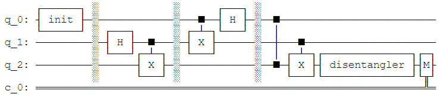

然后创建一个新的量子回路：

> \# First, see what devices we are allowed to use by loading our saved
> accounts，此步骤需要注册IBM的账号
>
> IBMQ.load_account()
>
> provider = IBMQ.get_provider(hub=\'ibm-q\')
>
> provider.backends()
>
> 输出：
>
> 略...

#### 5.2 执行

> \# get the least-busy backend at IBM and run the quantum circuit there
>
> from qiskit.providers.ibmq import least_busy
>
> backend = least_busy(provider.backends(filters=lambda b:
> b.configuration().n_qubits \>= 3 and
>
> not b.configuration().simulator and b.status().operational==True))
>
> job_exp = execute(qc, backend=backend, shots=8192)
>
> \# Get the results and display them
>
> exp_result = job_exp.result()
>
> exp_measurement_result = exp_result.get_counts(qc)
>
> print(exp_measurement_result)
>
> plot_histogram(exp_measurement_result)
>
> 输出：

正如所看到的，有一些我们测量出为态$\left| 1 \right\rangle$的结果。这些结果的出现是由于量子门和量子比特中的误差。相比之下，本章中在先前的模拟器运行该量子门没有发生错误，并且允许无差错的传态。

> error_rate_percent = sum(\[exp_measurement_result\[result\] for result
> in exp_measurement_result.keys() if result\[0\]==\'1\'\]) \\
>
> \* 100./ sum(list(exp_measurement_result.values()))
>
> print(\"The experimental error rate : \", error_rate_percent, \"%\")
>
> 输出：
>
> The experimental error rate : 7.6171875 %

### 6. 参考文献

\[1\] M. Nielsen and I. Chuang, Quantum Computation and Quantum
Information, Cambridge Series on Information and the Natural Sciences
(Cambridge University Press, Cambridge, 2000).

3.3 超密编码（Superdense Coding）
---------------------------------

本节证明了超密编码（Superdense
Coding，SDC）协议。我们首先使用Qiskit的模拟器来测试量子回路，然后在一台真正的量子计算机上进行测试。

### 内容

1\. 超密编码和量子隐形传态

2\. 过程

2.1 步骤1

2.2 步骤2

2.3 步骤3

3\. 模拟超密编码协议

3.1 可视化测量

4\. 在真正的量子计算机上超密编码

### 1. 超密编码和量子隐形传态之间的不同

量子隐形传态和超密编码是密切相关的，为了避免混淆，需要澄清之间的区别。

量子隐形传态是通过两个经典通信和一个贝尔对将一个处于态$\left| \psi \right\rangle$的量子比特从一个地方传送到另一个地方的过程。也就说我么可以将这一过程认可为一个协议，其可以在共享纠缠态帮助下，在一个位置摧毁一个量子比特的量子态，然后在另一个遥远的位置重建。超密编码是一种程序，允许某人仅使用单个量子比特通信就可以向另一方发送两个经典比特。

  **Teleportation**   **Superdense Coding**
  ------------------- -----------------------
  Transmit one        Transmit two
  qubit using two     classical bits
  classical bits      using one qubit

远程传态协议可以看作是超密编码协议的翻版，就其意义而言Alice和Bob只是"交换了彼此的设备"。

### 2. 过程

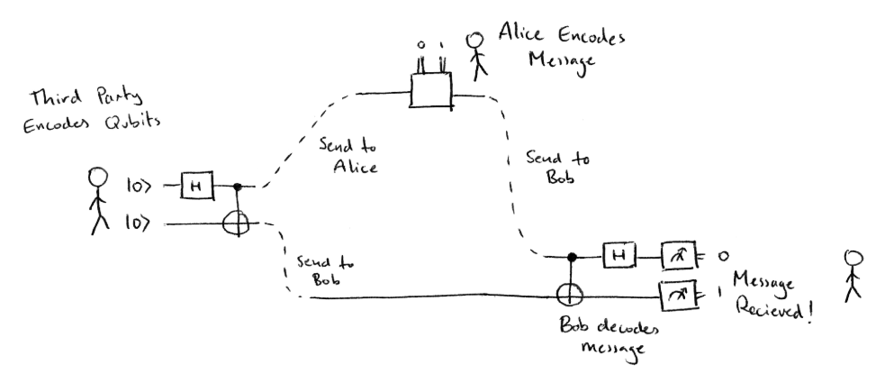

#### 2.1 步骤1

超密编码的过程从一个第三方开始，我们将其称为Charlie。两个处于纠缠态的量子比特由Charlie给出。他将这两个量子比特初始化为基态$\left| 0 \right\rangle$。接着将一个阿达马门（$H$）应用于第一个量子比特使其处于叠加态，然后应用一个受控非门（$\text{CX}$）是第一个量子比特为控制端，另一个为目标端。这就生成了我们在之前提到的纠缠态（Bell
pair）。

##### 结果状态

Charlie先应用了一个阿达马门。

当H-gate应用于第一个量子比特后，创建了如下状态的叠加态：

$$|0 + \rangle = \frac{1}{\sqrt{2} }(|00\rangle + |01\rangle)$$

然后再应用一个受控非门。该受控非门将两个量子比特就餐在一起，若控制端的态为$\left| 1 \right\rangle$则翻转目标端。请注意控制端的量子比特时上式中最右侧的一个。

$$\text{CNOT}\frac{1}{\sqrt{2} }(|00\rangle + |01\rangle) = \frac{1}{\sqrt{2} }(|00\rangle + |11\rangle)$$

#### 2.2 步骤2

Charlie将第一个量子比特发送给了Alice，并将第二个发给了Bob。这一协议的目的为Alice通过发给她的量子比特发送两个经典比特的信息给Bob。在她做出这些操作前，

Alice需要依据所要发出的2个比特信息在她的量子比特上应用一组量子门。

##### 超密编码的编码规则（Alice 协议）

因此，如果她想发送一个00，则对其量子比特不做任何操作（应用I-gate（I））。如果需要发送一个10，那么应用X门。根据想要发送的内容应用适当的门，然后将她的量子比特发送给Bob进行最后一步。

#### 2.3 步骤3

Bob收到Alice发过来的量子比特后使用他的量子比特解码Alice的信息。注意：Bob不需要知道解码量子态信息的知识，只需简单的还原加密操作（反向）。

Bob应用一个受控非门，将最右侧的量子比特作为控制端，最左侧的为目标端。然后应用阿达马门，并在最后对两个量子比特执行测量来提取Alice的信息。

当Bob执行测量时，就确认收到了来自Alice的信息。注意！解码信息所得的最后结果带有负号（$- \left| 11 \right\rangle$），将其写为$\left| 11 \right\rangle$也正确，因为这是一个无法测量的全局相位。

### 3. 模拟超密编码协议

> \# Importing everything
>
> from qiskit import \*
>
> from qiskit.visualization import plot_histogram
>
> \# For Jupyter Notebooks, change the settings to get nicer images
>
> %config InlineBackend.figure_format = \'svg\'

在之前的介绍中我们看到需要创建一个纠缠的量子对，先应用一个H-hate，接着应用一个CNOT。我们可以创建一个函数来完成这一过程，该函数分别接收参数为量子回路与纠缠的量子对（分别为a和b）：

> \# Define a function that takes a QuantumCircuit (qc)
>
> \# and two integers (a & b)
>
> def create_bell_pair(qc, a, b):
>
> qc.h(a) \# Apply a h-gate to the first qubit
>
> qc.cx(a,b) \# Apply a CNOT, using the first qubit as the control

接着就需要对信息进行编码。在这之前我们看到由四种可能的信息可以被发送：00、01、10和11。我们可以创建一个函数来接收这个信息并应用相应的量子门：

> \# Define a function that takes a QuantumCircuit (qc)
>
> \# a qubit index (qubit) and a message string (msg)
>
> def encode_message(qc, qubit, msg):
>
> if msg == \"00\":
>
> pass \# To send 00 we do nothing
>
> elif msg == \"10\":
>
> qc.x(qubit) \# To send 10 we apply an X-gate
>
> elif msg == \"01\":
>
> qc.z(qubit) \# To send 01 we apply a Z-gate
>
> elif msg == \"11\":
>
> qc.z(qubit) \# To send 11, we apply a Z-gate
>
> qc.x(qubit) \# followed by an X-gate
>
> else:
>
> print(\"Invalid Message: Sending \'00\'\")

最后，需要对信息进行解码，如同在之前所见，先应用一个CNOT，然后是H-gate。我们也创建一个函数来处理：

> def decode_message(qc, a, b):
>
> qc.cx(a,b)
>
> qc.h(a)

最终，我们将所有一切组合起来就完成了协议。

> \# Create the quantum circuit with 2 qubits
>
> qc = QuantumCircuit(2)
>
> \# First, Charlie creates the entangled pair between Alice and Bob
>
> create_bell_pair(qc, 0, 1)
>
> qc.barrier() \# This adds a barrier to our circuit. A barrier
>
> \# separates the gates in our diagram and makes it
>
> \# clear which part of the circuit is which
>
> \# At this point, qubit 0 goes to Alice and qubit 1 goes to Bob
>
> \# Next, Alice encodes her message onto qubit 0. In this case,
>
> \# we want to send the message \'10\'. You can try changing this
>
> \# value and see how it affects the circuit
>
> message = \"10\"
>
> encode_message(qc, 0, message)
>
> qc.barrier()
>
> \# Alice then sends her qubit to Bob.
>
> \# After recieving qubit 0, Bob applies the recovery protocol:
>
> decode_message(qc, 0, 1)
>
> \# Finally, Bob measures his qubits to read Alice\'s message
>
> qc.measure_all()
>
> \# Draw our output
>
> qc.draw(output = \"mpl\")
>
> 输出：

#### 3.1 可视化测量

> backend = Aer.get_backend(\'qasm_simulator\')
>
> job_sim = execute(qc, backend, shots=1024)
>
> sim_result = job_sim.result()
>
> measurement_result = sim_result.get_counts(qc)
>
> print(measurement_result)
>
> plot_histogram(measurement_result)
>
> 输出：
>
> {\'10\': 1024}

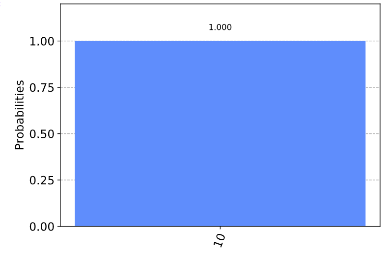

模拟器模拟出了一台*完美*的量子计算机。可以看到没有任何错误发生，测量出100%准确的信息。

### 4. 在真正的量子计算机上超密编码

至此，我们可以在一台真正的量子计算机上查看上述工作的过程。搜先，我们想要加载的帐户获取负载最小的量子系统：

> from qiskit import IBMQ
>
> \#IBMQ.save_account(\'MY_API_TOKEN\')
>
> from qiskit.providers.ibmq import least_busy
>
> shots = 256
>
> \# Load local account information
>
> IBMQ.load_account()
>
> \# Get the least busy backend
>
> provider = IBMQ.get_provider(hub=\'ibm-q\')
>
> backend = least_busy(provider.backends(filters=lambda x:
> x.configuration().n_qubits \>= 2
>
> and not x.configuration().simulator
>
> and x.status().operational==True))
>
> print(\"least busy backend: \", backend)
>
> \# Run our circuit
>
> job = execute(qc, backend=backend, shots=shots)
>
> 输出：
>
> least busy backend: ibmq_burlington
>
> \# Monitoring our job
>
> from qiskit.tools.monitor import job_monitor
>
> job_monitor(job)
>
> 输出：
>
> Job Status: job has successfully run
>
> \# Plotting our result
>
> result = job.result()
>
> plot_histogram(result.get_counts(qc))
>
> 输出：

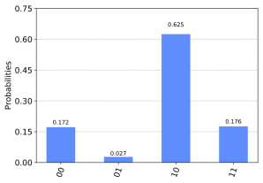

正如上面的输出所示，当在真正的量子计算机上运行时有一些自其他三个状态的结果。导致这些错误的原因是量子门和量子比特发生了退相干（**decoherence**）。我们将在最后的章节中了解这些错误的更多信息。

> correct_results = result.get_counts(qc)\[message\]
>
> accuracy = (correct_results/shots)\*100
>
> print(\"Accuracy = %.2f%%\" % accuracy)
>
> 输出：
>
> Accuracy = 62.50% \#每次运行都不同

3.4 Deutsch-Josza算法
---------------------

在这本节中，我们首先介绍Deutsch-Josza问题，以及解决的经典和量子算法。然后使用Qiskit实现该量子算法，并在模拟器和设备上运行。

### 1. 引言

Deutsch-Josza算法在在参考文献\[1\]中第一次被引入，是第一个比最好的经典算法运行更加的量子算法。其展示了可以利用量子计算机当作处理特定问题的计算工具。

#### 1.1 Deutsch-Josza问题

我们得到了一个隐藏的布尔函数$f$，该函数接收一个经典比特字串作为输入，并返回$0$或$1$。

$$f\left( x_{0},x_{1},x_{2},\ldots \right) \rightarrow 0or1,wherex_{n}is0or1$$

所给布尔函数的性质是保证均衡或常值。一个常值函数对任何输入都返回全$0$或全$1$，一个均衡函数对输入中的一半返回$0$并对输入的另一半返回$1$。我们的任务是确定给定函数是均衡还是常值。

注意！Deutsch-Josza问题是单比特Deutsch问题的$n$比特的扩展。

#### 1.2 经典解法

通常，在最好的情况下两个查询的预言（oracle）就可以确定隐藏的布尔函数$f\left( x \right)$是否是均衡函数：如我们得到$f\left( 0,0,0,\ldots \right) \rightarrow 0$和$f\left( 1,0,0,\ldots \right) \rightarrow 1$，由于获得了两个不同的输出，就知道该函数是均衡函数。

在最糟糕的情况下，如果函数对于所尝试的输入持续给出同一输出，我们需要检查所有可能输入的一半加上1来确定$f\left( x \right)$是常值函数。由于所有可能输入的数量为$2^{n}$，意味在最糟糕的情况下需要$2^{n + 1} + 1$次尝试输入来确定$f\left( x \right)$是常值函数。例如，对于4比特的字串，如果我们检查了16种可能组合中的8种，所有的结果都是$0$，仍然有可能在第9次输入后返回1，则$f\left( x \right)$是均衡函数。从概率上讲，这是一个极其不可能发生的事件。事实上，如果连续地得到相同的结果，当一个函数的$k$次输入后确定其为常值函数的概率可以表示为：

$$P_{\text{constant} }\left( k \right) = 1 - \frac{1}{2^{k - 1} }\ for\ k \leq 2^{n - 1}$$

实际上，我们可以选择提前截断经典算法，假设我们有超过x%的确信。但如果我们想要100%的确信，据需要检查$2^{n + 1}$次输入。

#### 1.3 量子解法

使用量子计算机，只需调用函数$f\left( x \right)$一次，我们就可以100%确信地解决这一问题，假设函数$f$被实现为量子预言，将态$\left| x \right\rangle\left| y \right\rangle$映射为$\left| x \right\rangle\left| y \oplus f\left( x \right) \right\rangle$，其中符号$\oplus$表示以2为模。下图为Deutsch-Josza算法的通用回路。

现在，我们来看看算法的步骤：

1.  准备两个量子寄存器。第一个是一个n-量子比特寄存器初始化为$\left| 0 \right\rangle$，第二个是一个单量比特寄存器初始化$\left| 1 \right\rangle$：

$$\left| \psi_{0} \right\rangle = \left| 0 \right\rangle^{\otimes n}\left| 1 \right\rangle$$

2.  在每个量子比特上应用一个阿达马门：

$$\left| \psi_{1} \right\rangle = \frac{1}{\sqrt{2^{n + 1} } }\sum_{x = 0}^{2^{n} - 1}\left| x \right\rangle(|0\rangle - |1\rangle)$$

3.  应用量子语言，使$\left| x \right\rangle\left| y \right\rangle$变为$\left| x \right\rangle\left| y \oplus f\left( x \right) \right\rangle$，

$${\left| \psi_{2} \right\rangle = \frac{1}{\sqrt{2^{n + 1} } }\sum_{x = 0}^{2^{n} - 1}\left| x \right\rangle(|f(x)\rangle - |1 \oplus f(x)\rangle)
}{\ \ \ \ \ \ \ \ \ \  = \frac{1}{\sqrt{2^{n + 1} } }\sum_{x = 0}^{2^{n} - 1}{\left( - 1 \right)^{f\left( x \right)}\left| x \right\rangle}(|0\rangle - |1\rangle)}$$

对于每个$x$，$f\left( x \right)$不是$0$就是$1$。

4.  此时，第二个单量子比特寄存器可能被忽略。对第一个寄存器的每个量子比特应用阿达马门：
$$ {\left| \psi_{3} \right\rangle = \frac{1}{2^{n} }\sum_{x = 0}^{2^{n} - 1}{\left( - 1 \right)^{f\left( x \right)}\left\lbrack \sum_{x = 0}^{2^{n} - 1}{\left( - 1 \right)^{x \bullet y}\left| y \right\rangle} \right\rbrack}
}{\ \ \ \ \ \ \ \ \ \  = \frac{1}{2^{n} }\sum_{x = 0}^{2^{n} - 1}\left\lbrack \sum_{x = 0}^{2^{n} - 1}{\left( - 1 \right)^{f\left( x \right)}\left( - 1 \right)}^{x \bullet y} \right\rbrack\left| y \right\rangle
}$$

5.  测量第一个寄存器。可以看出测量的概率为$\left| 0 \right\rangle^{\otimes n} = \left| \frac{1}{2^{n} }\sum_{x = 0}^{2^{n} - 1}\left( - 1 \right)^{f\left( x \right)} \right|^{2}$，当$f\left( x \right)$为是常值函数时为$1$，$f\left( x \right)$为是均衡函数时为$0$。

#### 1.4 为何要进行这一工作？

##### 常值预言

当预言为常值（*constant*）时，不会在输入量子比特上造成影响（一直到一个全局相位），且无论在查询预言的前后量子态都相同。由于H-gate是其自身的逆，在步骤4中我们通过反转步骤2来获取第一个寄存器中$\left| 00\ldots 0 \right\rangle$的初始量子态。

$$H^{\otimes n}\begin{bmatrix}
1 \\
0 \\
0 \\
 \vdots \\
0 \\
\end{bmatrix} = \frac{1}{\sqrt{2^{n} } }\begin{bmatrix}
1 \\
1 \\
1 \\
 \vdots \\
1 \\
\end{bmatrix}\overset{\text{after\ \ \ }U_{f} }{\rightarrow}H^{\otimes n}\frac{1}{\sqrt{2^{n} } }\begin{bmatrix}
1 \\
1 \\
1 \\
 \vdots \\
1 \\
\end{bmatrix} = \begin{bmatrix}
1 \\
0 \\
0 \\
 \vdots \\
0 \\
\end{bmatrix}$$

##### 均衡预言

在步骤2之后，我们的输入寄存器是计算基上所有状态的相等叠加。当预言为均衡（*balanced*）时，相位反冲会在这些状态中半上添加一个负相位。

$$U_{f}\frac{1}{\sqrt{2^{n} } }\begin{bmatrix}
1 \\
1 \\
1 \\
 \vdots \\
1 \\
\end{bmatrix} = \frac{1}{\sqrt{2^{n} } }\begin{bmatrix}
 - 1 \\
1 \\
 - 1 \\
 \vdots \\
1 \\
\end{bmatrix}$$

查询预言之后的量子态与查询预言之前的量子态正交。因此在步骤4中，当应用H-gate后，必以正交于$\left| 00\cdots 0 \right\rangle$的量子态结束。这表明我们绝不会测量到全零的状态。

### 2. 有效示例

现在让我们了解一个双比特均衡函数的特定示例，其中将会在两个比特上均应用X-gate。

1.  在第一个寄存器中的两个量子比特均初始化为$\left| 00 \right\rangle$，第二个寄存器中的另一个量子比特初始化为$\left| 1 \right\rangle$

$$\left| \psi_{0} \right\rangle = \left| 00 \right\rangle_{1}\left| 1 \right\rangle_{2}$$

2.  对所有量子比特应用阿达马门

$$\left| \psi_{1} \right\rangle = \frac{1}{2}\left( \left| 00 \right\rangle_{1} + \left| 01 \right\rangle_{1} + \left| 10 \right\rangle_{1} + \left| 11 \right\rangle_{1} \right)\frac{1}{\sqrt{2} }\left( \left| 0 \right\rangle_{2} - \left| 1 \right\rangle_{2} \right)$$

3.  预言方程可实现为$Q_{f} = \text{CX}_{1a}\text{CX}_{2a}$

$${|\psi_{2}\rangle = \frac{1}{2\sqrt{2} }\lbrack\left| 00 \right\rangle_{1}\left( \left| 0\bigoplus_{}^{}{0\bigoplus_{}^{}0} \right\rangle_{2} - \left| 1\bigoplus_{}^{}{0\bigoplus_{}^{}0} \right\rangle_{2} \right)
}{\ \ \ \ \ \ \ \ \ \ \ \ \ \ \ \ \ \ \ \ \  + \left| 01 \right\rangle_{1}\left( \left| 0\bigoplus 0\bigoplus 1 \right\rangle_{2} - \left| 1\bigoplus 0\bigoplus 1 \right\rangle_{2} \right)}$$

$$\ \ \ \ \ \ \ \ \ \ \ \ \ \ \ \ \ \ \ \ \  + \left| 10 \right\rangle_{1}\left( \left| 0\bigoplus_{}^{}{1\bigoplus_{}^{}0} \right\rangle_{2} - \left| 1\bigoplus_{}^{}{1\bigoplus_{}^{}0} \right\rangle_{2} \right)$$

$$\ \ \ \ \ \ \ \ \ \ \ \ \ \ \ \ \ \ \ \ \ \ \  + \left| 11 \right\rangle_{1}\left( \left| 0\bigoplus_{}^{}{1\bigoplus_{}^{}1} \right\rangle_{2} - \left| 1\bigoplus_{}^{}{1\bigoplus_{}^{}1} \right\rangle_{2} \right)\rbrack$$

4.  因此

$$\left| \psi_{2} \right\rangle = \frac{1}{2\sqrt{2} }\left\lbrack \left| 00 \right\rangle_{1}\left( \left| 0 \right\rangle_{2} - \left| 1 \right\rangle_{2} \right) - \left| 01 \right\rangle_{1}\left( \left| 0 \right\rangle_{2} - \left| 1 \right\rangle_{2} \right) - \left| 10 \right\rangle_{1}\left( \left| 0 \right\rangle_{2} - \left| 1 \right\rangle_{2} \right) + \left| 11 \right\rangle_{1}\left( \left| 0 \right\rangle_{2} - \left| 1 \right\rangle_{2} \right) \right\rbrack$$

$$= \frac{1}{2}\left( \left| 00 \right\rangle_{1} - \left| 01 \right\rangle_{1} - \left| 10 \right\rangle_{1} + \left| 11 \right\rangle_{1} \right)\frac{1}{\sqrt{2} }\left( \left| 0 \right\rangle_{2} - \left| 1 \right\rangle_{2} \right)$$

$$= \frac{1}{\sqrt{2} }\left( \left| 0 \right\rangle_{10} - \left| 1 \right\rangle_{10} \right)\frac{1}{\sqrt{2} }\left( \left| 0 \right\rangle_{11} - \left| 1 \right\rangle_{11} \right)\frac{1}{\sqrt{2} }\left( \left| 0 \right\rangle_{2} - \left| 1 \right\rangle_{2} \right)$$

5.  在第一个寄存器上应用阿达马门

$$\left| \psi_{3} \right\rangle = \left| 1 \right\rangle_{10}\left| 1 \right\rangle_{11}\left( \left| 0 \right\rangle_{2} - \left| 1 \right\rangle_{2} \right)$$

6.  对开始的两个量子比特测量会给出非零$11$，表明是一个均衡函数。

您可以使用下面的小部件尝试类似的示例。点击按钮添加H-gate和预言，重新运行单元和或设置case=\"constant\"来尝试不同的预言。

> from qiskit_textbook.widgets import dj_widget
>
> dj_widget(size=\"small\", case=\"balanced\")

输出：

### 3. 创建量子预言

让我们看一看创建量子预言的几种不同方法。

对于常值函数，很简单：

1.  如果f(x)=0，则在寄存器2中对量子比特应用I-gate。

2.  如果f(x)=1，则在寄存器2中对量子比特应用H-gate。

对于均衡函数，可以创建许多不同的回路。可以保证均衡回路的一种方式是对寄存器1中的每个量子比特执行CNOT，并把寄存器2中的量子比特作为目标端。

在上面的图片中，上三个量子比特形成输入寄存器，最底下的一个量子比特是输出寄存器。我们可以在下表中查看每一状态所给出的相应输出：

  **States that output 0**   **States that output 1**
-------------------------- --------------------------
  000                        001
  011                        100
  101                        010
  110                        111

我们可以通过将选定的控制端包入一个X-gate中来更改结果，同时保持结果平衡。例如，请参见下面的电路及其结果表：

  **States that output 0**   **States that output 1**
-------------------------- --------------------------
  001                        000
  010                        011
  100                        101
  111                        110

### 4. 在Qiskit中实现

现在，我们用常值和均衡预言的三比特函数为示例实现Deutsch-Josza算法。首先在Python中导入相应的库：

> \# initialization
>
> import numpy as np
>
> \# importing Qiskit
>
> from qiskit import IBMQ, BasicAer
>
> from qiskit.providers.ibmq import least_busy
>
> from qiskit import QuantumCircuit, execute
>
> \# import basic plot tools
>
> from qiskit.visualization import plot_histogram

接着为预言设置输入寄存器的大小：

> \# set the length of the n-bit input string.
>
> n = 3

#### 4.1 常值预言

我们从创建一个常值预言开始，在这种情况下输入对输出没有影响，因此只是将输出量子比特随机设置为0或1：

> \# set the length of the n-bit input string.
>
> n = 3
>
> const_oracle = QuantumCircuit(n+1)
>
> output = np.random.randint(2)
>
> if output == 1:
>
> const_oracle.x(n)
>
> const_oracle.draw()
>
> 输出：

#### 4.2 均衡预言

balanced_oracle = QuantumCircuit(n+1)

接着创建一个均衡预言。正如在本章的1b节中所见，我们可以通过执行多个CNOT来创建均衡预言，其中每一个输入端量子比特为控制端，而输出端量子比特为目标端。我们可以通过将某些控制端装入X-gate来给予输入状态0或1。首先选择一个长度为n的二进制字串，该字串用于指明要包入的控件：

b_str = \"101\"

至此我们有了这样的一个字串，就可以将该字串当作放置X-gate的钥匙。对于在回路中的每个量子比特，如果b_str中相对应的数位（digit）是1，则在该数位对应的量子比特处放置一个X-gate。

接着我们使用输入端的每个量子比特作为控制端，依次应用受控非门，所有CNOT的目标端是输出端的量子比特：

> balanced_oracle = QuantumCircuit(n+1)
>
> b_str = \"101\"
>
> \# Place X-gates
>
> for qubit in range(len(b_str)):
>
> if b_str\[qubit\] == \'1\':
>
> balanced_oracle.x(qubit)
>
> balanced_oracle.draw()
>
> 输出：

> balanced_oracle = QuantumCircuit(n+1)
>
> b_str = \"101\"
>
> \# Place X-gates
>
> for qubit in range(len(b_str)):
>
> if b_str\[qubit\] == \'1\':
>
> balanced_oracle.x(qubit)
>
> \# Use barrier as divider
>
> balanced_oracle.barrier()
>
> \# Controlled-NOT gates
>
> for qubit in range(n):
>
> balanced_oracle.cx(qubit, n)
>
> balanced_oracle.barrier()
>
> balanced_oracle.draw()
>
> 输出：

最后，重复两个单元中的代码完成在控制端装入X-gate：

> balanced_oracle = QuantumCircuit(n+1)
>
> b_str = \"101\"
>
> \# Place X-gates
>
> for qubit in range(len(b_str)):
>
> if b_str\[qubit\] == \'1\':
>
> balanced_oracle.x(qubit)
>
> \# Use barrier as divider
>
> balanced_oracle.barrier()
>
> \# Controlled-NOT gates
>
> for qubit in range(n):
>
> balanced_oracle.cx(qubit, n)
>
> balanced_oracle.barrier()
>
> \# Place X-gates
>
> for qubit in range(len(b_str)):
>
> if b_str\[qubit\] == \'1\':
>
> balanced_oracle.x(qubit)
>
> \# Show oracle
>
> balanced_oracle.draw()
>
> 输出：

我们刚刚创建了一个均衡预言！剩下要做的事情就是看Deutsch-Joza算法是否可以将其解出。

#### 4.3 完整的算法

现在我们将所有的东西放在一起。算法中的第一部将回路的输入端和输出端量子比特分别初始化为态$\left| + \right\rangle$和态$\left| - \right\rangle$。

> dj_circuit = QuantumCircuit(n+1, n)
>
> \# Apply H-gates
>
> for qubit in range(n):
>
> dj_circuit.h(qubit)
>
> \# Put qubit in state \|-\>
>
> dj_circuit.x(n)
>
> dj_circuit.h(n)
>
> dj_circuit.draw()
>
> 输出：

下一步就是应用预言，此处我们应用之前创建的balanced_oracle：

> dj_circuit = QuantumCircuit(n+1, n)
>
> \# Apply H-gates
>
> for qubit in range(n):
>
> dj_circuit.h(qubit)
>
> \# Put qubit in state \|-\>
>
> dj_circuit.x(n)
>
> dj_circuit.h(n)
>
> \# Add oracle
>
> dj_circuit += balanced_oracle
>
> dj_circuit.draw()
>
> 输出：

最后，在n量子比特的输入端执行H-gate，然后测量输入寄存器：

> dj_circuit = QuantumCircuit(n+1, n)
>
> \# Apply H-gates
>
> for qubit in range(n):
>
> dj_circuit.h(qubit)
>
> \# Put qubit in state \|-\>
>
> dj_circuit.x(n)
>
> dj_circuit.h(n)
>
> \# Add oracle
>
> dj_circuit += balanced_oracle
>
> \# Repeat H-gates
>
> for qubit in range(n):
>
> dj_circuit.h(qubit)
>
> dj_circuit.barrier()
>
> \# Measure
>
> for i in range(n):
>
> dj_circuit.measure(i, i)
>
> \# Display circuit
>
> dj_circuit.draw()
>
> 输出：

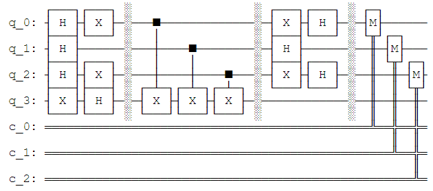

看一看输入如何：

> \# use local simulator
>
> backend = BasicAer.get_backend(\'qasm_simulator\')
>
> shots = 1024
>
> results = execute(dj_circuit, backend=backend, shots=shots).result()
>
> answer = results.get_counts()
>
> plot_histogram(answer)
>
> 输出：

从上面的结果可以看出，测量出$000$的概率是0％，正确地预测了函数是均衡函数。

#### 4.4 通用量子回路

在下面的代码中给出了一个通用函数，该函数用于创建Deutsch-Joza预言并将其转换为量子门。其接收"balanced"或"constant"以及输入寄存器的大小n作为参数：

> def dj_oracle(case, n):
>
> \# We need to make a QuantumCircuit object to return
>
> \# This circuit has n+1 qubits: the size of the input,
>
> \# plus one output qubit
>
> oracle_qc = QuantumCircuit(n+1)
>
> \# First, let\'s deal with the case in which oracle is balanced
>
> if case == \"balanced\":
>
> \# First generate a random number that tells us which CNOTs to
>
> \# wrap in X-gates:
>
> b = np.random.randint(1,2\*\*n)
>
> \# Next, format \'b\' as a binary string of length \'n\', padded with
> zeros:
>
> b_str = format(b, \'0\'+str(n)+\'b\')
>
> \# Next, we place the first X-gates. Each digit in our binary string
>
> \# corresponds to a qubit, if the digit is 0, we do nothing, if it\'s
> 1
>
> \# we apply an X-gate to that qubit:
>
> for qubit in range(len(b_str)):
>
> if b_str\[qubit\] == \'1\':
>
> oracle_qc.x(qubit)
>
> \# Do the controlled-NOT gates for each qubit, using the output qubit
>
> \# as the target:
>
> for qubit in range(n):
>
> oracle_qc.cx(qubit, n)
>
> \# Next, place the final X-gates
>
> for qubit in range(len(b_str)):
>
> if b_str\[qubit\] == \'1\':
>
> oracle_qc.x(qubit)
>
> \# Case in which oracle is constant
>
> if case == \"constant\":
>
> \# First decide what the fixed output of the oracle will be
>
> \# (either always 0 or always 1)
>
> output = np.random.randint(2)
>
> if output == 1:
>
> oracle_qc.x(n)
>
> oracle_gate = oracle_qc.to_gate()
>
> oracle_gate.name = \"Oracle\" \# To show when we display the circuit
>
> return oracle_gate

我们还可以创建一个函数接收该预言量子门并在其上执行Deutsch-Joza算法：

> def dj_algorithm(oracle, n):
>
> dj_circuit = QuantumCircuit(n+1, n)
>
> \# Set up the output qubit:
>
> dj_circuit.x(n)
>
> dj_circuit.h(n)
>
> \# And set up the input register:
>
> for qubit in range(n):
>
> dj_circuit.h(qubit)
>
> \# Let\'s append the oracle gate to our circuit:
>
> dj_circuit.append(oracle, range(n+1))
>
> \# Finally, perform the H-gates again and measure:
>
> for qubit in range(n):
>
> dj_circuit.h(qubit)
>
> for i in range(n):
>
> dj_circuit.measure(i, i)
>
> return dj_circuit

最后通过这些函数把玩以下Deutsch-Joza算法：

> n = 4
>
> oracle_gate = dj_oracle(\'balanced\', n)
>
> dj_circuit = dj_algorithm(oracle_gate, n)
>
> dj_circuit.draw()
>
> 输出：

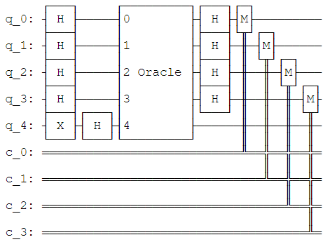

看一下这一回路的运行结果：

> results = execute(dj_circuit, backend=backend, shots=1024).result()
>
> answer = results.get_counts()
>
> plot_histogram(answer)
>
> 输出：

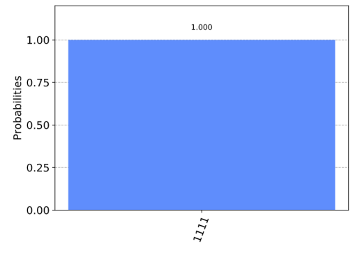

### 5. 体现真实的设备

我们可以在真实设备上运行这个回路，如下所示。当然，首先寻找可以处理该回路负载最轻的设备。

> \# Load our saved IBMQ accounts and get the least busy backend device
> with greater than or equal to (n+1) qubits
>
> IBMQ.load_account()
>
> provider = IBMQ.get_provider(hub=\'ibm-q\')
>
> backend = least_busy(provider.backends(filters=lambda x:
> x.configuration().n_qubits \>= (n+1) and
>
> not x.configuration().simulator and x.status().operational==True))
>
> print(\"least busy backend: \", backend)
>
> 输出：
>
> least busy backend: ibmq_london
>
> \# Run our circuit on the least busy backend. Monitor the execution of
> the job in the queue
>
> from qiskit.tools.monitor import job_monitor
>
> shots = 1024
>
> job = execute(dj_circuit, backend=backend, shots=shots,
> optimization_level=3)
>
> job_monitor(job, interval = 2)
>
> 输出：
>
> Job Status: job has successfully run
>
> \# Get the results of the computation
>
> results = job.result()
>
> answer = results.get_counts()
>
> plot_histogram(answer)
>
> 输出：

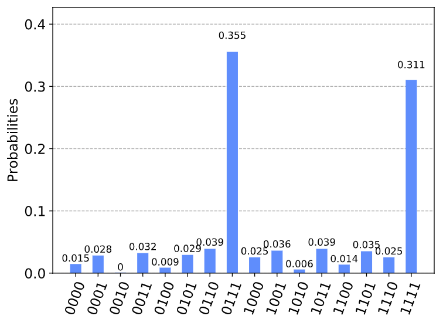

正如输出的柱状图所示，最有可能结果是0111和1111。其他结果是由量子计算中的误差造成的。

### 6. 问题

1\. 您是否能够创造一个均衡或常值的不同形式预言？

> from qiskit_textbook.problems import dj_problem_oracle
>
> oracle = dj_problem_oracle(1)

函数dj_problem_oracle（如上所示）以量子门的形式返回一个Deutsch-Joza预言，其中最终的量子比特是输出端量子比特（与上面的例子一样）。您可以通过给函数dj_problem_oracle
1到5之间不同的整数来得到不同预言。使用Deutsch-Joza算法来决定每个预言是均衡还是常值（**注意**：强烈建议您使用qasm_simulator而不是真正的设备来尝试这一示例）。

### 7. 参考文献

1\. David Deutsch and Richard Jozsa (1992). \"Rapid solutions of
problems by quantum computation\". Proceedings of the Royal Society of
London A. 439: 553--558.
[doi:10.1098/rspa.1992.0167](https://doi.org/10.1098%2Frspa.1992.0167).

2\. R. Cleve; A. Ekert; C. Macchiavello; M. Mosca (1998). \"Quantum
algorithms revisited\". Proceedings of the Royal Society of London A.
454: 339--354.
[doi:10.1098/rspa.1998.0164](https://doi.org/10.1098%2Frspa.1998.0164).

3.5 Bernstein-Vazirani 算法
---------------------------

本节中首先介绍Bernstein-Vazirani问题，及其经典解和用于处理的量子算法。然后使用Qiskit实现量子算法，并在模拟器和设备上运行。

### 内容

1\. Bernstein-Vazirani算法

1.1 Bernstein-Vazirani问题

1.2 经典解法

1.3 量子解法

2\. 示例

3\. Qiskit实现

3.1 模拟器

3.2 真实设备

4\. 练习

5\. 参考文献

### 1. Bernstein-Vazirani算法

Bernstein-Vazirani在参考文献\[1\]中第一次被引入，可被看作是上一节中Deutsch-Josza的扩展。该算法揭示了通过将量子计算机作为一个计算工具能够处理比Deutsch-Joszawen问题更加复杂的问题。

#### 1.1 Bernstein-Vazirani问题

我们还是给出一个黑箱函数$f$，该函数接受一串比特（$x$）作为输入，并返回$0$或$1$：

$$f\left( x0,x1,x2,\ldots \right) \rightarrow 0\ or\ 1\ where\ x_{n}\ is\ 0\ or\ 1$$

与Deutsch-Josza问题中的均衡或常值函数不同，上述函数返回输入与字串$s$的位积。换句话说，给定一个输入$x$，$f\left( x \right) = s \cdot x\left( mod2 \right)$。我们想要找出字串$s$。作为经典可逆电路，Bernstein-Vazirani预言看起来像：

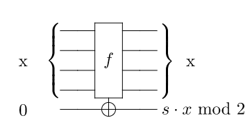

#### 1.2 经典解法

通常来讲，这一预言在给定输入$x$时应返回：

$$f_{s}\left( x \right) = s \cdot x\ mod\ 2$$

因此，通过一系列的输入查询预言，可以找出隐藏的比特串$s$：

  **Input(x)**
  --------------
  100\...0
  010\...0
  001\...0
  000\...1

当然不同的查询揭示不同的$s$（$s_{i}$）。比如，用x =
1000...0可以获取$s$的最低有效位，用x =
0100...0可以获取下一个最低有效位，等等。这一过程表明我们需要调用函数$f_{s}\left( x \right)$
$n$次。

#### 1.3 量子解法

通过阿哥量子计算机，我们可以仅调用函数$f_{s}\left( x \right)$一次就能在100%确信的情况解决该问题。量子Bernstein-Vazirani算法找出隐藏比特字串的方式非常简单：

1.  初始化输入端量子比特为态$\left| 0 \right\rangle^{\otimes n}$，输出端量子比特为态$\left| - \right\rangle$。

2.  在输入寄存器上应用阿达马门。

3.  查询预言。

4.  在输入寄存器上应用阿达马门。

5.  测量

为了解释该算法，让我们更仔细地看看当对每个量子比特应用H-gate时会发生什么。如果有一个$n$-量子比特处于态$\left| a \right\rangle$并应用H-gate，将会看到如下变化式：

$$\left| a \right\rangle\overset{H^{\otimes n} }{\rightarrow}\frac{1}{\sqrt{2^{n} } }\sum_{x \in {0,1}^{n} }^{}{\left( - 1 \right)^{a \bullet x}\left| x \right\rangle}$$

**等式注解**

回想一下阿达马门在一个量子比特上执行以下转换：

$$H\left| b \right\rangle = \frac{1}{\sqrt{2} }(\left| 0 \right\rangle + \left| 1 \right\rangle)$$

$$H\left| 1 \right\rangle = \frac{1}{\sqrt{2} }(\left| 0 \right\rangle - \left| 1 \right\rangle)$$

使用求和符号，我们可以将其改写为：

$$
H\left| a \right\rangle = \sum_{a \in \{ 0,1\} }^{}{ {(-1)}^{a \bullet x}|x\rangle }
$$

对于两个量子比特，对每个量子比应用阿达马门执行一下转换：

$$H^{\otimes 2}\left| 00 \right\rangle = \left| 00 \right\rangle + \left| 01 \right\rangle + \left| 10 \right\rangle + \left| 11 \right\rangle$$

$$H^{\otimes 2}\left| 01 \right\rangle = \left| 00 \right\rangle - \left| 01 \right\rangle + \left| 10 \right\rangle - \left| 11 \right\rangle$$

$$H^{\otimes 2}\left| 10 \right\rangle = \left| 00 \right\rangle + \left| 01 \right\rangle - \left| 10 \right\rangle - \left| 11 \right\rangle$$

$$H^{\otimes 2}\left| 11 \right\rangle = \left| 00 \right\rangle - \left| 01 \right\rangle - \left| 10 \right\rangle + \left| 11 \right\rangle$$

我们可以用和来表示:

$$H^{\otimes 2}\left| 11 \right\rangle = \sum_{x \in {\{ 0,1\} }^{2} }^{}{( - 1)}^{a \bullet x}|x\rangle$$

希望您现在能看到得到上面等式的过程。

特别是，当我们以量子寄存器为态$\left| 00\ldots 0 \right\rangle$开始并应用$n$个阿达马门后，就获得了熟悉的量子叠加态：

$$\left| 00\ldots 0 \right\rangle\overset{H^{\otimes n} }{\rightarrow}\frac{1}{\sqrt{2^{n} } }\sum_{x \in {0,1}^{n} }^{}\left| x \right\rangle$$

在这一情况下，相位项$\left( - 1 \right)^{a \bullet x}$消失了，因为$a = 0$所以$\left( - 1 \right)^{a \bullet x} = 1$。

经典预言$f_{s}$对于任意输入$x$都返回$1$，使得$s \bullet x\ mod\ 2 = 1$，其他情况则返回$0$。如果使用Deutsch-Joza算法中同样的相位反冲技巧并将其作用在处于态$\left| - \right\rangle$的一个量子比特，我们会获得下述变化式：

$$\left| x \right\rangle\overset{f_{s} }{\rightarrow}\left( - 1 \right)^{s \bullet x}\left| x \right\rangle$$

用于揭露隐藏比特字串的算法采用通过查询量子预言$f_{s}$的量子叠加态从阿达马变换获得$\left| 00\ldots 0 \right\rangle$。也就是说，

$$\left| 00\ldots 0 \right\rangle\overset{H^{\otimes n} }{\rightarrow}\frac{1}{\sqrt{2^{n} } }\sum_{x \in {0,1}^{n} }^{}\left| x \right\rangle\overset{f_{n} }{\rightarrow}\frac{1}{\sqrt{2^{n} } }\sum_{x \in {0,1}^{n} }^{}\left( - 1 \right)^{a \bullet x}\left| x \right\rangle$$

因为$n$个H-gate的逆仍是$n$个H-gate，我们可以通过下式获取$a$：

$$\frac{1}{\sqrt{2^{n} } }\sum_{x \in {0,1}^{n} }^{}\left( - 1 \right)^{a \bullet x}\left| a \right\rangle\overset{H^{\otimes n} }{\rightarrow}\left| a \right\rangle$$

### 2. 示例

现在让我们仔细检查$n = 2$个量子比特与秘密字串$s = 11$的特定示例。注意我们正在使用参考文献\[2\]的公式在生成Bernstein-Vazirani量子预言回路时只使用一个寄存器。

1\. 两个量子比特寄存器初始化为0：

$$\left| \psi_{0} \right\rangle = \left| 00 \right\rangle$$

2\. 在两个量子比特上分别应用H-gate：

$$\left| \psi_{1} \right\rangle = \frac{1}{2}(|00\rangle + |01\rangle + |10\rangle + |11\rangle)$$

3\. 对于字串$s = 11$，量子预言执行以下操作：

$${\left| x \right\rangle\overset{f_{s} }{\rightarrow}\left( - 1 \right)^{x \bullet 11}\left| x \right\rangle
}{\left| \psi_{2} \right\rangle = \frac{1}{2}(\left( - 1 \right)^{00 \bullet 11}|00\rangle + \left( - 1 \right)^{01 \bullet 11}|01\rangle + \left( - 1 \right)^{10 \bullet 11}|10\rangle + \left( - 1 \right)^{11 \bullet 11}|11\rangle)
}{\left| \psi_{2} \right\rangle = \frac{1}{2}(|00\rangle - |01\rangle - |10\rangle + |11\rangle)}$$

4\. 在两个量子比特上分别应用H-gate：

$$\left| \psi_{3} \right\rangle = \left| 11 \right\rangle$$

5\. 测量并找出秘密字串$s = 11$：

使用下面的小部件bv_widget。点击按钮应用不同的步骤，并尝试跟随算法步骤。您可以通过前两个位置参数更改输入量子比特的数量和秘密字串的值。

> from qiskit_textbook.widgets import bv_widget
>
> bv_widget(2, \"11\")

### 3. Qiskit实现

现在我们将通过一个三比特的函数$s = 011$在Qiskit中遍历Bernstein-Vazirani算法的实现过程。

> \# initialization
>
> import matplotlib.pyplot as plt
>
> import numpy as np
>
> \# importing Qiskit
>
> from qiskit import IBMQ, BasicAer
>
> from qiskit.providers.ibmq import least_busy
>
> from qiskit import QuantumCircuit, ClassicalRegister, QuantumRegister,
> execute
>
> \# import basic plot tools
>
> from qiskit.visualization import plot_histogram

首先，我们设置实验中使用的量子比特数量，以及将要通过算法找出的隐藏比特字串。该隐藏比特字串$s$用于确定量子预言的回路。

> n = 3 \# number of qubits used to represent s
>
> s = \'011\' \# the hidden binary string

然后在Qiskit中编写Bernstein-Vazirani算法。

> \# We need a circuit with n qubits, plus one ancilla qubit
>
> \# Also need n classical bits to write the output to
>
> bv_circuit = QuantumCircuit(n+1, n)
>
> \# put ancilla in state \|-\>
>
> bv_circuit.h(n)
>
> bv_circuit.z(n)
>
> \# Apply Hadamard gates before querying the oracle
>
> for i in range(n):
>
> bv_circuit.h(i)
>
> \# Apply barrier
>
> bv_circuit.barrier()
>
> \# Apply the inner-product oracle
>
> s = s\[::-1\] \# reverse s to fit qiskit\'s qubit ordering
>
> for q in range(n):
>
> if s\[q\] == \'0\':
>
> bv_circuit.i(q)
>
> else:
>
> bv_circuit.cx(q, n)
>
> \# Apply barrier
>
> bv_circuit.barrier()
>
> \#Apply Hadamard gates after querying the oracle
>
> for i in range(n):
>
> bv_circuit.h(i)
>
> \# Measurement
>
> for i in range(n):
>
> bv_circuit.measure(i, i)
>
> bv_circuit.draw()

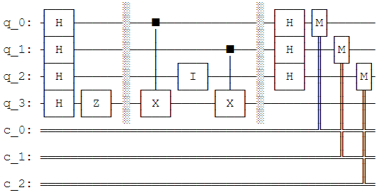

#### 3.1 使用模拟器进行试验

我们可以在模拟器上运行上面的回路：

> \# use local simulator
>
> backend = BasicAer.get_backend(\'qasm_simulator\')
>
> shots = 1024
>
> results = execute(bv_circuit, backend=backend, shots=shots).result()
>
> answer = results.get_counts()
>
> plot_histogram(answer)
>
> 输出：

从输出中可以看到测量结果就是隐藏字串$011$。

#### 3.2 在真实的量子设备上进行实验

我们可以在真实的量子设备上运行上面的回路：

> \# Load our saved IBMQ accounts and get the least busy backend device
> with less than or equal to 5 qubits
>
> IBMQ.load_account()
>
> provider = IBMQ.get_provider(hub=\'ibm-q\')
>
> provider.backends()
>
> backend = least_busy(provider.backends(filters=lambda x:
> x.configuration().n_qubits \<= 5 and x.configuration().n_qubits \>= 2
> and not x.configuration().simulator and x.status().operational==True))
>
> print(\"least busy backend: \", backend)
>
> 输出：
>
> least busy backend: ibmqx2
>
> \# Run our circuit on the least busy backend. Monitor the execution of
> the job in the queue
>
> from qiskit.tools.monitor import job_monitor
>
> shots = 1024
>
> job = execute(bv_circuit, backend=backend, shots=shots)
>
> job_monitor(job, interval = 2)
>
> 输出：
>
> Job Status: job has successfully run
>
> \# Get the results from the computation
>
> results = job.result()
>
> answer = results.get_counts()
>
> plot_histogram(answer)
>
> 输出：

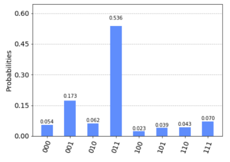

正如输出所示，结果中最有可能的是$011$。其他结果是因量子计算中的错误产生。

### 4. 练习

> from qiskit_textbook.widgets import bv_widget
>
> bv_widget(3, \"011\", hide_oracle=False)

使用下面的小部件查看Bernstein-Vazirani算法在不同预言上的作用情况：

1\.
在上述[Bernstein-Vazirani的实现](https://qiskit.org/textbook/ch-algorithms/bernstein-vazirani.html#implementation)中秘密比特字串为$s = 11$，将其修改为$s = 1011$。运行结果与所期望的相同吗？解释一下。

2\.
在上述[Bernstein-Vazirani的实现](https://qiskit.org/textbook/ch-algorithms/bernstein-vazirani.html#implementation)中秘密比特字串为$s = 11$，将其修改为$s = 11101101$。运行结果与所期望的相同吗？解释一下。

### 5. 参考文献

1\. Ethan Bernstein and Umesh Vazirani (1997) \"Quantum Complexity
Theory\" SIAM Journal on Computing, Vol. 26, No. 5: 1411-1473,
[doi:10.1137/S0097539796300921](https://doi.org/10.1137/S0097539796300921).

2\. Jiangfeng Du, Mingjun Shi, Jihui Wu, Xianyi Zhou, Yangmei Fan,
BangJiao Ye, Rongdian Han (2001) \"Implementation of a quantum algorithm
to solve the Bernstein-Vazirani parity problem without entanglement on
an ensemble quantum computer\", Phys. Rev. A 64, 042306,
[10.1103/PhysRevA.64.042306](https://doi.org/10.1103/PhysRevA.64.042306),
[arXiv:quant-ph/0012114](https://arxiv.org/abs/quant-ph/0012114).

> import qiskit
>
> qiskit.\_\_qiskit_version\_\_
>
> {\'qiskit-terra\': \'0.14.2\',
>
> \'qiskit-aer\': \'0.5.2\',
>
> \'qiskit-ignis\': \'0.3.3\',
>
> \'qiskit-ibmq-provider\': \'0.7.2\',
>
> \'qiskit-aqua\': \'0.7.3\',
>
> \'qiskit\': \'0.19.6\'}

3.6 Simon算法（Simon\'s Algorithm）
-----------------------------------

在本节中，我们首先介绍Simon问题，及其经典与量子算法解。然后在Qiskit中实现该量子算法，并在模拟器和真实设备上运行。

### 内容

1\. 简介

1.1 Simon问题

1.2 Simon算法

2\. 示例

3\. Qiskit实现

3.1 模拟器

3.2 真实设备

4\. 预言

5\. 练习

6\. 参考文献

### 1. 简介

Simon算法在参考文献\[1\]中第一次被引入，其为相对于最好的经典算法在解决特定问题时采用指数倍加速的第一个量子算法。这一算法启发了离散傅里叶变换的量子算法（也被称为量子傅里叶变换），其被用于最著名的量子算法：Shor\'s
factoring algorithm。

#### 1.1 Simon问题

给出一个未知黑箱函数$f$，该函数保证一对一或二对一，其中一对一和二对一具备以下属性：

-   一对一：为每个输入映射唯一输出，如$f\left( 1 \right) \rightarrow 1$、$f\left( 2 \right) \rightarrow 2$、$f\left( 3 \right) \rightarrow 3$和$f\left( 4 \right) \rightarrow 4$。

-   二对一：将两个输入映射唯一输出，如依据隐藏比特字串$s$，$f\left( 1 \right) \rightarrow 1$、$f\left( 2 \right) \rightarrow 2$、$f\left( 3 \right) \rightarrow 1$和$f\left( 4 \right) \rightarrow 2$。其中：

$${\text{given\ }x_{1},x_{2}:f\left( x_{1} \right) = f\left( x_{2} \right)
}{it\ is\ guaranteed\ :x_{1} \oplus x_{2} = b}$$

因此所给出的函数$f$是黑箱函数，我们如何快速确定函数$f$是一对一还是二对一？如果函数$f$是而二对一，则如何快速确定隐藏比特字串$b$？事实证明，这两种情况可归结为同样的问题------找出$s$，其中比特字串$b = 000\ldots$表示一对一$f$。

#### 1.2 Simon算法

##### 经典解法

通常，如果想要100%确定给定函数$f$的字串$b$，我们需要检查$2^{N + 1} + 1$个输入，其中$N$是输入中比特的数量，表明需要检查所有可能输入的一半以上直到找出两个输入产生同一输出。这一点与Deutsch-Jozsa问题非常像，如果幸运的话，我们可以在尝试的前两次就能解决这以问题。但是如果正好函数$f$是一对一，或者非常不幸的获得了二对一的$f$，那么就只能对其$2^{N + 1} + 1$次的输入检查。有一些已知的算法拥有$\Omega\left( 2^{N\text{/2} } \right)$的下界（见参考文献\[2\]），但一般来说复杂度随着N呈指数增长。

##### 量子解法

如下是用量子回路实现Simon算法：

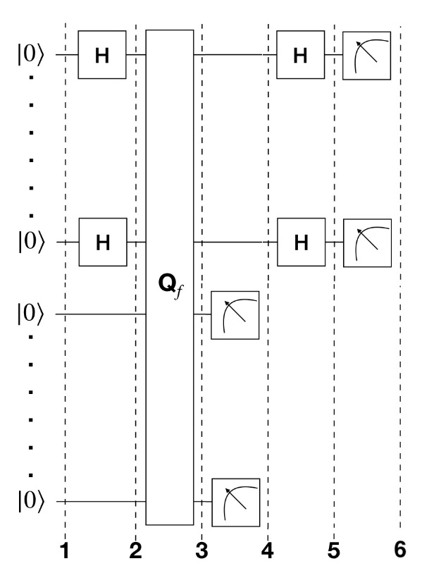

其中查询函数$Q_{f}$作用于两个量子寄存器：

$$\left| x \right\rangle\left| a \right\rangle \rightarrow \left| x \right\rangle\left| a \oplus f\left( x \right) \right\rangle$$

在特定的情况下,如第二寄存器处于态$|0\rangle = |00\ldots 0\rangle$：

$$\left| x \right\rangle\left| 0 \right\rangle \rightarrow \left| x \right\rangle\left| f\left( x \right) \right\rangle$$

该算法涉及以下步骤：

1\. 两个$n$-量子比特寄存器初始化为0状态：

$$\left| \psi_{1} \right\rangle = \left| 0 \right\rangle^{\otimes n}\left| 0 \right\rangle^{\otimes n}$$

2\. 对第一寄存器应用阿达马变换：

$$\left| \psi_{2} \right\rangle = \frac{1}{\sqrt{2^{n} } }\sum_{x \in {0,1}^{n} }^{}{\left| x \right\rangle\left| 0 \right\rangle^{\otimes n} }$$

3\. 应用查询函数$Q_{f}$：

$$\left| \psi_{3} \right\rangle = \frac{1}{\sqrt{2^{n} } }\sum_{x \in {0,1}^{n} }^{}{\left| x \right\rangle\left| f\left( x \right) \right\rangle}$$

4\.
对第二个寄存器进行测量，$f\left( x \right)$的确定值将会被观察到。由于这一问题的设置，$f\left( x \right)$的观测值与两个可能的输入相对应：$x$和$y = x\bigoplus_{}^{}b$。因此第一个寄存器变为：

$$\left| \psi_{4} \right\rangle = \frac{1}{\sqrt{2} }(|x\rangle + |y\rangle)$$

由于已经对第二个寄存器进行了测量，所以将其忽略。

5\. 在第一个寄存器上应用H-gate：

$$\left| \psi_{5} \right\rangle = \frac{1}{\sqrt{2^{n + 1} } }\sum_{z \in {0,1}^{n} }^{}\left\lbrack \left( - 1 \right)^{x \bullet z} + \left( - 1 \right)^{y \bullet z} \right\rbrack\left| z \right\rangle$$

6\. 测量第一个寄存器会给出一个输出，仅当：

$$\left( - 1 \right)^{x \bullet z} = \left( - 1 \right)^{y \bullet z}$$

表明：

$${x \bullet z = y \bullet z
}{x \bullet z = \left( x \oplus b \right) \bullet z
}{x \bullet z = x \bullet z \oplus b \bullet z
}{b \bullet z = 0\left( mod2 \right)}$$

（注：$x \equiv 0\left( mod2 \right)$表示$x$与$0$在模$2$下是同余的，表明$x$除以$2$与$0$除以$2$余数相同，也就是说$x$是个偶数。）

字串$z$与$b$的内积将会被测量到。因此重复大约$n$次，我们会获得$n$个不同的$z$值，可以写出以下方程组：

$$\left\{ \begin{matrix}
b \cdot z_{1} = 0 \\
b \cdot z_{2} = 0 \\
 \vdots \\
b \cdot z_{n} = 0 \\
\end{matrix} \right.\ $$

因此$b$可以被确定，比如通过高斯消元法。

所以在这以特殊的问题中量子算法相对于经典算法所执行的步数指数级减少。再一次强调，您可能很难想象这一算法的应用（尽管其启发了最著名的Shor算法），但其意义为第一个证明通过使用量子计算机而非经典计算机在解决具体问题时能够指数倍加速。

### 2. 示例

让我们观察一个具有双量子比特且秘密字串$b = 11$的示例，因而如果$y = x \oplus b$则$f\left( x \right) = f\left( y \right)$。这一量子回路解决如下问题：

1\. 两个双量子比特输入寄存器时初始化为：

$$\left| \psi_{1} \right\rangle = \left| 00 \right\rangle_{1}\left| 00 \right\rangle_{2}$$

2\. 对第一个寄存器中的量子比特应用H-gate：

$$\left| \psi_{2} \right\rangle = \frac{1}{2}(\left| 00 \right\rangle_{1} + \left| 01 \right\rangle_{1}{+ \left| 10 \right\rangle}_{1} + \left| 11 \right\rangle_{1})\left| 00 \right\rangle_{2}$$

3\.
对于字串$b = 11$，查询函数实现为$Q_{f} = CX_{1_{a}2_{a} }CX_{1_{a}2_{b} }CX_{1_{b}2_{a} }CX_{1_{b}2_{b} }$：

$$ {\left| \psi_{3} \right\rangle = \frac{1}{2}(\left| 00 \right\rangle_{1}\left| 0 \oplus 0 \oplus 0,0 \oplus 0 \oplus 0 \right\rangle_{2}
}{\ \ \ \ \ \ \ \ \ \ \ \ \ \ \ \  + \left| 01 \right\rangle_{1}\left| 0 \oplus 0 \oplus 1,0 \oplus 0 \oplus 1 \right\rangle_{2}
}{\text{\ \ \ \ \ \ \ \ \ \ \ \ \ \ \ \ }{+ \left| 10 \right\rangle}_{1}\left| 0 \oplus 1 \oplus 0,0 \oplus 1 \oplus 0 \right\rangle_{2}
}{\ \ \ \ \ \ \ \ \ \ \ \ \ \ \ \  + {|11\rangle}_{1}\left| 0 \oplus 1 \oplus 1,0 \oplus 1 \oplus 1 \right\rangle_{2})}$$

因此

$$\left| \psi_{3} \right\rangle = \frac{1}{2}\left( \left| 00 \right\rangle_{1}\left| 00 \right\rangle_{2} + \left| 01 \right\rangle_{1}\left| 11 \right\rangle_{2} + \left| 10 \right\rangle_{1}\left| 11 \right\rangle_{2} + \left| 11 \right\rangle_{1}\left| 00 \right\rangle_{2} \right)$$

4\.
对第二寄存器进行测量，测得结果为$\left| 00 \right\rangle_{2}$和$\left| 11 \right\rangle_{2}$的概率各位50%。为了完成这一示例，我们假设会看到$\left| 11 \right\rangle_{2}$，那么系统的状态将为：

$$\left| \psi_{4} \right\rangle = \frac{1}{\sqrt{2} }\left( \left| 01 \right\rangle_{1} + \left| 10 \right\rangle_{1} \right)$$

此时由于第二寄存器已经被测量，所以将其忽略。

5\. 对第一个寄存器应用H-gate：

$${\left| \psi_{5} \right\rangle = \frac{1}{2\sqrt{2} }\left\lbrack \left( \left| 0 \right\rangle + \left| 1 \right\rangle \right)\bigotimes\left( \left| 0 \right\rangle - \left| 1 \right\rangle \right) + \left( \left| 0 \right\rangle - \left| 1 \right\rangle \right)\bigotimes\left( \left| 0 \right\rangle + \left| 1 \right\rangle \right) \right\rbrack
}{\ \ \ \ \ \ \ \ \ \  = \frac{1}{2\sqrt{2} }\lbrack|00\rangle - |01\rangle + |10\rangle - |11\rangle + |00\rangle + |01\rangle - |10\rangle - |11\rangle\rbrack
}{\ \ \ \ \ \ \ \ \ \  = \frac{1}{2\sqrt{2} }(|00\rangle - |01\rangle)}$$

6\.
对第一寄存器进行测量会以等概率得到$\left| 00 \right\rangle$或$\left| 11 \right\rangle$。

7\. 如果测得的结果为$\left| 11 \right\rangle$，则：

$$b \cdot 11 = 0$$

这就说明$b \neq 01$或$10$，则剩下的两个可能解为$b = 00$或$b = 11$。注意，$b = 00$永远是联立方程的一个平凡解。如果多次重复步骤1-6，我们将仅会测量$|00\rangle$或$|11\rangle$为：

$$b \cdot 11 = 0$$

$$b \cdot 00 = 0$$

是唯一满足$b = 11$的方程。我们可以通过选取一个随机输入$\left( x_{i} \right)$并检查$f\left( x_{i} \right) = f\left( x_{i} \oplus b \right)$来验证$b = 11$。例如：

$$01 \oplus b = 10$$

$$f\left( 01 \right) = f\left( 10 \right) = 11$$

### 3. Qiskit实现

现在我们在将在Qiskit中通过一个3-量子比特且$b = 110$的示例来实现Simon算法。

\# importing Qiskit

from qiskit import IBMQ, BasicAer

from qiskit.providers.ibmq import least_busy

from qiskit import QuantumCircuit, execute

\# import basic plot tools

from qiskit.visualization import plot_histogram

from qiskit_textbook.tools import simon_oracle

上面导入的函数simon_oracle为位字串b创建了Simon语言。此处没有给出解释，但是我们将在第4节中讨论这个方法。

在Qiskit中仅在量子回路的末端才能测量。实际上，在Simon算法中我们并不关心第二寄存器额输出，故仅测量第一寄存器。

> The function simon_oracle (imported above) creates a Simon oracle for
> the bitstring b. This is given without explanation, but we will
> discuss the method in section 4.b = \'110\'
>
> n = len(b)
>
> simon_circuit = QuantumCircuit(n\*2, n)
>
> \# Apply Hadamard gates before querying the oracle
>
> simon_circuit.h(range(n))
>
> \# Apply barrier for visual separation
>
> simon_circuit.barrier()
>
> simon_circuit += simon_oracle(b)
>
> \# Apply barrier for visual separation
>
> simon_circuit.barrier()
>
> \# Apply Hadamard gates to the input register
>
> simon_circuit.h(range(n))
>
> \# Measure qubits
>
> simon_circuit.measure(range(n), range(n))
>
> simon_circuit.draw()
>
> 输出：

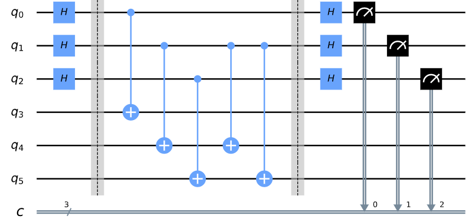

#### 3.1 通过模拟器实验

在模拟器中运行上面的量子回路：

> \# use local simulator
>
> backend = BasicAer.get_backend(\'qasm_simulator\')
>
> shots = 1024
>
> results = execute(simon_circuit, backend=backend,
> shots=shots).result()
>
> counts = results.get_counts()
>
> plot_histogram(counts)
>
> 输出：

由于我们已经知道$b$的值，我们可以通过结果是否满足$b \cdot z = 0(mod2)$来验证：

> \# Calculate the dot product of the results
>
> def bdotz(b, z):
>
> accum = 0
>
> for i in range(len(b)):
>
> accum += int(b\[i\]) \* int(z\[i\])
>
> return (accum % 2)
>
> for z in counts:
>
> print( \'{}.{} = {} (mod 2)\'.format(b, z, bdotz(b,z)) )
>
> 输出：
>
> 110.000 = 0 (mod 2)
>
> 110.001 = 0 (mod 2)
>
> 110.111 = 0 (mod 2)
>
> 110.110 = 0 (mod 2)

利用这些结果，我们可以通过求解这组联立方程来揭示$b = 110$的值。例如，假设我们第一次测得001：

$$\begin{matrix}
b \cdot 001 & = 0 \\
(b_{2} \cdot 0) + (b_{1} \cdot 0) + (b_{0} \cdot 0) & = 0 \\
(\boxed{b_{2} \cdot 0}) + (\boxed{b_{1} \cdot 0}) + (b_{0} \cdot 1) & = 0 \\
b_{0} & = 0 \\
\end{matrix}$$

如果接着测得111：

$$\begin{matrix}
b \cdot 111 & = 0 \\
(b_{2} \cdot 1) + (b_{1} \cdot 1) + (\boxed{0 \cdot 1}) & = 0 \\
(b_{2} \cdot 1) + (b_{1} \cdot 1) & = 0 \\
\end{matrix}$$

则告诉我们：

$$b_{2} = b_{1} = 0,b = 000$$

或：

$$b_{2} = b_{1} = 1,b = 110$$

其中$b = 110$是联立方程的非平凡解。我们可以使用高斯消元法来解决这些问题，但高斯消元法的运行时间为$O(n_{3})$。

#### 3.2 在真实的设备上实验

在上一节中的量子回路用到了$2n = 6$个量子比特，但在编写本章内容时多数IBM量子设备仅有5个量子比特。我们将会运行与上节中相同的代码，但将使用第二节中的$b = 11$代替$b = 110$，因此仅需要4个量子比特。

> b = \'11\'
>
> n = len(b)
>
> simon_circuit_2 = QuantumCircuit(n\*2, n)
>
> \# Apply Hadamard gates before querying the oracle
>
> simon_circuit_2.h(range(n))
>
> \# Query oracle
>
> simon_circuit_2 += simon_oracle(b)
>
> \# Apply Hadamard gates to the input register
>
> simon_circuit_2.h(range(n))
>
> \# Measure qubits
>
> simon_circuit_2.measure(range(n), range(n))
>
> simon_circuit_2.draw()

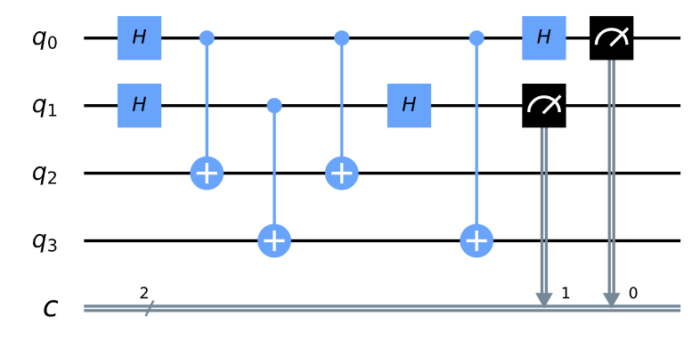

此回路与第2节所示的回路略有不同。输出是不同的，但输入靠接相同，即两者都具有$f(x) = f(x \oplus 11)$的性质。

> \# Load our saved IBMQ accounts and get the least busy backend device
> with less than or equal to 5 qubits
>
> IBMQ.load_account()
>
> provider = IBMQ.get_provider(hub=\'ibm-q\')
>
> backend = least_busy(provider.backends(filters=lambda x:
> x.configuration().n_qubits \>= n and
>
> not x.configuration().simulator and x.status().operational==True))
>
> print(\"least busy backend: \", backend)
>
> \# Execute and monitor the job
>
> from qiskit.tools.monitor import job_monitor
>
> shots = 1024
>
> job = execute(simon_circuit_2, backend=backend, shots=shots,
> optimization_level=3)
>
> job_monitor(job, interval = 2)
>
> \# Get results and plot counts
>
> device_counts = job.result().get_counts()
>
> plot_histogram(device_counts)
>
> 输出：
>
> least busy backend: ibmq_burlington
>
> Job Status: job has successfully run

> \# Calculate the dot product of the results
>
> def bdotz(b, z):
>
> accum = 0
>
> for i in range(len(b)):
>
> accum += int(b\[i\]) \* int(z\[i\])
>
> return (accum % 2)
>
> print(\'b = \' + b)
>
> for z in device_counts:
>
> print( \'{}.{} = {} (mod 2) ({:.1f}%)\'.format(b, z, bdotz(b,z),
> device_counts\[z\]\*100/shots))
>
> 输出：
>
> b = 11
>
> 11.00 = 0 (mod 2) (49.2%)
>
> 11.11 = 0 (mod 2) (32.0%)
>
> 11.10 = 1 (mod 2) (9.1%)
>
> 11.01 = 1 (mod 2) (9.7%)

正如输出所示，最显著的结果是$b \cdot z = 0\left( mod2 \right)$。其他结果是错误的，但发生的概率较低。假设我们不太可能测得错误的结果，然后我们可以使用经典计算机通过求解线性方程组来揭示b的值。对于这一$n = 2$的情况，$b = 11$。

### 4. 预言

上述Simon算法的示例和实现都特定于$b$的值。为能够将这一问题扩展至其他秘密比特字串，我们需要讨论Simon查询函数或预言的更多细节。

Simon算法用于处理找出预言$f_{s}$的隐藏字串$b \in {0,1}^{n}$，预言$f_{b}$对于所有$x \in {0,1}^{n}$满足$f_{b}\left( x \right) = f_{b}\left( y \right)$，当且仅当$y = x \oplus b$。此处的$\oplus$是逐位的异或运算（XOR
operation）。因此，如果$b = 0\ldots 0$（如全零比特字串），那么$f_{b}$是一个一对一（排列，permutation）函数。否则，如果$b \neq 0\ldots 0$则$f_{b}$是一个二对一函数。

在这一算法中，该预言接收$\left| x \right\rangle\left| 0 \right\rangle$作为输入。对于预定的$b$，预言将其输出写入第二个寄存器，故该预言将输入转换为$\left| x \right\rangle\left| f_{b}\left( x \right) \right\rangle$，对于所有$x \in {0,1}^{n}$使得$f\left( x \right) = f\left( x \oplus b \right)$。

此类的黑箱函数可以通过以下程序实现。

-   将第一个寄存器中的内容复制至第二寄存器。

$$\left| x \right\rangle\left| 0 \right\rangle \rightarrow \left| x \right\rangle\left| x \right\rangle$$

-   （**创建1-to-1或2-to-2映射**）如果$s$并非全零，那么至少有一个索引$j$使得$s_{j} = 1$。如果$x_{j} = 1$,然后使用$s$对第二寄存器执行异或操作，否则不改变第二寄存器。

$$\left| x \right\rangle\left| x \right\rangle \rightarrow \left| x \right\rangle\left| x \oplus s \right\rangle\text{\ \ if\ \ }x_{j} = 0\ \ for\ the\ least\ index\ j$$

-   （**创建随机排列**）随机排列和翻转第二个寄存器的量子比特。

$$\left| x \right\rangle\left| y \right\rangle \rightarrow \left| x \right\rangle\left| f_{b}\left( y \right) \right\rangle$$

### 5. 练习

1\. 实现一个通用Simon预言。

2\.
在模拟器和真实设备上用秘密比特字串$s = 1001$测试所建的通用预言。结果是否如期望的一样？为何？

### 6. 参考文献

1\. Daniel R. Simon (1997) \"On the Power of Quantum Computation\" SIAM
Journal on Computing, 26(5), 1474--1483,
[doi:10.1137/S0097539796298637](https://doi.org/10.1137/S0097539796298637)

2\. Guangya Cai and Daowen Qiu. Optimal separation in exact query
complexities for Simon\'s problem. Journal of Computer and System
Sciences 97: 83-93, 2018, <https://doi.org/10.1016/j.jcss.2018.05.001>

3.7 量子傅里叶变换
------------------

在本节中，我们将会介绍量子傅里叶变换（quantum fourier transform
QFT），导出其量子回路，并在Qiskit中实现。本节中的内容还将展示如何在模拟器和5个量子比特的设备上运行QFT。

### 内容

1\. 简介

2\. 直觉（Intuition）

2.1 以傅里叶基（Fourier Basis）计数

3\. 示例1：单量子比特QFT

4\. 量子傅里叶变换

5\. 实现QFT的量子回路

6\. 示例2：3-量子比特QFT

7\. QFT回路形式的注意事项

8\. Qiskit实现

8.1 3-量子比特示例

8.2 通用QFT函数

8.3 在真实的设备上运行QFT

9\. 练习

10\. 参考文献

### 1. 简介

傅里叶变换在经典计算中有许多不同的版本，所涉及的领域从信号处理到数据压缩以及复杂性理论。

量子傅里叶变换（QFT）是对波函数的幅值进行离散傅里叶变换的量子实现。QFT是许多量子算法的一部分，其中最著名的是Shor因式算法（SFA）和量子相位估计。

离散傅里叶变换依据如下等式将向量$\left( x_{0},\ldots,x_{N - 1} \right)$映射为向量$\left( y_{0},\ldots,y_{N - 1} \right)$：

$$y_{k} = \frac{1}{\sqrt{N} }\sum_{j = 0}^{N - 1}{x_{j}\omega_{N}^{\text{jk} } }$$

其中$\omega_{N}^{\text{jk} } = e^{2\pi i\frac{\text{jk} }{N} }$。

同样的，量子傅里叶变换依据如下等式将量子态$\sum_{i = 0}^{N - 1}{x_{i}\left| i \right\rangle}$映射为量子态$\sum_{i = 0}^{N - 1}{y_{i}\left| i \right\rangle}$：

$$y_{k} = \frac{1}{\sqrt{N} }\sum_{j = 0}^{N - 1}{x_{j}\omega_{N}^{\text{jk} } }$$

其中$\omega_{N}^{\text{jk} } = e^{2\pi i\frac{\text{jk} }{N} }$。可以注意到这一变换仅对量子态的幅值有效。

这一变换还可以表示为映射：

$$\left| x \right\rangle \longmapsto \frac{1}{\sqrt{N} }\sum_{y = 0}^{N - 1}{\omega_{N}^{\text{xy} }\left| y \right\rangle}$$

或表示为幺正矩阵：

$$U_{\text{QFT} } = \frac{1}{\sqrt{N} }\sum_{x = 0}^{N - 1}{\sum_{y = 0}^{N - 1}{\omega_{N}^{\text{xy} }\left| y \right\rangle\left\langle x \right|} }$$

### 2. 直觉

量子傅里叶变换是在两个基之间进行：计算基（Z）与傅里叶基（Fourier
basis）。H-gate就是单量子比特QFT，其将处于态$\left| 0 \right\rangle$和$\left| 1 \right\rangle$的Z-基变换为处于态$\left| + \right\rangle$和$\left| 1 \right\rangle$的X-基。运用同样的方法，所有计算基（computational
basis）中多量子比特的状态都在傅里叶基中有对应的状态。QFT仅是在这些基中进行变换的简单函数：

$$\left| \text{StateinComputationalBasis} \right\rangle\overset{\text{QFT} }{\rightarrow}\left| \text{StateinFourierBasis} \right\rangle$$

$$\text{QFT}\left| x \right\rangle = \left| \widetilde{x} \right\rangle$$

（我们经常用波浪号（\~）表示傅里叶基中的状态。）

#### 2.1 以傅里叶基（Fourier Basis）计数

在计算基中，我们使用态$\left| 0 \right\rangle$和$\left| 1 \right\rangle$以二进制的形式存储数字。

注意不同量子比特的变化频率；最左边的量子比特每增加一次就翻转一次，下一个量子比特为每增加2次，第三个量子比特为每增加4次，以此类推。在傅里叶基上，我们使用不同绕Z轴的旋转来存储数字：

我们想要存储的数字决定了每个量子比特绕Z轴旋转的角度。以态$\left| \widetilde{0} \right\rangle$为例，所有量子比特都处于态$\left| + \right\rangle$。如上面的图片所示，要在3个量子比特中编码态$\left| \widetilde{5} \right\rangle$，需要将最左边的量子比特旋转$\frac{5}{2^{n} } = \frac{5}{8} \times 2\pi$。下一个量子比特旋转两倍的角度（$\frac{10}{8} \times 2\pi$），再下一个旋转角度再加倍，以此类推。

再次强调，注意不同量子比特的变化频率。在这一情况下，处于最左边的量子比特的旋转频率最小，最右边的最大。

### 3. 示例1：1-量子比特 QFT

思考如何将上述的QFT操作作用于处于态$\left| \psi \right\rangle = \alpha\left| 0 \right\rangle + \beta\left| 1 \right\rangle$的单个量子比特上。在这一情况下，$x_{0} = \alpha$、$x_{1} = \beta$以及$N = 2$，则：

$$y_{0} = \frac{1}{\sqrt{2} }\left( \alpha\exp\left( 2\pi i\frac{0 \times 0}{2} \right) + \beta\exp\left( 2\pi i\frac{1 \times 0}{2} \right) \right) = \frac{1}{\sqrt{2} }\left( \alpha + \beta \right)$$

以及

$$y_{1} = \frac{1}{\sqrt{2} }\left( \alpha\exp\left( 2\pi i\frac{0 \times 1}{2} \right) + \beta\exp\left( 2\pi i\frac{1 \times 1}{2} \right) \right) = \frac{1}{\sqrt{2} }\left( \alpha - \beta \right)$$

因此最终结果为态：

$U_{\text{QFT} }\left| \psi \right\rangle = \frac{1}{\sqrt{2} }\left( \alpha + \beta \right)\left| 0 \right\rangle - \frac{1}{\sqrt{2} }\left( \alpha - \beta \right)\left| 1 \right\rangle$

这一操作正是在一个量子比特上应用阿达马算子（$H$）的结果：

$$H = \frac{1}{\sqrt{2} }\left\lbrack \begin{matrix}
1 \\
1 \\
\end{matrix}\ \begin{matrix}
1 \\
 - 1 \\
\end{matrix} \right\rbrack$$

如果我们将$H$算子应用于态$\left| \psi \right\rangle = \alpha\left| 0 \right\rangle + \beta\left| 1 \right\rangle$，将会获得一个新的状态：

$$\frac{1}{\sqrt{2} }\left( \alpha + \beta \right)\left| 0 \right\rangle - \frac{1}{\sqrt{2} }\left( \alpha - \beta \right)\left| 1 \right\rangle \equiv \widetilde{\alpha}\left| 0 \right\rangle + \widetilde{\beta}\left| 1 \right\rangle$$

可以注意到阿达马门如何在量子态的幅值上执行$N = 2$的离散傅里叶变换。

### 4. 量子傅里叶变换

很大数量$N$的QFT会是什么样子呢？让我们推导一下作用于态$\left| x \right\rangle = \left| x_{1}\ldots x_{n} \right\rangle$的$N = 2^{n}$的$\text{QFT}_{N}$的变化式，其中$x_{1}$是最高有效位（*most
significant
bit，MSB：指多字节序列中具有最大权重的字节*）。这里的数学是为那些发现其有用的人准备的，如果您愿意同其斗争，那么就不必担心；只要您能够理解上文中直觉部分的内容，就可以直接进入下一部分内容的学习。
$$ {U_{\text{QFT} }\left| x \right\rangle = \frac{1}{\sqrt{N} }\sum_{y = 0}^{N - 1}{\omega_{N}^{\text{xy} }\left| y \right\rangle}
}{\ \ \ \ \ \ \ \ \ \ \ \ \ \ \ \  = \frac{1}{\sqrt{N} }\sum_{y = 0}^{N - 1}{e^{2\pi ix\frac{y}{2^{n} } }\left| y \right\rangle}\ 因\ \omega_{N}^{\text{xy} } = e^{2\pi i\frac{\text{xy} }{N} }\ 以及\ N = 2^{n}
}{\ \ \ \ \ \ \ \ \ \ \ \ \ \ \ \  = \frac{1}{\sqrt{N} }\sum_{y = 0}^{N - 1}{e^{2\pi i\left( \sum_{k = 1}^{n}\frac{y_{k} }{2^{k} } \right)x}\left| y_{1}\cdots y_{n} \right\rangle} }$$

$$= \frac{1}{\sqrt{N} }\sum_{y = 0}^{N - 1}{\prod_{k = 1}^{n}e^{2\pi ix\frac{y_{k} }{2^{k} } }\left| y_{1}\cdots y_{n} \right\rangle}$$

将和的指数展开为指数的积后：

$$= \frac{1}{\sqrt{N} }{\bigotimes_{}^{}\left( \left| 0 \right\rangle + e^{\frac{2\pi ix}{2^{k} } }\left| 1 \right\rangle \right)}_{k = 1}^{n}$$

重新排列和与积并展开$\sum_{y = 0}^{N - 1}{= \sum_{y_{1} = 0}^{1}{\sum_{y_{2} = 0}^{1}{\cdots\sum_{y_{n} = 0}^{1} } } }$

$$= \frac{1}{\sqrt{N} }(\left| 0 \right\rangle + e^{\frac{2\pi i}{2}x}\left| 1 \right\rangle)\bigotimes(\left| 0 \right\rangle + e^{\frac{2\pi i}{2^{2} }x}\left| 1 \right\rangle)\bigotimes\cdots\bigotimes(\left| 0 \right\rangle + e^{\frac{2\pi i}{2^{n - 1} }x}\left| 1 \right\rangle)\bigotimes(\left| 0 \right\rangle + e^{\frac{2\pi i}{2^{n} }x}\left| 1 \right\rangle)$$

这就是在直觉中动画数学描述：

### 5. 实现QFT的量子回路

实现QFT的量子回路使用两个量子门。第一个为单量子比特阿达马门$H$。自上文示例1中，您已经看到了作用处于态$|x_{k}\rangle$单量子比特的$H$的功能：

$$H|x_{k}\rangle = |0\rangle + \exp{\left( \frac{2\pi i}{2}x_{k} \right)|1\rangle}$$

第二个为以块对角形式（block-diagonal
form）给出的双量子比特受控旋转$C\text{ROT}_{k}$：

$$C\text{ROT}_{k} = \begin{bmatrix}
I & 0 \\
0 & U\text{ROT}_{k} \\
\end{bmatrix}$$

其中

$$U\text{ROT}_{k} = \begin{bmatrix}
I & 0 \\
0 & \exp\left( \frac{2\pi i}{2^{k} } \right) \\
\end{bmatrix}$$

作用处于态$|x_{j}x_{k}\rangle$双量子比特$C\text{ROT}_{k}$的功能为其中第一个量子比特为受控端，第二个为目标端：

$$C\text{ROT}_{k}|1x_{j}\rangle = |0x_{j}\rangle$$

以及

$$C\text{ROT}_{k}|1x_{j}\rangle = \exp\left( \frac{2\pi i}{2^{k} }x_{j} \right)|1x_{j}\rangle$$

在给出这两个量子门之后，实现n-量子比特QFT的量子回路为：

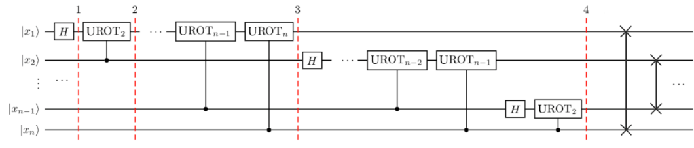

这一回路的实现步骤如下所示，我们从处于态$|x_{0}x_{1}\ldots x_{n}\rangle$的n-量子比特开始。

1\. 在H-gate应用于量子比特1之后，状态由输入时的变换为：

$$H_{1}|x_{0}x_{1}\ldots x_{n}\rangle = \frac{1}{\sqrt{2} }\lbrack|0\rangle + \exp{\left( \frac{2\pi i}{2}x_{1} \right)|1\rangle}\rbrack\bigotimes|x_{2}x_{3}\ldots x_{n}\rangle$$

2\.
在将$U\text{ROT}_{2}$应用于由量子比特2控制的量子比特1之后，状态转变为：

$$\frac{1}{\sqrt{2} }\lbrack|0\rangle + \exp{\left( \frac{2\pi i}{2^{2} }x_{2} + \frac{2\pi i}{2}x_{1} \right)|1\rangle}\rbrack\bigotimes|x_{2}x_{3}\ldots x_{n}\rangle$$

3\.
在对由量子比特n控制的量子比特1应用最后一个$C\text{ROT}_{2}$之后，状态变为：

$$\frac{1}{\sqrt{2} }\lbrack|0\rangle + \exp{\left( \frac{2\pi i}{2^{n} }x_{n} + \frac{2\pi i}{2^{n - 1} }x_{n - 1} + \cdots + \frac{2\pi i}{2^{2} }x_{2} + \frac{2\pi i}{2}x_{1} \right)|1\rangle}\rbrack\bigotimes|x_{2}x_{3}\ldots x_{n}\rangle$$

注意到：

$$x = 2^{n - 1}x_{1} + 2^{n - 2}x_{2} + \cdots + 2^{1}x_{n - 1} + 2^{0}x_{n}$$

我们可以将上面的状态改写为：

$$\frac{1}{\sqrt{2} }\lbrack|0\rangle + \exp{\left( \frac{2\pi i}{2^{n} }x \right)|1\rangle}\rbrack\bigotimes|x_{2}x_{3}\ldots x_{n}\rangle$$

4\.
再对量子比特$2\cdots n$应用相似的量子门序列之后，我们发现最终的状态为：

$$\frac{1}{\sqrt{2} }\lbrack|0\rangle + \exp{\left( \frac{2\pi i}{2^{n} }x \right)|1\rangle}\rbrack\bigotimes\frac{1}{\sqrt{2} }\lbrack|0\rangle + \exp{\left( \frac{2\pi i}{2^{n - 1} }x \right)|1\rangle}\rbrack\bigotimes\cdots\bigotimes\frac{1}{\sqrt{2} }\lbrack|0\rangle + \exp{\left( \frac{2\pi i}{2^{2} }x \right)|1\rangle}\rbrack\bigotimes\frac{1}{\sqrt{2} }\lbrack|0\rangle + \exp{\left( \frac{2\pi i}{2^{1} }x \right)|1\rangle}\rbrack$$

以上正是上文中所推导的输入态的QFT，但应注意此时量子比特的顺序与输出态相反。

### 6. 示例2：1-量子比特QFT

创建$|y_{3}y_{2}y_{1}\rangle = \text{QFT}_{8}|x_{3}x_{2}x_{1}\rangle$量子回路的步骤如下：

1\. 在$|x_{1}\rangle$上应用H-gate：

$$\psi_{1} = |x_{3}\rangle\bigotimes|x_{2}\rangle\bigotimes\frac{1}{\sqrt{2} }\lbrack|0\rangle + \exp{\left( \frac{2\pi i}{2}x_{1} \right)|1\rangle}\rbrack$$

2\. 依据$|x_{2}\rangle$在$|x_{1}\rangle$上应用$U\text{ROT}_{2}$：

$$\psi_{2} = |x_{3}\rangle\bigotimes|x_{2}\rangle\bigotimes\frac{1}{\sqrt{2} }\lbrack|0\rangle + \exp{\left( \frac{2\pi i}{2^{2} }x_{2} + \frac{2\pi i}{2}x_{1} \right)|1\rangle}\rbrack$$

3\. 依据$|x_{3}\rangle$在$|x_{1}\rangle$上应用$U\text{ROT}_{3}$：

$$\psi_{3} = |x_{3}\rangle\bigotimes|x_{2}\rangle\bigotimes\frac{1}{\sqrt{2} }\lbrack|0\rangle + \exp{\left( \frac{2\pi i}{2^{2} }x_{3} + \frac{2\pi i}{2^{2} }x_{2} + \frac{2\pi i}{2}x_{1} \right)|1\rangle}\rbrack$$

4\. 在$|x_{2}\rangle$上应用H-gate：

$$\psi_{4} = |x_{3}\rangle\bigotimes\frac{1}{\sqrt{2} }\lbrack|0\rangle + \exp{\left( \frac{2\pi i}{2}x_{2} \right)|1\rangle}\rbrack\bigotimes\frac{1}{\sqrt{2} }\lbrack|0\rangle + \exp{\left( \frac{2\pi i}{2^{3} }x_{3} + \frac{2\pi i}{2^{2} }x_{2} + \frac{2\pi i}{2}x_{1} \right)|1\rangle}\rbrack$$

5\. 依据$|x_{3}\rangle$在$|x_{2}\rangle$上应用$U\text{ROT}_{2}$：

$$\psi_{5} = |x_{3}\rangle\bigotimes\frac{1}{\sqrt{2} }\lbrack|0\rangle + \exp{\left( \frac{2\pi i}{2^{2} }x_{3} + \frac{2\pi i}{2}x_{2} \right)|1\rangle}\rbrack\bigotimes\frac{1}{\sqrt{2} }\lbrack|0\rangle + \exp{\left( \frac{2\pi i}{2^{3} }x_{3} + \frac{2\pi i}{2^{2} }x_{2} + \frac{2\pi i}{2}x_{1} \right)|1\rangle}\rbrack$$

6\. 在$|x_{3}\rangle$上应用H-gate：

$$\psi_{6} = \frac{1}{\sqrt{2} }\lbrack|0\rangle + \exp{\left( \frac{2\pi i}{2}x_{3} \right)|1\rangle}\rbrack\bigotimes\frac{1}{\sqrt{2} }\lbrack|0\rangle + \exp{\left( \frac{2\pi i}{2^{2} }x_{3} + \frac{2\pi i}{2}x_{2} \right)|1\rangle}\rbrack\bigotimes\frac{1}{\sqrt{2} }\lbrack|0\rangle + \exp{\left( \frac{2\pi i}{2^{3} }x_{3} + \frac{2\pi i}{2^{2} }x_{2} + \frac{2\pi i}{2}x_{1} \right)|1\rangle}\rbrack$$

7\.
应当记住输出状态是所需QFT的逆序。因此我们必须将量子比特的顺序反过来（在本示例中可交换$y_{3}$和$y_{1}$）。

### 7. QFT量子回路形式的注解

上文示例证明了一种非常有用的$N = 2^{n}$的QFT形式。可以看到只有最后一个量子比特取决于所有其他输入端量子比特的值，每前一个量子比特对于输入端量子比特的依赖越来越小。这一点对无力实现QFT很重要，因最近邻耦合比量子比特之间的远距离耦合更容易实现。

此外，当QFT量子回路很大的时候，会有越来越多的时间花在做越来越小的旋转上。结果表明：当我们忽略低于某个阈值的旋转时仍然可以得到很好的结果，这就是所谓的近似QFT。这在物理实现中也很重要，因为减少操作的数量可以大大减少退相干和潜在的量子门错误。

### 8. Qiskit实现

在Qiskit中使用上文中讨论的受控相位旋转门来实现$C\text{ROT}$门。这一量子门在在[OpenQASM](https://github.com/QISKit/openqasm)中被定义为：

$$\text{CU}_{1} = \left\lbrack \begin{matrix}
1 \\
0 \\
0 \\
0 \\
\end{matrix}\text{\ \ }\begin{matrix}
0 \\
1 \\
0 \\
0 \\
\end{matrix}\text{\ \ }\begin{matrix}
0 \\
0 \\
1 \\
0 \\
\end{matrix}\text{\ \ }\begin{matrix}
0 \\
0 \\
0 \\
e^{\text{iθ} } \\
\end{matrix} \right\rbrack$$

因此，将上文中所讨论$C\text{ROT}_{k}$映射为$\text{CU}_{1}$等式如下：

$$\theta = \frac{2\pi}{2^{k} } = \frac{\pi}{2^{k - 1} }$$

#### 8.1 3-量子比特的示例

> import numpy as np
>
> from numpy import pi
>
> \# importing Qiskit
>
> from qiskit import QuantumCircuit, execute, Aer, IBMQ
>
> from qiskit.providers.ibmq import least_busy
>
> from qiskit.tools.monitor import job_monitor
>
> from qiskit.visualization import plot_histogram,
> plot_bloch_multivector
>
> %config InlineBackend.figure_format = \'svg\' \# Makes the images look
> nice

在生成n-量子比特QFT之前先生成3-量子比特QFT的相关代码非常有用。第一步，我们必须定义量子回路：

qc = QuantumCircuit(3)

**注**：是否还记得Qiskit的最高有效位元所有的最小索引（0），因此这一量子回路是第5章中相关图像的水平镜像。首先，我们对量子比特2应用一个H-gate：

> qc.h(2)
>
> qc.draw(\'mpl\')
>
> 输出：

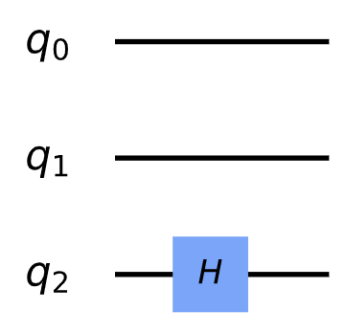

然后，如果量子比特1处于态$|1\rangle$时再转四分之一圈：

> qc.cu1(pi/2, 1, 2) \# CROT from qubit 1 to qubit 2
>
> qc.draw(\'mpl\')
>
> 输出：

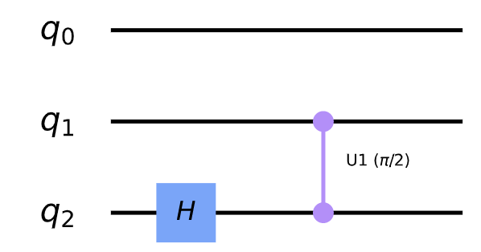

如果最高有效量子比特1是$\left| 1 \right\rangle$时，再旋转八分之一圈：

> qc.cu1(pi/4, 0, 2) \# CROT from qubit 2 to qubit 0
>
> qc.draw(\'mpl\')
>
> 输出：

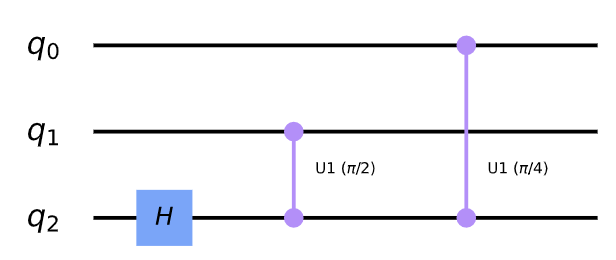

在处理完这一量子比特之后，将其忽略并重复这一过程，对量子比特1和2使用相同的逻辑：

> qc.h(1)
>
> qc.cu1(pi/2, 0, 1) \# CROT from qubit 0 to qubit 1
>
> qc.h(0)
>
> qc.draw(\'mpl\')
>
> 输出：

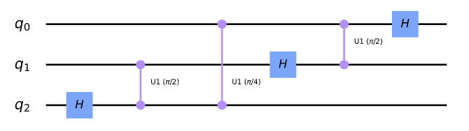

最后，我们必须交换量子比特0和2来完成QFT：

> qc.swap(0,2)
>
> qc.draw(\'mpl\')
>
> 输出：

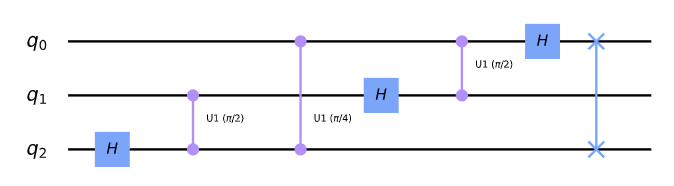

#### 8.2 通用QFT函数

现在我们在Qiskit中创建一个QFT的通用量子回路，创建大型通用回路正是Qiskit的亮点。

创建量子比特倒置的QFT回路比较容易，然后再将其交换；我们将从创建正确旋转量子比特的函数开始。在此处我们通过正确旋转最高有效量子比特（拥有最大索引值的量子比特），从上述3-量子比特的示例开始：

> def qft_rotations(circuit, n):
>
> if n == 0: \# Exit function if circuit is empty
>
> return circuit
>
> n -= 1 \# Indexes start from 0
>
> circuit.h(n) \# Apply the H-gate to the most significant qubit
>
> for qubit in range(n):
>
> \# For each less significant qubit, we need to do a
>
> \# smaller-angled controlled rotation:
>
> circuit.cu1(pi/2\*\*(n-qubit), qubit, n)

运行该函数，看看其结果如何：

> qc = QuantumCircuit(4)
>
> qft_rotations(qc,4)
>
> qc.draw(\'mpl\')
>
> 输出：

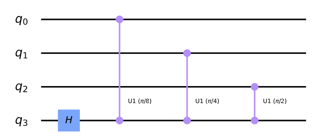

我们可以下面的小部件来查看这一回路如何因量子比特的数量而缩放：

> from qiskit_textbook.widgets import scalable_circuit
>
> scalable_circuit(qft_rotations)

上面的代码实现了我们QFT的第一部分。现在若要正确旋转最高有效量子比特，我们需要正确地旋转第二最高有效量子比特，然后必须处理第三最高有效量子比特，等等。但为何编写更多的代码呢？当qft_rotations()函数运行至末尾时，我们可以使用相同的代码在下一个n-1量子比特上重复这一过程：

> def qft_rotations(circuit, n):
>
> \"\"\"Performs qft on the first n qubits in circuit (without
> swaps)\"\"\"
>
> if n == 0:
>
> return circuit
>
> n -= 1
>
> circuit.h(n)
>
> for qubit in range(n):
>
> circuit.cu1(pi/2\*\*(n-qubit), qubit, n)
>
> \# At the end of our function, we call the same function again on
>
> \# the next qubits (we reduced n by one earlier in the function)
>
> qft_rotations(circuit, n)
>
> \# Let\'s see how it looks:
>
> qc = QuantumCircuit(4)
>
> qft_rotations(qc,4)
>
> qc.draw(\'mpl\')

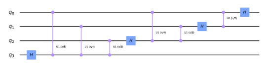

很简单吧！在一个函数内部调用其自身称为递归（*recursion*），这一方法可以极大的简化代码。使用下面的小部件，可以再次看看回路是如何缩放的：

scalable_circuit(qft_rotations)

最后为了满足QFT的定义，需要在这个QFT函数的尾部添加一些交换。我们将这一步放入最终的函数qft()中：

> def swap_registers(circuit, n):
>
> for qubit in range(n//2):
>
> circuit.swap(qubit, n-qubit-1)
>
> return circuit
>
> def qft(circuit, n):
>
> \"\"\"QFT on the first n qubits in circuit\"\"\"
>
> qft_rotations(circuit, n)
>
> swap_registers(circuit, n)
>
> return circuit
>
> \# Let\'s see how it looks:
>
> qc = QuantumCircuit(4)
>
> qft(qc,4)
>
> qc.draw(\'mpl\')
>
> 输出：

以上就是为量子傅里叶变换生成的量子回路。我们还可以使用小部件看看这一回路的缩放情况：

scalable_circuit(qft)

为了要证明这个回路运行的准确性，我们先要将一个数字编码为计算基。将数字5编码为二进制101：

> bin(5)
>
> 输出：
>
> '0b101'

（输出中的0b仅是提醒我们这是一个二进制数字）。现在将其编入量子比特中：

> \# Create the circuit
>
> qc = QuantumCircuit(3)
>
> \# Encode the state 5
>
> qc.x(0)
>
> qc.x(2)
>
> %config InlineBackend.figure_format = \'svg\' \# Makes the images fit
>
> qc.draw(\'mpl\')
>
> 输出：

然后使用态向量模拟器检查这些量子比特的状态：

> backend = Aer.get_backend(\"statevector_simulator\")
>
> statevector = execute(qc, backend=backend).result().get_statevector()
>
> plot_bloch_multivector(statevector)
>
> 输出：

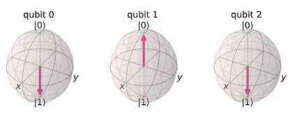

最后对其使用之前定义的QFT函数并查看量子比特的最终状态：

> qft(qc,3)
>
> qc.draw(\'mpl\')
>
> 输出：

> statevector = execute(qc, backend=backend).result().get_statevector()
>
> plot_bloch_multivector(statevector)
>
> 输出：

从上面所示的状态可以看出所定义的QFT函数准确地完成了其工作。相对于态$|\widetilde{0}\rangle = | + + + \rangle$，量子比特0被旋转了$\frac{5}{8}$周，量子比特1旋转了$\frac{10}{8}$周（相当于$\frac{1}{4}$周），量子比特2旋转了$\frac{20}{8}$周（相当于$\frac{1}{2}$周）。

#### 8.3 在真实的设备上运行QFT

如果在真正的量子设备上尝试运行8.2节中的量子回路，那么其将产生完全随机的结果，因为所有的量子比特都处于$|0\rangle$和$|1\rangle$之间相等的叠加态之中。如果想要证明和探讨这一在真实设备上运行的QFT回路，我们可以代之以8.2节尾部创建的态$|\widetilde{5}\rangle$，反向运行该QFT回路并验证输出是否是所期望的$|5\rangle$。

首先，使用Qiskit很容易反转QFT的操作步骤：

> def inverse_qft(circuit, n):
>
> \"\"\"Does the inverse QFT on the first n qubits in circuit\"\"\"
>
> \# First we create a QFT circuit of the correct size:
>
> qft_circ = qft(QuantumCircuit(n), n)
>
> \# Then we take the inverse of this circuit
>
> invqft_circ = qft_circ.inverse()
>
> \# And add it to the first n qubits in our existing circuit
>
> circuit.append(invqft_circ, circuit.qubits\[:n\])
>
> return circuit.decompose() \# .decompose() allows us to see the
> individual gates

然后，将量子比特置于态$|\widetilde{5}\rangle$：

> nqubits = 3
>
> number = 5
>
> qc = QuantumCircuit(nqubits)
>
> for qubit in range(nqubits):
>
> qc.h(qubit)
>
> qc.u1(number\*pi/4,0)
>
> qc.u1(number\*pi/2,1)
>
> qc.u1(number\*pi,2)
>
> qc.draw(\'mpl\')
>
> 输出：

我们可以看到经过这一步骤后确实得到了傅里叶状态$|\widetilde{5}\rangle$：

> backend = Aer.get_backend(\"statevector_simulator\")
>
> statevector = execute(qc, backend=backend).result().get_statevector()
>
> plot_bloch_multivector(statevector)
>
> 输出：

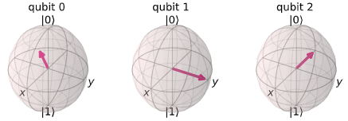

最后对其应用反转的QFT：

> qc = inverse_qft(qc,nqubits)
>
> qc.measure_all()
>
> qc.draw(\'mpl\')
>
> 输出：

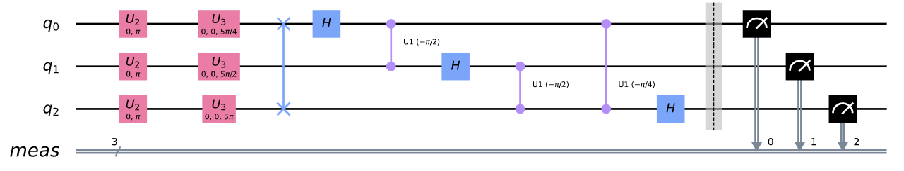

> \# Load our saved IBMQ accounts and get the least busy backend device
> with less than or equal to nqubits
>
> IBMQ.load_account()
>
> provider = IBMQ.get_provider(hub=\'ibm-q\')
>
> backend = least_busy(provider.backends(filters=lambda x:
> x.configuration().n_qubits \>= nqubits
>
> and not x.configuration().simulator
>
> and x.status().operational==True))
>
> print(\"least busy backend: \", backend)
>
> 输出：
>
> least busy backend: ibmq_london
>
> shots = 2048
>
> job = execute(qc, backend=backend, shots=shots, optimization_level=3)
>
> job_monitor(job)
>
> 输出：
>
> Job Status: job has successfully run
>
> counts = job.result().get_counts()
>
> plot_histogram(counts)
>
> 输出：

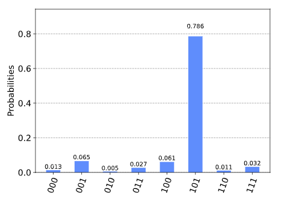

正如我们所期望，最大概率的结果是$101$。

### 9. 练习

1\.
上述的QFT实现已通过将傅里叶状态$|\widetilde{5}\rangle$转换为$\text{QFT}^{\dagger}|\widetilde{5}\rangle = |101\rangle$的过程进行了验证。尝试找出将$\text{QFT}^{\dagger}|a\rangle = |100\rangle$的中态$|a\rangle$。

2\. 找出$\text{QFT}^{\dagger}|b\rangle = |011\rangle$的中态$|b\rangle$。

3\. 尝试编写不使用递归的QFT函数并使用Qiskit中的幺正模拟器来验证结果。

### 10. 参考文献

1\. M. Nielsen and I. Chuang, Quantum Computation and Quantum
Information, Cambridge Series on Information and the Natural Sciences
(Cambridge University Press, Cambridge, 2000).

3.8 量子相位估计（Quantum Phase Estimation）
--------------------------------------------

### 内容

1\. 概述

1.1 直觉

1.2 数学基础

2\. 示例：T-gate

2.1 创建量子回路

2.2 结果

3\. 示例：获取更高精度

3.1 问题

3.2 解决方法

4\. 在真实设备上实验

4.1 使用2.1节中的回路

5\. 练习

6\. 展望

7\. 参考文献

8\. 贡献者

量子相位估计是量子计算中最重要的子程序之一，是许多量子算法的核心组成部分。该算法的目标如下：

给定一个幺正算子$U$，该算法估计$U\left| \psi \right\rangle = e^{2\pi i\theta}\left| \psi \right\rangle$中的$\theta$。此处的$\psi$是一个本征向量，$e^{2\pi i\theta}$是相对应的本征值。由于$U$是幺正的，其所有本征值的范数都是1。

### 1. 概述

下图所示为相位估计的通用量子回路。上部寄存器$t$包含"计数"量子比特，下部包含处于态$\left| \psi \right\rangle$的量子比特：

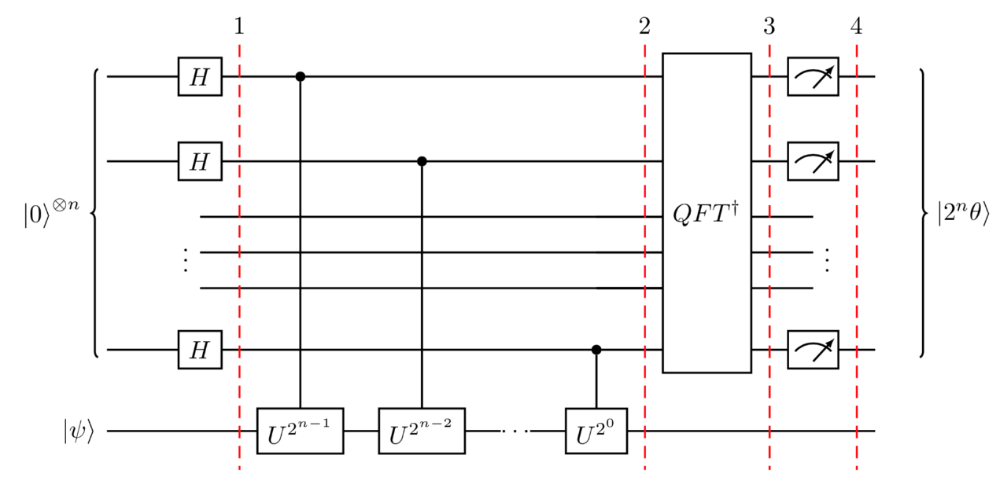

#### 1.1 直觉

量子相位估计算法使用相位反冲将相位$U$（傅立叶基）写入计数寄存器中的量子比特$t$。然后使用逆QFT将其从傅立叶基转换为可测量的计算基。

在QFT一章中提到：在傅里叶基中最顶端的量子比特在对$0$和$2^{t}$之间进行计数时会完成一个完整的旋转。为算出在$0$和$2^{t}$之间的数字$x$，我们绕Z轴旋转这一量子比特$\frac{x}{2^{t} }$圈，下一个量子比特旋转$\frac{2x}{2^{t} }$，第三个旋转$\frac{4x}{2^{t} }$。

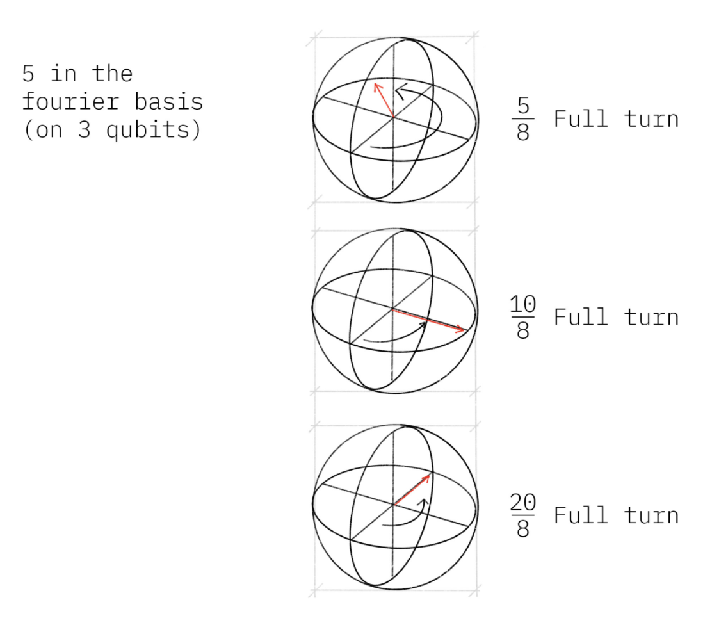

当我们使用一个量子比特来控制U-gate时，该量子比特由于反冲的原因将会相应地转换至相位$e^{2\pi i\theta}$。我们可以使用连续的受控幺正量子门（$\text{CU}$-gate）多次重复这一旋转至相应的数字，直到我们将相位$\theta$编码为傅立叶基中在$0$和$2^{t}$之间的数字。

然后，简单地使用$\text{QFT}^{\dagger}$将其转换为计算基。

#### 1.2 数学基础

正如上文中所提到的，该量子回路用于估计幺正算子$U$的相位，其估计$U\left| \psi \right\rangle = e^{2\pi i\theta}\left| \psi \right\rangle$中的$\theta$，其中$\psi$是一个本征向量而$e^{2\pi i\theta}$是相对应的本征值。该回路的工作步骤如下：

**i.
设置**：$\left| \psi \right\rangle$在一组量子比特寄存器中，来自计数寄存器的另一组$n$-量子比特被用于存储值$2^{n}\theta$：

$$\psi_{0} = \left| 0 \right\rangle^{\bigotimes n}\left| \psi \right\rangle$$

**ii. 叠加**：在计数寄存器上应用一个n-比特的阿达马门$H^{\bigotimes n}$：

$$\psi_{1} = \frac{1}{2^{\frac{n}{2} } }{(\left| 0 \right\rangle + \left| 1 \right\rangle)}^{\bigotimes n}\left| \psi \right\rangle$$

**iii.
受控幺正操作**：在这里我们需要引入受控幺正变换$C - U$，该变换在控制比特为$\left| 1 \right\rangle$时在目标寄存器上应用幺正算子$U$。由于$U$是类似于$U\left| \psi \right\rangle = e^{2\pi i\theta}\left| \psi \right\rangle$中本征向量$\left| \psi \right\rangle$的幺正操作，表明：

$$U^{2j}\left| \psi \right\rangle = U^{2j - 1}U\left| \psi \right\rangle = U^{2j - 1}e^{2\pi i\theta}\left| \psi \right\rangle = \cdots = e^{2\pi i2^{j}\theta}\left| \psi \right\rangle$$

应用在$0 \leq j \leq n - 1$中的所有$n$个受控操作$C - U^{2j}$，然后利用关系式$\left| 0 \right\rangle\bigotimes\left| \psi \right\rangle + \left| 1 \right\rangle\bigotimes e^{2\pi i\theta}\left| \psi \right\rangle = (\left| 0 \right\rangle + e^{2\pi i\theta}\left| 1 \right\rangle)\bigotimes\left| \psi \right\rangle$：

$${\psi_{2} = \frac{1}{2^{\frac{n}{2} } }\left( \left| 0 \right\rangle + e^{2\pi i\theta 2^{n - 1} }\left| 1 \right\rangle \right)\bigotimes\cdots\bigotimes\left( \left| 0 \right\rangle + e^{2\pi i\theta 2^{1} }\left| 1 \right\rangle \right)\bigotimes\left( \left| 0 \right\rangle + e^{2\pi i\theta 2^{0} }\left| 1 \right\rangle \right)\bigotimes\left| \psi \right\rangle
}{\ \ \ \ \ \  = \frac{1}{2^{\frac{n}{2} } }\sum_{k = 0}^{2^{n} - 1}{e^{2\pi i\theta k}\left| k \right\rangle\bigotimes\left| \psi \right\rangle} }$$

其中$k$为n-比特二进制数字的整数表示。

**iv.
逆傅立叶变换**：可以看出上述表示了应用量子傅里叶变换后的精确结果。量子傅里叶变换将n-量子比特的输入状态$|x\rangle$映射至：

$\text{QFT}\left| x \right\rangle = \frac{1}{2^{\frac{n}{2} } }\left( \left| 0 \right\rangle + e^{\frac{2\pi i}{2}x}\left| 1 \right\rangle \right)\bigotimes\cdots\bigotimes\left( \left| 0 \right\rangle + e^{\frac{2\pi i}{2^{2} }x}\left| 1 \right\rangle \right)\bigotimes\left( \left| 0 \right\rangle + e^{\frac{2\pi i}{2^{n - 1} }x}\left| 1 \right\rangle \right)\bigotimes\left( \left| 0 \right\rangle + e^{\frac{2\pi i}{2^{n} }x}\left| 1 \right\rangle \right)$

通过将上式中的$x$替换为$2^{n}\theta$会给出第二步中精确表达式。因此，为了恢复态$\left| 2^{n}\theta \right\rangle$，需要在附属寄存器上应用一个逆傅里叶变换。经过这些步骤后发现：

$$\left| \psi_{3} \right\rangle = \frac{1}{2^{\frac{n}{2} } }\sum_{k = 0}^{2^{n} - 1}{e^{2\pi i\theta k}\left| k \right\rangle\bigotimes\left| \psi \right\rangle}\overset{\text{QFT}_{n}^{- 1} }{\rightarrow}\frac{1}{2^{n} }\sum_{x = 0}^{2^{n} - 1}{\sum_{k = 0}^{2^{n} - 1}{e^{- \frac{2\pi ik}{2^{n} }(x - 2^{n}\theta)}\left| x \right\rangle\bigotimes\left| \psi \right\rangle} }$$

**v.
测量**：上述表达式在接近$x = 2^{n}\theta$时达到峰值。在$2^{n}\theta$是一个整数的情况时，在计算基上测量会给出附属寄存器中具有高概率的相位：

$$\left| \psi_{4} \right\rangle = \left| 2^{n}\theta \right\rangle\bigotimes\left| \psi \right\rangle$$

在$2^{n}\theta$不是整数的情况时，能够看出上面的表达式在临近$x = 2^{n}\theta$时仍能比$4/\pi^{2} \approx 40\%$
\[1\]有更高的概率。

### 2. 示例：T-gate

我们以已知的量子门$T$-gate做示例，并使用量子相位估计来估计该量子门的相位。$T$-gate能够将相位$e^{\frac{\text{iπ} }{4} }$添加至态$\left| 1 \right\rangle$：

$$T\left| 1 \right\rangle = \begin{bmatrix}
1 & 0 \\
0 & e^{\frac{\text{iπ} }{4} } \\
\end{bmatrix}\begin{bmatrix}
0 \\
1 \\
\end{bmatrix} = e^{\frac{\text{iπ} }{4} }\left| 1 \right\rangle$$

因此量子相位估计（QPE）会给出$\theta$：

$$T\left| 1 \right\rangle = e^{2i\text{πθ} }\left| 1 \right\rangle$$

我们期望找到：

$$\theta = \frac{1}{8}$$

在本示例中我们将会用到三个量子比特，并获取一个准确的结果而不是一个估计。

#### 2.1 创建量子回路

首先准备好程序环境：

> \#initialization
>
> import matplotlib.pyplot as plt
>
> %matplotlib inline
>
> %config InlineBackend.figure_format = \'svg\' \# Makes the images look
> nice
>
> import numpy as np
>
> import math
>
> \# importing Qiskit
>
> from qiskit import IBMQ, Aer
>
> from qiskit import QuantumCircuit, ClassicalRegister, QuantumRegister,
> execute
>
> \# import basic plot tools
>
> from qiskit.visualization import plot_histogram

然后，设置该量子回路。在此回路中我们将会用到四个量子比特------量子比特0至2用作计数，量子比特3用作幺正算子（$T$）的本征态。

通过应用一个$X$-gate初始化$\left| \psi \right\rangle = \left| 1 \right\rangle$：

> qpe = QuantumCircuit(4, 3)
>
> qpe.x(3)
>
> qpe.draw(output=\'mpl\')
>
> 输出：

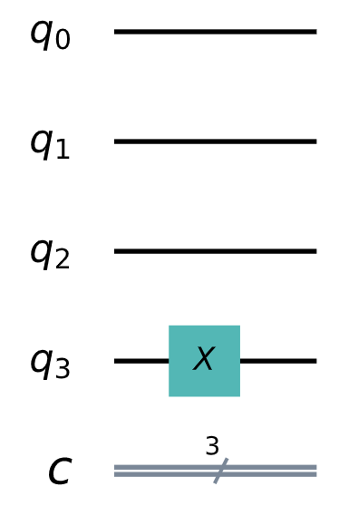

接着，我们在计数量子比特上应用H-gate：

> for qubit in range(3):
>
> qpe.h(qubit)
>
> qpe.draw(output=\'mpl\')
>
> 输出：

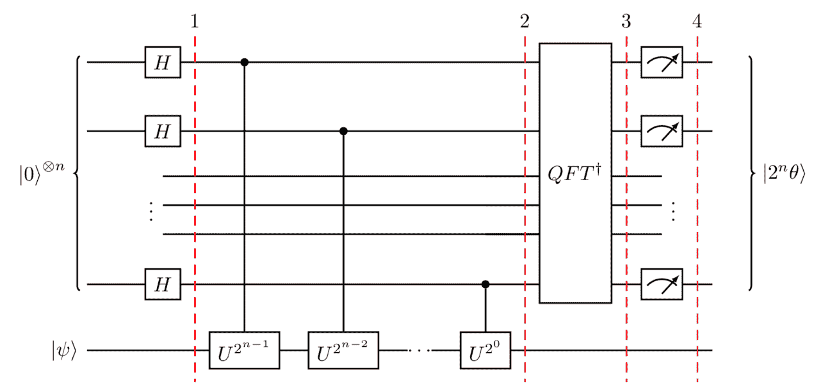

下一步我们执行受控幺正操作。**记住**：Qiskit对量子比特的排序与上图相反。

repetitions = 1

for counting_qubit in range(3):

for i in range(repetitions):

qpe.cu1(math.pi/4, counting_qubit, 3); \# This is C-U

repetitions \*= 2

qpe.draw(output=\'mpl\')

输出：

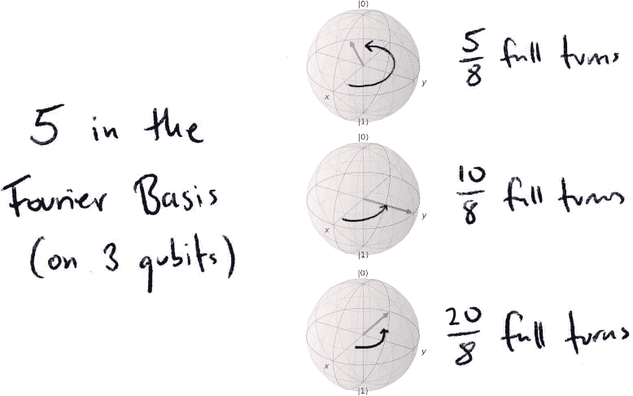

我们应用逆量子傅立叶变换来转换计数寄存器的状态。此处给出$\text{QFT}^{\dagger}$的代码：

> def qft_dagger(circ, n):
>
> \"\"\"n-qubit QFTdagger the first n qubits in circ\"\"\"
>
> \# Don\'t forget the Swaps!
>
> for qubit in range(n//2):
>
> circ.swap(qubit, n-qubit-1)
>
> for j in range(n):
>
> for m in range(j):
>
> circ.cu1(-math.pi/float(2\*\*(j-m)), m, j)
>
> circ.h(j)

然后测量计数寄存器。在此刻量子比特的顺序是反的！这在量子计算中是一个常见的问题。我们通过逆序测量经典比特来修复该问题：

> qpe.barrier()
>
> \# Apply inverse QFT
>
> qft_dagger(qpe, 3)
>
> \# Measure
>
> qpe.barrier()
>
> for n in range(3):
>
> qpe.measure(n,n)
>
> qpe.draw(output=\"mpl\")
>
> 输出：

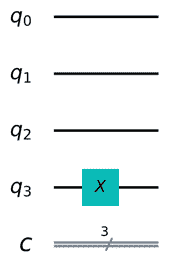

#### 2.2 结果

> backend = Aer.get_backend(\'qasm_simulator\')
>
> shots = 2048
>
> results = execute(qpe, backend=backend, shots=shots).result()
>
> answer = results.get_counts()
>
> plot_histogram(answer)
>
> 输出：

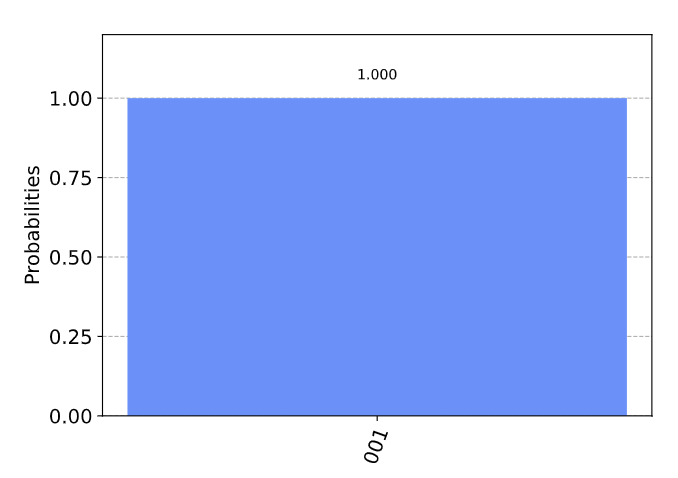

可以看到我们得到了一个确定的结果（001），转化成小数为1。现在需要通过将$2^{n}$除以结果（1）来获取$\theta$：

$$\theta = \frac{1}{2^{3} } = \frac{1}{8}$$

这正式我们所期望的精确结果！

### 3. 示例：获取更高精度

#### 3.1 问题

我们使用$\theta = \frac{1}{3}$的量子门代替$T$-gate。按照最后一个示例的样子设置这一量子回路：

> \# Create and set up circuit
>
> qpe2 = QuantumCircuit(4, 3)
>
> \# Apply H-Gates to counting qubits:
>
> for qubit in range(3):
>
> qpe2.h(qubit)
>
> \# Prepare our eigenstate \|psi\>:
>
> qpe2.x(3)
>
> \# Do the controlled-U operations:
>
> angle = 2\*math.pi/3
>
> repetitions = 1
>
> for counting_qubit in range(3):
>
> for i in range(repetitions):
>
> qpe2.cu1(angle, counting_qubit, 3);
>
> repetitions \*= 2
>
> \# Do the inverse QFT:
>
> qft_dagger(qpe2, 3)
>
> \# Measure of course!
>
> for n in range(3):
>
> qpe2.measure(n,n)
>
> qpe2.draw(output=\'mpl\')
>
> 输出：

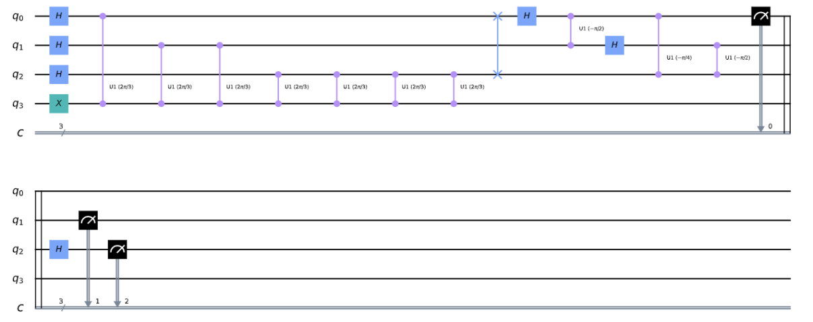

> \# Let\'s see the results!
>
> backend = Aer.get_backend(\'qasm_simulator\')
>
> shots = 4096
>
> results = execute(qpe2, backend=backend, shots=shots).result()
>
> answer = results.get_counts()
>
> plot_histogram(answer)
>
> 输出：

我们期望结果为$\theta = 0.3333\cdots$，可以看到最有可能的结果是010(bin)
= 2(dec)和011(bin) = 3(dec)。这两个结果分别告诉我们$\theta = 0.25$（off
by 25%）以及$\theta = 0.375$（off by
13%）。$\theta$的真值处于从计数比特获取的值之中，导致了不确定以及不精确。

#### 3.2 解决方法

为了获取更高的精度，只需简单地添加更多的计数比特。我们将会增加两个计数比特：

> \# Create and set up circuit
>
> qpe3 = QuantumCircuit(6, 5)
>
> \# Apply H-Gates to counting qubits:
>
> for qubit in range(5):
>
> qpe3.h(qubit)
>
> \# Prepare our eigenstate \|psi\>:
>
> qpe3.x(5)
>
> \# Do the controlled-U operations:
>
> angle = 2\*math.pi/3
>
> repetitions = 1
>
> for counting_qubit in range(5):
>
> for i in range(repetitions):
>
> qpe3.cu1(angle, counting_qubit, 5);
>
> repetitions \*= 2
>
> \# Do the inverse QFT:
>
> qft_dagger(qpe3, 5)
>
> \# Measure of course!
>
> for n in range(5):
>
> qpe3.measure(n,n)
>
> qpe3.draw(output=\'mpl\')

输出：

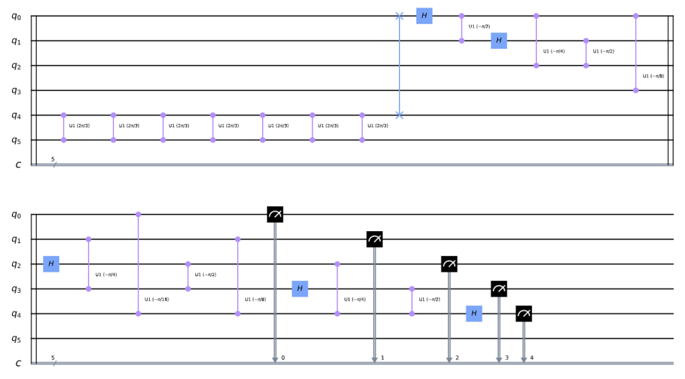

> \# Let\'s see the results!
>
> backend = Aer.get_backend(\'qasm_simulator\')
>
> shots = 4096
>
> results = execute(qpe3, backend=backend, shots=shots).result()
>
> answer = results.get_counts()
>
> plot_histogram(answer)
>
> 输出：

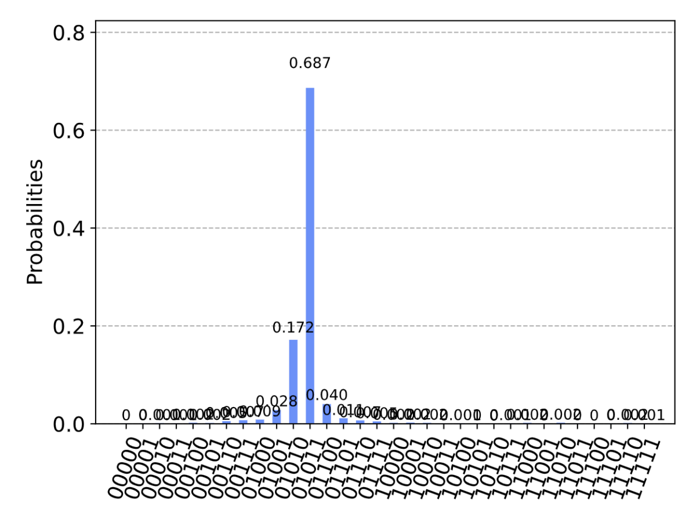

现在最可能的两个测量值是01011（十进制11）和01010（十进制10）。测量这些结果会告诉我们$\theta$是：

$\theta = \frac{11}{2^{5} } = 0.344$ 或
$\theta = \frac{10}{2^{5} } = 0.313$

这两个结果分别在3%和6%处相差$\frac{1}{3}$，已经是更高的精度了。

### 4. 在真实设备上实验

4.1 采用2.1中的回路

我们可以在真实的设备上运行2.1节中的量子回路，先让我们回忆一下这一回路：

> qpe.draw(output=\"mpl\")
>
> 输出：

> \# Load our saved IBMQ accounts and get the least busy backend device
> with less than or equal to n qubits
>
> IBMQ.load_account()
>
> from qiskit.providers.ibmq import least_busy
>
> from qiskit.tools.monitor import job_monitor
>
> provider = IBMQ.get_provider(hub=\'ibm-q\')
>
> backend = least_busy(provider.backends(filters=lambda x:
> x.configuration().n_qubits \>= 4 and not x.configuration().simulator
> and x.status().operational==True))
>
> print(\"least busy backend: \", backend)
>
> \# Run with 2048 shots
>
> shots = 2048
>
> job = execute(qpe, backend=backend, shots=2048, optimization_level=3)
>
> job_monitor(job)
>
> 输出：
>
> least busy backend: ibmqx2
>
> Job Status: job has successfully run
>
> \# get the results from the computation
>
> results = job.result()
>
> answer = results.get_counts(qpe)
>
> plot_histogram(answer)
>
> 输出：

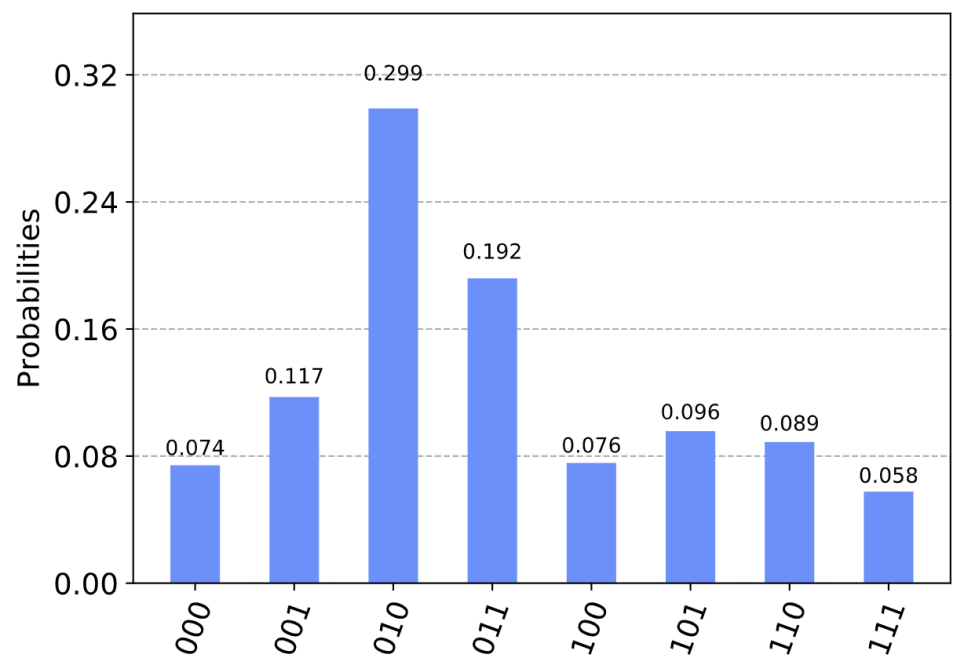

我们希望看到最有可能的结果是001，从模拟器中获得的期望结果。与模拟器不同的是，测量所得概率给出的不是001，这是由于量子计算机中的噪声和量子门误差导致的结果。

### 5. 练习

1\.
尝试使用不同的量子门（$\text{CNOT}，S$，$T^{\dagger}$）来进行上述的实验，结果是否如您所期望？获得了哪些结果？

2\.
尝试使用$Y$-gate实验，是否能够获取正确的结果？（提示：确认$|\psi\rangle$是$Y$的本征态！）

### 6. 展望

量子相位估计算法看上去毫无意义，因为在量子计算机上执行受控-$U$操作必须知道$\theta$。我们将在后面的章节中看到在不知道$\theta$的情况下创建量子回路的可能性，对学习theta可以告诉我们一些非常有用的东西（其中最著名的就是如何因式分解一个数字）。

### 7. 参考文献

\[1\] Michael A. Nielsen and Isaac L. Chuang. 2011. Quantum Computation
and Quantum Information: 10th Anniversary Edition (10th ed.). Cambridge
University Press, New York, NY, USA.

### 8. 贡献者

03/20/2020 --- Hwajung Kang (\@HwajungKang) ---
修复了不一致的量子比特顺序

3.9 Shor算法
------------

Shor算法以在多项式时间（Polynomial
Time）内分解整数而闻名。由于最著名的经典算法需要子指数时间（Sub-Exponential
Time）来分解两个素数的乘积，因此广泛使用的RSA密码系统基于足够大的整数不可能分解。

在本章中，我们将重点讨论Shor算法的量子部分，该算法实际上解决了周期寻找（period-finding）的问题。由于因式分解问题可以在多项式时间内转化为周期寻找问题，因此有效的周期寻找算法也可以有效地分解整数。现在该算法足以表明如果我们可以高效地计算出段$a^{x}\text{mod}\ N$，那么也可以高效地进行因式分解。由于周期查找本身就其本身而言是一个有价值的问题，我们将首先解决这一问题，然后讨论如何在本章的第5节中使用它来进行因式分解。

> import matplotlib.pyplot as plt
>
> import numpy as np
>
> from qiskit import QuantumCircuit, Aer, execute
>
> from qiskit.visualization import plot_histogram
>
> from math import gcd
>
> from numpy.random import randint
>
> from tabulate import tabulate
>
> from fractions import Fraction
>
> print(\"Imports Successful\")
>
> 输出：
>
> Imports Successful

### 1. 问题：周期寻找

我们先看一个周期函数：

$$f\left( x \right) = a^{x}\text{mod}\ N$$

**提示：摸和模运算**

取模运算(简称"mod")的意思是求一个数除以另一个数的余数。例如：

$$17\ \text{mod}\ 5 = 2$$

由于$17 \div 5 = 3$余$2$（$17 = \left( 3 \times 5 \right)\_ 2$）。在Python中，取模运算使用符号$\%$。这一行为被用在模运算（[modular
arithmetic](https://en.wikipedia.org/wiki/Modular_arithmetic)），在这一运算中数字间相互包裹直到找到一个确定值（模数
modulus）。我们可以将模运算写成如下等式：

$$17 \equiv 2(mod\ 5)$$

可以看出此处的（$mod\ 5$）应用于整个等式（由于其在圆括弧中），与之不同在上面的等式中仅将（$mod\ 5$）作用于等式的左侧。

𝑎和𝑁是正整数，𝑎小于𝑁，且没有公因子。周期或者阶($r$)是最小非零整数的情况如：

$$a^{r}\ \text{mod}\ N = 1$$

我们可以在下图中看到这类函数的一个例子。请注意点之间的线是为了帮助查看周期性，不用于表示x标记之间的中间值。

> N = 35
>
> a = 3
>
> \# Calculate the plotting data
>
> xvals = np.arange(35)
>
> yvals = \[np.mod(a\*\*x, N) for x in xvals\]
>
> \# Use matplotlib to display it nicely
>
> fig, ax = plt.subplots()
>
> ax.plot(xvals, yvals, linewidth=1, linestyle=\'dotted\', marker=\'x\')
>
> ax.set(xlabel=\'\$x\$\', ylabel=\'\$%i\^x\$ mod \$%i\$\' % (a, N),
>
> title=\"Example of Periodic Function in Shor\'s Algorithm\")
>
> try: \# plot r on the graph
>
> r = yvals\[1:\].index(1) +1
>
> plt.annotate(s=\'\', xy=(0,1), xytext=(r,1),
> arrowprops=dict(arrowstyle=\'\<-\>\'))
>
> plt.annotate(s=\'\$r=%i\$\' % r, xy=(r/3,1.5))
>
> except:
>
> print(\'Could not find period, check a \< N and have no common
> factors.\')
>
> 输出：

### 2. 解决方案

Shor解决方案为在幺正算子上使用量子相位估计：

$$U|y\rangle \equiv |ay\ mod\ N\rangle$$

为了看出为何这一方法对解决问题有帮助，我们需要找出U的本征态的具体样子。如果行态$|1\rangle$开始，我们可以看到每一逐个的U应用将会与寄存器的状态相乘$a(mod\ N)$次，在$r$次应用后我们将会再次抵达态$|1\rangle$。例如$a = 3$及$N = 35$：

$${U\left| 1 \right\rangle = \left| 3 \right\rangle
}{U^{1}\left| 1 \right\rangle = \left| 9 \right\rangle
}{U^{3}\left| 1 \right\rangle = \left| 27 \right\rangle
}{\vdots 
}{U^{\left( r - 1 \right)}\left| 1 \right\rangle = \left| 12 \right\rangle
}{U^{r}\left| 1 \right\rangle = \left| 1 \right\rangle}$$

> ax.set(xlabel=\'Number of applications of U\', ylabel=\'End state of
> register\',
>
> title=\"Effect of Successive Applications of U\")
>
> fig
>
> 输出：

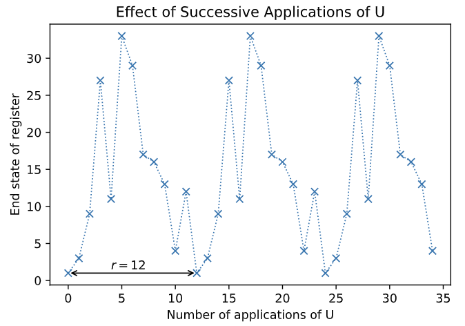

因此$U$的本征态$\left| U^{0} \right\rangle$在这一循环中可以是一个叠加态：

$$\left| u_{0} \right\rangle = \frac{1}{\sqrt{r} }\sum_{k = 0}^{r - 1}\left| a^{k}\ \text{mod}\ N \right\rangle$$

**提示：a=3及N=35的例子**

$${\left| u_{0} \right\rangle = \frac{1}{\sqrt{12} }\left( \left| 1 \right\rangle + \left| 3 \right\rangle + \left| 9 \right\rangle\cdots + \left| 4 \right\rangle + \left| 12 \right\rangle \right)
}{U\left| u_{0} \right\rangle = \frac{1}{\sqrt{12} }\left( U\left| 1 \right\rangle + U\left| 3 \right\rangle + \left| U9 \right\rangle\cdots + U\left| 4 \right\rangle + U\left| 12 \right\rangle \right)
}{\ \ \ \ \ \ \ \ \ \ \ \  = \frac{1}{\sqrt{12} }\left( \left| 3 \right\rangle + \left| 9 \right\rangle + \left| 27 \right\rangle\cdots + \left| 12 \right\rangle + \left| 1 \right\rangle \right)
}{\ \ \ \ \ \ \ \ \ \ \ \  = \left| u_{0} \right\rangle}$$

这一本征态有一个本征值1，因此该本征态并不让人感兴趣。一个更加有趣的本征态可能为不同于三个计算基状态的相位。让我们看一看与$k$相对应的$k$次状态的相位：

$$\left| u_{1} \right\rangle = \frac{1}{\sqrt{r} }\sum_{k = 0}^{r - 1}{e^{- \frac{2\pi\text{ik} }{r} }\left| a^{k}\ \text{mod}\ N \right\rangle}$$

$$U\left| u_{1} \right\rangle = e^{\frac{2\pi i}{r} }\left| u_{1} \right\rangle$$

**提示：a=3及N=35的例子**

$${\left| u_{1} \right\rangle = \frac{1}{\sqrt{12} }\left( \left| 1 \right\rangle + e^{- \frac{2\pi i}{12} }\left| 3 \right\rangle + e^{- \frac{4\pi i}{12} }\left| 9 \right\rangle\cdots + e^{- \frac{20\pi i}{12} }\left| 4 \right\rangle + e^{- \frac{22\pi i}{12} }\left| 12 \right\rangle \right)
}{U\left| u_{1} \right\rangle = \frac{1}{\sqrt{12} }\left( \left| 3 \right\rangle + e^{- \frac{2\pi i}{12} }\left| 9 \right\rangle + e^{- \frac{4\pi i}{12} }\left| 27 \right\rangle\cdots + e^{- \frac{22\pi i}{12} }\left| 12 \right\rangle + e^{- \frac{24\pi i}{12} }\left| 1 \right\rangle \right)
}{U\left| u_{1} \right\rangle = e^{\frac{2\pi i}{12} }\left| u_{1} \right\rangle}$$

（我们可以在相位的分母上看到$r = 12$）

这是一个特别有趣的本征值，因为其中包含$r$。以上并不是唯一有这种行为的本征态，为了将其泛化我们可以乘以一个整数$s$来形成这样的相位差，该相位差将出现在本征值中：

$$\left| u_{s} \right\rangle = \frac{1}{\sqrt{r} }\sum_{k = 0}^{r - 1}{e^{- \frac{2\pi\text{isk} }{r} }\left| a^{k}\ \text{mod}\ N \right\rangle}$$

$$U\left| u_{s} \right\rangle = e^{\frac{2\pi\text{is} }{r} }\left| u_{s} \right\rangle$$

**提示：a=3及N=35的例子**

$${\left| u_{s} \right\rangle = \frac{1}{\sqrt{12} }\left( \left| 1 \right\rangle + e^{- \frac{2\pi is}{12} }\left| 3 \right\rangle + e^{- \frac{4\pi is}{12} }\left| 9 \right\rangle\cdots + e^{- \frac{20\pi is}{12} }\left| 4 \right\rangle + e^{- \frac{22\pi is}{12} }\left| 12 \right\rangle \right)
}{U\left| u_{s} \right\rangle = \frac{1}{\sqrt{12} }\left( \left| 3 \right\rangle + e^{- \frac{2\pi is}{12} }\left| 9 \right\rangle + e^{- \frac{4\pi is}{12} }\left| 27 \right\rangle\cdots + e^{- \frac{22\pi is}{12} }\left| 12 \right\rangle + e^{- \frac{24\pi is}{12} }\left| 1 \right\rangle \right)
}{U\left| u_{s} \right\rangle = e^{\frac{2\pi is}{12} }\left| u_{s} \right\rangle}$$

至此在$0 < s < r - 1$中的每个本征值$s$都有唯一的本征态。非常方便吧！如果将所有本征态相加，不同的相位消除了除态$\left| 1 \right\rangle$之外的所有计算基的状态：

$$\frac{1}{\sqrt{r} }\sum_{k = 0}^{r - 1}\left| u_{s} \right\rangle = \left| 1 \right\rangle$$

**提示：a=7及N=15的例子**

我们将看一下a=7及N=15的情况，在这一情况下r=4：

$${\frac{1}{2}(\ \ \left| u_{0} \right\rangle = \frac{1}{2}\left( \left| 1 \right\rangle + \left| 7 \right\rangle + \left| 4 \right\rangle + \left| 13 \right\rangle \right)\cdots
}{+ \left| u_{1} \right\rangle = \frac{1}{2}\left( \left| 1 \right\rangle + e^{- \frac{2\pi i}{4} }\left| 7 \right\rangle + e^{- \frac{4\pi i}{4} }\left| 4 \right\rangle + e^{- \frac{6\pi i}{4} }\left| 13 \right\rangle \right)\cdots
}{+ \left| u_{2} \right\rangle = \frac{1}{2}\left( \left| 1 \right\rangle + e^{- \frac{4\pi i}{4} }\left| 7 \right\rangle + e^{- \frac{8\pi i}{4} }\left| 4 \right\rangle + e^{- \frac{12\pi i}{4} }\left| 13 \right\rangle \right)\cdots
}{+ \left| u_{3} \right\rangle = \frac{1}{2}\left( \left| 1 \right\rangle + e^{- \frac{6\pi i}{4} }\left| 7 \right\rangle + e^{- \frac{12\pi i}{4} }\left| 4 \right\rangle + e^{- \frac{18\pi i}{4} }\left| 13 \right\rangle \right)\ \ ) = \left| 1 \right\rangle}$$

我们可以看出计算基的状态$\left| 1 \right\rangle$是政协本征态中的叠加态，表明如果使用态$\left| 1 \right\rangle$在$U$上进行量子相位估计，我们将会测的如下相位：

$$\phi = \frac{s}{r}$$

其中$s$是$0$至$r - 1$之间的一个随机整数。我们最终在$\phi$上使用连分式算法来找出$r$。该量子回路的图解如下所示：

接下来我将会使用Qiskit的模拟器来证明Shor算法。对于这一证明过程，我们将直接给出$U$的量子回路而不经解释，但在本章的第4节中捡回讨论如何有效地构建$U^{2^{j} }$的量子回路。

### 3. Qiskit实现

在这一示例中我们将会解决a=7和N=15的周期找寻问题。我给出如下$U$回路且不经解释：

$$U|y\rangle = |ay\ mod\ 15\rangle$$

为了创建$U^{x}$，只需简单地重复这一回路$x$次。在下一节中我们将会讨论创建这些有效量子回路的通用方法。函数c_amod15返回a的重复指数次的受控U-gate。

> def c_amod15(a, power):
>
> \"\"\"Controlled multiplication by a mod 15\"\"\"
>
> if a not in \[2,7,8,11,13\]:
>
> raise ValueError(\"\'a\' must be 2,7,8,11 or 13\")
>
> U = QuantumCircuit(4)
>
> for iteration in range(power):
>
> if a in \[2,13\]:
>
> U.swap(0,1)
>
> U.swap(1,2)
>
> U.swap(2,3)
>
> if a in \[7,8\]:
>
> U.swap(2,3)
>
> U.swap(1,2)
>
> U.swap(0,1)
>
> if a == 11:
>
> U.swap(1,3)
>
> U.swap(0,2)
>
> if a in \[7,11,13\]:
>
> for q in range(4):
>
> U.x(q)
>
> U = U.to_gate()
>
> U.name = \"%i\^%i mod 15\" % (a, power)
>
> c_U = U.control()
>
> return c_U

我们还给出了逆量子傅立叶变换的量子回路：

> def qft_dagger(n):
>
> \"\"\"n-qubit QFTdagger the first n qubits in circ\"\"\"
>
> qc = QuantumCircuit(n)
>
> \# Don\'t forget the Swaps!
>
> for qubit in range(n//2):
>
> qc.swap(qubit, n-qubit-1)
>
> for j in range(n):
>
> for m in range(j):
>
> qc.cu1(-np.pi/float(2\*\*(j-m)), m, j)
>
> qc.h(j)
>
> qc.name = \"QFT†\"
>
> return qc

通过这些基本构成要素，我们可以轻易的构建Shor算法的量子回路：

> \# Specify variables
>
> n_count = 8 \# number of counting qubits
>
> a = 7
>
> \# Create QuantumCircuit
>
> qc = QuantumCircuit(4+n_count, n_count)
>
> \# Initialise counting qubits
>
> \# in state \|+\>
>
> for q in range(n_count):
>
> qc.h(q)
>
> \# And ancilla register in state \|1\>
>
> qc.x(3+n_count)
>
> \# Do controlled-U operations
>
> for q in range(n_count):
>
> qc.append(c_amod15(a, 2\*\*q),
>
> \[q\] + \[i+n_count for i in range(4)\])
>
> \# Do inverse-QFT
>
> qc.append(qft_dagger(n_count), range(n_count))
>
> \# Measure circuit
>
> qc.measure(range(n_count), range(n_count))
>
> qc.draw(\'text\')

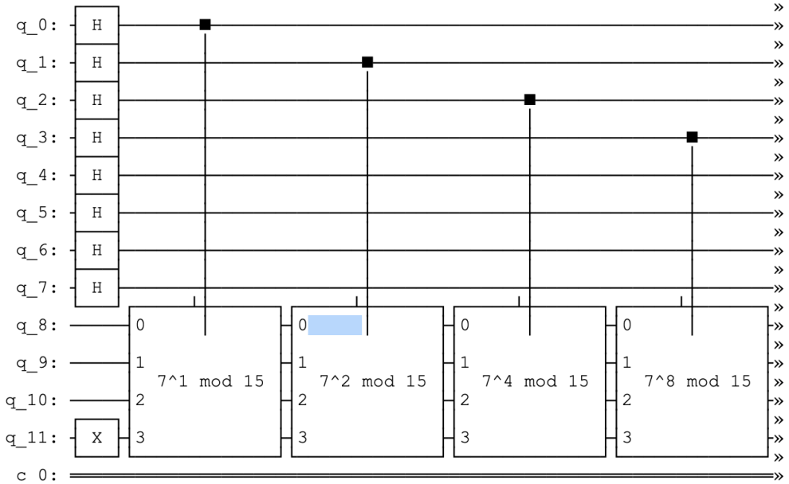

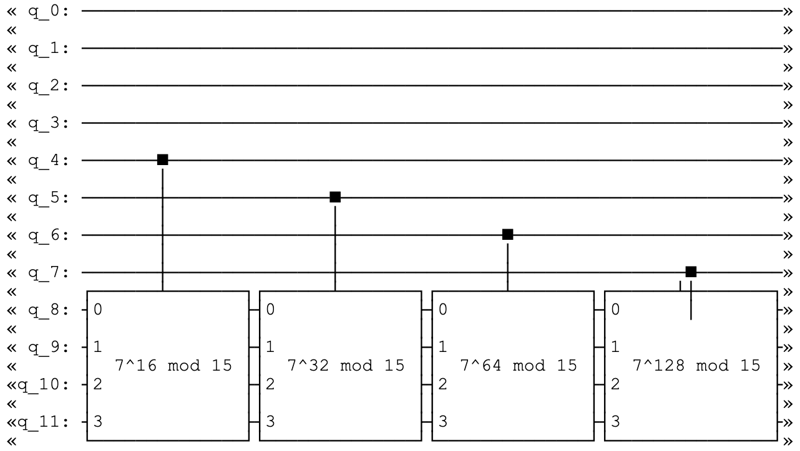

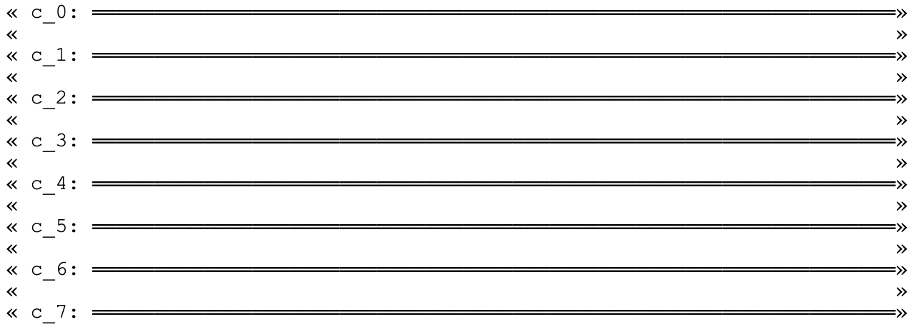

让我们看一下测量的结果是什么：

> backend = Aer.get_backend(\'qasm_simulator\')
>
> results = execute(qc, backend, shots=2048).result()
>
> counts = results.get_counts()
>
> plot_histogram(counts)
>
> 输出：

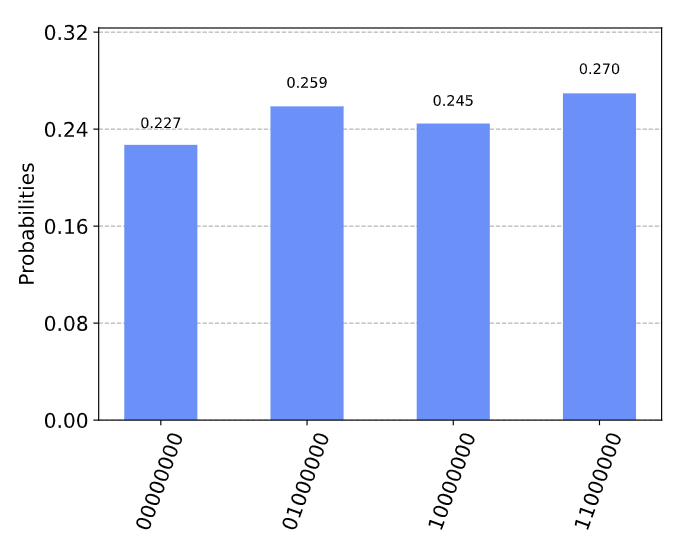

由于我们有3个量子比特，与测得相位对应的结果为：

> rows, measured_phases = \[\], \[\]
>
> for output in counts:
>
> decimal = int(output, 2) \# Convert (base 2) string to decimal
>
> phase = decimal/(2\*\*n_count) \# Find corresponding eigenvalue
>
> measured_phases.append(phase)
>
> \# Add these values to the rows in our table:
>
> rows.append(\[\"%s(bin) = %i(dec)\" % (output, decimal), \"%i/%i =
> %.2f\" % (decimal, 2\*\*n_count, phase)\])
>
> \# Can use tabulate to print the rows this as a nice ASCII table:
>
> print(tabulate(rows, headers=\[\"Register Output\", \"Phase\"\],
> colalign=\[\"left\",\"right\"\]))
>
> 输出：

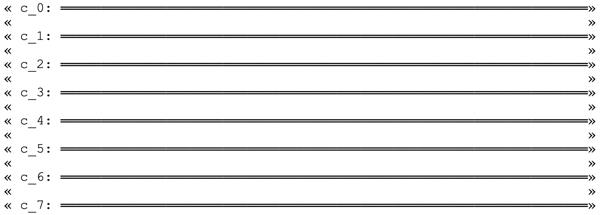

我们可以使用Python内建的Fractions模块将浮点数转换为分数对象：

> Fraction(0.666)
>
> 输出：
>
> Fraction(5998794703657501, 9007199254740992)
>
> 5998794703657501/9007199254740992
>
> 输出：
>
> 0.666

因其给出的分数返回精确的结果(在本例中是0.6660000...)，所以可能会得到类似上面粗糙结果。我们可以使用.limit_denominator()方法来获得分母在某一值以下的最接近浮点数的分数:

> \# Get fraction that most closely resembles 0.666
>
> \# with denominator \< 15
>
> Fraction(0.666).limit_denominator(15)
>
> 输出：
>
> Fraction(2, 3)

好多了！阶(r)肯定小于N，所以我们把最大分母设为15：

> rows = \[\]
>
> for phase in measured_phases:
>
> frac = Fraction(phase).limit_denominator(15)
>
> rows.append(\[phase, \"%i/%i\" % (frac.numerator, frac.denominator),
> frac.denominator\])
>
> \# Print as a table
>
> headers=\[\"Phase\", \"Fraction\", \"Guess for r\"\]
>
> df = pd.DataFrame(rows, columns=headers)
>
> print(df)
>
> Phase Fraction Guess for r
>
> \-\-\-\-\-\-- \-\-\-\-\-\-\-\-\-- \-\-\-\-\-\-\-\-\-\-\-\--
>
> 0.75 3/4 4
>
> 0.5 1/2 2
>
> 0.25 1/4 4
>
> 0 0/1 1

可以看到其中两个测得的本征值给出了正确的结果：$r = 4$，并且还能看出Shor算法有失效的可能。这些错误的结果由于$s = 0$，或者由于$s$和$r$互素并且我们被给予了$r$的一个因子而非$r$。最简单的解决方案是简单地重复这一实验,直到得到令人满意的结果$r$。

#### 快速练习

-   用$a = 2、8、11和13$修改上述的回路。您所获的结果是什么？为何？

### 4. 模幂运算

您可能已经察觉到通过重复与𝑗呈指数级增长的$U$创建$U^{2^{j} }$的方法，并且不会得到多项式时间算法。我们想要找出创建与𝑗呈指数级增长的如下算子的方法：

$$U^{2^{j} }\left| y \right\rangle = \left| a^{2^{j} }y\ \text{mod}\ N \right\rangle$$

幸运的是有可能有效的计算下式：

$$a^{2^{j} }\ \text{mod}\ N$$

经典计算机能够使用反复平方法（repeated-squaring
algorithm）来计算出指数。在我们的案例中，由于仅需处理$2^{j}$形式的指数，反复平方法就会变得非常简单：

> def a2jmodN(a, j, N):
>
> \"\"\"Compute a\^{2\^j} (mod N) by repeated squaring\"\"\"
>
> for i in range(j):
>
> a = np.mod(a\*\*2, N)
>
> return a
>
> a2jmodN(7, 2049, 53)
>
> 输出：
>
> 47

如果在Python中存在一个有效的算法，那么就可以在量子计算机上使用相同的算法。但很不幸的是：尽管用$j$进行了多项式缩放，模幂运算回路仍不简单,此为Shor算法的瓶颈。一个对初学者友好的实现可以在参考文献\[1\]中找到。

### 5. 周期找寻求因式分解

并非所有的因式分解问题都是困难的；我们可以立即发现一个偶数的因子之一是2。事实上存在一些难以找出因子的数字的[具体标准](https://nvlpubs.nist.gov/nistpubs/FIPS/NIST.FIPS.186-4.pdf#%5B%7B%22num%22%3A127%2C%22gen%22%3A0%7D%2C%7B%22name%22%3A%22XYZ%22%7D%2C70%2C223%2C0%5D)，但基本思想是选择两个大素数的乘积。

在使用Shor周期找寻算法应对最坏的情况的情况前，一个通用因式分解算法首先会检查是否存在分解一个整数的捷径（数字是偶数吗？数字是不是$N = a^{b}$的形式？）。由于目标是算法的量子部分，我们将直接跳到N是两个素数乘积的情况。

#### 示例：因式分解15

为了观察分解少量量子比特的例子，我们将因式分解由不太大的质数3和5的乘积15。

N = 15

第一步是在$1$和$N - 1$之间选择一个随机数字$x$：

> np.random.seed(1) \# This is to make sure we get reproduceable results
>
> a = randint(2, 15)
>
> print(a)
>
> 输出：
>
> 7

接着快速检查这一数字是否是N的非平凡因子（注：若x能整除n且1\<x\<n，则x是n的非平凡因子）。

> from math import gcd \# greatest common divisor
>
> gcd(a, 15)
>
> 输出：
>
> 1

下一步对a=7和N=15使用Shor的阶找寻算法。记住！我们测量的相位是$s/r$，其中：

$$a^{r}\ \text{mod}\ N = 1$$

$s$是$0$和$r - 1$之间的一个随机整数。

> def qpe_amod15(a):
>
> n_count = 3
>
> qc = QuantumCircuit(4+n_count, n_count)
>
> for q in range(n_count):
>
> qc.h(q) \# Initialise counting qubits in state \|+\>
>
> qc.x(3+n_count) \# And ancilla register in state \|1\>
>
> for q in range(n_count): \# Do controlled-U operations
>
> qc.append(c_amod15(a, 2\*\*q),
>
> \[q\] + \[i+n_count for i in range(4)\])
>
> qc.append(qft_dagger(n_count), range(n_count)) \# Do inverse-QFT
>
> qc.measure(range(n_count), range(n_count))
>
> \# Simulate Results
>
> backend = Aer.get_backend(\'qasm_simulator\')
>
> \# Setting memory=True below allows us to see a list of each
> sequential reading
>
> result = execute(qc, backend, shots=1, memory=True).result()
>
> readings = result.get_memory()
>
> print(\"Register Reading: \" + readings\[0\])
>
> phase = int(readings\[0\],2)/(2\*\*n_count)
>
> print(\"Corresponding Phase: %f\" % phase)
>
> return phase

对于这一相位，我们可以轻易的找出$r$的一个猜测。

> np.random.seed(3) \# This is to make sure we get reproduceable results
>
> phase = qpe_amod15(a) \# Phase = s/r
>
> Fraction(phase).limit_denominator(15) \# Denominator should
> (hopefully!) tell us r
>
> 输出：
>
> Register Reading: 100
>
> Corresponding Phase: 0.500000
>
> Fraction(1, 2)
>
> frac = Fraction(phase).limit_denominator(15)
>
> s, r = frac.numerator, frac.denominator
>
> print(r)
>
> 输出：
>
> 2

至此我们获得了$r$，我们可以使用这个数字来找出$N$的一个因子。

由于：

$$a^{r}\ \text{mod}\ N = 1$$

然后：

$$(a^{r} - 1)\ \text{mod}\ N = 0$$

表明$N$整除$a^{r} - 1$。如果$r$还是一个偶数，则：

$$a^{r} - 1 = (a^{\frac{r}{2} } - 1)(a^{\frac{r}{2} } + 1)$$

（如果$r$不是偶数就不能继续了，必须用不同的$a$值再试一次。）那么有很大的概率$a^{\frac{r}{2} } - 1$或$a^{\frac{r}{2} } + 1$的最大公约数是$N$的一个因子
\[2\]。

> guesses = \[gcd(a\*\*(r//2)-1, N), gcd(a\*\*(r//2)+1, N)\]
>
> print(guesses)
>
> 输出：
>
> \[3,1\]

下面代码中将重复算法直到至少找出15的一个因子。您应该再次运行这些代码多次来查看其作用。

> a = 7
>
> factor_found = False
>
> attempt = 0
>
> while not factor_found:
>
> attempt += 1
>
> print(\"\\nAttempt %i:\" % attempt)
>
> phase = qpe_amod15(a) \# Phase = s/r
>
> frac = Fraction(phase).limit_denominator(15) \# Denominator should
> (hopefully!) tell us r
>
> r = frac.denominator
>
> print(\"Result: r = %i\" % r)
>
> if phase != 0:
>
> \# Guesses for factors are gcd( x\^{r/2} ±1 , 15)
>
> guesses = \[gcd(a\*\*(r//2)-1, 15), gcd(a\*\*(r//2)+1, 15)\]
>
> print(\"Guessed Factors: %i and %i\" % (guesses\[0\], guesses\[1\]))
>
> for guess in guesses:
>
> if guess != 1 and (15 % guess) == 0: \# Check to see if guess is a
> factor
>
> print(\"\*\*\* Non-trivial factor found: %i \*\*\*\" % guess)
>
> factor_found = True
>
> 输出：
>
> Attempt 1:
>
> Register Reading: 110
>
> Corresponding Phase: 0.750000
>
> Result: r = 4
>
> Guessed Factors: 3 and 5
>
> \*\*\* Non-trivial factor found: 3 \*\*\*
>
> \*\*\* Non-trivial factor found: 5 \*\*\*

### 6. 参考文献

1\. Stephane Beauregard, Circuit for Shor\'s algorithm using 2n+3
qubits, [arXiv:quant-ph/0205095](https://arxiv.org/abs/quant-ph/0205095)

2\. M. Nielsen and I. Chuang, Quantum Computation and Quantum
Information, Cambridge Series on Information and the Natural Sciences
(Cambridge University Press, Cambridge, 2000). (Page 633)

3.10 Grover\'s Algorithm（量子搜寻算法）
----------------------------------------

在本节中，我们引入Grover算法并解释其如何用于解决非结构化搜索问题。然后使用Qiskit实现这一量子算法，并在模拟器和真实设备上运行该算法。

### 内容

1\. 简介

2\. 示例：2-量子比特

2.1 Qiskit实现

2.1.1 模拟器

2.1.2 真实设备

3\. 示例：3-量子比特

3.1 模拟器

3.2 真实设备

4\. 练习

5\. 参考文献

### 1. 简介

您可能已经听过量子计算机相对于传统计算机所具有的众多优势之一是其卓越的数据库搜索速度。Grover算法证明了这一能力。该算法可以对非结构化搜索问题进行二次加速，但是其用途不仅限于此；其可以用作通用技巧或子例程，让各种其他算法获得二次运行时间的改进。这被称为幅值放大技巧。

#### 非结构化搜索

假设给您一个有$N$个项目的大列表。在这些项目中有一个项目具有独特的属性，我们希望将其找出；我们将其称为赢家$\omega$。我们将列表中的每一项看作是一个特定颜色的框。假设除了紫色的赢家$\omega$之外，列表中的所有项目都是灰色。

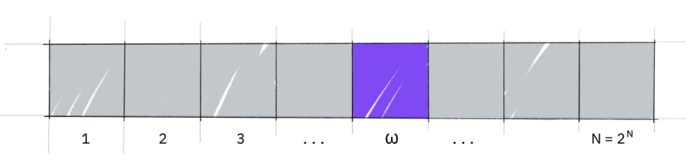

为了找出紫色的框------标记项------使用经典计算方法将会检查至少$N/2$个框，最差的情况需要检查全部项目。然而在一个量子计算机上，我们可以使用Grover幅值放大技巧在大致$\sqrt{N}$步内找出被标记项。在查找长列表中的标记项时，二次加速确实可以节省大量时间。此外，该算法不使用列表的内部结构，使其具有通用性；这就是为什么这一算法立即为许多经典问题提供了二次量子加速的原因。

#### 创建一个预言

对于章中的例子，我们的"数据库"是由量子比特可能所处的所有计算基的状态组成。例如,如果我们有3个量子比特,列表是态$|000\rangle|001\rangle\ldots\ldots|111\rangle$(即态$|0\rangle$→态$|7\rangle$)。

Grover算法解决了在解态上添加负相位的预言。即对任意态$|x\rangle$其计算基为:

$$U_{\omega}|x\rangle = \{\begin{matrix}
\text{\ \ \ }\left| x \right\rangle\text{\ \ \ }\text{if}\text{\ \ \ }x \neq \omega \\
 - \left| x \right\rangle\text{\ \ \ }\text{if}\text{\ \ \ }x = \omega \\
\end{matrix}$$

这个预言将是一个对角矩阵，其中对应于标记项的条目将具有一个负相位。例如,如果我们有三个量子比特和$\omega = 101$,改预言将是矩阵:

$$U_{\omega} = \begin{bmatrix}
1 & 0 & 0 & 0 & 0 & 0 & 0 & 0 \\
0 & 1 & 0 & 0 & 0 & 0 & 0 & 0 \\
0 & 0 & 1 & 0 & 0 & 0 & 0 & 0 \\
0 & 0 & 0 & 1 & 0 & 0 & 0 & 0 \\
0 & 0 & 0 & 0 & 1 & 0 & 0 & 0 \\
0 & 0 & 0 & 0 & 0 & - 1 & 0 & 0 \\
0 & 0 & 0 & 0 & 0 & 0 & 1 & 0 \\
0 & 0 & 0 & 0 & 0 & 0 & 0 & 1 \\
\end{bmatrix}\begin{matrix}
 \\
 \\
 \\
 \\
 \\
 \\
 \leftarrow \omega = \text{101} \\
 \\
 \\
 \\
\end{matrix}$$

是什么导致Grover算法可以如此轻易将一个问题转换为如此形势的预言呢？在许多计算问题中很难*找出*一个解，但比较容易*验证*一个解。例如通过检查是否满足所有规则，我们可以很容易地验证一个数独游戏的解。对于这些问题,我们可以创建一个函数$f$并输入预想的解$x$,在$x$并非解时$(x \neq \omega)$返回$f(x) = 0$和在$x$是一个有效解$(x = \omega)$时返回$f(x) = 1$。我们的预言可以这样描述:

$$U_{\omega}|x\rangle = ( - 1)^{f(x)}|x\rangle$$

此时预言矩阵将是对角矩阵的形式：

$$U_{\omega} = \begin{bmatrix}
( - 1)^{f\left( 0 \right)} & 0 & \cdots & 0 \\
0 & ( - 1)^{f\left( 1 \right)} & \cdots & 0 \\
 \vdots & 0 & \ddots & \vdots \\
0 & 0 & \cdots & ( - 1)^{f\left( 2^{n} \right)} \\
\end{bmatrix}$$

**提示：一个Grover预言的回路结构**

若有一经典函数$f(x)$，我们可以将其转换为如下形式的可逆回路：

如果我们将"输出"量子比特初始化为态$| - \rangle$，相位反冲效果会将其转换为一个Grover预言（类似于Deutsch-Jozsa预言的作用效果）：

然后我们忽略辅助量子比特（$| - \rangle$）。

如何将列表项提供给量子计算机呢？编码此类列表的一种常见方法是使用函数$f$，该函数对所有未标记项$x$返回$f(x) = 0$，对赢家返回$f(w) = 1$。若要使用量子计算机来解决这一问题，我们必须向这一函数给出这些项目的叠加态，所以我们将这个函数编码成一个称为*预言*的幺正矩阵。首先，我们对这些项目进行二进制编码$x,w \in {\{ 0,1\} }^{n}$，因此$N = 2^{n}$；现在我们可以在量子计算机上用量子比特来表示这些项目。然后定义一个预言矩阵$U_{f}$执行任一简单操作，通过$U_{f}\left| x \right\rangle = {( - 1)}^{f(x)}|x\rangle$规范基$|x\rangle$的状态。

可以看出如果$x$是一个没有标记的项目，则预言就不会改变其状态。然而，当我们在基态$|\omega\rangle$上应用预言时，就会将其映射为$U_{f}\left| w \right\rangle = - |\omega\rangle$。从几何上讲，这一幺正矩阵对应于关于$N = 2^{n}$维向量空间中标记项原点的反射。

#### 幅值放大

那么这一算法是如何工作的呢？在看项目清单之前，我们不知道标记项在哪里。因此对其位置的任何猜测都相同，可以用均匀叠加的形式表示：$\left| s \right\rangle = \frac{1}{\sqrt{N} }\sum_{x = 0}^{N - 1}{|x\rangle}$。

如果我们在标准基$\{|x\rangle\}$下测量，依据第五量子定律这一叠加态将会坍缩，导致任一基态都将是同样的概率$\frac{1}{N} = \frac{1}{2^{n} }$。我们猜到正确$\omega$值的几率是可预见的$\frac{1}{2^{n} }$。因此，通常来说我们需要尝试$N = 2^{n}$次才能猜到正确项目。

这是一个叫做幅值放大的过程，量子计算机就是这样显著地提高了这种可能性。这以过程扩展（放大）标记项的幅值从而缩小其他项的幅值，因此测量最终状态将近乎确定地返回正确的项目。

该算法对两种反射具有良好的几何推断，会在二维平面中产生一个旋转。我们需要考虑的只有两中特殊的状态：赢家$|\omega\rangle$和均匀叠加$|s\rangle$。这两个向量在向量空间$\mathbb{C}^{N}$中张成一个二维平面。这两个向量之间并非相互垂直,因为$|\omega\rangle$出现在幅值为$N^{- 1/2}$的叠加态中。然而，我们可以在这两个向量张成的平面中引入一个附加状态$|s'\rangle$，使其垂直于$|\omega\rangle$并通过移除$|\omega\rangle$和尺度变换从$|s\rangle$中获取这一附加状态。

**步骤1**：幅值放大过程以均匀叠加$|s\rangle$开始,其很容易由$\left| s \right\rangle = H^{\bigotimes n}{|0\rangle}^{n}$构建。

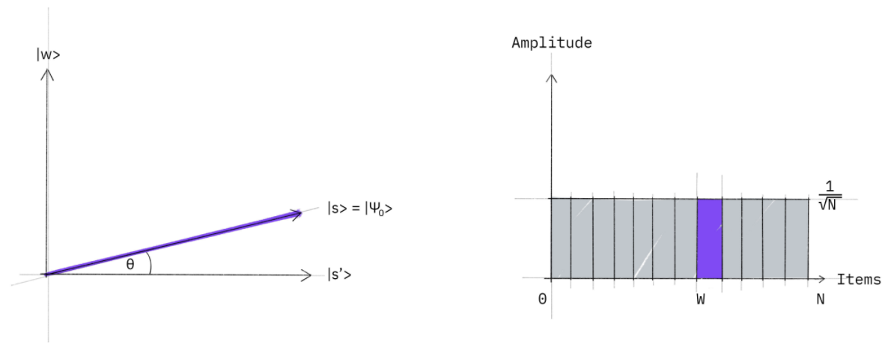

左边的图对应于由相互垂直的向量$|w\rangle$和$|s'\rangle$张成的二位平面，可将初始状态表述为$|s\rangle = sin\theta|\omega\rangle + cos\theta|s'\rangle$，其中$\theta = \arcsin\langle s|\omega\rangle = arcsin\frac{1}{\sqrt{N} }$。右边的图为$N = 2^{2} = 4$情况下态$|s\rangle$幅值的柱状图，平均幅值用虚线表示。

**步骤2**：应用预言反射$U_{f}$至态$|s\rangle$。

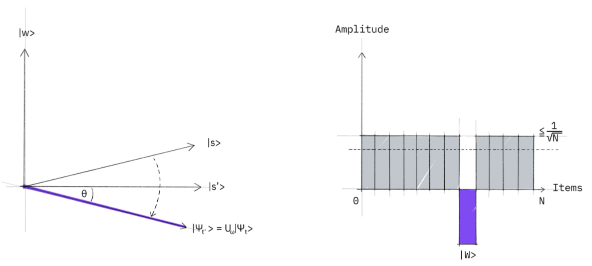

从几何上来说这一过程对应于关于$|s'\rangle$的态$|s\rangle$的反射。这一变换意味着先前态$|w\rangle$的幅值变为负值，同时平均幅值变小。

**步骤3**：现在在态$|s\rangle$应用一个额外的反射（$U_{s}$）:$U_{s} = 2|s\rangle\langle s| - \mathbb{1}$。这一变换将态$|s\rangle$映射至$U_{s}U_{f}|s\rangle$并完成了整个变换过程。

两次反射始终对应于一个旋转。变换$U_{s}U_{f}$将初始态$|s\rangle$旋转至赢家$|\omega\rangle$附近。在幅值的条形图解中反射$U_{s}$的动作可被理解为关于平均幅值的反射。由于在第一个反射之后平均幅值变小了，这一变换将$|w\rangle$的幅值提高至原来的三倍，也同时减小了其他幅值。然后重复步骤2中的应用。这一过程将重复几次，以锁定赢家$|w\rangle$。

经过$t$步后，我们将获得态$|\psi_{t}\rangle$，其中$|\psi_{t}\rangle = {(U_{s}U_{f})}^{t}|s\rangle$。

我们需要应用多少次旋转呢？事实证明大约$\sqrt{N}$次足矣。在观察态$|\psi\rangle$的幅值时就清楚了。我们可以看到态$|\psi\rangle$的幅值随着应用次数$tN^{- 1/2}$的增加呈现线性增长。然而，由于我们关心的是幅值并非概率，所以向量空间的维数以平方根的形式输入。因此在这一过程中被放大的不仅是概率还有幅值。在有$M$个解的情况下，可以看出大约$\sqrt{(N/M)}$次旋转就足够了。

### 2. 示例：2-量子比特

我们首先看一下用两个量子比特实现Grover算法$N = 4$的情况。在这一与直觉相反的特殊情况中，只需要一次旋转就可以将初始态$|s\rangle$变换为赢家$|\psi\rangle$（参阅参考文献\[3\]）。

1\. 依据上文的介绍，在$N = 4$时我们有：

$$\theta = \arcsin\frac{1}{2} = \frac{\pi}{6}$$

2\. 经过$t$步后：

$${(U_{s}U_{f})}^{t}\left| s \right\rangle = \sin\theta_{t}\left| \omega \right\rangle + \cos\theta_{t}|s'\rangle$$

其中：

$$\theta_{t} = (2t + 1)\theta$$

3\.
为了获得$\left| \omega \right\rangle$需要$\theta_{t} = \frac{\pi}{2}$，当插入$\theta = \frac{\pi}{6}$时上面的结果为$t = 1$。这表明在$t = 1$的旋转后，想要搜索的元素就被找出来了。

现在让我们考察一下可能的预言。我们有$N = 4$个可能的元素，如：$\left| 00 \right\rangle$、$\left| 01 \right\rangle$、$\left| 10 \right\rangle$和$\left| 11 \right\rangle$，因此总共需要4个预言。

#### $\mathbf{|}\mathbf{w}\mathbf{\rangle = |11\rangle}$的预言

我们从$|w\rangle = |11\rangle$的情况开始。在此情况中预言$U_{f}$按照如下步骤作用：

$$U_{f}\left| s \right\rangle = U_{f}\frac{1}{2}\left( \left| 00 \right\rangle + \left| 01 \right\rangle + \left| 10 \right\rangle + \left| 11 \right\rangle \right) = \frac{1}{2}\left( \left| 00 \right\rangle + \left| 01 \right\rangle + \left| 10 \right\rangle - \left| 11 \right\rangle \right)$$

为了实现$|11\rangle$的符号翻转，我们只需要对初始状态施加一个受控Z门即可。这会导出以下回路：

#### $\mathbf{|}\mathbf{\omega}\mathbf{\rangle = |00\rangle}$的预言

在$|w\rangle = |\mathbf{00}\rangle$的情况中预言$U_{f}$按照如下步骤作用：

$$U_{f}\left| s \right\rangle = U_{f}\frac{1}{2}\left( \left| 00 \right\rangle + \left| 01 \right\rangle + \left| 10 \right\rangle + \left| 11 \right\rangle \right) = \frac{1}{2}\left( - \left| 00 \right\rangle + \left| 01 \right\rangle + \left| 10 \right\rangle + \left| 11 \right\rangle \right)$$

为了实现$|00\rangle$的符号翻转，我们需要对初始状态施加"反相"受控Z门，从而导出以下回路：

#### $\mathbf{|}\mathbf{w}\mathbf{\rangle = |01\rangle}$和$\mathbf{|}\mathbf{w}\mathbf{\rangle = |10\rangle}$的预言

按照上述逻辑，可以直接构造$|\omega\rangle = |01\rangle$（左侧的回路）和$|\omega\rangle = |10\rangle$（右侧的回路）的预言：

#### 反射$\mathbf{U}_{\mathbf{s} }$

为了完成这一量子回路，我们需要实现一个额外的反射$U_{s} = 2|s\rangle\langle s| - \mathbb{1}$。由于这是关于$|s\rangle$的反射，因此我们想向与$|s\rangle$正交的每个状态添加一个负相位。

想要做到这一点的一种方法是利用使$|s\rangle \rightarrow \left| 0 \right\rangle$的变换操作，我们已经知道这是应用于每个量子比特的阿达马门：

$$H^{\bigotimes n}|s\rangle = |0\rangle$$

然后在态$|0\rangle$上应用添加一个负相位的回路：

$$U_{0}\frac{1}{2}\left( \left| 00 \right\rangle + \left| 01 \right\rangle + \left| 10 \right\rangle + \left| 11 \right\rangle \right) = \frac{1}{2}\left( \left| 00 \right\rangle - \left| 01 \right\rangle - \left| 10 \right\rangle - \left| 11 \right\rangle \right)$$

即：除了$|00\rangle$之外，每个状态的符号都被翻转了。我们可以很容易地验证，实现$U_{0}$的一种方法是以下的回路：

最后，我们进行将态$\left| 0 \right\rangle$变换为$|s\rangle$的操作（在此应用H-gate）：

$$H^{\bigotimes n}U_{0}H^{\bigotimes n} = U_{s}$$

完整的$U_{s}$回路看起来如下图的样子：

注意！该回路实际上在态$|s\rangle$上增加了一个负相位，并使所有正交的态保持不变，因此该回路实现了${- U}_{s}$。幸运的是，此相位是全局相位，可以安全地忽略。

#### $\mathbf{|}\mathbf{\omega}\mathbf{\rangle = |00\rangle}$的完整回路

由于$N = 4$的特定情况仅需一次旋转，我们可以用上面的组件为$|\omega\rangle = |00\rangle$情况的Grover算法构建完整的回路：

另三个量子回路可用同样的方式构建，此处就不再累述了。

#### 2.1 Qiskit实现

现在我们实现上文中两个量子比特$|\omega\rangle = |00\rangle$情况的Grover算法。

> \#initialization
>
> import matplotlib.pyplot as plt
>
> import numpy as np
>
> %matplotlib inline
>
> %config InlineBackend.figure_format = \'svg\' \# Makes the images look
> nice
>
> \# importing Qiskit
>
> from qiskit import IBMQ, Aer
>
> from qiskit.providers.ibmq import least_busy
>
> from qiskit import QuantumCircuit, ClassicalRegister, QuantumRegister,
> execute
>
> \# import basic plot tools
>
> from qiskit.visualization import plot_histogram

我们通过准备一个包含两个量子比特的量子回路开始：

> n = 2
>
> grover_circuit = QuantumCircuit(n)

然后，我们只需简单地写出上文中所描绘回路的命令。

> def initialize_s(qc, qubits):
>
> \"\"\"Apply a H-gate to \'qubits\' in qc\"\"\"
>
> for q in qubits:
>
> qc.h(q)
>
> return qc

首先，初始化态$|s\rangle$：

> grover_circuit = initialize_s(grover_circuit, \[0,1\])
> grover_circuit.draw(\'mpl\')
>
> 输出：

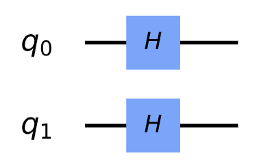

将预言应用于$|w\rangle = |00\rangle$：

> for qubit in range(n):
>
> grover_circuit.x(qubit)
>
> grover_circuit.cz(0, 1)
>
> for qubit in range(n):
>
> grover_circuit.x(qubit)
>
> grover_circuit.draw(\'mpl\')
>
> 输出：

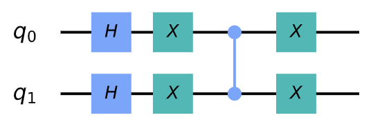

在两个量子比特上都应用一个阿达马操作：

> for qubit in range(n):
>
> grover_circuit.h(qubit)
>
> grover_circuit.draw(\'mpl\')
>
> 输出：

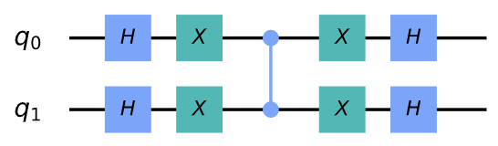

应用$U_{s}$反射：

> for qubit in range(n):
>
> grover_circuit.z(qubit)
>
> grover_circuit.cz(0, 1)
>
> grover_circuit.draw(\'mpl\')
>
> 输出：

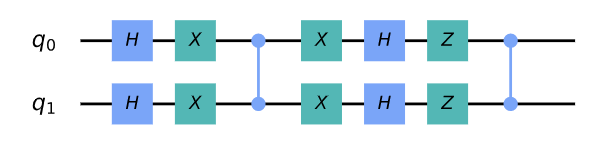

在两个量子比特上都应用最后的H-gate：

> for qubit in range(n):
>
> grover_circuit.h(qubit)
>
> grover_circuit.draw(\'mpl\')
>
> 输出：

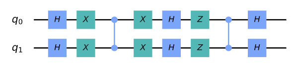

可以看到我们已经组装出了正确的回路。

##### 2.1.1 在模拟器中实验

我们在模拟器中运行这一回路来堆砌进行测试。首先，我们可以验证获取了正确的态向量：

> backend_sim = Aer.get_backend(\'statevector_simulator\')
>
> job_sim = execute(grover_circuit, backend_sim)
>
> statevec = job_sim.result().get_statevector()
>
> from qiskit_textbook.tools import vector2latex
>
> vector2latex(statevec, pretext=\"\|\\\\psi\\\\rangle =\")

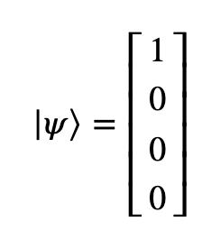

现在测量其状态，并创建相应的直方图：

> grover_circuit.measure_all()
>
> backend = Aer.get_backend(\'qasm_simulator\')
>
> shots = 1024
>
> results = execute(grover_circuit, backend=backend,
> shots=shots).result()
>
> answer = results.get_counts()
>
> plot_histogram(answer)

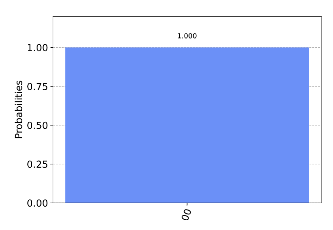

我们验证了找出元素$|00\rangle$概率为100%。

##### 2.1.2 在真实的设备上实验

我们可以在真实的设备上运行这一回路。

> \# Load IBM Q account and get the least busy backend device
>
> provider = IBMQ.load_account()
>
> device = least_busy(provider.backends(filters=lambda x:
> x.configuration().n_qubits \>= 3 and
>
> not x.configuration().simulator and x.status().operational==True))
>
> print(\"Running on current least busy device: \", device)
>
> 输出：
>
> Running on current least busy device: ibmq_ourense
>
> \# Run our circuit on the least busy backend. Monitor the execution of
> the job in the queue
>
> from qiskit.tools.monitor import job_monitor
>
> job = execute(grover_circuit, backend=device, shots=1024,
> max_credits=10)
>
> job_monitor(job, interval = 2)
>
> 输出：
>
> Job Status: job has successfully run
>
> \# Get the results from the computation
>
> results = job.result()
>
> answer = results.get_counts(grover_circuit)
>
> plot_histogram(answer)
>
> 输出：

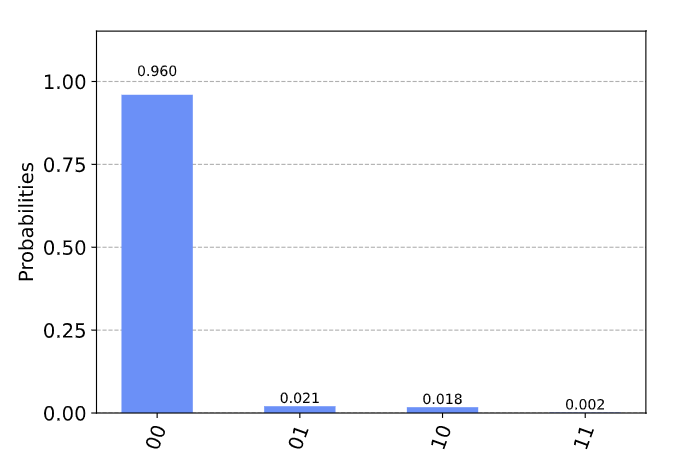

我们验证了在大多数情况下可以找出元素$|00\rangle$。其他是由量子计算中的错误产生的结果。

### 3. 示例：3-量子比特

现在我们将快速浏览包含两个标记态$|101\rangle$和$|110\rangle$的3-量子比特Grover算法的示例，该示例依据参考文献\[2\]的实现。这一量子回路使用相位预言处理该问题：

1\.
在三个量子比特上应用H-gate初始化态$|000\rangle$来创建一个均匀的叠加态：

$$\left| \psi_{1} \right\rangle = \frac{1}{8}\left( \left| 000 \right\rangle + \left| 001 \right\rangle + \left| 011 \right\rangle + \left| 100 \right\rangle + \left| 101 \right\rangle + \left| 110 \right\rangle + \left| 111 \right\rangle \right)$$

2\. 使用相位预言标记态$|101\rangle$和$|110\rangle$：

$$\left| \psi_{2} \right\rangle = \frac{1}{8}\left( \left| 000 \right\rangle + \left| 001 \right\rangle + \left| 011 \right\rangle + \left| 100 \right\rangle - \left| 101 \right\rangle - \left| 110 \right\rangle + \left| 111 \right\rangle \right)$$

3\. 绕平均幅值执行反射操作：

1\. 在各个量子比特上应用H-gate：

$$\left| \psi_{3a} \right\rangle = \frac{1}{2}\left( \left| 000 \right\rangle + \left| 011 \right\rangle + \left| 100 \right\rangle - \left| 111 \right\rangle \right)$$

2\. 在各个量子比特上应用X-gate：

$$\left| \psi_{3b} \right\rangle = \frac{1}{2}\left( - \left| 000 \right\rangle + \left| 011 \right\rangle + \left| 100 \right\rangle + \left| 111 \right\rangle \right)$$

> 3\.
> 在量子比特1和2（控制端）与量子比特3（目标端）应用一个双受控Z-gate：

$$\left| \psi_{3c} \right\rangle = \frac{1}{2}\left( - \left| 000 \right\rangle + \left| 011 \right\rangle + \left| 100 \right\rangle - \left| 111 \right\rangle \right)$$

4\. 在各个量子比特上应用X-gate：

$$\left| \psi_{3d} \right\rangle = \frac{1}{2}\left( - \left| 000 \right\rangle + \left| 011 \right\rangle + \left| 100 \right\rangle - \left| 111 \right\rangle \right)$$

5\. 在各个量子比特上应用H-gate：

$$\left| \psi_{3e} \right\rangle = \frac{1}{\sqrt{2} }\left( - \left| 101 \right\rangle - \left| 110 \right\rangle \right)$$

4\.
通过测量这三个量子比特来检索态$\left| 101 \right\rangle$和$\left| 110 \right\rangle$

此时应注意，由于其中有两个解以及八中可能性，需要在步骤2和3种运行一个迭代。

#### 3.1 Qiskit实现

现在我们将实现上述3-量子比特的Grover算法并搜索两个标记态$|101\rangle$和$|110\rangle$。**注**：记住Qiskit组织量子比特顺序与此资源相反，因此所绘制的回路显示出在水平方向上翻转。

首先，我们创建一个标记态$|101\rangle$和$|110\rangle$为结果的相位预言（步骤1）。

> def phase_oracle(circuit):
>
> circuit.cz(0, 2)
>
> circuit.cz(1, 2)

然后依据平均幅值设置一个反转回路（步骤2），称之为"扩散算子（diffusion
operator）"：

> def diffuser(circuit):
>
> \"\"\"Apply inversion about the average step of Grover\'s
> algorithm.\"\"\"
>
> qubits = circuit.qubits
>
> nqubits = len(qubits)
>
> for q in range(nqubits):
>
> circuit.h(q)
>
> circuit.x(q)
>
> \# Do controlled-Z
>
> circuit.h(2)
>
> circuit.ccx(0,1,2)
>
> circuit.h(2)
>
> for q in range(nqubits):
>
> circuit.x(q)
>
> circuit.h(q)

现在通过在回路的头部创建均匀的叠加态以及在回路的尾部进行测量，将所有的片段都结合起来。**注**：由于存在两个解以及八种可能性，我们只需运行一次迭代。

> n = 3
>
> barriers = True
>
> grover_circuit = QuantumCircuit(n)
>
> for qubit in range(n):
>
> grover_circuit.h(qubit)
>
> if barriers:
>
> grover_circuit.barrier()
>
> phase_oracle(grover_circuit)
>
> if barriers:
>
> grover_circuit.barrier()
>
> diffuser(grover_circuit)
>
> grover_circuit.measure_all()
>
> grover_circuit.draw(output=\"mpl\")
>
> 输出：

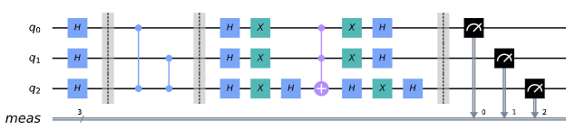

##### 3.1.1 在模拟器中实验

我们可以在模拟器中运行上面的量子回路。

> backend = Aer.get_backend(\'qasm_simulator\')
>
> shots = 1024
>
> results = execute(grover_circuit, backend=backend,
> shots=shots).result()
>
> answer = results.get_counts()
>
> plot_histogram(answer)
>
> 输出：

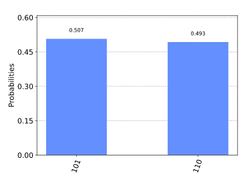

正如输出所示，算法找出了标记态$|101\rangle$和$|110\rangle$。

##### 3.1.2 在真实设备上实验

我们使用下面的代码在真实的设备上运行这一量子回路。

> backend = least_busy(provider.backends(filters=lambda x:
> x.configuration().n_qubits \>= 3 and
>
> not x.configuration().simulator and x.status().operational==True))
>
> print(\"least busy backend: \", backend)
>
> 输出：
>
> least busy backend: ibmq_ourense
>
> \# Run our circuit on the least busy backend. Monitor the execution of
> the job in the queue
>
> from qiskit.tools.monitor import job_monitor
>
> shots = 1024
>
> job = execute(grover_circuit, backend=backend, shots=shots,
> optimization_level=3)
>
> job_monitor(job, interval = 2)
>
> 输出：
>
> Job Status: job has successfully run
>
> \# Get the results from the computation
>
> results = job.result()
>
> answer = results.get_counts(grover_circuit)
>
> plot_histogram(answer)
>
> 输出：

正如我们所期望的情况，算法在真实设备上也找出了标记态$|101\rangle$和$|110\rangle$。量子计算中的错误导致了其他的结果。

### 4. 练习

下面的函数grover_problem_oracle接受若干个量子比特(n)和一个变量，并返回一个n量子比特的预言。对于相同的n和变量，函数总是返回相同的预言。您可以通过在调用grover_problem_oracle时设置print_solutions
= True来查看每个预言的解。

> from qiskit_textbook.problems import grover_problem_oracle
>
> \#\# Example Usage
>
> n = 4
>
> oracle = grover_problem_oracle(n, variant=1) \# 0th variant of oracle,
> with n qubits
>
> qc = QuantumCircuit(n)
>
> qc.append(oracle, \[0,1,2,3\])
>
> qc.draw()

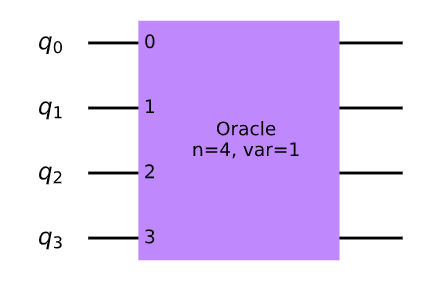

1\. grover_problem_oracle(4, variant=2)使用4个量子比特，获取解$1$。

a\. 我们需要多少次迭代才能有\> 90%的机会测量该解?

b\. 利用Grover算法求解此解态。

c\. 如果我们应用更多的迭代次数，会发生什么？为何？

2\.
若有2个解和4个量子比特，需要多少迭代次数才能在大于90%的概率下测量到一个解？使用预言grover_problem_oracle(4,
variant=1) （2个解）来验证您的答案。

3\. 创建一个函数grover_solver(oracle, iterations)，输入为:

一个量子门实现的Grover预言（oracle）

迭代次数（整数，iterations）

并返回一个在"预言"量子门上执行Grover算法的量子回路。

*注：上述的三个问题简化了问题的难度，所以以下两个原问题仍然给出。*

4\. 上文中Grover算法的示例和实现用于找出3-量子比特标记态$|101\rangle$和

\|110⟩，修改这一实现使其能够找出2-量子比特标记态$|01\rangle$。运行结果是否符合

要求？为何？

5\. 修改上文中3-量子比特的Grover 实现使其能够找出4-量子比特标记态

$|0101\rangle$。运行结果是否符合要求？为何？

### 5. 使用Grover算法解决数独

到目前为止，在本章中使用的预言都是用其解的先验知识来创建的。我们现在用Grover算法来解决一个简单的问题，对于这一问题，我们事先不一定知道其答案。我们的问题是一个2×2二进制数独，在此情况下有两个简单的规则：

\* 任何列都不包含两次相同的值

\* 任何行都不包含两次相同的值

如果我们给数独中的每个方块分配一个变量：

我们想要的是让量子回路输出这一数独游戏的解。

请注意，虽然这种使用Grover算法来解决这一问题的方法是不实际，因为您可以在自己的头脑中找到解决方案！但是这一示例的目的是演示如何将经典的决策问题转换为Grover算法的预言。

#### 5.1 把问题变成一个回路

我们希望创建一个预言来帮助我们解决这个问题。我们将从创建一个能够识别正确解的回路开始。与我们在*计算基*（）中使用量子电路创建经典加法器类似，只需在量子回路上创建一个经典函数来检查可变比特的状态是否是一个有效的解。

由于需要检查两列和两行，所以有4个条件需要检查：

> v0 ≠ v1 \# check along top row
>
> v2 ≠ v3 \# check along bottom row
>
> v0 ≠ v2 \# check down left column
>
> v1 ≠ v3 \# check down right column

记住，我们是在与经典的(计算基)状态做比较。为了方便起见，我们可以将这组比较编写为条件列表：

> clause_list = \[\[0,1\],
>
> \[0,2\],
>
> \[1,3\],
>
> \[2,3\]\]

我们将把每个变量的值赋给回路中的一个比特。为了以计算的方式检查这些条件，将会用到异或门。

> def XOR(qc, a, b, output):
>
> qc.cx(a, output)
>
> qc.cx(b, output)

应确信只当$input0 \neq input1$时，以下回路的$output0$位才会翻转:

> \# We will use separate registers to name the bits
>
> in_qubits = QuantumRegister(2, name=\'input\')
>
> out_qubit = QuantumRegister(1, name=\'output\')
>
> qc = QuantumCircuit(in_qubits, out_qubit)
>
> XOR(qc, in_qubits\[0\], in_qubits\[1\], out_qubit)
>
> qc.draw()

输出：

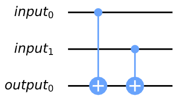

该回路检查$input0\  = = \ input1$并将输出存储到$output0$。为了检查每个条件，我们在clause_list中的每个对重复运行这一回路，并将输出存储到一个新的比特中：

> \# Create separate registers to name bits
>
> var_qubits = QuantumRegister(4, name=\'v\') \# variable bits
>
> clause_qubits = QuantumRegister(4, name=\'c\') \# bits to store
> clause-checks
>
> \# Create quantum circuit
>
> qc = QuantumCircuit(var_qubits, clause_qubits)
>
> \# Use XOR gate to check each clause
>
> i = 0
>
> for clause in clause_list:
>
> XOR(qc, clause\[0\], clause\[1\], clause_qubits\[i\])
>
> i += 1
>
> qc.draw()

输出：

只有当v0、v1、v2、v3的赋值是数独的解时，c0、c1、c2、c3比特的最终状态才都是1。为了完成这一检验回路，我们希望当(且仅当)所有条件都满足时，单个比特为1，这样我们只需观察一个比特就能检查赋值是否是一个解。，可以使用multi-controlled-Toffoli-gate：

> \# Create separate registers to name bits
>
> var_qubits = QuantumRegister(4, name=\'v\')
>
> clause_qubits = QuantumRegister(4, name=\'c\')
>
> output_qubit = QuantumRegister(1, name=\'out\')
>
> qc = QuantumCircuit(var_qubits, clause_qubits, output_qubit)
>
> \# Compute clauses
>
> i = 0
>
> for clause in clause_list:
>
> XOR(qc, clause\[0\], clause\[1\], clause_qubits\[i\])
>
> i += 1
>
> \# Flip \'output\' bit if all clauses are satisfied
>
> qc.mct(clause_qubits, output_qubit)
>
> qc.draw()
>
> 输出：

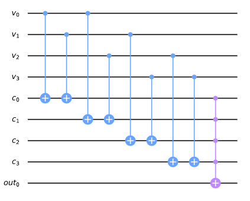

上面的回路以v0、v1、v2和v3的初始分配作为输入，所有其他的比特都应初始化为0。运行该回路后，$out0$位的状态告诉我们这一赋值是否是一个解；$out0\  = \ 0$表示赋值不是解，$out0\  = \ 1$表示赋值是解。

**重点**：在您继续后续步骤之前，应充分理解这一回路并确信其能如上述过程一样运行。

#### 5.2 非计算，完成预言

我们现在可以通过相位反冲把这一检验回路变成Grove预言。总结一下，我们有3个寄存器：

-   一个寄存器用来存储数独变量(x=v3,v2,v1,v0)

-   一个寄存器存储条款(这些条件存储在态$|0000\rangle$中，开始时将其缩写为$|0\rangle$)

-   以及一个量子比特($|out_{0}\rangle$)，我们一直使用该量子比特存储检验回路的输出。

为了创建一个预言，我们需要回路($U_{\omega}$)执行变换：

$$U_{\omega}|x\rangle|0\rangle|\text{out}_{0}\rangle = |x\rangle|0\rangle|\text{out}_{0} \oplus f(x)\rangle$$

如果我们设置量子比特$\text{ou}t_{0}$为叠加态$| - \rangle$：

$$\begin{matrix}
U_{\omega}|x\rangle|0\rangle| - \rangle & = U_{\omega}|x\rangle|0\rangle \otimes \frac{1}{\sqrt{2} }(|0\rangle - |1\rangle) \\
 & = |x\rangle|0\rangle \otimes \frac{1}{\sqrt{2} }(|0 \oplus f(x)\rangle - |1 \oplus f(x)\rangle) \\
\end{matrix}$$

如果$f(x) = 0$,则我们会得到态：

$$\begin{matrix}
 & = |x\rangle|0\rangle \otimes \frac{1}{\sqrt{2} }(|0\rangle - |1\rangle) \\
 & = |x\rangle|0\rangle| - \rangle \\
\end{matrix}$$

（即：没有变化）。但若$f(x) = 1$（即：$x = \omega$），我们就在量子比特$| - \rangle$上引入一个负相位：

$$\begin{matrix}
 & = |x\rangle|0\rangle \otimes \frac{1}{\sqrt{2} }(|1\rangle - |0\rangle) \\
 & = |x\rangle|0\rangle \otimes - \frac{1}{\sqrt{2} }(|0\rangle - |1\rangle) \\
 & = - |x\rangle|0\rangle| - \rangle \\
\end{matrix}$$

这个功用预言会用到两个处于态$|0\rangle| - \rangle$的辅助寄存器：

$$U_{\omega}|x\rangle|0\rangle| - \rangle = \{\begin{matrix}
\text{\ \ \ }\left| x \right\rangle\left| 0 \right\rangle\left| - \right\rangle\text{\ \ \ }\text{for}\text{\ \ \ }x \neq \omega \\
 - \left| x \right\rangle\left| 0 \right\rangle\left| - \right\rangle\text{\ \ \ }\text{for}\text{\ \ \ }x = \omega \\
\end{matrix}$$

为了将检验回路纳入一个Gover预言中，我们需要保证在计算完成后位于第二寄存器（c）的比特始终返回态$|0000\rangle$。仅需在回路运行时重复计算保证条件c0
= c1 = c2 = c3 =
0的部分，就可实现上述要求。我们将这一步称为：非计算"**uncomputation**"。

> var_qubits = QuantumRegister(4, name=\'v\')
>
> clause_qubits = QuantumRegister(4, name=\'c\')
>
> output_qubit = QuantumRegister(1, name=\'out\')
>
> cbits = ClassicalRegister(4, name=\'cbits\')
>
> qc = QuantumCircuit(var_qubits, clause_qubits, output_qubit, cbits)
>
> def sudoku_oracle(qc, clause_list, var_qubits, clause_qubits, cbits):
>
> \# Compute clauses
>
> i = 0
>
> for clause in clause_list:
>
> XOR(qc, clause\[0\], clause\[1\], clause_qubits\[i\])
>
> i += 1
>
> \# Flip \'output\' bit if all clauses are satisfied
>
> qc.mct(clause_qubits, output_qubit)
>
> \# Uncompute clauses to reset clause-checking bits to 0
>
> i = 0
>
> for clause in clause_list:
>
> XOR(qc, clause\[0\], clause\[1\], clause_qubits\[i\])
>
> i += 1
>
> sudoku_oracle(qc, clause_list, var_qubits, clause_qubits, cbits)
>
> qc.draw()

输出：

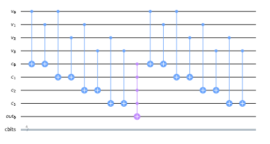

综上所述，上述回路执行如下：

$$U_{\omega}|x\rangle|0\rangle|\text{out}_{0}\rangle = \{\begin{matrix}
\text{\ \ \ \ \ \ \ \ \ }\left| x \right\rangle\left| 0 \right\rangle\left| \text{out}_{0} \right\rangle\text{\ \ \ }\text{for}\text{\ \ \ \ }x \neq \omega \\
\left| x \right\rangle\left| 0 \right\rangle \otimes X\left| \text{out}_{0} \right\rangle\text{\ \ \ }\text{for}\text{\ \ \ \ }x = \omega \\
\end{matrix}$$

且当初始态$|\text{out}_{0}\rangle = | - \rangle$：

$$U_{\omega}|x\rangle|0\rangle| - \rangle = \{\begin{matrix}
\phantom{\text{\ \ \ } }\left| x \right\rangle\left| 0 \right\rangle\left| - \right\rangle\text{\ \ \ }\text{for}\text{\ \ \ }x \neq \omega \\
 - \left| x \right\rangle\left| 0 \right\rangle\left| - \right\rangle\text{\ \ \ }\text{for}\text{\ \ \ }x = \omega \\
\end{matrix}$$

#### 5.3 完整的算法

现在要做的就是把这一预言放到Grover算法中!

> var_qubits = QuantumRegister(4, name=\'v\')
>
> clause_qubits = QuantumRegister(4, name=\'c\')
>
> output_qubit = QuantumRegister(1, name=\'out\')
>
> cbits = ClassicalRegister(4, name=\'cbits\')
>
> qc = QuantumCircuit(var_qubits, clause_qubits, output_qubit, cbits)
>
> \# Initialise \'out0\' in state \|-\>
>
> qc.initialize(\[1, -1\]/np.sqrt(2), output_qubit)
>
> \# Initialise qubits in state \|s\>
>
> qc.h(var_qubits)
>
> qc.barrier() \# for visual separation
>
> \#\# First Iteration
>
> \# Apply our oracle
>
> sudoku_oracle(qc, clause_list, var_qubits, clause_qubits, cbits)
>
> qc.barrier() \# for visual separation
>
> \# Apply our diffuser
>
> qc.append(diffuser(4), \[0,1,2,3\])
>
> \#\# Second Iteration
>
> sudoku_oracle(qc, clause_list, var_qubits, clause_qubits, cbits)
>
> qc.barrier() \# for visual separation
>
> \# Apply our diffuser
>
> qc.append(diffuser(4), \[0,1,2,3\])
>
> \# Measure the variable qubits
>
> qc.measure(var_qubits, cbits)
>
> qc.draw()

输出：

> \# Simulate and plot results
>
> qasm_simulator = Aer.get_backend(\'qasm_simulator\')
>
> result = execute(qc, backend=qasm_simulator, shots=1024).result()
>
> plot_histogram(result.get_counts())

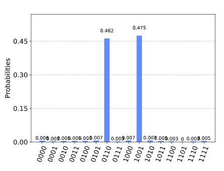

有两个比特字串0110和1001具有比其他任一一个更高的测量概率，与其对应的赋值为：

> v0 = 0
>
> v1 = 1
>
> v2 = 1
>
> v3 = 0

以及：

> v0 = 1
>
> v1 = 0
>
> v2 = 0
>
> v3 = 1

以上就是数独游戏的两种解！本节的目的是展示如何从实际问题中创造Grover预言。虽然这一特定问题非常简单，但此过程在能够生成足够大回路的量子计算机上可以应用于任意决策问题。概括其步骤如下：

1\. 创建一个可逆的经典回路，以确定正确的解。

2\. 使用相位反冲以及非计算将其转换为一个预言。

3\. 使用Grover算法处理该预言。

### 6. 参考文献

1\. L. K. Grover (1996), \"A fast quantum mechanical algorithm for
database search\", Proceedings of the 28th Annual ACM Symposium on the
Theory of Computing (STOC 1996),
[doi:10.1145/237814.237866](http://doi.acm.org/10.1145/237814.237866),
[arXiv:quant-ph/9605043](https://arxiv.org/abs/quant-ph/9605043)

2\. C. Figgatt, D. Maslov, K. A. Landsman, N. M. Linke, S. Debnath & C.
Monroe (2017), \"Complete 3-Qubit Grover search on a programmable
quantum computer\", Nature Communications, Vol 8, Art 1918,
[doi:10.1038/s41467-017-01904-7](https://doi.org/10.1038/s41467-017-01904-7),
[arXiv:1703.10535](https://arxiv.org/abs/1703.10535)

3\. I. Chuang & M. Nielsen, \"Quantum Computation and Quantum
Information\", Cambridge: Cambridge University Press, 2000.

3.11 量子计数
-------------

### 内容

1\. 简介

1.1 直觉

1.2 近观

2\. 代码

2.1 初始化代码

2.2 受控Grover迭代

2.3 逆QFT

2.4 组合

3\. 模拟

4\. 找出解的数量

5\. 练习

6\. 参考文献

### 1. 简介

#### 1.1 直觉

在量子计数中，我们将会简单地使用量子相位估计算法找出Grover搜索迭代中地本征值。您是否还记得Grover算法中的一个迭代过程$G$，该迭代过程在基$|\omega\rangle$和$|s'\rangle$上将态向量旋转$\theta$。

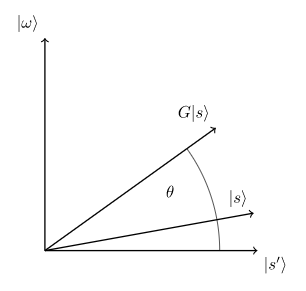

在搜寻空间中解的数量比例会影响$|s\rangle$和\|s′⟩之间的差异。假设没有很多解时，$|s\rangle$会与\|s′⟩很接近，而且$\theta$会变的很小。事实证明Grover迭代器的本征值是$e^{\pm i\theta}$，我们能够使用量子相位估计（GPE）对其进行提取来估计解的数量（M）。

#### 1.2 近观

依据基$|\omega\rangle$和\|s′⟩，我们可以把Grover迭代器写成一个矩阵：

$$G = \begin{pmatrix}
\cos\theta & - sin\theta \\
\sin\theta & \cos\theta \\
\end{pmatrix}$$

依据上文中所提及的本征值$e^{\pm i\theta}$，该矩阵$G$有一个本征向量：

$$\begin{pmatrix}
 - i \\
1 \\
\end{pmatrix},\begin{pmatrix}
i \\
1 \\
\end{pmatrix}$$

幸运的是，我们不需要为这两个状态中的任意一个预备寄存器，态$|s\rangle$在$|\omega\rangle$，$|s'\rangle$所张成的空间中，因此是两个向量的叠加。

$$|s\rangle = \alpha|\omega\rangle + \beta|s'\rangle$$

结果是QPE算法的输出会是两个相位的叠加，且当我们测量寄存器时将会获取到两个值中的一个！然后使用一些简单的数学运算就能获得数量估计$M$。

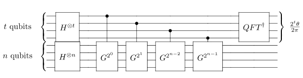

### 2. 代码

#### 2.1 初始化代码

第一步，导入所需的全部库。

import matplotlib.pyplot as plt

import numpy as np

import math

\# importing Qiskit

import qiskit

from qiskit import IBMQ, Aer

from qiskit import QuantumCircuit, execute

\# import basic plot tools

from qiskit.visualization import plot_histogram

本节中将会对量子回路的前四个量子比特进行"计数"，我们将用于计数量子比特的数量称为$t$，此处为$t = 4$，同理量子回路中用于搜索的后四个量子比特（$n = 4$）。依据这些设定，我们就可以开始构建量子回路的构成要素了。

#### 2.2 受控Grover迭代

我们已经在Grover算法一节中介绍了Grover迭代。此处是一个与扩散算子相结合包含16种状态（$N = 2^{n} = 16$）中5个解（$M = 5$）的预言。

> def example_grover_iteration():
>
> \"\"\"Small circuit with 5/16 solutions\"\"\"
>
> \# Do circuit
>
> qc = QuantumCircuit(4)
>
> \# Oracle
>
> qc.h(\[2,3\])
>
> qc.ccx(0,1,2)
>
> qc.h(2)
>
> qc.x(2)
>
> qc.ccx(0,2,3)
>
> qc.x(2)
>
> qc.h(3)
>
> qc.x(\[1,3\])
>
> qc.h(2)
>
> qc.mct(\[0,1,3\],2)
>
> qc.x(\[1,3\])
>
> qc.h(2)
>
> \# Diffuser
>
> qc.h(range(3))
>
> qc.x(range(3))
>
> qc.z(3)
>
> qc.mct(\[0,1,2\],3)
>
> qc.x(range(3))
>
> qc.h(range(3))
>
> qc.z(3)
>
> return qc

可以看到该Python函数不接收任何输入且返回一个有四个量子比特组成的量子回路对象。在之前所创建的函数中带部分用于修改一个已经存在量子回路，但类似上面的函数可以将量子回路生成为一个用于控制的单一量子门。

我们可以使用.to_gate()和.control()方法从一个量子回路创建一个受控量子门，将Grover迭代器称之为grit，受控Grover迭代器称为cgrit：

> \# Create controlled-Grover
>
> grit = example_grover_iteration().to_gate()
>
> cgrit = grit.control()
>
> cgrit.label = \"Grover\"

#### 2.3 逆量子傅里叶变换（Inverse QFT）

我们现在需要创建一个逆QFT。以下是用于在n个量子比特上实现QFT的代码：

> def qft(n):
>
> \"\"\"Creates an n-qubit QFT circuit\"\"\"
>
> circuit = QuantumCircuit(4)
>
> def swap_registers(circuit, n):
>
> for qubit in range(n//2):
>
> circuit.swap(qubit, n-qubit-1)
>
> return circuit
>
> def qft_rotations(circuit, n):
>
> \"\"\"Performs qft on the first n qubits in circuit (without
> swaps)\"\"\"
>
> if n == 0:
>
> return circuit
>
> n -= 1
>
> circuit.h(n)
>
> for qubit in range(n):
>
> circuit.cu1(np.pi/2\*\*(n-qubit), qubit, n)
>
> qft_rotations(circuit, n)
>
> qft_rotations(circuit, n)
>
> swap_registers(circuit, n)
>
> return circuit

可以看到我们选择了返回另一个量子回路对象，这样就可以轻易的翻转量子门。在这一量子回路中，我们使用与计数量子比特相同的数量（$n = 4$）来创建这一量子门：

> qft_dagger = qft(4).to_gate().inverse()
>
> qft_dagger.label = \"QFT†\"

2.4 组合

至此，我们已经为将来的工作准备好了一切所需！现在让我们将其组合起来。

第一步，需要将所有的量子比特都置于态$| + \rangle$：

> \# Create QuantumCircuit
>
> t = 4 \# no. of counting qubits
>
> n = 4 \# no. of searching qubits
>
> qc = QuantumCircuit(n+t, t) \# Circuit with n+t qubits and t classical
> bits
>
> \# Initialise all qubits to \|+\>
>
> for qubit in range(t+n):
>
> qc.h(qubit)
>
> \# Begin controlled Grover iterations
>
> iterations = 1
>
> for qubit in range(t):
>
> for i in range(iterations):
>
> qc.append(cgrit, \[qubit\] + \[\*range(t, n+t)\])
>
> iterations \*= 2
>
> \# Do inverse QFT on counting qubits
>
> qc.append(qft_dagger, range(t))
>
> \# Measure counting qubits
>
> qc.measure(range(t), range(t))
>
> \# Display the circuit
>
> qc.draw()
>
> 输出：

### 3. 模拟

> \# Execute and see results
>
> emulator = Aer.get_backend(\'qasm_simulator\')
>
> job = execute(qc, emulator, shots=2048 )
>
> hist = job.result().get_counts()
>
> plot_histogram(hist)
>
> 输出：

可以看到有两个值比较突出，比其他值有更高的测量概率。这两个值对应于$e^{i\theta}$和$e^{- i\theta}$，但还不能看出解的数量。我们需要做更多的处理才能获得此信息，因此首先将输出转换成可以使用的内容（一个整数）。

从输出数据中获取最有可能结果的字符串：

measured_str = max(hist, key=hist.get)

并将其存储为一个整数：

> measured_int = int(measured_str,2)
>
> print(\"Register Output = %i\" % measured_int)
>
> 输出：
>
> Register Output = 5

### 4. 找出解的数量（$\mathbf{M}$）

我们将会创建一个名称为calculate_M()的函数，该函数接收一个十进制整数作为输入并输出寄存器、计数量子比特的数量（$t$）以及搜索量子比特的数量（$n$）。

首先从measured_int中获取$\theta$。回想一下：量子相位估计（QPE）从本征值$e^{2\pi i\varnothing}$中给出测量值为$2^{n}\varnothing$，所以若要获得$\theta$则需进行如下变换：

$$\theta = 测量值 \times \frac{2\pi}{2^{t} }$$

代码形式为：

> theta = (measured_int/(2\*\*t))\*math.pi\*2
>
> print(\"Theta = %.5f\" % theta)
>
> 输出：
>
> Theta = 1.96350

您可能还记得我们可以从$|s\rangle$和$|s'\rangle$的内积中获得角度$\theta/2$：

$$\langle s'|s\rangle = \cos\frac{\theta}{2}$$

而这些向量的内积为：

$$\langle s'|s\rangle = \sqrt{\frac{N - M}{N} }$$

将上面的两个式子组合起来，然后运用三角和代数知识将其变换为：

$$N\sin^{2}\frac{\theta}{2} = M$$

回想一下：在Grover算法一章中创建一个扩散算子$U_{s}$的通常方式就是真实实现$U_{s}$。Grover算法一章给出的这一实现被用于创建Grover迭代。在一个通常的Grover搜索中，这一相位是全局相位且不能被忽略，但现在我们控制Grover迭代时这一相位仍然存在影响。事实情况是我们已经有效地搜索了*非*解的状态，并且量子计数算法告诉我们有多少个状态是*非*解。为了修复这一问题，只需简单的$N - M$。

上述过程的代码试下如下所示：

> N = 2\*\*n
>
> M = N \* (math.sin(theta/2)\*\*2)
>
> print(\"No. of Solutions = %.1f\" % (N-M))
>
> 输出：
>
> No. of Solutions = 4.9

从输出可以看到大约正确的答案！我们可以使用以下方法近似计算此答案中的错误：

> m = t - 1 \# Upper bound: Will be less than this
>
> err = (math.sqrt(2\*M\*N) + N/(2\*\*(m-1)))\*(2\*\*(-m))
>
> print(\"Error \< %.2f\" % err)
>
> 输出：
>
> Error \< 2.85

对错误计算的解释已经超出本文的范围，但其中的一种解释可在参考文献\[1\]中找到。

最后，下述代码是函数calculate_M()的最终形态：

> def calculate_M(measured_int, t, n):
>
> \"\"\"For Processing Output of Quantum Counting\"\"\"
>
> \# Calculate Theta
>
> theta = (measured_int/(2\*\*t))\*math.pi\*2
>
> print(\"Theta = %.5f\" % theta)
>
> \# Calculate No. of Solutions
>
> N = 2\*\*n
>
> M = N \* (math.sin(theta/2)\*\*2)
>
> print(\"No. of Solutions = %.1f\" % (N-M))
>
> \# Calculate Upper Error Bound
>
> m = t - 1 \#Will be less than this (out of scope)
>
> err = (math.sqrt(2\*M\*N) + N/(2\*\*(m-1)))\*(2\*\*(-m))
>
> print(\"Error \< %.2f\" % err)

### 5. 练习

1\. 创建一个不同数量解的预言。所创建量子计数算法的准确度如何变化？

2\. 您能够使用更多或更少的计数量子比特调整量子回路获得不同精度的结果吗？

### 6. 参考文献

\[1\] Michael A. Nielsen and Isaac L. Chuang. 2011. Quantum Computation
and Quantum Information: 10th Anniversary Edition (10th ed.). Cambridge
University Press, New York, NY, USA.

3.12 量子密钥分发（Quantum Key Distribution QKD）
-------------------------------------------------

### 内容

1\. 简介

2\. 协议概述

3\. 不包含监听的Qiskit示例

4\. 包含监听的Qiskit示例

5\. 风险分析

### 1. 简介

当Alice和Bob想要通过不安全的渠道（如：互联网）传送秘密信息（如：Bob的在线网上银行信息），对信息加密就显得至关重要了。由于密码学是一个广阔的领域，其几乎所有的内容都不在本书的讨论范围之内，因此我们可以确信Alice和Bob所拥有的他人未知的密钥就变得非常有用了，他们可以使用对称密钥进行加密通信。

如果Alice和Bob要使用Eve的通常交流渠道来共享密钥，那么就无法判断Eve是否为自己制作了这个密钥的副本。因此他们必须完全信任Eve没有监听。但是，如果Eve提供了一个量子通信信道，那么Alice和Bob不再需要完全信任Eve------他们能够知道Eve是否在将信息发送给Alice前尝试读取Bob的消息。

对于某些读者而言，给出如何物理实现量子信道的想法可能会很有帮助。一个经典信道的例子可以是电话线路；我们通过该线路发送代表信息（或比特）的电信号。所提及的量子通信信道示例可以是某种光纤线缆，通过该线缆我们可以发送单个光子（光粒子）。光子具有一个称为极化（polarisation）的属性，这种极化可以呈现两种状态中的一种，可以以此来表示一个量子比特。

### 2. 协议概述

该协议利用了测量量子比特可以改变其状态的事实。如果Alice向Bob发送了一个量子比特，并且一个窃听者（Eve）试图在Bob之前进行测量，那么Eve的测量可能会改变量子比特的状态，而Bob将不会收到Alice所发送量子比特的状态。

> from qiskit import QuantumCircuit, execute, Aer
>
> from qiskit.visualization import plot_histogram,
> plot_bloch_multivector
>
> from numpy.random import randint
>
> import numpy as np
>
> print(\"Imports Successful\")

如果Alice准备了一个处于态$| + \rangle$的量子比特（在X-基矢上的0），然后Bob对其在X-基矢上进行测量，那么可以确信Bob所测得的结果为0.

> qc = QuantumCircuit(1,1)
>
> \# Alice prepares qubit in state \|+\>
>
> qc.h(0)
>
> qc.barrier()
>
> \# Alice now sends the qubit to Bob
>
> \# who measures it in the X-basis
>
> qc.h(0)
>
> qc.measure(0,0)
>
> \# Draw and simulate circuit
>
> display(qc.draw())
>
> svs = Aer.get_backend(\'qasm_simulator\')
>
> job = execute(qc, svs)
>
> plot_histogram(job.result().get_counts())
>
> 输出：

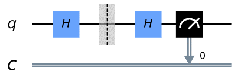

但如果Eve试着在这一量子比特达到Bob处前对其在Z-基矢上进行测量，这一操作将会使得这个量子比特由态$| + \rangle$转变为$|0\rangle$或$|1\rangle$，Bob就不能够确定的测量到0了：

> qc = QuantumCircuit(1,1)
>
> \# Alice prepares qubit in state \|+\>
>
> qc.h(0)
>
> \# Alice now sends the qubit to Bob
>
> \# but Eve intercepts and tries to read it
>
> qc.measure(0, 0)
>
> qc.barrier()
>
> \# Eve then passes this on to Bob
>
> \# who measures it in the X-basis
>
> qc.h(0)
>
> qc.measure(0,0)
>
> \# Draw and simulate circuit
>
> display(qc.draw())
>
> svs = Aer.get_backend(\'qasm_simulator\')
>
> job = execute(qc, svs)
>
> plot_histogram(job.result().get_counts())
>
> 输出：

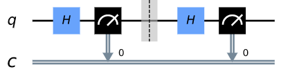

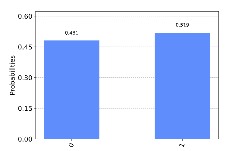

可以看到Bob现在的测量到1的概率为约为50%，如果确实如此则Bob和Alice就会知道信道发生了一些错误。

量子密钥分发协议涉及重复此过程足够多次，以使窃听者实现监听的机率变得微不足道。其过程大致如下：

**-步骤1**

Alice选出一个随机比特字串，如：

1000101011010100

然后为其中的每个比特随机选择基矢：

ZZXZXXXZXZXXXXXX

Alice把这两条信息保密起来。

**-步骤2**

然后Alice使用所选的基矢对量子比特字串中的每一个进行编码，这一操作将每个量子比特随机置于态$|0\rangle$、$|1\rangle$、$| + \rangle$或$| - \rangle$中的一个。经过这一操作后量子比特字串可能同如下所示：

$$|1\rangle|0\rangle| + \rangle|0\rangle| - \rangle| + \rangle| - \rangle|0\rangle| - \rangle|1\rangle| + \rangle| - \rangle| + \rangle| - \rangle| + \rangle| + \rangle$$

这就是Alice发给Bob的信息。

**-步骤3**

Bob收到消息后随机对这些量子比特进行测量，比如可能使用如下基矢：

XZZZXZXZXZXZZZXZ

并对所测得结果保密。

**-步骤4**

然后Bob和Alice公开分享他们为每个量子比特使用的基矢。如果Bob以Alice所准备的相同基矢测量一个量子比特，则将其用作共享密钥的一部分，否则将丢弃该比特的信息。

**-步骤5**

最后，Bob和Alice共享密钥的随机样本，如果样本匹配就可以确信（以很小的误差）传输成功。

### 3. 不包含监听的Qiskit示例

首先，让我们看看当无人监听时该协议如何工作，然后看看Bob和Alice如何能够检测到窃听者。

为了生成伪随机密钥，我们将使用numpy中的randint函数。为了确保您可以在此页面上重现结果，我们将种子设置为0：

np.random.seed(seed=0)

我们将Alice初始信息的长度称为n。在此示例中，Alice将发送一条长度为100个量子比特的信息：

n = 100

#### 3.1 步骤1

随机生成比特集：

> np.random.seed(seed=0)
>
> n = 100
>
> \#\# Step 1
>
> \# Alice generates bits
>
> alice_bits = randint(2, size=n)
>
> print(alice_bits)
>
> 输出：
>
> \[0 1 1 0 1 1 1 1 1 1 1 0 0 1 0 0 0 0 0 1 0 1 1 0 0 1 1 1 1 0 1 0 1 0
> 1 1 0 1 1 0 0 1 0 1 1 1 1 1 0 1 0 1 1 1 1 0 1 0 0 1 1 0 1 0 1 0 0 0 0
> 0 1 1 0 0 0 1 1 0 1 0 0 1 0 1 1 1 1 1 1 0 1 1 0 0 1 0 0 1 1 0\]

目前，只有Alice才知道名为"alice_bits"的比特集。我们将在下表中跟踪Alice只知道哪些信息，Bob只知道哪些信息以及通过Eve的信道所发送的信息：

  **Alice\'s Knowledge**   **Over Eve\'s Channel**   **Bob\'s Knowledge**
------------------------ ------------------------- ----------------------
  alice_bits                                         

#### 3.2 步骤2

Alice选择随机在X-基矢或Z-基矢的量子比特对每一信息中的比特进行编码，并将编码后结果存储在alice_bases中。我们定义0表示"在Z-基矢上准备"，1表示"在X-基矢上准备"：

> np.random.seed(seed=0)
>
> n = 100
>
> \#\# Step 1
>
> \#Alice generates bits
>
> alice_bits = randint(2, size=n)
>
> \#\# Step 2
>
> \# Create an array to tell us which qubits
>
> \# are encoded in which bases
>
> alice_bases = randint(2, size=n)
>
> print(alice_bases)
>
> 输出：
>
> \[1 0 0 1 0 0 0 1 1 0 1 0 0 0 0 0 1 0 1 0 1 1 1 1 1 0 1 1 1 1 0 1 1 0
> 0 1 0 0 0 0 1 1 0 0 1 0 1 1 1 1 0 0 0 1 0 1 1 1 0 1 0 0 1 0 1 1 0 0 1
> 0 1 0 1 0 1 0 1 0 0 0 1 0 1 0 1 0 0 0 0 0 1 0 0 1 0 0 0 1 0 0\]

Alice仍将这一信息保密：

  **Alice\'s Knowledge**   **Over Eve\'s Channel**   **Bob\'s Knowledge**
------------------------ ------------------------- ----------------------
  alice_bits                                         
  alice_bases                                        

下面函数encode_message用于创建一个量子回路的列表，其中的每一个量子回路都用于表示Alice信息中单个量子比特：

> def encode_message(bits, bases):
>
> message = \[\]
>
> for i in range(n):
>
> qc = QuantumCircuit(1,1)
>
> if bases\[i\] == 0: \# Prepare qubit in Z-basis
>
> if bits\[i\] == 0:
>
> pass
>
> else:
>
> qc.x(0)
>
> else: \# Prepare qubit in X-basis
>
> if bits\[i\] == 0:
>
> qc.h(0)
>
> else:
>
> qc.x(0)
>
> qc.h(0)
>
> qc.barrier()
>
> message.append(qc)
>
> return message
>
> np.random.seed(seed=0)
>
> n = 100
>
> \#\# Step 1 Alice generates bits
>
> alice_bits = randint(2, size=n)
>
> \#\# Step 2 Create an array to tell us which qubits are encoded in
> which bases
>
> alice_bases = randint(2, size=n)
>
> message = encode_message(alice_bits, alice_bases)

我们可以看到在alices_bits中的第一个比特是0，对其进行编码的为X-基矢（表示为1）：

> print(\'bit = %i\' % alice_bits\[0\])
>
> print(\'basis = %i\' % alice_bases\[0\])
>
> 输出：
>
> bit = 0
>
> basis = 1

如果查看用于表示Alice信息中第一个量子比特的量子回路，我们可以确认Alice将这一量子比特置于态$| + \rangle$：

> message\[0\].draw()
>
> 输出：

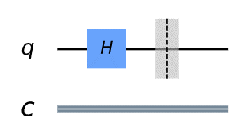

另一示例，我们可以看到alice_bits中的第四个比特为1，并在Z-基矢上对其编码，Alice所准备相应的量子比特处于态$|1\rangle$：

> print(\'bit = %i\' % alice_bits\[4\])
>
> print(\'basis = %i\' % alice_bases\[4\])
>
> message\[4\].draw()
>
> 输出：

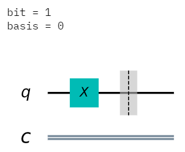

这些量子比特信息将会通过Eve的量子信道发送给Bob：

  **Alice\'s Knowledge**   **Over Eve\'s Channel**   **Bob\'s Knowledge**
------------------------ ------------------------- ----------------------
  alice_bits                                         
  alice_bases                                        
  message                  message                   message

#### 3.3 步骤3

Bob会在接收到信息后随机在X-基矢或Z-基矢上对其测量并保存测量结果：

> np.random.seed(seed=0)
>
> n = 100
>
> \#\# Step 1
>
> \# Alice generates bits
>
> alice_bits = randint(2, size=n)
>
> \#\# Step 2
>
> \# Create an array to tell us which qubits
>
> \# are encoded in which bases
>
> alice_bases = randint(2, size=n)
>
> message = encode_message(alice_bits, alice_bases)
>
> \#\# Step 3
>
> \# Decide which basis to measure in:
>
> bob_bases = randint(2, size=n)
>
> print(bob_bases)
>
> 输出：
>
> \[1 0 1 0 0 1 1 0 0 0 1 1 0 0 0 0 0 1 0 1 0 0 0 1 1 1 0 0 1 1 1 1 0 0
> 0 1 1 0 1 0 0 1 0 1 1 1 1 0 0 0 1 1 1 0 1 1 1 1 0 0 1 1 0 0 0 1 1 0 1
> 1 1 1 1 0 0 0 1 0 1 0 1 1 0 0 0 1 0 0 1 1 1 1 0 1 0 0 0 0 1 1\]

Bob将选择在哪一基矢上测量每一个量子比特的信息保存在bob_bases中：

  **Alice\'s Knowledge**   **Over Eve\'s Channel**   **Bob\'s Knowledge**
------------------------ ------------------------- ----------------------
  alice_bits                                         
  alice_bases                                        
  message                  message                   message
                                                     bob_bases

下面的函数measure_message会应用对应的测量并模拟出每个量子比特的测量结果。我们将测量结果存储在bob_results中。

> def measure_message(message, bases):
>
> backend = Aer.get_backend(\'qasm_simulator\')
>
> measurements = \[\]
>
> for q in range(n):
>
> if bases\[q\] == 0: \# measuring in Z-basis
>
> message\[q\].measure(0,0)
>
> if bases\[q\] == 1: \# measuring in X-basis
>
> message\[q\].h(0)
>
> message\[q\].measure(0,0)
>
> result = execute(message\[q\], backend, shots=1, memory=True).result()
>
> measured_bit = int(result.get_memory()\[0\])
>
> measurements.append(measured_bit)
>
> return measurements
>
> np.random.seed(seed=0)
>
> n = 100
>
> \#\# Step 1
>
> \# Alice generates bits
>
> alice_bits = randint(2, size=n)
>
> \#\# Step 2
>
> \# Create an array to tell us which qubits
>
> \# are encoded in which bases
>
> alice_bases = randint(2, size=n)
>
> message = encode_message(alice_bits, alice_bases)
>
> \#\# Step 3
>
> \# Decide which basis to measure in:
>
> bob_bases = randint(2, size=n)
>
> bob_results = measure_message(message, bob_bases)

可以看到消息\[0\]（表示第0个量子比特）中的回路已由Bob添加了X-量度：

> message\[0\].draw()
>
> 输出：

由于Bob偶然地选中与Alice编码量子比特相同的基矢，Bob可以确信所得结果是0。对于第六个量子比特（如下所示），Bob随机选择的测量基矢与Alice的不同，Bob的测量结果仅有50%的概率匹配Alice的信息。

> message\[6\].draw()
>
> 输出：

> print(bob_results)
>
> 输出：
>
> \[0, 1, 1, 1, 1, 1, 0, 0, 0, 1, 1, 0, 0, 1, 0, 0, 1, 1, 0, 1, 1, 0, 0,
> 0, 0, 1, 1, 1, 1, 0, 0, 0, 0, 0, 1, 1, 0, 1, 1, 0, 0, 1, 0, 1, 1, 0,
> 1, 0, 0, 1, 0, 0, 1, 0, 1, 0, 1, 0, 0, 0, 1, 1, 1, 0, 1, 0, 1, 0, 0,
> 0, 1, 0, 0, 0, 1, 1, 1, 0, 1, 0, 0, 1, 0, 1, 1, 1, 1, 1, 0, 1, 1, 1,
> 0, 0, 1, 0, 0, 1, 0, 0\]

Bob还将其结果保密。

  **Alice\'s Knowledge**   **Over Eve\'s Channel**   **Bob\'s Knowledge**
------------------------ ------------------------- ----------------------
  alice_bits                                         
  alice_bases                                        
  message                  message                   message
                                                     bob_bases
                                                     bob_results

#### 3.4 步骤4

经过上述步骤之后，Alice将哪一量子比特在哪一基矢上编码的信息通过Eve的信道发送出去：

  **Alice\'s Knowledge**   **Over Eve\'s Channel**   **Bob\'s Knowledge**
------------------------ ------------------------- ----------------------
  alice_bits                                         
  alice_bases                                        
  message                  message                   message
                                                     bob_bases
                                                     bob_results
                           alice_bases               alice_bases

Bob则将使用哪一基矢测量量子比特的信息发送：

  **Alice\'s Knowledge**   **Over Eve\'s Channel**   **Bob\'s Knowledge**
------------------------ ------------------------- ----------------------
  alice_bits                                         
  alice_bases                                        
  message                  message                   message
                                                     bob_bases
                                                     bob_results
                           alice_bases               alice_bases
  bob_bases                bob_bases                 

如果Bob碰巧以Alice为其准备的相同基矢进行测量，则表明bob_results中的条目将与alice_bits中的相应条目相匹配，并且他们可以将该比特用作其密钥的一部分。如果他们以不同的基准进行衡量，那么Bob所测得是随机结果，并且他们都会将该比特丢弃。如下remove_garbage函数为我们执行此操作的功能：

> def remove_garbage(a_bases, b_bases, bits):
>
> good_bits = \[\]
>
> for q in range(n):
>
> if a_bases\[q\] == b_bases\[q\]:
>
> \# If both used the same basis, add
>
> \# this to the list of \'good\' bits
>
> good_bits.append(bits\[q\])
>
> return good_bits

在Alice和Bob都丢弃了无用的比特后使用剩余的比特来形成其私钥：

> np.random.seed(seed=0)
>
> n = 100
>
> \#\# Step 1
>
> \# Alice generates bits
>
> alice_bits = randint(2, size=n)
>
> \#\# Step 2
>
> \# Create an array to tell us which qubits
>
> \# are encoded in which bases
>
> alice_bases = randint(2, size=n)
>
> message = encode_message(alice_bits, alice_bases)
>
> \#\# Step 3
>
> \# Decide which basis to measure in:
>
> bob_bases = randint(2, size=n)
>
> bob_results = measure_message(message, bob_bases)
>
> \#\# Step 4
>
> alice_key = remove_garbage(alice_bases, bob_bases, alice_bits)
>
> print(alice_key)
>
> 输出：
>
> \[0, 1, 1, 1, 1, 0, 1, 0, 0, 0, 0, 1, 0, 0, 0, 1, 1, 1, 0, 1, 0, 1, 1,
> 0, 1, 0, 0, 0, 0, 0, 0, 1, 0, 0, 1, 1, 0, 0, 0, 1, 1, 1, 1, 0, 0, 1,
> 0, 0\]

  **Alice\'s Knowledge**   **Over Eve\'s Channel**   **Bob\'s Knowledge**
------------------------ ------------------------- ----------------------
  alice_bits                                         
  alice_bases                                        
  message                  message                   message
                                                     bob_bases
                                                     bob_results
                           alice_bases               alice_bases
  bob_bases                bob_bases                 
  alice_key                                          

> np.random.seed(seed=0)
>
> n = 100
>
> \#\# Step 1
>
> \# Alice generates bits
>
> alice_bits = randint(2, size=n)
>
> \#\# Step 2
>
> \# Create an array to tell us which qubits
>
> \# are encoded in which bases
>
> alice_bases = randint(2, size=n)
>
> message = encode_message(alice_bits, alice_bases)
>
> \#\# Step 3
>
> \# Decide which basis to measure in:
>
> bob_bases = randint(2, size=n)
>
> bob_results = measure_message(message, bob_bases)
>
> \#\# Step 4
>
> alice_key = remove_garbage(alice_bases, bob_bases, alice_bits)
>
> bob_key = remove_garbage(alice_bases, bob_bases, bob_results)
>
> print(bob_key)
>
> 输出：
>
> \[0, 1, 1, 1, 1, 0, 1, 0, 0, 0, 0, 1, 0, 0, 0, 1, 1, 1, 0, 1, 0, 1, 1,
> 0, 1, 0, 0, 0, 0, 0, 0, 1, 0, 0, 1, 1, 0, 0, 0, 1, 1, 1, 1, 0, 0, 1,
> 0, 0\]

  **Alice\'s Knowledge**   **Over Eve\'s Channel**   **Bob\'s Knowledge**
------------------------ ------------------------- ----------------------
  alice_bits                                         
  alice_bases                                        
  message                  message                   message
                                                     bob_bases
                                                     bob_results
                           alice_bases               alice_bases
  bob_bases                bob_bases                 
  alice_key                                          bob_key

##### 3.5 步骤5

最后，Alice和Bob对比密匙中的随机选择来确认这一协议运行正确：

> def sample_bits(bits, selection):
>
> sample = \[\]
>
> for i in selection:
>
> \# use np.mod to make sure the
>
> \# bit we sample is always in
>
> \# the list range
>
> i = np.mod(i, len(bits))
>
> \# pop(i) removes the element of the
>
> \# list at index \'i\'
>
> sample.append(bits.pop(i))
>
> return sample

Alice和Bob都广播了这些公开内容，因其不再是秘密了，所以从密钥中将其删除：

> np.random.seed(seed=0)
>
> n = 100
>
> \#\# Step 1
>
> \# Alice generates bits
>
> alice_bits = randint(2, size=n)
>
> \#\# Step 2
>
> \# Create an array to tell us which qubits
>
> \# are encoded in which bases
>
> alice_bases = randint(2, size=n)
>
> message = encode_message(alice_bits, alice_bases)
>
> \#\# Step 3
>
> \# Decide which basis to measure in:
>
> bob_bases = randint(2, size=n)
>
> bob_results = measure_message(message, bob_bases)
>
> \#\# Step 4
>
> alice_key = remove_garbage(alice_bases, bob_bases, alice_bits)
>
> bob_key = remove_garbage(alice_bases, bob_bases, bob_results)
>
> \#\# Step 5
>
> sample_size = 15
>
> bit_selection = randint(n, size=sample_size)
>
> bob_sample = sample_bits(bob_key, bit_selection)
>
> print(\" bob_sample = \" + str(bob_sample))
>
> alice_sample = sample_bits(alice_key, bit_selection)
>
> print(\"alice_sample = \"+ str(alice_sample))
>
> 输出：
>
> bob_sample = \[0, 1, 0, 1, 1, 0, 0, 0, 0, 0, 0, 1, 0, 0, 0\]
>
> alice_sample = \[0, 1, 0, 1, 1, 0, 0, 0, 0, 0, 0, 1, 0, 0, 0\]

  **Alice\'s Knowledge**   **Over Eve\'s Channel**   **Bob\'s Knowledge**
------------------------ ------------------------- ----------------------
  alice_bits                                         
  alice_bases                                        
  message                  message                   message
                                                     bob_bases
                                                     bob_results
                           alice_bases               alice_bases
  bob_bases                bob_bases                 
  alice_key                                          bob_key
  bob_sample               bob_sample                bob_sample
  alice_sample             alice_sample              alice_sample

如果在没有监听的情况下该协议正常运行，则其样本应匹配：

> bob_sample == alice_sample
>
> 输出
>
> True

如果样本匹配，表明alice_key和bob_key高概率相等。现在他们可以分享密匙用于加密之间的通信信息。

  **Alice\'s Knowledge**   **Over Eve\'s Channel**   **Bob\'s Knowledge**
------------------------ ------------------------- ----------------------
  alice_bits                                         
  alice_bases                                        
  message                  message                   message
                                                     bob_bases
                                                     bob_results
                           alice_bases               alice_bases
  bob_bases                bob_bases                 
  alice_key                                          bob_key
  bob_sample               bob_sample                bob_sample
  alice_sample             alice_sample              alice_sample
  shared_key                                         shared_key

> print(bob_key)
>
> print(alice_key)
>
> print(\"key length = %i\" % len(alice_key))
>
> 输出：
>
> \[1, 1, 0, 1, 0, 0, 1, 0, 1, 1, 1, 0, 1, 1, 1, 0, 1, 0, 0, 1, 0, 0, 1,
> 1, 0, 0, 0, 1, 1, 0, 1, 0, 0\]
>
> \[1, 1, 0, 1, 0, 0, 1, 0, 1, 1, 1, 0, 1, 1, 1, 0, 1, 0, 0, 1, 0, 0, 1,
> 1, 0, 0, 0, 1, 1, 0, 1, 0, 0\]
>
> key length = 33

### 4. 包含监听的Qiskit示例

现在让我们看看如果Eve在试着监听量子信息时Alice和Bob如何获知。我们将重复无监听中的步骤，但在Bob收到量子比特之前，Eve会试着重中提取信息。这次我们将设置一个不同的随机数种子，所以我们可以得到了一组特定且可再现的"随机"结果：

np.random.seed(seed=3)

#### 4.1 步骤1

Alice生成其随机比特集：

> np.random.seed(seed=3)
>
> \#\# Step 1
>
> alice_bits = randint(2, size=n)
>
> print(alice_bits)
>
> 输出：
>
> \[0 0 1 1 0 0 0 1 1 1 0 1 1 1 0 1 1 0 0 0 0 1 1 0 0 0 1 0 0 0 0 1 0 1
> 1 0 1 0 0 1 1 0 0 1 0 1 0 1 1 1 1 0 1 0 0 1 1 1 0 0 0 1 0 0 0 1 0 0 1
> 1 0 0 1 1 1 0 1 1 1 1 1 1 0 1 0 0 1 1 0 1 0 0 0 0 0 1 1 0 1 1\]

#### 4.2 步骤2

Alice随机在Z-基矢和X-基矢上对上面的信息进行编码，并将编码后的结果通过Eve的量子信道发送给Bob。

> np.random.seed(seed=3)
>
> \#\# Step 1
>
> alice_bits = randint(2, size=n)
>
> \#\# Step 2
>
> alice_bases = randint(2, size=n)
>
> message = encode_message(alice_bits, alice_bases)
>
> print(alice_bases)
>
> 输出：
>
> \[1 0 0 1 1 0 1 0 0 0 0 0 0 0 0 0 1 0 0 0 0 1 1 1 1 0 0 1 1 0 0 1 1 1
> 1 0 0 1 1 0 0 0 0 0 0 0 0 1 1 0 0 0 1 0 1 1 1 0 0 1 0 1 0 1 1 0 0 1 0
> 0 1 1 1 1 1 0 0 0 0 0 1 1 1 0 0 0 0 0 0 1 0 1 0 0 0 1 0 1 1 1\]

在这一情况下，Alice信息中的第一个量子比特被置于态$| + \rangle$：

> message\[0\].draw()
>
> 输出：

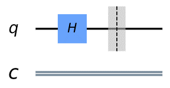

#### 监听！

在Alice的信息经过Eve的信道时，Eve对其进行了监听。她尝试以随机选择的基矢上测量这些量子比特，这一操作与Bob收到信息的处理方式相同。

> np.random.seed(seed=3)
>
> \#\# Step 1
>
> alice_bits = randint(2, size=n)
>
> \#\# Step 2
>
> alice_bases = randint(2, size=n)
>
> message = encode_message(alice_bits, alice_bases)
>
> \#\# Interception!!
>
> eve_bases = randint(2, size=n)
>
> intercepted_message = measure_message(message, eve_bases)
>
> print(intercepted_message)
>
> 输出：
>
> \[1, 0, 0, 0, 0, 0, 1, 0, 1, 1, 0, 1, 1, 1, 0, 1, 0, 0, 0, 0, 1, 1, 0,
> 0, 1, 1, 1, 0, 0, 0, 0, 1, 0, 1, 1, 0, 1, 0, 0, 1, 1, 0, 0, 0, 1, 0,
> 1, 0, 1, 1, 1, 1, 1, 0, 1, 0, 0, 0, 0, 0, 0, 1, 0, 0, 0, 1, 0, 1, 0,
> 1, 0, 0, 1, 1, 0, 0, 1, 1, 1, 0, 1, 0, 0, 0, 0, 0, 0, 1, 0, 1, 0, 0,
> 0, 0, 0, 1, 1, 0, 1, 0\]

下面所示的为该情况下的量子比特0；Eve所随机选择的基矢与Alice的不同，这会将原量子态$| + \rangle$改变为Z-基矢上的随机态，$|0\rangle$或$|1\rangle$各有50%的概率。

> message\[0\].draw()
>
> 输出：

#### 4.3 步骤3

然后，Eve会将已经过监听的量子比特传给Bob，Bob会在收到后对其进行随机测量。在这一情况下，Bob偶然选中了与Alice准备量子比特时相同的基矢。在没有监听的情况下Bob会获得测量值0，但由于Eve有尝试读取信息的操作导致Bob现在有50%的概率获得测量值1。

> np.random.seed(seed=3)
>
> \#\# Step 1
>
> alice_bits = randint(2, size=n)
>
> \#\# Step 2
>
> alice_bases = randint(2, size=n)
>
> message = encode_message(alice_bits, alice_bases)
>
> \#\# Interception!!
>
> eve_bases = randint(2, size=n)
>
> intercepted_message = measure_message(message, eve_bases)
>
> \#\# Step 3
>
> bob_bases = randint(2, size=n)
>
> bob_results = measure_message(message, bob_bases)
>
> message\[0\].draw()

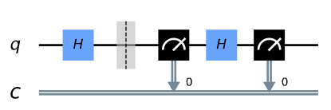

#### 4.4 步骤4

Bob和Alice公开了他们的基矢选择，并删除了无用的比特：

> np.random.seed(seed=3)
>
> \#\# Step 1
>
> alice_bits = randint(2, size=n)
>
> \#\# Step 2
>
> alice_bases = randint(2, size=n)
>
> message = encode_message(alice_bits, alice_bases)
>
> \#\# Interception!!
>
> eve_bases = randint(2, size=n)
>
> intercepted_message = measure_message(message, eve_bases)
>
> \#\# Step 3
>
> bob_bases = randint(2, size=n)
>
> bob_results = measure_message(message, bob_bases)
>
> \#\# Step 4
>
> bob_key = remove_garbage(alice_bases, bob_bases, bob_results)
>
> alice_key = remove_garbage(alice_bases, bob_bases, alice_bits)

#### 4.5 步骤5

Bob和Alice通过对比他们密匙中相同位置的随机选择来查看量子比特是否被监听：

> np.random.seed(seed=3)
>
> \#\# Step 1
>
> alice_bits = randint(2, size=n)
>
> \#\# Step 2
>
> alice_bases = randint(2, size=n)
>
> message = encode_message(alice_bits, alice_bases)
>
> \#\# Interception!!
>
> eve_bases = randint(2, size=n)
>
> intercepted_message = measure_message(message, eve_bases)
>
> \#\# Step 3
>
> bob_bases = randint(2, size=n)
>
> bob_results = measure_message(message, bob_bases)
>
> \#\# Step 4
>
> bob_key = remove_garbage(alice_bases, bob_bases, bob_results)
>
> alice_key = remove_garbage(alice_bases, bob_bases, alice_bits)
>
> \#\# Step 5
>
> sample_size = 15
>
> bit_selection = randint(n, size=sample_size)
>
> bob_sample = sample_bits(bob_key, bit_selection)
>
> print(\" bob_sample = \" + str(bob_sample))
>
> alice_sample = sample_bits(alice_key, bit_selection)
>
> print(\"alice_sample = \"+ str(alice_sample))
>
> 输出：
>
> bob_sample = \[1, 1, 1, 0, 1, 1, 0, 1, 1, 0, 0, 0, 0, 0, 1\]
>
> alice_sample = \[1, 1, 0, 0, 1, 0, 0, 0, 0, 0, 0, 1, 0, 0, 0\]
>
> bob_sample == alice_sample
>
> 输出：
>
> False

看到没有！Alice和Bob的密匙不匹配。我们直到这时由于Eve在步骤2和3之间尝试读取这一信息所致，从而导致了量子比特状态的改变。对于Alice和Bob来说，密匙不匹配的原因可能是量子信道中的噪声引起的，但无论如何他们都必须舍弃现有结果，然后再试一次------Eve的监听尝试失败了！

### 5. 风险分析

对于这种Eve测量所有量子比特的监听，在Alice通过Eve的信道发送她易受攻击的信息时，Alice和Bob之间样本匹配的几率极小。让我们计算这一几率并看一下量子密钥分发有多危险。

-   为了使Alice和Bob使用相同量子比特结果，他们必须都选中相同基矢。如果Eve也选中了这一基矢，她将会在不会引入任何错误的情况下成功监听这个比特。这一情况发生的几率为50%。

-   如果Eve选中了错误的基矢，Bob仍有50%的几率测量到Alice发送的值。在这一情况下，监听无法被探测到。

-   如果Eve选中了错误的基矢，Bob有50%的几率测量不到Alice发送的值，并会在Alice和Bob的密匙中引入错误。

如果Alice和Bob对比了他们密匙中的一个比特，这一比特匹配的概率是$0.75$，因此他们不会发现Eve的监听。如果他们测量了两个量子比特，监听不被发现的概率就是${0.75}^{2} = 0.5625$。可以看出Eve的监听不被发现的概率由Alice和Bob用于比较的比特数量（$x$）来计算：

$$P(undeteced) = {0.75}^{x}$$

如果我们决定按照上述的过程对比15个比特，Eve的监听不被发现的几率为1.3%。如果这以几率对于我们来说仍然过于危险，我们可以对比50个比特，此时监听不被发现的几率为0.00006％。

您可以运行下面的代码来重新实验这一协议。将sample_size更改为较小值，看看Eve截取Alice和Bob的密钥有多么容易。n
= 100

> \# Step 1
>
> alice_bits = randint(2, size=n)
>
> alice_bases = randint(2, size=n)
>
> \# Step 2
>
> message = encode_message(alice_bits, alice_bases)
>
> \# Interception!
>
> eve_bases = randint(2, size=n)
>
> intercepted_message = measure_message(message, eve_bases)
>
> \# Step 3
>
> bob_bases = randint(2, size=n)
>
> bob_results = measure_message(message, bob_bases)
>
> \# Step 4
>
> bob_key = remove_garbage(alice_bases, bob_bases, bob_results)
>
> alice_key = remove_garbage(alice_bases, bob_bases, alice_bits)
>
> \# Step 5
>
> sample_size = 15 \# Change this to something lower and see if
>
> \# Eve can intercept the message without Alice
>
> \# and Bob finding out
>
> bit_selection = randint(n, size=sample_size)
>
> bob_sample = sample_bits(bob_key, bit_selection)
>
> alice_sample = sample_bits(alice_key, bit_selection)
>
> if bob_sample != alice_sample:
>
> print(\"Eve\'s interference was detected.\")
>
> else:
>
> print(\"Eve went undetected!\")
>
> 输出：
>
> Eve\'s interference was detected.