# 4. 量子算法的应用


关于本章
--------

此刻，读者可以选择继续学习应用量子算法，也可以跳到"使用量子回路研究量子硬件"一章。在4.1中，我们将演示应用于实际问题的量子算法。在4.2中为帮助读者了解该领域的最新动态，我们将介绍最新的量子算法。

4.1 应用量子算法
----------------

### 关于本节

能够感受到量子算法的广泛应用很重要，但正如我们所见，理解一个问题可能和理解解决这一问题的算法一样困难。本节的主题范围从化学到机器学习，在其自身的领域中都是大且复杂的问题，本Qiskit教程不可能对其给出一个完整的介绍。虽然我们试图在本教程中包含必要的背景来解释算法，但这些解释不是对某一领域的严格介绍，在这些页面中将不可避免地涉及到本教程范围之外的概念。

建议您使用本节来了解我们到目前为止所学的算法如何应用于实际问题，并更深入地阅读最感兴趣的主题。

### 4.1.1 使用HHL求解线性方程组

在本教程中，我们将介绍HHL算法并导出相应的量子回路，然后使用Qiskit对其进行实现。我们将会展示如何在模拟器和五个量子比特的设备上运行HHL。

#### 内容

1\. 简介

2\. HHL算法

2.1 数学背景

2.2 HHL算法描述

2.3 HHL中的量子相位估计（QPE）

2.4 非精确QPE

3\. 示例1：4量子比特HHL

4\. Qiskit实现

4.1 在模拟器上运行HHL：一般方法

4.2 在真实设备上运行HHL：优化的例子

5\. 练习

6\. 参考文献

#### 1. 简介

线性方程组在许多实际应用中自然地出现在广泛的领域中，例如偏微分方程的求解，财务模型的校准，流体模拟或数值场计算。这些问题可以定义为：给定一个矩阵$A \in \mathbb{C}^{N \times N}$和向量$\overrightarrow{b} \in \mathbb{C}^{N}$，找出满足$A\overrightarrow{x} = \overrightarrow{b}$中属于$\mathbb{C}^{N}$的向量$\overrightarrow{x}$。

例如：$N = 2$，

$$A = \begin{pmatrix}
1 & - 1\text{/}3 \\
 - 1\text{/}3 & 1 \\
\end{pmatrix}\ ,\ \overrightarrow{x} = \left( \frac{x_{1} }{x_{2} } \right)\ 和\ \overrightarrow{b} = \left( \frac{1}{0} \right)$$

这一问题还可写成找出属于$\mathbb{C}$的$x_{1}$和$x_{2}$：

$$\left\{ \begin{matrix}
x_{1} - \frac{x_{2} }{3} = 1 \\
 - \frac{x_{1} }{3} + x_{2} = 0 \\
\end{matrix} \right.\ $$

如果矩阵$A$的每行或每列最多具有$s$个非零条目，则这一线性方程组称为$s$-稀疏。用经典计算机使用共轭梯度法^\[1\](\#conjgrad)^解大小为$N$的$s$-稀疏方程组需要$\mathcal{O(}\text{Ns}\kappa log(1/\epsilon))$的运行时间。其中的$\kappa$为方程组的条件数，$\epsilon$为近似精度。

当矩阵A是在有效预言假设下加载数据、哈密顿模拟和计算解函数的厄密矩阵时，HHL是一个量子算法，其作用为估计运行时间复杂度为$\mathcal{O(}log(N)s^{2}\kappa^{2}/\epsilon)$^\[2\](\#hhl)^的解函数。HHL算法依据方程组的大小对求解有指数级别的加速，然而需要牢记的一点是经典算法返回全部解，而HHL只能给出解向量的近似函数。

#### 2. HHL算法

##### A. 数学背景知识

用量子计算机解决线性方程组的第一步是用量子语言将问题编码。通过重新调整方程组的规模，我们可以假定将向量$\overrightarrow{b}$和$\overrightarrow{x}$归一化后映射到对应的量子态$|b\rangle$和$|x\rangle$。通常，所使用的映射使得向量$\overrightarrow{b}$的第$i$个分量对应于量子态$|b\rangle$的第$i$个基态的幅值，向量$\overrightarrow{x}$同理。

$$A|x\rangle = |b\rangle$$

由于矩阵$A$是一个厄米矩阵，其有一个谱分解（又称：特征分解
EigenDecomposition）：

$$A = \sum_{j = 0}^{N - 1}{\lambda_{j}\left| u_{j} \right\rangle\left\langle u_{j} \right|}\ ,\ \ \lambda_{j} \in R$$

其中$\left| u_{j} \right\rangle$是矩阵$A$对应于本征值$\lambda_{j}$的本征向量。

$$A^{- 1} = \sum_{j = 0}^{N - 1}{ {\lambda_{j} }^{- 1}\left| u_{j} \right\rangle\left\langle u_{j} \right|}$$

如此，方程组的右侧可被写成矩阵$A$的本征基：

$$\left| b \right\rangle = \sum_{j = 0}^{N - 1}{b_{j}\left| u_{j} \right\rangle}\ ,\ \ \ {\text{\ \ \ \ \ \ \ }b}_{j} \in \mathbb{C}$$

请牢记HHL的目标是通过读取如下寄存器中的状态来推出该算法：

$$|x\rangle = A^{- 1}\left| b \right\rangle = \sum_{j = 0}^{N - 1}{ {\lambda_{j} }^{- 1}b_{j}\left| u_{j} \right\rangle}$$

注意：由于我们正在讨论一个量子态，因此此处已经有了隐式归一化常数。

##### B．HHL算法描述

该算法使用三个量子寄存器，在算法开始时将它们全部置为为$|0\rangle$。其中一个寄存器用下标标记为$n_{l}$，用于存储矩阵$A$本征值的二进制形态。标记为$n_{b}$的第二个寄存器包含自$N = 2^{n_{b} }$时的向量解。剩余的一个寄存器用作辅助量子位。这些各个计算中用作中间步骤的量子比特将在下面的叙述中被忽略，因为它们在每次计算开始时都置为$|0\rangle$，并在各个操作结束时恢复为态$|0\rangle$。

以下是HHL算法的概述以及相应回路的示意图。为了叙述的简明性，在随后的描述中假定所有计算都是精确的，本章中的节2.D节给出了非精确情况的更详细说明。

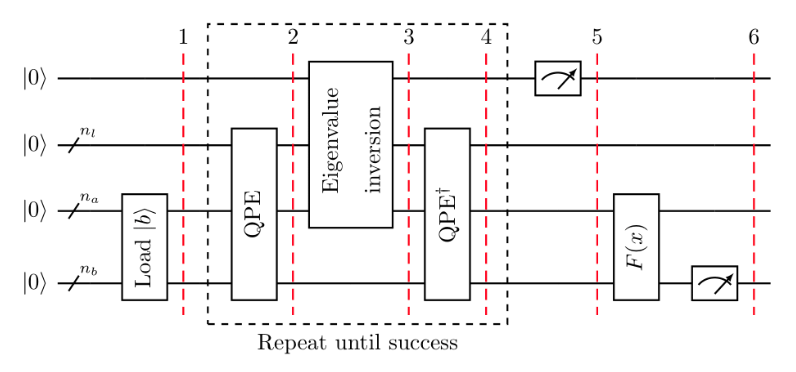

1\. 载入数据$|b\rangle \in \mathbb{C}^{N}$并执行转换：

$${|0\rangle}_{n_{b} } \mapsto {|b\rangle}_{n_{b} }$$

2\. 应用如下量子相位估计（QPE）：

$$U = e^{\text{iAt} }: = \sum_{j = 0}^{N - 1}{e^{i\lambda_{j}t}\left| u_{j} \right\rangle\left\langle u_{j} \right|}$$

以矩阵$A$的本征基所表示寄存器的量子态现为：

$$\sum_{j = 0}^{N - 1}{b_{j}\left| \lambda_{j} \right\rangle_{n_{l} }\left\langle u_{j} \right|_{n_{b} } }$$

其中$\left| \lambda_{j} \right\rangle_{n_{l} }$代表$\lambda_{j}$的$n_{l}$-比特的二进制表示。

3\.
添加一个辅助量子位并应用一个以$\left| \lambda_{j} \right\rangle$为条件的旋转，

$$\sum_{j = 0}^{N - 1}{b_{j}\left| \lambda_{j} \right\rangle_{n_{l} }\left\langle u_{j} \right|_{n_{b} } }\left( \sqrt{1 - \frac{C^{2} }{\lambda_{j}^{2} } }\left| 0 \right\rangle + \frac{C}{\lambda}\left| 1 \right\rangle \right)$$

其中$C$是归一化常量。

4\. 应用$\text{QPE}^{\dagger}$。通过忽略自QPE的可能错误，其结果为：

$$\sum_{j = 0}^{N - 1}{b_{j}\left| 0 \right\rangle_{n_{l} }\left\langle u_{j} \right|_{n_{b} } }\left( \sqrt{1 - \frac{C^{2} }{\lambda_{j}^{2} } }\left| 0 \right\rangle + \frac{C}{\lambda}\left| 1 \right\rangle \right)$$

5\. 以计算基测量辅助量子位。如果测量结果为$1$，则该寄存器处于后测状态：

$$
\left( \sqrt{\frac{1}{\sum_{j = 0}^{N - 1}{ {|b_{j}|}^{2}/{|\lambda_{j}|}^{2} } } } \right)\sum_{j = 0}^{N - 1}{b_{j}\left| 0 \right\rangle_{n_{l} }\left| u_{j} \right\rangle_{n_{b} } }
$$

相当于归一化因子对应于相应的解。

6\.
应用一个可观测$M$来计算$F\left( x \right) ≔ \left\langle x \right|M\left| x \right\rangle$。

##### C. HHL中的量子相位估计

量子相位估计已在第3章详细讨论过了。然而，由于这个量子过程是HHL算法的核心所在，我们需要在此回顾一下其定义。大致说来，量子相位估计是在给定本征向量为$\left| \psi \right\rangle_{m}$以及本征值为$e^{2\pi i\theta}$的一个幺正变换$U$中找出$\theta$的过程。我们可以正式定义如下。

**定义：**令$U \in \mathbb{C}^{2^{m} \times 2^{m} }$是一个幺正矩阵，且令$\left| \psi \right\rangle_{m} \in \mathbb{C}^{2^{m} }$是所对应本征值$e^{2\pi i\theta}$的本征向量之一。**量子相位估计算法**（**QPE**）接收自$U$的U-gate以及态$\left| 0 \right\rangle_{n}\left| \psi \right\rangle_{m}$作为输入并返回态$\left| \widetilde{\theta} \right\rangle_{n}\left| \psi \right\rangle_{m}$。此处的$\widetilde{\theta}$表示对$2^{n}\theta$的二进制近似，下标$n$表示截断至$n$位。

$$QPE(U,\left| 0 \right\rangle_{n}\left| \psi \right\rangle_{m}) = \left| \widetilde{\theta} \right\rangle_{n}\left| \psi \right\rangle_{m}$$

对于HHL,我们将使用$U = e^{\text{iAt} }$的QPE，其中$A$是与我们要求解的方程组关联的矩阵。在本例中：

$$e^{\text{iAt} } = \sum_{j = 0}^{N - 1}{e^{i\lambda_{j}t}\left| u_{j} \right\rangle\left\langle u_{j} \right|}$$

因此，对于拥有本征值为$e^{i\lambda_{j}t}$的本征向量$\left| u_{j} \right\rangle_{n_{b} }$，QPE将会输出$\left| \widetilde{\lambda_{j} } \right\rangle_{n_{l} }\left| u_{j} \right\rangle_{n_{b} }$。其中$\widetilde{\lambda_{j} }$表示对$2^{n_{l} }\frac{\lambda_{j}t}{2\pi}$的$n_{l}$位的二进制估计。因此，如果每个$\lambda_{j}$都可以用$n_{l}$位精确表示：

$$QPE(e^{\text{iAt} },\sum_{j = 0}^{N - 1}{b_{j}\left| 0 \right\rangle_{n_{l} }\left| u_{j} \right\rangle_{n_{b} } }) = \sum_{j = 0}^{N - 1}{b_{j}\left| \lambda_{j} \right\rangle_{n_{l} }\left| u_{j} \right\rangle_{n_{b} } }$$

##### D. 非精确QPE

在现实中，应用QPE之后寄存器的量子态被初始化为态：

$$\sum_{j = 0}^{N - 1}b_{j}\left( \sum_{l = 0}^{2^{n_{l} } - 1}{\alpha_{l|j}|l\rangle_{n_{l} } } \right)|u_{j}\rangle_{n_{b} }$$

其中：

$$\alpha_{l|j} = \frac{1}{2^{n_{l} } }\sum_{k = 0}^{2^{n_{l} } - 1}\left( e^{2\pi i(\frac{\lambda_{j}t}{2\pi} - \frac{l}{2^{n_{l} } })} \right)^{k}$$

若用$\overset{\sim}{\lambda_{j} }$表示对$\lambda_{j}$的$n_{l}$位最佳近似，$1 \leq j \leq N$。然后我们可以重新标记$n_{l}$寄存器，使$\alpha_{l|j}$表示$|l + {\overset{\sim}{\lambda} }_{j}\rangle_{n_{l} }$的幅值：

$$\alpha_{l|j}: = \frac{1}{2^{n_{l} } }\sum_{k = 0}^{2^{n_{l} } - 1}\left( e^{2\pi i(\frac{\lambda_{j}t}{2\pi} - \frac{l + \overset{\sim}{\lambda_{j} } }{2^{n_{l} } })} \right)^{k}$$

如果每一$\frac{\lambda_{j}t}{2\pi}$都能精确表示为$n_{l}$位二进制，那么$\forall j$都有$\frac{\lambda_{j}t}{2\pi} = \frac{ {\overset{\sim}{\lambda} }_{j} }{2^{n_{l} } }$。因此对于任一$1 \leq j \leq N$，在$\forall l \neq 0$时都有$\alpha_{0|j} = 1$以及$\alpha_{0|j} = 0$。只有在这种情况下我们才可以写出应用QPE后的寄存器状态：

$$\sum_{j = 0}^{N - 1}{b_{j}|\lambda_{j}\rangle_{n_{l} }|u_{j}\rangle_{n_{b} } }$$

否则$|\alpha_{0|j}|$会很大，当且仅当$\frac{\lambda_{j}t}{2\pi} \approx \frac{l + {\overset{\sim}{\lambda} }_{j} }{2^{n_{l} } }$，此时寄存器的状态为：

$$\sum_{j = 0}^{N - 1}{}\sum_{l = 0}^{2^{n_{l} } - 1}{\alpha_{l|j}b_{j}|l\rangle_{n_{l} }|u_{j}\rangle_{n_{b} } }$$

#### 3. 示例：4-量子比特HHL

让我们以简介中的一个小例子来说明这一算法。该示例为：

$$A = \begin{pmatrix}
1 & - 1/3 \\
 - 1/3 & 1 \\
\end{pmatrix}\ \text{和}\text{\ }|b\rangle = \begin{pmatrix}
1 \\
0 \\
\end{pmatrix}$$

我们将使用$n_{b} = 1$个量子比特来表示$\left| b \right\rangle$以及之后的解$\left| x \right\rangle$，$n_{l} = 2$个量子比特存储本征值的二进制表示，$1$个辅助量子比特来存储是否有条件旋转，因此该算法是有效的。

为了说明该算法，我们将作弊计算$A$的特征值，以便能够选择$t$以获得$n_{l}$-寄存器中被重新缩放特征值的精确二进制表示。但是，请记住对于HHL算法的实现，不需要先前的特征值知识。话虽如此，经过简短的计算将得出：

$$\lambda_{1} = 2/3\ \text{和}\text{\ }\lambda_{2} = 4/3$$

回顾前一节中的内容我们得知QPE将会输出$n_{l}$位（本示例中为$2$位）对于$\frac{\lambda_{j}t}{2\pi}$的二进制近似。因此，如果我们设

$$t = 2\pi \cdot \frac{3}{8}$$

那么QPE会给出的$2$位二进制的近似为：

$$\frac{\lambda_{1}t}{2\pi} = 1/4\ \text{和}\text{\ }\frac{\lambda_{2}t}{2\pi} = 1/2$$

分别对应于：

$$|01\rangle_{n_{l} }\text{\ }\text{和}\text{\ }|10\rangle_{n_{l} }$$

此时的本征向量分别为：

$$|u_{1}\rangle = (\begin{matrix}
1 \\
 - 1 \\
\end{matrix})\ \text{和}\text{\ }|u_{2}\rangle = (\begin{matrix}
1 \\
1 \\
\end{matrix})$$

[再次强调对于HHL的实现不需要计算本征向量。]{.ul}实际上，维数为$N$的一般厄米矩阵$A$最多可以具有$N$个不同的本征值，因此计算过程将花费$\mathcal{O(}N)$的时间，量子计算的优势就会丧失。

然后，我们可以将$|b\rangle$写在$A$的本征基上：

$$|b\rangle_{n_{b} } = \sum_{j = 1}^{2}{\frac{1}{\sqrt{2} }|u_{j}\rangle_{n_{b} } }$$

至此我们已经为经历HHL算法的不同步骤做好了准备。

1\. 因为$|b\rangle = |0\rangle$，所以本例中的状态设置很简单。

2\. 应用QPE会生成：

$$\frac{1}{\sqrt{2} }|01\rangle|u_{1}\rangle + \frac{1}{\sqrt{2} }|10\rangle|u_{2}\rangle$$

3\. $C = 3/8$的条件旋转可抵消本征值的重新缩放，从而得到：

$$\frac{1}{\sqrt{2} }|01\rangle|u_{1}\rangle\left( \sqrt{1 - \frac{(3/8)^{2} }{(1/4)^{2} } }|0\rangle + \frac{3/8}{1/4}|1\rangle \right) + \frac{1}{\sqrt{2} }|10\rangle|u_{2}\rangle\left( \sqrt{1 - \frac{(3/8)^{2} }{(1/2)^{2} } }|0\rangle + \frac{3/8}{1/2}|1\rangle \right)$$

$$= \frac{1}{\sqrt{2} }|01\rangle|u_{1}\rangle\left( \sqrt{1 - \frac{9}{4} }|0\rangle + \frac{3}{2}|1\rangle \right) + \frac{1}{\sqrt{2} }|10\rangle|u_{2}\rangle\left( \sqrt{1 - \frac{9}{16} }|0\rangle + \frac{3}{4}|1\rangle \right)$$

4\. 在应用$\text{QPE}^{\dagger}$后，量子计算机处于态：

$$\frac{1}{\sqrt{2} }|00\rangle|u_{1}\rangle\left( \sqrt{1 - \frac{9}{4} }|0\rangle + \frac{3}{2}|1\rangle \right) + \frac{1}{\sqrt{2} }|00\rangle|u_{2}\rangle\left( \sqrt{1 - \frac{9}{16} }|0\rangle + \frac{3}{4}|1\rangle \right)$$

5\. 在辅助量子比特测得结果为$1$时，状态为：

$$\frac{\frac{1}{\sqrt{2} }|00\rangle|u_{1}\rangle\frac{3}{2}|1\rangle + \frac{1}{\sqrt{2} }|00\rangle|u_{2}\rangle\frac{3}{4}|1\rangle}{\sqrt{45/32} }$$

经快速计算表明：

$$\frac{\frac{3}{2\sqrt{2} }|u_{1}\rangle + \frac{3}{4\sqrt{2} }|u_{2}\rangle}{\sqrt{45/32} } = \frac{|x\rangle}{||x||}$$

6\.
此时无需使用额外的量子门，我们就可以计算出$|x|$的范数：自上一步中在辅助量子位中测得$1$的概率。

$$P\lbrack|1\rangle\rbrack = {(\frac{3}{2\sqrt{2} })}^{2} + {(\frac{3}{4\sqrt{2} })}^{2} = \frac{45}{32} = |||x\rangle||^{2}$$

#### 4. Qiskit实现

至此我们已经由示例解析地解决了问题，我们将使用该示例来说明如何在量子模拟器和实际硬件上运行HHL。对于量子模拟器，Qiskit
Aqua已提供了HHL算法的实现，该算法要求矩阵$A$和$|b\rangle$作为基本输入。其主要优点在于可以采用一般的厄米矩阵和任意初始状态作为输入。这意味着该算法是为通用目的而设计，并未针对特定问题地优化回路，如果您地目标是在现有的实际硬件上运行该回路，这就有问题了。在撰写本文时，现有的量子计算机噪声很大，只能运行小型回路。因此，在第4.B节中将会看到一个已优化的回路，该回路可用于示例所属的一类问题，同时提及了处理量子计算机噪声的现有程序。

##### A．在模拟器上运行HHL：一般方法

要运行Qiskit
Aqua提供的HHL算法，只需导入正确的模块并设置如下参数。在上文中可运行的示例中，我们设置哈密顿模拟的时间为$t = 2\pi \cdot \frac{3}{8}$，然而我们将会在不设置此参数的情况下运行模拟，以表明对于本征值的了解并非必须。虽然如此，如果矩阵有一些可能会获得本征值信息的结构，就可以使用它来选择一个合适的$t$，以提高HHL所返回解的准确性。运行算法时设置时间$t = 2\pi \cdot \frac{3}{8}$，如果操作正确则解的保真度应为$1$。

> from qiskit import Aer
>
> from qiskit.circuit.library import QFT
>
> from qiskit.aqua import QuantumInstance, aqua_globals
>
> from qiskit.quantum_info import state_fidelity
>
> from qiskit.aqua.algorithms import HHL, NumPyLSsolver
>
> from qiskit.aqua.components.eigs import EigsQPE
>
> from qiskit.aqua.components.reciprocals import LookupRotation
>
> from qiskit.aqua.operators import MatrixOperator
>
> from qiskit.aqua.components.initial_states import Custom
>
> import numpy as np
>
> def create_eigs(matrix, num_ancillae, num_time_slices,
> negative_evals):
>
> ne_qfts = \[None, None\]
>
> if negative_evals:
>
> num_ancillae += 1
>
> ne_qfts = \[QFT(num_ancillae - 1), QFT(num_ancillae - 1).inverse()\]
>
> return EigsQPE(MatrixOperator(matrix=matrix),
>
> QFT(num_ancillae).inverse(),
>
> num_time_slices=num_time_slices,
>
> num_ancillae=num_ancillae,
>
> expansion_mode=\'suzuki\',
>
> expansion_order=2,
>
> evo_time=None, \# This is t, can set to: np.pi\*3/4
>
> negative_evals=negative_evals,
>
> ne_qfts=ne_qfts)

下面的函数用于计算HHL算法返回解的保真度。

> def fidelity(hhl, ref):
>
> solution_hhl_normed = hhl / np.linalg.norm(hhl)
>
> solution_ref_normed = ref / np.linalg.norm(ref)
>
> fidelity = state_fidelity(solution_hhl_normed, solution_ref_normed)
>
> print(\"Fidelity:\\t\\t %f\" % fidelity)
>
> matrix = \[\[1, -1/3\], \[-1/3, 1\]\]
>
> vector = \[1, 0\]
>
> orig_size = len(vector)
>
> matrix, vector, truncate_powerdim, truncate_hermitian =
> HHL.matrix_resize(matrix, vector)
>
> \# Initialize eigenvalue finding module
>
> eigs = create_eigs(matrix, 3, 50, False)
>
> num_q, num_a = eigs.get_register_sizes()
>
> \# Initialize initial state module
>
> init_state = Custom(num_q, state_vector=vector)
>
> \# Initialize reciprocal rotation module
>
> reci = LookupRotation(negative_evals=eigs.\_negative_evals,
> evo_time=eigs.\_evo_time)
>
> algo = HHL(matrix, vector, truncate_powerdim, truncate_hermitian,
> eigs,
>
> init_state, reci, num_q, num_a, orig_size)

选择$t = 2\pi \cdot \frac{3}{8}$的理由是重新缩放的本征值可以用$2$个二进制位精确表示。由于现在不是这种情况，因此将是近似表示，因此QPE不精确，所返回的解也将是近似解。

> result =
> algo.run(QuantumInstance(Aer.get_backend(\'statevector_simulator\')))
>
> print(\"Solution:\\t\\t\", np.round(result\[\'solution\'\], 5))
>
> result_ref = NumPyLSsolver(matrix, vector).run()
>
> print(\"Classical Solution:\\t\", np.round(result_ref\[\'solution\'\],
> 5))
>
> print(\"Probability:\\t\\t %f\" % result\[\'probability_result\'\])
>
> fidelity(result\[\'solution\'\], result_ref\[\'solution\'\])
>
> 输出：
>
> Solution: \[1.13586-0.j 0.40896+0.j\]
>
> Classical Solution: \[1.125 0.375\]
>
> Probability: 0.056291
>
> Fidelity: 0.999432

我们可以打印出算法使用的资源。其中深度是施加到单个量子比特上最大量子门数量，而宽度定义为所需的量子比特数量。我们还将打印出CNOT的数量，因为该数量和宽度可以很好地说明在当前实际硬件上运行这一回路是否可行。

> print(\"circuit_width:\\t\", result\[\'circuit_info\'\]\[\'width\'\])
>
> print(\"circuit_depth:\\t\", result\[\'circuit_info\'\]\[\'depth\'\])
>
> print(\"CNOT gates:\\t\",
> result\[\'circuit_info\'\]\[\'operations\'\]\[\'cx\'\])
>
> 输出：
>
> circuit_width: 7
>
> circuit_depth: 102
>
> CNOT gates: 54

##### B. 在真实设备上运行HHL：优化示例

上一节中我们运行了Qiskit中提供的标准算法，并看到其使用了$7$个量子比特，深度为$102$个量子门，总共需要$54$个CNOT门。这些数量对于当前可用的硬件不可行，因此需要缩减这些数量。目标是将CNOT的数量减少$5$倍，因其的保真度比单个量子比特门差。此外，正如问题的原始说明一样，我们可以将量子比特的数量减少到$4$个：Qiskit的方法是为解决一般问题而编写的，这就是为什么需要$3$个额外辅助量子比特的原因。

然而，仅仅减少量子门和量子比特的数量并不能很好地近似实际硬件上的解。其原因为存在两个误差的来源：运行电路和读取时发生的误差。

Qiskit提供了一个模块，可通过单独准备和测量所有基态来减少读取误差，详细处理方法请参阅Dewes等人的论文^\[3\]^。为了处理回路运行期间发生的误差，可以用Richardson外推法将回路运行三次，期间每个CNOT门分别替换为$1$、$3$和$5$个CNOT门，可将误差减少至无限趋近零^\[4\]^。这一想法是理论上三个回路应该产生相同的结果，但在实际的硬件中添加CNOT意味着放大误差。既然我们知道已经获得了误差放大后的结果，并且可以估计每种情况下误差放大了多少，那么就可以通过重新组合这些数量来得到一个新的结果，这一结果比以前得到的任何值都更接近解析解。

下面我们给出了可用于任何形式问题的优化回路：

$$A = \begin{pmatrix}
a & b \\
b & a \\
\end{pmatrix}\text{和}\text{\ }\left| b \right\rangle = \begin{pmatrix}
\text{co}s\left( \theta \right) \\
\text{si}n\left( \theta \right) \\
\end{pmatrix}，其中a,b,\theta \in \mathbb{R}$$

下面的优化提取自三对角对称矩阵的HHL工作^\[\[5\]\]^，这一特殊的回路通过UniversalQCompiler软件导出^\[\[6\]\](\#qcompiler)^。

> from qiskit import QuantumRegister, QuantumCircuit
>
> import numpy as np
>
> t = 2 \# This is not optimal; As an exercise, set this to the
>
> \# value that will get the best results. See section 8 for solution.
>
> nqubits = 4 \# Total number of qubits
>
> nb = 1 \# Number of qubits representing the solution
>
> nl = 2 \# Number of qubits representing the eigenvalues
>
> theta = 0 \# Angle defining \|b\>
>
> a = 1 \# Matrix diagonal
>
> b = -1/3 \# Matrix off-diagonal
>
> \# Initialise the quantum and classical registers
>
> qr = QuantumRegister(nqubits)
>
> \# Create a Quantum Circuit
>
> qc = QuantumCircuit(qr)
>
> qrb = qr\[0:nb\]
>
> qrl = qr\[nb:nb+nl\]
>
> qra = qr\[nb+nl:nb+nl+1\]
>
> \# State preparation.
>
> qc.ry(2\*theta, qrb\[0\])
>
> \# QPE with e\^{iAt}
>
> for qu in qrl:
>
> qc.h(qu)
>
> qc.u1(a\*t, qrl\[0\])
>
> qc.u1(a\*t\*2, qrl\[1\])
>
> qc.u3(b\*t, -np.pi/2, np.pi/2, qrb\[0\])
>
> \# Controlled e\^{iAt} on \\lambda\_{1}:
>
> params=b\*t
>
> qc.u1(np.pi/2,qrb\[0\])
>
> qc.cx(qrl\[0\],qrb\[0\])
>
> qc.ry(params,qrb\[0\])
>
> qc.cx(qrl\[0\],qrb\[0\])
>
> qc.ry(-params,qrb\[0\])
>
> qc.u1(3\*np.pi/2,qrb\[0\])
>
> \# Controlled e\^{2iAt} on \\lambda\_{2}:
>
> params = b\*t\*2
>
> qc.u1(np.pi/2,qrb\[0\])
>
> qc.cx(qrl\[1\],qrb\[0\])
>
> qc.ry(params,qrb\[0\])
>
> qc.cx(qrl\[1\],qrb\[0\])
>
> qc.ry(-params,qrb\[0\])
>
> qc.u1(3\*np.pi/2,qrb\[0\])
>
> \# Inverse QFT
>
> qc.h(qrl\[1\])
>
> qc.rz(-np.pi/4,qrl\[1\])
>
> qc.cx(qrl\[0\],qrl\[1\])
>
> qc.rz(np.pi/4,qrl\[1\])
>
> qc.cx(qrl\[0\],qrl\[1\])
>
> qc.rz(-np.pi/4,qrl\[0\])
>
> qc.h(qrl\[0\])
>
> \# Eigenvalue rotation
>
> t1=(-np.pi +np.pi/3 - 2\*np.arcsin(1/3))/4
>
> t2=(-np.pi -np.pi/3 + 2\*np.arcsin(1/3))/4
>
> t3=(np.pi -np.pi/3 - 2\*np.arcsin(1/3))/4
>
> t4=(np.pi +np.pi/3 + 2\*np.arcsin(1/3))/4
>
> qc.cx(qrl\[1\],qra\[0\])
>
> qc.ry(t1,qra\[0\])
>
> qc.cx(qrl\[0\],qra\[0\])
>
> qc.ry(t2,qra\[0\])
>
> qc.cx(qrl\[1\],qra\[0\])
>
> qc.ry(t3,qra\[0\])
>
> qc.cx(qrl\[0\],qra\[0\])
>
> qc.ry(t4,qra\[0\])
>
> qc.measure_all()
>
> print(\"Depth: %i\" % qc.depth())
>
> print(\"CNOTS: %i\" % qc.count_ops()\[\'cx\'\])
>
> qc.draw(fold=100)
>
> 输出：
>
> Depth: 26
>
> CNOTS: 10

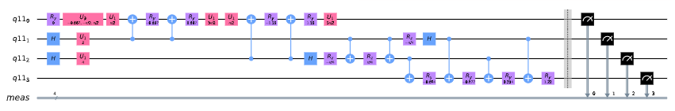

下面的代码将我们的回路、真正的硬件后端和想要使用的量子比特集作为输入，并返回可以在指定设备上运行的实例。用$3$个和$5$个CNOT创建的电路是相同的，但是需要用正确的量子回路调用transpile方法。

真实的硬件设备需要定期重新校准，特定的量子比特或门的保真度会随着时间而改变。此外，不同的芯片有不同的联结度。如果尝试运行一个回路，在没有连接到指定设备上的两个量子比特之间执行一个二量子比特的门，transpiler将会添加交换门。因此在运行以下代码之前，最好先查阅IBM
Q
Experience页面^\[\[7\]\])^，并在给定时间选择一组连接正确且错误率最低的量子比特。

from qiskit import execute, BasicAer, ClassicalRegister, IBMQ

from qiskit.compiler import transpile

from qiskit.ignis.mitigation.measurement import (complete_meas_cal, \#
Measurement error mitigation functions

CompleteMeasFitter,

MeasurementFilter)

provider = IBMQ.load_account()

backend = provider.get_backend(\'ibmqx2\') \# calibrate using real
hardware

layout = \[2,3,0,4\]

chip_qubits = 5

\# Transpiled circuit for the real hardware

qc_qa_cx = transpile(qc, backend=backend, initial_layout=layout)

下一步是创建额外的电路来减少读出错误^\[3\]^。

> meas_cals, state_labels = complete_meas_cal(qubit_list=layout,
> qr=QuantumRegister(chip_qubits))
>
> qcs = meas_cals + \[qc_qa_cx\]
>
> shots = 10
>
> job = execute(qcs, backend=backend, shots=shots, optimization_level=0)

下图^\[5\]^显示了在$10$种不同的初始状态下在实际硬件上运行上述电路的结果。$x$轴分别代表每一种情况下初始状态的角度$\theta$。在减少读取误差以及从具有$1$个，$3$个和$5$个CNOT回路的结果中推断出该回路运行过程中出现的误差之后可获得结果。

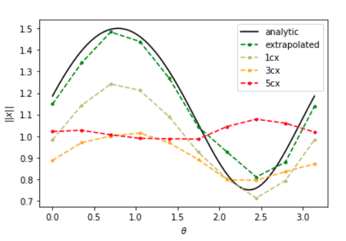

在没有误差减小或自CNOT的外推下的结果比较：

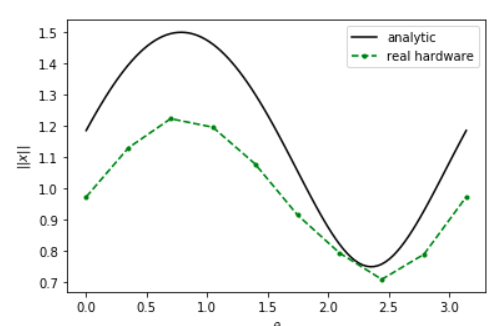

#### 8. 练习

1\. 将运行时间"evo_time"设置为$2\pi(3/8)$，此时的保真度应为$1$。

##### 真实设备：

1\. 设置优化示例的时间参数。

**解**

最好的结果是设置$t = 2.344915690192344$，以便可以精确表示最小的本征值，因其逆在解中的贡献最大。

2\.
从给定回路"qc"为$3$和$5$个CNOT创建转换回路。在创建回路时必须添加屏障（barrier），以便在使用transpile()方法时不会取消这些连续的CNOT门。

3\. 在实际硬件上运行回路并对结果进行二次拟合以得出外推值。

#### 9. 参考文献

1\. J. R. Shewchuk. An Introduction to the Conjugate Gradient Method
Without the Agonizing Pain. Technical Report CMU-CS-94-125, School of
Computer Science, Carnegie Mellon University, Pittsburgh, Pennsylvania,
March 1994.

2\. A. W. Harrow, A. Hassidim, and S. Lloyd, "Quantum algorithm for
linear systems of equations," Phys. Rev. Lett. 103.15 (2009), p. 150502.

3\. A. Dewes, F. R. Ong, V. Schmitt, R. Lauro, N. Boulant, P. Bertet, D.
Vion, and D. Esteve, "Characterization of a two-transmon processor with
individual single-shot qubit readout," Phys. Rev. Lett. 108, 057002
(2012).

4\. N. Stamatopoulos, D. J. Egger, Y. Sun, C. Zoufal, R. Iten, N. Shen,
and S. Woerner, "Option Pricing using Quantum Computers,"
arXiv:1905.02666 .

5\. A. Carrera Vazquez, A. Frisch, D. Steenken, H. S. Barowski, R.
Hiptmair, and S. Woerner, "Enhancing Quantum Linear System Algorithm by
Richardson Extrapolation," (to be included).

6\. R. Iten, O. Reardon-Smith, L. Mondada, E. Redmond, R. Singh Kohli,
R. Colbeck, "Introduction to UniversalQCompiler," arXiv:1904.01072 .

7\. https://quantum-computing.ibm.com/ .

8\. D. Bucher, J. Mueggenburg, G. Kus, I. Haide, S. Deutschle, H.
Barowski, D. Steenken, A. Frisch, \"Qiskit Aqua: Solving linear systems
of equations with the HHL algorithm\"
https://github.com/Qiskit/qiskit-tutorials/blob/master/legacy_tutorials/aqua/linear_systems_of_equations.ipynb\"

### 4.1.2 使用VQE进行分子模拟

在本节中，我们将介绍变分量子特征值求解算法（Variational Quantum
Eigensolver，**VDE**），给出使用的理由，对必要的理论进行解释，并其在寻找分子基态能量中的应用给出演示。

#### 内容

1\. 简介

2\. 量子力学的变分法

2.1 数学背景

2.2 基态边界

3\. 变分量子特征值求解算法

3.1 变分形式

3.2 简单变分形式

3.3 参数优化

3.4 单量子比特变分形式

3.5 常见变分形式的结构

4\. 在Qiskit中实现VDE

4.1 在态向量模拟器上运行VDE

4.2 在包含噪声的模拟器上运行VDE

5\. 练习

6\. 参考文献

#### 1. 简介

在许多应用中找出矩阵的最小本征值很重要。例如在化学中表征某分子厄米矩阵的最小本征值是该系统的基态能量。也许在将来可以使用量子相位估计算法来找到最小本征值。然而，其在有用问题上的实现所要求的回路深度超过了NISQ
era可用硬件的极限。因此Peruzzo等在在2014年提出了使用大量浅回路（shallower
circuit\[1\]）估计分子基态能量的VDE方法。

其正式的陈述为：给定一个厄米矩阵$H$及其未知最小本征值$\lambda_{\min}$，以及与其相关的本征态$|\psi_{\min}\rangle$，VDE给出了$\lambda_{\min}$边界的估计$\lambda_{\theta}$。

$$\lambda_{\min} \leq \lambda_{\theta} \equiv \langle\psi(\theta)|H|\psi(\theta)\rangle$$

其中$|\psi(\theta)\rangle$是与$\lambda_{\theta}$相关的本征态。通过在任意的开始态$|\psi\rangle$上应用一个由$U(\theta)$代表的参数化回路，该算法可以在态$|\psi_{\min}\rangle$上获取一个估计$U(\theta)|\psi\rangle \equiv |\psi(\theta)\rangle$。这一估计通过经典控制器不断地改变参数$\theta$以使$\langle\psi(\theta)|H|\psi(\theta)\rangle$的期望值最小化，从而实现迭代优化。

#### 2. 量子力学的变分法

##### 2.1 数学背景

VQE是量子力学变分法的应用。为了更好地理解变分法，此处给出了一些初步的数学背景。矩阵$A$的本征向量$|\psi_{i}\rangle$在与标量乘法常数（特征值$\lambda_{i}$）相乘的情况下保持不变。

$$A|\psi_{i}\rangle = \lambda_{i}|\psi_{i}\rangle$$

此外，当矩阵$H$等于其自身的共轭转置时就是一个厄米矩阵。

$$H = H^{\dagger}$$

谱定理指出厄米矩阵的本征值必然是实数。因此任一$H$的本征值都有一个特性$\lambda_{i} = \lambda_{i}^{*}$。由于任一测量的结果必然是实数，所以厄米矩阵适用于描述量子系统的哈密顿量。此外$H$可以表示为：

$$H = \sum_{i = 1}^{N}{\lambda_{i}|\psi_{i}\rangle\langle\psi_{i}|}$$

其中的每一个$\lambda_{i}$都是对应于其本征态$|\psi_{i}\rangle$的本征值。此外，在任意量子态$|\psi\rangle$上可观测$H$的期望值如下：

$$\langle H\rangle_{\psi} \equiv \langle\psi|H|\psi\rangle$$

将$H$的表示形式替换为其特征向量的加权和

$$\langle H\rangle_{\psi} = \langle\psi|H|\psi\rangle = \langle\psi|\left( \sum_{i = 1}^{N}{\lambda_{i}\left| \psi_{i} \right\rangle\langle\psi_{i}|} \right)\left| \psi \right\rangle$$

$$= \sum_{i = 1}^{N}{\lambda_{i}\left\langle \psi \middle| \psi_{i} \right\rangle\left\langle \psi_{i} \middle| \psi \right\rangle}$$

$$= \sum_{i = 1}^{N}{\lambda_{i}|\langle\psi_{i}|\psi\rangle|^{2} }$$

上面的最后一个等式证明在任一状态下可观测的期望值可用与$H$相关的本征值作为权重表示成线性组合。而且线性组合中的每个权重都大于等于0，如$|\langle\psi_{i}|\psi\rangle|^{2} \geq 0$，所以显然：

$$\lambda_{\min} \leq \langle H\rangle_{\psi} = \langle\psi|H|\psi\rangle = \sum_{i = 1}^{N}{\lambda_{i}|\langle\psi_{i}|\psi\rangle|^{2} }$$

上面的等式就是著名的**变分法**（**variational method**,
在某些教材中也被称为变分原理）\[2\]。值得注意的是：上式表明任一波动函数的期望值始终至少为与$H$相关联的最小本征值。而且，态$|\psi_{\min}\rangle$的期望值由$\langle\psi_{\min}|H|\psi_{\min}\rangle = \langle\psi_{\min}|\lambda_{\min}|\psi_{\min}\rangle = \lambda_{\min}$给出。因此正如所期望$\langle H\rangle_{\psi_{\min} } = \lambda_{\min}$。

##### 2.2 基态边界

当用厄米矩阵$H$描述一个系统的哈密顿量时，该系统的基态能量$E_{\text{gs} }$是与$H$相关的最小本征值。通过任意选择一个波动函数$|\psi\rangle$（称为ansatz，【物】拟设（德语））作为近似$|\psi_{\min}\rangle$的初始猜测值，计算其期望值${\langle H\rangle}_{\psi}$，并通过迭代更新该波动函数可以得到哈密顿量基态能量的任意紧界。

#### 3. 变分量子本征值求解算法

##### 3.1 变分形式

改变拟设的系统方法要求在一台量子计算机上实现变分法。VQE通过使用具有固定形式的参数化回路来实现这一点。这种回路常称为*变分形式*（variational
form），其作用可以用线性变换$U(\theta)$表示。一个变分形式应用于开始状态$|\psi\rangle$（诸如：真空态$|0\rangle$或Hartree-Fock态）后生成输出状态$U(\theta)|\psi\rangle \equiv |\psi(\theta)\rangle$。在$|\psi(\theta)\rangle$上迭代优化的目的是生成一个期望值$\langle\psi(\theta)|H|\psi(\theta)\rangle \approx E_{\text{gs} } \equiv \lambda_{\min}$。理想情况下,尽管在实践中$|\psi(\theta)\rangle$贴近$|\psi_{\min}\rangle$（其中"贴近"由态保真度或曼哈顿距离表征），然而当事实并非如此时仍可获得有用的$E_{\text{gs} }$边界。

此外，具有多项式参数的固定变分形式只能生成指数大小希尔伯特空间中所有状态的多项式大小子空间的变换。因此存在各种变分形式。诸如Ry和RyRz是一些启发式设计，并没有考虑目标域。其他如UCCCD，则利用领域特定知识基于问题的结构生成近似值。常见的变体形式结构将在本节的后面部分进行更深入的讨论。

##### 3.2 简单变分形式

当构建一个变分形式时我们需要平衡两个相对的目标。在理想的情况下，$n$量子比特变分形式将能够生成任意可能的状态$|\psi\rangle$，其中$|\psi\rangle \in \mathbb{C}^{N}$和$N = 2^{n}$。然而，我们想要变分形式使用尽可能少的参数。此处，我们着眼于对满足第一个目标变分形式的构造给出直观的认识，而为了简单起见忽略第二个目标。

假设$n = 1$的情况。一个U3-gate接收三个参数$\theta$、$\phi$和$\lambda$，以及表示如下变换：

$$\begin{matrix}
U3(\theta,\phi,\lambda) = \begin{pmatrix}
\cos(\frac{\theta}{2}) & - e^{\text{iλ} }\sin(\frac{\theta}{2}) \\
e^{\text{iϕ} }\sin(\frac{\theta}{2}) & e^{i\lambda + i\phi}\cos(\frac{\theta}{2}) \\
\end{pmatrix} \\
\end{matrix}$$

上至全局相位都可以通过适当设置这些参数来实现任何可能的单个量子比特转换。因此对于单个量子比特的情况，回路给出了能够产生任何可能状态的变分形式：


此外，这一通用的"变分形式"仅具有3个参数，因此可以有效地进行优化。值得强调的是，生成任意状态的能力确保了在优化过程中，变分形式不会限制所取$H$的期望值所能达到的状态集。从而在理想情况下可确保最小期望值仅受经典优化器的功能限制。

对于两个量子比特的情况，可能会得出不平凡的通用变分形式，在这种情况下必须考虑两个物体的相互作用以及纠缠才能实现通用性。根据Shende等人提出的工作\[3\]，以下是通用参数化两个量子比特的示例：


允许由上述回路执行的变换由$U(\theta)$表示。当进行变分优化时，在$U\left( \theta \right)\left| \psi \right\rangle \equiv \left| \psi\left( \theta \right) \right\rangle \approx \left| \psi_{\min} \right\rangle$时$H$的期望值最小。通过公式化，$U(\theta)$会转变成任何可能的状态，因此这种变化形式可以在两个量子比特基态能量上获得任意紧密边界，而这仅受经典优化器功能的限制。

##### 3.3 参数优化

一旦选择了一种有效的参数化变分形式，依据变分方法必须对其参数进行优化，使目标哈密顿量的期望值最小。参数优化过程存在各种挑战。例如量子硬件具有多种类型的噪声，因此目标函数评价（能量计算）不一定能反映真实的目标函数。此外，一些优化器根据参数集的基数执行许多目标函数评估。应该根据应用程序的需求选择合适的优化器。

一种流行的优化策略是梯度下降（*gradient
decent*），其每个参数在产生最大局部能量变化的方向上进行更新。因此所执行的评估数量取决于需要优化参数的数量。这一方法允许算法在搜索空间中快速找到*局部最优*。但是，这种优化策略经常陷入不良的局部最优状态，并且在执行的回路评估数量方面的计算开销相对昂贵。虽然这是一种直观的优化策略，但不建议在VQE中使用。

同步扰动随机近似优化器（*SPSA：Simultaneous Perturbation Stochastic
Approximation
optimizer*）适用于优化噪声目标函数。SPSA仅需两次测量即可近似目标函数的梯度。此方法是通过以随机方式同步扰动所有参数来实现的，这与每个参数被独立扰动的梯度下降相反。在包含噪声的模拟器或实际硬件中使用VQE时，建议将SPSA作为经典的优化器。

当代价函数的评估中不存在噪声时（例如：将VQE与态向量模拟器一起使用时），各种经典优化器可能会有用。Qiskit
Aqua中所支持的两个此类优化器是序贯最小二乘规划优化器（*SLSQP：Sequential
Least Squares Programming
optimizer*）和线性近似优化器的约束优化（*COBYLA：Constrained
Optimization by Linear Approximation
optimizer*）。值得注意的是COBYLA每次优化迭代仅执行一次目标函数评估（因此评估次数与参数集的基数无关）。因此，如果目标函数是噪声免疫并且希望将执行的评估次数减至最少，则建议尝试使用COBYLA。

##### 3.4 单量子比特变分形式

现在，我们将使用简单的单量子比特变分形式来解决类似于基态能量估计的问题。具体来说给定一个随机概率向量$\overrightarrow{x}$，希望为单个量子比特变分形式确定可能的参数化，以使其输出接近$\overrightarrow{x}$的概率分布（其中，紧密度是根据两个概率之间的曼哈顿距离定义的向量）。

我们首先在Python中创建随机概率向量：

> import numpy as np
>
> np.random.seed(999999)
>
> target_distr = np.random.rand(2)
>
> \# We now convert the random vector into a valid probability vector
>
> target_distr /= sum(target_distr)

随后创建了一个以单个U3变分形式作为参数并返回相应的量子回路的函数：

> from qiskit import QuantumCircuit, ClassicalRegister, QuantumRegister
>
> def get_var_form(params):
>
> qr = QuantumRegister(1, name=\"q\")
>
> cr = ClassicalRegister(1, name=\'c\')
>
> qc = QuantumCircuit(qr, cr)
>
> qc.u3(params\[0\], params\[1\], params\[2\], qr\[0\])
>
> qc.measure(qr, cr\[0\])
>
> return qc

创建指定目标函数，其以变分形式的参数列表作为输入并返回与这些参数相关的代价：

> from qiskit import Aer, execute
>
> backend = Aer.get_backend(\"qasm_simulator\")
>
> NUM_SHOTS = 10000
>
> def get_probability_distribution(counts):
>
> output_distr = \[v / NUM_SHOTS for v in counts.values()\]
>
> if len(output_distr) == 1:
>
> output_distr.append(0)
>
> return output_distr
>
> def objective_function(params):
>
> \# Obtain a quantum circuit instance from the paramters
>
> qc = get_var_form(params)
>
> \# Execute the quantum circuit to obtain the probability distribution
> associated with the current parameters
>
> result = execute(qc, backend, shots=NUM_SHOTS).result()
>
> \# Obtain the counts for each measured state, and convert those counts
> into a probability vector
>
> output_distr = get_probability_distribution(result.get_counts(qc))
>
> \# Calculate the cost as the distance between the output distribution
> and the target distribution
>
> cost = sum(\[np.abs(output_distr\[i\] - target_distr\[i\]) for i in
> range(2)\])
>
> return cost

最后，创建COBYLA优化器的一个实例并运行算法。请注意：每次运行的输出都不一样。而且在接近的情况下，得到的分布可能与目标分布并不完全相同，但通过增加拍摄的次数会增加输出的准确性。

> from qiskit.aqua.components.optimizers import COBYLA
>
> \# Initialize the COBYLA optimizer
>
> optimizer = COBYLA(maxiter=500, tol=0.0001)
>
> \# Create the initial parameters (noting that our single qubit
> variational form has 3 parameters)
>
> params = np.random.rand(3)
>
> ret = optimizer.optimize(num_vars=3,
> objective_function=objective_function, initial_point=params)
>
> \# Obtain the output distribution using the final parameters
>
> qc = get_var_form(ret\[0\])
>
> counts = execute(qc, backend, shots=NUM_SHOTS).result().get_counts(qc)
>
> output_distr = get_probability_distribution(counts)
>
> print(\"Target Distribution:\", target_distr)
>
> print(\"Obtained Distribution:\", output_distr)
>
> print(\"Output Error (Manhattan Distance):\", ret\[1\])
>
> print(\"Parameters Found:\", ret\[0\])
>
> 输出：
>
> Target Distribution: \[0.51357006 0.48642994\]
>
> Obtained Distribution: \[0.5148, 0.4852\]
>
> Output Error (Manhattan Distance): 0.009140118738839131
>
> Parameters Found: \[1.59180522 1.23579418 0.65390252\]

##### 3.5 常见变分形式的结构

如前所述，多项式参数化变分形式不能生成任意状态的转换。变分形式可以分为两类，取决于如何处理这一限制。第一类变分形式使用领域或应用特定知识来限制可能的输出状态集。第二种方法使用启发式回路而不必具备预先的领域或应用的特定知识。

第一类变分形式利用问题域的特征来限制可能需要的转换集。例如，当计算一个分子的基态能量时，系统中的粒子数是预先明确的。因此，如果使用准确粒子数的初始状态，通过将变体形式限制为仅生成保留粒子的变换，可以大大减少跨越新变换子空间所需的参数数量。事实上，利用耦合簇理论的相似信息，变分形式UCCSD在从Hartree
Fock状态开始时，可以获得非常准确的分子基态能量估计结果。另一说明对领域特定知识利用的例子是考虑在真实的量子硬件上可实现的一组回路。现有的量子计算机，例如基于超导量子比特的计算机，其量子比特联结度有限。也就是说，在任意量子比特对上实现2-量子比特门是不可能的(不插入交换门)。因此，变分形式已经被构造为特定的量子计算机架构，其中的回路被特别调整，以便最大限度地利用先天可用的联结度和门的一个给定的量子设备。2017年时利用这种变分形式，在IBM量子计算机\[4\]上成功地实现了VQE，其作用是估算类似BeH~2~大小分子的基态能量。

在第二种方法中，将量子门分层以便可以在很宽的状态范围内获得良好的近似值。Qiskit
Aqua支持三种这样的变分形式：RyRz、Ry和SwapRz(我们将只讨论前两种)。所有这些变分形式都可接受多个用户指定的参数。其中的三个基本参数是系统中的量子比特数、深度设置和纠缠设置。变分形式的一个层指定了单个量子比特旋转和CX门的某种模式。深度设置表示变分形式应重复此模式多少次。通过增加深度设置，以增加必须优化参数的数量为代价，变分形式可生成的状态集会增加。最后，纠缠设置选择CX门的配置和隐式数。例如,当纠缠设置是线性时CX门按顺序应用于相邻的量子比特对上(因此会在每一个层上添加$n - 1$个CX门)。当纠缠设置为full时，CX门应用于每一层中的每一量子比特对。执行以下代码片段可以看到entanglement=\"full\"和entanglement=\"linear\"对应的RyRz电路:

> from qiskit.circuit.library import EfficientSU2
>
> entanglements = \[\"linear\", \"full\"\]
>
> for entanglement in entanglements:
>
> form = EfficientSU2(num_qubits=4, entanglement=entanglement)
>
> if entanglement == \"linear\":
>
> print(\"=============Linear Entanglement:=============\")
>
> else:
>
> print(\"=============Full Entanglement:=============\")
>
> \# We initialize all parameters to 0 for this demonstration
>
> display(form.draw(fold=100))
>
> print()

=============Linear Entanglement:=============


=============Full Entanglement:=============


其中假设将深度设置设置为$d$。且RyRz有$n \times (d + 1) \times 2$个参数，线性纠缠的Ry有$2n \times (d + \frac{1}{2})$个参数，全纠缠的Ry有$d \times n \times \frac{(n + 1)}{2} + n$个参数。

#### 4. 在Qiskit中实现VDE

本节中演示了使用编程方法实现VQE。Qiskit
Aqua还支持声明式实现，但是其所揭示关于底层算法的信息较少。该代码（特别是量子比特运算符的准备）基于Qiskit教程存储库中的代码(截止2019年7月，可以在<https://github.com/Qiskit/qiskit-tutorials>中找到)。

下面的库必须预先导入。

from qiskit.aqua.algorithms import VQE, NumPyEigensolver

import matplotlib.pyplot as plt

import numpy as np

from qiskit.chemistry.components.variational_forms import UCCSD

from qiskit.chemistry.components.initial_states import HartreeFock

from qiskit.circuit.library import EfficientSU2

from qiskit.aqua.components.optimizers import COBYLA, SPSA, SLSQP

from qiskit.aqua.operators import Z2Symmetries

from qiskit import IBMQ, BasicAer, Aer

from qiskit.chemistry.drivers import PySCFDriver, UnitsType

from qiskit.chemistry import FermionicOperator

from qiskit import IBMQ

from qiskit.aqua import QuantumInstance

from qiskit.ignis.mitigation.measurement import CompleteMeasFitter

from qiskit.providers.aer.noise import NoiseModel

##### 4.1 在态向量模拟器上运行VDE

我们演示了不同原子间距离下LiH的基态能量的计算。分子的驱动必须在每一个这样的距离上创建。请注意：在此实验中为了减少所使用的量子比特数量，我们冻结了核心并删除了两个未占用的轨道。第一步定义一个函数，该函数接受原子间距离最为参数并返回适当的量子比特运算符$H$以及有关该运算符的其他信息。

> def get_qubit_op(dist):
>
> driver = PySCFDriver(atom=\"Li .0 .0 .0; H .0 .0 \" + str(dist),
> unit=UnitsType.ANGSTROM,
>
> charge=0, spin=0, basis=\'sto3g\')
>
> molecule = driver.run()
>
> freeze_list = \[0\]
>
> remove_list = \[-3, -2\]
>
> repulsion_energy = molecule.nuclear_repulsion_energy
>
> num_particles = molecule.num_alpha + molecule.num_beta
>
> num_spin_orbitals = molecule.num_orbitals \* 2
>
> remove_list = \[x % molecule.num_orbitals for x in remove_list\]
>
> freeze_list = \[x % molecule.num_orbitals for x in freeze_list\]
>
> remove_list = \[x - len(freeze_list) for x in remove_list\]
>
> remove_list += \[x + molecule.num_orbitals - len(freeze_list) for x in
> remove_list\]
>
> freeze_list += \[x + molecule.num_orbitals for x in freeze_list\]
>
> ferOp = FermionicOperator(h1=molecule.one_body_integrals,
> h2=molecule.two_body_integrals)
>
> ferOp, energy_shift = ferOp.fermion_mode_freezing(freeze_list)
>
> num_spin_orbitals -= len(freeze_list)
>
> num_particles -= len(freeze_list)
>
> ferOp = ferOp.fermion_mode_elimination(remove_list)
>
> num_spin_orbitals -= len(remove_list)
>
> qubitOp = ferOp.mapping(map_type=\'parity\', threshold=0.00000001)
>
> qubitOp = Z2Symmetries.two_qubit_reduction(qubitOp, num_particles)
>
> shift = energy_shift + repulsion_energy
>
> return qubitOp, num_particles, num_spin_orbitals, shift

首先，使用量子比特算符和经典精确本征求解算法计算精确的基态能量。随后,初始状态$|\psi\rangle$被创建,这一VQE实例用于生成最终的拟设$\min_{\theta}(|\psi(\theta)\rangle)$。每个原子间距上的精确结果和VQE结果会被储存起来。观察由vqe.run(backend)\[\'energy\'\]
+
shift所给出的结果等于量$\min_{\theta}(\langle\psi(\theta)|H|\psi(\theta)\rangle)$，其中的最小值不一定是全局最小值。

当设置参数VQE(qubitOp, var_form, optimizer,
\'matrix\')初始化VQE实例时，在$\left| \psi\left( \theta \right) \right\rangle$上的期望值$H$由矩阵乘法直接计算得出。然而当使用真实设备或类似设置参数为VQE(qubitOp,
var_form, optimizer,
\'paulis\')的qasm_simulator的真实模拟器时，期望值的计算过程会更加复杂。一个哈密顿量可以表示为Pauli字串的总和，每个Pauli项作用在一个量子比特上，并依据所使用的映射所指定。每个Pauli字串都有一个对应的回路，该回路附加到与$|\psi(a)\rangle$相对应的回路上。随后，执行所有这些回路并将所有结果用于确定$|\psi(\theta)\rangle$上$H$的期望值。在下面的示例中，我们将使用矩阵模式初始化VQE实例，因此期望值是通过矩阵乘法直接计算所得。

请注意，下面的代码片段可能要运行几分钟才能完成。

> backend = BasicAer.get_backend(\"statevector_simulator\")
>
> distances = np.arange(0.5, 4.0, 0.1)
>
> exact_energies = \[\]
>
> vqe_energies = \[\]
>
> optimizer = SLSQP(maxiter=5)
>
> for dist in distances:
>
> qubitOp, num_particles, num_spin_orbitals, shift = get_qubit_op(dist)
>
> result = NumPyEigensolver(qubitOp).run()
>
> exact_energies.append(np.real(result.eigenvalues) + shift)
>
> initial_state = HartreeFock(
>
> num_spin_orbitals,
>
> num_particles,
>
> qubit_mapping=\'parity\'
>
> )
>
> var_form = UCCSD(
>
> num_orbitals=num_spin_orbitals,
>
> num_particles=num_particles,
>
> initial_state=initial_state,
>
> qubit_mapping=\'parity\'
>
> )
>
> vqe = VQE(qubitOp, var_form, optimizer)
>
> vqe_result = np.real(vqe.run(backend)\[\'eigenvalue\'\] + shift)
>
> vqe_energies.append(vqe_result)
>
> print(\"Interatomic Distance:\", np.round(dist, 2), \"VQE Result:\",
> vqe_result, \"Exact Energy:\", exact_energies\[-1\])
>
> print(\"All energies have been calculated\")

plt.plot(distances, exact_energies, label=\"Exact Energy\")

plt.plot(distances, vqe_energies, label=\"VQE Energy\")

plt.xlabel(\'Atomic distance (Angstrom)\')

plt.ylabel(\'Energy\')

plt.legend()

plt.show()

输出：

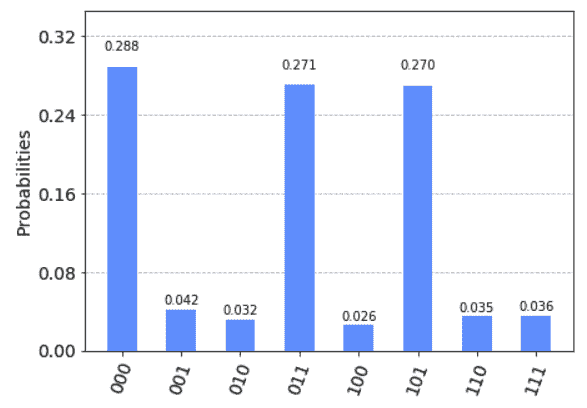

注意！VQE结果与精确结果非常接近，因此精确的能量曲线隐藏在VQE曲线中。

##### 4.2 在包含噪声的模拟器上运行VDE

在本节中，我们将使用含有噪声的模拟器计算H~2~的基态能量并缓解错误。

首先准备表示该分子哈密顿量的量子比特算子：

> driver = PySCFDriver(atom=\'H .0 .0 -0.3625; H .0 .0 0.3625\',
> unit=UnitsType.ANGSTROM, charge=0, spin=0, basis=\'sto3g\')
>
> molecule = driver.run()
>
> num_particles = molecule.num_alpha + molecule.num_beta
>
> qubitOp = FermionicOperator(h1=molecule.one_body_integrals,
> h2=molecule.two_body_integrals).mapping(map_type=\'parity\')
>
> qubitOp = Z2Symmetries.two_qubit_reduction(qubitOp, num_particles)

现在，我们从IBMQ提供程序加载设备耦合映射和噪声模型，并创建一个量子实例从而启用错误缓解功能：

> IBMQ.load_account()
>
> provider = IBMQ.get_provider(hub=\'ibm-q\')
>
> backend = Aer.get_backend(\"qasm_simulator\")
>
> device = provider.get_backend(\"ibmq_vigo\")
>
> coupling_map = device.configuration().coupling_map
>
> noise_model = NoiseModel.from_backend(device.properties())
>
> quantum_instance = QuantumInstance(backend=backend,
>
> shots=1000,
>
> noise_model=noise_model,
>
> coupling_map=coupling_map,
>
> measurement_error_mitigation_cls=CompleteMeasFitter,
>
> cals_matrix_refresh_period=30)

最后，我们必须配置优化器、变分形式和VQE实例。两个量子比特门回路的深度随着噪声的增加而增加，此处我们使用试探式变分形式(RYRZ)而非UCCSD，因为RYRZ的回路比UCCSD浅得多，并且其所使用的二量子位门也少得多。

运行以下代码可能需要几分钟时间。

> exact_solution = NumPyEigensolver(qubitOp).run()
>
> print(\"Exact Result:\", np.real(exact_solution.eigenvalues))
>
> optimizer = SPSA(max_trials=100)
>
> var_form = EfficientSU2(qubitOp.num_qubits, entanglement=\"linear\")
>
> vqe = VQE(qubitOp, var_form, optimizer=optimizer)
>
> ret = vqe.run(quantum_instance)
>
> vqe_result = np.real(ret\[\'eigenvalue\'\])
>
> print(\"VQE Result:\", vqe_result)
>
> 输出：
>
> Exact Result: \[-1.86712098\]
>
> VQE Result: -1.80040360007339

当噪音缓解被启用时，即使结果不符合化学精度(在精确结果的0.0016
Hartree范围内)，但也相当接近精确的解决方案了。

#### 5. 练习

1\. 给定一个哈密顿量$H$，保证其基态接近最大纠缠n个量子比特状态。
说明哪种变分形式（一种或多种形式）可能有效而准确地学习$H$的基态能量。
您也可以通过创建自己的变分形式并解释为何其适合于该哈密顿量。

2.当使用COBYLA优化器、参数shots=1000的qasm_simulator以及和包含60个泡利字串的哈密顿量时，通过计算回路的数量评估每次优化迭代时所执行的回路。

3\. 使用VQE估计原子间距为1.3Å的BeH~2~的基态能量。您可以通过替换atom=\"Li
.0 .0 .0; H .0 .0 \" + str(dist)为atom=\"Be .0 .0 .0; H .0 .0 -\" +
str(dist) + \"; H .0 .0 \" +
str(dist)来重用函数get_qubit_op(dist)，并通过get_qubit_op(1.3)调用该函数。请注意移除未占据的轨道并不能保持分子的化学精度。然而，为了将所需的量子比特数降低到6(从而允许在大多数笔记本电脑上进行有效的模拟)，这种精度的损失可以接受。虽然超出了本练习的范围，感兴趣的读者可以使用量子比特逐渐减少的操作来减少所需的量子比特数到7，而不会损失任何化学精度。

#### 6. 参考文献

1\. Peruzzo, Alberto, et al. \"A variational eigenvalue solver on a
photonic quantum processor.\" Nature communications 5 (2014): 4213.

2\. Griffiths, David J., and Darrell F. Schroeter. Introduction to
quantum mechanics. Cambridge University Press, 2018.

3\. Shende, Vivek V., Igor L. Markov, and Stephen S. Bullock. \"Minimal
universal two-qubit cnot-based circuits.\" arXiv preprint
quant-ph/0308033 (2003).

4\. Kandala, Abhinav, et al. \"Hardware-efficient variational quantum
eigensolver for small molecules and quantum magnets.\" Nature 549.7671
(2017): 242.

### 4.1.3 使用QAOA解决组合优化问题

在本节中我们将介绍组合优化问题，解释近似优化算法以及量子近似优化算法(QAOA：Quantum
Approximate Optimization
Algorithm)的工作原理，并给出一个可以在模拟器或5量子比特的量子芯片上运行的实例。

#### 内容

1\. 简介

2\. 示例

3\. 近似优化算法

4\. QAOA算法

5\. Qiskit实现

5.1 在模拟器上运行QAOA

5.2 在真实量子设备上运行QAOA

6\. 联系

7\. 参考文献

#### 1.简介

组合优化^\[1\]^是指在有限或可数无限的潜在解集中寻找最优解。最优性被定义为一些判别函数，其为最小化还是最大化，这些函数通常被称为代价函数。

在现实世界中有着各种类型的优化问题。某些包含最小化问题：成本、距离、遍历的长度、重量、加工时间、材料、能源消耗、对象数量。某些包含最大化问题：利润、价值、产出、回报、产量、效用、效率、容量、对象数量。任一最大化问题都可以用最小化问题来表示，反之亦然。以下给出了组合优化问题的一般形式：

$$\text{maximize\ }C(x)$$

$$\text{subject\ to\ }x \in S$$

其中$x \in S$是一个离散变量，$C:D \rightarrow \mathbb{R}$是代价函数。这一形式将域$S$映射至实数$\mathbb{R}$。变量$x$受制于一组约束并位于可行点的集合$S \subset D$之内。

在二元组合优化问题中，代价函数通常可以表示为在$x \in {\{ 0,1\} }^{n}$中$n$位字串的一个子集$Q \subset \lbrack n\rbrack$所有项的总和。代价函数$C$通常以如下标准形式书写：

$$C\left( x \right) = \sum_{\left( Q,\overline{Q} \right) \subset \left\lbrack n \right\rbrack}^{}w_{\left( Q,\overline{Q} \right)}\prod_{i \in Q}^{}x_{i}\prod_{j \in \overline{Q} }^{}\left( 1 - x_{j} \right)$$

其中$x_{i} \in \{ 0,1\}$以及$w_{(Q,\overline{Q})} \in \mathbb{R}$。我们想要找出使得$C(x)$最大时的$n$-比特字串$x$。

##### 1.1 对角哈密顿量

这一代价函数可以映射到一个在计算基上是对角的哈密顿量。给定代价函数$C$，哈密顿量就可以写成：

$$H = \sum_{x \in \{ 0,1\}^{n} }^{}{C(x)|x\rangle\langle x|}$$

其中$x \in \{ 0,1\}^{n}$标记计算基的状态$|x\rangle \in \mathbb{C}^{2^{n} }$。如果代价函数最多只有$k$项权值，如仅有$Q$给出贡献且仅涉及最多$Q \leq k$位，那么该对角哈密顿量也是权重为$k$的Pauli
$Z$算子的和。

哈密顿量$H$至Pauli
$Z$算子的扩展可以通过把每个二元变量$x_{i} \in \{ 0,1\}$代入矩阵$x_{i} \rightarrow 2^{- 1}(1 - Z_{i})$从成本函数$C$的规范展开中获得。此处的$Z_{i}$被视为作用于量子比特$i$的Pauli
$Z$算子，其对所有其他都为零。如：

$$Z_{i} = \begin{pmatrix}
1 & 0 \\
0 & - 1 \\
\end{pmatrix}$$

这意味着经典成本函数的自旋-哈密顿量可编码为仅涉及Pauli
$Z$算子的局部量子自旋哈密顿量$|Q|$。

$$H = \sum_{(Q,\overline{Q}) \subset \lbrack n\rbrack}^{}{w_{(Q,\overline{Q})}\frac{1}{2^{|Q| + |\overline{Q}|} } }\prod_{i \in Q}^{}{(1 - Z_{i})}\prod_{j \in \overline{Q} }^{}{(1 + Z_{j})}$$

现在，我们假设一小部分$w_{(Q,\overline{Q})}$为非零（多项式大部分在$n$中）。此外，我们还假设集合$|(Q,\overline{Q})|$有界且不会太大。这表明我们可以把代价函数和哈密顿量$H$写成$m$个局部项${\widehat{C} }_{k}$的和：

$$H = \sum_{k = 1}^{m}{\widehat{C} }_{k}$$

其中m和${\widehat{C} }_{k}$的支撑集都是合理有界。

#### 2. 示例

通过考虑两个例子来说明组合优化问题。我们将在Qiskit中实现第一个示例，但提供一系列练习来给出实现第二个示例的指导。

##### 2.1 （加权）*MAXCUT*

考虑一个$n$节点的无向图$G = (V,E)$，其中$|V| = n$的边权为$w_{\text{ij} } > 0$，对于$(j,k) \in E$
$w_{\text{ij} } = w_{\text{ji} }$。切割被定义为将原始集合V划分为两个子集。在这种情况下，需要优化的代价函数是两个不同子集连接点的边权之和，这些连接点横越（*crossing*）于切割之间。通过将$x_{i} = 0$或$x_{i} = 1$分配给每个节点$i$，可以尝试最大化全局利润函数（在这里和下面的求和中，索引为0,1，...n-1）。

$$C(\text{x}) = \sum_{i,j = 1}^{n}{w_{\text{ij} }x_{i}\left( 1 - x_{j} \right)}$$

为了简化符号，我们假设对于所有$(i,j) \in E$统一权重为$w_{\text{ij} } = 1$。为了在量子计算机上找到这个问题的解决方案，首先需要将其映射到如上所述的对角哈密顿量。我们把和写成集合$(i,j) = E$中边的和：

$$C(\text{x}) = \sum_{i,j = 1}^{n}{w_{\text{ij} }x_{i}\left( 1 - x_{j} \right)} = \sum_{(i,j) \in E}^{}\left( x_{i}\left( 1 - x_{j} \right) + x_{j}\left( 1 - x_{i} \right) \right)$$

要映射到自旋哈密顿量，我们需要对其进行赋值$x_{i} \rightarrow (1 - Z_{i})/2$，其中$Z_{i}$是本征值为$\pm 1$的泡利Z算子并获得$X \rightarrow H$

$$H = \sum_{(j,k) \in E}^{}{\frac{1}{2}\left( 1 - Z_{j}Z_{k} \right)}$$

这表明哈密顿量可以写成$m = |E|$局部项${\overset{\hat{} }{C} }_{e} = \frac{1}{2}\left( 1 - Z_{e1}Z_{e2} \right)$之和，其中$e = (e1,e2) \in E$。

##### 2.2 约束满意度问题与$\mathbf{\text{MAX} }\mathbf{3 -}\mathbf{\text{SAT} }$

组合优化问题的另一个示例是$3 - SAT$。此处的代价函数$C(\text{x}) = \sum_{k = 1}^{m}{c_{k}(\text{x})}$是条款$c_{k}(\text{x})$的和，该条款约束了参与这些条款的某些$\text{x} \in \{ 0,1\}^{n}$的3个比特的值，例如，考虑对于比特字串$\text{x} \in \{ 0,1\}^{133}$的$3 - SAT$示例：

$$c_{1}(\text{x}) = (1 - x_{1})(1 - x_{3})x_{132}$$

条款仅在将比特设置为$x_{1} = 0$、$x_{3} = 0$和$x_{132} = 1$满足要求。$3 - SAT$问题现在表诉为是否存在一个满足所有$m$条款的比特字串或其不存在。此决策问题是NP完全问题（NP-complete）的主要示例。

与之密切相关的优化问题$MAX3 - SAT$要求找到满足$C(x)$中条款最大数量的比特字串$x$。如果我们问在是否存在满足$m$个条款中$\overset{\sim}{m}$个以上的比特字串的问题，这当然又变为了决策问题，也就是NP完全问题。

#### 3. 近似优化算法

实际上，先前认为的$\text{MAXCUT}$和$MAX3 - SAT$问题都是NP难题（NP-Hard）\[1\]。事实证明，许多组合优化问题通常在计算上难以解决。鉴于这一事实，我们不能期望找到一种可证明其有效的算法，即可解决这些问题的规模为多项式运行时间的算法。这同时也适用于量子算法。解决此类问题有两种主要方法。第一种方法是近似算法，可以保证在多项式时间内找到指定精度的解。第二种方法是启发式算法，其没有多项式运行时间保证，但在某些此类问题的实例上表现良好。

近似优化算法有效且为近似解与问题之实际最优值之间的接近程度提供了可证明的保证。这一保证通常以*近似比*$\alpha \leq 0$的形式出现。概率近似优化算法可确保产生一个比特字串$\text{x}^{*} \in \{ 0,1\}^{n}$，因此在高概率的情况下具有正的$C_{\max} = \max_{\text{x} }C(\text{x})$

$$C_{\max} \geq C\left( \text{x}^{*} \right) \geq \alpha C_{\max}$$

对于$\text{MAXCUT}$问题Goemans和Williamson创建了一个著名近似算法\[2\]。该算法基于原始问题的SDP松弛与概率舍入技术相结合，该概率舍入技术产生了具有高概率的近似解$\text{x}^{*}$，其*近似比*为$\alpha \approx 0.868$。实际上，这一*近似比*被认为是最佳近似比，因此我们不需要通过使用量子算法来对其进行改进。

#### 4. QAOA算法

Farhi，Goldsone和Gutmann的量子近似优化算法（QAOA）\[3\]是启发式算法的一个示例。与Goemans-Williamson算法不同，QAOA不提供性能保证。QAOA采用经典近似算法的方式，寻找一种将产生经典比特字串$\text{x}^{*}$的量子类似物，该比特字串高概率具有良好的近似比$\alpha$。在讨论细节之前，让我们首先介绍一下这一方法的基础概念。

##### 4.1 简介

我们想要找到基于一些实参数$\overset{\rightarrow}{\gamma},\overset{\rightarrow}{\beta} \in \mathbb{R}^{p}$的一个量子态$|\psi_{p}(\overset{\rightarrow}{\gamma},\overset{\rightarrow}{\beta})\rangle$，这一量子态具有关于问题哈密顿量𝐻的期望值最大化的特性。通过给定这一判别态（trial
state），我们就可以搜索使得$F_{p}(\overset{\rightarrow}{\gamma},\overset{\rightarrow}{\beta}) = \langle\psi_{p}(\overset{\rightarrow}{\gamma},\overset{\rightarrow}{\beta})|H|\psi_{p}(\overset{\rightarrow}{\alpha},\overset{\rightarrow}{\beta})\rangle$最大化的参数${\overset{\rightarrow}{\gamma} }^{*},{\overset{\rightarrow}{\beta} }^{*}$。

一旦我们获得了这样的状态和相应的参数，就可以在量子计算基上准备状态$|\psi_{p}({\overset{\rightarrow}{\gamma} }^{*},{\overset{\rightarrow}{\beta} }^{*})\rangle$并在$Z$基$|x\rangle = |x_{1},\ldots x_{n}\rangle$上测量该状态开获取一个随机输出$x^{*}$。

我们将会看到该随机$x^{*}$是一个比特字串且高概率接近期望值$M_{p} = F_{p}({\overset{\rightarrow}{\gamma} }^{*},{\overset{\rightarrow}{\beta} }^{*})$。因此，如果$M_{p}$接近$C_{\max}$则其就是$C(x^{*})$。

##### 4.2 QAOA算法的构成

###### 4.2.1 QAOA判别态

QAOA的核心是一个将在量子计算机上准备的判别态$\left| \psi_{p}\left( \overset{\rightarrow}{\gamma},\overset{\rightarrow}{\beta} \right) \right\rangle$。理想情况下，我们希望该判别态关于问题哈密顿量$H$产生一个大的期望值$F_{p}(\overset{\rightarrow}{\alpha},\overset{\rightarrow}{\beta}) = \langle\overset{\rightarrow}{\gamma},\overset{\rightarrow}{\beta})|H|\psi_{p}(\overset{\rightarrow}{\gamma},\overset{\rightarrow}{\beta})\rangle$。在Frahi\[3\]，判别态$\left| \psi_{p}\left( \overset{\rightarrow}{\gamma},\overset{\rightarrow}{\beta} \right) \right\rangle$由问题哈密顿量$H$与但量子比特泡利$X$旋转构建。这一过程表明，给定一个问题哈密顿量：

$$H = \sum_{k = 1}^{m}{\overset{\hat{} }{C} }_{k}$$

对角计算基和横向场哈密顿量为：

$$B = \sum_{i = 1}^{n}X_{i}$$

通过应用$p$次交替幺正准备判别态：

$$|\psi_{p}(\overset{\rightarrow}{\gamma},\overset{\rightarrow}{\beta})\rangle = e^{- i\beta_{p}B}e^{- i\gamma_{p}H}\ldots e^{- i\beta_{1}B}e^{- i\gamma_{1}H}| + \rangle^{n}$$

至包含$X| + \rangle = | + \rangle$的直积态$| + \rangle^{n}$。

这一特定拟设的优点是对向量${\overset{\rightarrow}{\gamma} }^{*}$和${\overset{\rightarrow}{\beta} }^{*}$有明确地选择，使得当我们取极限$\lim_{p \rightarrow \infty}M_{p} = C_{\max}$时$M_{p} = F_{p}({\overset{\rightarrow}{\alpha} }^{*},{\overset{\rightarrow}{\beta} }^{*})$。这一过程通过将判别态$|\psi_{p}(\overset{\rightarrow}{\gamma},\overset{\rightarrow}{\beta})\rangle$视为对$H$和横向场哈密顿量B的渐进绝热演化而得出的状态，请参阅参考文献\[3\]。

这种判别态的缺点是通常会希望从不太深的量子回路生成一种状态。此处的深度对应于可以直接应用在量子芯片上的量子门测量深度。因此，另一个建议是使用更加适合参考文献\[4\]和\[5\]所提及量子芯片硬件的拟设判别态。

###### 4.2.2 计算期望值

这一方法的重要组成部分是我们必须计算或估计期望值：

$$F_{p}(\overset{\rightarrow}{\gamma},\overset{\rightarrow}{\beta}) = \langle\psi_{p}(\overset{\rightarrow}{\gamma},\overset{\rightarrow}{\beta})|H|\psi_{p}(\overset{\rightarrow}{\alpha},\overset{\rightarrow}{\beta})\rangle$$

才能优化参数$\overset{\rightarrow}{\gamma}$和$\overset{\rightarrow}{\beta}$。此处我们将会考虑两种情况。

####### 经典求值

当用于准备$|\psi_{p}(\overset{\rightarrow}{\alpha},\overset{\rightarrow}{\beta})\rangle$的量子回路不太深时，我们可以注意到有可能使用经典方式对期望值$F_{p}$进行求值。

例如，当有人考虑对有界幂的图形使用$\text{MAXCUT}$而有人考虑$p = 1$的回路时就会发生这种情况。我们将在下面的Qiskit实现（5.2节）中看到一个示例，并给出一个练习来计算期望值。

为了说明这一思想，请回想一下哈密顿量可以写成单个项的总和$H = \sum_{k = 1}^{m}{\widehat{c} }_{k}$。由于期望值是线性的，因此考虑各个被加数的期望值就可以了。对于$p = 1$的情况有：

$$\langle\psi_{1}(\overset{\rightarrow}{\gamma},\overset{\rightarrow}{\beta})|{\widehat{c} }_{k}|\psi_{1}(\overset{\rightarrow}{\alpha},\overset{\rightarrow}{\beta})\rangle = \langle +^{n}|e^{i\gamma_{1}H}e^{i\beta_{1}B}|{\widehat{c} }_{k}|e^{- i\beta_{1}B}e^{- i\gamma_{1}H}| +^{n}\rangle$$

可观察到：当$B = \sum_{i = 1}^{n}X_{i}$时，幺正$e^{- i\beta_{1}B}$实际上是单个量子比特绕$X$旋转$\beta$的乘积，我们将其写为$X(\beta)_{k} = \exp(i\beta X_{k})$。

所有不做用于量子比特的单独旋转，因${\widehat{c} }_{k}$支持与${\widehat{c} }_{k}$转换，从而抵消。因而不会增加对算子${\widehat{c} }_{k}$的支持。表明第二组U-gate
$e^{- i\gamma_{1}H} = \prod_{l = 1}^{m}{U_{l}(\gamma)}$具有大量转换为算子$e^{i\beta_{1}B}{\widehat{c} }_{k}e^{- i\beta_{1}B}$的$U_{l}(\gamma) = )e^{- i\gamma_{1}{\widehat{c} }_{l} }$的量子门。对期望值有帮助的仅有的量子门$U_{l}(\gamma) = )e^{- i\gamma_{1}{\widehat{c} }_{l} }$是那些在原来${\widehat{c} }_{k}$的支持下所涉及量子比特的量子门。

因此，对于有限幂相互作用$e^{i\gamma_{1}H}e^{i\beta_{1}B}{\widehat{c} }_{k}e^{- i\beta_{1}B}e^{- i\gamma_{1}H}$的支持仅由幂$H$所给定的量扩展，因而与系统大小无关。这意味着对于这些较小的子问题，期望值与$n$无关，可以经典估计。通用幂为$3$的情况在参考文献\[3\]中讲述。

这一个普遍的观察结果表明：如果用于准备判别态的回路只会以恒定的量增加哈密顿量中每一项，则可以直接估计代价函数。

在这种情况下，在准备判别态时只需要几个参数$\beta$和$\gamma$，就可以通过简单的网格搜索轻松地将其找出。此外，精确的最佳$M_{p}$值可用于限制近似比：

$$\frac{M_{p} }{C_{\max} } \geq \alpha$$

来获取估计值$\alpha$。对于这种情况，QAOA算法具有与常规近似优化算法相同的特性：可用问题规模的多项式效率获得确保的近似比。

###### 在量子计算机上求值

当量子回路变得太深而无法经典估计时，或者当问题哈密顿量的联结度太高时，我们可以采用其他方法来估计期望值。这一过程涉及在量子计算机上直接估计$F_{p}(\overset{\rightarrow}{\gamma},\overset{\rightarrow}{\beta})$。这一方法遵循VQE\[4\]中所使用的常规期望值估计路径，其中的判别态$|\psi(\overset{\rightarrow}{\gamma},\overset{\rightarrow}{\beta})$直接在量子计算机上准备并从采样中获取期望值。

由于QAOA具有对角哈密顿量$H$，因此实际上可以直接估计期望值。我们只需要在计算基上从判别态获取样本。回想$H = \sum_{x \in \{ 0,1\}^{n} }^{}{C(x)|x\rangle\langle x|}$，因此我们通过在$Z$-基上重复态$|\psi_{p}(\overset{\rightarrow}{\gamma},\overset{\rightarrow}{\beta})\rangle$的单量子比特测量可从下式中得到样本估计：

$$\langle\psi_{p}(\overset{\rightarrow}{\gamma},\overset{\rightarrow}{\beta})|H|\psi_{p}(\overset{\rightarrow}{\alpha},\overset{\rightarrow}{\beta})\rangle = \sum_{x \in \{ 0,1\}^{n} }^{}{C(x)|\langle x|\psi_{p}(\overset{\rightarrow}{\gamma},\overset{\rightarrow}{\beta})\rangle|^{2} }$$

对于从分布$|\langle x|\psi_{p}(\overset{\rightarrow}{\gamma},\overset{\rightarrow}{\beta})\rangle|^{2}$中获取的每个比特字串$x$，我们对代价函数进行求值并将其除以样本总数求得均值。由此产生的经验均值近似于期望值，直至附加抽样误差处于状态方差范围内。方差将在下文中讨论。

通过访问期望值，我们现在可以运行经典优化算法（例如参考文献\[6\]）来优化$F_{p}$。

虽然这种方法不能保证$x^{*}$的a-先验近似，但优化的函数值可以稍后用于给出近似比$\alpha$的估计。

##### 4.2.3 在给定的近似比下求高概率解

这一算法本质上是概率，并且根据分布$|\langle x|\psi_{p}(\overset{\rightarrow}{\gamma},\overset{\rightarrow}{\beta})\rangle|^{2}$产生随比特字串。那么，如何确定我们会采集到接近最佳期望值$M_{p}$的近似值$x^{*}$呢？请注意！这个问题首先与量子计算机上$M_{p}$的估算有关。如果从$|\langle x|\psi_{p}(\overset{\rightarrow}{\gamma},\overset{\rightarrow}{\beta})\rangle|^{2}$提取的样本方差太大，则需要大量样本来确定均值。

我们将会从绘制图中看到在能量作为变量时比特字串$x^{*}$接近于均值$M_{p}$，且几乎没有变化。

注意，哈密顿量$H = \sum_{k = 1}^{m}{\widehat{c} }_{k}$中的项数以$m$为界。假设每个单独的被加数${\widehat{c} }_{k}$都有一个算子范数，对于所有$k = 1\ldots m$，其可以由一个通用常数$\|{\widehat{c} }_{k}\| \leq \widetilde{C}$界定。然后考虑：

$$\begin{matrix}
\langle\psi_{p}(\overset{\rightarrow}{\gamma},\overset{\rightarrow}{\beta})|H^{2}|\psi_{p}(\overset{\rightarrow}{\alpha},\overset{\rightarrow}{\beta})\rangle - \langle\psi_{p}(\overset{\rightarrow}{\gamma},\overset{\rightarrow}{\beta})|H|\psi_{p}(\overset{\rightarrow}{\alpha},\overset{\rightarrow}{\beta})\rangle^{2} & \leq & \langle\psi_{p}(\overset{\rightarrow}{\gamma},\overset{\rightarrow}{\beta})|H^{2}|\psi_{p}(\overset{\rightarrow}{\alpha},\overset{\rightarrow}{\beta})\rangle \\
 & = & \sum_{k,l = 1}^{m}{\langle\psi_{p}(\overset{\rightarrow}{\gamma},\overset{\rightarrow}{\beta})|{\overset{\hat{} }{C} }_{k}{\overset{\hat{} }{C} }_{l}|\psi_{p}(\overset{\rightarrow}{\alpha},\overset{\rightarrow}{\beta})\rangle} \\
 & \leq & m^{2}{\overset{\sim}{C} }^{2} \\
\end{matrix}$$

其中我们使$\langle\psi_{p}(\overset{\rightarrow}{\gamma},\overset{\rightarrow}{\beta})|{\overset{\hat{} }{C} }_{k}{\overset{\hat{} }{C} }_{l}|\psi_{p}(\overset{\rightarrow}{\alpha},\overset{\rightarrow}{\beta})\rangle \leq {\overset{\sim}{C} }^{2}$。

这表明任意期望值的方差$F_{p}(\overset{\rightarrow}{\gamma},\overset{\rightarrow}{\beta})$由$m^{2}{\overset{\sim}{C} }^{2}$界定。因此特别适用于$M_{p}$。此外，如果$m$仅在量子比特的多项式数量$n$上增长，我们知道从$|\langle x|\psi_{p}(\overset{\rightarrow}{\gamma},\overset{\rightarrow}{\beta})\rangle|^{2}$中取多项式增长的样本$s = O(\frac{ {\overset{\sim}{C} }^{2}m^{2} }{\epsilon^{2} })$就足以得到$x^{*}$使得$C(x^{*})$接近$M_{p}$。

#### 5. Qiskit实现

我们在公开可用的蝴蝶图IBMQ
5-qubit芯片上实现所考虑的$\text{MAXCUT}$问题。该图将在下文中定义，其对应于设备的本地连通性。这使我们能够实现的原始版本$\text{QAOA}$算法,其中代价函数$C$和哈密顿量$H$用于生成一致的状态。此外，对于这样一个简单的图，精确的代价函数可以解析地计算出来，从而避免了不断变化地寻找最优参数的需求\[7\]。为了实现这个回路，我们遵循Qiskit文档中的符号和量子门的定义。

第一步加载Qiskit和其他Python包。

> %matplotlib inline
>
> \# useful additional packages
>
> \#import math tools
>
> import numpy as np
>
> \# We import the tools to handle general Graphs
>
> import networkx as nx
>
> \# We import plotting tools
>
> import matplotlib.pyplot as plt
>
> from matplotlib import cm
>
> from matplotlib.ticker import LinearLocator, FormatStrFormatter
>
> %config InlineBackend.figure_format = \'svg\' \# Makes the images look
> nice
>
> \# importing Qiskit
>
> from qiskit import Aer, IBMQ
>
> from qiskit import QuantumRegister, ClassicalRegister, QuantumCircuit,
> execute
>
> from qiskit.providers.ibmq import least_busy
>
> from qiskit.tools.monitor import job_monitor
>
> from qiskit.visualization import plot_histogram

##### 5.1 问题定义

我们根据超导芯片的蝶形图定义代价函数。该图具有$n = 5$个顶点$V = \{ 0,1,2,3,4\}$和六个边$E = \{(0,1),(0,2),(1,2),(3,2),(3,4),(4,2)\}$，且具有相同的单位权重$w_{\text{ij} } = 1$。我们加载一个附加的网络程序包以对图形进行编码并绘制连接性。

> \# Generating the butterfly graph with 5 nodes
>
> n = 5
>
> V = np.arange(0,n,1)
>
> E =\[(0,1,1.0),(0,2,1.0),(1,2,1.0),(3,2,1.0),(3,4,1.0),(4,2,1.0)\]
>
> G = nx.Graph()
>
> G.add_nodes_from(V)
>
> G.add_weighted_edges_from(E)
>
> \# Generate plot of the Graph
>
> colors = \[\'r\' for node in G.nodes()\]
>
> default_axes = plt.axes(frameon=True)
>
> pos = nx.spring_layout(G)
>
> nx.draw_networkx(G, node_color=colors, node_size=600, alpha=1,
> ax=default_axes, pos=pos)
>
> 输出：

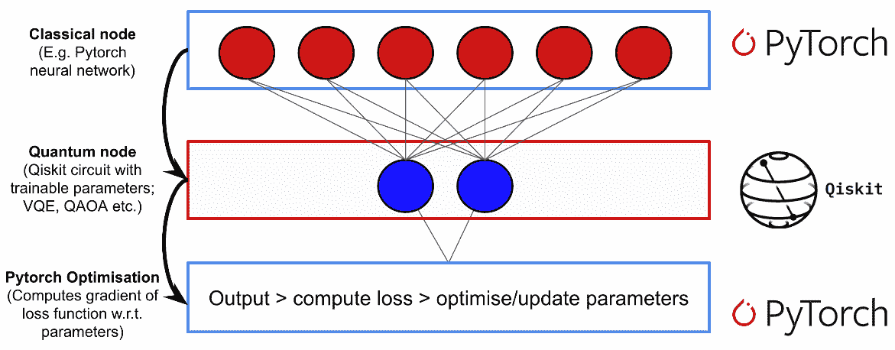

##### 5.2 最优判别态参数

这本示例中，我们考虑$p = 1$的情况，比如：仅包含一层量子门。期望值$F_{1}(\gamma,\beta) = \langle\psi_{1}(\beta,\gamma)|H|\psi_{1}(\beta,\gamma)\rangle$可通过此简单设置进行解析计算。然后明确地讨论实现哈密顿量$H = \sum_{(j,k) \in E}^{}{\frac{1}{2}(1 - Z_{i}Z_{k})}$的步骤。由于是线性期望值，我们就可以分别计算边的期望值：

$f_{(i,k)}(\beta,\alpha) = \langle\psi_{1}(\gamma,\beta)|\frac{1}{2}(1 - Z_{i}Z_{k})|\psi_{1}(\gamma,\beta)\rangle$。

对于上面所做的蝴蝶图，可观察到只有两种边$A = \{(0,1),(3,4)\}$和$B = \{(0,2),(1,2),(2,3),(2,4)\}$。在$A$中的边仅有两个邻边，而$B$中的边有4个邻边。可确认：由于其他边的期望值相同，我们只需计算每个集合中单个边的期望值。其意义为：通过仅计算两个期望值就可以算出$F_{1}(\gamma,\beta) = 2f_{A}(\gamma,\beta) + 4f_{B}(\gamma,\beta)$。注意！按照第4.2.2节中所述的论据，所有不与Pauli算子$Z_{0}Z_{1}$或$Z_{0}Z_{2}$相交的量子门都进行了对易和抵消，因此我们只需要计算：

$$f_{A}(\gamma,\beta) = \frac{1}{2}(1 - \langle +^{3}|U_{21}(\gamma)U_{02}(\gamma)U_{01}(\gamma)X_{0}(\beta)X_{1}$$

$$\ \ \ \ \ \ \ \ \ \ \ \ \ \ \ \ \ \ \ \ \ \ \ \ \ \ \ \ \ \ \ \ \ \ \ \ \ \ \ \ \ \ \ \ (\beta)Z_{0}Z_{1}X_{1}^{\dagger}(\beta)X_{0}^{\dagger}(\beta)U_{01}^{\dagger}(\gamma)U_{02}^{\dagger}(\gamma)U_{12}^{\dagger}(\gamma)| +^{3}\rangle)$$

和

$$f_{B}(\gamma,\beta) = \frac{1}{2}(1 - \langle +^{5}|U_{21}(\gamma)U_{24}(\gamma)U_{23}(\gamma)U_{01}(\gamma)U_{02}(\gamma)X_{0}(\beta)X_{2}(\beta)$$

$$\text{\ \ \ \ \ \ \ \ \ \ \ \ \ \ \ \ \ \ \ \ \ \ \ \ \ \ \ \ \ \ \ Z}_{0}Z_{2}X_{0}^{\dagger}(\beta)X_{2}^{\dagger}(\beta)U_{02}^{\dagger}(\gamma)U_{01}^{\dagger}(\gamma)U_{12}^{\dagger}(\gamma)U_{23}^{\dagger}(\gamma)U_{24}^{\dagger}(\gamma)| +^{5}\rangle)$$

这些期望值的复杂程度通常仅取决于所考虑图的阶数，并且如果阶数是有界的，则与整个图的规模无关。使用$U_{k,l}(\gamma) = \exp\frac{\text{iγ} }{2}(1 - Z_{k}Z_{l})$与$X_{k}(\beta) = \exp(i\beta X_{k})$对这一表达式直接求值后生成：

$$f_{A}(\gamma,\beta) = \frac{1}{2}(sin(4\gamma)sin(4\beta) + sin^{2}(2\beta)sin^{2}(2\gamma))$$

和

$$f_{B}(\gamma,\beta) = \frac{1}{2}(1 - sin^{2}(2\beta)sin^{2}(2\gamma)cos^{2}(4\gamma) - \frac{1}{4}sin(4\beta)sin(4\gamma)(1 + cos^{2}(4\gamma)))$$

现在可以如上文所述组合这些结果，因此期望值由下式给出。

$$F_{1}(\gamma,\beta) = 3 - (sin^{2}(2\beta)sin^{2}(2\gamma) - \frac{1}{2}sin(4\beta)sin(4\gamma))(1 + cos^{2}(4\gamma)),$$

我们对函数$F_{1}(\gamma,\beta)$进行作图，并使用简单的网格搜索来找到使期望值最大的参数$(\gamma^{*},\beta^{*})$。

> \# Evaluate the function
>
> step_size = 0.1;
>
> a_gamma = np.arange(0, np.pi, step_size)
>
> a_beta = np.arange(0, np.pi, step_size)
>
> a_gamma, a_beta = np.meshgrid(a_gamma,a_beta)
>
> F1 =
> 3-(np.sin(2\*a_beta)\*\*2\*np.sin(2\*a_gamma)\*\*2-0.5\*np.sin(4\*a_beta)\*np.sin(4\*a_gamma))\*(1+np.cos(4\*a_gamma)\*\*2)
>
> \# Grid search for the minimizing variables
>
> result = np.where(F1 == np.amax(F1))
>
> a = list(zip(result\[0\],result\[1\]))\[0\]
>
> gamma = a\[0\]\*step_size;
>
> beta = a\[1\]\*step_size;
>
> \# Plot the expetation value F1
>
> fig = plt.figure()
>
> ax = fig.gca(projection=\'3d\')
>
> surf = ax.plot_surface(a_gamma, a_beta, F1, cmap=cm.coolwarm,
> linewidth=0, antialiased=True)
>
> ax.set_zlim(1,4)
>
> ax.zaxis.set_major_locator(LinearLocator(3))
>
> ax.zaxis.set_major_formatter(FormatStrFormatter(\'%.02f\'))
>
> plt.show()
>
> \#The smallest parameters and the expectation can be extracted
>
> print(\'\\n \-\-- OPTIMAL PARAMETERS \-\-- \\n\')
>
> print(\'The maximal expectation value is: M1 = %.03f\' % np.amax(F1))
>
> print(\'This is attained for gamma = %.03f and beta = %.03f\' %
> (gamma,beta))

输出：

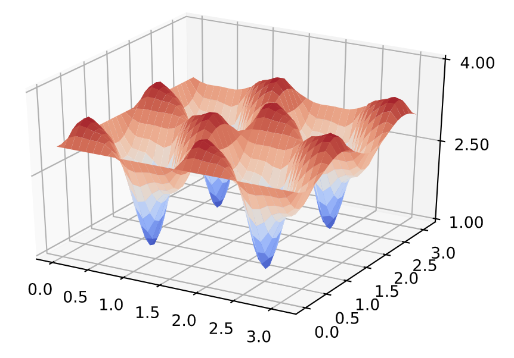

> \-\-- OPTIMAL PARAMETERS \-\--
>
> The maximal expectation value is: M1 = 3.431
>
> This is attained for gamma = 1.900 and beta = 0.200

##### 5.3 量子回路

通过这些参数，我们现在可以构造回路，为上问所述顶点集$V = \{ 0,1,2,3,4\}$和边$E = \{(0,1),(0,2),(1,2),(3,2),(3,4),(4,2)\}$的图或图$G = (V，E)$准备判别态。该回路需要$n = 5$个量子比特，且我们将要准备态

$|\psi_{1}(\gamma,\beta)\rangle = e^{- i\beta B}e^{- i\gamma H}| + \rangle^{n}$。

回想由$B = \sum_{k \in V}^{}X_{k}$和$H = \sum_{(k,m) \in E}^{}{\frac{1}{2}(1 - Z_{k}Z_{m})}$给出的项。按照如下步骤生成这一回路：

-   首先，实现5个$H$门来生成统一的叠加态。

-   接着，沿边$(k,l) \in E$实现具有角度$\gamma$的6个Ising型量子门$U_{k,l}(\gamma)$。该量子门可以用原生的Qiskit量子门表示：

$$U_{k,l}(\gamma) = C_{u1}( - 2\gamma)_{k,l}u1(\gamma)_{k}u1(\gamma)_{l}$$

-   然后，对具有角度$\beta$的每个顶点$k \in V$中单个量子比特$X$施加旋转$X_{k}(\beta)$。该量子门在Qiskit中直接参数化为$X_{k}(\beta) = R_{x}(2\beta)_{k}$。

-   最后，在计算基上测量这些量子比特，即执行𝑍-测量并记录所得的比特串$x \in \{ 0,1\}^{5}$。

> \# prepare the quantum and classical resisters
>
> QAOA = QuantumCircuit(len(V), len(V))
>
> \# apply the layer of Hadamard gates to all qubits
>
> QAOA.h(range(len(V)))
>
> QAOA.barrier()
>
> \# apply the Ising type gates with angle gamma along the edges in E
>
> for edge in E:
>
> k = edge\[0\]
>
> l = edge\[1\]
>
> QAOA.cu1(-2\*gamma, k, l)
>
> QAOA.u1(gamma, k)
>
> QAOA.u1(gamma, l)
>
> \# then apply the single qubit X - rotations with angle beta to all
> qubits
>
> QAOA.barrier()
>
> QAOA.rx(2\*beta, range(len(V)))
>
> \# Finally measure the result in the computational basis
>
> QAOA.barrier()
>
> QAOA.measure(range(len(V)),range(len(V)))
>
> \#\#\# draw the circuit for comparison
>
> QAOA.draw(output=\'mpl\')
>
> 输出：

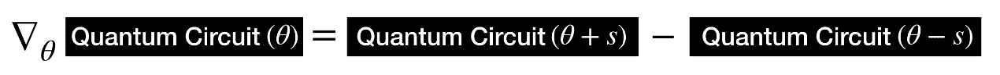

##### 5.4 代价函数求值

最后，我们需要一个例程来根据比特串计算代价函数的值。这是决定我们是否找到"良好候选"比特串$x$的必要条件，但也可以用于在无法直接求期望值的情况下估计期望值$F_{1}(\gamma,\beta)$。

> \# Compute the value of the cost function
>
> def cost_function_C(x,G):
>
> E = G.edges()
>
> if( len(x) != len(G.nodes())):
>
> return np.nan
>
> C = 0;
>
> for index in E:
>
> e1 = index\[0\]
>
> e2 = index\[1\]
>
> w = G\[e1\]\[e2\]\[\'weight\'\]
>
> C = C + w\*x\[e1\]\*(1-x\[e2\]) + w\*x\[e2\]\*(1-x\[e1\])
>
> return C

###### 5a. 在模拟器上运行QAOA

我们首先在本地的QASM模拟器上运行该算法。

> \# run on local simulator
>
> backend = Aer.get_backend(\"qasm_simulator\")
>
> shots = 10000
>
> simulate = execute(QAOA, backend=backend, shots=shots)
>
> QAOA_results = simulate.result()
>
> plot_histogram(QAOA_results.get_counts(),figsize = (8,6),bar_labels =
> False)

输出：


####### 评估模拟数据

现在从模拟数据中计算相关信息。我们将使用获得的结果来：

-   计算平均能量并检查其是否与理论预测相符

-   报告具有最大观测的代价函数$C(x^{*})$的采样比特串$x^{*}$

-   通过绘制能量直方图查看其是否确实集中在预测均值周围

> \# Evaluate the data from the simulator
>
> counts = QAOA_results.get_counts()
>
> avr_C = 0
>
> max_C = \[0,0\]
>
> hist = {}
>
> for k in range(len(G.edges())+1):
>
> hist\[str(k)\] = hist.get(str(k),0)
>
> for sample in list(counts.keys()):
>
> \# use sampled bit string x to compute C(x)
>
> x = \[int(num) for num in list(sample)\]
>
> tmp_eng = cost_function_C(x,G)
>
> \# compute the expectation value and energy distribution
>
> avr_C = avr_C + counts\[sample\]\*tmp_eng
>
> hist\[str(round(tmp_eng))\] = hist.get(str(round(tmp_eng)),0) +
> counts\[sample\]
>
> \# save best bit string
>
> if( max_C\[1\] \< tmp_eng):
>
> max_C\[0\] = sample
>
> max_C\[1\] = tmp_eng
>
> M1_sampled = avr_C/shots
>
> print(\'\\n \-\-- SIMULATION RESULTS \-\--\\n\')
>
> print(\'The sampled mean value is M1_sampled = %.02f while the true
> value is M1 = %.02f \\n\' % (M1_sampled,np.amax(F1)))
>
> print(\'The approximate solution is x\* = %s with C(x\*) = %d \\n\' %
> (max_C\[0\],max_C\[1\]))
>
> print(\'The cost function is distributed as: \\n\')
>
> plot_histogram(hist,figsize = (8,6),bar_labels = False)
>
> \-\-- SIMULATION RESULTS \-\--
>
> The sampled mean value is M1_sampled = 3.29 while the true value is M1
> = 3.43
>
> The approximate solution is x\* = 00101 with C(x\*) = 4
>
> The cost function is distributed as:

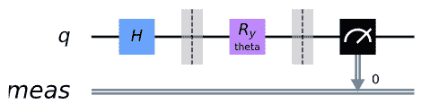

###### 5b. 在真实设备上运行QAOA

接下来，我们将会看到如何在真实设备的后端运行同样的回路。

> \# Use the IBMQ essex device
>
> provider = IBMQ.load_account()
>
> backend = provider.get_backend(\'ibmq_essex\')
>
> shots = 2048
>
> job_exp = execute(QAOA, backend=backend, shots=shots)
>
> job_monitor(job_exp)
>
> 输出：
>
> Job Status: job has successfully run
>
> exp_results = job_exp.result()
>
> plot_histogram(exp_results.get_counts(),figsize = (10,8),bar_labels =
> False)
>
> 输出：

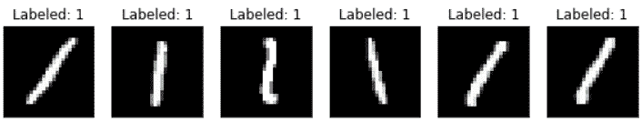

####### 评估实验数据

现在，我们可以重复之前相同的分析并比较实验结果。

> \# Evaluate the data from the experiment
>
> counts = exp_results.get_counts()
>
> avr_C = 0
>
> max_C = \[0,0\]
>
> hist = {}
>
> for k in range(len(G.edges())+1):
>
> hist\[str(k)\] = hist.get(str(k),0)
>
> for sample in list(counts.keys()):
>
> \# use sampled bit string x to compute C(x)
>
> x = \[int(num) for num in list(sample)\]
>
> tmp_eng = cost_function_C(x,G)
>
> \# compute the expectation value and energy distribution
>
> avr_C = avr_C + counts\[sample\]\*tmp_eng
>
> hist\[str(round(tmp_eng))\] = hist.get(str(round(tmp_eng)),0) +
> counts\[sample\]
>
> \# save best bit string
>
> if( max_C\[1\] \< tmp_eng):
>
> max_C\[0\] = sample
>
> max_C\[1\] = tmp_eng
>
> M1_sampled = avr_C/shots
>
> print(\'\\n \-\-- EXPERIMENTAL RESULTS \-\--\\n\')
>
> print(\'The sampled mean value is M1_sampled = %.02f while the true
> value is M1 = %.02f \\n\' % (M1_sampled,np.amax(F1)))
>
> print(\'The approximate solution is x\* = %s with C(x\*) = %d \\n\' %
> (max_C\[0\],max_C\[1\]))
>
> print(\'The cost function is distributed as: \\n\')
>
> plot_histogram(hist,figsize = (8,6),bar_labels = False)
>
> \-\-- EXPERIMENTAL RESULTS \-\--
>
> The sampled mean value is M1_sampled = 3.14 while the true value is M1
> = 3.43
>
> The approximate solution is x\* = 00101 with C(x\*) = 4
>
> The cost function is distributed as:

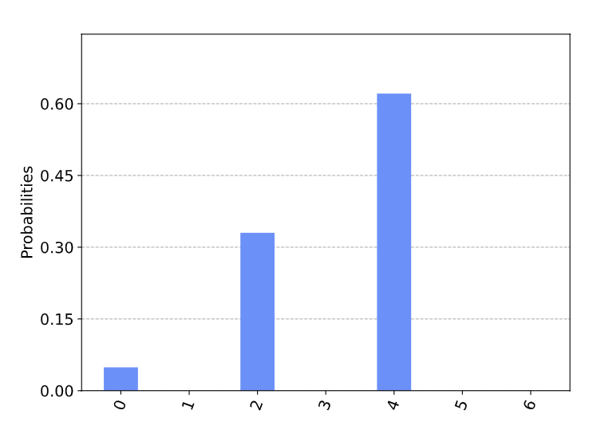

#### 6. 练习

1.QAOA算法会生成一个比特串，此比特串是否是该图的最优解？将超导芯片的实验结果与本地QASM仿真的结果进行比较。

2.我们已经在5.2节中分析了代价函数$F_{1}$。验证步骤并计算$f_{A}(\gamma,\beta)$和$f_{B}(\gamma,\beta)$。

3.在Qiskit实现中为$F_{1}$给出了精确的表达式：

\-
编写一个例程以便从结果所获得样本中估计期望值$F_{1}(\gamma,\beta)$（提示：使用第5.4节中的函数function
cost_function_C(x,G)和第5.a/5.b节中的数据评估）。

\-
使用优化例程，例如本教程VQE示例中的SPSA，以数字方式优化采样的$F_{1}(\gamma,\beta)$中的参数。是否找到与$\gamma^{*},\beta^{*}$相同的值？

4\. 第5.3节中的判别回路对应于深度$p = 1$，其直接目的是与硬件兼容。

\-
使用练习2中的例程评估$p = 2,3$的代价函数$F_{p}(\gamma,\beta)$。您希望在实际的硬件中看到什么？

\- 将此类判别态推广到其他候选波动函数，例如参考文献4中的硬件高效拟设。

5.思考示例部分中所讨论的$\text{MAX}3 - \text{SAT}$，并将其修改为5.4节中用于计算$F_{p}$的的函数cost_function_C(c,G)。使用硬件高效算法为$\text{MAX}3 - \text{SAT}$实例运行QAOA算法并分析结果。

#### 7. 参考文献

1.  Garey, Michael R.; David S. Johnson (1979). Computers and
    > Intractability: A Guide to the Theory of NP-Completeness. W. H.
    > Freeman. ISBN 0-7167-1045-5

2.  Goemans, Michel X., and David P. Williamson. [Journal of the ACM
    > (JACM) 42.6 (1995):
    > 1115-1145](http://www-math.mit.edu/~goemans/PAPERS/maxcut-jacm.pdf).

3.  Farhi, Edward, Jeffrey Goldstone, and Sam Gutmann. \"A quantum
    > approximate optimization algorithm.\" arXiv
    > preprint [arXiv:1411.4028 (2014)](https://arxiv.org/abs/1411.4028).

4.  Kandala, Abhinav, et al. \"Hardware-efficient variational quantum
    > eigensolver for small molecules and quantum magnets.\" [Nature
    > 549.7671 (2017):
    > 242](https://www.nature.com/articles/nature23879).

5.  Farhi, Edward, et al. \"Quantum algorithms for fixed qubit
    > architectures.\" arXiv
    > preprint [arXiv:1703.06199 (2017)](https://arxiv.org/abs/1703.06199).

6.  Spall, J. C. (1992), [IEEE Transactions on Automatic Control, vol.
    
> 37(3), pp. 332--341](https://ieeexplore.ieee.org/document/119632).
    
7.  Michael Streif and Martin Leib \"Training the quantum approximate
    > optimization algorithm without access to a quantum processing
    > unit\" (2020) [Quantum Sci. Technol. 5
    > 034008](https://doi.org/10.1088/2058-9565/ab8c2b)

### 4.1.4 用Grover算法解决可满足性问题

在本节中，将演示如何使用Qiskit Aqua中的Grover算法实现解决可满足性问题。

#### 1.简介

在本教程的早先部分介绍了Grover的非结构化搜索算法，并给出了使用Qiskit
Terra的示例和实现。我们看到Grover搜索是一种量子算法，比对应的传统算法搜索出正确解的速度快两倍。此处，我们将说明使用Grover算法来解决一个特殊的组合布尔可满足性问题（Boolean
Satisfiability Problem）。

在计算机科学中，布尔可满足性问题是确定是否存在满足给定布尔公式解释的问题。换句话说，该问题询问给定布尔公式的变量是否可以一致地被TRUE或FALSE值替换，从而使公式的计算结果为TRUE。若是这种情况，则这一公式被称为可满足。另一方面，如果不存在这样的赋值，则公式所表示的函数对于所有可能的变量赋值都为FALSE，且公式不可满足。这就可以将其看作是一个搜索问题，其解是满足布尔公式的赋值。

#### 2. 3-可满足性问题

3-可满足性问题（3SAT）可通过一下具体问题来解释。考虑具有三个布尔变量$v_{1}$，$v_{2}$，$v_{3}$的布尔函数$f$：

$$f(v_{1},v_{2},v_{3}) = (\neg v_{1} \vee \neg v_{2} \vee \neg v_{3}) \land (v_{1} \vee \neg v_{2} \vee v_{3}) \land (v_{1} \vee v_{2} \vee \neg v_{3}) \land (v_{1} \vee \neg v_{2} \vee \neg v_{3}) \land (\neg v_{1} \vee v_{2} \vee v_{3})$$

在上面的函数中，方程右侧处于括号（）中的项称为子句；该函数具有5个子句。作为3SAT问题，每个子句恰好具有三个文字。比如，第一个子句中$\neg v_{1}$，$\neg v_{2}$和$\neg v_{3}$就是其文字。符号$\neg$是布尔运算中的NOT，其作用是抵消（或翻转）其后继文字的值。符号$\vee$和$\land$分别对应于布尔运算中的OR和AND。如果存在$v_{1}$，$v_{2}$，$v_{3}$的赋值得出$f(v_{1},v_{2},v_{3}) = 1$（即$f$得出True），则该布尔函数$f$满足要求。

查找此类排布的一种简单方法是尝试布尔函数$f$输入值的所有可能组合。下表是$v_{1}$，$v_{2}$，$v_{3}$所有可能组合的表。为了便于说明，我们定义$0 = \text{False}$，以及$1 = True$。

| $v_{1}$ | $v_{2}$ | $v_{3}$ | $f$ | **Comment**                       |
| --------- | --------- | --------- | ----- | --------------------------------- |
| 0         | 0         | 0         | 1     | Solution                          |
| 0         | 0         | 1         | 0     | Not a solution because 𝑓 is False |
| 0         | 1         | 0         | 0     | Not a solution because 𝑓 is False |
| 0         | 1         | 1         | 0     | Not a solution because 𝑓 is False |
| 1         | 0         | 0         | 0     | Not a solution because 𝑓 is False |
| 1         | 0         | 1         | 1     | Solution                          |
| 1         | 1         | 0         | 1     | Solution                          |
| 1         | 1         | 1         | 0     | Not a solution because 𝑓 is False |


从上面的表格中，我们可以看到此3-SAT问题实例具有三个可满足的解决方案：$(v_{1},v_{2},v_{3}) = (T,F,T)$或$(F,F,F)$或$(T,T,F)$。

通常来说，布尔函数$f$可以具有许多子句和布尔变量。可以看到3SAT问题始终可以用合取范式（CNF：Conjunctive
Normal
Form）来写，即一个或多个子句的连接，其中一个子句是三个文字的析取（disjunction）；否则其就是3个OR的AND。

#### 3. Qiskit实现

现在，让我们使用Qikit的Aqua来求解3SAT问题：

$$f(v_{1},v_{2},v_{3}) = (\neg v_{1} \vee \neg v_{2} \vee \neg v_{3}) \land (v_{1} \vee \neg v_{2} \vee v_{3}) \land (v_{1} \vee v_{2} \vee \neg v_{3}) \land (v_{1} \vee \neg v_{2} \vee \neg v_{3}) \land (\neg v_{1} \vee v_{2} \vee v_{3})$$

首先需要了解Qiskit的Aqua中用于解决此问题的输入[DIMACS
CNF](http://www.satcompetition.org/2009/format-benchmarks2009.html)格式，类似于以下内容：

c example DIMACS CNF 3-SAT

p cnf 3 5

-1 -2 -3 0

1 -2 3 0

1 2 -3 0

1 -2 -3 0

-1 2 3 0

-   以c开头的行是注释

```{=html}
<!-- -->
```
-   比如：c example DIMACS CNF 3-SAT

```{=html}
<!-- -->
```
-   第一条非注释行的格式应为p cnf nbvar nbclauses，其中：

```{=html}
<!-- -->
```
-   cnf表示输入为CNF格式

-   nbvar是文件中出现变量的确切数量

-   nbclauses是文件中所包含子句的确切数量

-   比如：p cnf 3 5

```{=html}
<!-- -->
```
-   然后每个子句都有一行，其中：

```{=html}
<!-- -->
```
-   每个子句是在同一行上以0结尾的-nbvar和nbvar之间不同的非空数字序列

-   不能同时包含相反的文字i和-i

-   正数表示相应的变量

-   负数表示相应变量的取反

-   比如：-1 2 3 0对应于子句$\neg v_{1} \vee v_{2} \vee v_{3}$

同样，问题$(v_{1},v_{2},v_{3}) = (T,F,T)$的解可写为1 -2 3，-1 -2 -3或1 2
-3。

通过此示例问题的输入，我们为Grover搜索创建了相应的预言。我们使用Aqua提供的LogicalExpressionOracle组件，该组件支持解析DIMACS
CNF格式字符串并构造相应的预言回路。

> import numpy as np
>
> from qiskit import BasicAer
>
> from qiskit.visualization import plot_histogram
>
> from qiskit.aqua import QuantumInstance
>
> from qiskit.aqua.algorithms import Grover
>
> from qiskit.aqua.components.oracles import LogicalExpressionOracle,
> TruthTableOracle
>
> input_3sat = \'\'\'
>
> c example DIMACS-CNF 3-SAT
>
> p cnf 3 5
>
> -1 -2 -3 0
>
> 1 -2 3 0
>
> 1 2 -3 0
>
> 1 -2 -3 0
>
> -1 2 3 0
>
> \'\'\'
>
> oracle = LogicalExpressionOracle(input_3sat)

现在可以使用预言创建一个Grover实例：

grover = Grover(oracle)

然后配置模拟器后端并运行Grover实例以获取结果：

> backend = BasicAer.get_backend(\'qasm_simulator\')
>
> quantum_instance = QuantumInstance(backend, shots=1024)
>
> result = grover.run(quantum_instance)
>
> print(result\[\'result\'\])
>
> 输出：
>
> \[-1, -2, -3\]

如上所示，获得了指定的3-SAT问题的可满足解，其结果确为三个可满足解之一。

由于我们使用的是模拟器，因此还返回了完整的测量结果（如下图所示），可以看出二进制字符串000、011和101（注意每个字符串中的位顺序）所对应的三个可满足解都具有高概率。

> plot_histogram(result\[\'measurement\'\])
>
> 输出：


模拟器可以找到示例问题的解，如果使用具有噪声和不完美量子门的真实量子器件会发生什么？

然而，由于可以通过网络发送到实际设备的字符串的长度受到限制（超过QASM回路六万个字符的限制），因此目前上述回路无法在实际设备后端运行。但是，我们可以在实际设备ibmq_16_melbourne后端上看到已编译的QASM，如下所示：

> \# Load our saved IBMQ accounts and get the ibmq_16_melbourne backend
>
> from qiskit import IBMQ
>
> IBMQ.load_account()
>
> provider = IBMQ.get_provider(hub=\'ibm-q\')
>
> backend = provider.get_backend(\'ibmq_16_melbourne\')
>
> from qiskit.compiler import transpile
>
> \# transpile the circuit for ibmq_16_melbourne
>
> grover_compiled = transpile(result\[\'circuit\'\], backend=backend,
> optimization_level=3)
>
> print(\'gates = \', grover_compiled.count_ops())
>
> print(\'depth = \', grover_compiled.depth())
>
> 输出：
>
> gates = OrderedDict(\[(\'cx\', 437), (\'u2\', 130), (\'u1\', 85),
> (\'u3\', 75), (\'measure\', 3), (\'barrier\', 2)\])
>
> depth = 448

可以看到所需量子门的数量远远超过了当前近期量子计算机退相干时间限制。现今，设计用于Grover搜索的量子回路来解决可满足性和其他优化问题仍是一个挑战。

#### 4. 练习

1\. 使用Qiskit Aqua解决以下3SAT问题。结果是是否如你所期望？

$$f(x_{1},x_{2},x_{3}) = (x_{1} \vee x_{2} \vee \neg x_{3}) \land (\neg x_{1} \vee \neg x_{2} \vee \neg x_{3}) \land (\neg x_{1} \vee x_{2} \vee x_{3})$$

#### 5. 参考文献

1\. Giacomo Nannicini (2017), \"An Introduction to Quantum Computing,
Without the
Physics\", [arXiv:1708.03684](https://arxiv.org/abs/1708.03684)

### 4.1.5 PyTorch和Qiskit的混合量子经典神经网络

机器学习（ML：Machine
Learning）已将自己确立为一个成功的跨学科领域，该领域寻求从数据中数学化地提取可概括的信息。量子计算的兴起引起了有趣的研究领域，这些领域试图利用量子力学的原理来增强机器学习，反之亦然。无论您是要通过将困难的计算外包给量子计算机来增强经典机器学习算法，还是要使用经典机器学习体系结构优化量子算法------两者都属于量子机器学习（QML：Quantum
Machine Learning）的范畴。

在本节中，我们将探索如何把经典神经网络部分量化来创建混合量子经典神经网络。我们将编写一个简单的示例，将Qiskit与最新的开源软件包PyTorch集成在一起。本示例的目的是演示将Qiskit与现有机器学习工具集成的简便性，并鼓励机器学习实践者探索量子计算。

#### 内容

1\. 工作原理

1.1 初步工作

2\. 那么量子是如何进入这个世界的呢?

3\. 开始编码！

3.1 导入

3.2 用Qiskit创建一个"量子类（Quantum Class）"

3.3 用PyTorch创建一个"量子-经典类（Quantum-Classical Class）"

3.4 数据加载和预处理

3.5 创建混合神经网络

3.6 训练网络

3.7 测试网络

4\. 下一步该做什么?

#### 1. 工作原理


上图展示了我们将在本章中构建的框架。最后，我们将创建一个量子-经典混合神经网络，并将其用于对手绘数字进行分类。注意，图中所显示地线都是指向下；但在视觉上没有指示方向。

##### 1.1 初步工作

本小节中所介绍的经典神经网络背景知识是为了建立相关思想和共享术语;然而其仍然是非常高端。如果您想深入了解经典的神经网络，可以看看[3Blue1Brown](https://youtu.be/aircAruvnKk)制作的视频系列。如果您已经熟悉经典网络，则可以跳转至下一节。

###### 神经元和权重

神经网络最终只是一个精巧的函数，由称为神经元的更小构建块组成。**神经元**（neuron）通常是一个简单、易于计算的非线性函数，其将一个或多个输入映射为一个实数。一个神经元的单个输出通常被复制并作为输入导入到其他神经元。在图形上，我们将神经元表示为图中的节点，并在节点之间画有向线来表示一个神经元的输出如何被用作其他神经元的输入。同样需要注意的是，图中的每条线通常都与一个称为**权重**（weight）的标量值相关联。此处地设想是：每个神经元的输入在被收集和处理成单个值之前将被乘以不同的标量。训练神经网络的目标主要是选择权重，使得网络以特定的方式运行。

###### 前馈神经网络（Feed Forward Neural Networks）

注意！我们将要讨论的特殊类型神经网络叫做前馈神经网络（FFNN），表明当数据在我们的神经网络中流动时，其将永远不会返回到已经访问过的神经元。同理，您可以说描述这一神经网络为一个有向无环图（DAG：Directed
Acyclic
Graph）。此外，我们定义在神经网络中同一层内的神经元之间没有连接的线。

###### 层间输入输出结构（IO Structure）

神经网络的输入是经典（实值）向量。根据网络的图结构，将输入向量的每个分量乘以不同的权重，并馈入神经元层。在该层中的每个神经元求值之后，将结果收集到一个新的向量中，第i个组件将记录第i个神经元的输出。然后将此新矢量视为新层的输入，依此类推。我们使用标准术语"隐藏层（hidden
layer）"来描述网络的第一层和最后一层以外的所有层

#### 2. 那么量子是如何进入这个世界的呢?

若要创建一个量子经典神经网络，我们可以使用参数化量子回路为神经网络实现一个隐藏层。所谓"参数化量子回路（parameterized
quantum
circuit）"，是指每个量子门的旋转角度由经典输入矢量的分量指定的量子回路。神经网络上一层的输出将被收集并用作参数化回路的输入。然后，量子回路的测量统计数据可以被收集和作为下一层的输入。下图是一个简单的示例：


此处的$\sigma$是一个非线性函数，$h_{i}$是每个隐藏层的神经元$i$的值。$R(h_{i})$代表任何旋转门，其旋转角度为$h_{i}$，$y$是从混合网络生成的最终预测值。

##### 反向传播（backpropagation）？

如果您熟悉经典机器学习，就可能会立即想知道当涉及量子回路时我们如何计算梯度（gradient）？为了获得强大的优化技术（如：梯度下降gradient
descent），这一点必须实现。其包含些许技术性，但简而言之，我们可以将量子回路视为黑盒，可以计算出该黑盒相对于其参数的梯度如下：


其中$\theta$表示量子回路的参数，而$s$是宏观位移。梯度就是量子回路在$\theta + s$和$\theta - s$评估之间的差。因此作为较大的反向传播例程的一部分，我们可以系统地区分出量子回路。这种用于计算量子回路参数梯度的闭合形式规则称为参数移位规则（[parameter
shift rule](https://arxiv.org/pdf/1905.13311.pdf)）。

#### 3. 开始编码！

##### 3.1 导入

首先，我们导入一些将要那个到的Qiskit和PyTorch包。

> import numpy as np
>
> import matplotlib.pyplot as plt
>
> import torch
>
> from torch.autograd import Function
>
> from torchvision import datasets, transforms
>
> import torch.optim as optim
>
> import torch.nn as nn
>
> import torch.nn.functional as F
>
> import qiskit
>
> from qiskit.visualization import \*
>
> 此处有两个错误：

1.  pytorch torchvision的版本

2.  修改..\\site-packages\\torchvision\\transforms\\functional.py中的"from
    > PIL import Image, ImageOps, ImageEnhance, PILLOW_VERSION"为"from
    > PIL import Image, ImageOps, ImageEnhance, \_\_version\_\_"

##### 3.2 用Qiskit创建一个"量子类（Quantum Class）"

我们可以方便地将Qiskit量子函数放入一Python类中。首先，指定可训练的量子参数的数量和希望在量子回路中使用的次数。在这个例子中，为让其简单，我们使用一个1个量子比特的回路与一个可训练的量子参数。为了简单起见，我们对这一量子回路进行硬编码，并使用$\text{RY}$-旋转角度$\theta$来训练回路的输出。该量子回路如下所示：


为了在$z$-基上测量输出，我们计算了期望值$\sigma_{\mathbf{z} }$。

$$\sigma_{\mathbf{z} } = \sum_{i}^{}{z_{i}p(z_{i})}$$

在稍后的叙述中，我们将会看到以上这些是如何与混合神经网络联系起来的。

> class QuantumCircuit:
>
> \"\"\"
>
> This class provides a simple interface for interaction
>
> with the quantum circuit
>
> \"\"\"
>
> def \_\_init\_\_(self, n_qubits, backend, shots):
>
> \# \-\-- Circuit definition \-\--
>
> self.\_circuit = qiskit.QuantumCircuit(n_qubits)
>
> all_qubits = \[i for i in range(n_qubits)\]
>
> self.theta = qiskit.circuit.Parameter(\'theta\')
>
> self.\_circuit.h(all_qubits)
>
> self.\_circuit.barrier()
>
> self.\_circuit.ry(self.theta, all_qubits)
>
> self.\_circuit.measure_all()
>
> \# \-\-\-\-\-\-\-\-\-\-\-\-\-\-\-\-\-\-\-\-\-\-\-\-\-\--
>
> self.backend = backend
>
> self.shots = shots
>
> def run(self, thetas):
>
> job = qiskit.execute(self.\_circuit,
>
> self.backend,
>
> shots = self.shots,
>
> parameter_binds = \[{self.theta: theta} for theta in thetas\])
>
> result = job.result().get_counts(self.\_circuit)
>
> counts = np.array(list(result.values()))
>
> states = np.array(list(result.keys())).astype(float)
>
> \# Compute probabilities for each state
>
> probabilities = counts / self.shots
>
> \# Get state expectation
>
> expectation = np.sum(states \* probabilities)
>
> return np.array(\[expectation\])

对该实例进行测试。

> simulator = qiskit.Aer.get_backend(\'qasm_simulator\')
>
> circuit = QuantumCircuit(1, simulator, 100)
>
> print(\'Expected value for rotation pi
> {}\'.format(circuit.run(\[np.pi\])\[0\]))
>
> circuit.\_circuit.draw()
>
> 输出：
>
> Expected value for rotation pi 0.55


##### 3.3 用PyTorch创建一个"量子-经典类（Quantum-Classical Class）"

既然已定义量子回路，就可以使用PyTorch创建反向传播所需的函数。[向前和向后传播](http://www.ai.mit.edu/courses/6.034b/backprops.pdf)包含来自Qiskit类的元素。向后传播过程直接用前面介绍的有限差分公式计算解析梯度。

> class HybridFunction(Function):
>
> \"\"\" Hybrid quantum - classical function definition \"\"\"
>
> \@staticmethod
>
> def forward(ctx, input, quantum_circuit, shift):
>
> \"\"\" Forward pass computation \"\"\"
>
> ctx.shift = shift
>
> ctx.quantum_circuit = quantum_circuit
>
> expectation_z = ctx.quantum_circuit.run(input\[0\].tolist())
>
> result = torch.tensor(\[expectation_z\])
>
> ctx.save_for_backward(input, result)
>
> return result
>
> \@staticmethod
>
> def backward(ctx, grad_output):
>
> \"\"\" Backward pass computation \"\"\"
>
> input, expectation_z = ctx.saved_tensors
>
> input_list = np.array(input.tolist())
>
> shift_right = input_list + np.ones(input_list.shape) \* ctx.shift
>
> shift_left = input_list - np.ones(input_list.shape) \* ctx.shift
>
> gradients = \[\]
>
> for i in range(len(input_list)):
>
> expectation_right = ctx.quantum_circuit.run(shift_right\[i\])
>
> expectation_left = ctx.quantum_circuit.run(shift_left\[i\])
>
> gradient = torch.tensor(\[expectation_right\]) -
> torch.tensor(\[expectation_left\])
>
> gradients.append(gradient)
>
> gradients = np.array(\[gradients\]).T
>
> return torch.tensor(\[gradients\]).float() \* grad_output.float(),
> None, None
>
> class Hybrid(nn.Module):
>
> \"\"\" Hybrid quantum - classical layer definition \"\"\"
>
> def \_\_init\_\_(self, backend, shots, shift):
>
> super(Hybrid, self).\_\_init\_\_()
>
> self.quantum_circuit = QuantumCircuit(1, backend, shots)
>
> self.shift = shift
>
> def forward(self, input):
>
> return HybridFunction.apply(input, self.quantum_circuit, self.shift)

##### 3.4 数据加载和预处理

###### 将所有组合在一起：

我们将创建一个简单的混合神经网络来对MNIST数据集中两类数字(0或1)图像进行分类。首先加载[MNIST](http://yann.lecun.com/exdb/mnist/)并过滤包含0和1的图片。这些图片将输入我们的神经网络进行分类。

###### 训练数据

> \# Concentrating on the first 100 samples
>
> n_samples = 100
>
> X_train = datasets.MNIST(root=\'./data\', train=True, download=True,
>
> transform=transforms.Compose(\[transforms.ToTensor()\]))
>
> \# Leaving only labels 0 and 1
>
> idx = np.append(np.where(X_train.targets == 0)\[0\]\[:n_samples\],
>
> np.where(X_train.targets == 1)\[0\]\[:n_samples\])
>
> X_train.data = X_train.data\[idx\]
>
> X_train.targets = X_train.targets\[idx\]
>
> train_loader = torch.utils.data.DataLoader(X_train, batch_size=1,
> shuffle=True)
>
> 注：该过程会下载MNIST数据
>
> n_samples_show = 6
>
> data_iter = iter(train_loader)
>
> fig, axes = plt.subplots(nrows=1, ncols=n_samples_show, figsize=(10,
> 3))
>
> while n_samples_show \> 0:
>
> images, targets = data_iter.\_\_next\_\_()
>
> axes\[n_samples_show - 1\].imshow(images\[0\].numpy().squeeze(),
> cmap=\'gray\')
>
> axes\[n_samples_show - 1\].set_xticks(\[\])
>
> axes\[n_samples_show - 1\].set_yticks(\[\])
>
> axes\[n_samples_show - 1\].set_title(\"Labeled:
> {}\".format(targets.item()))
>
> n_samples_show -= 1
>
> 输出：


###### 测试数据

> n_samples = 50
>
> X_test = datasets.MNIST(root=\'./data\', train=False, download=True,
>
> transform=transforms.Compose(\[transforms.ToTensor()\]))
>
> idx = np.append(np.where(X_test.targets == 0)\[0\]\[:n_samples\],
>
> np.where(X_test.targets == 1)\[0\]\[:n_samples\])
>
> X_test.data = X_test.data\[idx\]
>
> X_test.targets = X_test.targets\[idx\]
>
> test_loader = torch.utils.data.DataLoader(X_test, batch_size=1,
> shuffle=True)

到目前为止，我们已经加载了数据并编写了一个类来创建包含1个可训练参数的量子回路。将该量子参数与其他经典参数一起插入到经典神经网络中就形成混合神经网络。我们还创建了向后和向前传播函数，这些函数允许我们进行反向传播并优化我们的神经网络。最后需要指定神经网络架构，这样我们就可以开始使用PyTorch提供的优化技术来训练参数。

##### 3.5 创建混合神经网络

我们可以使用一个整洁的PyTorch管道来创建一个神经网络架构。当我们插入量子层(即我们的量子回路)时，该神经网络需要在维数上兼容。由于本例中的量子回路包含1个参数，我们必须确保神经网络将神经元压缩到1。我们创建了一个典型的卷积神经网络，最后有两个全连接的层。全连接层最后一个神经元的值作为参数$\theta$导入我们的量子回路。然后，对量子回路进行$\sigma_{z}$测量所给出的0或1作为最终预测值。

> class Net(nn.Module):
>
> def \_\_init\_\_(self):
>
> super(Net, self).\_\_init\_\_()
>
> self.conv1 = nn.Conv2d(1, 32, kernel_size=5)
>
> self.conv2 = nn.Conv2d(32, 64, kernel_size=5)
>
> self.dropout = nn.Dropout2d()
>
> self.fc1 = nn.Linear(256, 64)
>
> self.fc2 = nn.Linear(64, 1)
>
> self.hybrid = Hybrid(qiskit.Aer.get_backend(\'qasm_simulator\'), 100,
> np.pi / 2)
>
> def forward(self, x):
>
> x = F.relu(self.conv1(x))
>
> x = F.relu(self.conv2(x))
>
> x = F.max_pool2d(x, 2)
>
> x = self.dropout(x)
>
> x = x.view(-1, 256)
>
> x = F.relu(self.fc1(x))
>
> x = self.fc2(x)
>
> x = self.hybrid(x)
>
> return torch.cat((x, 1 - x), -1)

##### 3.6 训练网络

自此，我们有了训练混合网络的所有要素！我们可以指定任一[PyTorch优化器](https://pytorch.org/docs/stable/optim.html)，[学习率](https://en.wikipedia.org/wiki/Learning_rate)和[代价/损失函数](https://en.wikipedia.org/wiki/Loss_function)，以及多个训练集。在本示例中，我们使用[Adam优化器](https://arxiv.org/abs/1412.6980)，学习率为0.001和[负对数似然损失函数](https://pytorch.org/docs/stable/_modules/torch/nn/modules/loss.html)。

> model = Net()
>
> optimizer = optim.Adam(model.parameters(), lr=0.001)
>
> loss_func = nn.NLLLoss()
>
> epochs = 20
>
> loss_list = \[\]
>
> model.train()
>
> for epoch in range(epochs):
>
> total_loss = \[\]
>
> for batch_idx, (data, target) in enumerate(train_loader):
>
> optimizer.zero_grad()
>
> \# Forward pass
>
> output = model(data)
>
> \# Calculating loss
>
> loss = loss_func(output, target)
>
> \# Backward pass
>
> loss.backward()
>
> \# Optimize the weights
>
> optimizer.step()
>
> total_loss.append(loss.item())
>
> loss_list.append(sum(total_loss)/len(total_loss))
>
> print(\'Training \[{:.0f}%\]\\tLoss: {:.4f}\'.format(
>
> 100\. \* (epoch + 1) / epochs, loss_list\[-1\]))
>
> 输出：
>
> Training \[5%\] Loss: -0.6586
>
> Training \[10%\] Loss: -0.8185
>
> Training \[15%\] Loss: -0.8316
>
> Training \[20%\] Loss: -0.8402
>
> Training \[25%\] Loss: -0.8683
>
> Training \[30%\] Loss: -0.8527
>
> Training \[35%\] Loss: -0.8611
>
> .
>
> .
>
> .
>
> Training \[80%\] Loss: -0.8684
>
> Training \[85%\] Loss: -0.8479
>
> Training \[90%\] Loss: -0.8428
>
> Training \[95%\] Loss: -0.8937
>
> Training \[100%\] Loss: -0.8838

绘制训练数据图。

> plt.plot(loss_list)
>
> plt.title(\'Hybrid NN Training Convergence\')
>
> plt.xlabel(\'Training Iterations\')
>
> plt.ylabel(\'Neg Log Likelihood Loss\').
>
> 输出：
>
> Text(0, 0.5, \'Neg Log Likelihood Loss\')


> model.eval()
>
> with torch.no_grad():
>
> correct = 0
>
> for batch_idx, (data, target) in enumerate(test_loader):
>
> output = model(data)
>
> pred = output.argmax(dim=1, keepdim=True)
>
> correct += pred.eq(target.view_as(pred)).sum().item()
>
> loss = loss_func(output, target)
>
> total_loss.append(loss.item())
>
> print(\'Performance on test data:\\n\\tLoss: {:.4f}\\n\\tAccuracy:
> {:.1f}%\'.format(
>
> sum(total_loss) / len(total_loss),
>
> correct / len(test_loader) \* 100)
>
> )
>
> 输出：
>
> Performance on test data:
>
> Loss: -0.8734
>
> Accuracy: 100.0%

##### 3.7 测试网络

> n_samples_show = 6
>
> count = 0
>
> fig, axes = plt.subplots(nrows=1, ncols=n_samples_show, figsize=(10,
> 3))
>
> model.eval()
>
> with torch.no_grad():
>
> for batch_idx, (data, target) in enumerate(test_loader):
>
> if count == n_samples_show:
>
> break
>
> output = model(data)
>
> pred = output.argmax(dim=1, keepdim=True)
>
> axes\[count\].imshow(data\[0\].numpy().squeeze(), cmap=\'gray\')
>
> axes\[count\].set_xticks(\[\])
>
> axes\[count\].set_yticks(\[\])
>
> axes\[count\].set_title(\'Predicted {}\'.format(pred.item()))
>
> count += 1
>
> 输出：

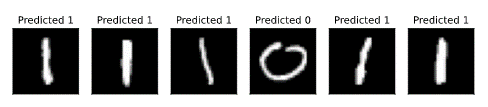

#### 4. 下一步该做什么?

**虽然完全可能创建混合神经网络，但有什么好处吗?**

实际上，该网络的经典层在没有量子层的情况下训练得非常好（实际上更好）。此外，您可能已经注意到，我们在此处训练的量子层不会产生纠缠，因此，当我们扩大此特定体系结构时，其将继续经典可模拟。这意味着如果您希望使用混合神经网络获得量子优势，则需要首先扩展此代码来包括更复杂的量子层。

这项练习的目的是让您考虑将机器学习和量子计算中的技术集成在一起，研究是否确实存在某些有趣的元素，并且由于有了PyTorch和Qiskit，使得这一想法的实现变得容易了。

4.2 最新量子算法的实现
----------------------

### 关于本节

寻找新的量子算法，或现有算法的新应用是一个活跃的研究领域。本节从最近的论文中解释了传统教科书中没有解释的算法和应用。这些应该有助于让读者更接近了解当前的研究领域。本教材是一个滚动更新的文件，以便跟上该各个领域的最新发展。

> import qiskit
>
> from qiskit import QuantumCircuit, QuantumRegister, ClassicalRegister
>
> from qiskit import Aer, execute
>
> import math
>
> import random
>
> import numpy as np
>
> from scipy.optimize import minimize

### 4.2.1 变分量子线性算法

#### 1. 简介

变分量子线性算法或VQLS（Variational Quantum Linear
Solver）是一种变分量子算法，其利用VQE实现比传统计算算法更有效地求解线性方程组。具体来说：如果给定矩阵$\text{A}$，使得$\text{A}|x\rangle = |b\rangle$，其中$|b\rangle$是一些已知矢量，则VQLS算法理论上能够找到使上述关系成立的于$|x\rangle$成比例的归一化$|x\rangle$。

该算法的输出与HHL
Quantum线性求解算法的输出相同，除HHL在VQLS上提供了更有利的计算速度外，我们算法的变体使其可以在NISQ量子计算机上执行，而HHL将需要更强大的量子硬件和更多的量子比特。

#### 2. 算法

首先，该算法的输入显然是一个矩阵$\text{A}$，我们必须将其分解为具有复数系数的幺正线性组合：

$$A = \sum_{n}^{}{c_{n}A_{n} }$$

其中每个$A_{n}$是某一幺正矩阵，而一些幺正矩阵$U$则从$|0\rangle$准备态$|b\rangle$。现在，我们回顾一下变分量子算法的一般结构。我们必须构建一个量子代价函数，可以使用低深度参数化的量子回路对其进行评估，然后输出至经典优化器中。这样就使得我们可以在参数空间中搜索一组参数$\alpha$，使得$|\psi(\alpha)\rangle = \frac{|x\rangle}{||x||}$，其中$|\psi(k)\rangle$是与某些参数集$k$对应的外量子回路的输出。

在开始构建成本函数之前，让我们看一下该算法中子例程的"高级"概述，如原始论文中的图像所示：


从本质上讲，我们从一个量子比特寄存器开始，每个量子比特都初始化为\|0⟩。我们的算法从输入某种拟设$V(\alpha)$开始获取其输入，然后准备并评估成本函数。如果计算出的代价大于某个参数$\gamma$，则使用更新后的参数再次运行该算法，否则算法终止，并使用最佳参数（在终止时确定的）计算该方法。这就给出了使向量函数最小的态向量，也就是$|x|$的归一化形式。

#### 3. Qiskit实施

##### 固定硬件拟设

我们先考虑拟设$V(\alpha)$，其只是准备一些任意状态$|\psi(k)\rangle$的回路。这就使得我们可以通过改变参数$k$来"搜索"态空间。不管怎样，我们将为此实现使用的拟设如下：

> def apply_fixed_ansatz(qubits, parameters):
>
> for iz in range (0, len(qubits)):
>
> circ.ry(parameters\[0\]\[iz\], qubits\[iz\])
>
> circ.cz(qubits\[0\], qubits\[1\])
>
> circ.cz(qubits\[2\], qubits\[0\])
>
> for iz in range (0, len(qubits)):
>
> circ.ry(parameters\[1\]\[iz\], qubits\[iz\])
>
> circ.cz(qubits\[1\], qubits\[2\])
>
> circ.cz(qubits\[2\], qubits\[0\])
>
> for iz in range (0, len(qubits)):
>
> circ.ry(parameters\[2\]\[iz\], qubits\[iz\])
>
> circ = QuantumCircuit(3)
>
> apply_fixed_ansatz(\[0, 1, 2\], \[\[1, 1, 1\], \[1, 1, 1\], \[1, 1,
> 1\]\])
>
> circ.draw()
>
> 输出：

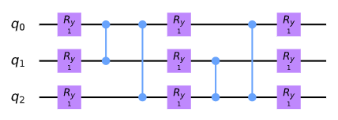

这被称为**固定硬件拟设（fixed hardware
ansatz）**：量子门的配置在回路的每次运行中都保持不变，所变化的都是参数。与QAOA方法不同，其不是仅由渐进哈密顿量组成。$\text{Ry}$门的应用使得我们可以搜索态空间，而$\text{CZ}$门在不同的量子比特状态之间创建"干扰"。

自此，考虑实际代价函数对有有意义了。我们算法的目标是使代价最小化，因此当$|\Phi\rangle = A|\psi(k)\rangle$时非常接近$|b\rangle$，我们希望代价函数的输出非常小，且由于正交向量与向量之间非常接近时，我们希望代价函数很大。因此，我们引入"投影（projection）"哈密顿量：

$$H_{P}\mathbb{= I - |}b\rangle\langle b|$$

其中我们有：

$$C_{P}\text{=}\left\langle \Phi\left| H_{P} \right|\Phi \right\rangle = \left\langle \Phi\left| \mathbb{(I - |}b\rangle\langle b|) \right|\Phi \right\rangle = \left\langle \Phi \middle| \Phi \right\rangle - \langle\Phi|b\rangle\langle b|\Phi\rangle$$

可以看出第二项告诉我们$|\Phi\rangle$倾向$|b\rangle$有多少。然后，当$|\Phi\rangle$和$|b\rangle$的内积最大时用另一个数减去内积就得到了想要的小数目，而当$|\Phi\rangle$和$|b\rangle$时则相反。到目前为止看起来不错！但是，我们还可以用标准化代价函数来提高算法的准确性。这由于$|\Phi\rangle$具有一个小的范数，那么即使$|\Phi\rangle$不与$|b\rangle$相乘代价函数的输出仍会很小。因此，我们用$\frac{|\Phi\rangle}{\sqrt{\langle\Phi|\Phi\rangle} }$代替$|\Phi\rangle$：

$${\widehat{C} }_{P} = \frac{\left\langle \Phi \middle| \Phi \right\rangle}{\left\langle \Phi \middle| \Phi \right\rangle} - \frac{\left\langle \Phi \middle| b \right\rangle\left\langle b \middle| \Phi \right\rangle}{\left\langle \Phi \middle| \Phi \right\rangle} = 1 - \frac{\left\langle \Phi \middle| b \right\rangle\left\langle b \middle| \Phi \right\rangle}{\left\langle \Phi \middle| \Phi \right\rangle} = 1 - \frac{\left| \left\langle b \middle| \Phi \right\rangle \right|^{2} }{\left\langle \Phi \middle| \Phi \right\rangle}$$

自此，我们使用这一拟设准备了态$|\psi(k)\rangle$。为了计算大家函数，我们有两个值需要计算：$|\langle b|\Phi\rangle|^{2}$和$\left\langle \Phi \middle| \Phi \right\rangle$。幸运的是，一个叫做**Hadamard测试**的漂亮小量子子程序可以帮助我们！从本质上说，如果我们有一些幺正矩阵$U$和一些状态$|\phi\rangle$，并找出所对应态$\langle\phi|U|\phi\rangle$的期望值$U$，然后我们就可以评估以下回路：


然后，将第一个为0的量子比特的测量概率等于$\frac{1}{2}(1 + \text{Re}\langle U\rangle)$，而为1的等于$\frac{1}{2}(1 - \text{Re}\langle U\rangle)$，因此这两个概率相减得出$\text{Re}\langle U\rangle$。幸运的是，当我们测试该算法时要处理的矩阵全部为实数，因此对于此特定实现$\text{Re}\left\langle U \right\rangle = \langle U\rangle$。以下为Hadamard测试的工作原理。由回路图可知，通常的态向量为：

$$\frac{|0\rangle + |1\rangle}{\sqrt{2} } \otimes |\psi\rangle = \frac{|0\rangle \otimes |\psi\rangle + |1\rangle \otimes |\psi\rangle}{\sqrt{2} }$$

应用受控幺正变换：

$$\frac{\left| 0 \right\rangle \otimes \left| \psi \right\rangle + \left| 1 \right\rangle \otimes \left| \psi \right\rangle}{\sqrt{2} }$$

$$\longrightarrow \frac{\left| 0 \right\rangle \otimes \left| \psi \right\rangle + \left| 1 \right\rangle \otimes U\left| \psi \right\rangle}{\sqrt{2} }$$

然后将Hadamard门应用于第一个量子比特：

$$\frac{\left| 0 \right\rangle \otimes \left| \psi \right\rangle + \left| 1 \right\rangle \otimes U\left| \psi \right\rangle}{\sqrt{2} } \longrightarrow \frac{1}{2}\left\lbrack \left| 0 \right\rangle \otimes \left| \psi \right\rangle + \left| 1 \right\rangle \otimes \left| \psi \right\rangle + \left| 0 \right\rangle \otimes U\left| \psi \right\rangle - \left| 1 \right\rangle \otimes U\left| \psi \right\rangle \right\rbrack$$

$$\Rightarrow \left| 0 \right\rangle\mathbb{\otimes (I +}U)\left| \psi \right\rangle + \left| 1 \right\rangle\mathbb{\otimes (I -}U)\left| \psi \right\rangle$$

当对第一个量子比特进行测量时，记住为了找到测量结果为0的概率，我们必须将态向量的内积与$|0\rangle$相乘，然后乘以其复共轭（如有！您对此并不熟悉，请参见本教程中的量子力学部分）。测量结果为1的概率也同样处理。因此，我们有：

$$P\left( 0 \right) = \frac{1}{4}\left\langle \psi\left| \left( \mathbb{I} + U \right)\left( \mathbb{I} + U^{\dagger} \right) \right|\psi \right\rangle$$

$$= \frac{1}{4}\left\langle \psi\left| \mathbb{I}^{2} + U + U^{\dagger} + U^{\dagger}U \right|\psi \right\rangle$$

$$= \frac{1}{4}\langle\psi|(2\mathbb{I} + U + U^{\dagger})|\psi\rangle$$

$$\Rightarrow \frac{1}{4}\left\lbrack 2 + \left\langle \psi\left| U^{\dagger} \right|\psi \right\rangle + \left\langle \psi\left| U \right|\psi \right\rangle \right\rbrack$$

$$= \frac{1}{4}\left\lbrack 2 + \left( \left\langle \psi\left| U \right|\psi \right\rangle \right)^{*} + \left\langle \psi\left| U \right|\psi \right\rangle \right\rbrack$$

$$= \frac{1}{2}(1 + \mathbf{\text{Re} }\left\langle \psi\left| U \right|\psi \right\rangle)$$

通过相同的过程，我们得到：

$$P\left( 1 \right) = \frac{1}{2}(1 - \mathbf{\text{Re} }\left\langle \psi\left| U \right|\psi \right\rangle)$$

因此通过相减：

$$P\left( 0 \right) - P\left( 1 \right) = \mathbf{\text{Re} }\left\langle \psi\left| U \right|\psi \right\rangle$$

酷吧！现在，我们可以实现这两个要计算的值。从$\left\langle \Phi \middle| \Phi \right\rangle$,我们有：

$$\left\langle \Phi \middle| \Phi \right\rangle = \left\langle \psi\left( k \right)\left| A^{\dagger}A \right|\psi\left( k \right) \right\rangle = \left\langle 0\left| V\left( k \right)^{\dagger}A^{\dagger}\text{AV}\left( k \right) \right|0 \right\rangle = \langle 0|V\left( k \right)^{\dagger}\left( \sum_{n}^{}{c_{n}A_{n} } \right)^{\dagger}\left( \sum_{n}^{}{c_{n}A_{n} } \right)V(k)|0\rangle$$

$$\Rightarrow \left\langle \Phi \middle| \Phi \right\rangle = \sum_{m}^{}{\sum_{n}^{}{c_{m}^{*}c_{n}\langle 0|V\left( k \right)^{\dagger}A_{m}^{\dagger}A_{n}V(k)|0\rangle} }$$

因此我们的任务就是使用Hadamard测试计算每个可能的项$\langle 0|V\left( k \right)^{\dagger}A_{m}^{\dagger}A_{n}V(k)|0\rangle$。这要求我们准备态$V(k)|0\rangle$，然后对一些矩阵$A_{m}^{\dagger}$和$A_{n}$使用一些辅助受控量子比特执行受控运算。我们可以用如下代码实现：

> \#Creates the Hadamard test
>
> def had_test(gate_type, qubits, ancilla_index, parameters):
>
> circ.h(ancilla_index)
>
> apply_fixed_ansatz(qubits, parameters)
>
> for ie in range (0, len(gate_type\[0\])):
>
> if (gate_type\[0\]\[ie\] == 1):
>
> circ.cz(ancilla_index, qubits\[ie\])
>
> for ie in range (0, len(gate_type\[1\])):
>
> if (gate_type\[1\]\[ie\] == 1):
>
> circ.cz(ancilla_index, qubits\[ie\])
>
> circ.h(ancilla_index)
>
> circ = QuantumCircuit(4)
>
> had_test(\[\[0, 0, 0\], \[0, 0, 1\]\], \[1, 2, 3\], 0, \[\[1, 1, 1\],
> \[1, 1, 1\], \[1, 1, 1\]\])
>
> circ.draw()
>
> 输出：

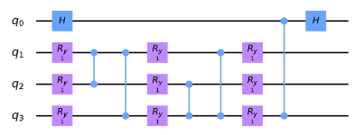

应用两种不同类型量子门的理由为这些量子门呈现了$\left\langle \Phi \middle| \Phi \right\rangle$的扩展形式。

同样重要且需要注意的是对于此实现的目的（实际上要求解的方程组，我们只关心$Z$和$\mathbb{I}$门，因此仅包括对这些量子门的支持（代码中所包含的数字"标识符"表示应用了不同的门：0表示$\mathbb{I}$，1表示$Z$）。

现在，我们可以继续计算的第二个值$|\langle b|\Phi\rangle|^{2}$。

$$\left| \left\langle b \middle| \Phi \right\rangle \right|^{2} = \left| \left\langle b\left| \text{AV}\left( k \right) \right|0 \right\rangle \right|^{2} = \left| \left\langle 0\left| U^{\dagger}\text{AV}\left( k \right) \right|0 \right\rangle \right|^{2}$$

$$= \left\langle 0\left| U^{\dagger}\text{AV}\left( k \right) \right|0 \right\rangle\left\langle 0\left| V\left( k \right)^{\dagger}A^{\dagger}U \right|0 \right\rangle$$

现在要做的就是对乘积$\langle 0|U^{\dagger}AV(k)|0\rangle\langle 0|V(k)^{\dagger}A^{\dagger}U|0\rangle$做相同的扩展：

$$\langle 0\left| U^{\dagger}\text{AV}\left( k \right) \right|0\rangle^{2} = \sum_{m}^{}{\sum_{n}^{}{c_{m}^{*}c_{n}\left\langle 0\left| U_{n}^{\dagger A}V\left( k \right) \right|0 \right\rangle\left\langle 0\left| V\left( k \right)^{\dagger}A_{m}^{\dagger}U \right|0 \right\rangle} }$$

现在，按照本次演示的目的，我们很快就会看到演示实现的所有输出和期望值都为实数，因此：

$$\Rightarrow \left\langle 0\left| U^{\dagger}\text{AV}\left( k \right) \right|0 \right\rangle = \left( \left\langle 0\left| U^{\dagger}\text{AV}\left( k \right) \right|0 \right\rangle \right)^{*} = \left\langle 0\left| V\left( k \right)^{\dagger}A^{\dagger}U \right|0 \right\rangle$$

因此，在这一特定的实现中：

$$\left| \left\langle b \middle| \Phi \right\rangle \right|^{2} = \sum_{m}^{}{\sum_{n}^{}{c_{m}c_{n}\left\langle 0\left| U^{\dagger}A_{n}V\left( k \right) \right|0 \right\rangle\left\langle 0\left| U^{\dagger}A_{m}V\left( k \right) \right|0 \right\rangle} }$$

使用新提出的子例程Hadamard重叠测试（参见引用的论文），有一种求解该值的复杂方法，但对于本教程，我们仅使用标准的Hadamard测试，在其中控制每个矩阵。不幸的是，这需要使用额外的辅助量子比特。从本质来说只是将控制置于所涉及的辅助量子比特，态$|b\rangle$用于准备一个幺正变换，则$A_{n}$是幺正矩阵。因此得到了如下受控拟设：

> \#Creates controlled anstaz for calculating \|\<b\|psi\>\|\^2 with a
> Hadamard test
>
> def control_fixed_ansatz(qubits, parameters, ancilla, reg):
>
> for i in range (0, len(qubits)):
>
> circ.cry(parameters\[0\]\[i\], qiskit.circuit.Qubit(reg, ancilla),
> qiskit.circuit.Qubit(reg, qubits\[i\]))
>
> circ.ccx(ancilla, qubits\[1\], 4)
>
> circ.cz(qubits\[0\], 4)
>
> circ.ccx(ancilla, qubits\[1\], 4)
>
> circ.ccx(ancilla, qubits\[0\], 4)
>
> circ.cz(qubits\[2\], 4)
>
> circ.ccx(ancilla, qubits\[0\], 4)
>
> for i in range (0, len(qubits)):
>
> circ.cry(parameters\[1\]\[i\], qiskit.circuit.Qubit(reg, ancilla),
> qiskit.circuit.Qubit(reg, qubits\[i\]))
>
> circ.ccx(ancilla, qubits\[2\], 4)
>
> circ.cz(qubits\[1\], 4)
>
> circ.ccx(ancilla, qubits\[2\], 4)
>
> circ.ccx(ancilla, qubits\[0\], 4)
>
> circ.cz(qubits\[2\], 4)
>
> circ.ccx(ancilla, qubits\[0\], 4)
>
> for i in range (0, len(qubits)):
>
> circ.cry(parameters\[2\]\[i\], qiskit.circuit.Qubit(reg, ancilla),
> qiskit.circuit.Qubit(reg, qubits\[i\]))
>
> q_reg = QuantumRegister(5)
>
> circ = QuantumCircuit(q_reg)
>
> control_fixed_ansatz(\[1, 2, 3\], \[\[1, 1, 1\], \[1, 1, 1\], \[1, 1,
> 1\]\], 0, q_reg)
>
> circ.draw()

输出：

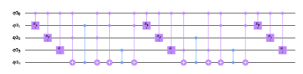

正如所建回路所示：额外的量子比特q0_4。这是一个辅助量子比特，可以让我们创建$\text{CZZ}$量子门。现在还需为$U$创建回路。在本示例的实现中，我们将$U$取为：

$$U = H_{1}H_{2}H_{3}$$

因此，我们有：

> def control_b(ancilla, qubits):
>
> for ia in qubits:
>
> circ.ch(ancilla, ia)
>
> circ = QuantumCircuit(4)
>
> control_b(0, \[1, 2, 3\])
>
> circ.draw()
>
> 输出：

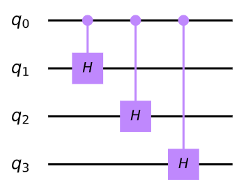

最后，构建新的Hadamard测试：

> \#Create the controlled Hadamard test, for calculating \<psi\|psi\>
>
> def special_had_test(gate_type, qubits, ancilla_index, parameters,
> reg):
>
> circ.h(ancilla_index)
>
> control_fixed_ansatz(qubits, parameters, ancilla_index, reg)
>
> for ty in range (0, len(gate_type)):
>
> if (gate_type\[ty\] == 1):
>
> circ.cz(ancilla_index, qubits\[ty\])
>
> control_b(ancilla_index, qubits)
>
> circ.h(ancilla_index)
>
> q_reg = QuantumRegister(5)
>
> circ = QuantumCircuit(q_reg)
>
> special_had_test(\[\[0, 0, 0\], \[0, 0, 1\]\], \[1, 2, 3\], 0, \[\[1,
> 1, 1\], \[1, 1, 1\], \[1, 1, 1\]\], q_reg)
>
> circ.draw()
>
> 输出：


当我们将所有参数都设置为1时，这就是一个特定的实现，此时量子门的集合$A_{n}$仅为\[0,0,0\]和\[0,0,1\]，其所对应的是所有量子比特的单位矩阵以及第三个量子比特上的$Z$矩阵。

现在，我们准备计算最终的代价函数。这仅涉及我们将来自不同回路期望输出的所有组合的乘积乘以各自的系数，并导入到我们先前讨论的代价函数中！

> \#Implements the entire cost function on the quantum circuit
>
> def calculate_cost_function(parameters):
>
> global opt
>
> overall_sum_1 = 0
>
> parameters = \[parameters\[0:3\], parameters\[3:6\],
> parameters\[6:9\]\]
>
> for i in range(0, len(gate_set)):
>
> for j in range(0, len(gate_set)):
>
> global circ
>
> qctl = QuantumRegister(5)
>
> qc = ClassicalRegister(5)
>
> circ = QuantumCircuit(qctl, qc)
>
> backend = Aer.get_backend(\'statevector_simulator\')
>
> multiply = coefficient_set\[i\]\*coefficient_set\[j\]
>
> had_test(\[gate_set\[i\], gate_set\[j\]\], \[1, 2, 3\], 0, parameters)
>
> job = execute(circ, backend)
>
> result = job.result()
>
> outputstate = np.real(result.get_statevector(circ, decimals=100))
>
> o = outputstate
>
> m_sum = 0
>
> for l in range (0, len(o)):
>
> if (l%2 == 1):
>
> n = o\[l\]\*\*2
>
> m_sum+=n
>
> overall_sum_1+=multiply\*(1-(2\*m_sum))
>
> overall_sum_2 = 0
>
> for i in range(0, len(gate_set)):
>
> for j in range(0, len(gate_set)):
>
> multiply = coefficient_set\[i\]\*coefficient_set\[j\]
>
> mult = 1
>
> for extra in range(0, 2):
>
> qctl = QuantumRegister(5)
>
> qc = ClassicalRegister(5)
>
> circ = QuantumCircuit(qctl, qc)
>
> backend = Aer.get_backend(\'statevector_simulator\')
>
> if (extra == 0):
>
> special_had_test(gate_set\[i\], \[1, 2, 3\], 0, parameters, qctl)
>
> if (extra == 1):
>
> special_had_test(gate_set\[j\], \[1, 2, 3\], 0, parameters, qctl)
>
> job = execute(circ, backend)
>
> result = job.result()
>
> outputstate = np.real(result.get_statevector(circ, decimals=100))
>
> o = outputstate
>
> m_sum = 0
>
> for l in range (0, len(o)):
>
> if (l%2 == 1):
>
> n = o\[l\]\*\*2
>
> m_sum+=n
>
> mult = mult\*(1-(2\*m_sum))
>
> overall_sum_2+=multiply\*mult
>
> print(1-float(overall_sum_2/overall_sum_1))
>
> return 1-float(overall_sum_2/overall_sum_1)

这段代码看起来长而令人怯步，但事实并非如此！在这个模拟中采用了一种数值方法，计算每个对应状态幅值的平方来对处于态$1$的量子比特进行辅助Hadamard测试的测量，然后一句所得信息计算$P(0) - P(1) = 1 - 2P(1)$息。这一计算过程是非常精确但不现实，因为一个真正的量子设备将不得不对电路进行多次采样以产生这些概率（将在下文中讨论采样）。此外，这段代码还没有完全优化（其所完成的量子回路的评估比需要其完成的还多），但这是实现代码的最简单方式，将在本教程的更新中对其进行优化。

最后一步是使用这一代码解决一个真正的线性系统问题：

$$A = 0.45Z_{3} + 0.55\mathbb{I}$$

为了使代价函数最小，我们反复使用了COBYLA优化方法。所要搜索的参数空间由$\frac{k}{1000}\text{\ \ }k \in \left\{ 0,3000 \right\}$定义，最初是随机选择的。我们将会运行该优化器200此，然后对最佳参数应用拟设来获取最佳的态向量！为了实现这一步骤，我们将会在最佳向量$|\psi\rangle_{o}$上应用$A$来对其进行归一化，然后计算该向量与解向量$|b\rangle$内积的平方！将上述所有过程放入代码：

> coefficient_set = \[0.55, 0.45\]
>
> gate_set = \[\[0, 0, 0\], \[0, 0, 1\]\]
>
> out = minimize(calculate_cost_function,
> x0=\[float(random.randint(0,3000))/1000 for i in range(0, 9)\],
> method=\"COBYLA\", options={\'maxiter\':200})
>
> print(out)
>
> out_f = \[out\[\'x\'\]\[0:3\], out\[\'x\'\]\[3:6\],
> out\[\'x\'\]\[6:9\]\]
>
> circ = QuantumCircuit(3, 3)
>
> apply_fixed_ansatz(\[0, 1, 2\], out_f)
>
> backend = Aer.get_backend(\'statevector_simulator\')
>
> job = execute(circ, backend)
>
> result = job.result()
>
> o = result.get_statevector(circ, decimals=10)
>
> a1 = coefficient_set\[1\]\*np.array(\[\[1,0,0,0,0,0,0,0\],
> \[0,1,0,0,0,0,0,0\], \[0,0,1,0,0,0,0,0\], \[0,0,0,1,0,0,0,0\],
> \[0,0,0,0,-1,0,0,0\], \[0,0,0,0,0,-1,0,0\], \[0,0,0,0,0,0,-1,0\],
> \[0,0,0,0,0,0,0,-1\]\])
>
> a2 = coefficient_set\[0\]\*np.array(\[\[1,0,0,0,0,0,0,0\],
> \[0,1,0,0,0,0,0,0\], \[0,0,1,0,0,0,0,0\], \[0,0,0,1,0,0,0,0\],
> \[0,0,0,0,1,0,0,0\], \[0,0,0,0,0,1,0,0\], \[0,0,0,0,0,0,1,0\],
> \[0,0,0,0,0,0,0,1\]\])
>
> a3 = np.add(a1, a2)
>
> b =
> np.array(\[float(1/np.sqrt(8)),float(1/np.sqrt(8)),float(1/np.sqrt(8)),float(1/np.sqrt(8)),float(1/np.sqrt(8)),float(1/np.sqrt(8)),float(1/np.sqrt(8)),float(1/np.sqrt(8))\])
>
> print((b.dot(a3.dot(o)/(np.linalg.norm(a3.dot(o)))))\*\*2)
>
> 输出：
>
> 0.9525017762138146
>
> ...
>
> 0.0017136719460107974
>
> fun: 0.0017136719460107974
>
> maxcv: 0.0
>
> message: \'Maximum number of function evaluations has been exceeded.\'
>
> nfev: 200
>
> status: 2
>
> success: False
>
> x: array(\[3.12960969, 3.25355402, 1.64878693, 2.02209032, 2.15355337,
>
> 1.6535498 , 2.64233591, 2.76727927, 2.93611543\])
>
> (0.9982863280442702-0j)

正如输出所示，代价函数已达到较低值0.03273673575407443，当计算经典代价函数时所的值为0.96776862579723，完全符合我们的测量：向量$|\psi\rangle_{o}$与$|b\rangle$非常相近！

让我们再做一个测试吧！这一次,我们将保持$|b\rangle$不变，但将：

$$A = 0.55\mathbb{I} + 0.225Z_{2} + 0.225Z_{3}$$

再一次运行优化代码：

> coefficient_set = \[0.55, 0.225, 0.225\]
>
> gate_set = \[\[0, 0, 0\], \[0, 1, 0\], \[0, 0, 1\]\]
>
> out = minimize(calculate_cost_function,
> x0=\[float(random.randint(0,3000))/1000 for i in range(0, 9)\],
> method=\"COBYLA\", options={\'maxiter\':200})
>
> print(out)
>
> out_f = \[out\[\'x\'\]\[0:3\], out\[\'x\'\]\[3:6\],
> out\[\'x\'\]\[6:9\]\]
>
> circ = QuantumCircuit(3, 3)
>
> apply_fixed_ansatz(\[0, 1, 2\], out_f)
>
> backend = Aer.get_backend(\'statevector_simulator\')
>
> job = execute(circ, backend)
>
> result = job.result()
>
> o = result.get_statevector(circ, decimals=10)
>
> a1 = coefficient_set\[2\]\*np.array(\[\[1,0,0,0,0,0,0,0\],
> \[0,1,0,0,0,0,0,0\], \[0,0,1,0,0,0,0,0\], \[0,0,0,1,0,0,0,0\],
> \[0,0,0,0,-1,0,0,0\], \[0,0,0,0,0,-1,0,0\], \[0,0,0,0,0,0,-1,0\],
> \[0,0,0,0,0,0,0,-1\]\])
>
> a0 = coefficient_set\[1\]\*np.array(\[\[1,0,0,0,0,0,0,0\],
> \[0,1,0,0,0,0,0,0\], \[0,0,-1,0,0,0,0,0\], \[0,0,0,-1,0,0,0,0\],
> \[0,0,0,0,1,0,0,0\], \[0,0,0,0,0,1,0,0\], \[0,0,0,0,0,0,-1,0\],
> \[0,0,0,0,0,0,0,-1\]\])
>
> a2 = coefficient_set\[0\]\*np.array(\[\[1,0,0,0,0,0,0,0\],
> \[0,1,0,0,0,0,0,0\], \[0,0,1,0,0,0,0,0\], \[0,0,0,1,0,0,0,0\],
> \[0,0,0,0,1,0,0,0\], \[0,0,0,0,0,1,0,0\], \[0,0,0,0,0,0,1,0\],
> \[0,0,0,0,0,0,0,1\]\])
>
> a3 = np.add(np.add(a2, a0), a1)
>
> b =
> np.array(\[float(1/np.sqrt(8)),float(1/np.sqrt(8)),float(1/np.sqrt(8)),float(1/np.sqrt(8)),float(1/np.sqrt(8)),float(1/np.sqrt(8)),float(1/np.sqrt(8)),float(1/np.sqrt(8))\])
>
> print((b.dot(a3.dot(o)/(np.linalg.norm(a3.dot(o)))))\*\*2)
>
> 输出：
>
> 0.9482467948093024
>
> ...
>
> 0.002908980739327327
>
> fun: 0.002908980739327327
>
> maxcv: 0.0
>
> message: \'Maximum number of function evaluations has been exceeded.\'
>
> nfev: 200
>
> status: 2
>
> success: False
>
> x: array(\[3.10826981, 1.46209082, 0.62663923, 2.95395745, 1.91693021,
>
> 0.34911488, 1.60850267, 2.32093243, 3.00529306\])
>
> (0.9970910192620044-0j)

其结果还是非常的小：0.00014718223342624626，而经典代价函数的输出为0.9998563418983931。

至此，我们发现这个算法在**理论上**是可行的。我们试着用一个回路的模拟来对回路进行采样，而非计算数值概率。现在如同在真实的量子计算机中一样，尝试对量子回路进行**采样**!出于某种原因，这种模拟只能在相当数量的"次数"（为了计算结果的概率分布而运行的回路）情况下才能很好地收敛。我们认为这主要与经典优化器（COBYLA）的局限性有关，因为采样量子电路时的噪声特性（具有相同参数的测量并不总是产生相同的结果）。幸运的是，还有其他为噪声函数构建的优化器，比如SPSA，但在本教程中不会深入研究。我们试着用相同的矩阵$U$对$A$的第二个值进行：

> \#Implements the entire cost function on the quantum circuit
> (sampling, 100000 shots)
>
> def calculate_cost_function(parameters):
>
> global opt
>
> overall_sum_1 = 0
>
> parameters = \[parameters\[0:3\], parameters\[3:6\],
> parameters\[6:9\]\]
>
> for i in range(0, len(gate_set)):
>
> for j in range(0, len(gate_set)):
>
> global circ
>
> qctl = QuantumRegister(5)
>
> qc = ClassicalRegister(1)
>
> circ = QuantumCircuit(qctl, qc)
>
> backend = Aer.get_backend(\'qasm_simulator\')
>
> multiply = coefficient_set\[i\]\*coefficient_set\[j\]
>
> had_test(\[gate_set\[i\], gate_set\[j\]\], \[1, 2, 3\], 0, parameters)
>
> circ.measure(0, 0)
>
> job = execute(circ, backend, shots=100000)
>
> result = job.result()
>
> outputstate = result.get_counts(circ)
>
> if (\'1\' in outputstate.keys()):
>
> m_sum = float(outputstate\[\"1\"\])/100000
>
> else:
>
> m_sum = 0
>
> overall_sum_1+=multiply\*(1-2\*m_sum)
>
> overall_sum_2 = 0
>
> for i in range(0, len(gate_set)):
>
> for j in range(0, len(gate_set)):
>
> multiply = coefficient_set\[i\]\*coefficient_set\[j\]
>
> mult = 1
>
> for extra in range(0, 2):
>
> qctl = QuantumRegister(5)
>
> qc = ClassicalRegister(1)
>
> circ = QuantumCircuit(qctl, qc)
>
> backend = Aer.get_backend(\'qasm_simulator\')
>
> if (extra == 0):
>
> special_had_test(gate_set\[i\], \[1, 2, 3\], 0, parameters, qctl)
>
> if (extra == 1):
>
> special_had_test(gate_set\[j\], \[1, 2, 3\], 0, parameters, qctl)
>
> circ.measure(0, 0)
>
> job = execute(circ, backend, shots=100000)
>
> result = job.result()
>
> outputstate = result.get_counts(circ)
>
> if (\'1\' in outputstate.keys()):
>
> m_sum = float(outputstate\[\"1\"\])/100000
>
> else:
>
> m_sum = 0
>
> mult = mult\*(1-2\*m_sum)
>
> overall_sum_2+=multiply\*mult
>
> print(1-float(overall_sum_2/overall_sum_1))
>
> return 1-float(overall_sum_2/overall_sum_1)
>
> coefficient_set = \[0.55, 0.225, 0.225\]
>
> gate_set = \[\[0, 0, 0\], \[0, 1, 0\], \[0, 0, 1\]\]
>
> out = minimize(calculate_cost_function,
> x0=\[float(random.randint(0,3000))/1000 for i in range(0, 9)\],
> method=\"COBYLA\", options={\'maxiter\':200})
>
> print(out)
>
> out_f = \[out\[\'x\'\]\[0:3\], out\[\'x\'\]\[3:6\],
> out\[\'x\'\]\[6:9\]\]
>
> circ = QuantumCircuit(3, 3)
>
> apply_fixed_ansatz(\[0, 1, 2\], out_f)
>
> backend = Aer.get_backend(\'statevector_simulator\')
>
> job = execute(circ, backend)
>
> result = job.result()
>
> o = result.get_statevector(circ, decimals=10)
>
> a1 = coefficient_set\[2\]\*np.array(\[\[1,0,0,0,0,0,0,0\],
> \[0,1,0,0,0,0,0,0\], \[0,0,1,0,0,0,0,0\], \[0,0,0,1,0,0,0,0\],
> \[0,0,0,0,-1,0,0,0\], \[0,0,0,0,0,-1,0,0\], \[0,0,0,0,0,0,-1,0\],
> \[0,0,0,0,0,0,0,-1\]\])
>
> a0 = coefficient_set\[1\]\*np.array(\[\[1,0,0,0,0,0,0,0\],
> \[0,1,0,0,0,0,0,0\], \[0,0,-1,0,0,0,0,0\], \[0,0,0,-1,0,0,0,0\],
> \[0,0,0,0,1,0,0,0\], \[0,0,0,0,0,1,0,0\], \[0,0,0,0,0,0,-1,0\],
> \[0,0,0,0,0,0,0,-1\]\])
>
> a2 = coefficient_set\[0\]\*np.array(\[\[1,0,0,0,0,0,0,0\],
> \[0,1,0,0,0,0,0,0\], \[0,0,1,0,0,0,0,0\], \[0,0,0,1,0,0,0,0\],
> \[0,0,0,0,1,0,0,0\], \[0,0,0,0,0,1,0,0\], \[0,0,0,0,0,0,1,0\],
> \[0,0,0,0,0,0,0,1\]\])
>
> a3 = np.add(np.add(a2, a0), a1)
>
> b =
> np.array(\[float(1/np.sqrt(8)),float(1/np.sqrt(8)),float(1/np.sqrt(8)),float(1/np.sqrt(8)),float(1/np.sqrt(8)),float(1/np.sqrt(8)),float(1/np.sqrt(8)),float(1/np.sqrt(8))\])
>
> print((b.dot(a3.dot(o)/(np.linalg.norm(a3.dot(o)))))\*\*2)
>
> 输出：
>
> 0.9514881256868424
>
> ...
>
> 0.2139899222278312
>
> fun: 0.2139899222278312
>
> maxcv: 0.0
>
> message: \'Optimization terminated successfully.\'
>
> nfev: 92
>
> status: 1
>
> success: True
>
> x: array(\[0.73273877, 2.2931889 , 3.0873678 , 0.17167063, 2.89176878,
>
> 2.49081023, 1.23099965, 2.55246703, 1.9982882 \])
>
> (0.7874538692918659+0j)

还是如输出所示，我们的解仍有相当大的差距（3.677％的误差并不可怕，但理想情况下其应更接近于0）。同样，我们认为这是由于优化器本身而不是实际的量子回路所引起的。一旦弄清楚如何解决此问题，我们将对本节中的代码进行更新（如前所述，可能引入噪声优化器）。

#### 4. 致谢

此实现基于研究论文《[可变量子线性求解算法：线性系统的混合算法](https://arxiv.org/abs/1909.05820)》中的工作，该论文由Carlos
Bravo-Prieto，Ryan LaRose，M。Cerezo，YiğitSubaşı，Lukasz
Cincio和Patrick J. Coles撰写。

特别感谢Carlos Bravo-Prieto通过回答有关论文的一些问题亲自提供帮助！