6 利用微波脉冲研究量子硬件
==========================

即将来临
--------

以下主题目前正处于开发阶段，即将被添加到本教程中：

1\. 退相干和能量弛豫：测量T2和T1

2\. 优化微波脉冲的高保真量子比特操作

6.1 用Qiskit Pulse校准量子比特
------------------------------

Qiskit是一个用于量子计算机编程的开源框架\[1\]。通过Qiskit可以在量子设备上构建、模拟和运行量子回路。

Qiskit
Pulse提供了用于指定独立于特定硬件实现的通用量子设备的脉冲登记控制（如：输入信号的连续时间动态控制）的语言\[2\]。

在本节的教程将会展示如何通过Qiskit和Qiskit
Pulse实现典型的单量子比特校准以及对试验进行特性描述。通常，这些是在将设备制造并安装到系统中后立即在实验室中进行的第一轮实验。该演示将会以典型的学校方式进行，允许您实验性地探索双能级系统动力学（two-level-system
dynamic）。在演示中所涉及的所有计量单位均以标准SI返回，如：Hz、sec等等。

演示中的每次试验都会给予我们有关系统的更多信息，这些信息通常会用于后续的试验中。因此，此notebook内的代码基本上是按先后顺序执行。

### 内容

1\. 入门指南

2\. 使用频率扫描找出量子比特的频率

3\. 校准与使用$\pi$脉冲

3.1 使用Rabi实验校准$\pi$脉冲

3.2 确定0还是1

3.3 使用反转恢复测量$T_{1}$

4\. 确定量子比特的相干性

4.1 使用Ramsey实验精确测量量子比特的频率

4.2 使用哈恩回波（Hahn Echoes）测量$T_{2}$

5\. 参考文献

### 1. 入门指南

首先导入将会使用到的Python库。由于我们会在校准实验中使用真实且包含噪声的设备，所以需要用到IBMQ账户以及设置相应的后端。

我们可以通过检查后端配置来验证所支撑的脉冲特性。这一配置给出了后端设置结构的一般信息。

例如，我们可以在后端配置中找到后端脉冲的取样时间。这一参数在构建和执行校准时非常有用。

后端会默认给出如何使用后端的起始点。其中含有量子比特频率的估计和扮演基础量子算子的程序。我们可以使用下面的命令对其进行访问：

### 2. 使用频率扫描找出量子比特的频率

我们从搜索量子比特的频率开始。量子位的频率是基态$|0\rangle$和激发态$|1\rangle$之间的能量差。这一频率对于产生脉冲至关重要，脉冲可以在量子比上产生特定的量子算子------这也是校准的最终目标!

在超导的量子比特上高能级是可以被实现的，但是我们通过制造非协系统来控制激发的转换------意为：我们通过隔离两个能级的量子比特并将每个量子比特视为基础双能级系统来忽略其中的高能态。

在典型的实验设置中，量子比特的频率可以通过扫描一段频率的范围找出并使用一种叫做网络分析仪（Network
Analyer）的工具来寻找被吸收的迹象。之后，我们将会看到如何使用Ramsey脉冲序列进行更加精确的测量。\
首先，定义用于在量子比特上扫描的频率范围。由于这一范围可以是任意大小，所以我们在backend_defaults中将这一范围限制在量子比特的估计频率40mhz左右。

接下来定义将会在实验中要到的脉冲。我们从称之为高斯脉冲的驱动脉冲开始。

是否还记得上问中的值dt？所有脉冲的时长都用dt表示。在下一单元中，我们用dt来定义驱动脉冲的长度。

为了正确的测量量子比特，我们需要核对测量映射。这是一种强制约束，因为当对一个量子比特的测量结束后，对其他量子比特的测量也同时结束。当在Pulse中创建程序时需要尊重这一约束。让我们检查一下量子比特属于哪一组量子比特：

现在，我们就可以定义测量脉冲了。与其硬编码脉冲程序，不如直接从Qiskit后端的默认指令表中调取一个已校准的测量脉冲。因为这样的脉冲经常被校准，而且比我们自己定义的测量脉冲更加精确。并且这样的测量脉冲包含捕获，如此我们就无须手工定义了。

接着，指定施加脉冲的信道。驱动、测量和捕获信道由量子比特的顺序定义。

至此脉冲的参数定义完成，而且还为实验创建了脉冲波形，接着我们就可以创建脉冲调度了。

在每一频率上，我们将会向量子比特传送一个该频率的驱动脉冲并在脉冲之后马上测量。脉冲包与频率无关，因此我们可以创建一个可重用的调度（schedule），并通过频率数组来指定驱动脉冲的频率。

对脉冲调度进行检查是明智的举动，使用schedule.draw()完成，如下所示：

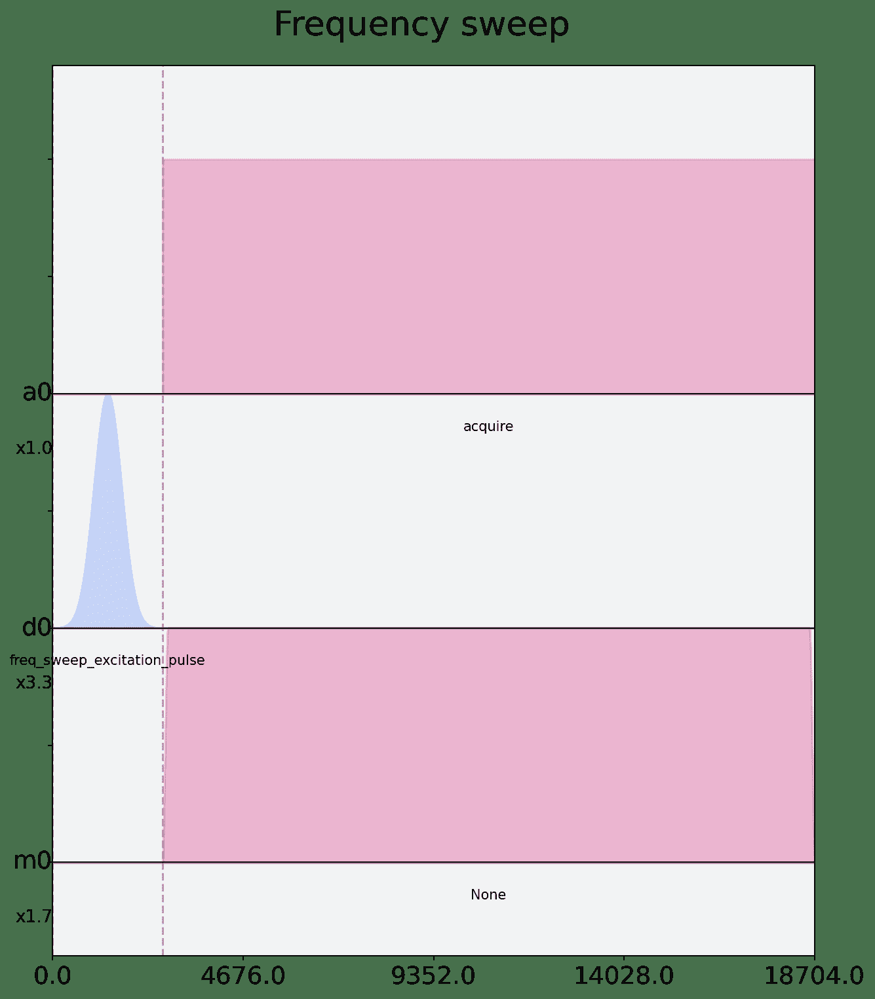我们将上面的schedule和schedule_frequencies组合成一个可以发送到量子设备程序对象Qobj。我们在其中请求对每个调度（频率扫描中的每个点）重复num_shots_per_frequency次，以获得对量子比特响应的良好估计。

我们还指定了测量设置。meas_level=0返回原始数据（每个次测量返回一个复数值的数组），meas_level=1返回核心数据（每次测量返回一个复数值），而meas_level=2返回分类数据（每次测量返回比特0或比特1）。如果我们还没有已校准的鉴别器来区分0和1的话，可以通过指定meas_level=1来复制在实验室里要使用的东西。我们想要的结果是"avg（平均值）"而非每一次的测量值。

您可能会看到另一个计量单位更改警告，我们可以安全地忽略该警告。最后，我们可以在后端上运行该组合程序：

此处有一个好习惯：将最后检索的job_id打印出来，并通过job_monitor()监控作业的状态。

一旦作业开始运行，结果可以使用下面的代码对其检索：

我们会通过mateplotlib将所提取的结果绘制成图：

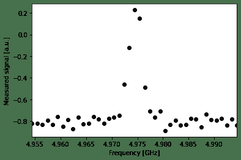

正如上面的图形所示，峰值处于量子比特频率所对应的中心处。这些信号展示了功率展宽（power-broadening），即当接近中心频率时我们能够驱动量子比特脱离共振的信号。为了得到峰值频率的值，我们将把这些值拟合到一个典型洛伦兹形状的共振响应曲线上。

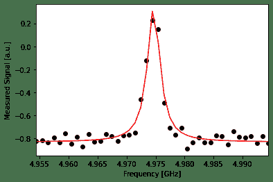

### 3. 校准与使用$\mathbf{\pi}$脉冲

#### 3.1 使用Rabi实验校准$\mathbf{\pi}$脉冲

当我们知道量子比特的频率之后，下一步就是确定$\pi$脉冲的强度。将量子比特看作双能级系统时，严格地讲一个$\pi$脉冲作用就是把量子比特的状态从$|0\rangle$转换为$\left| 1 \right\rangle$，反之亦然。$\pi$脉冲也称为$X$或$X180$门，或位翻转算子。我们已经从上面的频率扫频实验中知道了驱动这种转变所需的微波频率，现在寻找实现从态$|0\rangle$到态$|1\rangle$的𝜋旋转所需振幅。所需的旋转在布洛赫球体下图所示，您可以看到𝜋脉冲因其在布洛赫球中扫过的角度而得名。

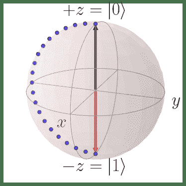

我们将会通过小幅度的增加来改变驱动幅值并在每次改动后测量量子比特的状态。我们期望能够看到通常称为Rabi振动的振动，如同量子比特从态$|0\rangle$变为态$|1\rangle$，然后再变回态$|0\rangle$。

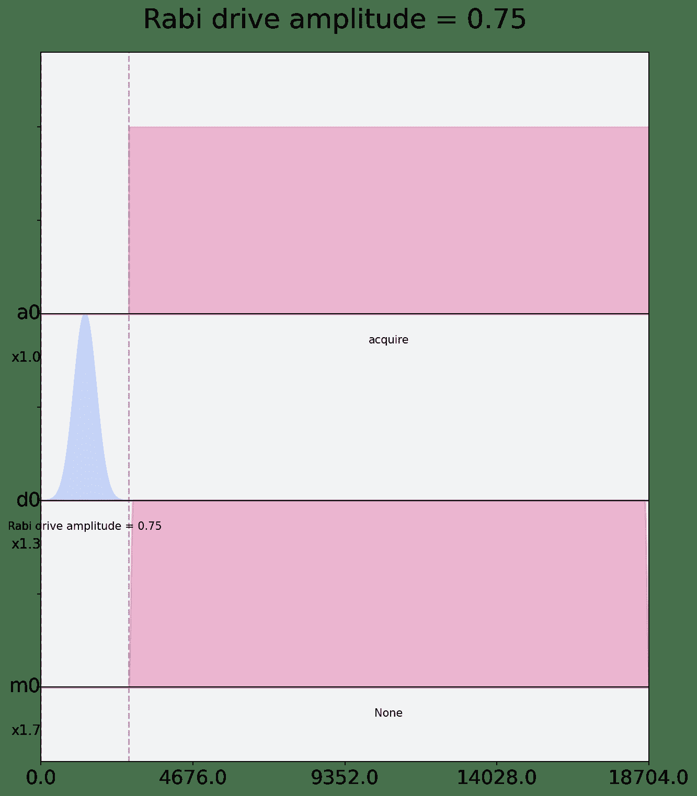上面代码所定义的调度本质上与频率扫描实验相同。其唯一的区别是相对于调制频率这一次我们所运行的是具有不同驱动脉冲幅值的一组实验。

至此就得到了结果，我们将会提取并拟合这些结果至一个正弦曲线。对于所选的驱动幅值的范围，我们希望从态$|0\rangle$开始围绕布洛赫球完全旋转量子比特多次。这种正弦波的幅值告诉我们脉冲次数中的一小部分的Rabi驱动幅值会生成态$|1\rangle$。我们想要找出使得信号从最大（所有量子比特的状态为$|0\rangle$）到最小（所有的量子比特状态为$|1\rangle$）的振荡所需的驱动幅值------这一过程给出了扮演𝜋脉冲的已校准幅值。

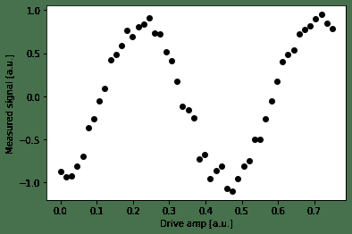

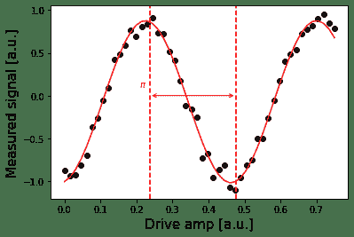

##### $\mathbf{\pi}$脉冲

现在，我们就可以使用刚才找到的幅值定义脉冲了，并可在之后的实验中使用。

#### 3.2 确定0还是1

一旦$\pi$脉冲经过校准，就能以高概率创建态$|1\rangle$。我们通过重复制备以及绘制测量信号来找出态$|0\rangle$和态$|1\rangle$在测量时所呈现状态。这就是创建鉴频器（discriminator）的过程，其为接受一个已测量的核心负数（meas_level=1）以及将其分类为0或1（meas_level=2）的简单函数。

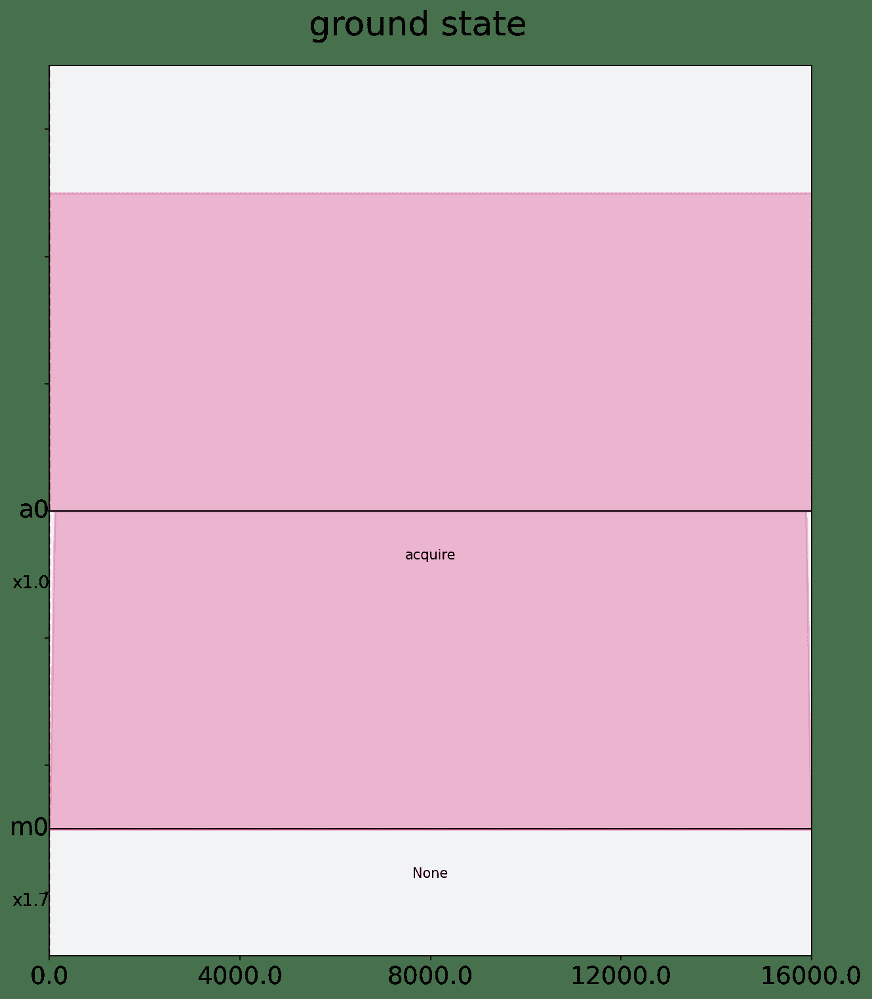

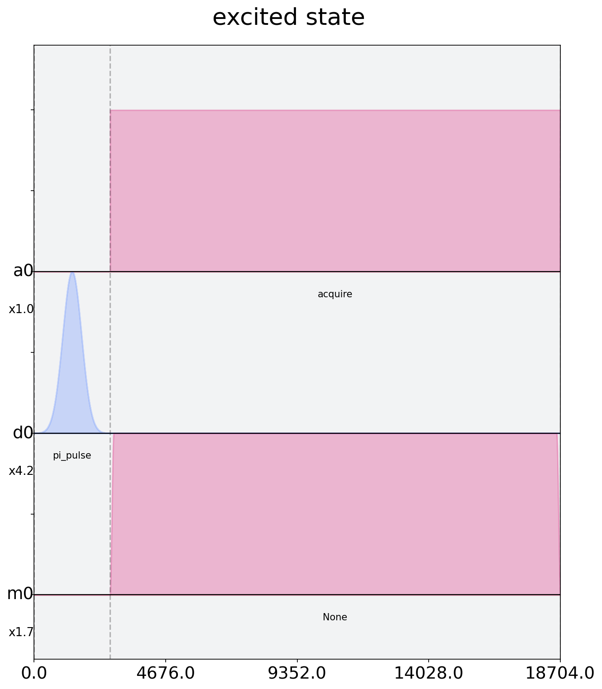

我们将基态和激发态准备调度汇总到一个Qobj中。其中的每一个都要运行num_shots次。在本次实验中我们设置参数meas_level=1，因为无需已分类为态$\left| 0 \right\rangle$和态$|1\rangle$的结果。相反本次实验我们想要核心数据：所采集的原始数据已通过核函数每次都生成单一复数值。您可以将核函数想象为应用于原始测量数据的点积。我们会为两个调度传递同一频率，尽管这一频率仅由函数exc_schedule使用。

至此就获得了结果，我们可以在一个简单的散点图上可视化所准备的两个总体，蓝色显示基态程序的结果，红色显示激发态准备程序的结果。

从上图中可以清楚地看出结果分为两个$\left| 0 \right\rangle$和$|1\rangle$的两个簇。核测量结果通过能够最佳区分这两个簇的鉴频器分类，使用meas_level使得0变为1。最佳区分仅是在IQ平面上的一条线，该线与上图中的两个黑点的平均结果等距，并且垂直于连接两黑点的线。

我们可以通过若一个给定的点接近于基态结果的均值返回0，接近于激发态结果的均值则返回1来设置一个快速的分类函数。

#### 3.3 使用反转恢复测量$\mathbf{T}_{\mathbf{1}}$

一个量子比特的$T_{1}$时间是其从激发态变为基态的延迟时间。这一时间非常重要，因其限制了我们可在量子计算机上运行程序的可用持续时间。

对$T_{1}$时间的测量与之前的实验相似，使用已校准的$\pi$脉冲。我们会再次使用单个驱动脉冲（$\pi$脉冲），然后施加一个测量脉冲。然而，此时并非如同先前那样直接对其测量，我们会先插入一个延迟并在不同的实验之间更改延迟的时间。当画出测得信号与延迟时间的图形时，将会看到在量子比特释放能量时信号呈现指数形式的衰减。这一延迟时间就是量子比特的驰豫时间$T_{1}$。

我们也可以检查$T_{1}$调度。为了能够真正理解这个实验的意义，可以更改sched_idx的值后运行下面的代码来尝试不同的调度。在增大sched_idx时，您将会看到测量脉冲开始。

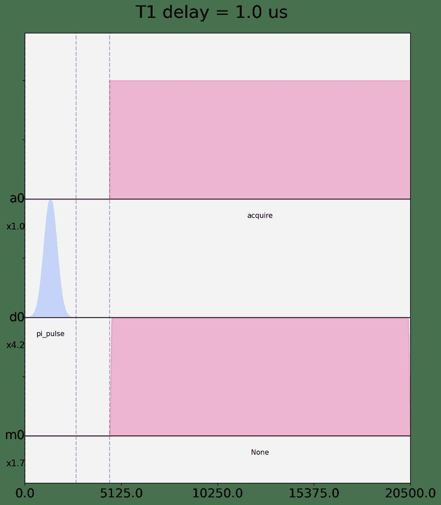

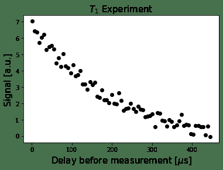

然后，我们就可以将数据与衰减指数进行拟合，从而得到$T_{1}$！

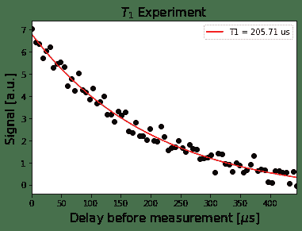

### 4.确定量子比特的相干性（Coherence）

#### 4.1 使用Ramsey实验精确测量量子比特的频率

现在，我们将会在更佳的精度上确定量子比特的频率，这一过程使用Ramsey脉冲序列来完成。在这个脉冲序列中，我们会先施加一个$\pi/2$的脉冲并等待$\Delta t$的时间，作用另一个$\pi/2$脉冲。由于所测量的信号来自与脉冲频率相同的量子比特，我们应该能够观察到所施加脉冲和量子比特之间频率差处的波动。

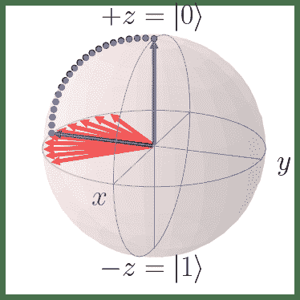

与$T_{1}$调度一样，可多次执行下面的代码来检查已经制定的一些调度会给出启示。当您观察ramsey_schedule指数增长时，两个$\pi/2$脉冲之间的延迟将会增大。

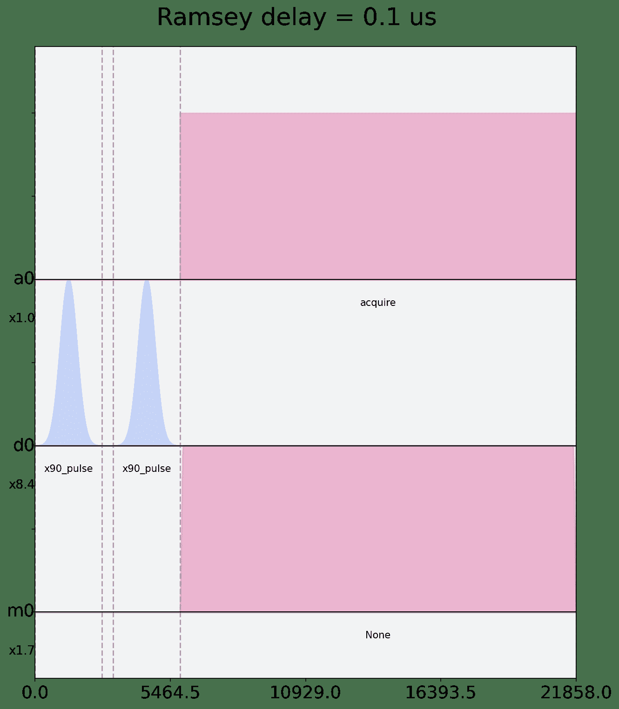

此处，我们将使用一个常用的实验技巧。我们将使脉冲与一个已知的量偏共振，称之为失谐兆赫（detuning_MHz）。所测得Ramsey信号所显示的频率应接近失谐兆赫，与之有小的偏移。这一小偏移就是rough_qubit_frequency与量子比特频率之间的确切距离。

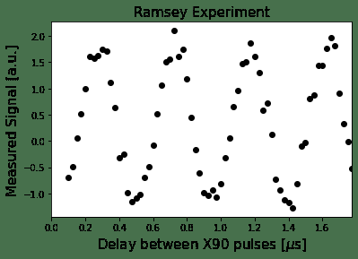

我们将会拟合数据至与一个正弦波并提取所感兴趣$\Delta f$的信息。

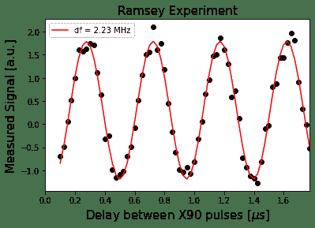

至此，我们知道del_f\_Mhz后就可以更新对量子比特频率的估计了。

#### 使用哈恩回波（Hahn Echoes）测量$\mathbf{T}_{\mathbf{2}}$

接着，我们就可以测量量子比特的相干时间$T_{2}$了。本次实验中所使用的脉冲序列称之为哈恩回波（Hahn
Echo），这、一术语来自核磁共振（NMR）学界。哈恩回波实验与上文中所讲诉的Ramsey实验非常相识，都是在两个$\pi/2$脉冲之间增加一个$\pi$脉冲。在时间$\tau$处的$\pi$脉冲使累积相位反向，并在时间$2\tau$处产生回波，在此时施加最后的$\pi/2$脉冲进行测量。

哈恩回波实验的衰减时间给出了相干时间$T_{2}$。

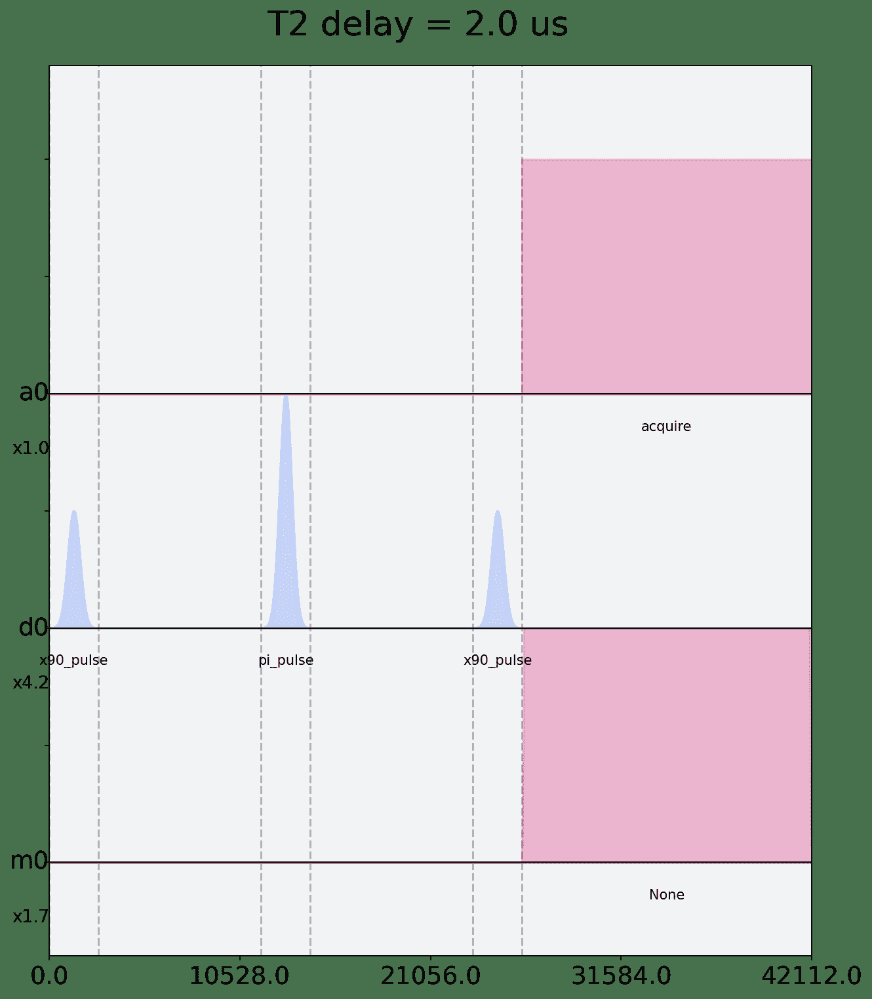

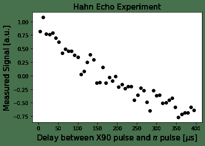

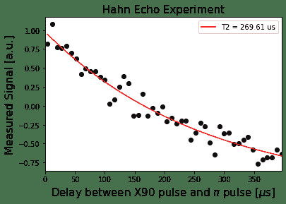

##### 级联动态解耦（Concatenated Dynamical Decoupling）

单个$\pi$脉冲能够消除由于反转相位累积而产生的准静态噪声。通过连续施加几个$\pi$脉冲，可以将此概念扩展到无法近似为准静态的噪声。这一技术通常称为动态去耦（dynamical
decoupling），使得我们可以消除不同频率的噪声，并可从量子比特中提取更长的相干时间。

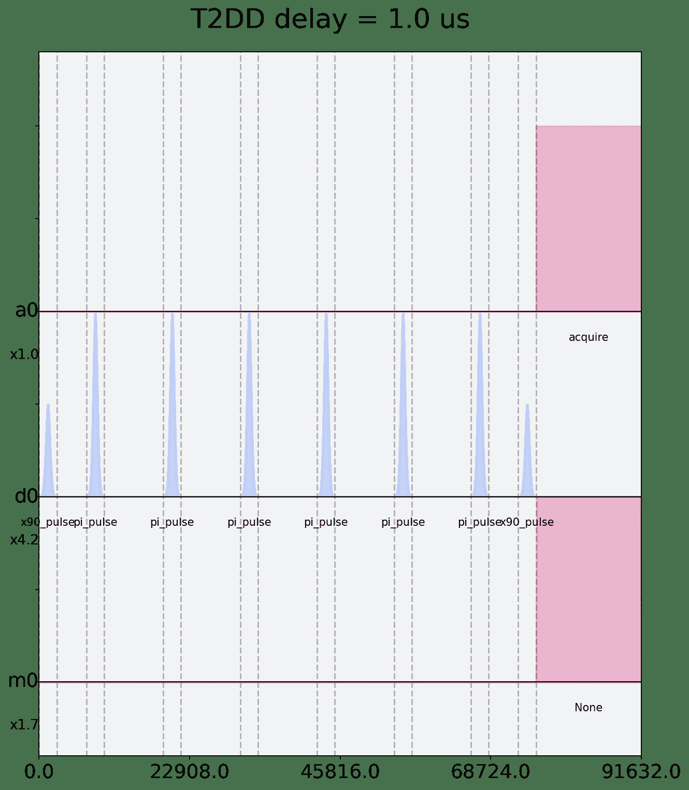

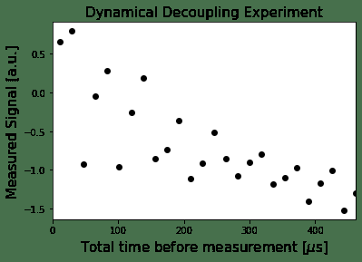

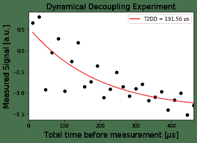

### 5. 参考文献

1.  H. Abraham, I. Y. Akhalwaya, G. Aleksandrowicz, T. Alexander, G.
    Alexandrowics, E. Arbel, A. Asfaw, C. Azaustre, P. Barkoutsos, G.
    Barron, L. Bello, Y. Ben-Haim, L. S. Bishop, S. Bosch, D. Bucher,
    CZ, F. Cabrera, P. Calpin, L. Capelluto, J. Carballo, C.-F. Chen, A.
    Chen, R. Chen, J. M. Chow, C. Claus, A. W. Cross, A. J. Cross, J.
    Cruz- Benito, C. Culver, A. D. C ́orcoles-Gonzales, S. Dague, M.
    Dartiailh, A. R. Davila, D. Ding, E. Dumitrescu, K. Dumon, I.
    Duran, P. Eendebak, D. Egger, M. Everitt, P. M. Fern ́andez, A.
    Frisch, A. Fuhrer, J. Gacon, Gadi, B. G. Gago, J. M. Gambetta, L.
    Garcia, S. Garion, Gawel-Kus, L. Gil, J. Gomez-Mosquera, S. de la
    Puente Gonz ́alez, D. Green-
    berg,J.A.Gunnels,I.Haide,I.Hamamura,V.Havlicek,J.Hellmers,L􏰀.Herok,H.Horii, C.
    Howington, W. Hu, S. Hu, H. Imai, T. Imamichi, R. Iten, T. Itoko, A.
    Javadi-Abhari, Jessica, K. Johns, N. Kanazawa, A. Karazeev, P.
    Kassebaum, V. Krishnan, K. Kr- sulich, G. Kus, R. LaRose, R.
    Lambert, J. Latone, S. Lawrence, P. Liu, P. B. Z. Mac, Y. Maeng, A.
    Malyshev, J. Marecek, M. Marques, D. Mathews, A. Matsuo, D. T. Mc-
    Clure, C. McGarry, D. McKay, S. Meesala, A. Mezzacapo, R. Midha, Z.
    Minev, P. Mu- rali, J. Mu ̈ggenburg, D. Nadlinger, G. Nannicini, P.
    Nation, Y. Naveh, Nick-Singstock, P. Niroula, H. Norlen, L. J.
    O'Riordan, S. Oud, D. Padilha, H. Paik, S. Perriello, A. Phan, M.
    Pistoia, A. Pozas-iKerstjens, V. Prutyanov, J. P ́erez, Quintiii, R.
    Raymond, R. M.-C. Redondo, M. Reuter, D. M. Rodr ́ıguez, M. Ryu, M.
    Sandberg, N. Sathaye, B. Schmitt, C. Schnabel, T. L. Scholten, E.
    Schoute, I. F. Sertage, Y. Shi, A. Silva, Y. Siraichi, S.
    Sivarajah, J. A. Smolin, M. Soeken, D. Steenken, M. Stypulkoski, H.
    Takahashi, C. Taylor, P. Taylour, S. Thomas, M. Tillet, M. Tod, E.
    de la Torre, K. Trabing, M. Treinish, TrishaPe, W. Turner, Y.
    Vaknin, C. R. Valcarce, F. Varchon, D. Vogt- Lee, C. Vuillot, J.
    Weaver, R. Wieczorek, J. A. Wildstrom, R. Wille, E. Winston, J. J.
    Woehr, S. Woerner, R. Woo, C. J. Wood, R. Wood, S. Wood, J.
    Wootton, D. Yeralin, J. Yu, L. Zdanski, Zoufalc, azulehner,
    drholmie, fanizzamarco, kanejess, klinvill, merav aharoni, ordmoj,
    tigerjack, yang.luh, and yotamvakninibm, "Qiskit: An open-source
    framework for quantum computing," 2019.

2.  D. C. McKay, T. Alexander, L. Bello, M. J. Biercuk, L. Bishop, J.
    Chen, J. M. Chow, A. D. C ́orcoles, D. Egger, S. Filipp, J.
    Gomez, M. Hush, A. Javadi-Abhari, D. Moreda, P. Nation, B.
    Paulovicks, E. Winston, C. J. Wood, J. Wootton, and J. M. Gambetta,
    "Qiskit backend specifications for OpenQASM and OpenPulse
    experiments," 2018.

注："Qiskit Pulse"以前称为"OpenPulse"。

6.2 访问更高的能态
------------------

在大部分的量子算法/应用中，计算是在由$|0\rangle$和$|1\rangle$张成的二维空间上进行。然而，在IBM硬件中还存在不常用到的更高能态。本节的重点是使用Qiskit
Pulse探索这些状态。其中演示了如何激发态$|2\rangle$，并构建鉴别器来对态$|0\rangle$、$|1\rangle$和$|2\rangle$进行识别。

建议您先阅读上一章，然后再阅读本节。还建议您阅读Qiskit Pulse说明\[1\]。

### 物理背景

现在，我们提供有关transmon量子比特（transmission line shunted plasma
oscillation
qubit）物理学的背景知识，其为大量IBM量子硬件的基础。这些系统包含由约瑟夫森结（Josephson
Junction，JJ）和电容器组成的超导电路。对于那些不熟悉超导电路的人，请参见\[2\]的评论。该系统的哈密顿量为：

$$H = 4E_{C}n^{2} - E_{J}\cos(\phi)$$

其中$E_{C}$和$E_{J}$表示电容器和约瑟夫森能量，$n$是算子的缩减电荷数，$\phi$是通过约瑟夫森结所减少的通量。我们以$\hslash = 1$为单位。

Transmon量子比特在小$\phi$的状态下定义，因此我们可以在泰勒级数中扩展$E_{J}\cos(\phi)$（忽略常数项）

$$E_{J}\cos(\phi) \approx \frac{1}{2}E_{J}\phi^{2} - \frac{1}{24}E_{J}\phi^{4}\mathcal{+ O(}\phi^{6})$$

二次项$\phi^{2}$定义了标准谐波振荡器。每增加一项就会导致失谐。

使用关系式$n \sim (a - a^{\dagger}),\phi \sim (a + a^{\dagger})$（for
raising, lowering operators
$a^{\dagger},a$），可以证明该系统类似于具有哈密顿量的Duffing振荡器。

$$H = \omega a^{\dagger}a + \frac{\alpha}{2}a^{\dagger}a^{\dagger}\text{aa}$$

其中$\omega$给出了$0 \rightarrow 1$激励频率（$\omega \equiv \omega 0 \rightarrow 1$），$\alpha$是$0 \rightarrow 1$和$1 \rightarrow 2$频率（$\alpha \equiv \omega 1 \rightarrow 2 - - \omega 0 \rightarrow 1$）之间的非谐性。可以根据需要添加驱动项。

如果选择指定的标准二维子空间，则可使$|\alpha|$足够大或使用特殊的控制技术来抑制更高的能态。

### 内容

1.  开始

2.  区分态0和态1

    1.  态0-\>态1 频率扫描

    2.  态0-\>态1 Rabi实验

    3.  构建区分0、1的鉴频器

3.  区分态0、态1和态2

> 2.1 计算使得$1 \rightarrow 2$的频率
>
> 2.1.1 使用边带法对$1 \rightarrow 2$过程进行频率扫描
>
> 2.2 态1-\>态2 Rabi实验
>
> 2.3 构建区分0、1及2的鉴频器

3\. 参考文献

### 开始

我们由导入相关的库以及定义一下默认变量值开始。此处选择量子比特0并在公用单量子比特设备ibmq_armonk上进行实验。

下面的代码定了一些辅助函数：

设置一些驱动脉冲和测量的默认参数。使用指令调度映射（后端默认值）中的measure命令，以便使用新校准对其进行更新。

### 区分态0和态1

在本节中，我们将会构建一个区分标准态$|0\rangle$和$|1\rangle$的鉴频器。该鉴频器的任务是接受meas_level=1时的复数数据并将其分类为meas_level=2的标准态$|0\rangle$和$|1\rangle$，此处会利用到上一章中的内容。所产生的结果在激发更高的能态时必会被使用到，而更高的能态是本notebook的重点。

#### 1.1 态0-\>态1 频率扫描

正如上一章中所述，校准量子比特频率的第一步是构建鉴频器。

将数据数据拟合至一条洛伦兹曲线并提取校准频率。

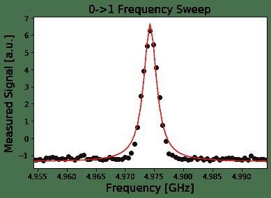

#### 1.2 态0-\>态1 Rabi实验

然后，运行Rabi实验计算$0 \rightarrow 1$时的$\pi$脉冲的幅值。一个$\pi$脉冲是将态$|0\rangle$转换为态$|1\rangle$的脉冲（在布洛赫球中的一个$\pi$旋转）。

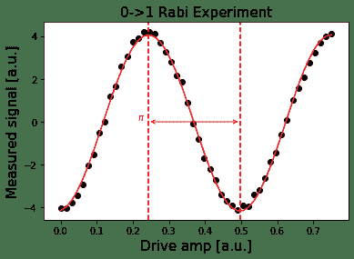

使用上述结果就可以定义$0 \rightarrow 1$的$\pi$脉冲了。

#### 1.3 构建区分0、1的鉴频器

经过上述的准备工作，我们已经获得了校准的频率以及$\pi$脉冲，接着就是构建区分态$|0\rangle$和态$|1\rangle$的鉴频器了。该鉴频器接受在IQ平面中meas_level=1时的数据并将其分类为态$|0\rangle$和态$|1\rangle$。

态$|0\rangle$和态$|1\rangle$在IQ平面中所形成的相干圆形"斑点"称为质心（centroid）。质心的中心定义了每个状态的精确且无噪声的IQ点。围绕在周围的云给出了数据的方差，该方差是由各种噪声源所生成。

我们将会应用一种机器学习的技术------线性判别分析（Linear Discriminant
Analysis，LDA）来区分态$|0\rangle$和态$|1\rangle$。

首先需要获取质心的数据，为此我们定了两个调度（回想一下从态$|0\rangle$开始的系统）：

1\. 直接测量态$|0\rangle$，获取态$|0\rangle$的质心。

2\. 施加一个$\pi$脉冲后测量并获取态$|1\rangle$的质心。

所显示的IQ图中蓝色质心为态$|0\rangle$，红色质心为态$|1\rangle$。

**注：如果绘图不正确，请重新运行该notebook。**

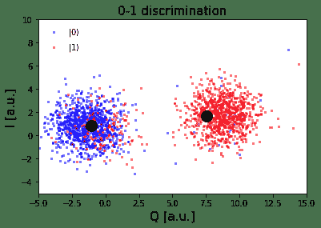

至此，我们就可以精确的构建鉴频器了。正如上文中所述，我们将会用到一种名为"线性判别分析（LDA）"的机器学习技术。通过最大化每个类别的均值之间的距离并最小化每个类别内的方差，LDA可将任意数据集划分为一组类别，此处为态$|0\rangle$和$|1\rangle$。详细信息请参阅\[3\]。

LDA会生成称为分界线的一条线。依据给定数据点在分界线的哪一侧，我们可以确定其属于哪个类别。在本示例中，分隔线的一侧对应于态$|0\rangle$，另一侧对应于态$|1\rangle$。

我们将会使用所得的一半数据来训练模型，然后用另一半进行测试。此处使用scikit.learn来实现LDA；在以后的Qiskit版本中此功能将直接添加到模块[Qiskit-Ignis](https://github.com/Qiskit/qiskit-ignis/tree/master/qiskit/ignis/measurement/discriminator)。

首先，将结果数据重塑为适合区分的格式。

然后，将重塑后的数据分为训练集和测试集。为了得到预期的效果，此处使用态向量进行测试，数组中的0为基态调度，1为激发调度。

最后，建立模型并进行训练。下面的代码用于打印出拟合精度。

最后一步是画出分界线。

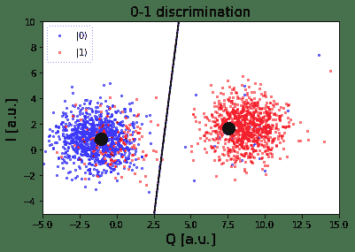

可以看到分隔线的每一侧对应于某一状态的质心。给定IQ平面中的一个点，该模型将检查其位于分隔线的哪一侧并返回相应的状态。

### 区分态0、态1和态2

经过上述的步骤，我们已经校准了$0/1$鉴频器，接着就需要激发更高的能态了。具体为：激发态$|2\rangle$并依据态$|0\rangle$、$|1\rangle$和$|2\rangle$所对应的IQ数据构建鉴频器。对于更高的能态如$|3\rangle$等这一过程同样适用，本文中就不再累述。

构建更高能态鉴频器的过程如下：

1.  计算$1 \rightarrow 2$的频率

2.  实施Rabi实验来获取$1 \rightarrow 2$的$\pi$脉冲幅值。为了实现这一步骤，首先需要施加一个$0 \rightarrow 1$的$\pi$脉冲，使得态$|0\rangle$转换为态$|1\rangle$。然后，通过频率扫描获取使得$1 \rightarrow 2$频率的驱动幅

3.  实施3个调度：

    a.  0调度（Zero schedule）：仅测量基态。

    b.  1调度（One
        > schedule）：施加一个$\pi$脉冲使得$0 \rightarrow 1$并测量。

    c.  2调度（Two
        > schedule）：施加一个$\pi$脉冲使得$0 \rightarrow 1$后施加另一个$\pi$脉冲使得$1 \rightarrow 2$，然后测量。

4.  将每个调度的数据划分为训练集和测试集，然后为鉴频器创建一个LDA模型。

#### 2.1 计算使得$\mathbf{1 \rightarrow 2}$的频率

校准的第一步是计算从$1 \rightarrow 2$所需的频率。有两种方法可以做到这一点：

1.  施加很高的功率从基态进行频率扫描。如果施加的功率足够大，则应观察到两个峰值。其中的一个是在第1节中使得$0 \rightarrow 1$的频率，另一个是使得$0 \rightarrow 2$的频率。取两者之差即可得到使得$1 \rightarrow 2$的频率。但由于ibmq_armonk的最大驱动功率为$1.0$，不足以看到这一变换。因此，我们使用第二种方法。

2.  通过施加一个使得$0 \rightarrow 1$的$\pi$脉冲来激发态$|1\rangle$。然后在已激发的态$|1\rangle$熵进行频率扫描。应能在低于使得$0 \rightarrow 1$的频率下观察到使得$1 \rightarrow 2$频率的一个峰值。

##### 2.1.1 使用边带法对$\mathbf{1 \rightarrow 2}$过程进行频率扫描

接下来，我们将要使用上述的第二种方法。为了驱动使得$0 \rightarrow 1$的$\pi$脉冲，需要本地振荡器(Local
Oscillator
，LO)的频率由校准$0 \rightarrow 1$频率的cal_qubit_freq给出（可在第一节中看到Rabi
$\pi$脉冲的构建过程）。若要扫描$1 \rightarrow 2$频率范围就需要改变LO频率。但是，脉冲规范要求每一调度只有一个LO频率。

为了解决这个问题，我们将LO频率设置为cal_qubit_freq，并将正弦函数乘以freq-cal_qubit_freq的$1 \rightarrow 2$脉冲，其中freq是所需的扫描频率。众所周知，施加正弦边带使我们能够更改LO频率，而无需在封装程序时手动设置。

把上述逻辑过程封装在一个方法中，然后运行该程序。

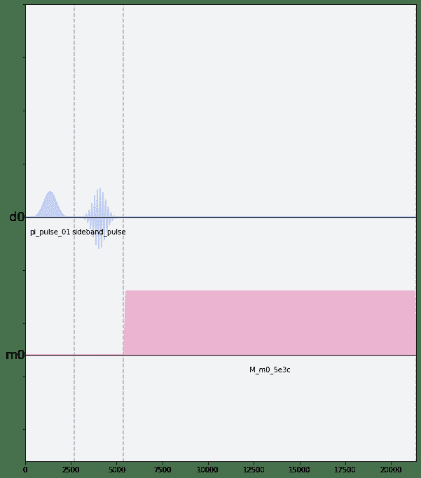

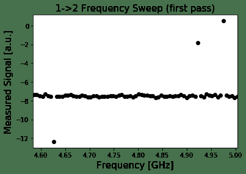

可以看到最小值在4.64GHz附近。有一些虚假最大值，但因其过大，无法达到使得$1 \rightarrow 2$的频率。最小值对应于$1 \rightarrow 2$频率。

通过相对极小（relative
minima）函数可以精确计算该点的值。这样就可以估算出$1 \rightarrow 2$的频率。

现在，我们使用上面获得的估计值（较小的范围）进行精确扫描。这将让我们获得使得$1 \rightarrow 2$更准确的频率值。在每个方向上以20MHz扫描。

使用标准洛伦兹曲线拟合精确信号。

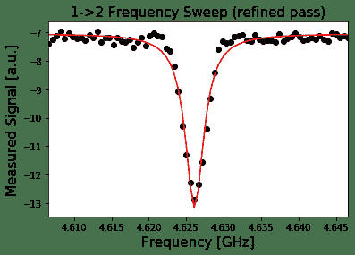

#### 2.2 态1-\>态2 Rabi实验

经过上述的步骤，我们对使得$1 \rightarrow 2$的频率有了一个很好的估计，现在实施Rabi实验来获得使得$1 \rightarrow 2$的$\pi$脉冲幅值。为此，需要施加一个使得$0 \rightarrow 1$的$\pi$脉冲，然后运用边带方法以使得$1 \rightarrow 2$的频率扫描驱动幅值。

绘制并拟合数据。

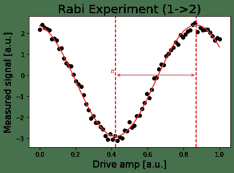{width="4.055555555555555in" height="3.0in"}

通过此信息，我们可以定义使得$1 \rightarrow 2$的$\pi$脉冲（确保在使得$1 \rightarrow 2$的频率上添加边带）。

#### 2.3 构建区态0、1及2的鉴频器

最后，为区分$|0\rangle$、$|1\rangle$和$|2\rangle$构建鉴频器。该过程与第1节中所述项类似，但此处我们为$|2\rangle$添加了一个附加调度。

回顾一下三个调度（从$|0\rangle$开始）：

1\. 通过直接测量$|0\rangle$获取$|0\rangle$的质心。

2\.
施加一个使得$0 \rightarrow 1$的$\pi$脉冲，然后通过测量来获取$|1\rangle$的质心。

3\.
施加一个使得$0 \rightarrow 1$的$\pi$脉冲后再施加一个使得$1 \rightarrow 2$的$\pi$脉冲，然后通过测量来获取$|2\rangle$的质心。

构建程序并在IQ平面上绘制质心。

现在我们可以观察到对应于$|2\rangle$的第三个质心了。（注：如果绘图不正确，请重新运行notbook）

有了这些数据，我们就可以建立鉴频器了。与上文中所述的步骤一样，此处还是使用scikit.learn以及线性判别分析（LDA）。

首先对需要LDA的数据重塑。

然后，分割训练和测试数据（一半对一半）。测试数据是一个包含0（0调度），1（1调度）和2（2调度））的数组。

最后，建立模型、训练并打印出拟合精度。

最后一步是绘制分隔线。

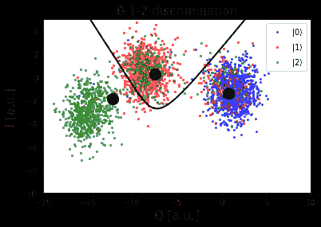

因为有了3个质心，所以分隔线不是一条线，而是一条包含两线组合的曲线。为了区分$|0\rangle$、$|1\rangle$和$|2\rangle$，模型会检查指定IQ点相对于分隔线的位置，并相应地对该点进行分类。

### 3. 参考文献

1.  D. C. McKay, T. Alexander, L. Bello, M. J. Biercuk, L. Bishop, J.
    Chen, J. M. Chow, A. D. C ́orcoles, D. Egger, S. Filipp, J.
    Gomez, M. Hush, A. Javadi-Abhari, D. Moreda, P. Nation, B.
    Paulovicks, E. Winston, C. J. Wood, J. Wootton, and J. M. Gambetta,
    "Qiskit backend specifications for OpenQASM and OpenPulse
    experiments," 2018, <https://arxiv.org/abs/1809.03452>.

2.  Krantz, P. et al. "A Quantum Engineer's Guide to Superconducting
    Qubits." Applied Physics Reviews 6.2 (2019): 021318,
    <https://arxiv.org/abs/1904.06560>.

3.  Scikit-learn: Machine Learning in Python, Pedregosa et al., JMLR 12,
    pp. 2825-2830, 2011,
    <https://scikit-learn.org/stable/modules/lda_qda.html#id4>.

6.3 Transmon物理理论简介
------------------------

### 内容

1\. 将多能级量子系统作为量子比特

2\. 量子回路的哈密顿量

3\. 量化哈密顿量

4\. 量化Transmon

5\. Transmon与量子谐振子的比较

6\. 量子比特驱动与旋转波近似

### 1. 将多能级量子系统作为量子比特

研究量子比特本质上是学习双能级系统物理。双能级系统的典型示例就是电子的自旋（或其他"自旋-1/2"的粒子）：其可指向上或指向下，我们将其分别标记为态$|0\rangle$和态$|1\rangle$。态$|0\rangle$在历史上被定义为布洛赫球的北极（north
pole），其原因为：当磁场施加在$+ \overset{\hat{}}{z}$方向上时，该处处于低能态。

另一种类似的双能级系统被发现于第一种超导量子比特------电子库珀对箱（[Cooper
Pair
Box](https://arxiv.org/pdf/cond-mat/9904003v1.pdf)）中。超导体中没有电阻的原因是电子以库珀对的形式结合在一起，其可通过吸收能量而分离并且这种能量在低温下无法变为热能，因此电子之间能够有效地相互吸引。这一情况有些违背直觉，因为电子都带负电，因而之间应该互相排斥！然而，在许多物质系统中有效的相互作用可以通过群体效应（collective
effect）来调节：人们可以将电子视为被正电荷晶格中的其他电子所吸引。电子库珀对箱由一个超导岛组成，该岛占据一个额外的库珀对电荷$2e$（态$|0\rangle$）或不占据（态$|1\rangle$）。这些状态可以通过隧道结上的电压进行控制，并且在"栅极"电压控制下呈现周期性，因此电子库珀对箱确为双能级系统。

在将量子比特编码为电荷状态时对所存在的电荷噪声（*charge
noise*）非常敏感，其也对电子库珀对箱成立，这就是为什么不受研究人员青睐的原因。大多其他量子系统并非双能级系统，比如每个原子都具有独特的谱线（能量跃迁），天文学家将其用于确定我们所处宇宙的构成。通过有效地隔离和控制其中的两个能级，例如原子的基态和第一激发态，就可将其视为一个量子比特。但如使用其他类型的超导电路作为量子比特是何情况呢？解决方案是设计一个具有高阶能级的量子比特对冲电子库珀对箱的电荷遭受问题，这一具有高阶能级的量子比特称为：[transmon](https://arxiv.org/pdf/cond-mat/0703002.pdf)（全称：*transmission-line
shunted plasma oscillation*
qubit）。通过牺牲非谐性（$|0\rangle \rightarrow |1\rangle$与$|1\rangle \rightarrow |2\rangle$转换频率的差异，见"6.2
访问更高的能态"），电荷噪声得到抑制，同时仍允许将最低的两个能级当作一个量子比特。在此处量子态被编码为跨两个超导岛之间隧道结的库珀对振荡，其中用于激发态$|1\rangle$的振荡频率比基态$|0\rangle$的高。

### 2. 量子回路的哈密顿量

哈密顿量是一个等于系统总能量、势能和动能的函数。这一观点在经典力学中正确，量子哈密顿量被发现于通过将变量提升为算子时。通过对比经典泊松括号（Poisson
Backet）与量子对易式（quantum
commutator），发现其不能对易，因此无法同时对其进行观察，这一点与海森堡不确定性原理相同。

首先，假设一个线性$\text{LC}$电路，其中$L$是电感，$C$是电容。哈密顿量是动能（由电荷$Q$表示）和势能（由（电）通量$\Phi$表示）之和：

$$\mathcal{H =}\frac{Q^{2}}{2C} + \frac{\Phi^{2}}{2L}$$

### 3. 量化哈密顿量

量子谐振子（QHO：quantum harmonic
oscillator）在量化$\text{LC}$电路哈密顿量时得出。将共轭变量提升为算子：$Q \rightarrow \widehat{Q}$、$\Phi \rightarrow \widehat{\Phi}$，因此量化的哈密顿量为：

$$\widehat{H} = \frac{{\widehat{Q}}^{2}}{2C} + \frac{{\widehat{\Phi}}^{2}}{2L}$$

其中$H$上等的"帽子"提示我们这些是量子力学算子。然后通过对应关系奖励经典力学的泊松括号和量子力学对易式之间的关联：

$$\{ A,B\} = \frac{\text{δA}}{\delta\Phi}\frac{\text{δB}}{\text{δQ}} - \frac{\text{δB}}{\delta\Phi}\frac{\text{δA}}{\text{δQ}} \Longleftrightarrow \frac{1}{\text{iℏ}}\lbrack\overset{\hat{}}{A},\overset{\hat{}}{B}\rbrack = \frac{1}{\text{iℏ}}(\overset{\hat{}}{A}\overset{\hat{}}{B} - \overset{\hat{}}{B}\overset{\hat{}}{A}),$$

其中$\delta$为函数导数，而对易式则反映出操作顺序在量子力学中的重要性。插入变量/算子，得到：

$$\{\Phi,Q\} = \frac{\delta\Phi}{\delta\Phi}\frac{\text{δQ}}{\text{δQ}} - \frac{\text{δQ}}{\delta\Phi}\frac{\delta\Phi}{\text{δQ}} = 1 - 0 = 1 \Longrightarrow \lbrack\overset{\hat{}}{\Phi},\overset{\hat{}}{Q}\rbrack = i\hslash$$

上式表明：与位置和动量一样，电荷和通量也遵守海森堡不确定性原理，以及$\lbrack\overset{\hat{}}{x},\overset{\hat{}}{p}\rbrack = i\hslash$。表明其不可被同时观测，实际上是以相同方式定义的具有相同属性的共轭变量。该结果已被用于超导量子比特，用以设计方案并分类超导量子比特的类型。

上面的哈密顿量通常使用简化的电荷$\overset{\hat{}}{n} = \overset{\hat{}}{Q}/2e$和相位$\overset{\hat{}}{\phi} = 2\pi\overset{\hat{}}{\Phi}/\Phi_{0}$符号，以更友好的形式编写，其中$\Phi_{0} = h/2e$是通量，分别对应于算子中库珀对的数量和跨约瑟夫森结的相位。然后，量化的哈密顿量变为：

$${\overset{\hat{}}{H}}_{\text{QHO}} = 4E_{c}{\overset{\hat{}}{n}}^{2} + \frac{1}{2}E_{L}{\overset{\hat{}}{\phi}}^{2}$$

其中$E_{c} = e^{2}/2C$为电荷能量（式中的$4$对应于正在处理的库珀对而非单个电子），$E_{L} = (\Phi_{0}/2\pi)^{2}/L$为电感能量。

### 4. 量化Transmon

进行与QHO相同的变量替代，我们可以以熟悉的形式重写transmon的哈密顿量。

$${\overset{\hat{}}{H}}_{\text{tr}} = 4E_{c}{\overset{\hat{}}{n}}^{2} - E_{J}\cos\overset{\hat{}}{\phi}$$

其中约瑟夫森能量$E_{J} = I_{0}\Phi_{0}/2\pi$替代了QHO的电感能量。可以看出：由于约瑟夫森结代替了线性电感，因此该相的函数形式与QHO有所不同。通常$\overset{\hat{}}{n} \rightarrow \overset{\hat{}}{n} - n_{g}$反映栅极偏置电荷，但在transmon中并不重要。至此，我们可以使用类似于QHO的量化方法，其中一句电荷和相位的零点波动来定义产生算符和湮没算符：

$$\overset{\hat{}}{n} = in_{z\text{pf}}(\overset{\hat{}}{c} + {\overset{\hat{}}{c}}^{\dagger})\text{\ \ }与\text{\ \ }\overset{\hat{}}{\phi} = \phi_{z\text{pf}}(\overset{\hat{}}{c} - {\overset{\hat{}}{c}}^{\dagger})$$

其中$n_{\text{zpf}} = {(\frac{E_{J}}{32E_{c}})}^{1/4}$，$\phi_{\text{zpf}} = {(\frac{2E_{c}}{E_{J}})}^{1/4}$，约瑟夫森能量$E_{J}$取代了QHO的线性电感能量$E_{L}$。此处我们使用了$\overset{\hat{}}{c} = \sum_{j}^{}{\sqrt{j + 1}|j\rangle\langle j + 1|}$表示transmon湮没算符，并将其与等间隔能量模式$\widehat{a}$区分。现在，我们注意到$\phi \ll 1$的原因是在transmon中$E_{J}/E_{c} \gg 1$，我们可以将$\cos\widehat{\phi}$的泰勒展开式近似为哈密顿量：

$$H = 4E_{c}n_{\text{zpf}}^{2}(\overset{\hat{}}{c} + {\overset{\hat{}}{c}}^{\dagger})^{2} - E_{J}(1 - \frac{1}{2}E_{J}\phi_{\text{zpf}}^{2}(\overset{\hat{}}{c} - {\overset{\hat{}}{c}}^{\dagger})^{2} + \frac{1}{24}E_{J}\phi_{\text{zpf}}^{4}(\overset{\hat{}}{c} - {\overset{\hat{}}{c}}^{\dagger})^{4} + \ldots) \approx \sqrt{8E_{c}E_{J}}({\overset{\hat{}}{c}}^{\dagger}\overset{\hat{}}{c} + \frac{1}{2}) - E_{J} - \frac{E_{c}}{12}({\overset{\hat{}}{c}}^{\dagger} + \overset{\hat{}}{c})^{4}$$

其中我们观察到$4E_{c}n_{\text{zpf}}^{2} = (1/2)E_{J}\phi_{\text{zpf}}^{2} = \sqrt{2E_{c}E_{J}}$非常有用。扩展transmon运算符$\widehat{c}$的项并删除快速旋转项（即：数量不等的$\widehat{c}$与${\widehat{c}}^{\dagger}$），忽略不影响transmon动态的常数，设定$\omega_{0} = \sqrt{8E_{c}E_{J}}$并将$\delta = - E_{c}$定义为transmon非谐性，得出：

$${\overset{\hat{}}{H}}_{\text{tr}} = \omega_{0}{\overset{\hat{}}{c}}^{\dagger}\overset{\hat{}}{c} + \frac{\delta}{2}(({\overset{\hat{}}{c}}^{\dagger}\overset{\hat{}}{c})^{2} + {\overset{\hat{}}{c}}^{\dagger}\overset{\hat{}}{c}) = (\omega_{0} + \frac{\delta}{2}){\overset{\hat{}}{c}}^{\dagger}\overset{\hat{}}{c} + \frac{\delta}{2}({\overset{\hat{}}{c}}^{\dagger}\overset{\hat{}}{c})^{2}$$

上式就是杜芬振子（Duffing
oscillator）的哈密顿量。通过定义$\omega \equiv \omega_{0} + \delta$，我们可以看到因$\omega_{j + 1} - \omega_{j} = \omega + \delta j$
transmon能级间所存在的能量间隔因非谐性而不同，因此$\omega$对应于transmon量子比特的"频率"（$\omega_{1} - \omega_{0}$）。从transmon运算符的定义${\widehat{c}}^{\dagger}\widehat{c} = \sum_{j}^{}{j|j\rangle\langle j|}$得出：

$${\overset{\hat{}}{H}}_{\text{tr}} = \omega{\overset{\hat{}}{c}}^{\dagger}\overset{\hat{}}{c} + \frac{\delta}{2}{\overset{\hat{}}{c}}^{\dagger}\overset{\hat{}}{c}({\overset{\hat{}}{c}}^{\dagger}\overset{\hat{}}{c} - 1) = \sum_{j}^{}{((\omega - \frac{\delta}{2})j + \frac{\delta}{2}j^{2})|j\rangle\langle j|} \equiv \sum_{j}^{}{\omega_{j}|j\rangle\langle j|}$$

因此，

$$\omega_{j} = (\omega - \frac{\delta}{2})j + \frac{\delta}{2}j^{2}$$

就是transmon的能级。

### 5. Transmon与量子谐振子的比较

QHO具有等间隔能级而transmon没有，这就我们可以将transmon当作量子比特的原因。此处，我们通过使用[QuTiP](http://www.qutip.org/)（使用pip安装）依据其哈密顿量计算出能级的差异。

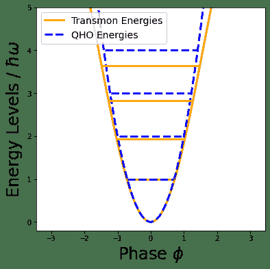

### 6. 量子比特驱动与旋转波近似（Rotating Wave Approximation，RWA）

施加一个电驱动场$\overset{\rightarrow}{E}(t) = {\overset{\rightarrow}{E}}_{0}e^{- i\omega_{d}t} + {\overset{\rightarrow}{E}}_{0}^{*}e^{i\omega_{d}t}$至transmon，在transmon和微波场之间引入了一个偶极子相互作用（dipole
interaction）。我们在此处将transmon直接是为一个量子比特，因此transmon的哈密顿量是量子比特哈密顿量${\widehat{H}}_{0}$与驱动哈密顿量${\widehat{H}}_{d}$的和：

$$\overset{\hat{}}{H} = {\overset{\hat{}}{H}}_{0} + {\overset{\hat{}}{H}}_{d}\text{\ \ }以及\text{\ \ }{\overset{\hat{}}{H}}_{0} = - \frac{1}{2}\hslash\omega_{q}\sigma^{z}$$

其中$\sigma^{z}$是Pauli$- Z$矩阵。我们就可以使用Pauli上升算符/下降算符$\sigma^{\pm} = (1/2)(\sigma^{x} \mp i\sigma^{y})$，这两个算符有使得$\sigma^{+}|0\rangle = |1\rangle$以及$\sigma^{+}|1\rangle = |0\rangle$的效果。此处应当注意，该定义反映出我们所使用的是量子比特上升算符/下降算符，而非旋转运算符。因在第1节中已讨论的原因，$|0\rangle \equiv | \uparrow \rangle$和$|1\rangle \equiv | \downarrow \rangle$使得上升算符/下降算符反转。现因场能激发和制激量子比特，定义偶极算符$\overset{\rightarrow}{d} = {\overset{\rightarrow}{d}}_{0}\sigma^{+} + {\overset{\rightarrow}{d}}_{0}^{*}\sigma^{-}$。偶极子相互作用的驱动哈密顿量为：

$${\overset{\hat{}}{H}}_{d} = - \overset{\rightarrow}{d} \cdot \overset{\rightarrow}{E}(t) = - ({\overset{\rightarrow}{d}}_{0}\sigma^{+} + {\overset{\rightarrow}{d}}_{0}^{*}\sigma^{-}) \cdot ({\overset{\rightarrow}{E}}_{0}e^{- i\omega_{d}t} + {\overset{\rightarrow}{E}}_{0}^{*}e^{i\omega_{d}t}) = - ({\overset{\rightarrow}{d}}_{0} \cdot {\overset{\rightarrow}{E}}_{0}e^{- i\omega_{d}t} + {\overset{\rightarrow}{d}}_{0} \cdot {\overset{\rightarrow}{E}}_{0}^{*}e^{i\omega_{d}t})\sigma^{+} - ({\overset{\rightarrow}{d}}_{0}^{*} \cdot {\overset{\rightarrow}{E}}_{0}e^{- i\omega_{d}t} + {\overset{\rightarrow}{d}}_{0}^{*} \cdot {\overset{\rightarrow}{E}}_{0}^{*}e^{i\omega_{d}t})\sigma^{-} \equiv - \hslash(\Omega e^{- i\omega_{d}t} + \overset{\sim}{\Omega}e^{i\omega_{d}t})\sigma^{+} - \hslash({\overset{\sim}{\Omega}}^{*}e^{- i\omega_{d}t} + \Omega^{*}e^{i\omega_{d}t})\sigma^{-}$$

为描述场和偶极子的强度，上式中进行了$\Omega = {\overset{\rightarrow}{d}}_{0} \cdot {\overset{\rightarrow}{E}}_{0}$与$\overset{\sim}{\Omega} = {\overset{\rightarrow}{d}}_{0} \cdot {\overset{\rightarrow}{E}}_{0}^{*}$的替换。现在，使用下式变换相互绘景（狄拉克绘景Dirac
picture）${\overset{\hat{}}{H}}_{d,I} = U{\overset{\hat{}}{H}}_{d}U^{\dagger}$（其中省略的退出项）：

$$U = e^{i{\overset{\hat{}}{H}}_{0}t/\hslash} = e^{- i\omega_{q}t\sigma^{z}/2} = I\cos(\omega_{q}t/2) - i\sigma^{z}\sin(\omega_{q}t/2)$$

计算算符项：

$$\left( \text{Icos}\left( \frac{\omega_{q}t}{2} \right) - i\sigma^{z}\sin\left( \frac{\omega_{q}t}{2} \right) \right)\sigma^{+}\left( \text{Icos}\left( \frac{\omega_{q}t}{2} \right) + i\sigma^{z}\sin\left( \frac{\omega_{q}t}{2} \right) \right) = e^{i\omega_{q}t}\sigma^{+}$$

$$\left( \text{Icos}\left( \frac{\omega_{q}t}{2} \right) - i\sigma^{z}\sin\left( \frac{\omega_{q}t}{2} \right) \right)\sigma^{-}\left( \text{Icos}\left( \frac{\omega_{q}t}{2} \right) + i\sigma^{z}\sin\left( \frac{\omega_{q}t}{2} \right) \right) = e^{- i\omega_{q}t}\sigma^{-}$$

变换后的哈密顿量为：

$${\overset{\hat{}}{H}}_{d,I} = U{\overset{\hat{}}{H}}_{d}U^{\dagger} = - \hslash(\Omega e^{- i\omega_{d}t} + \overset{\sim}{\Omega}e^{i\omega_{d}t})e^{i\omega_{q}t}\sigma^{+} - \hslash({\overset{\sim}{\Omega}}^{*}e^{- i\omega_{d}t} + \Omega^{*}e^{i\omega_{d}t})e^{- i\omega_{q}t}\sigma^{-} = - \hslash(\Omega e^{- i\Delta_{q}t} + \overset{\sim}{\Omega}e^{i(\omega_{q} + \omega_{d})t})\sigma^{+} - \hslash({\overset{\sim}{\Omega}}^{*}e^{- i(\omega_{q} + \omega_{d})t} + \Omega^{*}e^{i\Delta_{q}t})\sigma^{-}$$

现在进行旋转波近似：由于$\omega_{q} + \omega_{d}$远大于$\Delta_{q} = \omega_{q} - \omega_{d}$，带有指数和的项快速振荡，有效地平衡了其贡献，因此我们从可以从哈密顿量中删除这些项。至此RWA交互哈密顿量变为：

$${\overset{\hat{}}{H}}_{d,I}^{(\text{RWA})} = - \hslash\Omega e^{- i\Delta_{q}t}\sigma^{+} - \hslash\Omega^{*}e^{i\Delta_{q}t}\sigma^{-}$$

回到薛定谔绘景（Schrödinger picture）：

$${\overset{\hat{}}{H}}_{d}^{(\text{RWA})} = U^{\dagger}{\overset{\hat{}}{H}}_{d,I}^{(\text{RWA})}U = - \hslash\Omega e^{- i\omega_{d}t}\sigma^{+} - \hslash\Omega^{*}e^{i\omega_{d}t}\sigma^{-}$$

因此所有量子比特和驱动的哈密顿量为：

$${\overset{\hat{}}{H}}^{(\text{RWA})} = - \frac{1}{2}\hslash\omega_{q}\sigma^{z} - \hslash\Omega e^{- i\omega_{d}t}\sigma^{+} - \hslash\Omega^{*}e^{i\omega_{d}t}\sigma^{-}.$$

进入驱动帧，使用$U_{d} = \exp\{ - i\omega_{d}t\sigma^{z}/2\}$变换，哈密顿量变为：

$${\overset{\hat{}}{H}}_{\text{eff}} = U_{d}{\overset{\hat{}}{H}}^{(\text{RWA})}U_{d}^{\dagger} - i\hslash U_{d}{\overset{˙}{U}}_{d}^{\dagger}$$

其中${\overset{˙}{U}}_{d} = dU_{d}/dt$是$U_{d}$的时间导数。在RWA下的驱动器帧中：

$${\overset{\hat{}}{H}}_{\text{eff}} = - \frac{1}{2}\hslash\omega_{q}\sigma^{z} - \hslash\Omega\sigma^{+} - \hslash\Omega^{*}\sigma^{-} + \frac{1}{2}\hslash\omega_{d}\sigma^{z} = - \frac{1}{2}\hslash\Delta_{q}\sigma^{z} - \hslash\Omega\sigma^{+} - \hslash\Omega^{*}\sigma^{-}$$

假设驱动真实，因此$\Omega = \Omega^{*}$，则上式可简化为：

$${\overset{\hat{}}{H}}_{\text{eff}} = - \frac{1}{2}\hslash\Delta_{q}\sigma^{z} - \hslash\Omega\sigma^{x}.$$

表明：当驱动与量子比特谐振时（即$\Delta_{q} = 0$），驱动会在Bloch球中引起$x$旋转，该旋转由$\sigma^{x}$产生，其强度为$\Omega$。我么可以在"通过Qiskit脉冲校准量子比特"一节看到这一谐振量子比特与驱动的效果。失谐驱动具有自$\sigma^{z}$产生的其他$z$旋转，这些旋转在Ramsey实验中表现为振荡。

6.4 量子回路的量子电动力学
--------------------------

### 内容

1\. 简介

2\. Schrieffer-Wolff变换

3\. Jaynes-Cummings哈密顿量的块对角化

4\. 全Transmon

5\. 具有cQED的Qubit驱动

6\. 交叉谐振纠缠量子门

### 1. 简介

通过类比腔量子电动力学（Cavity Quantum
Electrodynamics，CQED），回路电动力学（circuit
QED，cQED）运用了使用简单模型来描述原子与光学腔以及量子比特与微波谐振器相互作用的原理。该模型包括空腔/谐振器中的光子数量

、原子/量子比特的状态以及原子/量子比特与空腔/谐振器之间的电偶极子相互作用。正如在上一节中所述，transmon实际上是多能级系统，但是由于transmon的非谐性，可能将其自身限制在基态$|0\rangle = |g\rangle$和第一激发态的$|1\rangle = |e\rangle$。因此，我们可以将transmon描述为Pauli自旋矩阵$\sigma^{x} = (\begin{matrix}
0 & 1 \\
1 & 0 \\
\end{matrix})\text{\ \ σ}^{y} = (\begin{matrix}
0 & - i \\
i & 0 \\
\end{matrix})\text{\ \ σ}^{z} = (\begin{matrix}
1 & 0 \\
0 & - 1 \\
\end{matrix})$所描述的一个量子比特依据围绕Bloch球各个轴的旋转。在这一情况下，描述这种交互作用最简单的模型是旋转波逼近中的Jaynes-Cummings哈密顿量：

$$H_{\text{JC}}^{(\text{RWA})}/\hslash = \omega_{r}a^{\dagger}a + \frac{1}{2}\omega_{q}\sigma_{z} + g(a^{\dagger}\sigma^{-} + a\sigma^{+}).$$

其中$\omega_{r}$和$\omega_{q}$分别为谐振器（resonator）和"量子比特（qubit）"的频率，$a(a^{\dagger})$是谐振器光子湮灭（产生）算符，$g$是电偶极耦合（半真空Rabi分裂）。请注意此处省略了算符的帽子"hat"。第一项对应于谐振器中的光子数，第二项对应于量子比特的状态，第三项是电偶极子相互作用，其中$\sigma^{\pm} = (1/2)(\sigma^{x} \mp i\sigma^{y})$为量子比特上升算符/下降算符。（如上一章所述，所使用的符号与旋转上上升算符/下降算符的符号相反。）

这一哈密顿量可以精确求解，解为量子比特/谐振器的混合状态，当处于共振状态（$\omega_{r} = \omega_{q}$）时两者之间的激发（无论共振器中的光子还是量子比特的激发态）交换速率为$g$。例如，在项$a^{\dagger}\sigma^{-}$消灭了共振器中的一个光子或将量子比特从态$|0\rangle$激发至态$|1\rangle$时，第三项中的$a^{\dagger}\sigma^{-}$在共振器中创建了一个光子并将量子比特从态$|1\rangle$拉低为态$|0\rangle$。其中有趣的是，我们希望使用量子计算机处理量子比特俄日非混合状态。表明需要将谐振器当作对于量子比特的摄动（反之亦然），因此其性质仅仅因为对方的存在而存在。使用一种称为Schrieffer-Wolff（S-W）变换的摄动理论，我们可以在想要的操作状态下计算量子比特和谐振器的特性。此处应注意，出于教学上的原因将transmon视为qubit是仅适用于解说，但当考虑transmon的所有能级时可以应用相同的技术。Transmon的较高能级的作用更加广泛，在对其进行设计和模拟时必须加以考虑。

### 2. Schrieffer-Wolff变换

通过用S-W变换代替哈密顿量的对角化，我们寻求将其块对角化（*block-diagonalize*）。假设我们有一个哈密顿量，可以将其分解成对角线和摄动部分：

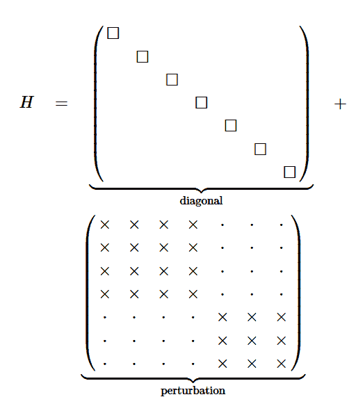

然后将摄动部分写为$H_{1} + H_{2}$，因此$H = H_{0} + H_{0} + H_{2}$，其中$H_{0}$是对角矩阵、$H_{0}$是块对角矩阵、$H_{2}$是非块对角矩阵，则：

可从块对角化$H$中找出一个算符$S$：

$$H_{\text{eff}} = e^{\text{iS}}He^{- iS} = \sum_{m = 0}^{\infty}{\frac{1}{m!}\lbrack H,S\rbrack^{(m)}} = \sum_{m = 0}^{\infty}{\lambda^{m}H^{(m)}}$$

其中$H^{(m)}$是$H$的逐次逼近（$H^{(0)} = H_{0}$），广义对易式被递归地定义为：

$$\lbrack H,S\rbrack^{\left( m \right)} = \lbrack\left\lbrack H,S\rbrack^{\left( m - 1 \right)},S \right\rbrack\text{\ \ \ \ }\text{with\ \ \ \ }\lbrack H,S\rbrack^{(0)} = H$$

此处，我们将$S$是为一个泰勒级数：

$$S = \sum_{m = 1}^{\infty}{\lambda^{m}S^{(m)}}$$

来持续跟踪阶$\lambda$。然后将有效的哈密顿量作为$H_{1} + H_{2}$的摄动扩展到$\lambda$中的第二阶：

$$H_{\text{eff}} = H_{0} + \lambda(H_{1} + H_{2}) + \lbrack H_{0} + \lambda(H_{1} + H_{2}),\lambda S^{(1)}\rbrack + \frac{1}{2}\lbrack\lbrack H_{0} + \lambda(H_{1} + H_{2}),\lambda S^{(1)}\rbrack,\lambda S^{(1)}\rbrack + \lbrack H_{0} + \lambda(H_{1} + H_{2}),\lambda^{2}S^{(2)}\rbrack + \ldots \approx H_{0} + \lambda(H_{1} + H_{2} + \lbrack H_{0},S^{(1)}\rbrack) + \lambda^{2}(\lbrack H_{1} + H_{2},S^{(1)}\rbrack + \frac{1}{2}\lbrack\lbrack H_{0},S^{(1)},\rbrack S^{(1)}\rbrack + \lbrack H_{0},S^{(2)}\rbrack)$$

至此，我们得出$S$必然为块非对角（block
off-diagonal）以及斜埃尔米特矩阵，迫使$H_{\text{eff}}$的对角线元素消失。因此我们得出：

$$H_{\text{eff}}^{\text{off} - \text{diag}} = \sum_{m = 0}^{\infty}{\frac{1}{\left( 2m + 1 \right)!}\lbrack\underset{\text{block\ diag}}{\overset{H_{0} + H_{1}}{︸}},S\rbrack^{\left( 2m + 1 \right)}} + \sum_{m = 0}^{\infty}{\frac{1}{\left( 2m \right)!}\lbrack\underset{\text{block\ off-diag}}{\overset{H_{2}}{︸}},S\rbrack^{\left( 2m \right)}} \equiv 0$$

可以看到第一个级数中的所有项均为块对角，而第二个级数中的所有项均为块非对角线。这是因为块对角矩阵和块非对角矩阵的对易式是块非对角矩阵，而两个块非对角矩阵的对易式是块对角矩阵。将其扩展到广义对易式后，我们就可以看到n为奇数时$\lbrack H^{0} + H^{1},S\rbrack^{(n)}$必为块非对角矩阵，n为偶数时$\lbrack H^{2},S\rbrack^{(n)}$必为块对角矩阵。现在将哈密顿量的非对角部分扩展至其二阶子式：

$$H_{\text{eff}}^{\text{off} - \text{diag}} = \lbrack H_{0} + \lambda H_{1},\lambda S^{(1)}\rbrack + \lambda H_{2} + \lbrack H_{0} + \lambda H_{1},\lambda^{2}S^{(2)}\rbrack + \frac{1}{3!}{\lbrack H_{0} + \lambda H_{1},\lambda S^{(1)}\rbrack}^{(3)} + \frac{1}{2!}{\lbrack\lambda H_{2},\lambda S^{(1)}\rbrack}^{(2)} = \lambda(\lbrack H_{0},S^{(1)}\rbrack + H_{2}) + \lambda^{2}(\lbrack H_{1},S^{(1)}\rbrack + \lbrack H_{0},S^{(2)}\rbrack) + \ldots$$

由于$\lambda$的每一阶必然等于零，因此以下式确定$S(m)$：

$$\lbrack H_{0},S^{(1)}\rbrack = - H_{2}\lbrack H_{0},S^{(2)}\rbrack = - \lbrack H_{1},S^{(1)}\rbrack\lbrack H_{0},S^{(3)}\rbrack = - \lbrack H_{1},S^{(2)}\rbrack - \frac{1}{3}\lbrack\lbrack H_{2},S^{(1)}\rbrack,S^{(1)}\rbrack$$

其中我们的拟设为通过Winkler的工作保证这些等式唯一。则有效哈密顿量变为：

$$H_{\text{eff}} = H_{0} + H_{1} + \lbrack H_{2},S^{(1)}\rbrack + \frac{1}{2}\lbrack\lbrack H_{0},S^{(1)}\rbrack,S^{(1)}\rbrack + \ldots = H_{0} + H_{1} + \frac{1}{2}\lbrack H_{2},S^{(1)}\rbrack + \ldots$$

此处的有效哈密顿量是取$\lambda \rightarrow 1$的第二阶。

### 3. Jaynes-Cummings哈密顿量的块对角化

使用S-W变换会带入两个问题：

1.  找出正确的拟设；

2.  执行计算。

在大部分的示例中，拟设类似于生成非对角部分以及确认其为唯一（$\text{postori}$）。最近，arXiv上出现了名为《Schrieffer-Wolff变换的系统方法及其概括》的文章，其中系统地给出了拟设并将其应用于大部分系统（包括下面的Jaynes-Cumming
Hamiltonian）。

诸如，生成器$\eta = \lbrack H_{0},H_{2}\rbrack$。在不确定$\eta$的标量系数的情况下，可以将$S^{(1)}$计算为满足$\lbrack H_{0},\eta\rbrack = H_{2}$的特定$\eta$。因而$H_{0}$和$H_{2}$的厄米性（hermiticity）保证了$\eta$的非厄米性（anti-hermiticity），从而保证了$S^{(1)}$的非厄米性。

为了简化繁琐的计算，我们将会用到Python软件包sympy进行符号运算。

作为对于sympy的说明，我们将会使用方法doit()、expand、normal_ordered_form以及qsimplify_pauli来实际执行对易式，将其展开至各个项中，对玻色子模式进行正常排序（在湮没之前产生），并简化Pauli代数。尝试用$\eta$生成：

分别以$A$和$B$作为$a^{\dagger}\sigma_{-}$和$a\sigma_{+}$的系数，则对易式将变为：

该表达式应等于$H_{2}$：

表明$A = B = g/\Delta$，其中$\Delta = \omega_{r} - \omega_{q}$是谐振器和量子比特间的频率失谐。因此$S^{(1)}$被确定为：

然后就可以计算出对$H_{0}$的有效二阶校正：

上式通常写成：

$$H_{\text{eff}} = (\omega_{r} + \frac{g^{2}}{\Delta}\sigma_{z})a^{\dagger}a - \frac{1}{2}(\omega_{q} - \frac{g^{2}}{\Delta})\sigma_{z}$$

### 4. 全Transmon

由于我们用transmon代替了量子比特，所以在设计和模拟设备时需要非常小心地处理高阶能级项带入的影响。耦合至读取谐振器的全Transmon哈密顿量为：

$$H^{\text{tr}} = \omega_{r}a^{\dagger}a + \sum_{j}^{}{\omega_{j}|j\rangle\langle j| + g(a^{\dagger}c + ac^{\dagger})}$$

其中此处的$c = \sum_{j}^{}{\sqrt{j + 1}|j\rangle\langle j + 1|}$为transmon下降算符。同样，将弱作用子集$A$作为偶数transmon模式，将$B$作为奇数transmon模式。采用拟设：

$$S^{(1)} = \sum_{j}^{}{\alpha_{j}a^{\dagger}\sqrt{j + 1}|j\rangle\langle j + 1| - \alpha_{j}^{*}a\sqrt{j + 1}|j + 1\rangle\langle j|}$$

有人能会沿用Jaynes-Cummings哈密顿量的杂乱版本。通过一些努力，可以证明二阶有效哈密顿量为：

$$H_{\text{eff}}^{\text{tr}} = (\omega_{r} + \sum_{j}^{}{\frac{g^{2}(\omega_{r} - \omega + \delta)}{(\omega_{r} - \omega - \delta j)(\omega_{r} - \omega - \delta(j - 1))}|j\rangle\langle j|)a^{\dagger}a} + \sum_{j}^{}{\lbrack j\omega + \frac{\delta}{2}(j - 1)j + \frac{jg^{2}}{\omega - \omega_{r} + (j - 1)\delta}\rbrack}|j\rangle\langle j|$$

### 5. 具有cQED的Qubit驱动

依据Blais等人于2004发表的[文章](https://arxiv.org/pdf/cond-mat/0402216.pdf)，我们将驱动的哈密顿量建模为：

$$H^{d}(t) = \xi(t)(a^{\dagger}e^{- i\omega_{d}t} + ae^{i\omega_{d}t})$$

依据Lev
Bishop博士[论文](https://arxiv.org/ftp/arxiv/papers/1007/1007.3520.pdf)中的处理方法，驱动通过Glauber算符作用于量子比特：

$$D(\alpha) = e^{\alpha(t)a^{\dagger} - \alpha^{*}(t)a}$$

我们来看看在驱动频率下旋转的Jaynes-Cumming哈密顿量：

$$H = \Delta_{r}a^{\dagger}a - \frac{1}{2}\Delta_{q}\sigma^{z} + g(a^{\dagger}\sigma^{-} + a\sigma^{+}) + \xi(t)(a^{\dagger} + a)$$

其中$\Delta_{r} = \omega_{r} - \omega_{d}$，$\Delta_{q} = \omega_{q} - \omega_{d}$。将阿达玛引理应用于嵌套对易式：

$$e^{A}BA^{- A} = B + \lbrack A,B\rbrack + \frac{1}{2!}\lbrack A,\lbrack A,B\rbrack\rbrack + \frac{1}{3!}\lbrack A,\lbrack A,\lbrack A,B\rbrack\rbrack\rbrack + \ldots$$

我们会看到：

$$D^{\dagger}a^{( \dagger )}D = \exp\{ - \alpha(t)a^{\dagger} + \alpha^{*}(t)a\} a^{( \dagger )}\exp\{\alpha(t)a^{\dagger} - \alpha^{*}(t)a\} = a^{( \dagger )} + \lbrack - \alpha(t)a^{\dagger} + \alpha^{*}(t)a,a^{( \dagger )}\rbrack + \frac{1}{2!}\lbrack - \alpha(t)a^{\dagger} + \alpha^{*}(t)a,\lbrack - \alpha(t)a^{\dagger} + \alpha^{*}(t)a,a^{( \dagger )}\rbrack\rbrack + \ldots = a^{( \dagger )} + \alpha^{(*)}$$

以及：

$$D^{\dagger}a^{\dagger}aD = a^{\dagger}a + \lbrack - \alpha(t)a^{\dagger} + \alpha^{*}(t)a,a^{\dagger}a\rbrack + \frac{1}{2!}\lbrack - \alpha(t)a^{\dagger} + \alpha^{*}(t)a,\lbrack - \alpha(t)a^{\dagger} + \alpha^{*}(t)a,a^{\dagger}a\rbrack\rbrack + \ldots = a^{\dagger}a + \alpha(t)a^{\dagger} + \alpha^{*}(t)a + |\alpha(t)|^{2}$$

因此我们可以将这一哈密顿量变换为：

$$\overset{\sim}{H} = D^{\dagger}HD - iD^{\dagger}\overset{˙}{D} = \Delta_{r}(a^{\dagger}a + \alpha(t)a^{\dagger} + \alpha^{*}(t)a + |\alpha(t)|^{2}) - \frac{1}{2}\Delta_{q}\sigma^{z} + g((a^{\dagger} + \alpha^{*}(t))\sigma^{-} + (a + \alpha(t))\sigma^{+}) + \xi(t)(a^{\dagger} + \alpha^{*}(t) + a + \alpha(t)) - i(\overset{˙}{\alpha}(t)a^{\dagger} - {\overset{˙}{\alpha}}^{*}(t)a) = \Delta_{r}a^{\dagger}a - \frac{1}{2}\Delta_{q}\sigma^{z} + g((a^{\dagger} + \alpha^{*}(t))\sigma^{-} + (a + \alpha(t))\sigma^{+}) + \xi(t)(a^{\dagger} + a) + \Delta_{r}(\alpha(t)a^{\dagger} + \alpha^{*}(t)a) - i(\overset{˙}{\alpha}(t)a^{\dagger} - {\overset{˙}{\alpha}}^{*}(t)a)$$

去掉了非算符项。最后一行可以设置为零，如：

$$- i\overset{˙}{\alpha}(t) + \Delta_{r}\alpha(t) + \xi(t) = 0$$

引入Rabi频率$\Omega(t) = 2g\alpha(t)$后得到：

$$\overset{\sim}{H} = \Delta_{r}a^{\dagger}a - \frac{1}{2}\Delta_{q}\sigma^{z} + g(a^{\dagger}\sigma^{-} + a\sigma^{+}) + \frac{1}{2}(\Omega^{*}(t)\sigma^{-} + \Omega(t)\sigma^{+})$$

由于哈密顿量的驱动部分是块非对角线矩阵，因此对于真实驱动$\Omega^{*}(t) = \Omega(t)$我们可以对其进行Schrieffer-Wolff变换，并将其添加到有效哈密顿量中：

$$\lbrack{\overset{\sim}{H}}^{d},S^{(1)}\rbrack = - \frac{\Omega(t)}{2}\lbrack(\sigma^{-} + \sigma^{+}),\frac{g}{\Delta}(a^{\dagger}\sigma^{-} - a\sigma^{+})\rbrack = \frac{g\Omega(t)}{2\Delta}(a + a^{\dagger})\sigma^{z}$$

因而，有效哈密顿量就变为：

$${\overset{\sim}{H}}_{\text{eff}} = (\Delta_{r} + \frac{g^{2}}{\Delta}\sigma^{z})a^{\dagger}a - \frac{1}{2}(\Delta_{q} - \frac{g^{2}}{\Delta})\sigma^{z} + \frac{\Omega(t)}{2}\sigma^{x} + \frac{g\Omega(t)}{4\Delta}(a + a^{\dagger})\sigma^{z}$$

此处可以看到若要消除$z$旋转，需要在经Lamb移位（Lamb-shifted）的量子比特频率上施加驱动。由于在频散状况下$\Delta \gg g$，附加项$\sigma^{z}$很小。

### 6. 交叉谐振纠缠量子门

以量子态比特2的频率驱动量子比1可以写成：

$$H^{d}(t) = \frac{\Omega(t)}{2}(\sigma_{1}^{+}e^{- i{\overset{\sim}{\omega}}_{2}t} + \sigma_{1}^{-}e^{i{\overset{\sim}{\omega}}_{2}t}).$$

现在，我们需要将Schrieffer-Wolff施加在驱动项上来获得有效的哈密顿量，然后在频率${\overset{\sim}{\omega}}_{2}$处进行RWA（旋转波近似
Rotating Wave Approximation）。

$$\lbrack{\overset{\sim}{H}}^{d},S^{(1)}\rbrack = - \frac{J\Omega(t)}{2\Delta_{12}}\lbrack\sigma_{1}^{+}e^{- i{\overset{\sim}{\omega}}_{2}t} + \sigma_{1}^{-}e^{i{\overset{\sim}{\omega}}_{2}t},\sigma_{1}^{+}\sigma_{2}^{-} - \sigma_{2}^{+}\sigma_{1}^{-}\rbrack = - \frac{J\Omega(t)}{2\Delta_{12}}(\sigma_{1}^{z}\sigma_{2}^{+}e^{- i{\overset{\sim}{\omega}}_{2}t} + \sigma_{1}^{z}\sigma_{2}^{-}e^{i{\overset{\sim}{\omega}}_{2}t})$$

通过在$\omega_{2}$出变换会旋转帧，我们会得到有效的量子比特交叉谐振哈密顿量：

$${\overset{\sim}{H}}_{\text{eff}}^{\text{CR}} = - \frac{{\overset{\sim}{\omega}}_{1} - {\overset{\sim}{\omega}}_{2}}{2}\sigma_{1}^{z} + \frac{\Omega(t)}{2}(\sigma_{2}^{x} - \frac{J}{2\Delta_{12}}\sigma_{1}^{z}\sigma_{2}^{x}).$$

前两项涉及由于量子比特1上的Stark移位和量子比特2上的无条件$\text{IX}$旋转而引起的$\text{ZI}$交互，但是最后一项呈现了产生纠缠的$\text{ZX}$-交互。通过将量子比特1置于$|0\rangle$和$|1\rangle$的等同叠加，并在与绕$x$轴进行$\pi/2$旋转相对应的持续时间内施加交叉谐振门，便产生了最大的纠缠态。用Qiskit表征transmon的双量子比特交叉谐振哈密顿量的过程可在[Github](https://github.com/Qiskit/qiskit-tutorials/blob/9405254b38312771f8d5c2dd6f451cec35307995/tutorials/noise/1_hamiltonian_and_gate_characterization.ipynb)上找到。关于交叉谐振量子门的补充阅读资料：

1\. [A simple all-microwave entangling gate for fixed-frequency
superconducting qubits](https://arxiv.org/abs/1106.0553)

2\. [Procedure for systematically tuning up crosstalk in the cross
resonance gate](https://arxiv.org/abs/1603.04821)
