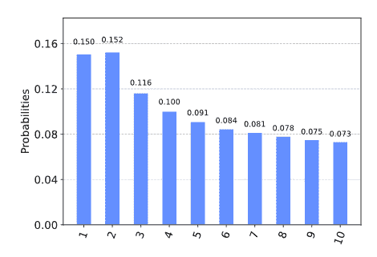
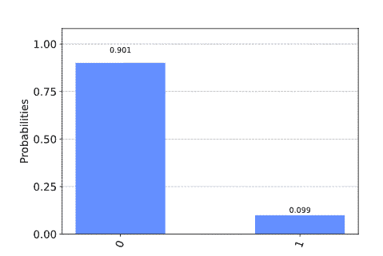

7. 问题集与练习
===============

若要完全理解本教程中的概念，就需要解答尽可能多的问题。除了贯穿各章的快速练习之外，本教程还提供了涵盖所涉及主题的问题集。我们将在相关章节的末尾给出这些文件的链接，为了您可以轻松地进行查找，此处将其再次列出。

问题集 1：带有量子回路的经典逻辑门
---------------------------------

使用非门（在 Qiskit 中表示为 x），受控非门（在 Qiskit 中表示为 cx）和 Toffoli 门（在 Qiskit 中表示为 ccx）创建可以实现异或、与、与非以及或门的函数。

以非门的实现为例。

### NOT gate（非门）

此函数接受二进制字符串输入（"0"或"1"）并返回相反的二进制输出。

### 异或门（XOR gate）

接受两个二进制字符串作为输入，并给出一个输出。

当输入相等时，输出为"0"，否则为"1"。

### 与门（AND gate）

接受两个二进制字符串作为输入，并给出一个输出。

只有当两个输入都为"1"时，输出才为"1"。

### 与非门（NAND gate）

接受两个二进制字符串作为输入，并给出一个输出。

只有当两个输入都为"1"时，输出才为"0"。

### 或门（OR gate）

接受两个二进制字符串作为输入，并给出一个输出。

如果有一个输入是"1"，则输出是"1"。

### 测试

下面的代码通过对上述函数导入所有可能输入来检其是否有效。

问题集 2：单量子比特门的基本合成
-------------------------------

### 1

阿达玛门（Hadamard gate）可以写成以下两种形式：

$$H = \frac{X + Z}{\sqrt{2}} \equiv \exp(i\frac{\pi}{2}\frac{X + Z}{\sqrt{2}})$$

此处的$\equiv$被用来表示在全局相位之前等式有效，因此所产生的量子门在物理上等效。

提示：对于任何本征值均为±1 的矩阵，很容易证明$e^{i\frac{\pi}{2}M} \equiv M$，并且此类矩阵唯一满足$M^{2} = I$。

### 2

Hadamard 门可以通过 rx 和 rz 操作构造：

$$R_{x}\left( \theta \right) = e^{i\frac{\theta}{2}X}\ ,\text{\ R}_{z}\left( \theta \right) = e^{i\frac{\theta}{2}Z}$$

$$H \equiv \lim_{n \rightarrow \infty}\left( R_{x}\left( \frac{\theta}{n} \right)R_{z}\left( \frac{\theta}{n} \right) \right)^{n}$$

对于一些适当选择的$\theta$,当实现为有限的$n$时，最终的量子门将近似于 Hadamard 门，其误差随$n$减小而减少。

下面展示了一个使用 Qiskit 实施的示例，该示例使用错误选择的$\theta$值并且忽略了全局相位。

-   确定$\theta$的正确值

-   当使用正确的$\theta$值时，证明误差以$n$的二次方减小。

### 3

可以从以下公式中找到近似值的改进版本：

$$H \equiv \lim_{n \rightarrow \infty}\left( R_{z}\left( \frac{\theta}{2n} \right)R_{x}\left( \frac{\theta}{n} \right)R_{z}\left( \frac{\theta}{2n} \right) \right)^{n}\ $$

将其实现，并研究误差的缩放比例。

问题集 3：构建最佳与门
---------------------

在问题集 1 中创建了带有量子门的与门。在这里您将在真实设备上再次执行相同操作。真实量子设备包含两个主要的限制：连通性、噪声。

连通性告诉您可以直接执行哪些 cx 门。例如，设备 ibmq_5\_tenerife 具有从 0 到 4 编号的五个量子比特。其连通性由下式定义：

$$coupling\_ map = \lbrack\lbrack 1,\ 0\rbrack,\ \lbrack 2,\ 0\rbrack,\ \lbrack 2,\ 1\rbrack,\ \lbrack 3,\ 2\rbrack,\ \lbrack 3,\ 4\rbrack,\ \lbrack 4,\ 2\rbrack\rbrack$$

此处的\[1,0\]告诉我们可以实现以量子比特 1 作为控制，以量子比特 0 为目标的 cx（受控非门），\[2,0\]告诉我们可以以量子比特 2 作为控制，以量子比特 0 为目标，依此类推。以上设备都可以直接实现 cx 门。

*设备的"噪音"是所有不该发生但仍会发生事物的集体效应。*噪声导致输出结果并不总如我们所期望。量子回路中的所有过程（准备初始状态，应用量子门和测量输出）都包含噪声。对于量子门来说，噪声水平可以在不同的门之间以及在不同的量子比特之间变化。通常而言，cx 门比任何单量子比特门都更嘈杂。

我们还可以使用噪声模型来模拟噪声。而且，我们可以依据对真实设备噪声的测量来设置噪声模型。以下的噪声模型基于 ibmq_5\_tenerife。

noise_dict = {\'errors\': \[{\'type\': \'qerror\', \'operations\':
\[\'u2\'\], \'instructions\': \[\[{\'name\': \'x\', \'qubits\':
\[0\]}\], \[{\'name\': \'y\', \'qubits\': \[0\]}\], \[{\'name\': \'z\',
\'qubits\': \[0\]}\], \[{\'name\': \'id\', \'qubits\': \[0\]}\]\],
\'probabilities\': \[0.0004721766167523067, 0.0004721766167523067,
0.0004721766167523067, 0.9985834701497431\], \'gate_qubits\':
\[\[0\]\]}, {\'type\': \'qerror\', \'operations\': \[\'u2\'\],
\'instructions\': \[\[{\'name\': \'x\', \'qubits\': \[0\]}\],
\[{\'name\': \'y\', \'qubits\': \[0\]}\], \[{\'name\': \'z\',
\'qubits\': \[0\]}\], \[{\'name\': \'id\', \'qubits\': \[0\]}\]\],
\'probabilities\': \[0.0005151090708174488, 0.0005151090708174488,
0.0005151090708174488, 0.9984546727875476\], \'gate_qubits\':
\[\[1\]\]}, {\'type\': \'qerror\', \'operations\': \[\'u2\'\],
\'instructions\': \[\[{\'name\': \'x\', \'qubits\': \[0\]}\],
\[{\'name\': \'y\', \'qubits\': \[0\]}\], \[{\'name\': \'z\',
\'qubits\': \[0\]}\], \[{\'name\': \'id\', \'qubits\': \[0\]}\]\],
\'probabilities\': \[0.0005151090708174488, 0.0005151090708174488,
0.0005151090708174488, 0.9984546727875476\], \'gate_qubits\':
\[\[2\]\]}, {\'type\': \'qerror\', \'operations\': \[\'u2\'\],
\'instructions\': \[\[{\'name\': \'x\', \'qubits\': \[0\]}\],
\[{\'name\': \'y\', \'qubits\': \[0\]}\], \[{\'name\': \'z\',
\'qubits\': \[0\]}\], \[{\'name\': \'id\', \'qubits\': \[0\]}\]\],
\'probabilities\': \[0.000901556048412383, 0.000901556048412383,
0.000901556048412383, 0.9972953318547628\], \'gate_qubits\': \[\[3\]\]},
{\'type\': \'qerror\', \'operations\': \[\'u2\'\], \'instructions\':
\[\[{\'name\': \'x\', \'qubits\': \[0\]}\], \[{\'name\': \'y\',
\'qubits\': \[0\]}\], \[{\'name\': \'z\', \'qubits\': \[0\]}\],
\[{\'name\': \'id\', \'qubits\': \[0\]}\]\], \'probabilities\':
\[0.0011592423249461303, 0.0011592423249461303, 0.0011592423249461303,
0.9965222730251616\], \'gate_qubits\': \[\[4\]\]}, {\'type\':
\'qerror\', \'operations\': \[\'u3\'\], \'instructions\': \[\[{\'name\':
\'x\', \'qubits\': \[0\]}\], \[{\'name\': \'y\', \'qubits\': \[0\]}\],
\[{\'name\': \'z\', \'qubits\': \[0\]}\], \[{\'name\': \'id\',
\'qubits\': \[0\]}\]\], \'probabilities\': \[0.0009443532335046134,
0.0009443532335046134, 0.0009443532335046134, 0.9971669402994862\],
\'gate_qubits\': \[\[0\]\]}, {\'type\': \'qerror\', \'operations\':
\[\'u3\'\], \'instructions\': \[\[{\'name\': \'x\', \'qubits\':
\[0\]}\], \[{\'name\': \'y\', \'qubits\': \[0\]}\], \[{\'name\': \'z\',
\'qubits\': \[0\]}\], \[{\'name\': \'id\', \'qubits\': \[0\]}\]\],
\'probabilities\': \[0.0010302181416348977, 0.0010302181416348977,
0.0010302181416348977, 0.9969093455750953\], \'gate_qubits\':
\[\[1\]\]}, {\'type\': \'qerror\', \'operations\': \[\'u3\'\],
\'instructions\': \[\[{\'name\': \'x\', \'qubits\': \[0\]}\],
\[{\'name\': \'y\', \'qubits\': \[0\]}\], \[{\'name\': \'z\',
\'qubits\': \[0\]}\], \[{\'name\': \'id\', \'qubits\': \[0\]}\]\],
\'probabilities\': \[0.0010302181416348977, 0.0010302181416348977,
0.0010302181416348977, 0.9969093455750953\], \'gate_qubits\':
\[\[2\]\]}, {\'type\': \'qerror\', \'operations\': \[\'u3\'\],
\'instructions\': \[\[{\'name\': \'x\', \'qubits\': \[0\]}\],
\[{\'name\': \'y\', \'qubits\': \[0\]}\], \[{\'name\': \'z\',
\'qubits\': \[0\]}\], \[{\'name\': \'id\', \'qubits\': \[0\]}\]\],
\'probabilities\': \[0.001803112096824766, 0.001803112096824766,
0.001803112096824766, 0.9945906637095256\], \'gate_qubits\': \[\[3\]\]},
{\'type\': \'qerror\', \'operations\': \[\'u3\'\], \'instructions\':
\[\[{\'name\': \'x\', \'qubits\': \[0\]}\], \[{\'name\': \'y\',
\'qubits\': \[0\]}\], \[{\'name\': \'z\', \'qubits\': \[0\]}\],
\[{\'name\': \'id\', \'qubits\': \[0\]}\]\], \'probabilities\':
\[0.0023184846498922607, 0.0023184846498922607, 0.0023184846498922607,
0.9930445460503232\], \'gate_qubits\': \[\[4\]\]}, {\'type\':
\'qerror\', \'operations\': \[\'cx\'\], \'instructions\': \[\[{\'name\':
\'x\', \'qubits\': \[0\]}\], \[{\'name\': \'y\', \'qubits\': \[0\]}\],
\[{\'name\': \'z\', \'qubits\': \[0\]}\], \[{\'name\': \'x\',
\'qubits\': \[1\]}\], \[{\'name\': \'x\', \'qubits\': \[0\]}, {\'name\':
\'x\', \'qubits\': \[1\]}\], \[{\'name\': \'y\', \'qubits\': \[0\]},
{\'name\': \'x\', \'qubits\': \[1\]}\], \[{\'name\': \'z\', \'qubits\':
\[0\]}, {\'name\': \'x\', \'qubits\': \[1\]}\], \[{\'name\': \'y\',
\'qubits\': \[1\]}\], \[{\'name\': \'x\', \'qubits\': \[0\]}, {\'name\':
\'y\', \'qubits\': \[1\]}\], \[{\'name\': \'y\', \'qubits\': \[0\]},
{\'name\': \'y\', \'qubits\': \[1\]}\], \[{\'name\': \'z\', \'qubits\':
\[0\]}, {\'name\': \'y\', \'qubits\': \[1\]}\], \[{\'name\': \'z\',
\'qubits\': \[1\]}\], \[{\'name\': \'x\', \'qubits\': \[0\]}, {\'name\':
\'z\', \'qubits\': \[1\]}\], \[{\'name\': \'y\', \'qubits\': \[0\]},
{\'name\': \'z\', \'qubits\': \[1\]}\], \[{\'name\': \'z\', \'qubits\':
\[0\]}, {\'name\': \'z\', \'qubits\': \[1\]}\], \[{\'name\': \'id\',
\'qubits\': \[0\]}\]\], \'probabilities\': \[0.002182844139394187,
0.002182844139394187, 0.002182844139394187, 0.002182844139394187,
0.002182844139394187, 0.002182844139394187, 0.002182844139394187,
0.002182844139394187, 0.002182844139394187, 0.002182844139394187,
0.002182844139394187, 0.002182844139394187, 0.002182844139394187,
0.002182844139394187, 0.002182844139394187, 0.9672573379090872\],
\'gate_qubits\': \[\[1, 0\]\]}, {\'type\': \'qerror\', \'operations\':
\[\'cx\'\], \'instructions\': \[\[{\'name\': \'x\', \'qubits\':
\[0\]}\], \[{\'name\': \'y\', \'qubits\': \[0\]}\], \[{\'name\': \'z\',
\'qubits\': \[0\]}\], \[{\'name\': \'x\', \'qubits\': \[1\]}\],
\[{\'name\': \'x\', \'qubits\': \[0\]}, {\'name\': \'x\', \'qubits\':
\[1\]}\], \[{\'name\': \'y\', \'qubits\': \[0\]}, {\'name\': \'x\',
\'qubits\': \[1\]}\], \[{\'name\': \'z\', \'qubits\': \[0\]}, {\'name\':
\'x\', \'qubits\': \[1\]}\], \[{\'name\': \'y\', \'qubits\': \[1\]}\],
\[{\'name\': \'x\', \'qubits\': \[0\]}, {\'name\': \'y\', \'qubits\':
\[1\]}\], \[{\'name\': \'y\', \'qubits\': \[0\]}, {\'name\': \'y\',
\'qubits\': \[1\]}\], \[{\'name\': \'z\', \'qubits\': \[0\]}, {\'name\':
\'y\', \'qubits\': \[1\]}\], \[{\'name\': \'z\', \'qubits\': \[1\]}\],
\[{\'name\': \'x\', \'qubits\': \[0\]}, {\'name\': \'z\', \'qubits\':
\[1\]}\], \[{\'name\': \'y\', \'qubits\': \[0\]}, {\'name\': \'z\',
\'qubits\': \[1\]}\], \[{\'name\': \'z\', \'qubits\': \[0\]}, {\'name\':
\'z\', \'qubits\': \[1\]}\], \[{\'name\': \'id\', \'qubits\':
\[0\]}\]\], \'probabilities\': \[0.0020007412998552473,
0.0020007412998552473, 0.0020007412998552473, 0.0020007412998552473,
0.0020007412998552473, 0.0020007412998552473, 0.0020007412998552473,
0.0020007412998552473, 0.0020007412998552473, 0.0020007412998552473,
0.0020007412998552473, 0.0020007412998552473, 0.0020007412998552473,
0.0020007412998552473, 0.0020007412998552473, 0.9699888805021712\],
\'gate_qubits\': \[\[2, 0\]\]}, {\'type\': \'qerror\', \'operations\':
\[\'cx\'\], \'instructions\': \[\[{\'name\': \'x\', \'qubits\':
\[0\]}\], \[{\'name\': \'y\', \'qubits\': \[0\]}\], \[{\'name\': \'z\',
\'qubits\': \[0\]}\], \[{\'name\': \'x\', \'qubits\': \[1\]}\],
\[{\'name\': \'x\', \'qubits\': \[0\]}, {\'name\': \'x\', \'qubits\':
\[1\]}\], \[{\'name\': \'y\', \'qubits\': \[0\]}, {\'name\': \'x\',
\'qubits\': \[1\]}\], \[{\'name\': \'z\', \'qubits\': \[0\]}, {\'name\':
\'x\', \'qubits\': \[1\]}\], \[{\'name\': \'y\', \'qubits\': \[1\]}\],
\[{\'name\': \'x\', \'qubits\': \[0\]}, {\'name\': \'y\', \'qubits\':
\[1\]}\], \[{\'name\': \'y\', \'qubits\': \[0\]}, {\'name\': \'y\',
\'qubits\': \[1\]}\], \[{\'name\': \'z\', \'qubits\': \[0\]}, {\'name\':
\'y\', \'qubits\': \[1\]}\], \[{\'name\': \'z\', \'qubits\': \[1\]}\],
\[{\'name\': \'x\', \'qubits\': \[0\]}, {\'name\': \'z\', \'qubits\':
\[1\]}\], \[{\'name\': \'y\', \'qubits\': \[0\]}, {\'name\': \'z\',
\'qubits\': \[1\]}\], \[{\'name\': \'z\', \'qubits\': \[0\]}, {\'name\':
\'z\', \'qubits\': \[1\]}\], \[{\'name\': \'id\', \'qubits\':
\[0\]}\]\], \'probabilities\': \[0.002485439516158936,
0.002485439516158936, 0.002485439516158936, 0.002485439516158936,
0.002485439516158936, 0.002485439516158936, 0.002485439516158936,
0.002485439516158936, 0.002485439516158936, 0.002485439516158936,
0.002485439516158936, 0.002485439516158936, 0.002485439516158936,
0.002485439516158936, 0.002485439516158936, 0.9627184072576159\],
\'gate_qubits\': \[\[2, 1\]\]}, {\'type\': \'qerror\', \'operations\':
\[\'cx\'\], \'instructions\': \[\[{\'name\': \'x\', \'qubits\':
\[0\]}\], \[{\'name\': \'y\', \'qubits\': \[0\]}\], \[{\'name\': \'z\',
\'qubits\': \[0\]}\], \[{\'name\': \'x\', \'qubits\': \[1\]}\],
\[{\'name\': \'x\', \'qubits\': \[0\]}, {\'name\': \'x\', \'qubits\':
\[1\]}\], \[{\'name\': \'y\', \'qubits\': \[0\]}, {\'name\': \'x\',
\'qubits\': \[1\]}\], \[{\'name\': \'z\', \'qubits\': \[0\]}, {\'name\':
\'x\', \'qubits\': \[1\]}\], \[{\'name\': \'y\', \'qubits\': \[1\]}\],
\[{\'name\': \'x\', \'qubits\': \[0\]}, {\'name\': \'y\', \'qubits\':
\[1\]}\], \[{\'name\': \'y\', \'qubits\': \[0\]}, {\'name\': \'y\',
\'qubits\': \[1\]}\], \[{\'name\': \'z\', \'qubits\': \[0\]}, {\'name\':
\'y\', \'qubits\': \[1\]}\], \[{\'name\': \'z\', \'qubits\': \[1\]}\],
\[{\'name\': \'x\', \'qubits\': \[0\]}, {\'name\': \'z\', \'qubits\':
\[1\]}\], \[{\'name\': \'y\', \'qubits\': \[0\]}, {\'name\': \'z\',
\'qubits\': \[1\]}\], \[{\'name\': \'z\', \'qubits\': \[0\]}, {\'name\':
\'z\', \'qubits\': \[1\]}\], \[{\'name\': \'id\', \'qubits\':
\[0\]}\]\], \'probabilities\': \[0.0037502825428055767,
0.0037502825428055767, 0.0037502825428055767, 0.0037502825428055767,
0.0037502825428055767, 0.0037502825428055767, 0.0037502825428055767,
0.0037502825428055767, 0.0037502825428055767, 0.0037502825428055767,
0.0037502825428055767, 0.0037502825428055767, 0.0037502825428055767,
0.0037502825428055767, 0.0037502825428055767, 0.9437457618579164\],
\'gate_qubits\': \[\[3, 2\]\]}, {\'type\': \'qerror\', \'operations\':
\[\'cx\'\], \'instructions\': \[\[{\'name\': \'x\', \'qubits\':
\[0\]}\], \[{\'name\': \'y\', \'qubits\': \[0\]}\], \[{\'name\': \'z\',
\'qubits\': \[0\]}\], \[{\'name\': \'x\', \'qubits\': \[1\]}\],
\[{\'name\': \'x\', \'qubits\': \[0\]}, {\'name\': \'x\', \'qubits\':
\[1\]}\], \[{\'name\': \'y\', \'qubits\': \[0\]}, {\'name\': \'x\',
\'qubits\': \[1\]}\], \[{\'name\': \'z\', \'qubits\': \[0\]}, {\'name\':
\'x\', \'qubits\': \[1\]}\], \[{\'name\': \'y\', \'qubits\': \[1\]}\],
\[{\'name\': \'x\', \'qubits\': \[0\]}, {\'name\': \'y\', \'qubits\':
\[1\]}\], \[{\'name\': \'y\', \'qubits\': \[0\]}, {\'name\': \'y\',
\'qubits\': \[1\]}\], \[{\'name\': \'z\', \'qubits\': \[0\]}, {\'name\':
\'y\', \'qubits\': \[1\]}\], \[{\'name\': \'z\', \'qubits\': \[1\]}\],
\[{\'name\': \'x\', \'qubits\': \[0\]}, {\'name\': \'z\', \'qubits\':
\[1\]}\], \[{\'name\': \'y\', \'qubits\': \[0\]}, {\'name\': \'z\',
\'qubits\': \[1\]}\], \[{\'name\': \'z\', \'qubits\': \[0\]}, {\'name\':
\'z\', \'qubits\': \[1\]}\], \[{\'name\': \'id\', \'qubits\':
\[0\]}\]\], \'probabilities\': \[0.004401224333760022,
0.004401224333760022, 0.004401224333760022, 0.004401224333760022,
0.004401224333760022, 0.004401224333760022, 0.004401224333760022,
0.004401224333760022, 0.004401224333760022, 0.004401224333760022,
0.004401224333760022, 0.004401224333760022, 0.004401224333760022,
0.004401224333760022, 0.004401224333760022, 0.9339816349935997\],
\'gate_qubits\': \[\[3, 4\]\]}, {\'type\': \'qerror\', \'operations\':
\[\'cx\'\], \'instructions\': \[\[{\'name\': \'x\', \'qubits\':
\[0\]}\], \[{\'name\': \'y\', \'qubits\': \[0\]}\], \[{\'name\': \'z\',
\'qubits\': \[0\]}\], \[{\'name\': \'x\', \'qubits\': \[1\]}\],
\[{\'name\': \'x\', \'qubits\': \[0\]}, {\'name\': \'x\', \'qubits\':
\[1\]}\], \[{\'name\': \'y\', \'qubits\': \[0\]}, {\'name\': \'x\',
\'qubits\': \[1\]}\], \[{\'name\': \'z\', \'qubits\': \[0\]}, {\'name\':
\'x\', \'qubits\': \[1\]}\], \[{\'name\': \'y\', \'qubits\': \[1\]}\],
\[{\'name\': \'x\', \'qubits\': \[0\]}, {\'name\': \'y\', \'qubits\':
\[1\]}\], \[{\'name\': \'y\', \'qubits\': \[0\]}, {\'name\': \'y\',
\'qubits\': \[1\]}\], \[{\'name\': \'z\', \'qubits\': \[0\]}, {\'name\':
\'y\', \'qubits\': \[1\]}\], \[{\'name\': \'z\', \'qubits\': \[1\]}\],
\[{\'name\': \'x\', \'qubits\': \[0\]}, {\'name\': \'z\', \'qubits\':
\[1\]}\], \[{\'name\': \'y\', \'qubits\': \[0\]}, {\'name\': \'z\',
\'qubits\': \[1\]}\], \[{\'name\': \'z\', \'qubits\': \[0\]}, {\'name\':
\'z\', \'qubits\': \[1\]}\], \[{\'name\': \'id\', \'qubits\':
\[0\]}\]\], \'probabilities\': \[0.0046188825262438934,
0.0046188825262438934, 0.0046188825262438934, 0.0046188825262438934,
0.0046188825262438934, 0.0046188825262438934, 0.0046188825262438934,
0.0046188825262438934, 0.0046188825262438934, 0.0046188825262438934,
0.0046188825262438934, 0.0046188825262438934, 0.0046188825262438934,
0.0046188825262438934, 0.0046188825262438934, 0.9307167621063416\],
\'gate_qubits\': \[\[4, 2\]\]}, {\'type\': \'roerror\', \'operations\':
\[\'measure\'\], \'probabilities\': \[\[0.9372499999999999,
0.06275000000000008\], \[0.06275000000000008, 0.9372499999999999\]\],
\'gate_qubits\': \[\[0\]\]}, {\'type\': \'roerror\', \'operations\':
\[\'measure\'\], \'probabilities\': \[\[0.9345, 0.0655\], \[0.0655,
0.9345\]\], \'gate_qubits\': \[\[1\]\]}, {\'type\': \'roerror\',
\'operations\': \[\'measure\'\], \'probabilities\': \[\[0.97075,
0.029249999999999998\], \[0.029249999999999998, 0.97075\]\],
\'gate_qubits\': \[\[2\]\]}, {\'type\': \'roerror\', \'operations\':
\[\'measure\'\], \'probabilities\': \[\[0.9742500000000001,
0.02574999999999994\], \[0.02574999999999994, 0.9742500000000001\]\],
\'gate_qubits\': \[\[3\]\]}, {\'type\': \'roerror\', \'operations\':
\[\'measure\'\], \'probabilities\': \[\[0.8747499999999999,
0.12525000000000008\], \[0.12525000000000008, 0.8747499999999999\]\],
\'gate_qubits\': \[\[4\]\]}\], \'x90_gates\': \[\]}

noise_model = noise.noise_model.NoiseModel.from_dict( noise_dict )

直接在真实设备上运行需要有一个 IBMQ 帐户，并在程序中登录该帐户。为了不用担心这些问题，我们将使用由上述约束定义的 5-qubit 设备的模拟（本地运行）。

现在定义 AND 函数，此处与练习 1 中的版本有一些区别。首先，由于是在 5-qubit 回路上定义，因此需要确定 5-qubit 中的哪一个用于编码 input1，input2 以及 output。其次，输出为重复运行 10000 次所发现输出的次数直方图。

例如，这是两个输入均为 0 时的结果。

比较所有结果，以便找出最不可靠的一个。

上面的 AND 函数使用 ccx 门来执行所需的操作。但您现在已经知道如何构建所需，找出另一种实现 AND 的方法，其最低概率要高于 ccx。
